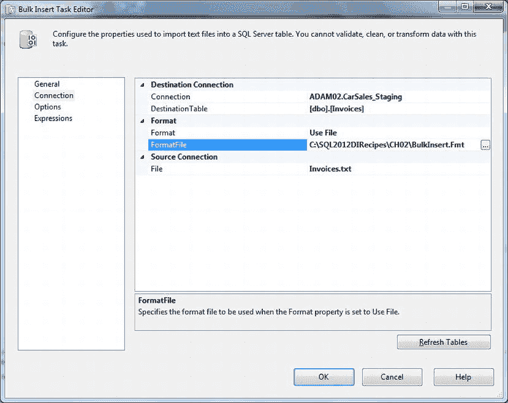
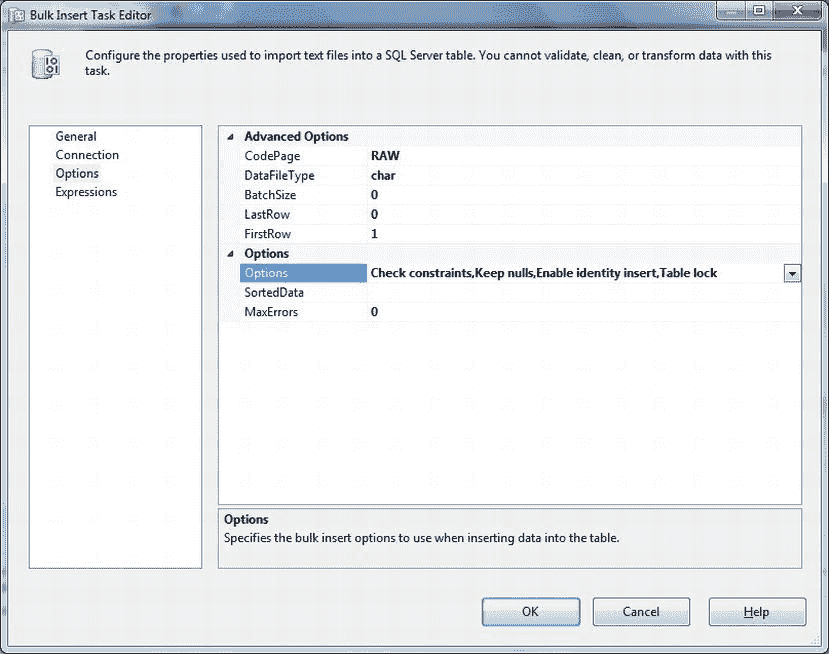

# 2-14. 从 SSIS 执行 BULK INSERT

## 问题

你希望从 SSIS 进程内部获得 `BULK INSERT` 提供的额外速度。

## 解决方案

使用 SSIS `BULK INSERT` 任务在 SSIS 进程中导入数据。具体方法如下：

1.  在 SSIS 包中，向“控制流”窗格添加一个 `BULK INSERT` 任务。双击以编辑该任务。
2.  单击左侧的“连接”以在右侧显示“连接”窗格。
3.  选择或创建目标连接。在本例中，目标是 CarSales_Staging 数据库。建立连接后，选择目标表（dbo.Invoices）。定义目标连接在配方 2-2 中有详细描述。
4.  选择到源文件的连接，或者如果不存在则创建它。
5.  如果使用格式文件，请创建或选择到格式文件的连接。最终结果应如图 2-14 所示。
    
    图 2-14。SSIS 中的批量插入连接详细信息
6.  在左侧列表中选择“选项”以显示“选项”窗格，如图 2-15 所示。
    
    图 2-15。SSIS 中的批量插入连接选项
7.  在此处，你可以设置 `BULK INSERT` 选项，如配方 2-12 中针对基于 T-SQL 的 `BULK INSERT` 所述。
8.  单击“确定”返回到“控制流”窗格。
9.  运行导入。

## 工作原理

使用 SSIS 批量插入任务允许你将文本数据极快地插入 SQL Server，它使用了配方 2-12 中描述的大多数选项。在这里，你实质上是将 SSIS 用作 T-SQL `BULK INSERT` 任务的“封装器”。与 T-SQL `BULK INSERT` 一样，格式文件不是必需的——除非需要列映射、跳过列、去除引号等操作。

在本配方中，我假设你知道如何创建 SSIS 连接管理器。如果不知道，请参考本书中的其他配方。你将需要一个目标表和一个格式文件（如果需要和/或正在使用）。

可以从“选项”下拉菜单中选择以下 `BULK INSERT` 选项：

*   保留空值 (`Keep Nulls`)
*   标识插入 (`Identity Insert`)
*   表锁 (`Table Lock`)
*   触发器激发 (`Fire Triggers`)
*   检查约束 (`Check Constraints`)

“排序”选项允许你指定源数据所依据的源列。如果目标表中排序列上存在聚集索引，这将加快导入速度。

#### 提示、技巧与陷阱

*   如果不使用格式文件，请在“连接”窗格中选择“指定”，然后为简单源文件选择行和列分隔符。
*   有关如何使用“批处理大小”、“首行”和“末行”选项，请参见配方 2-9。
*   由于这不过是对 `BULK INSERT` 命令的接口，因此格式文件的创建和指定与配方 2-11 中描述的完全相同。

