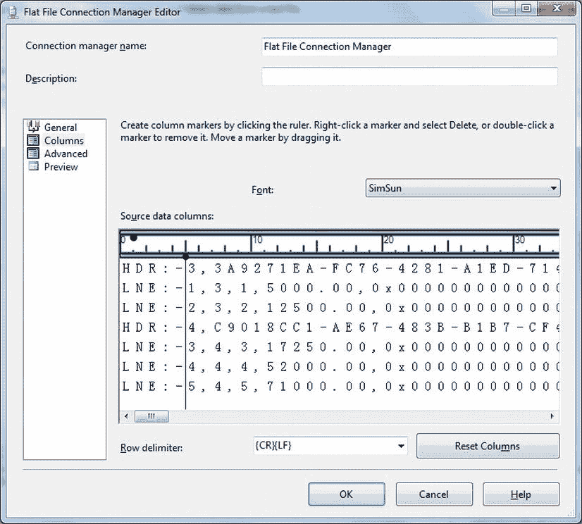
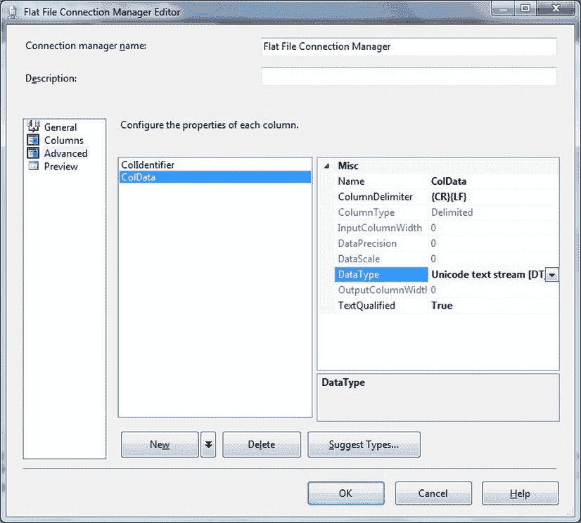
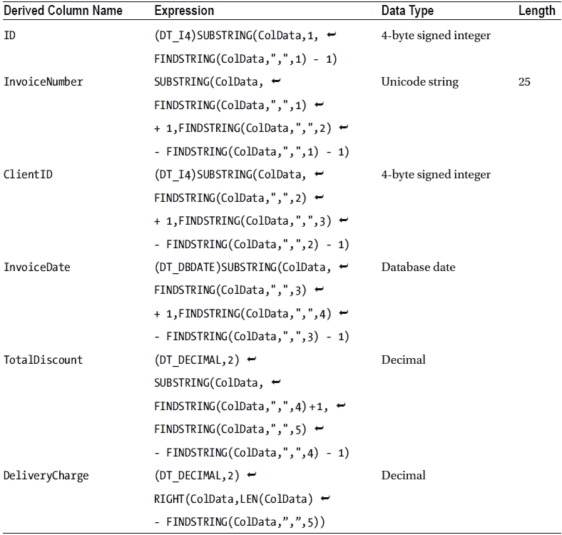
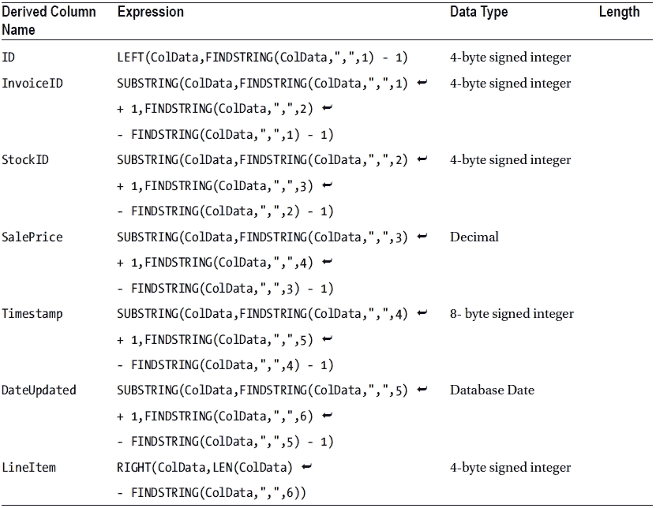
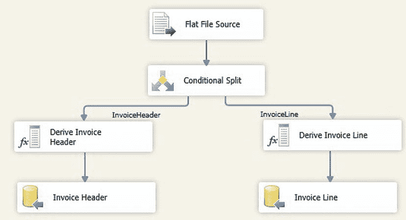
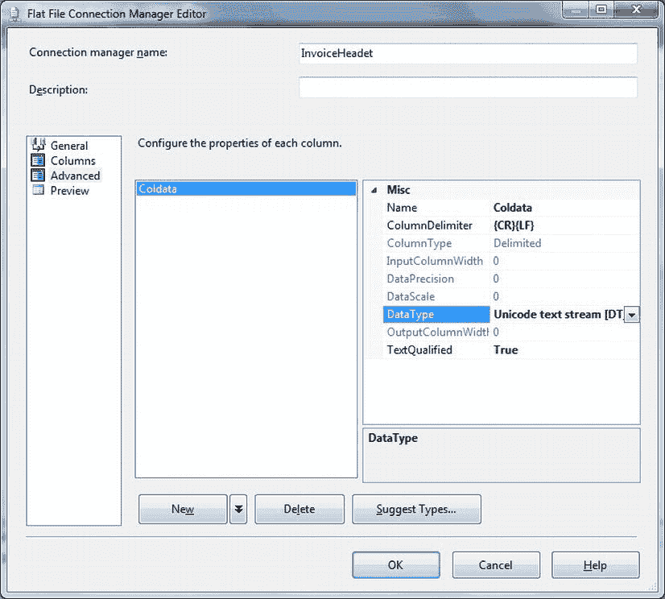
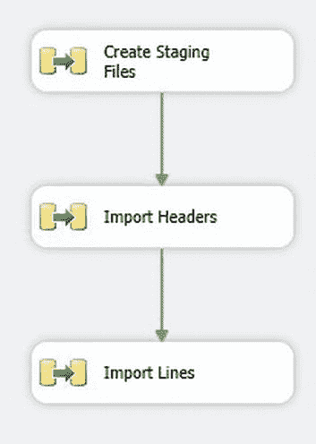
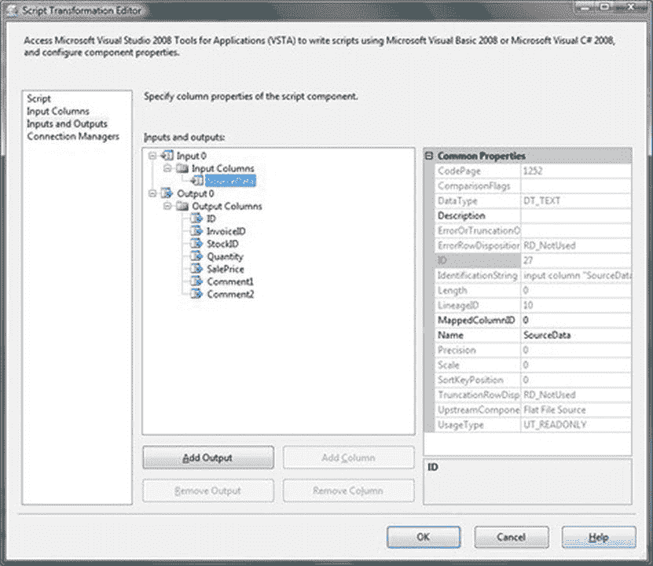

# 2-15. 在 SSIS 中处理具有行前缀的复杂平面文件格式

## 问题

你有一个平面文件，它不是一组简单的伪列，而是包含多个行结构，每种类型都以前缀特定指示符。你需要将此文件加载到 SQL Server。

## 解决方案

使用 SSIS 识别记录类型并将其分离到不同的数据流中。然后将每种行结构加载到结构独立的目标表中。

假设你收到的文本文件中包含本质上是多种类型的行。

在此示例中，我将文件的复杂性限制为两种不同的行类型。我们可以将它们视为标题行和子行。这是一个（非常小的）示例（`C:\SQL2012DIRecipes\CH02\MultipleSubsets.Txt`）：

```
HDR:-3,3A9271EA-FC76-4281-A1ED-714060ADBA30,3,2011-04-01 00:00:00.000,500.00,250.00
LNE:-1,3,1,5000.00,0x00000000000007DB,,1
LNE:-2,3,2,12500.00,0x00000000000007DC,,2
HDR:-4,C9018CC1-AE67-483B-B1B7-CF404C296F0B,4,2011-09-01 00:00:00.000,0.00,500.00
LNE:-3,4,3,17250.00,0x00000000000007DD,,1
LNE:-4,4,4,52000.00,0x00000000000007DE,,2
LNE:-5,4,5,71000.00,0x00000000000007DF,,3
```

如你所见，每行都以`HDR:-`或`LNE:-`开头，这使你（和 SSIS）能够确定该行包含的记录类型。以下解释了如何处理此问题。

## 步骤

1.  创建与源文件中设置的两种记录类型相对应的两个目标表（`C:\SQL2012DIRecipes\CH02\tblMultipleSubsets.sql`）：
    ```
    CREATE TABLE InvoiceHeader
    (
        ID INT
        ,InvoiceNumber VARCHAR(50)
        ,ClientID INT
        ,InvoiceDate DATETIME
        ,TotalDiscount NUMERIC(18,2)
        ,DeliveryCharge
    ) ;
    GO
    CREATE TABLE InvoiceLine
    (
        ID INT
        InvoiceID INT
        StockID INT
        SalePrice NUMERIC(18,2)
        Timestamp BIGINT
        DateUpdated DATETIME
        LineItem INT
    ) ;
    GO
    ```

2.  创建一个新的 SSIS 包，并添加一个名为`CarSales_Staging`的 OLEDB 连接管理器以连接到 CarSales_Staging 数据库。如果你使用的是 SQL Server 2012，可以重用现有的包级连接。
3.  添加一个平面文件连接管理器，将其配置为连接到源文件（`C:\SQL2012DIRecipes\CH02\MultipleSubsets.Txt`）。编辑连接管理器时，假设行前缀是固定长度的，将文件格式设置为“Ragged Right”。在“列”窗格中，设置列标记以将数据分成两列。第一列将包含行前缀，第二列将包含行数据。这应如图 2-16 所示。
    
    图 2-16。  复杂文本文件初始分离为两列

4.  在“高级”窗格中，为这两列起更友好的名称（本例中为`ColIdentifier`和`ColData`），并将用于保存数据的列的`OutputColumnWidth`设置为一个较大的值。示例如图 2-17 所示。
    
    图 2-17。  为复杂文本文件定义列标识符

5.  点击“确定”确认修改。
6.  添加一个数据流任务。双击进行编辑。
7.  添加一个平面文件数据源。将其配置为使用你刚创建的平面文件连接管理器。
8.  在数据流窗格中添加一个条件拆分转换。将平面文件数据源连接到它。双击进行编辑。创建两个新输出，配置如下：
    | OutputName | Condition |
    | --- | --- |
    | InvoiceHeader | `ColIdentifier == "HDR:-"` |
    | InvoiceLine | `ColIdentifier == "LNE:-"` |

9.  在数据流窗格中添加一个派生列转换，并将条件拆分连接到它。选择`InvoiceHeader`作为要使用的输出。双击进行编辑。添加以下派生列（此处和步骤 11 中使用的表达式代码位于`C:\SQL2012DIRecipes\CH02\ExpressionCode.Txt`）：
    

10. 添加一个 OLE DB 目标。将刚创建的派生列转换连接到它。将其命名为**Invoice Header**。将目标任务配置为使用`CarSales_Staging`连接管理器并指向`InvoiceHeader`目标表。将派生列（即不是最初的`ColIdentifier`和`ColData`列）映射到目标表。
11. 重复步骤 7 和 8，仅使用`InvoiceLine`作为条件拆分转换的输出，并指向`InvoiceLine`表。要创建的派生列是：
    

包应类似于图 2-18。

图 2-18。  处理复杂平面文件的 SSIS 数据流

12. 运行该包。
你的复杂源文件将被导入到两个目标表中。

## 工作原理

你可能会遇到包含两种或多种非常不同的记录类型的文本文件。在许多情况下，你可以将它们视为在单个文件中发送“规范化”数据的方式，这与标准 CSV 文件的单表单文件方法相反。例如，我见过由大型机和 ERP 系统生成的此类文件。对于这些“多格式”文本文件，我假设每行都有一个行前缀，以便你识别每行中包含的数据类型。

这种更复杂的方法是必要的，因为本章到目前为止描述的所有技术都适用于标准文本文件，但不适用于更复杂的格式。这里所说的“标准”是指从顶部到底部具有相同行结构的文件，因此可以毫无痛苦地加载到表结构中，因为每行文本中的列分隔符数量相同。现实情况是，文本文件格式的微小变化——或故意的设计决定——常常会使文本文件难以加载。或者至少，需要额外的处理步骤来管理源数据文件的原始结构特征，就像本例一样。

 **注意**   此示例仅显示两种记录类型。它可以轻松扩展以容纳多种记录类型。

这里我们使用两阶段方法。
*   **首先**：将每行拆分为两列，一列包含行前缀，另一列包含实际数据。
*   **其次**：根据数据类型解析每条记录。

使用派生列转换解析数据看起来比实际更复杂。最后一列使用 SSIS 中的`RIGHT`函数来获取最右边的列。所有其他列都使用`SUBSTRING`来隔离数据，并使用`FINDSTRING`来识别分隔符字符。这是 SSIS 相对于 T-SQL 的一个巨大优势，因为`FINDSTRING`可以指示从查找字符的哪个出现位置开始搜索。此外，在 SSIS 2012 中，4000 字符的限制不再适用，因此你可以处理更长的源记录。请注意，必须在派生列转换中设置数据类型，以使数据摄取过程高效且无错误地运行。

如果你使用的是 SQL Server 2005 或 2008，则必须使用`SUBSTRING(ColData,1,FINDSTRING(ColData,",",1) - 1)`来隔离第一列。这是因为`LEFT`函数在这些版本的 SSIS 中不可用。本质上，第一列必须使用`SUBSTRING`函数来模拟`LEFT`函数。

## 提示、技巧和陷阱

*   如果行前缀不是固定长度，那么你可以将文件格式设置为“delimited”，并指定分隔符为结束行前缀的任何字符——在本例中是连字符(-)。


然后在平面文件连接管理器的“高级”选项卡中，确保只有两列（这通常意味着删除其他所有列），并将第二列的列分隔符指定为行分隔符（大多数情况下会是`{CR}{LF}`）。更多细节请参阅配方 2-16。

*   在执行导入过程之前，几乎总是最好移除目标表上的任何引用完整性约束，因为你无法确保头记录会在行记录之前导入。你总可以在导入过程之后重新应用它们。
*   在 SSIS 2005 和 2008 中，此方法对记录的最大长度限制为 4000 个字符。遗憾的是，试图通过解析文本流来绕过此限制是不可能的，因为`SUBSTRING()`函数不适用于此数据类型。
*   源文件中任何不以行前缀开头的记录都将被忽略。

## 2-16. 在 SSIS 中预解析和暂存文件子集

### 问题

你需要加载一个由两种或更多不同记录类型组成的复杂文本文件。你想先分离其组成元素，以便能按特定顺序加载组成表。

### 解决方案

使用 SSIS 解析源文件，并将其作为子文件暂存在磁盘上作为过程的一部分。然后在遵守关系完整性约束的情况下加载两个表。

这个配方处理的是包含多种记录类型的扁平“大型机风格”文本文件问题，但使用的方法与配方 2-15 不同。不过，它将使用相同的源文件，因此，我建议你在继续以下过程之前先参考配方 2-15。这有助于你理解该解决方案。以下解释了如何在最终数据加载之前将源文件拆分为单独的暂存文件。

1.  创建一个新的 SSIS 包，并添加一个名为`MainFrame`的平面文件连接管理器，将其配置为连接到源文件（本例中为`C:\SQL2012DIRecipes\CH02\MultiFormatSource.Txt`）。
2.  在平面文件连接管理器编辑器中，将格式设置为“带分隔符”。
3.  单击“高级”选项卡。删除除两列外的所有列（或添加列直到有两列）。将第一列命名为`ColIdentifier`，第二列命名为`ColData`。将第一列（`ColIdentifier`）的数据类型设置为“字符串”，并将列分隔符设置为连字符（`-`）。（本例中我们使用这个；你必须使用源文件中使用的任何分隔符）。将第二列（`ColData`）的数据类型设置为“Unicode 文本流”。对话框应如配方 2-15 中的图 2-17 所示。
4.  确认你的配置更改。
5.  创建两个新的平面文件连接管理器，分别命名为`InvoiceHeader`和`InvoiceLine`。将每个都配置为指向一个文本文件（我富有想象力地将我的命名为`InvoiceHeader.Txt`和`InvoiceLine.Txt`）。对于每个连接管理器，单击“高级”窗格并添加一个新列，将其设置为“Unicode 文本流”数据类型（或“文本流”数据类型）。将该列命名为`Coldata`。“高级”窗格应如图 2-19 所示。

    

    图 2-19. 平面文件连接管理器的“高级”窗格

6.  确认你的配置更改。
7.  添加一个数据流任务。双击进行编辑。
8.  添加一个平面文件源。将其配置为使用`MainFrame`连接管理器。它应该只有两列——`ColIdentifier`和`ColData`。
9.  添加一个条件拆分任务。按照前一个配方中描述的确切方式配置它。
10. 向数据流窗口添加一个平面文件目标。将条件拆分任务连接到它。使用名为`InvoiceHeader`的输出。配置此目标使用名为`InvoiceHeader`的平面文件连接管理器——并勾选“覆盖文件中的数据”框。
11. 单击“映射”。在可用输入列和可用目标列之间映射`Coldata`列。
12. 针对`invoiceLine`输出和平面文件连接管理器重复步骤 10 和 11。
13. 返回到控制流窗口。添加一个名为`Import Headers`的数据流任务。将其连接到前一个数据流任务。
14. 添加一个名为`Import Lines`的数据流任务。将其连接到前一个数据流任务（`Import Headers`）。整个数据流应如图 2-20 所示。

    

    图 2-20. 导入复杂源文本文件同时暂存数据

15. 设置你刚刚创建的两个数据流任务，以导入`InvoiceHeader.Txt`和`InvoiceLines.Txt`带分隔符文件。这在配方 2-2 中有详细描述。创建两个目标表的脚本是`C:\SQL2012DIRecipes\CH02\tblMultipleSubsets.sql`。

### 工作原理

有时你可能希望处理来自大型机或某些企业资源规划软件解决方案的文件。这些文件可能包含多种行格式。然而，你希望——或者需要——将数据存储在临时文本文件中，作为过程的第一阶段。我指的是，每种记录类型（本例中的头记录和行记录）将首先从单个源文件中分离到单独的暂存文件中；然后将从产生的暂存文件中加载每种类型。有几种原因使得这种方法更可取甚至必要。其中包括以下几点：

*   记录长度超过 4000 个字符，因此无法使用前一配方中描述的方法。
*   目标文件上存在关系完整性约束，因此它们必须按正确的顺序（父表后跟子表）加载。
*   使用派生列转换编写扩展解析代码不切实际。
*   你希望在加载之前检查、调试、分析或预处理单独的源文件。

这些限制意味着你需要使用本配方给出的方法。本质上，它使用行前缀来分隔每种记录类型，并将其发送到磁盘上的暂存文件。然后，每个生成的文件作为单独的数据流任务加载。

### 提示、技巧和陷阱

*   如果你确定没有记录超过 4000 个字符的最大长度，可以将数据类型（在输入和输出文件的平面文件连接管理器中）设置为字符串或宽字符串数据类型。
*   由于此方法将文本文件写入磁盘（然后再读回），它会比“纯”SSIS 内存方法慢不少。
*   如果你要加载多个源文件，请不要勾选“覆盖文件中的数据”框，而是在此过程开始时使用初始文件系统任务删除暂存文件的内容。
*   源文件中任何不以行前缀开头的记录都将被忽略。

## 2-17. 使用 SQL Server 2012 处理源文件中不规则的列数

### 问题

你需要加载一个具有不规则列数的源文件。

### 解决方案

使用 SQL Server 2012 中的 SSIS。

在导入列数可变的文本文件时，你无需进行任何特殊配置，因为这是 SQL Server 2012 及更高版本的默认行为。只需创建一个平面文件连接管理器并配置它使用相关源文件即可。

### 工作原理

幸运的是，SQL Server 2012 通过 SSIS 包含了处理具有多个列分隔符的平面文件的能力，从而解救了各地的数据集成开发人员。值得注意的是，此行为与早期版本完全不同。


过去，如果 SSIS 在源文件中遇到不同数量的列分隔符，行终止符将无法被“正确”处理，数据会蛇形延伸到下一条记录中，这经常导致数据加载失败。自 SQL Server 2012 起，记录终止符将始终强制开始一条新记录。

#### 提示、技巧与陷阱
*   要防止 SSIS 处理源文件中不一致的列数，您可以将属性 `AlwaysCheckForRowDelimiters` 设置为 false。这将导致 SSIS 的行为与旧版本相同。
*   一条记录中的最大列分隔符数量可以是源文件中任意一行所包含的数量。SSIS 会猜测所需的列数并将其应用于整个数据加载过程。
*   记录终止符（或者您喜欢的行分隔符）绝不能用引号括起来，否则 SSIS 将无法识别它。

## 2-18. 在 SQL Server 2012 中处理嵌入式限定符
**问题**
您需要从一个包含嵌入式限定符的文本文件加载数据。

**解决方案**
使用 SQL Server 2012 中的 SSIS。该版本的 SSIS 会自动处理嵌入式限定符，无需您额外操作。

**工作原理**
SQL Server 2012 再次通过扩展 SSIS 来解救数据集成开发人员，使其能够处理嵌入式文本限定符。这意味着，如果某个字符（例如单引号或双引号）被用作列限定符，那么当它要作为字面值使用时，就必须进行转义。这是通过将限定符字符加倍来完成的。因此，平面文件中的引号 (`"`) 必须写成双引号 (`""`) 才能被正确导入。换句话说，在一个由限定符包围的字段内，该文本限定符的双实例将被解释为单实例的字面字符串。

#### 提示、技巧与陷阱
*   处理嵌入式限定符的行为对于带文本限定符的列/文件始终处于活动状态，无法禁用。
*   这种行为意味着限定符的数量必须符合预期。例如，如果您有一个字段——“Adam “Aspin””——那么该字段将无法加载，因为系统预期限定符字段内会有一个转义的双引号。如果这是个问题，那么最佳解决方案是不要使用字段限定符，而是使用脚本组件（扩展前面描述的技术）来处理限定符。

## 2-19. 在 SQL Server 2005 和 2008 中处理源文件中的不规则列数
**问题**
您需要加载一个列数不规则的源文件，但您使用的是 SQL Server 2005 或 2008。

**解决方案**
使用 SSIS 自定义脚本来解析源文件。

1.  创建一个包含所需列数的目的表——即，至少要有与分隔符最多的行相同数量的列。在此示例中，该文件为 (`C:\SQL2012DIRecipes\CH02\tblInvoiceLines_Multifield.sql`)：
    ```sql
    CREATE TABLE CarSales_Staging.dbo.InvoiceLines_Multifield
    (
     ID INT NULL,
     InvoiceID VARCHAR(25) NULL,
     StockID INT NULL,
     Quantity INT NULL,
     SalePrice MONEY NULL,
     Comment1 VARCHAR(150) NULL,
     Comment2 VARCHAR(500) NULL
    ) ;
    GO
    ```
2.  创建一个新的 SSIS 包，添加一个平面文件连接管理器，并将其配置为使用“右侧参差不齐”格式连接到源文件 (`C:\SQL2012DIRecipes\CH02\InvoicesMultifield.Txt`)。不要在“列”窗格中设置任何固定宽度列限制。在“高级”窗格中将唯一的源列命名为 `SourceData`。在此窗格中，将数据类型设置为“文本流”。确保“常规”窗格中的 Unicode 复选框未被选中（请继续阅读以了解如何处理 Unicode 源）。
3.  添加一个 OLE DB 目的连接管理器。将其配置为连接到目的数据库和表（在此示例中分别为 CarSales_Staging 和 InvoiceLines_Multifield）。
4.  添加一个“数据流任务”。双击进行编辑。
5.  在“数据流”窗格中，添加一个“平面文件源”。双击进行编辑。将连接管理器设置为您在步骤 1 中创建的那个。检查唯一的源列 `SourceData` 是否可用。确认您的修改。
6.  添加一个“脚本组件”并将其设置为“转换”。将“平面文件源”连接到它。双击进行编辑。
7.  点击“输入和输出”。在窗格中，添加与源列数量相同的输出列（为此，展开“输出 0”，然后展开“输出列”，并点击“添加列”）。将列数据类型和长度设置为与源数据对应。在此示例中，设置如下：
    | 列名 | 数据类型 | 长度 |
    | --- | --- | --- |
    | `ID` | 4 字节有符号整数 |  |
    | `InvoiceID` | 4 字节有符号整数 |  |
    | `StockID` | 字符串 | 50 |
    | `Quantity` | 4 字节有符号整数 |  |
    | `SalePrice` | 货币 |  |
    | `Comment1` | 字符串 | 150 |
    | `Comment2` | 字符串 | 500 |
    “输入和输出”窗格将类似于图 2-21 中所示的那样。
    
    图 2-21.  为解析字符串数据创建输出列

8.  点击“脚本”以激活脚本窗格。将“脚本语言”设置为 Microsoft Visual Basic 2010。点击“编辑脚本”。
9.  在脚本编辑器中，为 `Input0_ProcessInputRow` 方法键入或复制以下脚本：
    ```vb
    Public Overrides Sub Input0_ProcessInputRow(ByVal Row As Input0Buffer)
            Dim NbCols As Integer
            Dim Delimiter As String = ","
            Dim StartPosition As Integer = 0
            Dim EndPosition As Integer = 0
            Dim RowContents As String = System.Text.Encoding.UTF8.GetString(Row.SourceData.GetBlobData(0, Convert.ToInt32(Row.SourceData.Length)))
            ' 计算分隔符的数量 - 从而计算列数
            NbCols = (RowContents.Length - RowContents.Replace(Delimiter, "").Length)
            ' 根据列数设置输出数组
            Dim OutputCols(NbCols) As String
            ' 解析数据
            For Ctr = 0 To NbCols + 1
                If Ctr = 0 Then
                    If NbCols = 0 Then
                        OutputCols(Ctr) = RowContents
                        Exit For
                    Else
                        StartPosition = 0
                        EndPosition = RowContents.IndexOf(",", StartPosition)
                        OutputCols(Ctr) = Left(RowContents, EndPosition)
                    End If
                Else
                    StartPosition = RowContents.IndexOf(",", StartPosition)
                    EndPosition = RowContents.IndexOf(",", StartPosition + 1)
                    If EndPosition = -1 Then
                        OutputCols(Ctr) = RowContents.Substring(StartPosition + 1)
                        Exit For
                    Else
                        OutputCols(Ctr) = RowContents.Substring(StartPosition + 1, (EndPosition - StartPosition) - 1)
                    End If
                End If
                StartPosition = EndPosition
            Next
            ' 将解析后的数据发送到相应的输出列
            For ColIDOut As Integer = 0 To NbCols
                If ColIDOut = 0 Then
                    Row.ID = OutputCols(0)
                End If
                If ColIDOut = 1 Then
                    Row.InvoiceID = OutputCols(1)
                End If
                If ColIDOut = 2 Then
                    Row.StockID = OutputCols(2)
                End If
                If ColIDOut = 3 Then
                    Row.Quantity = OutputCols(3)
                End If
                If ColIDOut = 4 Then
                    Row.SalePrice = OutputCols(4)
                End If
                If ColIDOut = 5 Then
                    Row.Comment1 = OutputCols(5)
                End If
                If ColIDOut = 6 Then
                    Row.Comment2 = OutputCols(6)
                End If
            Next
    End Sub
    ```


```markdown
SalePrice = OutputCols(4)
End If
If ColIDOut = 5 Then
    Row.Comment1 = OutputCols(5)
End If
If ColIDOut = 6 Then
    Row.Comment2 = OutputCols(6)
End If
Next
End Sub
```

10. 关闭脚本窗口。确认对脚本组件的更改。
11. 添加一个 OLE DB 目标，并将脚本转换连接到它。选择你在步骤 2 中定义的 OLE DB 连接管理器。选择目标表。点击“映射”。确保除 `SourceData` 外的所有字段都已映射。

现在你可以运行该进程并导入数据了。

### 工作原理

你可能需要面对的一种情况是，源文本文件的每行具有可变数量的分隔符——因此每行的列数也各不相同。由于在 SQL Server 2012 出现之前，SSIS 不能很好地处理这种情况，如果你使用的是较旧版本的 Microsoft 旗舰数据库，则必须使用 SSIS 脚本组件来解析包含可变数量列的行。

解析每一行的脚本工作原理如下：

*   首先，文本流被转换为文本——否则像 `Replace` 这样的 .NET 字符串函数将不起作用。
*   然后，通过比较原始行长度与移除所有分隔符后的输入文本长度来确定列数。
*   接下来，处理最左边的列（或者如果没有其他列，则处理整个记录）并将其放入数组。
*   然后，确定除最右列之外的所有其他列（使用分隔符之间的起始和结束位置）并将其放入数组。
*   接下来，处理最右列并将其放入数组。
*   最后，将数组的所有内容映射到 SSIS 输出列。

尽管如此，这种技术仍然要求你在源文件中定义可能的最大列数，并且只能基于简单的从左到右的基础映射列。如果缺少列分隔符，它无法猜测源列应该映射到哪个输出列。可以将输入解析硬编码到输出列（这是 SSIS 输出所必须做的），但那可能不太优雅。当然，你可以更改 `Delimiter` 变量使用的分隔符字符。

如果你使用的是 Unicode 文本源，你需要做以下事情：

*   在“平面文件连接管理器编辑器”的“常规”窗格中，勾选 `Unicode` 框。
*   在“平面文件连接管理器编辑器”的“高级”窗格中，将 `SourceData` 列的数据类型设置为 `Unicode String (DT_WSTR)`。
*   在 SSIS 脚本任务中，将处理 UTF8 编码的行替换为以下内容：

```vbnet
ColText = System.Text.Encoding.Unicode.GetString(Row.SingleCol.GetBlobData(0, Convert.ToInt32(Row.SingleCol.Length)))
```

### 提示、技巧和陷阱

*   请记住（在 2005 和 2008 版本中）你可以在包之间复制连接管理器以节省重新定义它们的时间。
*   如果你的源文件记录非常短，你可以完全避免使用文本流，方法是在“平面文件连接管理器编辑器”的“高级”窗格中，将 `SourceData` 列的 `DataType` 设置为 `String`（长度 8000）或 `Unicode string`（长度 4000）。然后，你可以将 `ColText` 变量简单地设置为源列（`ColText` = `Row.SingleCol.ToString`）——或者完全避免使用变量，在脚本中直接引用源列。

### 2-20. 确定源文件中的列数

#### 问题

你想确定一个平面文件中的列数。

#### 解决方案

使用自定义 SSIS 脚本分析源文件。下面解释如何做到这一点。

1.  按照配方 2-2 的描述，使用平面文件连接管理器设置一个 SSIS 包。
2.  同样按照配方 2-2 的描述，添加一个数据流任务和一个平面文件源。
3.  按照配方 2-19 描述的技术，添加一个连接到平面文件源的脚本任务。不要创建任何输出列。添加以下脚本：

```vbnet
Public Class ScriptMain
    Inherits UserComponent
    Dim MaxNbCols As Integer = 0

    Public Overrides Sub PreExecute()
        MyBase.PreExecute()
    End Sub

    Public Overrides Sub PostExecute()
        MyBase.PostExecute()
        MsgBox(MaxNbCols)
    End Sub

    Public Overrides Sub Input0_ProcessInputRow(ByVal Row As Input0Buffer)
        Dim NbCols As Integer = 0
        Dim Delimiter As String = ","
        Dim ColText As String = ""
        'ANSI text
        ColText = System.Text.Encoding.UTF8.GetString(Row.SingleCol.GetBlobData(0, Convert.ToInt32(Row.SingleCol.Length)))
        NbCols = (ColText.Length - ColText.Replace(Delimiter, "").Length) + 1
        If NbCols > MaxNbCols Then
            MaxNbCols = NbCols
        End If
    End Sub
End Class
```

4.  关闭脚本任务。点击“确定”确认。

### 工作原理

这个简单的脚本计算数据流中每条记录的分隔符数量（使用 `Delimiter` 变量设置）。当你运行该包时，一个消息框会显示源文件中的最大列数。显然，这种方法非常“简单粗暴”，因为它使用 `MessageBox` 来返回列数。所以它更像是一种开发技术，但仍然是一个有用的工具。

 **注意** 你永远不会在生产环境中使用带有 MessageBox 的 SSIS 包。

### 提示、技巧和陷阱

*   或者，你可以使用 LogParser 来完成这个任务，这将在下一个配方中描述。
*   有关分析源文件的更高级技术，请参阅第 10 章。
*   为了更严谨，你还应该创建一个整数变量，然后添加一个使用该变量作为目标转换的行计数任务，通过将脚本任务连接到新的行计数任务来实现。

### 2-21. 准备用于导入的 CSV 文件

#### 问题

你有一个棘手的平面文件需要调整，以便可以轻松导入。

#### 解决方案

使用 LogParser 准备平面文件以供导入。

实际上，这个配方是一系列迷你配方，为你提供了一些 LogParser 功能的示例。由于 LogParser 在 SQL Server 之外运行，所有以下代码片段都必须从命令窗口运行。此配方中的所有代码都在一个文件中（`C:\SQL2012DIRecipes\CH02\LogParserScripts.Txt`）。

让我们从将 CSV 文件转换为制表符分隔的文件开始。你可以通过运行以下命令来完成：

```cmd
LogParser "SELECT ID,InvoiceNumber,ClientID,TotalDiscount,DeliveryCharge INTO C:\SQL2012DIRecipes\CH02\AA1.TSV FROM C:\SQL2012DIRecipes\CH02\Invoices.Txt" -i:CSV -o:TSV
```

使用 LogParser 将文件转换为 XML 同样容易。命令行是：

```cmd
LogParser "SELECT ID,InvoiceNumber,ClientID,TotalDiscount,DeliveryCharge INTO C:\SQL2012DIRecipes\CH02\AA1.Xml FROM C:\SQL2012DIRecipes\CH02\Invoices.Txt" -i:CSV -o:XML
```

然后，你可以使用第 3 章中描述的一些技术来加载 LogParser 创建的文件。

LogParser 还可以向输出文件添加行号。这在追踪加载错误时很有帮助。这是通过在 `SELECT` 语句中添加关键字 `Rownumber` 来实现的，如下所示：

```cmd
LogParser "SELECT Rownumber,ID,InvoiceNumber,ClientID,TotalDiscount,DeliveryCharge INTO C:\SQL2012DIRecipes\CH02\AA1.TSV FROM C:\SQL2012DIRecipes\CH02\Invoices.Txt" -i:CSV -o:TSV
```

如果速度不是关键，那么你可以使用 LogParser 直接将文本文件加载到 SQL Server 中。然而，这是使用 32 位 ODBC——并带有其所有的注意事项。

```cmd
LogParser "SELECT * INTO AA1 FROM C:\SQL2012DIRecipes\CH02\Invoices.Txt" -i:CSV -o:SQL -server:localhost -database:MyDatabase -username:MyUser -password:MyPassword
```


`Txt` ←-i:CSV -headerRow:OFF -o:SQL -dsn:SQLServer -username:Adam -password:Me4B0ss

LogParser 所采用的类 SQL 方法简化了数据子集的加载过程，无论是通过创建 CSV、TSV 或 XML 格式的中间预处理文件，还是通过 ODBC 直接加载到 SQL Server 中。以下是 `SELECT` 语句如何用于数据子集化的几个示例：

*   你可以像在 T-SQL 中一样，选择要加载或转换的列，以及它们在输出文件中出现的顺序：
    ```
    SELECT InvoiceNumber, ID DeliveryCharge INTO C:\SQL2012DIRecipes\CH02\AA1.TSV FROM ← C:\SQL2012DIRecipes\CH02\Invoices.Txt" -i:CSV -o:TSV
    ```
*   你可以使用 `WHERE` 子句（与 T-SQL 中一样）来筛选要加载或输出的行：
    ```
    SELECT InvoiceNumber, ID DeliveryCharge INTO C:\SQL2012DIRecipes\CH02\AA1.TSV FROM ← C:\SQL2012DIRecipes\CH02\Invoices.Txt WHERE ID > 4" -i:CSV -o:TSV
    ```
*   或者甚至是：
    ```
    SELECT InvoiceNumber, ID DeliveryCharge INTO C:\SQL2012DIRecipes\CH02\AA1.TSV FROM ← C:\SQL2012DIRecipes\CH02\Invoices.Txt WHERE ID BETWEEN 4 AND 6" -i:CSV -o:TSV
    ```
*   以及：
    ```
    SELECT InvoiceNumber, ID DeliveryCharge INTO C:\SQL2012DIRecipes\CH02\AA1.TSV FROM ← C:\SQL2012DIRecipes\CH02\Invoices.Txt WHERE InvoiceNumber LIKE '%A%'" -i:CSV -o:TSV
    ```

没有什么能阻止你编写相当复杂的 `WHERE` 子句，使用 `<`、`>`、`<=`、`>=` 和括号来确保应用你所需的逻辑。

LogParser 可以在不加载文件的情况下从源文件返回行数——这是一种非常快速且简单的方法，用于验证数据加载是否处理了源文件中的所有行——使用以下命令行语法：
```
LogParser "SELECT COUNT(*) INTO C:\SQL2012DIRecipes\CH02\AA1.CSV FROM ← C:\SQL2012DIRecipes\CH02\Invoices.Txt" -i:CSV -o:CSV
```

你可以使用 Execute Process 任务来运行 LogParser 作为“预处理”任务（例如，将 CSV 文件转换为制表符分隔的文件）。但是，你首先必须将 LogParser 使用的“SQL”放入一个文件中，并在调用 LogParser 时将其作为参数之一引用。

1.  创建一个名为 `AnETLQuery.Txt` 的文件，其中包含以下类 SQL 命令：
    ```
    SELECT ID,InvoiceNumber,ClientID INT O C:\SQL2012DIRecipes\CH02\AA1.Txt ← FROM C:\SQL2012DIRecipes\CH02\Invoices.Txt
    ```
2.  创建一个新的 SSIS 包。添加一个 Execute Process 任务。双击进行编辑。
3.  单击 Process 窗格。输入以下可执行文件：`C:\Program Files\Log Parser 2.2\LogParser.Exe`（或你机器上 LogParser 的正确路径）。
4.  输入以下参数文件：`C:\SQL2012DIRecipes\CH02\AnETLQuery.Txt -o:TSV -i:CSV`

你现在可以运行该包，它将把一个（可能是顽固的）CSV 文件转换成一个易于处理的制表符分隔文件，以便 SSIS 在包的下一步中加载。

## 它是如何工作的

有时你可能别无选择，只能“预解析”一个文本/CSV 文件，以使其进入一个可以使用本章前面探讨的标准工具优雅加载的状态。我无意解释各种编程语言准备文本文件的所有方法，因为这可能是另一本书的主题。相反，我想专注于一个稳定且高效的 Microsoft 实用程序 LogParser，并展示如何用它来重新组织文本文件，使其能被 SSIS、BCP 和 `BULK INSERT` 消化。LogParser 是一个命令行工具，它使用类 SQL 语法和一系列参数（与 BCP `QUERYOUT` 命令类似）来实现其目标。

本配方中给出的例子只是触及了这个强大工具的表面，但我希望，它们能为常见问题提供一些解决方案，并作为基础预处理的介绍。

 **注意** LogParser 可从 `www.microsoft.com/en-us/download/details.aspx?id=24659` 下载。

如果你遇到 SSIS 无法处理一个分隔符出现在带引号字段内部的文件，那么 LogParser 可以通过将文件转换为制表符分隔文件来提供帮助。安装后，你可以在开始菜单中找到 LogParser。

那么，LogParser 带来了什么？嗯，除其他外，它可以：

*   从大型源文件中选择数据子集（按列和行），并创建可以随后加载的较小暂存文件。
*   忽略文本文件中带引号字段内的分隔符，并转换为可加载的 TSV（制表符分隔）或 XML。

它还能做更多，但这些是当面对顽固文本文件时，你可以添加到 ETL 武器库中的几个有用的补充。

调用 LogParser 的命令行提供以下信息：

*   源文件：`FROM C:\SQL2012DIRecipes\CH02\Invoices.Txt`
*   目标文件：`INTO C:\SQL2012DIRecipes\CH02\AA1.TSV`
*   源格式：`-i:CSV`
*   目标格式：`-o:TSV`

有许多 LogParser 参数你可能会觉得有用。表 2-8 简洁地概述了一些在解析文本文件时可能对你有帮助的参数。

表 2-8. LogParser 参数

| 参数 | 示例 | 说明 |
| --- | --- | --- |
| `headerRow` | `-headerRow:OFF` | 此标志表示文件是否包含行标题。你可以将其设置为 OFF 或 ON。 |
| `iDQuotes` | `-iDQuotes:Ignore` | 如果将此标志设置为 Ignore，则告诉 LogParser 忽略列周围的双引号，并输出带引号的列。如果将此标志设置为 Auto，则告诉 LogParser 去除引号。 |
| `nSkipLines` | `-nSkipLines:5` | 此标志指示 LogParser 在导入数据之前要跳过的标题行数。 |
| `I` | `-i:CSV` | 此标志指示 LogParser 输入格式是 TSV（制表符分隔）、CSV（逗号分隔）或 XML（对，XML！）。 |
| `o` | `-o:TSV` | 此标志指示 LogParser 输出格式是 TSV（制表符分隔）、CSV（逗号分隔）或 XML。 |
| `iSeparator` | `-iSeparator:space` | 此标志告诉 LogParser——在读取制表符分隔的源文件时——将使用分隔符（空格或制表符）。 |
| `iHeaderFile` | `-iHeaderFile:"C:\SQL2012DIRecipes\CH02\header.csv"` | 如果源文件没有行标题，则此标志指示一个**仅**包含行标题的第二个文件。 |
| `fixedFields` | `-fixedFields:OFF` | 此标志说明数据文件中的每一行是否具有相同数量的列（即，设置为 ON）或不是（设置为 OFF）。 |
| `nFields` | `-nFields:3` | 如果源文件的字段数可变，此标志说明要扫描源文件中的行数以确定正确的列数。你指定的越多，所需时间就越长。 |
| `dtLines` | `-dtLines:50` | 此标志说明要扫描源文件中的行数以发现列数据类型和长度。你指定的越多，所需时间就越长。 |
| `file` | `file:AnETLQuery.Sql` | 此标志允许你将类 SQL 查询存储在文件中，而不是直接从命令行运行。 |

请注意，文件名前不需要连字符。另请注意，即使源列用引号括起来并包含逗号，该列也将作为整个字段被优雅处理，而不会不必要地拆分。引号将被自动剥离。

#### 提示、技巧与陷阱

*   不可避免地，任何大文件的转换都会给 ETL 过程增加额外时间。只有你能决定这个时间是否是最值得付出的代价，或者你是否需要研究开发一种在 SSIS 脚本任务中解析“困难”文件的自定义方法。
*   虽然可以使用 LogParser 直接将数据加载到 SQL Server，但这可能会非常慢，因为它只会使用 32 位 ODBC。


你可能会发现，将其用作预解析器来整理源文件中的异常，并将 LogParser 转换后生成的文件通过 `BULK INSERT` 或 SSIS 加载到 SQL Server 中，速度会更快。
*   要创建系统 DSN，请参阅配方 6-12。
*   如果愿意，可以打开命令窗口，导航到 LogParser 目录（当前为 `C:\Program Files\Log Parser 2.2`），然后从那里运行 LogParser。
*   你也可以从 `XP_CmdShell` 或 SSIS 的“执行进程任务”中调用 LogParser。

#### 总结

本章阐述了将文本文件导入 SQL Server 的多种方法。你最终会采用的技术，不可避免地取决于你面临的具体挑战。这些挑战包括你需要处理的源文件结构、完成任务可用的时间，以及你必须满足的 SLA（服务级别协议）——它最贴切的解释是“我如何在不耗费数小时编写代码的情况下，尽可能快地加载我拥有的数据？”。然而，可用选项的多样性不必引起困惑。如果你遵循这样的原则：对于未预见的导出使用导入和导出向导，对于临时挑战使用 T-SQL 解决方案，对于结构化的 ETL 流程使用 SSIS，那么你就有了一个工作的基线。显然，每种情况都会不同，每种环境都有其特定的障碍。但只要坚持不懈并深思熟虑，你应该能够成功地将大多数（即便不是全部）文本文件加载到 SQL Server 中。

为了给你一个更简洁的概览，表 2-9 展示了我对各种方法及其优缺点的看法。

表 2-9. 本章所用方法的优缺点

| 技术 | 优点 | 缺点 |
| --- | --- | --- |
| `OPENROWSET` | 使用直通查询。 | 设置可能较棘手。 |
| `OPENDATASOURCE` | 允许使用 T-SQL 操作源数据。 | 设置可能较棘手。 |
| `BULK INSERT` | 可能是最快的解决方案。 | 需要正确的参数化。可能需要格式文件。 |
| SSIS 批量插入任务 | 非常快。 | 需要正确的参数化。可能需要格式文件。 |
| 链接服务器 | 允许使用 T-SQL 操作源数据。 | 不适合大文件。 |
| 导入和导出向导 | 易于使用。可以生成 SSIS 包。 | 转换选项有限。 |
| SSIS | 完整的数据转换、修改和操作。增量数据加载。 | 实现时间较长。无法一次性创建所有目标对象。 |
| BCP | 快速且高效。 | 参数复杂。 |

