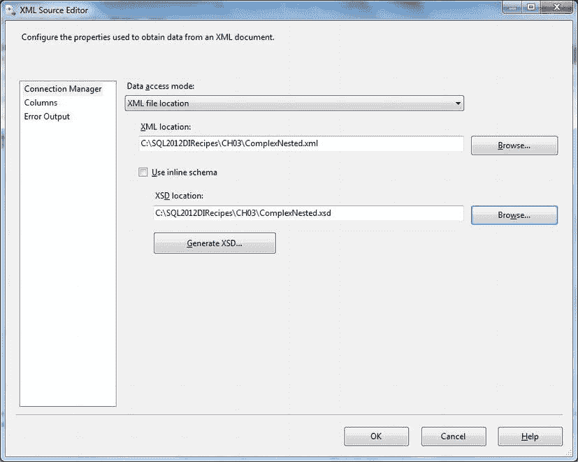
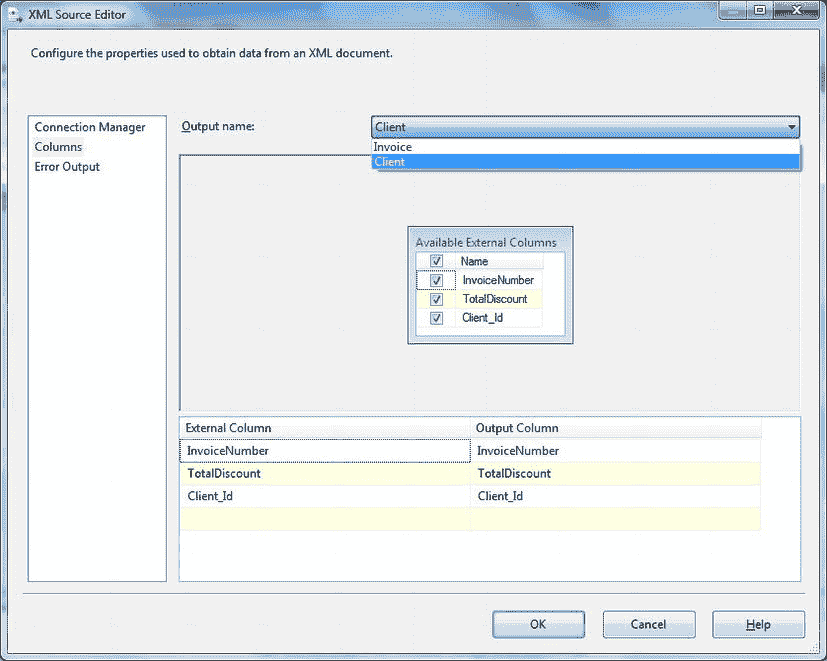
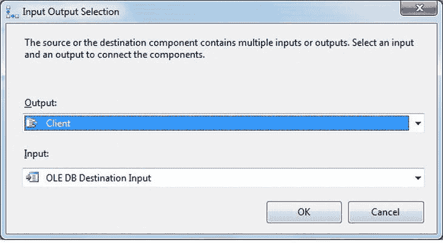
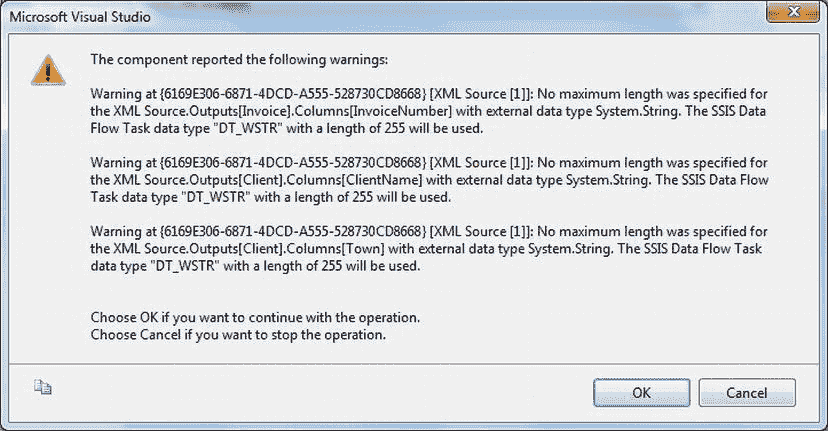
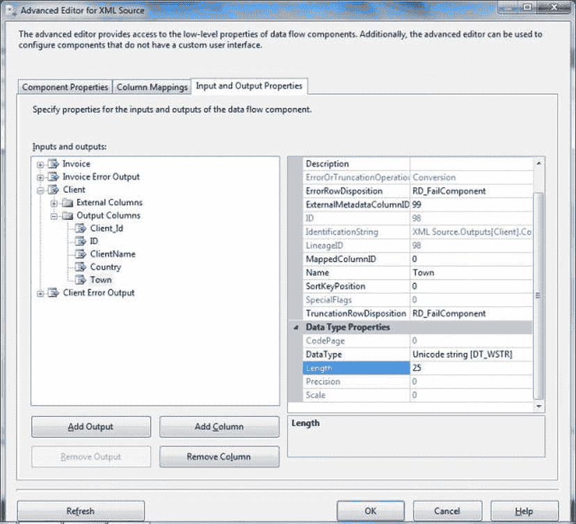
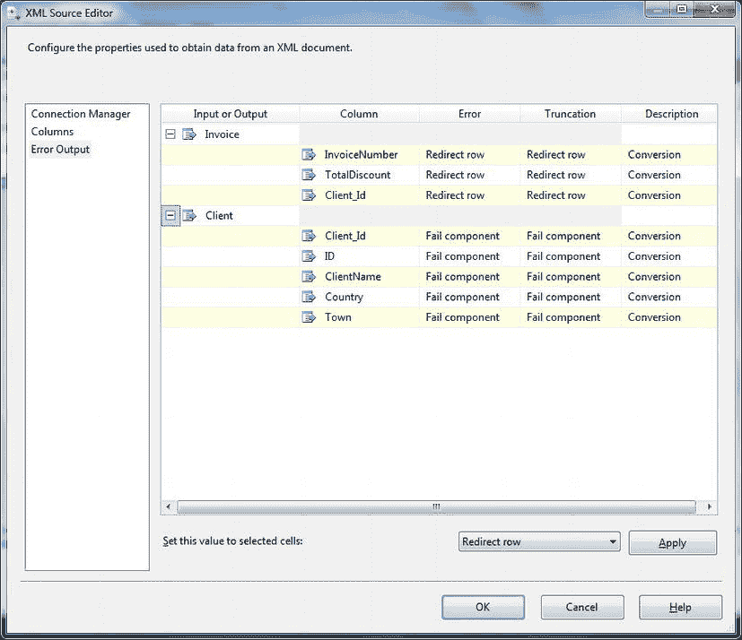
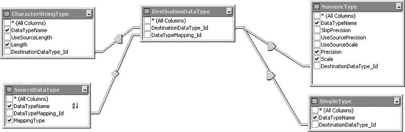

# 3-3. 将 XML 文件分解到 SQL Server 表中

## 问题
你希望将 XML 数据加载到 SQL Server 表和列中，同时避免 `sp_xml_preparedocument` 的开销。

## 解决方案
使用 `OPENROWSET (BULK)` 和 SQL Server 的 XQuery 支持来分解并加载源文件。

1.  使用以下代码创建目标表 (`C:\SQL2012DIRecipes\CH03\tblXMLImport_Clients.Sql`)：
    ```sql
    CREATE TABLE dbo.XmlImport_Clients
    (
     ID int NULL,
     ClientName varchar(50) NULL,
     Town varchar(50) NULL,
     County varchar(50) NULL,
     Country int NULL
    ) ;
    GO
    ```
2.  定位一个 XML 源文件——我将使用 `C:\SQL2012DIRecipes\CH03\ClientLite.Xml`，这与配方 3-2 中使用的一样。
3.  使用以下代码片段加载文件 (`C:\SQL2012DIRecipes\CH03\ShredXMLUsingOPENROWSETBulk.Sql`)：
    ```sql
    DECLARE @XMLSource XML;

    SELECT   @XMLSource = CAST(XMLSource AS XML) ;
    FROM      OPENROWSET(BULK 'C:\SQL2012DIRecipes\CH03\ClientLite.xml', SINGLE_BLOB) AS X (XMLSource);

    INSERT INTO XmlImport_Clients (ID, ClientName, Town, County, Country)

    SELECT
      SRC.Client.value('ID[1]', 'INT') AS ID
     ,SRC.Client.value('ClientName[1]', 'VARCHAR(50)') AS ClientName
     ,SRC.Client.value('Town[1]', 'VARCHAR(50)') AS Town
     ,SRC.Client.value('County[1]', 'VARCHAR(50)') AS County
     ,SRC.Client.value('Country[1]', 'INT') AS Country

    FROM @XMLSource.nodes('CarSales/Client') AS SRC (Client);
    ```

## 工作原理
`OPENXML` 是一种经典方法，至今仍能良好工作，但自 SQL Server 2005 起，利用 SQL Server 对 XML 和 XQuery 的支持，已有其他解决方案可用于将 XML 数据导入 SQL Server。尽管起初可能有点令人不安（或许因为它不太像“T-SQL”而更像 XQuery），但使用 XML 数据类型可以是一种既高效又强大的方式，将 XML 源数据加载到数据库结构中。与 `OPENXML` 不同，使用 `.nodes()` 方法加载 XML 数据不需要 `sp_xml_preparedocument` 来实例化 XML 对象。此技术最好在以下情况下使用：

*   当你想将源文档的全部或部分内容加载到表列中时。
*   当设置 SSIS 包来分解数据显得大材小用时。

在这个配方中，我们将源文件加载到一个变量中，然后使用 XML 数据类型的 `.nodes()` 方法将其分解到表中。`.value()` 方法从存储为 XML 类型的 XML 实例中提取值。

这里使用的“暂存变量”方法对于大文件需要大量内存。因此，如果你觉得使用暂存变量显得有点过时，那么有一个解决方案可以避免使用暂存变量——通过巧妙地应用 `CROSS APPLY`。

---
*注意：以下文本似乎来自前面的部分（很可能是配方 3-2），并包含在原始内容中。根据不删除有价值信息的指示，它被保留了下来。*

综合来看，这意味着 `OPENXML` 最好在以下情况下使用：
*   当你不希望在 T-SQL 查询中使用 XML 数据之前将其导入 SQL Server 时。
*   当你有一个格式正确的 XML 文档时。
*   当 XML 文档小于 2 GB 时。

为了稍微扩展这个例子，假设你有一个（相当简单的）以属性为中心的 XML 文件，像这样 (`C:\SQL2012DIRecipes\CH03\ClientLiteAttributeCentric.Xml`)：
```xml
<CarSales>
  <Client ID = "3" ClientName = "John Smith" Country = "1" />
  <Client ID = "4" ClientName = "Bauhaus Motors" Country = "2" />
  <Client ID = "5" ClientName = "Honest Fred" Country = "3" />
  <Client ID = "6" ClientName = "Fast Eddie" Country = "2" />
  <Client ID = "7" ClientName = "Slow Sid" Country = "3" />
</CarSales>
```

要加载此文件，只需将 `OPENXML` 的标志参数更改为 1，如下例所示 (`C:\SQL2012DIRecipes\CH03\ShredClientLiteAttributeCentric.Sql`)：
```sql
DECLARE @DocID INT;
DECLARE @DocXML VARCHAR(MAX);

SELECT @DocXML  = CAST(XMLSource AS VARCHAR(MAX))
FROM OPENROWSET(BULK 'C:\SQL2012DIRecipes\CH03\ClientLite.xml', SINGLE_BLOB) AS X (XMLSource);

EXECUTE master.dbo.sp_xml_preparedocument @DocID OUTPUT, @DocXML;

SELECT
       ID, ClientName, Country
FROM
    OPENXML(@DocID, 'CarSales/Client', 1)
                     WITH (
                          ID VARCHAR(50)
                          ,ClientName VARCHAR(50)
                          ,Country VARCHAR(10)
                         );
EXECUTE master.dbo.sp_xml_removedocument @DocID;
```

显然，无法预测 XML 数据源的所有排列组合。然而，可以公平地说，并非所有源文件都会像我们这里使用的这样简单。幸运的是，`OPENXML` 可以处理更复杂的数据源。`OPENXML` 的艺术和科学在于构成 `OPENXML` 命令的两个要素。它们是：

*   `行模式`，用于标识要处理的节点（本配方示例中为 `'/CarSales/Client'`）。
*   `架构声明`，即指定列输出的 `WITH` 子句。

作为一个更复杂的例子，这里是一个带有嵌套元素的 XML 片段 (`C:\SQL2012DIRecipes\CH03\NestedClients.Xml`)：
```xml
<CarSales>
  <Client>
    <ID> 3</ID>
    <ClientName> John Smith</ClientName>
    <Country> 1</Country>
    <Town> Uttoxeter</Town>
    <Invoice>
      <InvoiceNumber> 3A9271EA-FC76-4281-A1ED-714060ADBA30</InvoiceNumber>
      <TotalDiscount> 500.00</TotalDiscount>
    </Invoice>
  </Client>
  <Client>
    <ID > 4</ID>
    <ClientName> Bauhaus Motors</ClientName>
    <Country> 2</Country>
    <Town> Oxford</Town>
    <Invoice>
      <InvoiceNumber> C9018CC1-AE67-483B-B1B7-CF404C296F0B</InvoiceNumber>
      <TotalDiscount> 0.00</TotalDiscount>
    </Invoice>
  </Client>
</CarSales>
```

这里是使用 `OPENXML` 读取它的代码（当然，你需要将其包装在前面用于加载、准备和从内存中移除 XML 文档的代码中——此处为节省空间而省略）(`C:\SQL2012DIRecipes\CH03\ShredNestedClients.Sql`)：
```sql
SELECT
       ID, ClientName, Country, TotalDiscount
FROM
    OPENXML(@DocID, 'CarSales/Client', 2)
                WITH (
                      ID VARCHAR(50) 'ID'
                      ,ClientName VARCHAR(50) 'ClientName'
                      ,Country VARCHAR(10)'Country'
                      ,TotalDiscount NUMERIC(18,2) 'Invoice/TotalDiscount'
                     )
```

最后要记住的一点是，无论你使用以属性为中心还是以元素为中心的 XML，你仍然在使用 T-SQL。这意味着你可以使用 `WHERE` 来过滤输出，使用 `ORDER BY` 来排序。本配方顶部的代码片段可以像这样扩展 (`C:\SQL2012DIRecipes\CH03\ShredNestedClientsFilterAndSort.Sql`)：
```sql
DECLARE @DocID INT;
DECLARE @DocXML VARCHAR(MAX);

SELECT @DocXML = CAST(XMLSource AS VARCHAR(MAX))
FROM OPENROWSET(BULK 'C:\SQL2012DIRecipes\CH03\ClientLite.xml', SINGLE_BLOB) AS X (XMLSource);

EXECUTE master.dbo.sp_xml_preparedocument @DocID OUTPUT, @DocXML;

SELECT
        ID, ClientName, Country
INTO
     XmlTable
FROM
    OPENXML(@DocID, 'CarSales/Client', 2)
                      WITH (
                            ID VARCHAR(50)
                            ,ClientName VARCHAR(50)
                            ,Country VARCHAR(10)
                          )
WHERE
        Country = 3
ORDER BY  ID

EXECUTE master.dbo.sp_xml_removedocument @DocID;
```

**提示、技巧和陷阱**
*   XML 文档必须是格式良好的——特别是只能有一个顶级（根）元素。
*   尽管是一项较旧的技术，但在从 T-SQL 将 XML 数据加载到关系结构时，`OPENXML` 据称是最快的解决方案。


因此，使用与本配方前面相同的 XML 源文件，此方法的代码如下（`C:\SQL2012DIRecipes\CH03\ShredXMLUsingOPENROWSETBulkAndCrossApply.Sql`）：

```sql
INSERT INTO XmlImport_Clients (ID, ClientName, Town, County, Country)
SELECT SRC.Client.value('ID[1]', 'INT') AS ID
,SRC.Client.value('ClientName[1]', 'VARCHAR(50)') AS ClientName
,SRC.Client.value('Town[1]', 'VARCHAR(50)') AS Town
,SRC.Client.value('County[1]', 'VARCHAR(50)') AS County
,SRC.Client.value('Country[1]', 'INT') AS Country
FROM
    (
      SELECT CAST(XMLSource AS XML)
      FROM OPENROWSET(BULK 'C:\SQL2012DIRecipes\CH03\Clients_Simple.xml', SINGLE_BLOB) AS X (XMLSource)
    ) AS X (XMLSource)
CROSS APPLY XMLSource.nodes('CarSales/Client') AS SRC (Client);
```

这第二种 `CROSS APPLY` 方法稍微复杂一些，但它能直接将数据分解并加载到目标表中。

再次强调，由于我们使用的是 T-SQL，目前使用的代码可以扩展用于过滤和排序要加载的数据。因此，如果我们基于前面的例子，决定只加载国家为“3”的记录，并且按 Town 元素排序，那么应使用以下代码（`C:\SQL2012DIRecipes\CH03\ShredXMLUsingOPENROWSETBulkAndCrossApplyWithFilter.Sql`）：

```sql
INSERT INTO XmlImport_Clients (ID, ClientName, Town, County, Country)
SELECT SRC.Client.value('ID[1]', 'INT') AS ID
,SRC.Client.value('ClientName[1]', 'VARCHAR(50)') AS ClientName
,SRC.Client.value('Town[1]', 'VARCHAR(50)') AS Town
,SRC.Client.value('County[1]', 'VARCHAR(50)') AS County
,SRC.Client.value('Country[1]', 'INT') AS Country
FROM
    (
      SELECT CAST(XMLSource AS XML)
      FROM OPENROWSET(BULK 'C:\SQL2012DIRecipes\CH03\Clients_Simple.xml', SINGLE_BLOB) AS X (XMLSource)
    ) AS X (XMLSource)
CROSS APPLY XMLSource.nodes('CarSales/Client') AS SRC (Client)
WHERE SRC.Client.value('Country[1]', 'INT') = 3
ORDER BY SRC.Client.value('Town[1]', 'VARCHAR(50)');
```

这种技术可能比较熟悉，但对于大文件，它可能会变得非常缓慢以至于无法使用。当然，这取决于每个人对“大”的定义，但如果你需要等待 SQL Server 完成处理几分钟——甚至几小时——那么你或许应该考虑另一种方法。因此，如果你面临需要数小时才能完成的 XML 数据加载，有一种解决方案，它需要一些前期工作，但可以将数小时的处理时间减少到几秒，而且显然还能减轻内存压力。诀窍是在一个暂存表中使用类型化的 XML 列来保存源文件（或多个文件），然后对其应用 XML 索引。你还必须首先添加主键，否则将无法添加 XML 索引。

 **注意** 感谢 Stack Overflow 上的 Dan（`http://stackoverflow.com`）描述了如何使用 XML 索引以这种方式加速 XML 加载。

在这个例子中，我还添加了次级 XML 索引。在许多情况下，这些可能不是完全必要的，但因为即使对于大文件，它们也只需要很短的时间来生成，所以我建议无论如何都应用它们。一旦 XML 数据加载到暂存表并建立索引，你就可以将索引表用作 XQuery 的源，并使用 `CROSS APPLY` 来分解数据（`C:\SQL2012DIRecipes\CH03\ShredXMLWithIndexes.Sql`）：

```sql
-- 应用一个 XSD
DECLARE @XSD XML;
SELECT @XSD = CONVERT(XML, XSDDef)
FROM OPENROWSET(BULK 'C:\SQL2012DIRecipes\CH03\Clients_Simple.xsd', SINGLE_BLOB) AS XSD (XSDDef)
CREATE XML SCHEMA COLLECTION XML_XSD AS @XSD;
GO

-- 用于保存 XML 数据的暂存表
CREATE TABLE dbo.Tmp_XMLLoad(
ID int IDENTITY(1,1) NOT NULL,
XMLData xml(CONTENT dbo.XML_XSD) NULL,
CONSTRAINT PK_Tmp_XMLLoad PRIMARY KEY CLUSTERED ( ID ASC )WITH (PAD_INDEX = OFF, STATISTICS_NORECOMPUTE = OFF, IGNORE_DUP_KEY = OFF, ALLOW_ROW_LOCKS = ON, ALLOW_PAGE_LOCKS = ON)
);
GO

-- XML 索引
CREATE PRIMARY XML INDEX XX_XMLData ON Tmp_XMLLoad (XMLData)
CREATE XML INDEX SX_XMLData_Property ON Tmp_XMLLoad (XMLData) USING XML INDEX XX_XMLData FOR PROPERTY
CREATE XML INDEX SX_XMLData_Value ON Tmp_XMLLoad (XMLData) USING XML INDEX XX_XMLData FOR VALUE
CREATE XML INDEX SX_XMLData_Path ON Tmp_XMLLoad (XMLData) USING XML INDEX XX_XMLData FOR PATH

-- 将数据加载到表中
INSERT INTO Tmp_XMLLoad (XMLData)
SELECT CAST(XMLSource AS XML) AS XMLSource
FROM OPENROWSET(BULK 'C:\SQL2012DIRecipes\CH03\Clients_Simple.xml', SINGLE_BLOB) AS X (XMLSource)

-- 并输出：
INSERT INTO XmlImport_Clients (ID, ClientName, Town, Country)
SELECT SRC.Client.value('ID[1]', 'INT') AS ID
,SRC.Client.value('ClientName[1]', 'VARCHAR(50)') AS ClientName
,SRC.Client.value('Town[1]', 'VARCHAR(50)') AS Town
,SRC.Client.value('Country[1]', 'INT') AS Country
FROM Tmp_XMLLoad
CROSS APPLY XMLData.nodes('CarSales/Client') AS SRC (Client);
```

最后——并希望引导你开始学习 XQuery——以下是一个如何避免使用 T-SQL `WHERE` 子句来过滤数据的示例：

```sql
CROSS APPLY XMLSource.nodes('CarSales/Client[ID = 3]') AS SRC (Client);
```

是的，如果你懂 XQuery，你可以用它来替代过滤数据。现在，这里不是进行深入 XQuery 教程的时机和地点——但至少你知道这是可以做到的。

### 提示、技巧和陷阱

*   我假设你有一个 XSD 文件可供使用——如果没有，那么你可以使用 SSIS 从数据创建一个，如配方 3-4 所述。
*   另外，如果你正在测试示例中使用的 `@XMLSource` 变量，不要担心它只显示为截断的形式——例如，如果你使用 `PRINT` 语句。T-SQL 只会显示它所能处理的 20 亿字符中的前 8000 个字符。为了让自己放心，你可以输出一个 `DATALENGTH(@XMLSource)` 来确认所有数据都在变量中。顺便说一句，如果你确实希望从 T-SQL 打印 `@XMLSource` 变量，你需要将其转换回 `VARCHAR` 或 `NVARCHAR`。

## 3-4. 作为 ETL 过程的一部分导入 XML 数据

### 问题
你希望作为结构化、受控的 ETL 过程的一部分导入（并分解）XML 数据。

### 解决方案
使用 SSIS 和 XML 源任务作为数据源。

1.  打开 SSIS，创建一个新包，并在数据流窗格上添加一个数据流任务。
2.  双击数据流任务将其打开。在数据流窗格上添加一个 XML 源任务。双击 XML 源任务将其打开。
3.  将数据访问模式保留为 XML 文件位置，浏览到 XML 源文件（本配方中为 `C:\SQL2012DIRecipes\CH03\ComplexNested.XML`），然后单击“生成 XSD”。可以保留建议的文件名（将与 XML 文件同名，但扩展名为 XSD），或输入你需要的名称（此处为 `C:\SQL2012DIRecipes\CH03\ComplexNested.Xsd`）。单击“保存”。对话框应类似于 图 3-1（如果你未使用本书的示例，则文件名会有所不同）。

    
    图 3-1。 XML 源编辑器对话框

4.  单击“列”。你会看到为 XML 层次结构中的每个节点表示的一个表，类似于 图 3-2。

    
    图 3-2。在 SSIS XML 源中选择节点

5.  单击“确定”确认源文件选择。返回到数据流窗格。
6.  向数据流窗格添加一个 OLEDB 目标任务。


将绿色的输出连接线拖动，以将 XML 源链接到 OLEDB 目标。除非只有一个 XML 节点，或者是最后一个节点，否则将出现“输入输出选择”对话框，允许您选择要输出的 XML 节点——如图 3-3 所示。



图 3-3. 在 SSIS 数据流中选择要处理的 XML 节点

7.  有点令人困惑的是，输出是 XML 源，而输入是 OLEDB 目标！点击“确定”返回到数据流窗格。
8.  双击 OLEDB 目标任务。选择一个现有的 OLEDB 连接管理器（或创建一个新的，如配方 1-2 等所述）。选择一个现有的表，或点击“新建”按钮创建一个新表。点击“确定”返回到数据流窗格。现在必须为 XML 层次结构中的每个节点重复此步骤。
9.  运行 SSIS 包（在解决方案资源管理器中右键单击该包并选择“执行包”）。

## 工作原理

对于常规的数据导入，SSIS 可能仍然是最佳工具。它不仅会将 XML 源结构导入到适当的 SQL Server 表中，还会创建执行导入所需的 XSD 文件。

话虽如此，值得注意的是，复杂的 XML 源文件会让 SSIS 建议在 SQL Server 中创建非常多的分解表，并给您留下一个复杂的（甚至可以说是错综复杂的）表层次结构，映射到 XML 文档中的节点层次结构。因此，对于复杂的源文件，请准备好花费时间重构 SSIS 生成的极其冗长的 XSD 文件，以便：
*   降低 XSD 文件的复杂性。
*   降低 SQL Server 中分解表的复杂性。
*   扁平化 XML 层次结构。
*   只导入您感兴趣的 XML 层次结构部分。

另一件需要注意的事情是，一旦所有数据都导入到分解表中，您可能需要创建 T-SQL 代码或视图来连接这些分解表，以便提取导入产生的显著数据。对于复杂的 XML 源，这至少可以说是有挑战性的。然而，这确实让您——数据人员——以关系形式面对您的数据，这对于数据库开发人员和 DBA 来说可能都更直观。这种方法在以下情况下是最佳选择：
*   您需要定期将源数据分解到 SQL Server 中。
*   您希望导入源文件的全部或部分内容。
*   您希望 SSIS 半自动地创建所有分解表。
*   您希望以关系结构访问所有 XML 数据。
*   您想使用 SQL 来定义选择以选取部分 XML 数据。
*   数据文件不是太大。

当然，这个配方只描述了 SSIS 导入包的“核心” XML 部分。您很可能希望在 XML 导入之前先执行一个 SQL 任务来截断目标表并删除目标表上的任何索引，然后在数据流任务之后再跟一个 SQL 任务，以在分解表上用于连接的所有字段上重新创建索引。

另一点需要注意的是，在确认源文件时——除非 XSD 文件定义了数据长度——您很可能会看到如图 3-4 所示的警告。



图 3-4. XML 数据类型警告

点击“确定”可移除该警告，然后，如果您愿意，可以通过右键单击 XML 源任务并选择“显示高级编辑器”来调整输出的数据类型。接下来，单击“输入和输出属性”选项卡，并选择不同的数据类型或数据长度。图 3-5 所示的对话框给出了一个示例。



图 3-5. XML 源高级编辑器

这允许您将字符列的长度扩展到默认的 255 以上，或者通过将输出类型设置为 Unicode 文本流 [DT_NTEXT] 来避免在映射到 `VARCHAR(MAX)` 列时发生截断。

考虑在所有分解表的键和外键字段上创建键和索引，以加速查询或重新组装数据。这可能需要一些时间（设置在导入数据前删除所有索引的过程也是如此，至少如果您定期使用该包的话），但如果您正在导入大量的 XML 源数据，您可能会发现性能提升非常值得这些额外的努力。

#### 提示、技巧与陷阱

*   别忘了，在生产环境中，您需要为 XML 源任务设置错误处理。这至少能让您指定任务如何处理每个 XML 节点每一列的错误。图 3-6 给出了一个极其简单的方法。



图 3-6. SSIS XML 任务中的错误处理

*   您可能会遇到源文件太大而无法处理的情况——因为没有足够的可用内存供 SSIS 加载源的文档对象模型。在这种情况下，您必须使用 XSLT 转换来将源文件分解为更小的文件（如配方 3-7 所述），或使用 SQLXML 批量加载（如配方 3-8 所述）。
*   正如我在前面章节中指出的（但值得重复一遍），如果您使用相同的目标连接管理器，并且使用的是 SQL Server 2012，那么值得在包级别（在解决方案资源管理器的“连接管理器”文件夹中）定义它。对于更早版本的 SQL Server，只需在包之间复制一个有效的连接管理器即可。

## 3-5. 导入复杂的 XML 文件

### 问题

您想从一个复杂的源 XML 文件导入数据。

### 解决方案

使用 SSIS 将数据分解到暂存表中，然后通过覆盖视图来提取规范化的记录。

图 3-7 展示了一个视图覆盖在五个表上的例子，该视图是使用 SSIS 进行复杂 XML 导入的结果。



图 3-7. 使用视图扁平化复杂的 XML 导入文件结构

该视图实际上将来自 XML 的多个层次结构表“反规范化”，形成一种更适合后续数据加载的形式。

### 工作原理

如配方 3-4 所述，如果您有一个复杂的源文件——这意味着一个复杂的模式文件——那么您需要以以下方式扩展您的包：
*   创建多个 OLEDB 目标任务，SSIS 检测到的每个输出对应一个。
*   将 SSIS 的初始输出用作暂存表。
*   在目标数据库中解析暂存表之间的互联关系，并定义视图或存储过程来连接数据——可能将其扁平化成一种更可用的形式，然后输出到更简化的最终表中。
*   在将较大的暂存表反规范化到最终表之前为其建立索引。

这比设置实际的 SSIS 任务可能更耗时，但通常是导入过程中必要的阶段。

## 3-6. 将多个 XML 文件导入 SQL Server

### 问题

您想在一个结构化且受控的 ETL 过程中，将多个 XML 文件导入 SQL Server。

### 解决方案

使用 SSIS 和一个 Foreach 循环容器，将数据访问模式设置为“来自变量的 XML 文件”，以遍历源目录。
1.  创建一个 XML 数据流，如配方 3-4 所述。
2.  添加一个 Foreach 循环容器，并将数据流任务放入其中。将该任务配置为遍历指定目录中的一组文件。


