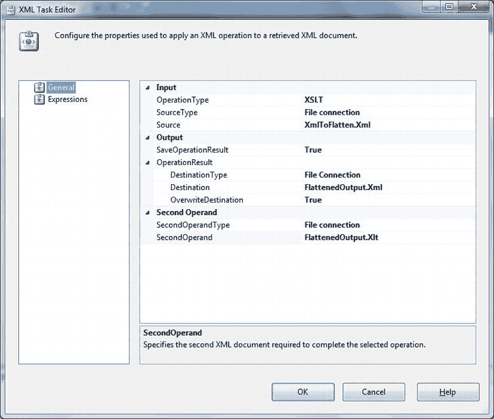
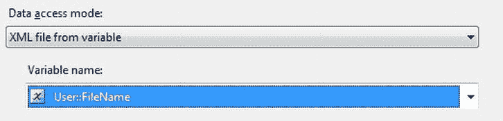

# 处理 XML 数据

## 3-7. 扁平化 XML 文件以备导入

### 问题

你需要重构一个源 XML 文件以“扁平化”它——即降低其复杂性——从而简化 XML 导入过程。

### 解决方案

使用 SSIS 和 XML 任务在导入前处理源文件。以下说明如何将 XSLT 转换应用于源 XML 文件。

1.  将源 XML 文件复制到源目录。本例中是`C:\SQL2012DIRecipes\CH03\XMLToFlatten.Xml`，内容如下：
    ```xml
    <Clients>
      <Client>
        <ClientName> John Smith</ClientName>
        <ID> 3</ID>
        <Details Town = "Uttoxeter">
          <County> Staffs</County>
          <Address1> 4, Grove Drive</Address1>
        </Details>
      </Client>
      . . . Data omitted to save space . . .
      <Client>
        <ClientName> Slow Sid</ClientName>
        <ID> 7</ID>
        <Details Town = "Avignon">
          <County> Vaucluse</County>
          <Address1> 2, Rue des Bleues</Address1>
        </Details>
      </Client>
    </Clients>
    ```

2.  准备一个 XSLT 文件，用于转换 XML 文件。本例中，文件名为`C:\SQL2012DIRecipes\CH03\FlattenedOutput.Xlt`，内容如下：
    ```xml
    <xsl:stylesheet version = "1.0" xmlns:xsl = "http://www.w3.org/1999/XSL/Transform"
                                       xmlns = "http://www.w3.org/TR/xhtml1/strict">
      <xsl:output method = "xml" indent = "yes"/>
      <xsl:template match = "/">
        <Clients>
          <xsl:for-each select = "Clients/Client">
            <Client>
              <xsl:element name = "ID">
                <xsl:value-of select = "ID"/>
              </xsl:element>
              <xsl:element name = "Name">
                <xsl:value-of select = "ClientName"/>
              </xsl:element>
              <xsl:element name = "Town">
                <xsl:value-of select = "Details/@Town"/>
              </xsl:element>
              <xsl:element name = "County">
                <xsl:value-of select = "Details/County"/>
              </xsl:element>
              <xsl:element name = "Address">
                <xsl:value-of select = "Details/Address1"/>
              </xsl:element>
            </Client>
          </xsl:for-each>
        </Clients>
      </xsl:template>
    </xsl:stylesheet>
    ```

3.  打开或创建一个 SSIS 包。在控制流窗格上添加一个`XML Task`。
4.  双击`XML Task`将其打开。将`OperationType`更改为`XSLT`（这将显著改变“常规”窗格）。
5.  对于“输入”部分，将`SourceType`设置为`File Connection`。为`Source`创建一个新的连接管理器，指向你的 XML 数据文件。
6.  对于“第二个操作数”部分，将`SecondOperandType`设置为`File connection`。为`Source`创建一个新的连接管理器，指向你的 XSD 架构文件。
7.  在“输出”部分，将`SaveOperationResult`设置为`True`。
8.  在“操作结果”部分，将`DestinationType`设置为`File Connection`。为`Destination`创建一个新的连接管理器，用于生成最终扁平化的 XML 文档。在定义连接管理器时务必选择“创建文件”。务必设置`OverwriteDestination`为`True`。对话框应类似于图 3-9。
    
    图 3-9. 使用 XML 任务应用 XSLT 转换
9.  点击“确定”确认你的更改。
10. 运行 SSIS 包，如果一切顺利，将创建一个新的目标 XML 文件，名为`C:\SQL2012DIRecipes\CH03\FlattenedOutput.Xml`。其内容应如下：
    ```xml
    <?xml version = "1.0" encoding = "utf-8"?>
    <Clients xmlns = "http://www.w3.org/TR/xhtml1/strict">
      <Client>
        <ID> 3</ID>
        <Name> John Smith</Name>
        <Town> Uttoxeter</Town>
        <County> Staffs</County>
        <Address> 4, Grove Drive</Address>
      </Client>
      . . . Data omitted to save space . . .
      <Client>
        <ID> 7</ID>
        <Name> Slow Sid</Name>
        <Town> Avignon</Town>
        <County> Vaucluse</County>
        <Address> 2, Rue des Bleues</Address>
      </Client>
    </Clients>
    ```

### 工作原理

SSIS 武器库中帮助你处理 XML 数据的另一件武器是`XML 任务`。此任务有多种用途，但我们首先介绍的是用它对 XML 文档应用 XSLT 转换。应用 XSLT 转换的原因非常多——非常多——但这里我们只讨论如何“扁平化”XML 文档。这意味着降低源文件的复杂性，使其更易于加载。正如你所看到的，得益于 XML 样式表的工作，生成的 XML 简单得多。

必然地，应用此类转换需要对 XML 和 XSLT 有合理的了解，或者愿意学习 XSLT 的功能。由于此处的目标并非提供关于 XSLT 的速成课程，因此示例非常简单。掌握了原理后，你就可以将其应用于你自己的特定业务需求。然而，有许多关于此主题的优秀书籍和文章可供你查阅，如果你需要进一步研究该主题。

在处理源文件时，XSLT 的其他常见用途包括：
*   将大型源文件切分为更小、更易于管理的文件。
*   删除数据。
*   删除对架构的引用。

### 提示、技巧和陷阱

*   与平面文件和电子表格的情况一样，我建议可能不值得为`XML`文件等一次性连接定义包级别的连接管理器。

## 3-8. 从非常大的文件导入 XML 数据，优先考虑速度

### 问题

你需要尽可能快地导入大型 XML 数据文件，因为你必须满足具有挑战性的 SLA（服务级别协议）。

### 解决方案

使用`SQLXML Bulk Load`可执行文件来加载数据，因为它几乎总是可用的最快选项。以下说明如何使用它。

1.  下载并安装`SQLXML 4.0`，除非它已经安装（参见下文关于此的说明）。
2.  定位一个 XML 源数据文件。

将每个文件的路径加载到合适的变量中（本例中为`user::FileName`）。此技术在配方 13-1 中有详细描述。
3.  双击 XML 源任务，将数据访问模式定义为`XML File from Variable`。选择你在`Foreach Loop`容器中用于保存文件名的变量，如图 3-8 所示。
    
    图 3-8. 从变量中选择 XML 源文件
4.  点击“确定”确认你的更改。
5.  切换为使用文件名变量会使所有目标任务失效，因此请双击每个任务，然后点击“确定”以移除错误指示器。

### 工作原理

显然，有时你将面临的不是单个，而是需要同时导入多个 XML 文件。只要它们的结构完全相同，那么标准方法就是使用`Foreach Loop`容器。

这里的诀窍是首先使用数据源文件的直接路径来设置流程，只有在包成功运行后，才切换为使用文件名变量。

 **注意** 对 XML 结构的任何修改都可能涉及将数据访问模式重置为`XML File Location`，重新验证所有目标任务，重新测试单源文件的数据加载，然后切换回文件变量——并再次重新验证所有目标任务！


在此示例中，它是 `C:\SQL2012DIRecipes\CH03\Clients_Simple.Xml` 文件。

3.  创建目标表。以下是本示例中要使用的表（`C:\SQL2012DIRecipes\CH03\tbl Client_XMLBulkLoad.Sql`）：

    ```
    CREATE TABLE CarSales_Staging.dbo.Client_XMLBulkLoad
    (
     ID int NULL,
     ClientName NVARCHAR(1000) NULL,
     Address1 NVARCHAR(1000) NULL,
     Town NVARCHAR(1000) NULL,
     County NVARCHAR(1000) NULL,
     Country NUMERIC(18, 0) NULL
    );
    GO
    ```

4.  创建一个 XML 架构文件。注意作为 Microsoft 映射架构一部分的扩展（`C:\SQL2012DIRecipes\CH03\SQLXMLBulkLoadImport_Simple.Xsd`）：

    ```
    <xsd:schema xmlns:xsd = http://www.w3.org/2001/XMLSchema
                xmlns:sql = "urn:schemas-microsoft-com:mapping-schema">
       <xsd:element name = "CarSales" sql:is-constant = "1" >
         <xsd:complexType>
           <xsd:sequence>
      <xsd:element name = "Client" sql:relation = "Client_XMLBulkLoad"  maxOccurs = "unbounded">
        <xsd:complexType>
           <xsd:sequence>
             <xsd:element name = "ID"          type = "xsd:integer" sql:field = "ID" />
             <xsd:element name = "ClientName"  type = "xsd:string"  sql:field = "ClientName" />
             <xsd:element name = "Address1"    type = "xsd:string"  sql:field = "Address1" />
             <xsd:element name = "Town"        type = "xsd:string"  sql:field = "Town" />
             <xsd:element name = "County"      type = "xsd:string"  sql:field = "County" />
             <xsd:element name = "Country"     type = "xsd:decimal" sql:field = "Country" />
           </xsd:sequence>
        </xsd:complexType>
      </xsd:element>
           </xsd:sequence>
         </xsd:complexType>
       </xsd:element>
    </xsd:schema>
    ```

5.  创建用于调用 SQLXML 批量加载并加载数据的 VBScript，如下所示（将此文件命名为 `C:\SQL2012DIRecipes\CH03\SQLXMLBulkload.vbs`）：

    ```
    Set objBL = CreateObject("SQLXMLBulkLoad.SQLXMLBulkload.4.0")
    objBL.ConnectionString = "provider = SQLOLEDB;data source = MySQLServer;database = CarSales_Staging;
    integrated security = SSPI"
    objBL.ErrorLogFile = "C:\SQL2012DIRecipes\CH03\SQLXMLBulkLoadImporterror.log"
    objBL.Execute "C:\SQL2012DIRecipes\CH03\SQLXMLBulkLoadImport_Simple.xsd",
    "C:\SQL2012DIRecipes\CH03\Clients_Simple.xml"
    Set objBL = Nothing
    ```

6.  双击 `C:\SQL2012DIRecipes\CH03\SQLXMLBulkload.vbs` 文件以运行批量加载。如果一切顺利，您应该能够打开 `Client_XMLBulkLoad` 表，并看到来自 XML 源文件的数据已正确加载。

## 工作原理

尽管在使用 SQL Server 时，`SQLXML 批量加载` 可能不是 XML 工具包的标准组成部分，但它是开发者资源中一颗隐藏的宝石。简而言之，它允许您将极大的数据文件作为多个表导入 SQL Server，如果需要，还能保留引用完整性——而且速度惊人。它本质上是一个 COM（组件对象模型）对象，允许您将半结构化的 XML 数据加载到 SQL Server 表中。

 **注意** 虽然 `SQLXML 4.0` 在 SQL Server 2005 及之前版本的默认安装中已包含，但对于 SQL Server 2008 及之后的版本，需要单独下载并安装（`www.microsoft.com/en-us/download/details.aspx?id=3522`）。

尽管有这些优点，许多 SQL Server 开发者要么忽略了这个出色工具的存在，要么因为其在 SQL Server 文档中解释不清而未能使用它。也许因此，它被不公平地认为是难以实现的。从 SQL Server 2008 开始，它甚至不再属于标准安装的一部分，必须作为功能包的一部分单独安装。

所以，本方法旨在澄清事实。

该工具在以下情况下使用效果最佳：

*   源 XML 文件很大时。多大算大？嗯，如果您原本计划使用 `OPENXML`，那么就是指超过 2 GB 的文件。对于加载到变量中并使用 XQuery 进行分解的 XML，相同的上限也适用。对于 `SSIS`，则取决于可用内存。我曾使用 `SQLXML 批量加载` 加载过几十 GB 的 XML 文件。
*   XML 源是相对简单的 XML（本质上是表和字段，但不过于复杂）时。源数据不能太复杂（在 XML 术语上），否则将无法加载。这被称为“半结构化”XML 数据不是没有原因的。
*   希望从同一个源文件加载多个表时。
*   数据加载速度很重要时。在我的测试中，对于没有关系链接的独立表，`SQLXML 批量加载` 的数据加载速度大约是（原生）`BCP` 速度的 90%——这按任何标准衡量都算快的！

让 `SQLXML` 加载数据的核心部分在于 XSD 文件。如您所见，它包含（除了 Microsoft 映射架构之外）一些额外的元素，使其能够如此高效地完成工作。主要的映射元素见 表 3-1。

### 表 3-1. SQLXML 映射属性

| XML 属性 | 解释 | 用途 |
| --- | --- | --- |
| `Sql:relation` | 数据被加载到的表。 | 表级别 |
| `sql:field` | 数据被加载到的目标表中的字段。 | 字段级别 |

本质上，您必须扩展架构（无论是手工精心制作的，还是使用方法 7-12 中描述的方法之一初始创建的），添加允许 `SQLXML` 将源数据引导到正确的表和字段的属性。这是这种 XML 加载技术中较难的部分，很可能也是您花费时间最多的地方，因此在尝试复杂的数据加载之前，值得确保您已理解 XSD 扩展。您甚至可能会发现，从简单的 XML 文件开始练习会事半功倍。

调用 `SQLXML 批量加载器` 的 `.vbs` 文件可以非常简单，至少需要包含以下内容：

*   对象创建语句——用于调用 `SQLXML 批量加载` COM 对象。
*   一个连接字符串，至少包含：
    *   服务器以及（如果需要）实例名称（`Data Source`）。
    *   目标数据库名称（本例中为 `CarSales_Staging`）。
    *   SQL Server 安全信息（Windows 集成安全或 SQL Server 安全）。
*   `Execute` 命令，提供 XSD 和 XML 文件的路径。
*   一条 `SET` 命令以释放 COM 对象。
*   一个 `ErrorLog` 文件。虽然这并非绝对必要，但它非常有用。

如果成功了，您会知道——因为没有 `ErrorLog` 文件——或者旧的 `ErrorLog` 文件被删除了（假设您已请求生成日志文件）。哦，还有数据确实已正确加载这一事实。

如果数据未能加载，那么您的首要检查点就是 `SQLXML 批量加载` 创建的 `ErrorLog` 文件（假设您使用了 `objBL.ErrorLogFile` = `"日志文件及路径"` 参数）。因此，虽然创建此文件不是强制性的，但如果您想使用 `SQLXML 批量加载` 调试数据加载操作，它几乎是必需的。幸运的是，这些文件非常明确，无疑将成为宝贵的调试信息来源。`ErrorLog` 文件是可选的——但对于调试过程来说，它是无价之宝（除非一切一次成功且每次都能完美运行）。

然而，在创建 XSD 文件时，要避免错误，有一些经典事项需要注意。根据我的经验，架构文件是最常见的问题来源，因为它涉及到一定量的手工制作。潜在问题包括：

*   确保在 `xsd:element` 定义中使用的所有双引号内部没有紧邻的空格。

