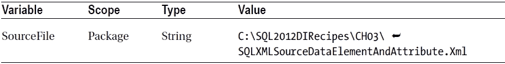
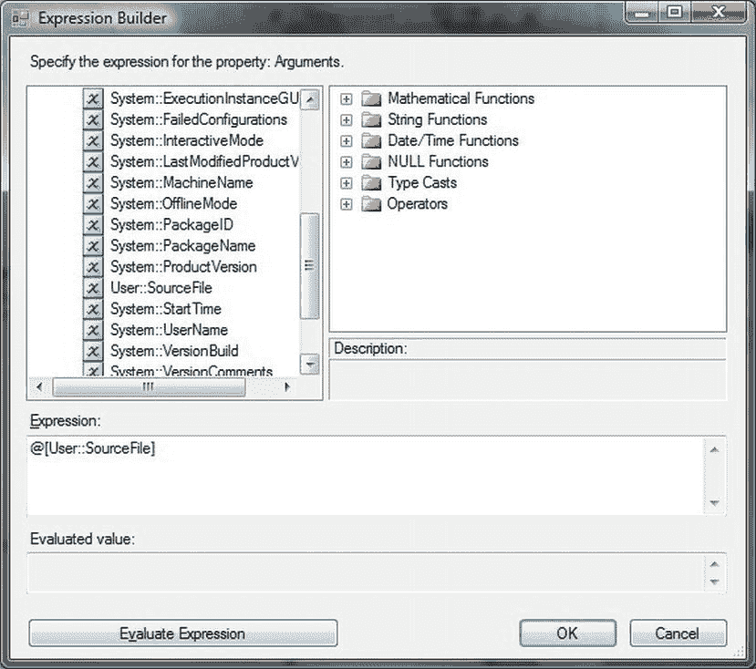
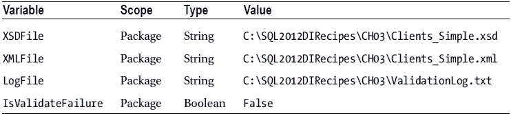

# SQLXML 批量加载配置与集成

## 溢出列配置
上一配方中的示例应写作：
```xml
<xsd:element name = "Invoice" sql:relation = "Invoice"
    sql:overflow-field = "DataOverflowColumn">
```
在目标表中添加一列，使用你在模式文件中指定的名称。再次使用上一配方的示例：
```sql
ALTER TABLE Invoice ADD DataOverflowColumn NVARCHAR(MAX)
```
当然，你可以根据需要设置溢出列的类型和长度。现在当你运行 SQLXML 导入时，任何在 XML 模式文件中未映射的数据都将被插入到每行的溢出列中。如果模式未通过使用 `sql:overflow-field` 注解指定溢出列，XML Bulk Load 将忽略 XML 文档中存在但不在映射模式中的数据。

## 数据类型与身份列处理
与大多数批量加载工具一样，SQLXML 允许你保留源文件中的身份列信息。这是通过在 VBScript 文件中使用以下额外参数完成的：
```vbscript
objBL.KeepIdentity = True
```
你可以使用的数据类型不仅限于（几乎）无处不在的 `int` 和 `string` 类型。XML 模式定义允许以下类型——其对应的 SQL Server 类型在 表 3-3 中给出。

表 3-3. SQLXML 批量加载数据类型

| SQL Server 数据类型 | XSD 数据类型 |
| --- | --- |
| `bigint` | `long` |
| `binary` | `base64Binary` |
| `bit` | `boolean` |
| `char` | `string` |
| `datetime` | `dateTime` |
| `decimal` | `decimal` |
| `float` | `double` |
| `image` | `base64Binary` |
| `int` | `int` |
| `money` | `decimal` |
| `nchar` | `string` |
| `ntext` | `string` |
| `nvarchar` | `string` |
| `numeric` | `decimal` |
| `real` | `float` |
| `smalldatetime` | `dateTime` |
| `smallint` | `short` |
| `smallmoney` | `decimal` |
| `sql_variant` | `string` |
| `sysname` | `string` |
| `text` | `string` |
| `timestamp` | `dateTime` |
| `tinyint` | `unsignedByte` |
| `varbinary` | `base64Binary` |
| `varchar` | `string` |
| `uniqueidentifier` | `string` |

然而，SQLXML 会忽略模式文件中指定的类型（除了少数稍后提到的情况）。所以你可能会问：“那这个有什么用？”我认为有两个用途：
*   迫使开发者跟踪外部数据类型。
*   生成尽可能接近源数据的表（使用 `SchemaGen` 选项）。

因此，在编写模式文件时，你甚至可以指定要使用的精确 SQL Server 数据类型和长度。例如：
```xml
xsd:element name="Name" type="xsd:string" sql:field="FieldName" sql:datatype="NVARCHAR(15)"/>
```
但是，此参数在导入操作期间会被忽略，仅用于创建表。

## 特殊数据类型处理
如果类型是 `dateTime` 或 `time`，你必须指定 `sql:datatype`，因为 SQLXML Bulk Load 在将数据发送到 SQL Server 之前会进行转换。或者，映射到 `VARCHAR` 字段，并在导入后使用 `CAST` 或 `CONVERT` 转换为日期/时间类型（这也能确保遵循 SQL Server 的日期范围）。

请记住，当你批量加载到 SQL Server 的 `uniqueidentifier` 类型列，并且 XSD 值是一个包含大括号（`{` 和 `}`）的 GUID 时，必须指定 `sql:datatype="uniqueidentifier"`，以便 SQLXML Bulk Loader 在值插入目标列之前移除大括号。如果未指定数据类型，则值将带着大括号发送，加载将失败。你可以使用以下语法设置默认值：
```xml
<xsd:element name="Comments" default="N/A" />
```
如果映射模式为属性指定了默认值，而 XML 源数据不包含该属性，XML Bulk Load 将使用该默认值。

你可以通过添加 `sql:mapped="false"` 到元素描述来跳过一个元素（除了简单地从模式文件中省略该元素）。这对于临时“注释掉”一个元素很有用。

## 从 T-SQL 调用
到目前为止，你一直通过执行 VBScript 文件来运行 SQLXML Bulk Load。你也可以从 T-SQL 执行此操作，作为更广泛自动化过程的一部分。要加载配方 3-9 中使用的初始 XML 文件，T-SQL 代码如下（`C:\SQL2012DIRecipes\CH03\LoadXMLFromTSQLWithvbs.Sql`）：
```sql
DECLARE @handle INT;
DECLARE @VBSobject INT;
EXECUTE @handle = sp_OACreate 'SQLXMLBulkLoad.SQLXMLBulkLoad.4.0', @VBSobject OUT;
EXECUTE @handle = sp_OASetProperty @VBSobject, 'ConnectionString',
    'provider=SQLOLEDB;data source= ADAM02;database=CarSales_Staging;Uid= Adam;Pwd = Me4B0ss;';
EXECUTE @handle = sp_OASetProperty @VBSobject, 'ErrorLogFile',
    'C:\SQL2012DIRecipes\CH03\SQLXMLBulkLoadImporterror.log';
EXECUTE @handle = sp_OAMethod @VBSobject, 'Execute', NULL,
    'C:\SQL2012DIRecipes\CH03\SQLXMLBulkLoadImport_Simple.xsd',
    'C:\SQL2012DIRecipes\CH03\Clients_Simple.xml';
EXECUTE @handle = sp_OADestroy @VBSobject;
```
这需要启用 `OA_Automation`，可以通过使用 Facets/外围应用配置工具（或在 SQL Server 2005 中仅为外围应用配置），或通过运行以下命令来实现：
```sql
EXECUTE master.dbo.sp_configure 'Ole Automation Procedures', 1;
GO
reconfigure;
GO
```
当然，在调用 SQLXML Bulk Load 时，你可以使用 T-SQL 变量代替硬编码的文件、路径、服务器、数据库和连接字符串元素。

## 集成到 ETL 流程
### 3-12. 作为常规 ETL 过程的一部分运行 SQLXML Bulk Loader
**问题**
你希望作为常规 ETL 过程的一部分调用 SQLXML Bulk Loader。

**解决方案**
从 SSIS 调用 `.vbs` 文件来调用 SQLXML Bulk Loader。

1.  创建一个 `.vbs` 文件，修改为接受输入参数（并命名为 **C:\SQL2012DIRecipes\CH03\SQLXMLBulkloadSSIS.vbs**），如下所示：
    ```vbscript
    Set InputVars = Wscript.Arguments
    XMLSource = InputVars.Item(0)
    Set objBL = CreateObject("SQLXMLBulkLoad.SQLXMLBulkload.4.0")
    objBL.ConnectionString = "provider = SQLOLEDB;data source = ADAM02;database= CarSales_Staging;Uid=Adam;Pwd= Me4B0ss"
    objBL.ErrorLogFile="C:\SQL2012DIRecipes\CH03\SQLXMLBulkLoadImporterror.log"
    objBL.Execute "C:\SQL2012DIRecipes\CH03\SQLXMLBulkLoadImportElementAndAttribute.xsd",
    XMLSource
    Set objBL = Nothing
    ```
2.  创建一个新的 SSIS 包并添加以下变量：
    
3.  添加一个“执行进程”任务。双击进行编辑。
4.  在左侧点击“进程”。
5.  将“可执行文件”设置为 `C:\Windows\System32\WScript.exe`。
6.  将“参数”设置为 `C:\SQL2012DIRecipes\CH03\SQLXMLBulkloadSSIS.vbs`。
7.  将“窗口样式”设置为“隐藏”。
8.  在左侧点击“表达式”。浏览“属性表达式编辑器”。选择“参数”。浏览到“表达式生成器”。
9.  展开“变量”并将 `[User::SourceFile]` 变量拖到“表达式”字段中。“表达式生成器”应如 图 3-10 所示。
    
    图 3-10. 使用表达式与 SQLXML Bulk Loader 和 SSIS
10. 点击“确定”确认表达式选择，共两次。
11. 点击“确定”确认你的修改。
12. 运行该包将调用 SQLXML Bulk Load 并导入 XML 文件。

**工作原理**
到目前为止，我们一直将 SQLXML Bulk Loader 与 SSIS 分开讨论，仿佛两者注定要分开存在。幸运的是，情况并非如此，两者可以作为 ETL 过程的一部分协同工作。为求简单，我倾向于使用“执行进程”任务来运行 SQLXML Bulk Loader。


这看似过于简单，但稍作调整，就能使其运行得极为顺畅。实际上，这个方法的作用是将要导入的文件名作为参数 `XMLSource` 传递给 `.vbs` (VBscript) 文件——这使你能够将此方法作为使用 `Foreach` 容器进行多文件加载的一部分。
在 `.vbs` 脚本顶部添加新的一行，可以让你将变量传递到脚本中。变量数量可以根据需要设定，但你必须在脚本中捕获所有这些变量——并按正确顺序传递。这意味着你可以传入多个参数（例如一个架构文件）。只需在 `.vbs` 文件的顶部再添加一行，如下所示：
```
SchemaFile = InputVars.Item(1)
```
然后，在 “Execute” 命令中使用这个变量，以替代硬编码的 XSD 文件和路径。
如果你不想使用变量，也可以将文件名放在参数字段中。这将被传递给 `.vbs` VBscript 文件。如果这样做，那么创建变量（以及在表达式中使用它）就是多余的。

#### 提示、技巧与陷阱
*   如果你将此任务放在 `Foreach` Loop 容器中（集合设置为 `Foreach File Enumerator`，变量映射设置为输出到 `User::SourceFile` SSIS 变量），你就可以从目录中加载多个文件。
*   如果你浏览选择 `.vbs` 文件，记得将文件类型设置为 `All Files`。

## 3-13. 在脚本化解决方案中根据架构文件验证 XML 文档
### 问题
你需要根据 XSD 文件验证一个 XML 数据文件。
### 解决方案
创建一个 `.vbs` 文件并使用微软的 `MSXML2` XML 解析器。具体操作如下：
1.  创建一个名为 `C:\SQL2012DIRecipes\CH03\Validate.vbs` 的 `.vbs` 文件，内容如下：
    ```
    Dim SchemaCache
    Set SchemaCache = CreateObject("MSXML2.XMLSchemaCache.6.0")
    SchemaCache.Add "", "C:\SQL2012DIRecipes\CH03\FlattenedOutput.Xsd"

    Dim XMLDoc
    Set XMLDoc = CreateObject("MSXML2.DOMDocument.6.0")

    Set XMLDoc.schemas = SchemaCache

    XMLDoc.async = False
    XMLDoc.Load "C:\SQL2012DIRecipes\CH03\FlattenedOutput.xml"

    If XMLDoc.parseError.errorCode <> 0 Then
    wscript.quit 1
    end if
    ```
2.  在 Windows 资源管理器中双击该文件以运行。
### 工作原理
如果你面对的是一个真正庞大的 XML 源文件，没有什么比处理数分钟后加载失败更糟糕的了。因此，首先验证 XML 数据源文件是否构造正确，以便预先警告潜在的错误，这样会快得多。对于大文件来说，这不是一个即时完成的过程——但它比加载失败后才发现错误要快得多。验证 XML 文档是否符合架构文件的一种方法是使用 VBScript。然后可以从命令窗口、T-SQL 或 SSIS 运行此脚本。本方法展示了如何创建一个通用的验证例程。它只是简单地确定一个文件是否可以通过验证——并不试图记录错误。
首先，架构文件被添加到架构缓存中。然后将其设置为 XML 文档的架构，最后加载文档。如果没有错误，脚本返回 0；如果有错误，则返回 1。
你可以像运行 `SQLXML Bulk Load` 任务一样，从 SSIS 中的 `Execute Process` 任务运行此脚本。只需记得检查 `SuccessValue` 字段是否设置为 0。实际上，你可以按照前面描述的方式，将 XML 和 XSD 文件作为参数传入。事实上，由于该任务会像其他 SSIS 任务一样成功或失败，然后你可以根据结果分支处理流程，类似于方法 3-14 中描述的方式。根据你的包构造方式，你可能需要调整 `FailParentOnFailure` 和 `FailPackageOnFailure` 属性。

#### 提示、技巧与陷阱
*   如果你从命令窗口或通过双击运行脚本文件，你可能想在 `wscript.quit 1` 行之前添加 `MsgBox("Errors encountered")` 或类似代码。当然，如果脚本是作为自动化流程的一部分运行，则不应使用消息框。
*   如果你希望验证成功后运行批量加载过程，可以在 `XMLDoc.parseError.errorCode` 后添加一个 `Else`，然后添加本章前面使用的调用 `SQLXMLBulkLoad` 并加载数据的代码。

## 3-14. 在 SSIS 中根据架构文件验证 XML 文档
### 问题
你希望作为 SSIS 流程的一部分，根据 XSD 架构验证源 XML 文件。
### 解决方案
使用 SSIS 脚本任务，通过 .NET 的 `XML.Schema` 类执行 XML 验证。
1.  创建一个新的 SSIS 包并添加以下变量：
    
2.  添加一个 `Script` 任务。双击进行编辑。将 `Script Language` 设置为 `Microsoft Visual Basic 2010`。将变量 `LogFile`、`XMLFile` 和 `XSDFile` 设置为只读变量。将 `IsValidateFailure` 设置为读写变量。
3.  点击 `Edit Script`。
4.  将以下指令添加到 `Import` 区域：
    ```
    Imports System.IO
    Imports System.Xml
    Imports System.Xml.Schema
    Imports System.Xml.XPath
    ```
5.  用以下代码替换 `Main` 方法 (`C:\SQL2012DIRecipes\CH03\ValidateXML.vbs`)：
    ```
        Dim SW As StringWriter = New StringWriter
        Dim IsValidateFailure As Boolean = False

        Public Sub Main()

            Dim XSDFile As String = Dts.Variables("XSDFile").Value.ToString
            Dim XMLFile As String = Dts.Variables("XMLFile").Value.ToString
            Dim LogFile As String = Dts.Variables("LogFile").Value.ToString
            Dim XMLDoc As New XmlDocument

            XMLDoc.Load(XMLFile)
            XMLDoc.Schemas.Add("", XSDFile)
            Dim EvtHdl As ValidationEventHandler = _
                New ValidationEventHandler(AddressOf ValidationEventHandler)
            XMLDoc.Validate(EvtHdl)
            If IsValidateFailure Then
                If File.Exists(LogFile) Then
                    File.Delete(LogFile)
                End If
                Dim FlOut As New System.IO.StreamWriter(LogFile)
                FlOut.Write(SW.ToString)
            End If
            Dts.Variables("IsValidateFailure").Value = IsValidateFailure
            Dts.TaskResult =  ScriptResults.Success
        End Sub

        Private Sub ValidationEventHandler(ByVal sender As Object, _
                                           ByVal e As ValidationEventArgs)
            SW.WriteLine(e.Message.ToString)
            IsValidateFailure = True
        End Sub
    ```
6.  关闭脚本窗口，并点击 `OK` 确认你的更改。
7.  向数据流面板添加一个 `Data Flow` 任务（如果你正在使用 SSIS 加载 XML 文件）或一个 `Execute Process` 任务（如果你正在使用 `SQLXML Bulk Load` 加载 XML 文件），并将脚本任务连接到它。
8.  双击约束（连接线）并将其设置为：
    ```
    Evaluation Operation:     Expression And Constraint
    Value:                    Success
    Expression:               @IsValidateFailure == False
    ```
9.  按照本章前面方法 3-4 的描述配置 XML 加载。
10. 向数据流面板添加一个 `Send Mail` 任务，并将脚本任务连接到它。
11. 双击约束（连接线）并将其设置为：
    ```
    Evaluation Operation:     Expression And Constraint
    Expression:                        @IsValidateFailure == True
    ```
12. 配置 `Send Mail` 任务，以便在 XML 无法通过验证时提醒你。该包应类似于 图 3-11。


