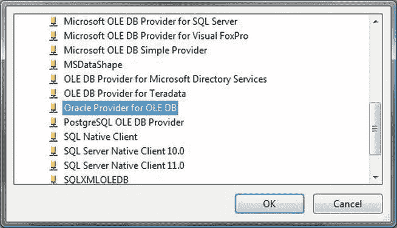
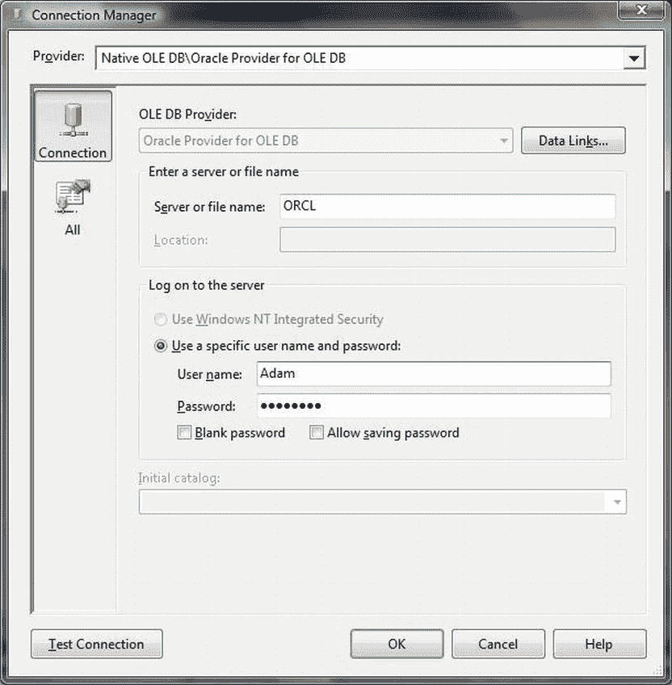
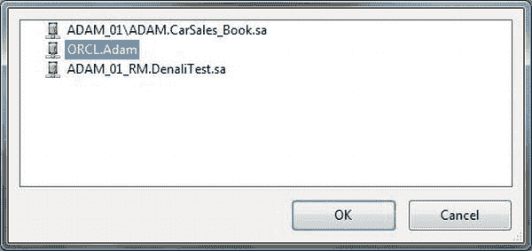
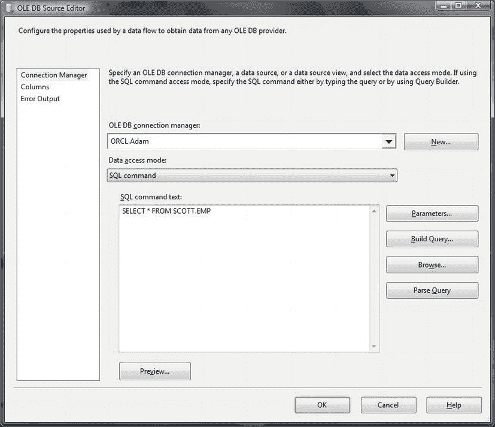

# 4-2. 从 Oracle 导入数据作为常规过程

## 问题
你希望定期导入 Oracle 数据，并且可以通过网络连接到 Oracle 源数据库。

## 解决方案
实现一个 SSIS 包来加载数据。请按照以下步骤操作：

1.  打开或创建一个 SSIS 包。在控制流窗格中添加一个数据流任务。
2.  双击数据流任务进行编辑。添加一个 OLEDB 源和一个 OLEDB 目标任务。
3.  创建一个名为 `CarSales_Staging_OLEDB` 的 OLEDB 连接管理器，用于建立到 `CarSales_Staging` 数据库的连接。
4.  右键单击屏幕底部的“连接管理器”选项卡，选择“新建 OLEDB 连接”。单击“新建”。在提供程序列表中，选择“Oracle Provider for OLEDB”。你应该会看到类似图 4-1 的内容。
    
    图 4-1。选择用于 OLEDB 的 Oracle 提供程序
5.  单击“确定”确认提供程序。
6.  在连接管理器对话框的“服务器或文件名”中，输入 `TNSNames.ora` 文件中的地址名称。
7.  在连接管理器对话框中输入 Oracle 登录信息（参见图 4-2）。
    
    图 4-2。Oracle 的 SSIS 连接管理器
8.  测试连接。如果确认连接成功的消息，则单击“确定”完成连接管理器的创建。将其重命名为 `ORCLAdam`——或适合你要求的名称。
9.  双击 OLEDB 源任务。选择你刚刚定义的连接管理器（参见图 4-3）。
    
    图 4-3。选择 Oracle 连接管理器
10. 选择源数据库中要使用的表或视图。或者，将数据访问模式设置为“SQL 命令”并编写用于选择数据的 SQL。源对话框应如图 4-4 所示。
    
    图 4-4。SSIS 用于选择 Oracle 数据的 OLEDB 源编辑器
11. 点击“确定”确认配置。
12. 将 OLEDB 源任务链接到目标任务。配置其使用 `CarSales_Staging_OLEDB` 连接管理器。
13. 点击“新建”以创建新表。点击“确定”确认。
14. 在目标任务中映射列。确认目标任务是正确的。这方面的完整细节在其他许多地方有描述，例如配方 1-7。

现在你可以运行 SSIS 包并导入源数据。

## 工作原理
幸运的是，使用 SSIS 导入外部数据极其简单。我在这里假设你了解基本的 SSIS 知识，因为本书中有许多 SSIS 数据导入的例子，所以我没有解释每一个细节。这里的关键点是专注于到 Oracle 数据库的 OLEDB 链接。一旦这部分工作正常，其余部分应该就很容易了。

然而，正如配方 4-1 所述，Oracle 有一套明确的前提条件：

*   你需要在 SQL Server 上安装 Oracle 客户端。
*   你必须确保到 Oracle 服务器的网络连接正常工作。
*   你需要一个具有检索所需数据权限的 Oracle 用户登录名和密码。

#### 提示、技巧与陷阱

*   在大型、“真实世界”的 Oracle 数据加载情况下，如果你使用的是 SQL Server 2012，建议你在包级别（在解决方案资源管理器的“连接管理器”文件夹中）创建连接管理器。因为你很可能在多个包中多次使用它来源许许多多的表。
*   在步骤 11 你可能会遇到列代码页警告。要避免它，请记住可以使用高级编辑器将“组件属性”选项卡的 `AlwaysUseTheDefaultCodePage` 属性设置为 True。`DefaultCodePage` 可以设置为 1252，这对于大多数西方语言都适用。如果 Oracle 使用的是其他字符集，你需要确定是哪一种并在 SSIS 中选择等效项。
*   由于 BIDS/SSDT（仍然）是一个 32 位工具，只有在同时安装了 32 位和 64 位 Oracle 提供程序的情况下，你才能在 64 位计算机上看到 Oracle OLEDB 提供程序，如配方 4-1 所述。
*   一些 Oracle 源表在使用 `NUMBER` 数据类型时未指定精度。这可能导致 SSIS 出现问题，你可能需要添加精度。执行此操作的最简单方法是在步骤 9 中用于提取源数据的 SQL 中使用 Oracle 的 `CAST` 或 `CONVERT` 函数。
*   当配置为 Oracle 提供程序时，连接管理器对话框不会列出所有可用的目录。
*   在生产环境中，你大概会将密码作为包配置的一部分存储。
*   数据类型映射在附录 A 中讨论。

