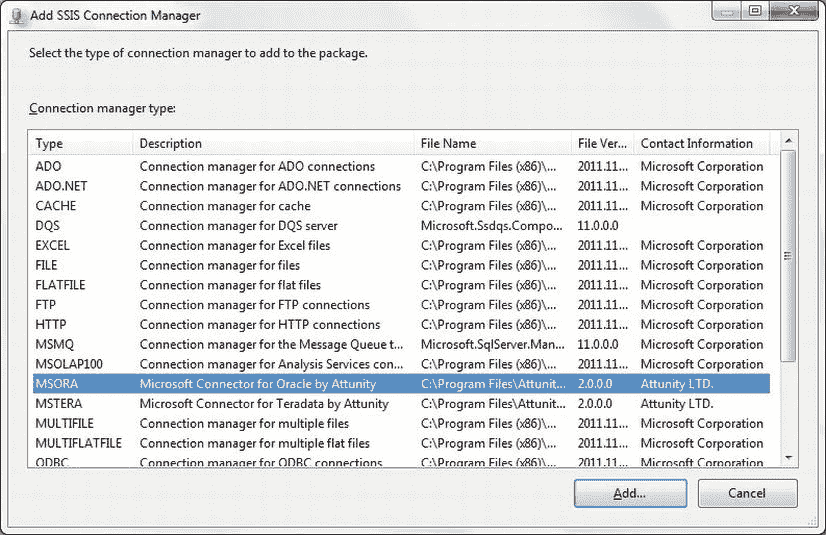
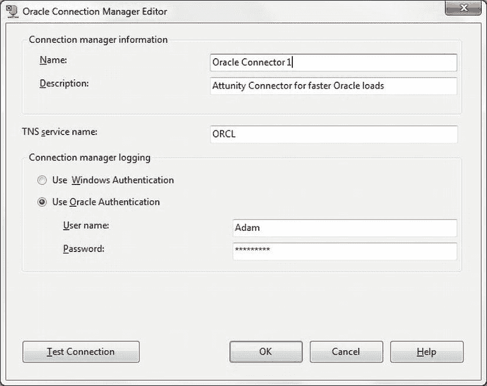
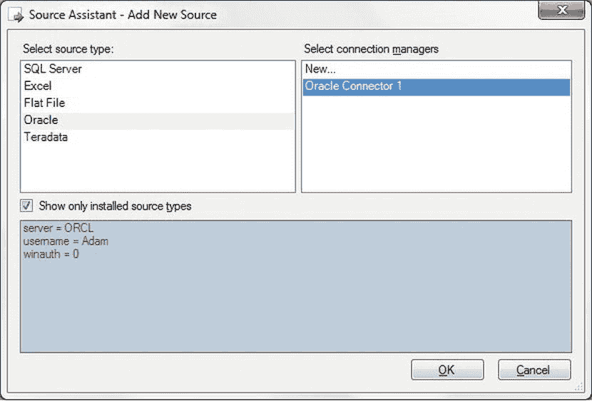

# 4-3. 加速 Oracle 数据导入

## 问题
你需要加载的 Oracle 数据量所需时间超出了你可用的时间。

## 解决方案
要加速数据加载，请使用随 SQL Server Enterprise 版提供的 Attunity SSIS Connectors for Oracle。以下说明如何操作：

1.  下载与你环境（32 位或 64 位）对应的 Attunity SSIS Connector for Oracle。它们当前位于 `www.microsoft.com/en-gb/download/details.aspx?id=29284`。
2.  双击 `.msi` 文件并安装连接器。你可以修改一些安装参数，但接受默认设置几乎总是更简单。
3.  在一个 SSIS 包中，右键单击“连接管理器”选项卡内部，在“添加 SSIS 连接管理器”对话框中选择 `MSORA`。对话框应如图 4-5 所示。
    
    图 4-5。添加 Attunity SSIS 连接管理器
4.  单击“确定”并添加所有必需的连接参数。这些基本上与配方 4-2 的步骤 6 中描述的参数相同。对话框应如图 4-6 所示。
    
    图 4-6。为 Oracle 配置 Attunity 连接管理器
5.  在 SSIS 包中添加一个数据流任务。双击进行编辑。
6.  在 SSIS 工具箱中双击“源助手”。
7.  在左窗格中选择 `Oracle` 作为源类型。在右窗格中选择你刚刚创建的连接管理器。对话框应如图 4-7 所示。
    
    图 4-7。SSIS 数据流源助手
8.  单击“确定”。

