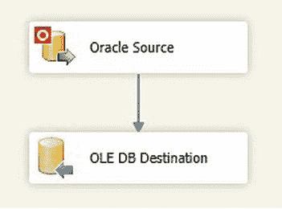
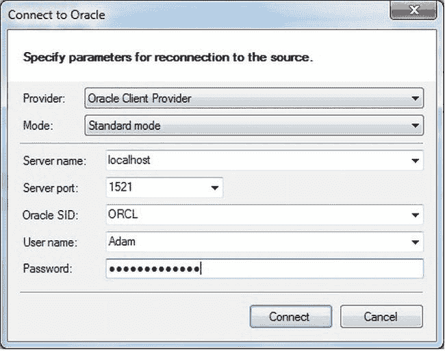
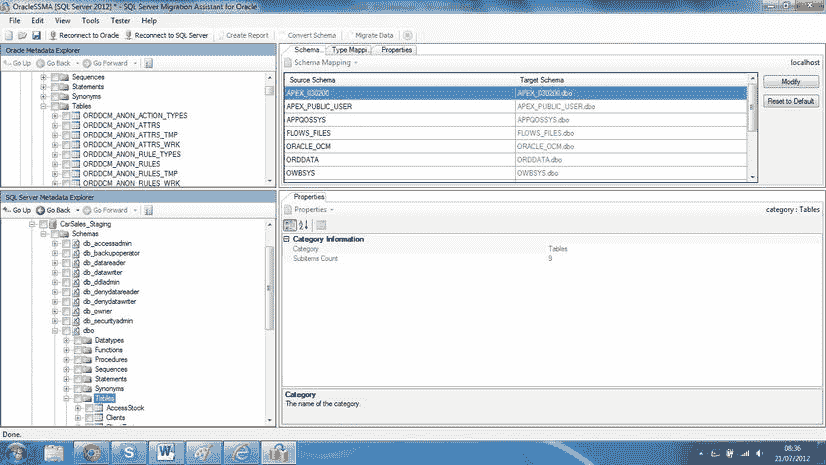
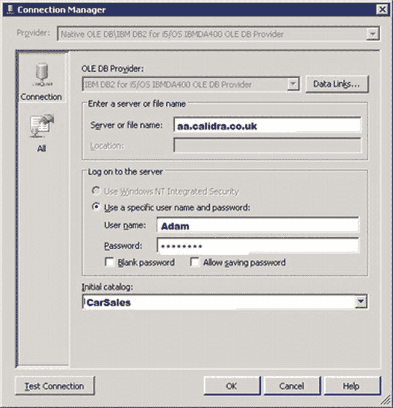
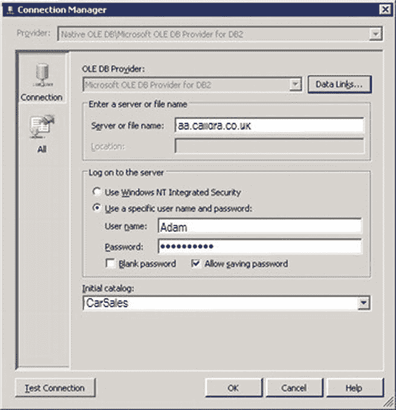
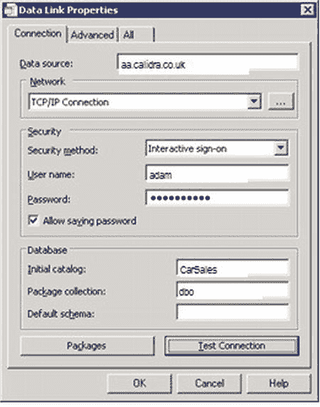
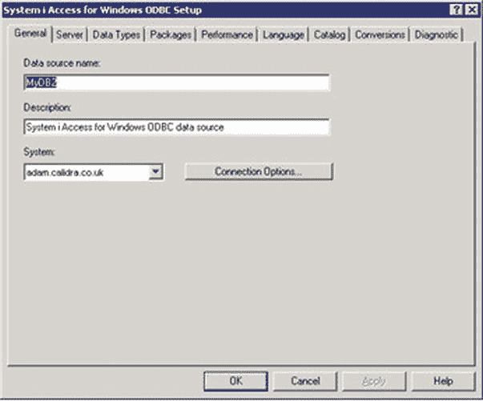

# 4-4. “临时”导入 Oracle 数据

您想通过网络从 Oracle 将数据导入 SQL Server，而不必麻烦地开发一个基于 SSIS 的解决方案。

使用 T-SQL 和 `OPENROWSET`——或者设置一个链接服务器。

将 Attunity Oracle 源组件添加到数据流窗格中。双击进行编辑。确保选中所需的连接管理器。然后，选择所需的数据访问模式（表或 SQL 命令）。选择表或视图——或者输入相应的 SQL `SELECT` 语句。单击“确定”。添加一个目标组件，将源连接到它，并映射列。数据流窗格应类似于图 4-8。



图 4-8. 使用 Attunity Oracle 源完成的 SSIS 数据流

现在您可以运行 Oracle 数据导入了。

## 工作原理

如果您使用的是 SQL Server 企业版，可以下载用于 Oracle 的 Attunity 连接器，并使用 SSIS 实现比使用 Oracle 连接器可能达到的速度快得多的数据加载。您需要在 SQL Server 上安装 Oracle 客户端。使用设置 Oracle 客户端时配置的 TNS 服务名。否则，无论如何，Attunity 连接器都比 Microsoft 或 Oracle 提供程序更简单；并且在我进行的测试中，它加载 Oracle 数据的速度要快数倍。一个有趣的方面是，您必须使用 SSIS 数据流源助手来创建 Attunity 数据源，而不是直接从 SSIS 工具箱拖放源任务。这里再次说明（本质上是为了避免无意义的重复），我并未深入探讨配置 OLEDB 目标的细节。如果您需要更详细的 OLEDB 目标示例，配方 1-7 包含一个更详细的示例。

## 提示、技巧和陷阱

*   与 SQL Server 2008 不同，您显然无法将 Attunity 连接器添加到 SSIS 工具箱。
*   迁移整个数据库时，您可能会发现以下资源很有用：`www.microsoft.com/sqlserver/en/us/product-info/migration-tool.aspx#Oracle`。

以下代码将使用 `OPENROWSET` 将数据从 Oracle 插入到 SQL Server 表中（`C:\SQL2012DIRecipes\CH02\OpenRowsetOracle.sql`）：

```sql
SELECT * INTO MyOracleTable
FROM OPENROWSET ('OraOLEDB.Oracle', 'MyOracle';'SCOTT';'Tiger',
                'select * from SCOTT.EMP');
```

## 工作原理

与第 1 章中描述的 Microsoft Office 产品一样（或者实际上当从其他 SQL Server 实例访问数据时），您可以“临时”地从 Oracle 数据源读写数据。首先，让我们看看如何使用 `OPENROWSET` 运行“临时”查询。然而，根据您的环境，这可能有点慢。因此，我建议您彻底测试此方法，以确保如果您选择实施它，能够满足您的服务级别协议（SLA）。

至少，您需要以下条件：

*   Oracle 客户端安装在 SQL Server 上。
*   与 Oracle 服务器的网络连接（没有防火墙问题！）。
*   具有您希望检索数据访问权限的 Oracle 用户登录名和密码。
*   在 SQL Server 上启用临时查询（如配方 1-4 所述）。

`OPENROWSET` 函数由三个元素组成：

*   OLEDB 提供程序 (`OraOLEDB.Oracle`)。我使用的是 Oracle 提供程序。
*   连接字符串 (`'MyOracle';'SCOTT';'Tiger'`)。
*   查询 (`'select * from SCOTT.EMP'`)。

需要注意的主要事项是连接字符串包含（按此顺序）：

*   Oracle 实例（前面示例中的 `MyOracle`）。
*   用户 ID (SCOTT)。
*   密码 (Tiger)。

请注意，所有这些都用分号分隔，连接字符串和查询之间用逗号分隔。

对于更永久的双向连接到外部数据库（使用 OLEDB），链接服务器通常是最佳答案。要添加 Oracle 链接服务器，请在 SQL Server Management Studio 中执行以下代码片段。我将此配方之后的所有代码放在一个示例文件中（`C:\SQL2012DIRecipes\CH02\OracleLinkedServer.sql`）：

```sql
EXECUTE master.dbo.sp_addlinkedserver
    @server = 'MyOracleDatabase',
    @srvproduct = 'Oracle',
    @provider = 'OraOLEDB.Oracle',
    @datasrc = 'MyOracle';

EXECUTE master.dbo. sp_addlinkedsvrlogin
   @rmtsrvname = 'MyOracleDatabase',
   @useself = 'false',
   @locallogin = NULL,
   @rmtuser = 'SCOTT',  -- Oracle 用户名
   @rmtpassword = 'Tiger'; -- Oracle 用户密码
```

然后，您可以使用标准的四部分命名约定从链接服务器中的表和视图读取数据（或写入）。

在 SQL Server Management Studio 中执行以下代码片段，读取 Oracle 表的内容并将其导入到 SQL Server 表中：

```sql
SELECT * INTO dbo.MyOracleTable
FROM MyOracleDatabase..SCOTT.EMP;
```

如果您只想导入表结构（或源视图的结构），则可以使用以下代码片段：

```sql
SELECT * INTO dbo.MyOracleTable
FROM MyOracleDatabase.. SCOTT.EMP
WHERE 1 = 0;
```

这将向您展示 SQL Server 如何映射数据类型，这可能非常有用。

或者，您可以使用 `OPENQUERY` 语法导入数据，如下所示：

```sql
SELECT * INTO dbo.MyOracleTable
FROM OPENQUERY(MyOracleDatabase,'select * from SCOTT.EMP');
```

另一种提取数据的方法是使用 SQL Server 2005（及更高版本）的功能 `EXEC...AT`。最简单地说，它使用链接服务器执行命令，如下所示：

```sql
EXEC ('SELECT * FROM SCOTT.EMP') AT MyOracleDatabase;
```

因此，假设您有一个目标表结构，您可以像这样导入数据：

```sql
INSERT INTO dbo.MyOracleTable
EXEC ('SELECT * FROM SCOTT.EMP') AT MyOracleDatabase;
```

这可以很容易地调整以接受作为 T-SQL 一部分的参数，从而允许您微调数据选择：

```sql
DECLARE @EMPNO INT = 7369;

INSERT INTO dbo.MyOracleTable
EXEC ('SELECT * FROM SCOTT.EMP WHERE EMPNO = ' + @EMPNO ) AT MyOracleDatabase
```

最后，如果 Oracle DBA 设置了一个 PL/SQL 存储过程来返回数据集，您可以运行：

```sql
INSERT INTO dbo.SCOTT_EMP
EXEC (BEGIN SCOTT.MyPLSQLProcedurehere; END) AT MyOracleDatabase;
```

外部服务器可能是大小写敏感的——事实上，我见过的大多数 Oracle 实现都是如此。因此，为了避免潜在问题，在使用链接对象时，建议使用对象所需的大小写。更准确地说，Microsoft 联机丛书 (BOL) 指出，如果表名和列名是在 Oracle 中不带引号标识符创建的，则使用全大写名称；否则，使用完全相同的大小写。

## 提示、技巧和陷阱

*   必须将 `'OraOLEDB.Oracle'` 提供程序的 `AllowInProcess` 属性设置为 1（在 SSMS 中右键单击提供程序：服务器对象  链接服务器  提供程序以更改此设置）。
*   您需要为链接服务器设置 `Set RPC OUT` 服务器选项，才能使 `EXEC...AT` 正常工作。在 SSMS 中右键单击链接服务器并选择“属性”以修改此选项。
*   SQL Server 数据导入向导也可以导入 Oracle 数据。由于该工具在配方 1-2 和 2-1 中已相当详尽地描述，我将请您参考第 1 章和第 2 章。将其用于 Oracle 源数据时，您需要指定将使用用于 Oracle 的 OLEDB 驱动程序（由 Microsoft 或（优选）Oracle 提供）。
*   要列出链接服务器中所有可用的表，请参阅第 8 章。

![image](images/sq.


**注意**  
我知道在这个示例中使用 `SELECT *` 是糟糕的编程习惯。我采用此方法的原因是，在实践中连接到外部数据库时，你并不总是能掌握源数据的详细信息。通过返回所有可用字段，你至少可以对源数据有一个初步的了解，进而仔细查看字段和数据本身。在定义用于生产的最终代码时，你当然应该只 `SELECT` 那些你希望导入 SQL Server 的字段。

## 4-5. 迁移多个 Oracle 表和视图

### 问题
你有数十甚至数百个 Oracle 源表和/或视图，需要作为迁移的一部分加载到 SQL Server 中。

### 解决方案
使用适用于 Oracle 的 SSMA（SQL Server 迁移助手）。以下说明如何准备 SQL Server 对象并从 Oracle 方案加载数据：

1.  下载并安装适用于 Oracle 的 SSMS。当前版本可在 `www.microsoft.com/en-us/download/confirmation.aspx?id=28766` 获取。
2.  运行适用于 Oracle 的 SSMA（开始 → 所有程序 → SQL Server Migration Assistant 2012 for Oracle）。
3.  单击文件 → 新建项目。输入一个名称。然后，输入或浏览到项目将存储的目录。
4.  单击“连接到 Oracle”工具栏按钮。输入 Oracle 连接信息。你应该会看到类似 图 4-9 的内容。
   
   图 4-9. SSMA 的 Oracle 连接
5.  在“Oracle 元数据资源管理器”窗格中，展开方案，然后展开包含你希望迁移的表的方案（或多个方案）。勾选“表”复选框以选择该方案中的所有表（或选择你希望迁移的表）。
6.  单击“连接到 SQL Server”。输入你的 SQL Server 连接参数。在“SQL Server 元数据资源管理器”窗格中，选择目标数据库。你应该会看到一个类似于 图 4-10 的屏幕。
   
   图 4-10. 适用于 Oracle 的 SSMA
7.  在“Oracle 元数据资源管理器”窗格中单击“表”。单击“转换方案”按钮。SSMA 会生成用于定义所选 Oracle 表的 T-SQL。然后，它会在“SQL Server 元数据资源管理器”窗格右侧的“属性”选项卡中显示已生成元数据的对象数量。
8.  在“SQL Server 元数据资源管理器”窗格中，右键单击“表”。选择“同步”。SSMA 会在 SQL Server 数据库中创建所选的表。
9.  在“Oracle 元数据资源管理器”窗格中单击“表”。然后单击“迁移数据”按钮。SSMA 将要求建立一个新的 Oracle 连接。输入和/或确认连接参数。单击“确定”。SSMA 加载数据并打开一个包含转换报告的对话框。
10. 保存 SSMA 项目。

### 工作原理
如果你只是从我们正在查看的某个数据库导入少量表或视图，那么概述在示例 4-2 中的 SSIS 方法可能就足够了。然而，当你有一个或多个充满表的方案（当然还有其对应的数据）需要导入 SQL Server 时，你可能需要一个能够承担极其繁重工作的工具。幸运的是，适用于 Oracle 的 SSMA（SQL Server 迁移助手）可以助你一臂之力。它可以帮助你分析源元数据并在 SQL Server 中创建目标表。它还会为 SQL Server 对象编写脚本。一个额外的优势是，使用 SSMA，你可以暂停和重启——最重要的是——调整你的工作，这允许你对数据迁移执行多次迭代。

SSMA 也可以迁移数据。在其最新版本中，它可以执行客户端迁移，其中迁移的数据不流经 SSMA，而是直接从 Oracle 数据库传输到 SQL Server。这在示例 4-13 中有更详细的解释，并且需要安装 SSMS 扩展包。有关下载和安装 SSMS 及扩展包的更多详细信息，请参阅示例 4-13。安装扩展包将在 SQL Server 上创建一个数据库来存储有关数据加载的元数据。使用扩展包执行数据迁移需要 SQL Server 代理正在运行。

我不会解释 SSMA 如何转换其他数据库对象；相反，我将讨论仅限于获取元数据和导入数据。

在开始使用 SSMA 世界之前，有几件事需要注意：

-   Oracle 方案对应于 SQL Server 数据库。
-   当 SSMA 创建 SQL Server 数据库方案时，这只是一个元数据视图。你可以看到 SQL Server 方案将是什么样子，但在“SQL Server 元数据资源管理器”窗格中选择“同步”之前，不会向目标 SQL Server 写入任何内容。
-   你只能从整个表（而不是视图）导入数据。你无法筛选源记录或执行列选择。

有一些重要的先决条件需要注意：

-   首先，你必须下载并安装适用于 Oracle 的 SSMA。要找到它，只需在你喜欢的搜索引擎中输入 SSMA for Oracle（Sybase 或 MySQL）（如果前面提供的地址不再有效）。作为安装的一部分，你必须获取（免费的）`oracle-ssma.license` 文件。请务必下载最新版本。
-   其次，必须在 SQL Server 数据库中启用 CLR。如果尚未启用，请使用“方面”→“表面区域配置”或示例 10-21 中显示的 T-SQL 代码片段来启用 CLR。

最好在运行 SSMS 之前，在 SQL Server 中创建好数据库，用于容纳来自 Oracle 源方案的对象和数据。虽然你可以在使用 SSMA 时完成此操作，但单独的数据库创建让你对数据库配置有更大的控制权。

不幸的是，SSMA 无数的细微差别只有通过使用才会显现，但我希望让你了解到它有多么有用。SSMA 确实是一个极好的工具。在我看来，它（成倍地）回报了在初始学习曲线上花费的（诚然很短的）时间。

### 提示、技巧和陷阱
-   如果用于连接的 Oracle 用户拥有扩展权限（例如 DBA 或对多个方案的权限），那么 SSMA 可能需要时间加载数据库中的所有对象。由于这可能包含大型生产数据库中的数千张表，你最好以一个仅对你希望迁移的对象拥有权限的用户身份进行连接。
-   将方案信息导入到已包含所选方案对象的项目时，你会收到警告，提示现有元数据将被覆盖。SSMA 无法将元数据追加到现有的方案信息中。
-   将数据导入到包含数据的数据库时，你会收到警告，提示现有数据将被覆盖。
-   当然，你不必转换和加载整个 Oracle 方案。你可能只希望选择可用表的一个子集，方法是勾选仅那些你希望迁移的对象左侧的复选框。
-   SSMA 可以为你希望迁移的对象生成脚本。为此，请右键单击要编写脚本的元素，然后选择“另存为脚本”。因此，要为单个表编写脚本，请在“SQL Server 元数据资源管理器”窗格中右键单击它。要为一组选定的表编写脚本，请勾选这些表的复选框。然后，在“SQL Server 元数据资源管理器”窗格中右键单击“表”，并选择“另存为脚本”。当然，你必须输入或浏览到所需的目录。然后，这些脚本可以加载到 SQL Server Management Studio 中，并根据你的需要进行调整。


## 4-6. 定期加载 DB2 数据

### 问题
你有一个运行在 IBM AS400 服务器上的 DB2 数据库，并且可以通过公司网络连接。因此，你想从 DB2 源提取数据并加载到 SQL Server 中。

### 解决方案
使用 SSIS 通过 OLEDB 连接来加载 DB2 数据。以下是一种实现方法：

1.  从你的 IBM 安装介质安装合适的 DB2 提供程序。在本示例中，我将使用 `IBM DB2 for I5/OS IBMDA400 OLEDB Provider`。
2.  创建一个 SSIS 包。添加一个新的连接管理器。
3.  选择 `IBM DB2 for I5/OS IBMDA400 OLEDB Provider`。
4.  在“服务器或文件名”字段中输入完全限定的服务器名称。
5.  在“连接管理器”对话框中输入 DB2 登录信息（参见图 4-12）。
    
    图 4-12. SSIS 中用于 DB2 的 OLEDB 源配置
6.  从可用列表中选择初始目录（数据库）。
7.  当使用此连接管理器定义 OLEDB 源时，将数据访问模式设置为“SQL 命令”，并编写一条 select 语句来选择数据，使用适当的模式。
8.  添加一个 OLEDB 目标，将源连接到它，并编辑目标。
9.  定义目标数据库和表，并映射列。

### 工作原理
在本示例中，我假设你已经对 SSIS 相当熟悉，并将重点放在有趣的方面——DB2 连接上。实际上，连接到 DB2 本质上是一个选择正确的 OLEDB 提供程序并通过目录（DB2 中的数据库）深入查找模式和表的问题。DB2 的好处在于它至少在两个方面简化了连接性：
*   无需安装完整的客户端软件，只需 DB2 提供程序。
*   无需在外部文件中配置连接信息（如 Oracle 中的 `TNSNames.ora`）。

然而，DB2 用可选的 OLEDB 提供程序（取决于你连接到的环境）和使用 T-SQL 连接时令人麻木的连接字符串复杂性弥补了这种简单性。这还不包括 DB2 Connect（用于大型机），因为这个主题实在太过庞大。因此，面对 DB2 数据源时，困难的部分可能是选择适当的提供程序。在本示例中，我假设你正在连接到 AS400 上的 DB2，并使用了正确安装的 `IBM DB2 for I5/OS IBMDA400 OLEDB Provider`。与 Oracle 连接的情况一样，你很可能会发现一位乐于助人且积极的 DB2 DBA 可以在帮助你选择适当的驱动程序方面提供宝贵的协助。

> **注意** 许多（如果不是全部）DB2 OLEDB 提供程序不允许使用参数化查询。解决此难题的一种方法是使用脚本任务构建 SQL，然后将 SQL 传递给 SSIS 变量，该变量在 OLEDB 源中使用。

如果你选择在 SSIS 中使用 `Microsoft OLEDB provider for DB2`，你会发现情况与前面使用 `IBM OLEDB provider for DB2` 描述的内容几乎相同。这意味着在第 4 步，你将看到图 4-13 所示的“连接管理器”对话框，而不是 IBM 的对话框。

图 4-13. 配置用于 DB2 的 Microsoft OLEDB 提供程序

如果单击“数据链接”按钮，你可以定义扩展数据链接属性，例如初始目录（数据库）和模式，如图 4-14 所示。

图 4-14. 配置用于 DB2 的 MS OLEDB 提供程序的数据链接属性

如果你将使用 IBM OLEDB 提供程序，那么最终可能需要使用 ODBC，因此需要设置一个 ODBC 系统 DSN（数据源名称）。创建 DSN 在配方 4-10 中讨论，因此图 4-15 仅显示用于 IBM DB2 ODBC 提供程序的配置面板。

图 4-15. IBM DB2 ODBC 提供程序的配置面板

### 提示、技巧和陷阱
*   在添加 DB2 SQL `SELECT` 语句时，你可能想使用 DB2 语句 `FOR READ ONLY`——它大致相当于 T-SQL 的 `WITH (NOLOCK)`。
*   正如之前针对 Oracle 数据源所述，在使用 SQL Server 2012 时，在包级别为源和目标定义连接管理器可能更好。

## 4-7. 不使用 SSIS 导入 DB2 数据

### 问题
你想在不创建 SSIS 包的挑战下导入 DB2 数据。

### 解决方案
设置到 DB2 的链接服务器连接。以下是执行此操作的代码（`C:\SQL2012DIRecipes\CH02\MSDB2LinkedServer.sql`）：
```sql
USE master;
GO
EXECUTE master.dbo.sp_MSset_oledb_prop N'IBMDA400', N'AllowInProcess', 1 ;
GO
EXECUTE master.dbo.sp_MSset_oledb_prop N'IBMDA400', N'DynamicParameters', 1 ;
GO
EXECUTE master.dbo.sp_addlinkedserver
    @server = 'MyDB2Server'
    ,@srvproduct = 'IBMDA400'
    ,@provider = 'MSDASQL'
    ,@datasrc = 'MyDB2'  -- DSN, previously defined
    ,@catalog = 'CALIDRA02'
    ,@provstr = 'CMT = 0;SYSTEM = adam.calidra.co.uk' ;
EXECUTE master.dbo.sp_addlinkedsrvlogin
    @rmtsrvname = N'MyDB2Server'
    ,@locallogin = NULL
    ,@useself = N'False'
    ,@rmtuser = N'Adam'
    ,@rmtpassword = N'Me4B0ss';
```

### 工作原理
假设你将使用一个已正确安装的可用 OLEDB 提供程序，你可以使用一个相当“经典”的脚本（如本配方中为 IBM DB2 提供程序和先前定义的 ODBC DSN 提供的脚本）来设置链接服务器以从 DB2 导入数据。

对于 IBM DB2 OLEDB 提供程序，T-SQL 将类似于以下内容（`C:\SQL2012DIRecipes\CH02\IBMDB2LinkedServer.sql`）：
```sql
EXECUTE master.dbo.sp_addlinkedserver
   @server = N'DB2',
   @srvproduct = N'Microsoft OLE DB Provider for DB2',
   @catalog = N'DB2',
   @provider = N'DB2OLEDB',
   @provstr = N'Initial Catalog = CarSales;
       Data Source = DB2;
       HostCCSID = 1275;
       Network Address = 257.257.257.257;
       Network Port = 50000;
       Package Collection = admin;
       Default Schema = admin;';
```

### 提示、技巧和陷阱
*   有关如何设置 ODBC DSN 的详细信息，请参见配方 4-10。

## 4-8.


