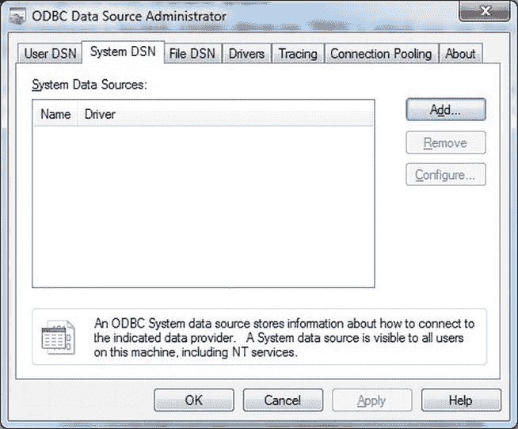
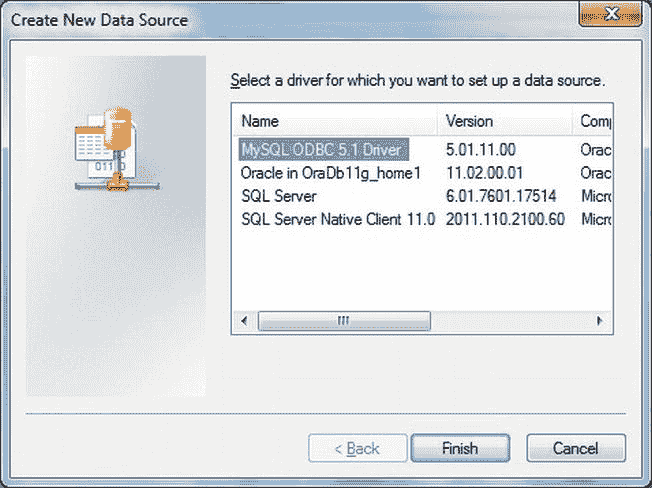
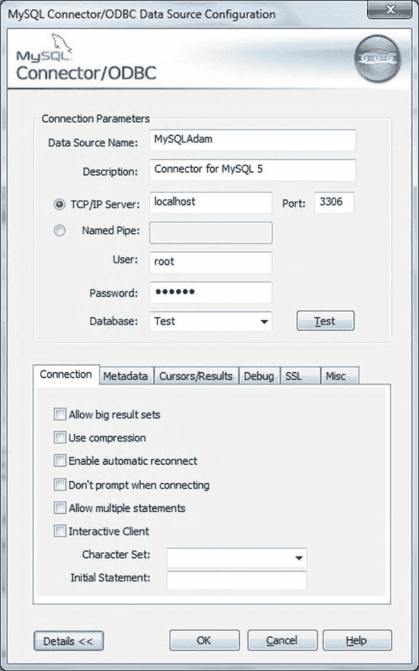
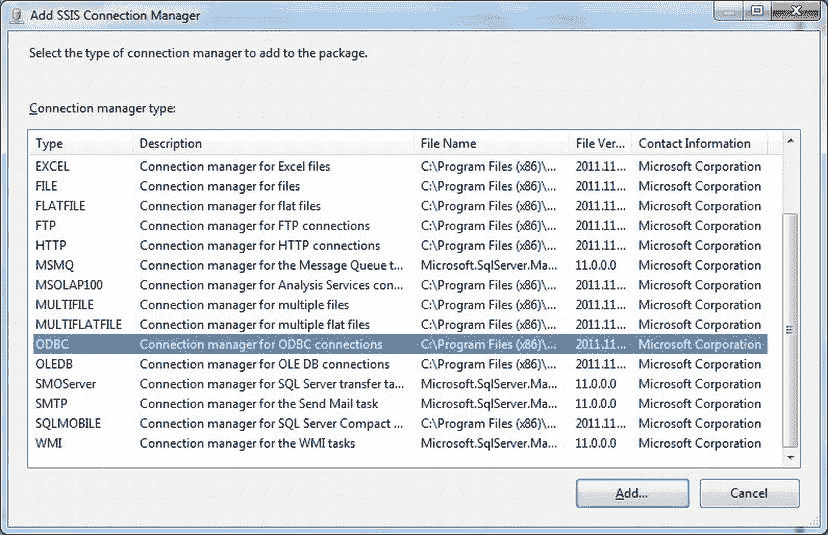
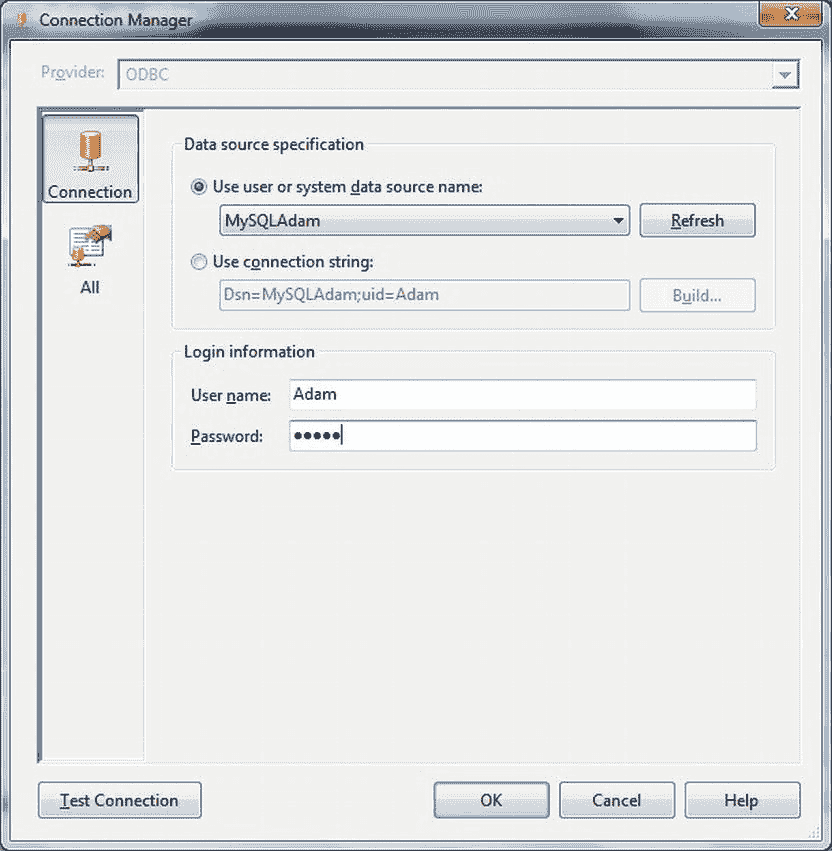

# 定期从 MySQL 获取数据

## 问题

您的网络上有一个 MySQL 数据库，并且您希望定期执行从该数据库到目标的数据加载任务。

## 解决方案

使用 SSIS，并通过 MySQL ODBC 驱动程序连接到源数据库。以下描述了具体操作步骤。

1.  启动 ODBC 数据源管理器（`odbcad32.exe` 或 控制面板  系统和安全  管理工具  ODBC 数据源）。点击“系统 DSN”选项卡。您应该会看到如图 4-16 所示的对话框。

    
    图 4-16.  ODBC 数据源管理器

2.  点击“添加”。选择`MySQL ODBC 3.51`驱动程序（参见图 4-17）。

    
    图 4-17.  使用 ODBC 数据源管理器添加新的系统 DSN

3.  点击“完成”。ODBC 连接器对话框将会出现。输入以下信息：
    *   一个您选择的数据源名称。我使用的是 `MySQLAdam`。
    *   描述（如果您想添加的话）
    *   服务器名称（或 `localhost`）
    *   您将用来连接的用户。我使用的是 *root* 用户。
    *   相应的密码
    *   要连接的数据库

    您应该看到类似图 4-18 的内容。

    
    图 4-18.  配置 MySQL ODBC DSN

4.  点击“测试”以测试连接。假设您收到连接已建立的确认信息，点击两次“确定”以完成 DSN 的创建。
5.  在一个新的或现有的 SSIS 包中，在“连接管理器”选项卡中右键单击，然后选择“新建连接...”（或在“解决方案资源管理器”中右键单击“连接管理器”，然后选择“新建连接管理器”）。
6.  从提供程序列表中选择 ODBC 类型，如图 4-19 所示。

    
    图 4-19.  在 SSIS 中添加 ODBC 连接管理器

7.  点击“添加”。选择您刚刚创建的系统（或用户）DSN（本例中为`MySQLAdam`）。对话框应如图 4-20 所示。

    
    图 4-20.  在 SSIS 中使用 ODBC 连接管理器

8.  点击“确定”以完成 MySQL 连接管理器的创建。重命名该连接管理器。
9.  添加一个“数据流任务”。双击进行编辑。
10. 添加一个“ODBC 源”。双击进行编辑。
11. 将 ODBC 连接管理器设置为您在步骤 8 中创建的名称。
12. 将数据访问模式设置为“SQL 命令”。输入用于确定源数据的 SQL。在此示例中，我建议使用 `` `SELECT * FROM INFORMATION_SCHEMA.TABLES` ``。
13. 点击“确定”确认。继续您的包创建，如配方 4-2 和 1-7 等所述。

## 工作原理

在撰写本文时，MySQL 官方并不支持 OLEDB 提供程序。因此，唯一的解决方案是使用 ODBC 导入数据。显然这并不理想，但有时您别无选择。这种方法的缺点是：
*   使用 MySQL 提供程序的 ODBC 可能非常慢。
*   配置用于 ODBC 驱动程序的 Microsoft OLEDB 提供程序可能很麻烦。

必须安装来自 MySQL 网站的最新版本`MyODBC`驱动程序。目前，它是 5.1.1，有 32 位和 64 位版本。在您喜欢的搜索引擎中输入**MySQL ODBC**。您应该能在 MySQL 网站上找到相关页面进行下载。

SSIS 2012 中的一个新功能是 ODBC 连接管理器（感谢 Microsoft 与 Attunity 的合作），这无疑使使用 ODBC 变得稍微简单了一些。一旦配置好 ODBC DSN，您就可以在 ODBC 连接管理器中将其用作系统 DSN。DSN 的各个元素在表 4-1 中说明。

表 4-1. MySQL ODBC DSN

| 参数 | 描述 |
| --- | --- |
| 数据源名称 | 您可以选择任何喜欢的名称，但显然越简单、越容易记住越好。 |
| 描述 | 这不是必需的，但在几个月后您完全忘记它的作用时返回查看 DSN，它会很有用。 |
| 服务器名称 | 这必须是 MySQL 服务器的确切名称。 |
| 您用来连接的用户 | 此用户必须具有源数据的所有必要权限。 |
| 相应的密码 | |
| 要连接的数据库 | |

## 提示、技巧和陷阱

*   DSN 仅限于所选的数据库，因此您需要为连接到多个数据库的 ODBC 连接设置多个 DSN。
*   要保存系统 DSN，您需要以本地系统管理员身份运行 ODBC 数据源管理工具（右键单击`odbcad32.exe`并选择“以管理员身份运行”）。
*   当前版本的 MySQL ODBC 驱动程序不会列出可用的表，因此您必须知道要查找的表。如果您没有此信息，可以使用第 8 章中给出的技术来发现它。然而，获取源元数据可能是一个漫长的过程。因此，再次强调，获取任何关于源的文档可以节省大量宝贵时间——您自己的时间！
*   如果 DSN 包含登录名和密码，则无需在 SSIS 中重复输入它们。
*   如果在“连接管理器”对话框的列表中看不到 DSN，请选择“使用连接字符串”，并输入类似以下内容：
    ```
    DRIVER = {MySQL ODBC 5.1 Driver};SERVER = localhost;DATABASE = AdamTest;UID = root
    ```
*   如果您在 64 位环境中工作，但只安装了 32 位驱动程序，则需要在运行包之前将`Run64BitRuntime`设置设置为 False。
*   再次考虑在包级别定义连接管理器。

