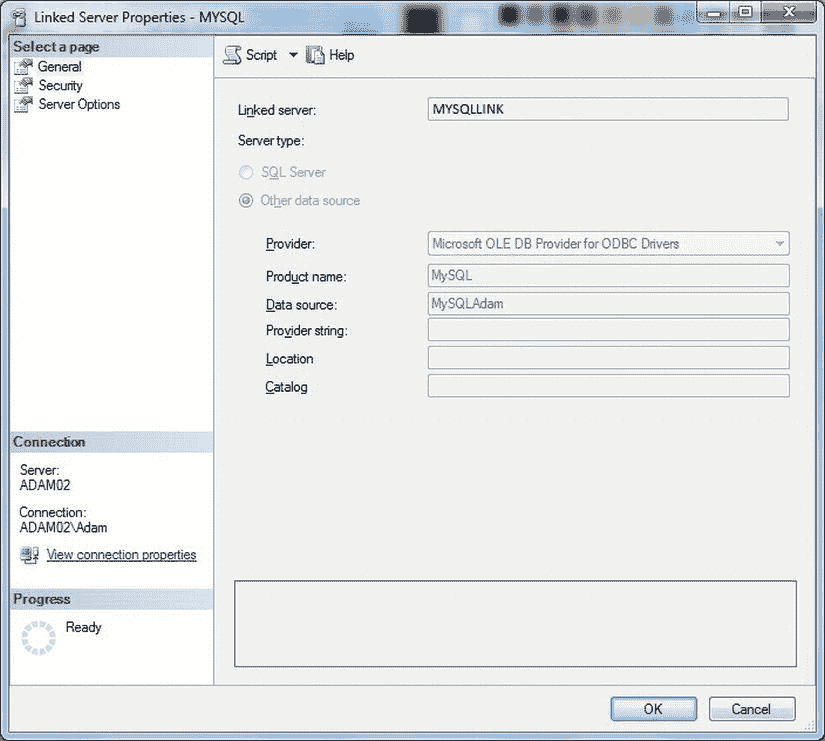
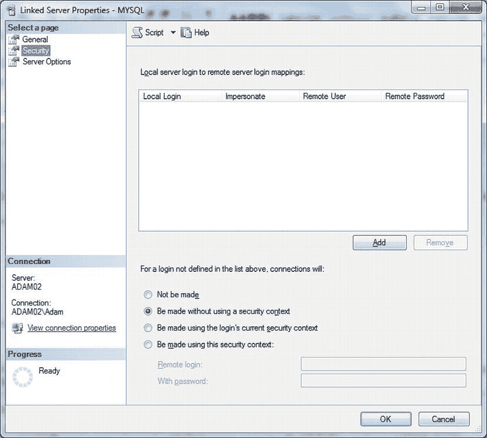

# 4-9. “按需”导入 MySQL 数据

## 问题

您希望从 MySQL 导入数据，但不想麻烦地使用 SSIS。

## 解决方案

配置一个链接服务器来连接到 MySQL 数据库。我将解释如何操作。

1.  在 SSMS 中，展开“服务器对象”。然后右键单击“链接服务器”并选择“新建链接服务器”。
2.  输入一个您选择的链接服务器名称。我在这里使用的是 `MySQLLink`。
3.  点击“其他数据源”单选按钮。选择“Microsoft OLE DB Provider for ODBC Drivers”作为提供程序。
4.  输入一个您选择的产品名称。
5.  将您在配方 4-8 中创建的系统 DSN（`MySQLAdam`）作为数据源输入。

    您应该看到如图 4-21 所示的内容。

    
    图 4-21.  配置 MySQL 链接服务器

6.  点击左侧列表中的“安全性”。选择“不使用安全上下文的连接”单选按钮。DSN 中定义的登录名提供了用户 ID 和密码（参见图 4-22）。

    
    图 4-22.  MySQL 的链接服务器属性

7.  点击“确定”。

您现在可以使用标准的四部分`SELECT`语句从链接服务器中选择数据，如下所示：
```
SELECT * FROM MYSQLLINK...INFORMATION_SCHEMA.TABLES.
```


