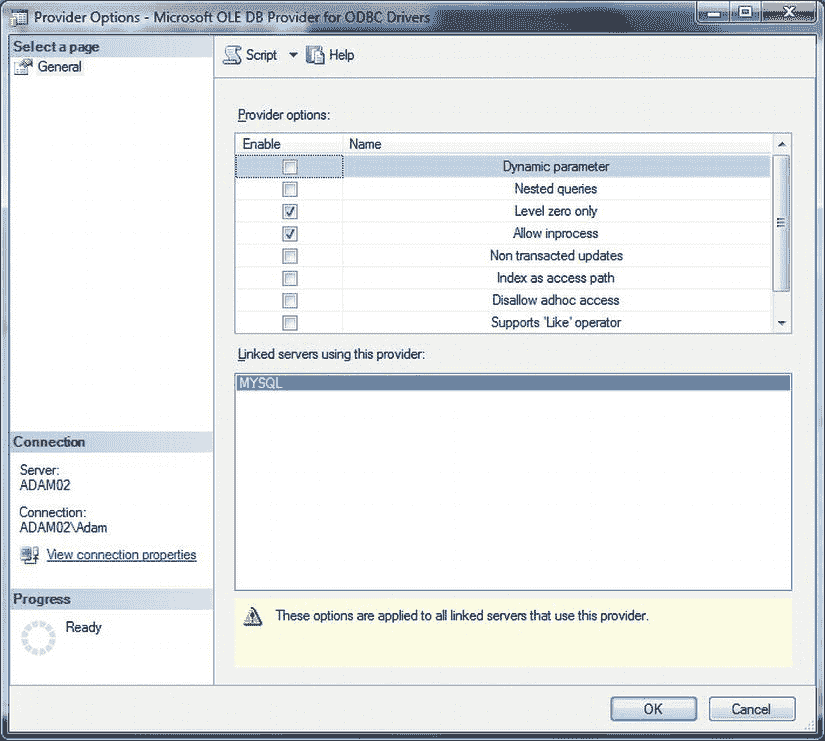
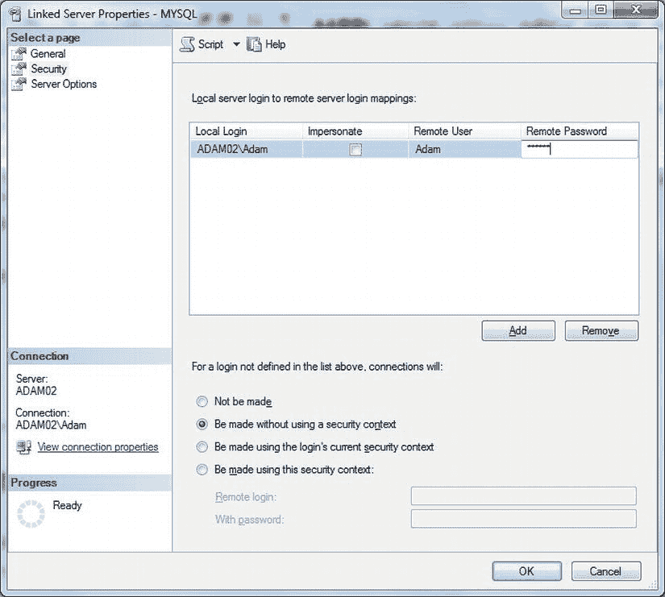
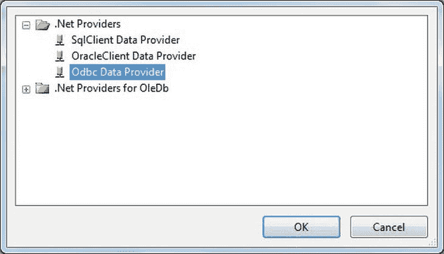
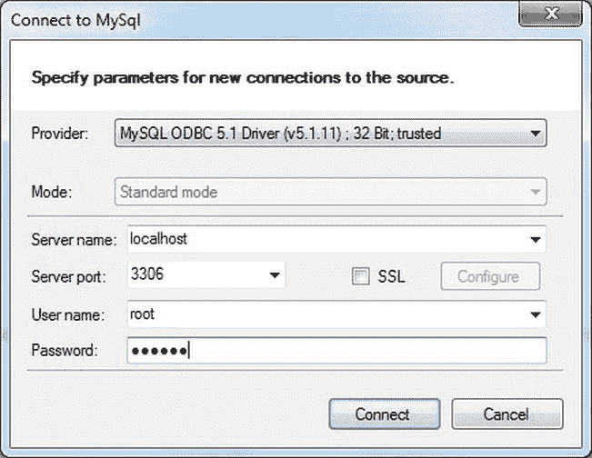
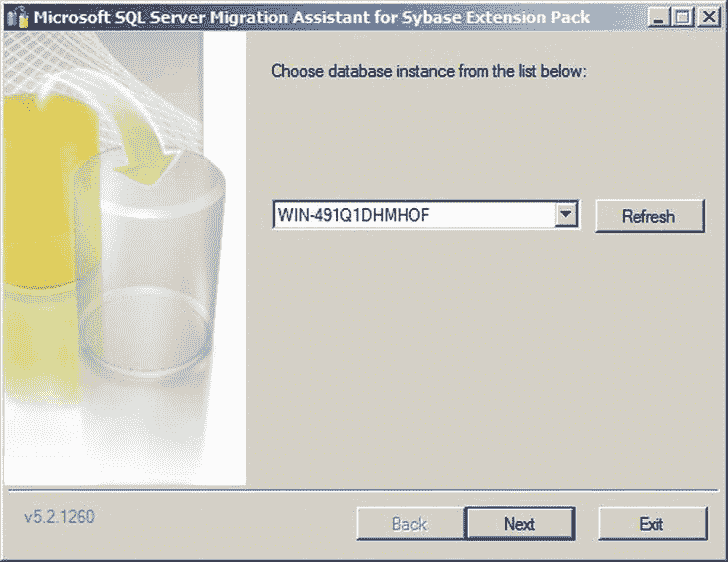
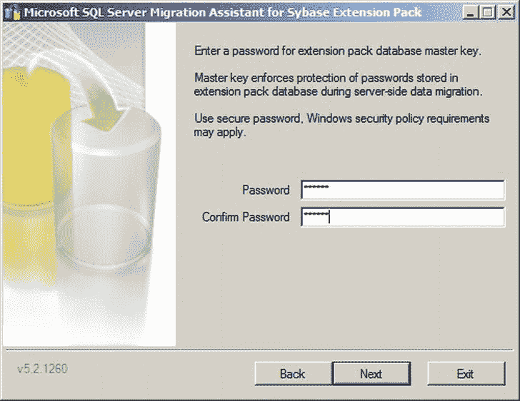

# 4. 整合 MySQL 与其他数据源

## 工作原理

通过使用 ODBC，你可以创建一个指向 MySQL 数据库的链接服务器。在我看来，虽然先定义一个 DSN 并将其作为数据源更简单，但如果你愿意，也可以通过提供完整的提供程序字符串来创建一个“无 DSN”的链接服务器。

如果你在使用某些数据类型时遇到困难，可能需要调整 `MSDASQL`（用于 ODBC 驱动程序的 Microsoft OLEDB 提供程序）的属性。具体操作如下：

1.  展开“服务器对象”  “链接服务器”  “提供程序”。然后，右键单击 `MSDASQL` 并选择“属性”。你将看到一个类似 图 4-23 所示的对话框。

    
    图 4-23. 为用于 ODBC 的 Microsoft OLEDB 提供程序配置提供程序选项

2.  勾选 `仅零级别` 和/或 `允许进程内`。点击“确定”。

 `注意` 请记住，你修改的是所有 ODBC over OLEDB 连接的 `MSDASQL` 属性——因此要小心，避免因修改提供程序属性而导致其他连接无法工作！

现在链接服务器已设置好，使用 `OPENQUERY` 发送直通查询就变得轻而易举了。使用如下简单的代码片段（`C:\SQL2012DIRecipes\CH02\MySQLOpenQuery.sql`）：

```sql
SELECT * FROM OPENQUERY(MYSQLLINK, 'SELECT * FROM INFORMATION_SCHEMA.TABLES');
```

你也可以在即席 (`OPENROWSET`) 查询中使用此 DSN——前提是即席查询已如配方 1-4 所述启用。这是一个示例（`C:\SQL2012DIRecipes\CH02\MySQLOpenRowset.sql`）：

```sql
SELECT * FROM OPENROWSET(N'MSDASQL', 'DSN = MySQLAdam',
                         'SELECT * FROM INFORMATION_SCHEMA.TABLES') AS A
```

#### 提示、技巧与陷阱

*   好吧，我承认我在数据库安全性方面有些随意。为了获得更高的安全性，请在“安全性”选项卡上选择 `不进行` 单选按钮，然后单击 `添加`。在 SQL Server 登录名和 MySQL 用户之间建立登录映射。对话框应如 图 4-24 所示。

    
    图 4-24. 为 MySQL 链接服务器配置安全上下文

 `注意` 再次强调，使用 `SELECT *` 不适合生产环境。然而，在初步了解源数据时，它可能非常有用。

## 4-10. 使用 SSIS 2005 和 2008 导入 MySQL 数据

### 问题

你仍在使用 SQL Server 2008（甚至是 2005），并且需要导入 MySQL 数据。

### 解决方案

使用基于 ADO.NET 的 ODBC，而不是使用 Attunity ODBC 连接管理器（该管理器在 SQL Server 2012 中才成为标准配置）。以下说明如何配置它。

1.  在一个新的或现有的 SSIS 包中，右键单击“连接管理器”选项卡。选择 `新建 ADO.NET 连接`。
2.  单击 `新建`。从弹出的提供程序列表中选择 `ODBC Data Provider`，如 图 4-25 所示。

    
    图 4-25. 在 ADO.NET 连接中使用 ODBC 提供程序

3.  单击“确定”。选择你之前创建的系统（或用户）DSN（参见配方 4-8）。
4.  再次单击“确定”两次，完成 MySQL 连接管理器的创建。
5.  添加一个“数据流任务”。双击进行编辑。
6.  添加一个 ADO.NET 数据源。双击进行编辑。
7.  将 ADO.NET 连接管理器设置为你之前创建的名称。
8.  将数据访问模式设置为 `SQL 命令`。输入用于确定源数据的 SQL。
9.  单击“确定”确认。继续创建你的包。

### 工作原理

如果你使用的是 SQL Server 2005 或 2008，那么使用 DSN 的方法略有不同，因为你必须使用基于 ADO.NET 的 ODBC。你仍然需要配置一个 DSN，但幸运的是，这在任何版本的 SQL Server 中都是一样的，因为它依赖于 MySQL ODBC 驱动程序。

#### 提示、技巧与陷阱

*   与 SSIS 2012 相同的提示也适用于使用旧版本的 SSIS。这是因为它们都涉及 ODBC 驱动程序，而不是 SSIS 本身。

## 4-11. 从 MySQL 迁移完整表

### 问题

你希望在一次简单操作中从多个 MySQL 数据库迁移多个完整的表。

### 解决方案

使用针对 MySQL 的 SSMA 一次性从多个表和/或数据库迁移表。

1.  下载最新版本的 SQL Server Migration Assistant for Sybase。当前版本为 5.2，可从 `www.microsoft.com/en-us/download/details.aspx?id=28764` 获取。
2.  安装 SSMA 和 SSMA 扩展包。这在配方 4-5 和 4-13 中有描述。
3.  安装最新版本的 MySQL ODBC 驱动程序。
4.  运行 SSMS。下载并刷新（免费的）许可证密钥。

你现在可以像配方 4-5 和 4-13 中描述的那样执行数据迁移。为了不重复所有细节（也免去你在配方间跳转），这意味着你需要执行以下操作：

1.  创建一个新项目并保存。
2.  连接到 MySQL。向下钻取到你希望传输的数据库和表。
3.  连接到 SQL Server。
4.  转换源架构。
5.  将架构与目标数据库同步（如果所需表尚不存在，此操作将创建它们）。
6.  迁移数据。

### 工作原理

它与针对 Oracle 和 Sybase 的 SSMA 差异甚少，我实在无法在不无耻重复的情况下再描述一遍。因此，只要你安装了 MySQL ODBC 驱动程序来处理与 MySQL 的连接，你就可以使用 SSMA 轻松快速地将多个表迁移到 SQL Server。唯一的注意事项是，根据我的经验，通过 ODBC 进行迁移的吞吐量可能比文本导出和导入慢一些。

针对 Oracle/Sybase 和 MySQL 的 SSMA 之间为数不多的差异之一是 MySQL 连接对话框，其外观如 图 4-26 所示。


图 4-26. SSMA for MySQL 连接对话框

#### 提示、技巧与陷阱

*   你可以在 `www.microsoft.com/sqlserver/en/us/product-info/migration-tool.aspx#MySQL` 找到有关迁移整个数据库的有用资源。

## 4-12. 从 Sybase Adaptive Server Enterprise (ASE) 加载数据

### 问题

公司网络上有 Sybase 数据库，你需要从中提取数据加载到 SQL Server 中。

### 解决方案

使用 SSMA for Sybase 来传输数据。请遵循以下步骤：

1.  下载最新版本的 SQL Server Migration Assistant for Sybase。当前版本为 5.2，可从 `www.microsoft.com/en-us/download/details.aspx?id=28765` 获取。
2.  安装 SSMA 和 SSMA for Sybase 5.2 扩展包。后者会要求你提供一个要连接的服务器，如 图 4-27 所示。

    
    图 4-27. 安装 SSMA 扩展包

3.  系统还会要求你提供扩展包数据库主密钥的密码，如 图 4-28 所示。

    
    图 4-28. 为 SSMA 扩展包定义密码

4.  扩展包安装程序还会询问是否要安装测试器数据库。


