# 安装 SSMA 和扩展包

我建议你接受这个建议，如 图 4-29 所示，前提是你拥有所需的权限。

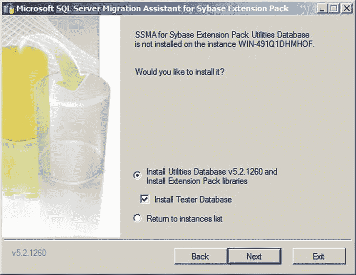
图 4-29. 安装 SSMA 扩展包测试器数据库

5.  一旦 SSMA 和扩展包成功安装，安装包会询问你是否要在另一个实例上安装这些产品。除非你有此需要，否则请点击“否”并退出。如果你检查所选 SQL Server 实例上的数据库，你会看到 `sysdb` 数据库。
6.  在 SSMS 中创建一个新的名为 `SybaseImport` 的 SQL Server 数据库。
7.  点击 开始  所有程序  Microsoft SQL Server Migration Assistant for Sybase  Microsoft SQL Server Migration Assistant for Sybase。SSMA 将会打开。
8.  点击 文件  新建项目。输入项目将存储的目录。对话框应如 图 4-30 所示。

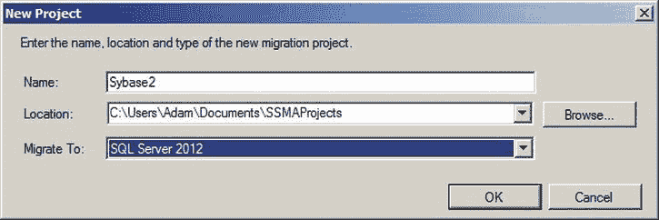
图 4-30. 创建一个新的 SSMA 项目

9.  点击“连接到 Sybase”按钮，并在对话框中输入所有必需的连接参数，该对话框应类似于 图 4-31。

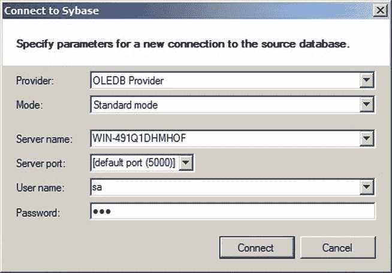
图 4-31. 从 SSMA 连接到 Sybase ASE

10. 展开现在出现在 Sybase 元数据资源管理器窗格中的数据库。向下钻取以选择你希望迁移其数据的数据库、架构和表。带着一丝怀旧之情，我正在使用 `pubs2` 数据库。面板应如 图 4-32 所示。

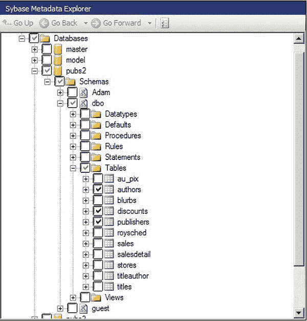
图 4-32. 在 SSMA for Sybase 中选择 Sybase ASE 源表

11. 点击“连接到 SQL Server”按钮并输入所有必需的连接参数。
12. 在 Sybase 元数据资源管理器窗格中点击“数据库”。然后点击“转换架构”按钮。注意任何警告信息。
13. 因为我们即将把数据传输到 SQL Server 中一个不同名称的数据库，所以在 Sybase 元数据资源管理器窗格中点击架构 (dbo) 源。
14. 在 Sybase 元数据详细信息窗格中，确保“架构”窗格处于活动状态。点击 dbo 架构。
15. 点击“修改”。“选择目标架构”对话框将出现。
16. 点击“省略号”按钮。选择目标数据库和架构。示例如 图 4-33 所示。

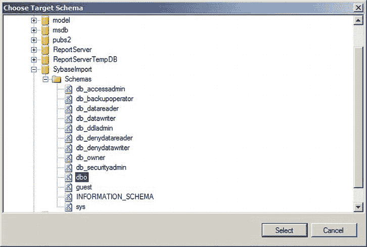
图 4-33. 在 SSMA 中选择 SQL Server 架构

17. 点击“选择”。“选择目标架构”对话框将重新出现，看起来类似于 图 4-34。

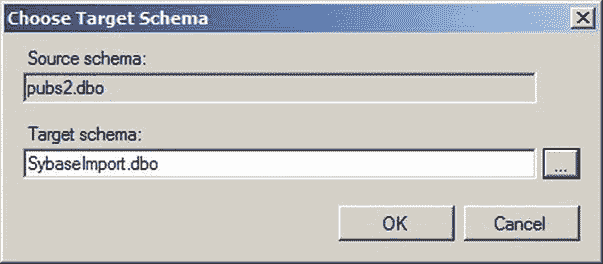
图 4-34. SSMA 中的“选择目标架构”对话框，已选择新的目标架构

18. 点击“确定”。Sybase 元数据详细信息窗格将如 图 4-35 所示。

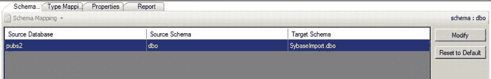
图 4-35. SSMA Sybase 架构元数据窗格

19. 在 SQL Server 元数据资源管理器窗格中右键点击目标数据库。选择“与数据库同步”。

将出现一个对话框，你可以在其中看到将在 SQL Server 中创建和/或修改的对象（参见 图 4-36）。

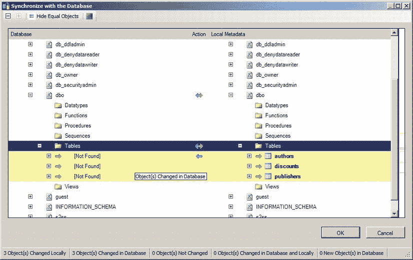
图 4-36. SSMA 数据库同步对话框

20. 点击“确定”。
21. 选择 工具  项目设置。然后点击左下角的“常规”，接着点击“迁移”。选择“服务器端迁移引擎”作为迁移引擎。对话框应如 图 4-37 所示。

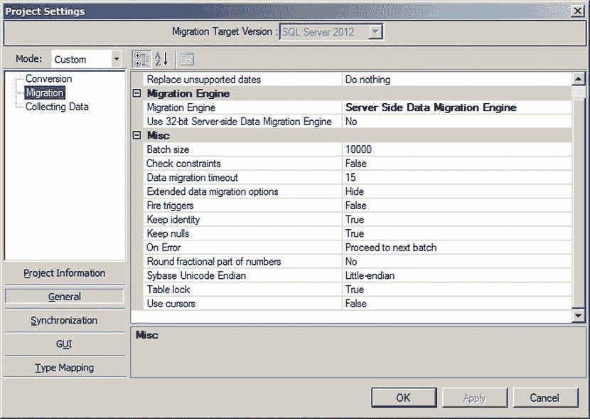
图 4-37. 在 SSMA 中选择服务器端迁移

22. 点击“确定”以确认你的更改。
23. 点击“迁移数据”。数据将被迁移。然后“数据迁移报告”对话框将出现（参见 图 4-38）。

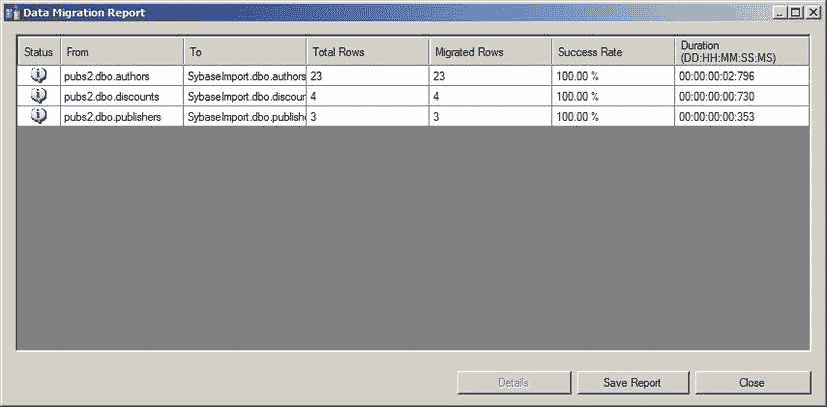
图 4-38. SSMA 中的数据迁移报告对话框

就是这样。你已经将所选表中的数据从 Sybase 迁移到了 SQL Server。

## 工作原理

由于此过程可能看起来相当复杂，以下是所执行操作的高级概述：

*   下载并安装 SSMA for Sybase 和扩展包。
*   安装 Sybase OLEDB、ODBC 和 ADO.NET 驱动程序。
*   创建一个 SSMS 项目并连接到 Sybase。
*   选择要迁移的源表和/或视图。
*   转换架构。
*   与目标数据库同步。这将创建任何所需的表（如果它们尚不存在）。
*   转换数据。

如果你曾使用过 SSMA for (例如) Oracle，那么你可能会感到一种似曾相识的感觉。尽管如此，我仍然更喜欢为那些从 Sybase 导入数据的读者提供一个完整的导入流程供他们遵循，而不假设他们已经为 Oracle 源做过此事。当然，在使用 SSMA 时，主题上还有许多许多的变化。由于许多可用的可能性已在配方 4-5（关于 Oracle）或配方 1-15（关于 Access）中描述，我将不再在这里赘述，而是请你参考这些配方以完成你对该产品的了解。

我们在本配方中看到了 SSMA 的一个重要新特性：服务器端迁移。这正是安装扩展包的原因。它通常使大量数据的传输更快，因为数据不经过 SSMA，而是直接从 Sybase 源服务器传输到 SQL Server 目标。这也要求 SQL Server 代理在 SQL Server 目标上运行。如果你愿意，可以坚持使用客户端处理，但你可能会发现它更慢。

SSMA 也可以直接将数据导入 Windows Azure SQL Database，而不仅仅是“经典” SQL Server 数据库。你只需在步骤 11 中定义 SQL Server 连接时，提供正确的 Azure 数据库名称（例如，`recipes.database.windows.net`）和用户名（例如，`meforprimeminister@recipebook`）。

用于连接到 ASE 的账户必须至少对 master 数据库以及要迁移到 SQL Server 或 Windows Azure SQL Database 的任何源数据库具有 `public` 访问权限。此外，要对正在迁移的表具有 `SELECT` 权限，用户必须在以下系统表上具有 `SELECT` 权限：

*   `[source_database].databaseo.sysobjects`
*   `[source_database].databaseo.syscolumns`
*   `[source_database].databaseo.sysusers`
*   `[source_database].databaseo.systypes`
*   `[source_database].databaseo.sysconstraints`
*   `[source_database].databaseo.syscomments`
*   `[source_database].databaseo.sysindexes`
*   `[source_database].databaseo.`

```sql
迁移用户需要系统表上的 SELECT 权限。
```

`sysreferences` * `master.databaseo.sysdatabases`

## 提示、技巧与注意事项

-   除了 ASE 之外，还有其他版本的 Sybase（比如 SQL Anywhere），但根据我的经验，ASE 是 SQL Server 人员可能需要从中提取数据的工业级数据源的主要来源，因此我只展示了此产品作为 Sybase 数据源。
-   如果需要，您可以运行`SSMA`的 32 位版本，可通过以下路径从“开始”  “所有程序”  “Microsoft SQL Server Migration Assistant for Sybase”  “Microsoft SQL Server Migration Assistant for Sybase (32 位)”启动。
-   `SSMA`首次运行时，会要求您下载（免费的）许可证密钥到适当目录。
-   当您保存`SSMA`项目时，系统会询问您希望为源数据库中的哪些架构保存元数据。请明智选择，否则当`SSMA`从源收集所有元数据时，您可能面临一个非常耗时的过程。
-   有关迁移整个数据库的有用资源列表，请查看`www.microsoft.com/sqlserver/en/us/product-info/migration-tool.aspx#Sybase`。

## 4-14. “即时”导入 Sybase ASE 数据

### 问题

您希望通过网络从 Sybase ASE 将数据导入 SQL Server，而无需开发基于 SSIS 的解决方案。

### 解决方案

使用 T-SQL 和`OPENROWSET`——或者设置链接服务器。

以下代码使用`OPENROWSET`将数据从 Sybase ASE 插入 SQL Server 表（位于`C:\SQL2012DIRecipes\CH02\SybaseOpenRowset.sql`）：

```
SELECT * INTO MySybaseASETable FROM OPENROWSET ('ASEOLEDB', 'WIN-491Q1DHMHOF:5000';'Adam';'Me4B0ss', 'select au_lname from dbo.authors');
```

### 工作原理

Sybase ASE OLEDB 提供程序运行良好，允许您使用 T-SQL 通过 OLEDB 将数据导入 SQL Server。至少，您需要满足以下条件：

-   到 Sybase ASE 服务器的可用网络连接。
-   SQL Server 上安装了`ASEOLEDB`提供程序。
-   具有访问您希望检索数据权限的 Sybase ASE 用户登录名和密码。
-   SQL Server 上启用了即席查询，如配方 1-4 所述。

`OPENROWSET`函数由三个元素组成：

-   OLEDB 提供程序 (`ASEOLEDB`)。
-   连接字符串 (`'WIN-491Q1DHMHOF:5000';'Adam';'Me4B0ss'`)。当然，您需要使用自己的连接参数。
-   查询 (`select au_lname from dbo.authors`)。这里我使用的是一个标准的 Sybase ASE 示例数据库。您可以使用任何您拥有相应权限的数据库。

主要需要注意的是，连接字符串包含（按此顺序）：

-   Sybase ASE 实例（示例中为`WIN-491Q1DHMHOF:5000`）。注意，这是服务器名称（或在安装时指定的 Sybase ASE 服务器名称）和端口（您可以大致理解为 SQL Server 实例），这是在安装 Sybase ASE 时配置的。
-   用户 ID (`Adam`)。当然，您将使用适当的用户。
-   密码 (`Me4B0ss`)。

请注意，所有这些元素都用分号分隔，连接字符串与 SQL 查询之间用逗号分隔。当然，如果您愿意，可以使用`INSERT INTO ... SELECT`，而不是像这里一样使用`SELECT...INTO`创建表。

使用`OPENROWSET`导入数据有几个合理的理由（不按特定顺序，也无意穷举）：

-   您可以利用`SELECT`子句的全部功能来选择要导入的列。
-   您可以使用`WHERE`子句过滤导入的数据。
-   您可以使用`ORDER BY`子句对导入的数据进行排序。

您也可以设置一个到 Sybase ASE 的链接服务器。我将解释最简单的方法。

1.  使用 Adaptive Server Enterprise ODBC 驱动程序创建一个 ODBC 系统 DSN，配置如图 4-39 所示。

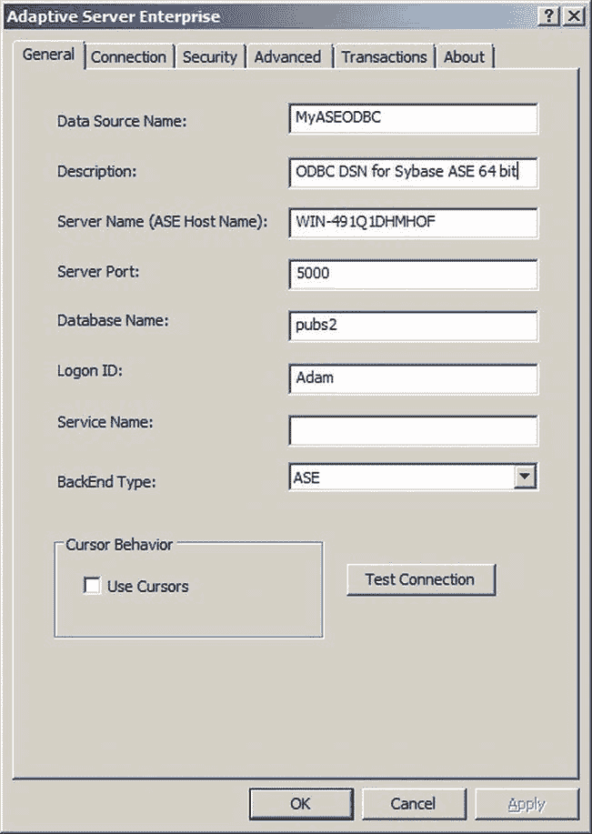 图 4-39. 为 Sybase ASE 配置 ODBC DSN

2.  运行以下 T-SQL，使用`MyASEODBC`系统 DSN 作为数据源创建链接服务器（以下三个代码片段均在`C:\SQL2012DIRecipes\CH02\SybaseLinkedServer.sql`中）：

```
EXECUTE master.dbo.sp_addlinkedserver
    @server = 'MySybaseASEDatabase',
    @srvproduct = 'Sybase ASE',
    @provider = 'MSDASQL',
    @datasrc = 'MyASEODBC' ;
```

3.  运行以下 T-SQL 片段以定义 ASE 访问的安全性：

```
EXECUTE master.dbo.sp_addlinkedsrvlogin
    @rmtsrvname = 'MySybaseASEDatabase',
    @useself = 'false',
    @locallogin = NULL,
    @rmtuser = 'Adam',  -- Sybase ASE 用户名
    @rmtpassword = 'Me4B0ss' ; -- Sybase ASE 用户密码
```

然后，您可以使用四部分名称表示法从 Sybase ASE 服务器导入数据，如下所示：

```
SELECT * INTO SybaseTable FROM MySybaseASEDatabase.pubs2.dbo.authors;
```

### 提示、技巧与注意事项

-   Sybase ASE 非常可能（虽然不是必然）区分大小写。因此，如果`OPENROWSET`查询出现错误消息，您可以首先验证所有引用的对象是否使用了正确的大小写。
-   在定义 Sybase ASE ODBC 系统 DSN 时，如果您处于 64 位环境，请务必使用 64 位 ODBC 管理器。否则，您将创建一个可以看到并测试、但无法用于链接服务器连接的 DSN。
-   是的，您说得对，使用`SELECT *`是非常不好的做法。我在这里的借口是，当面对第三方数据库时，如果您无法获取元数据，可能希望使用它来返回所有列。

## 4-15. 定期导入 Sybase ASE 数据

### 问题

您希望定期通过网络从 Sybase ASE 将数据导入 SQL Server。

### 解决方案

使用`SSIS`和 Sybase ASE OLEDB 提供程序。具体步骤如下。

1.  在`SSIS`包中，右键单击“连接管理器”窗格。选择“新建 OLEDB 连接”。
2.  单击“新建”。
3.  从已安装提供程序的弹出列表中选择 Sybase OLEDB Provider。
4.  输入服务器名称，后跟冒号和端口号。
5.  输入用户名和密码。
6.  选择要连接到的数据库（初始目录）。
7.  单击“确定”。
8.  使用适当的目标扩展并完成`SSIS`包。

然后，您可以将数据从 Sybase ASE 导入 SQL Server。

### 工作原理

再次强调，这里的技巧在于确保 Sybase OLEDB 提供程序已安装并正常运行。提供程序准备就绪后，连接到 Sybase ASE 并选择要导入的数据就很容易了。几乎唯一需要知道的是，您必须将冒号 (`:`) 和 Sybase ASE 端口号添加到服务器名称，连接管理器才能正常工作。

### 提示、技巧与注意事项

-   您也可以使用 Sybase ODBC 提供程序（假设它已安装在 SQL Server 上）。您需要先创建一个 DSN，然后在数据流任务中与 ODBC 源一起使用。

## 4-16. 加载 Teradata 数据

### 问题

您有存储在 Teradata 数据库中的数据，需要将其加载到 SQL Server Enterprise 版。

### 解决方案

下载并安装 Attunity `SSIS` Connector for Teradata。然后使用`SSIS`数据流任务加载数据。

1.  下载与您环境（32 位或 64 位）对应的 Attunity `SSIS` Connector for Teradata。目前可从`www.microsoft.com/en-gb/download/details.aspx?id=29284`下载。
2.  双击`.msi`文件并安装连接器。您可以修改一些安装参数，但接受默认设置几乎总是更简单。
3.


在 SSIS 包中，右键单击“连接管理器”选项卡内部。在“添加 SSIS 连接管理器”对话框中选择 `MSTERA`。该对话框应如图 4-40 所示。

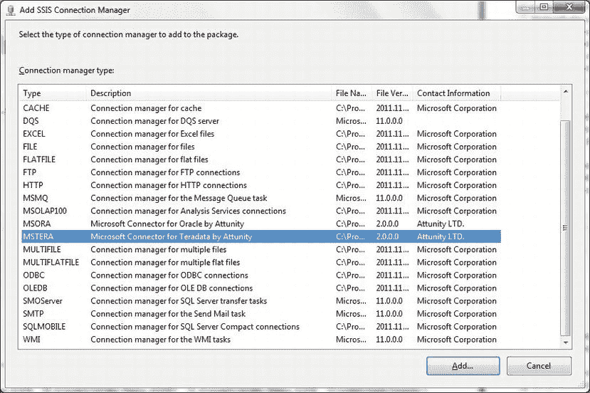

图 4-40. 为 Teradata 添加 Attunity SSIS 连接管理器

单击“确定”。添加所有必需的连接参数。该对话框应如图 4-41 所示——当然，使用的是您特定的连接参数。

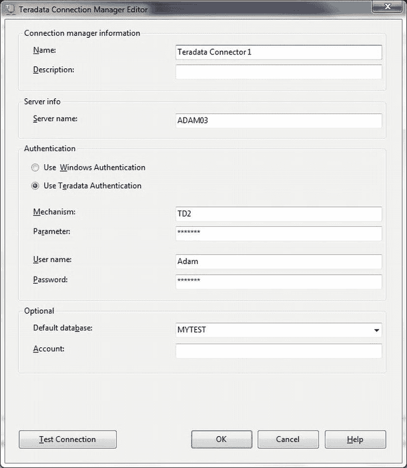

图 4-41. 配置用于 Teradata 的 Attunity SSIS 连接管理器

向 SSIS 包中添加一个“数据流任务”。双击进行编辑。

在 SSIS 工具箱中双击 `源助手`。

在左窗格中，选择 `Teradata` 作为源类型。在右窗格中，选择您刚创建的 Teradata 连接管理器。该对话框应如图 4-42 所示。

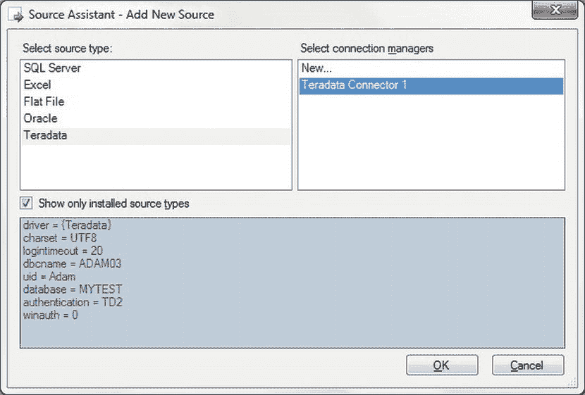

图 4-42. 使用适用于 SSIS 的 Attunity Teradata 提供程序添加 Teradata 源

单击“确定”。一个 Attunity Teradata 源组件将被添加到“数据流”窗格中。双击进行编辑。

确保选中了所需的连接管理器。然后选择所需的数据访问模式（`表` 或 `SQL` 命令）。

选择表或视图——或者输入 SQL `SELECT` 语句，然后单击“确定”。

添加一个目标组件，将源连接到它，并映射列。由于 SSIS 的这方面内容在其他配方（例如配方 1-7）中已有涉及，我将不解释所有细节。“数据流”窗格应类似于图 4-43。

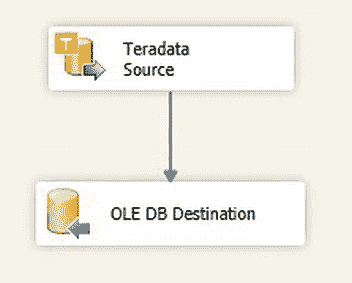

图 4-43. 完整的 Teradata 数据流

您现在可以运行您的 Teradata 数据导入了。

## 工作原理

虽然可以使用 Teradata ODBC 驱动程序连接到 Teradata 并将数据加载到 SQL Server，但我认为使用 Attunity 开发的 Teradata Connector 要容易得多，该连接器可与 SQL Server 企业版一起使用。一旦下载并安装，它就能让连接 Teradata 变得极其简单。然而，在正确配置连接方面，您可能需要 Teradata DBA 的帮助，因为讨论可用的连接机制和其他 Teradata 细微差别超出了本书的范围。

## 4-17. 从 PostgreSQL 源获取数据

### 问题

您希望将当前位于 PostgreSQL 数据库中的数据加载到 SQL Server。

### 解决方案

安装并配置 PostgreSQL ODBC 驱动程序。将其与基于 SSIS 或 T-SQL 的解决方案一起使用。

从 PgFoundry.org 网站安装 PostgreSQL ODBC 驱动程序。

启动 ODBC 数据源管理器（位于 `%SystemRoot%\system32\` 中的 `odbcad32.exe`，或通过 控制面板 -> 管理工具 -> 数据源 (ODBC)）。单击“系统 DSN”选项卡。您应该看到如图 4-44 所示的对话框。

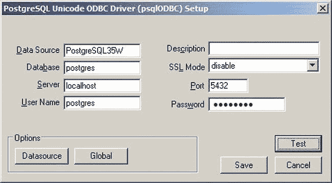

图 4-44. 配置 PostgreSQL ODBC 驱动程序

单击“添加”。选择 PostgreSQL ODBC 驱动程序。

单击“完成”。ODBC 连接器对话框将会出现。配置 PostgreSQL ODBC 驱动程序，使其包含图 4-44 中所示的元素。当然，您将使用您自己的特定参数。

保存您的更改。

### 工作原理

可以从 PostgreSQL 网站 (`www.postgresql.org`) 下载一个出色且功能齐全的 ODBC 驱动程序，一旦配置好，您就可以毫无困难地使用 SSIS、链接服务器、`OPENROWSET` 和 `OPENQUERY`。与 DB2 和 MySQL 的情况一样，不需要客户端软件，这无疑简化了问题。

因此，为了避免无益的重复，并假设您已下载了此驱动程序的最新版本，您只需按照为 MySQL 描述的方式创建一个 DSN——仅配置方式如图 4-44 所示（DSN 设置的步骤 4）。

配置元素在很大程度上是不言自明的，但 表 4-2 仍给出了简明描述。

表 4-2. PostgreSQL ODBC 配置

| 配置元素 | 描述 |
| --- | --- |
| `DataSource` | 您选择用来标识 ODBC DSN 的名称。 |
| `Database` | 您要连接到的数据库。 |
| `Server` | 承载数据库的服务器。 |
| `Username` | 对数据源具有所需访问权限的用户。 |
| `Description` | DSN 的可选描述。 |
| `SSL mode` | 使用的 SSL 模式。禁用 SSL 完全可以正常工作。 |
| `Port` | PostgreSQL 端口（此处使用默认值）。 |
| `Password` | 用户密码。 |

一旦配置好 DSN，您就可以使用 SSIS、链接服务器、`OPENROWSET` 或 `OPENQUERY` 从 PostgreSQL 导入数据。这可以按照为 MySQL 描述的方式完全相同地完成——当然，只需使用您分配给 PostgreSQL 驱动程序的 DSN 名称；因此我不会在此重复所有内容，而是请您参考配方 4-9 的详细信息。

## 本章小结

本章演示了从 SQL 数据库导入源数据的多种方法。这个主题很广泛——正如我最初所写——鉴于该主题的巨大范围，不可能涵盖所有内容。然而，在本章中，您了解了如何从当前可用的许多主要关系数据库下载数据。具体来说，您看到了涉及以下数据库的示例：

*   Oracle
*   DB2
*   MySQL
*   Sybase
*   Teradata
*   PostgreSQL

表 4-3 给出了我对本章概述的各种方法的看法，列出了它们的优点和缺点。

表 4-3. 本章使用方法的比较

| 技术 | 优点 | 缺点 |
| --- | --- | --- |
| OLEDB 提供程序 | 通常更快。 | 安装和配置更复杂。 |
| ODBC 提供程序 | 更易于安装和配置。 | 通常较慢。 |
| SSIS | 数据加载速度快。 | 设置包所需时间较长。 |
| 链接服务器 | 易于用于查询外部数据库。 | 配置可能复杂。 |
| | | 需要更高的权限。 |
| SQL Server 迁移助手 | 可快速获取源元数据。 | 只能打开整个表和数据集。 |
| | 可随时间构建数据加载项目。 | |

我必须公正地提醒您，跨数据库数据迁移可能真的是一个雷区。太过常见的情况是，源数据库的一个“微小”细节就会让您停滞数小时，直到问题解决。甚至更常见的是，源数据库 DBA 可能不愿意分享他们的知识。尽管如此，如果您有耐心，最重要的是不要急于求成，那么就没有什么能阻止您从我们已研究过的数据库迁移源数据，和/或连接到它们以定义和创建一个真正异构的数据提取和加载过程。我只是想说，在这个特定的 ETL 战场上，一点冷静和一些魅力可能是您最大的盟友。

您会注意到我在本章中没有讨论 SQL Server 导入向导。


