# 5-2. 通过永久连接从另一个 SQL Server 实例读取数据
## 问题
你想通过永久连接，使用简单的 T-SQL 从另一个 SQL Server 实例读取数据。

## 解决方案
配置一个链接服务器连接到源数据，并在你的 T-SQL 中使用四部分表示法。

具体操作如下：
1.  运行以下 T-SQL (`C:\SQL2012DIRecipes\CH05\AddLinkedServer.Sql`):
    ```sql
    EXECUTE master.dbo sp_addlinkedserver
        @server = N'SQLLinkedServer',
        @srvproduct = N' ',
        @provider = N'SQLNCLI',
        @datasrc = N'ADAM02\AdamRemote',
        @catalog = N'CarSales';
    ```

2.  然后可以轻松地使用四部分表示法查询链接服务器，如下例所示：
    ```sql
    SELECT
        ClientName, Town
    INTO       dbo.CarSales
    FROM       SQLLinkedServer.CarSales.dbo.Client;
    ```

## 工作原理
对于从另一个 SQL Server 实例读取数据的更持久方式，可能更倾向于考虑设置链接服务器。链接服务器的优势在第 1 章至第 4 章中已有描述，因此我推荐你参考那里了解此选择背后的原因。

`sp_addlinkedserver` 存储过程需要你提供：
*   链接服务器名称
*   SQL Server 提供程序 (`SQLNCLI`)
*   源服务器
*   源数据库

添加链接服务器需要 `ALTER ANY LINKED SERVER` 权限。授权者（或使用 `AS` 选项指定的主体）必须自身拥有该权限（附带 `GRANT OPTION`）或更高权限。然后，他们可以运行以下代码片段：
```sql
GRANT ALTER ANY LINKED SERVER TO Adam;
```

如果你愿意，也可以使用 Management Studio 指定链接服务器，步骤如下。
1.  在“对象资源管理器”窗格中，展开“服务器对象”，然后右键单击“链接服务器”并选择“新建链接服务器”。在“新建链接服务器”对话框中，输入 SQL Server（或实例名称）的名称，并选择“SQL Server”单选按钮，如图 5-1 所示。
    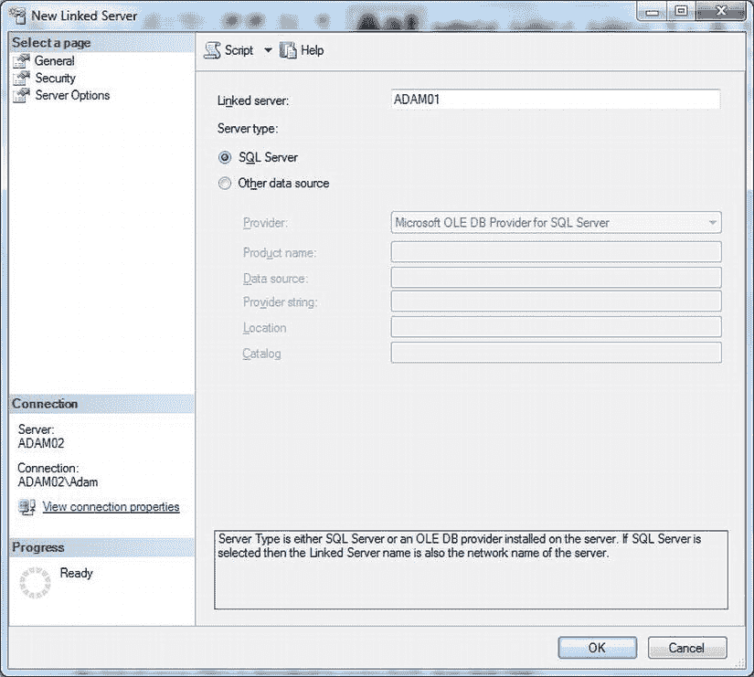
    图 5-1. 在 SSMS 中添加链接服务器
2.  单击左侧窗格中的“安全性”。指定使用链接服务器的任何连接的安全上下文（这在配方 4-9 中有描述）。然后单击“确定”。

安全性是使用链接服务器时的一个主要考虑因素。不幸的是，这是一个涉及无数分支的广阔主题。因此，我只能提供一些简单的指导方针；对这个领域的完整分析超出了本书的范围。

当连接到链接服务器时，远程登录操作必然有一个安全上下文。默认情况下（并且假设安全账户委派可用），远程服务器使用来自调用服务器的当前登录的安全凭据。鉴于这种潜在的简便性，如果可以，Windows 身份验证是首选方式。

你使用的账户必须在远程服务器上对你正在读取的表具有 `SELECT` 权限。

如果不使用 Windows 身份验证，或者未配置委派，则需要添加一个链接服务器登录。你可以使用如下代码：
```sql
EXECUTE master.dbo.sp_addlinkedsrvlogin
    @rmtsrvname = N'SQLLinkedServer',
    @locallogin = NULL,
    @useself = N'False',
    @rmtuser = N'Adam',
    @rmtpassword = N'Me4B0ss';
```

如果没有安全账户委派，那么你必须使用远程机器上的 SQL Server 身份验证，在本地服务器上映射账户到远程登录。

查询链接服务器时，你可能选择使用其他方法通过链接服务器连接返回数据。例如，如果你愿意，也可以像下面这样使用 `EXEC...AT`。首先，你需要启用 `RPC OUT`：
```sql
EXECUTE sp_serveroption
    @server='SQLLinkedServer',
    @optname='rpc out',
    @optvalue='TRUE';
```

然后，你可以运行一个 `EXECUTE...AT` 命令，如下所示：
```sql
INSERT INTO dbo.Client (ClientName, Town )
EXEC ('SELECT ClientName, Town FROM CarSales.dbo.Client') AT SQLLinkedServer;
```

如果需要参数化查询，可以这样做：
```sql
DECLARE @ID INT = 2
INSERT INTO dbo.Client (ClientName, Town)
EXEC ('SELECT ClientName, Town FROM CarSales.dbo.Client WHERE ID=' + @ID) AT SQLLinkedServer;
```

除了发送 `SELECT` 查询，你还可以使用存储过程来加载数据。举个例子，首先使用以下代码在远程服务器上创建两个存储过程 (`C:\SQL2012DIRecipes\CH05\ pr_GetETLData.Sql` 和 `C:\SQL2012DIRecipes\CH05\pr_GetETLDataWithParameter.Sql`)：
```sql
CREATE PROCEDURE CarSales.dbo.pr_GetETLData
AS
SELECT ClientName, Town
FROM       dbo.Client ;
GO

CREATE PROCEDURE CarSales.dbo.pr_GetETLDataWithParameter (
    @ID INT )
AS
SELECT ClientName, Town
FROM       dbo.Client
WHERE       ID = @ID ;
GO
```

现在，你可以使用以下代码片段调用链接服务器上的存储过程：
```sql
INSERT INTO dbo.Client (ClientName, Town)
EXECUTE ('EXECUTE CarSales.dbo.pr_GetETLData') AT SQLLinkedServer
```

最后，你的远程存储过程可以有参数。我发现调用它的最简单方式如下：
```sql
INSERT INTO dbo.Client (ClientName, Town)
EXECUTE SQLLinkedServer.CarSales.dbo.pr_GetETLDataWithParameter 1
```

这里的 `1` 是 `pr_GetETLDataWithParameter` 存储过程期望的 `ID` 参数。

有一些链接服务器选项你可能觉得有用，可以使用 `EXECUTE sp_serveroption` 设置。这些链接服务器选项列在表 5-1 中。

表 5-1. 链接服务器选项

| 选项 | 描述 |
| --- | --- |
| RPC | 启用**来自**给定服务器的 RPC。可以在该服务器上执行存储过程。 |
| RPC Out | 启用**发送到**给定服务器的 RPC。可以执行远程服务器上的存储过程。 |
| Collation Compatible | 影响针对链接服务器的分布式查询执行。如果此选项设置为 true，SQL Server 会假定链接服务器中的所有字符在字符集和排序序列（或排序顺序）方面都与本地服务器兼容。这使得 SQL Server 可以将字符列上的比较发送给提供程序。如果未设置此选项，SQL Server 总是在本地评估字符列上的比较。本质上，这允许在远程服务器上使用最优的查询计划。 |
| Connect Timeout | 连接到链接服务器的超时值（秒）。 |
| Query Timeout | 针对链接服务器的查询的超时值。 |
| Enable Promotion of Distributed Transactions | 使用此选项通过 Microsoft 分布式事务处理协调器 (MS DTC) 事务来保护服务器到服务器过程的操作。 |

## 5-3. 使用 T-SQL 加载大型数据集

### 问题
您想使用 T-SQL 将大型数据集从一个 SQL Server 实例加载到另一个实例。您希望尽可能高效地执行加载。

### 解决方案
使用 BCP 以本机格式导出源数据，并使用 T-SQL `BULK INSERT` 命令加载该文件。

在 SQL Server 实例之间加载数据的简单快速方法如下：

1.  创建一个目标表。以下是我在此示例中使用的表（`C:\SQL2012DIRecipes\CH05\TblClient_BCP.Sql`）：
    ```sql
    USE CarSales_Staging
    GO
    CREATE TABLE dbo.Client_BCP
    (
    ID int NOT NULL,
    ClientName nvarchar(150) NULL,
    Town varchar(50) NULL,
    County varchar(50) NULL,
    ClientSize varchar(10) NULL,
    ClientSince smalldatetime NULL
    ) ;
    GO
    ```
2.  运行以下 T-SQL 代码段以导入本机 BCP 文件（在随附示例中为 `C:\SQL2012DIRecipes\CH05\Clients.bcp`）：
    ```sql
    BULK INSERT CarSales_Staging.dbo.Client_BCP
    FROM 'C:\SQL2012DIRecipes\CH05\Clients.bcp'
    WITH
          (
           DATAFILETYPE = 'widenative'
          ) ;
    ```

### 工作原理
当无法直接连接到另一个 SQL Server 实例时，您可能不得不采用“间接”方式。本质上，您需要将数据导出为一个文件，将该文件复制到目标服务器，然后将其重新导入到另一个实例中。当然，您可以将数据导出为平面文件或 XML；这些主题在第 7 章中有所涉及。同样，以这些格式导入数据是第 2 章和第 3 章的主题。但是，如果您是在 SQL Server 数据库、实例甚至版本之间传输数据，那么经典而强大的 BCP 工具（以及随之而来的 BCP 本机文件格式）就真正发挥其优势了。因此，我希望在这里重点介绍加载 BCP 文件的方法。选择这种方法的理由相当简单：
*   `可靠性` — BCP 自 SQL Server 诞生之初就存在，异常稳健，其衍生工具 `BULK INSERT` 也是如此。
*   `速度` — 根据我的经验，没有什么能比本机 BCP 文件加载得更快。

这并不意味着这是一个完美的解决方案。以下是一些细微的缺点。
*   您始终需要了解 BCP 文件的细节，并且需要单独了解包含其数据的表的 DDL 定义。
*   您不能直接打开本机 BCP 文件并对其结构进行逆向工程。
*   如果您并非将源文件中的 `所有` 列加载到目标表中，或者如果源文件列的顺序与目标表列的顺序 `不` 同，您需要一个格式文件来执行列映射。
*   此方法专为批量加载而设计——不适用于途中选择和/或转换数据。

在此过程的导入阶段使用 `BULK INSERT` 有几个优点。
*   由于它只不过是 T-SQL，因此可以从查询窗口、存储过程甚至使用 `SQLCMD` 来运行。
*   `BULK INSERT` 在进程内运行；这使其成为最快的选择。
*   与通过 T-SQL 运行 BCP 时不同，您不需要 `xp_cmdshell` 及其必需的权限。
*   可以说，它比 BCP 命令行可执行文件及其所有标志更易于使用。
*   `BULK INSERT` 接受并行加载，如第 13 章所述。

使用 `BULK INSERT` 时需要确保的主要一点是，`DATAFILETYPE` 参数要与导出数据时使用的标志相匹配。本质上，`–n` 对应 native，`–N` 对应 widenative。

本方法第 2 步中的 `BULK INSERT` 代码段仅使用了众多可用选项中的一个。正如您可能推测的那样，还有许多其他选项。表 5-2 提供了一个简明的概述。

表 5-2. `BULK INSERT` 选项

| 参数 | 定义 | 说明 |
| --- | --- | --- |
| `DATAFILETYPE='native'` | 本机（数据库）数据类型 | 使用 SQL Server 数据类型，所有字符字段均为非 Unicode。 |
| `DATAFILETYPE='widenative'` | 本机（数据库）数据类型及字符数据的 Unicode 数据类型 | 使用 SQL Server 数据类型，所有字符字段均为 Unicode。 |
| `ERRORFILE='路径和文件'` | 错误文件 | 用于记录错误的错误文件的文件名和完整路径。 |
| `KEEPNULLS` | Null 值处理 | 任何空列将保留 `NULL`，而不是插入默认值（如果指定了默认值）。 |
| `KEEPIDENTITY` | 保留标识提示 | 在导入过程中保留 `IDENTITY` 数据。 |
| `CHECK_CONSTRAINTS` | 在加载过程中应用检查和外键约束 | 默认是不应用检查约束或外键约束。 |
| `FIRETRIGGERS` | 在加载过程中触发触发器 | 默认是在数据加载过程中不触发触发器。 |
| `FIRSTROW=n` | 要加载的第一行 | 默认为文件的第一行。 |
| `LASTROW=n` | 要加载的最后一行 | 默认为文件的最后一行。 |
| `ROWS_PER_BATCH=n` | 每批导入数据的行数 | 每批数据在单独的事务中导入和记录。整个批次必须成功导入后，才会提交任何记录。 |
| `KILOBYTES_PER_BATCH=n` | 批次大小提示 | 每批数据的大致千字节数。 |
| `MAXERRORS=n` | 加载失败前允许的最大错误数 | 默认值 = 10 |
| `ORDER` | 排序提示 | 告知 `BULK IMPORT` 源数据的排序顺序。如果使用此选项，源数据 **必须** 已排序。 |
| `TABLOCK` | 表锁提示 | 在加载过程中应用表级锁，以最小化锁升级所使用的资源 |

要了解如何使用多个加载选项，请看以下代码段，它在原始的 `BULK INSERT` 命令基础上扩展以指定多个选项（`C:\SQL2012DIRecipes\CH05\BulkInsertWithOptions.Sql`）：
```sql
BULK INSERT CarSales_Staging.dbo.Client_BCP
FROM 'C:\SQL2012DIRecipes\CH05\Clients.bcp'
WITH
          (
           DATAFILETYPE = 'widenative'
          ,KEEPIDENTITY
          ,TABLOCK
          ,KEEPNULLS
          ,ERRORFILE='C:\SQL2012DIRecipes\CH05\BulkInsertErrors.txt'
          ,MAXERRORS=50
         )
```

### 提示、技巧和陷阱
当此选项为 `True` 时，调用远程存储过程将启动分布式事务并将该事务与 MS DTC 关联。如果设置为 `False`，远程存储过程仍可工作。要使此功能正常工作，所有服务器上必须启用 MS DTC。遗憾的是，MTC 的讨论超出了本书范围。

*   使用 SQL Server 的网络名称（用于服务器上的默认实例）或使用 `servername\instancename`（用于特定实例）。
*   要删除链接服务器，请在链接服务器列表中右键单击链接服务器名称，单击“删除”并确认；或使用以下 T-SQL 代码段：
    ```sql
    EXECUTE master.dbo.sp_dropserver SQLLinkedServer, 'droplogins';
    ```
*   您也不能将基于 CLR 的数据类型与链接服务器一起使用。这意味着除非对这些类型使用 `CAST` 或 `CONVERT`——或者使用 `OPENQUERY`，否则不要使用 `GEOGRAPHY`、`GEOMETRY` 或 `HIERARCHYID` 数据类型。
*   冒着陈述显而易见之事的风险，您需要一个目标表来运行 `EXEC...AT`，其 DDL 必须与源数据匹配。
*   最后需要注意的一点是，根据我的经验，除非绝对没有其他选择，否则应始终将数据导出到本地磁盘并从本地磁盘加载数据。使用本地存储的数据通常可以缩短加载时间，并降低因网络延迟导致超时而加载失败的风险。


## 5-4. 从命令行加载从 SQL Server 导出的数据

### 问题
您希望使用命令行加载从 SQL Server 导出的数据，而不使用 SSMS 或 SQLCMD。

### 解决方案
运行 `BCP.exe` 来从命令窗口加载数据——这些数据先前已导出为本机 BCP 文件。
从本机 BCP 文件加载数据可以非常简单（如 `C:\SQL2012DIRecipes\CH05\BCPLoad.cmd`）：
```
BCP CarSales_Staging.dbo.Client_BCP IN C:\SQL2012DIRecipes\CH05\Clients.bcp –N –T –SADAM02
```

### 工作原理
如果您偏爱传统的数据导入方式，那么经典的 BCP 工具可以为您导入数据。本解决方案中给出的代码，从命令提示符下运行，将食谱 5-3 中使用的文件导入到该食谱中 DDL 所定义的目标表中。实际上，它与之前使用的 `BULK INSERT` 命令基本相同。一个主要区别是您可以在没有 SSMS 或 SQLCMD 的情况下运行它。
正如您所见，这与用于 `BULK INSERT` 的 T-SQL 非常接近。主要区别在于您需要添加安全信息；在这里，`-T` 表示集成安全性。

以下是从一开始就需要注意事项：
*   目标表必须存在于目标数据库中。
*   通常在加载数据前删除所有索引并在之后重新创建它们是最优策略。
*   您可以使用 URL（`\\server\share`）而不是盘符来引用源数据文件。尽管如此，基于前一个食谱中给出的原因，我建议您考虑在加载前将数据复制到本地磁盘。
*   运行 `BCP` 时可以使用 表 5-3 中描述的任何选项。
*   如果在命令窗口中调整所有这些区分大小写的标志对您来说不是一件愉快的事，那么您总是可以将 `BCP` 命令编写为脚本文件（`.cmd`）并双击运行它。

在使用 BCP 加载数据时，您可能需要使用许多选项。表 5-3 列出了您将来某天可能需要使用的关键标志。

#### 表 5-3. BCP 选项
| 参数 | 定义 | 备注 |
| :--- | :--- | :--- |
| `-m` | `Maximum number of errors` | 默认值 = 10。 |
| `-n` | 本机（数据库）数据类型 | 使用 SQL Server 数据类型，所有字符字段为非 Unicode。 |
| `–N` | 本机（数据库）数据类型和字符数据的 Unicode 数据类型 | 使用 SQL Server 数据类型，所有字符字段为 Unicode。 |
| `-S` | 服务器或服务器\实例名 | 如果未指定服务器，`BCP` 将连接到本地计算机上的 SQL Server 默认实例。 |
| `-U` | 用户 | 用于连接到 SQL Server 的登录 ID。 |
| `-P` | 密码 | 用户密码。 |
| `-T` | 集成安全性 | 如果使用此选项，则不能使用 `–P` 和 `–U` 标志。 |
| `-e` | 一个（可选的）错误文件 | 用于记录错误的文件名和完整路径（如果需要）。 |
| `-F` | 要加载的第一行 | 默认为第一行。 |
| `-L` | 要加载的最后一行 | 默认为最后一行。 |
| `-b` | 每批导入数据的行数 | 每批数据都在单独的事务中导入和记录。整个批次必须成功导入后才会提交任何内容。 |
| `-V` | 版本 | 参见 表 5-6。 |
| `-q` | 带引号的标识符 | 用于指定包含空格或单引号的数据库、所有者、表或视图名称。您必须将整个三部分表或视图名称用引号括起来。 |
| `-a` | 数据包大小 | `PacketSize` 可以是 4096 到 65535 字节；默认值为 4096。增加此值可以影响吞吐量。但是，您应始终测试对 `PacketSize` 所做的任何更改，以确保您确实在加速加载。 |
| `-k` | 空值处理 | 指定在操作期间空列应保留空值，而不是插入列的任何默认值。 |
| `-E` | 保留 Identity | 在导入期间保留 `IDENTITY` 数据。 |
| `-h "ORDER Colname1 ASC, Colname2 DESC"` | 排序提示 | 告诉 `BCP` 源文件的排序顺序是什么。 |
| `-h "ROWS_PER_BATCH=n"` | 批次大小提示 | 在一个事务中提交的行数。 |
| `-h "KILOBYTES_PER_BATCH=n"` | 批次大小提示 | 每批数据的近似千字节数（可用于生成更高效的查询计划以加速加载）。 |
| `-h "TABLOCK"` | 表锁提示 | 在加载期间应用表级锁。 |
| `-h "CHECK_CONSTRAINTS"` | 在加载期间应用检查和外键约束 | 默认是在数据加载期间不应用约束或外键约束。 |
| `-h "FIRE_TRIGGERS"` | 触发器在加载期间触发 | 触发器在数据加载期间不触发。 |

### 提示、技巧和陷阱
*   记住这些参数是区分大小写的！
*   当加载 SQL Server 本机（`-n` 或 `-N`）格式的 BCP 文件时，您将不需要使用格式文件。这些将在下一个食谱中描述。
*   `BCP` 可以并行加载单个表。这将在 第 13 章 中解释。
*   可以使用多个提示；例如 `–h"TABLOCK,ORDER Col1 DESC"`。
*   与 `QueryOut` 不同，`BCP` 没有 `QueryIn` 的概念。除非您使用格式文件，否则必须加载 `BCP` 文件中包含的整个表结构。当然，一旦加载到暂存表中，您就可以将数据传输到最终表中，但这显然会消耗大量服务器资源。
*   您不能同时使用 `–b`（批大小）和 `ROWS_PER_BATCH` 或 `KILOBYTES_PER_BATCH` 提示。
*   自 SQL Server 2005 起，`BCP.exe` 不再执行隐式数据类型转换。
*   当文件和目标表之间的数据类型不匹配时，如果有任何数据需要被截断才能放入目标表中，`BCP.exe` 将引发错误。

## 5-5. 从本机 SQL Server 文件加载 SQL Server 数据
### 问题
您希望从另一个 SQL Server 加载 SQL Server 数据；但是，您希望 `SELECT` BCP 文件中的记录，更改列顺序，对数据排序，并使用标准 T-SQL 命令来塑形数据。

### 解决方案
使用 `OPENROWSET` (`BULK`) 和格式文件来应用列映射。
以下过程不仅从 SQL Server 本机文件加载数据，还在进入目标表的过程中对其进行调整。
1.  准备以下格式文件（示例文件中为 `C:\SQL2012DIRecipes\CH05\Clients.fmt`），它对应于 BCP 输出文件，采用旧的“经典”格式：
    ```
    11.0
    6
    1               0   4     ""   1   ID             ""
    2  SQLNC        2   300   ""   2   ClientName     Latin1_General_CI_AS
    3  SQLN         2   100   ""   3   Town           Latin1_General_CI_AS
    4  SQLNCHAR     2   100   ""   4   County         Latin1_General_CI_AS
    5  SQLNCHAR     2   20    ""   5   ClientSize     Latin1_General_CI_AS
    6  SQLDATETIM4  1   4     ""   6   ClientSince    ""
    ```
2.  运行以下 T-SQL（`C:\SQL2012DIRecipes\CH05\OpenRowsetShaped...`）。


USE DATABASE CarSales;
GO

SELECT CAST(ID AS VARCHAR(5)) AS IdentityNumber, LEFT(Town, 25) AS Town
INTO MyTableForShapedBulkInserts
FROM OPENROWSET(
    BULK 'C:\SQL2012DIRecipes\CH05\Clients.bcp',
    FORMATFILE='C:\SQL2012DIRecipes\CH05\Clients.fmt'
) as Cl
WHERE ClientSize = 'M'
ORDER BY County DESC;
```

此操作将源数据加载到 `MyTableForShapedBulkInserts` 表中，同时略微修改了列的顺序和数据类型。

## 工作原理

本章探讨的四种加载 BCP 文件的方法之一（也是第二种基于 T-SQL 的方法）是使用 `OPENROWSET (BULK)` 命令。此方法与 BCP 的主要区别在于，这里你可以使用 T-SQL 在数据通过完全标准的、基于 T-SQL 的数据流流向目标表的过程中，对其进行排序和塑形。然而，在这种情况下，格式文件是绝对不可或缺的，没有它，源文件就无法加载。这就是为什么必须传递给 `OPENROWSET (BULK)` 的两个基本参数只有源数据文件和格式文件。创建格式文件的方法在配方 5-6 中有说明。

`OPENROWSET (BULK)` 的可用选项集比前面讨论的另外两种技术更为有限。表 5-4 列出了可用的可能性。

表 5-4. OPENROWSET (BULK) 选项

| 参数 | 定义 | 说明 |
| --- | --- | --- |
| `FORMATFILE` | （强制）格式文件 | 所使用的任何格式文件的文件名和完整路径。 |
| `ERRORFILE` | （可选）错误文件 | 所使用的任何错误日志文件的文件名和完整路径。 |
| `FIRSTROW` | 要加载的第一行 | 默认为第一行。 |
| `LASTROW` | 要加载的最后一行 | 默认为最后一行。 |
| `MAXERRORS` | 允许的最大错误数 | 在加载失败之前允许的最大错误数。 |
| `ORDER` | 排序提示 | 指示源文件的排序顺序。 |
| `ROWS_PER_BATCH` | 批次大小提示 | 指定要提交的事务中每批的行数。 |
| `CODEPAGE` | 要使用的代码页 | ‘ACP’、‘OEM’、‘RAW’ 或 `code_page` 本身。 |

也可以使用表 5-5 中提供的提示。

表 5-5. OPENROWSET (BULK) 提示

| 提示 | 说明 |
| --- | --- |
| `TABLOCK` | 应用表锁。 |
| `IGNORE_CONSTRAINTS` | 不应用表约束。 |
| `IGNORE_TRIGGERS` | 不应用表触发器。 |
| `KEEPDEFAULTS` | 对 `NULL` 列应用默认值。 |
| `KEEPIDENTITY` | 保留源文件中的 `IDENTITY` 数据。 |

## 提示、技巧和陷阱

*   如前所述，你必须提供一个有效的格式文件（经典格式或较新的 XML 格式）。
*   `OPENROWSET` 数据集必须使用别名。
*   如果恢复模型为“完整”，则 `OPENROWSET (BULK)` 会记录数据插入操作。为确保非日志记录操作，请先切换到 `BULK LOGGED` 恢复模型。这意味着确保在数据加载后立即进行完整备份，并恢复到 `LOGGED` 恢复模式。
*   在行集别名中指定列别名将覆盖格式文件中的列名。
*   一个需要注意并可能应用的主要参数是 `ROWS_PER_BATCH`。对于大型数据加载，为此参数设置一个合适的值可以优化加载时间。一批所需的行数取决于你的环境，因此只能通过实验得出。使用默认值的风险是，大型加载可能需要在内存中进行全表扫描，从而减慢加载速度。同样，为 `ROWS_PER_BATCH` 设置一个合适的值意味着在发生故障时不会丢失已加载的数据，并且可以从与最后一个成功批处理之后的行对应的 `FIRSTROW` 重新开始。
*   如果你希望通过定义合适的 `ROWS_PER_BATCH` 来获得优化加载的好处，但又要求在发生故障时不加载任何数据，那么你可以将步骤 2 中给出的 T-SQL 语句封装在一个事务中，以确保在发生故障时完全回滚。

## 5-6. 定期在 SQL Server 数据库之间传输数据

### 问题

你希望作为定期 ETL 过程的一部分，使用 SSIS 加载以 BCP 原生格式导出的数据。

### 解决方案

使用 SSIS 的 `BULK INSERT` 任务。以下步骤描述了如何操作。

1.  创建（或让提供源数据的人员交付）一个 BCP 数据文件（使用 widenative 格式，采用默认的列和行分隔符），该文件源自源数据表或视图，使用类似以下命令行的代码：
```sql
bcp CarSales_Staging.dbo.Client OUT C:\SQL2012DIRecipes\CH05\ClientForBulkInsert.bcp -T –SADAM02 -N
```
2.  创建一个新的 SSIS 包。
3.  添加一个名为 `CarSales_Staging_OLEDB` 的 OLEDB 连接管理器到目标数据库。将其配置为连接到 CarSales_Staging 数据库。
4.  添加一个平面文件连接管理器，并将其配置为连接到在步骤 1 中创建的 BCP 文件。将其命名为 `BCPConnection`。
5.  在控制流窗格中添加一个 `BULK INSERT` 任务。双击此任务进行编辑。
6.  单击左侧列表中的“连接”，然后选择 CarSales_Staging_OLEDB 目标连接。
7.  选择 dbo.Client 目标表。
8.  在“源连接文件”字段中，选择步骤 4 中定义的 `BCPConnection`。完成后，对话框应类似于 图 5-2。
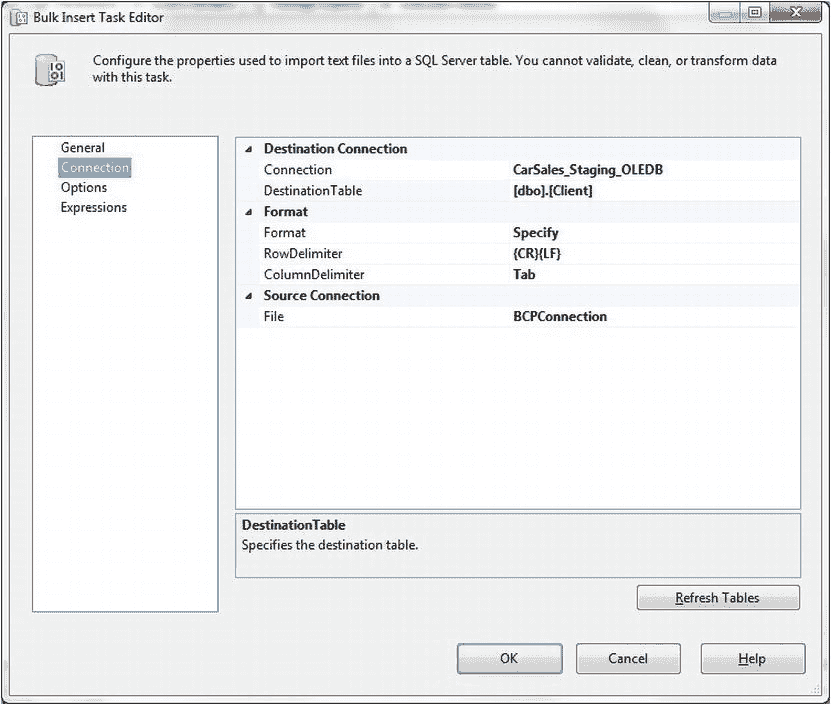
图 5-2. 使用 SSIS 进行批量插入
9.  单击左侧窗格中的“选项”。确保数据文件类型设置为 widenative（因为这是选择的 BCP 导出选项）。
10. 选择“保留空值”和“表锁”选项。你应该看到一个类似于 图 5-3 的对话框。
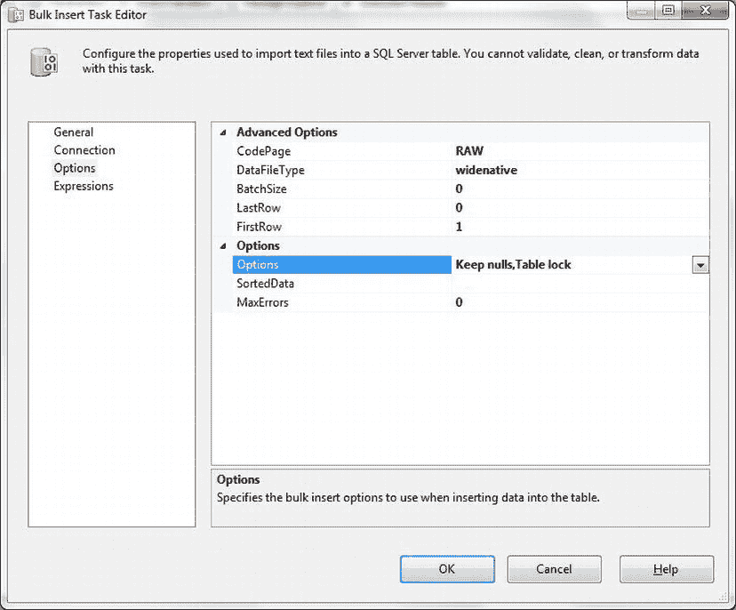
图 5-3. SSIS 批量插入任务选项
11. 单击“确定”确认你的选择。

现在你可以运行 SSIS 包并将数据加载到 SQL Server 中。

### 工作原理

SSIS 也可以对原生格式的 SQL Server 源数据执行 `BULK INSERT`。但是，`BULK INSERT` 任务在数据加载过程中无法执行任何数据清理或数据修改。此外，你必须确保使用的原生格式类型（字符或 Unicode）与导出数据时指定的类型一致。而且，目标表必须在设置此包之前就存在。这项技术很可能是 SSIS 中可用的最快加载选项。

此示例使用了默认的列和行终止符（制表符和 CR/LF）。如果这些在 BCP 导出命令中被设置为不同的值，那么你需要确保在 `BULK INSERT` 任务编辑器的“连接”窗格中选择了相应的终止符。同样，如果你在源文件中选择（或被提供）了不同的数据文件类型（原生、字符或宽字符），你需要确保这与 `BULK INSERT` 任务中选择的字符类型相对应。

### 提示、技巧和陷阱

*   如果源数据已经排序，那么你可以在步骤 10 的 SortedData 字段中输入组成排序键的列。
*   如果目标表与源表结构不完全匹配，或者你只想加载列的子集，那么你必须定义并使用一个格式文件。
*   使用 BCP、`BULK INSERT` 和 `OPENROWSET (BULK)` 进行批量数据加载有许多优化方法。有关批量加载优化的详细信息，请参见第 14 章。


# 5-7. 在 SQL Server 数据库间移植少量数据

## 问题

您希望在 SQL Server 数据库之间快速、轻松地传输少量数据，而无需编写复杂的 T-SQL 或使用 SSIS。

## 解决方案

将数据从 SSMS 脚本化为`INSERT`语句。

以下步骤详细说明了如何执行此操作。

1.  右键单击数据库名称。选择任务  生成脚本。
2.  如果显示介绍性对话框，请单击下一步。
3.  单击“选择特定对象”。展开“表”并勾选您希望将其数据脚本化出来的表。对话框应类似于图 5-4。
    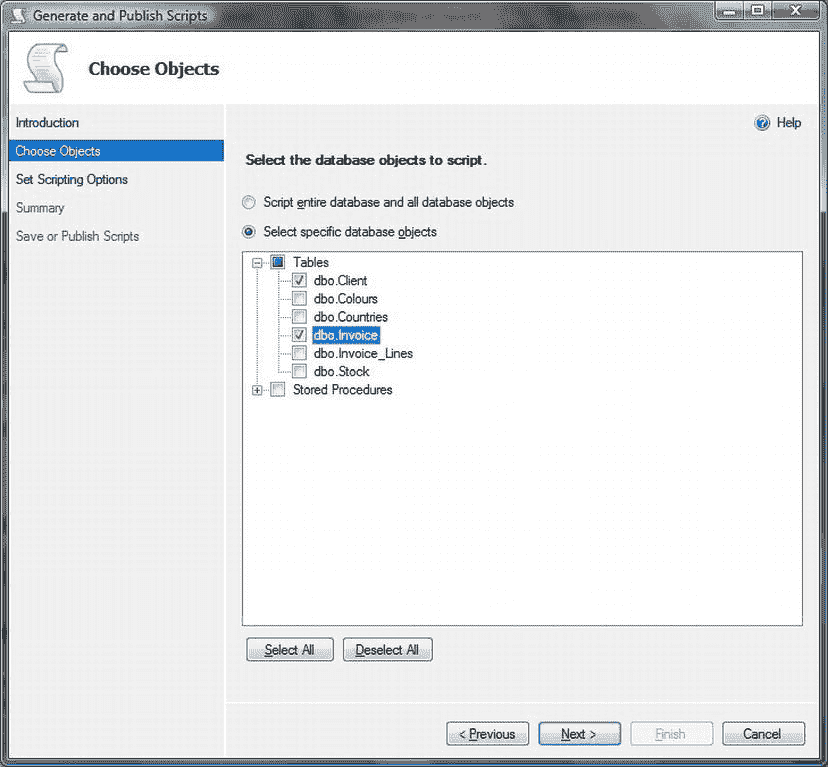
    图 5-4.  从 SSMS 脚本化数据
4.  单击下一步，然后单击“高级”。找到“要脚本化的数据类型”选项。选择“仅数据”，如图 5-5 所示。
    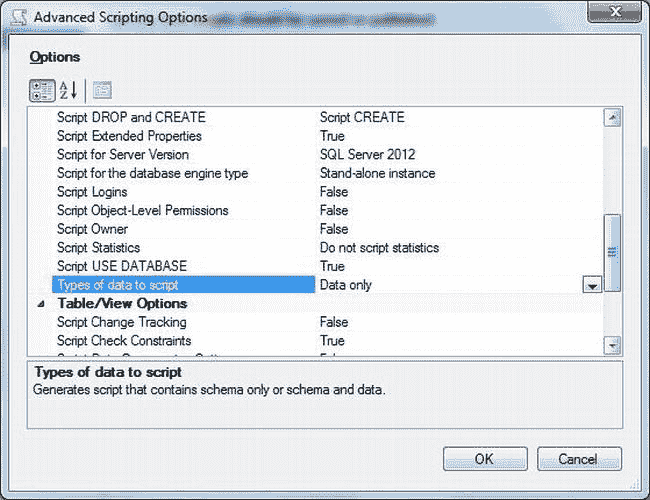
    图 5-5.  SSMS 中的数据脚本化选项
5.  单击“确定”。定义一个文件来保存脚本。然后依次单击“下一步”、“下一步”和“完成”。

如果您打开在第 5 步定义的文件，您将看到一系列（非常冗长的）INSERT 语句，类似于下面这个输出文件的简化版本。

```sql
SET IDENTITY_INSERT [dbo].[Client] ON
INSERT [dbo].[Client] ([ID], [ClientName], [Address1], [Address2], [Town], [County], [PostCode], [Country], [ClientType], [ClientSize], [ClientSince], [IsCreditWorthy], [DealerGroup], [MapPosition]) VALUES (3, N'John Smith', N'4, Grove Drive', NULL, N'Uttoxeter', N'Staffs', NULL, 1, N'Private', N'M', NULL, 1, NULL, NULL)
INSERT [dbo].[Client] ([ID], [ClientName], [Address1], [Address2], [Town], [County], [PostCode], [Country], [ClientType], [ClientSize], [ClientSince], [IsCreditWorthy], [DealerGroup], [MapPosition]) VALUES (7, N'Slow Sid', N'2, Rue des Bleues', NULL, N'Avignon', N'Vaucluse', NULL, 3, N'Private', N'M', NULL, 1, NULL, NULL)
SET IDENTITY_INSERT [dbo].[Client] OFF
```

## 工作原理

如果您只有（相对）少量数据需要在 SQL Server 之间传输，那么您总是可以使用 SSMS 将一个或多个表的数据脚本化出来。这会为数据源中的每条记录创建一系列`INSERT . . . VALUES`语句。

希望您能明白为什么这不推荐用于大量数据。然而，对于需要插入数据库创建脚本中的小型参考表来说，这是一个非常有用的技巧，值得了解和使用。

## 提示、技巧和陷阱

*   您可能想使用“为目标服务器版本脚本化”功能，尝试将数据复制到旧版本的 SQL Server。如果当前版本的 SQL Server 包含与所选 SQL Server 版本不兼容的数据类型（例如`GEOGRAPHY`、`GEOMETRY`或`HIERARCHYID`），则脚本创建将失败。
*   没有选项可以选择要脚本化出来的列。同样不幸的是，您无法脚本化视图的数据。因此，如果您想垂直地（按列）提取表的子集，您必须执行一个`SELECT. . .INTO`操作将数据导出到新表，然后从这个“临时”表中脚本化数据，最后再删除它。

# 5-8. 在表之间复制和粘贴

## 问题

您希望在几个表之间复制少量数据，而不想有任何麻烦或耗费时间在操作过程上。

## 解决方案

复制并粘贴数据。

听起来可能难以置信，但可以按如下方式完成：

1.  在 SSMS 中，展开包含源表的数据库，展开“表”，右键单击您想要复制其数据（全部或部分）的表，然后选择“编辑前 200 行”。
2.  在显示的数据表中单击，然后选择查询设计器  窗格  SQL（或单击“显示 SQL”工具栏按钮）。
3.  在 SQL SELECT 语句中添加合适的`WHERE`子句以显示您希望复制的数据，并将 TOP (200)更改为您计划复制的大致记录数。
4.  单击“执行”工具栏按钮或选择查询 执行 SQL。
5.  选择所有输出数据（通过单击网格中第一个列标题左侧的灰色方框）。您应该看到类似图 5-6 的内容。
    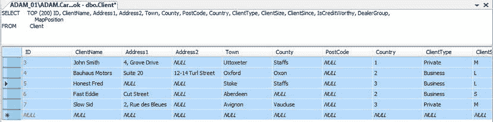
    图 5-6.  在 SSMS 中复制和粘贴数据
6.  复制数据（此处我省略操作步骤，以免侮辱您的智慧）。
7.  右键单击目标表。选择“编辑前 200 行”。
8.  选择一条空白记录（例如，在记录集的底部）并粘贴数据。

## 工作原理

我想，对于简单地将成百上千行数据复制粘贴到 SQL Server 表中这个想法，大多数开发者都会感到惊讶。嗯，这是可能的——在部署数据库和同步开发环境时，它可以是一种宝贵的节省时间的技巧。您会注意到，我并没有建议将其作为生产技术。尽管如此，它仍然值得研究，因为您可以在 SQL Server 中实现 Access 开发者 20 年来一直在做的事情。

您需要一个结构与源数据完全相同的目标表——精确到列的顺序。这个目标表不能包含任何重复的键数据。

## 提示、技巧和陷阱

*   您可以定义视图作为数据源，并从中复制。但是，您的目标表必须在结构上与该视图完全相同。
*   对于大量数据，此方法不（真的，确实不）推荐使用。
*   我怀疑您是否会在关键任务环境中使用此方法。

# 5-9. 在 ETL 过程中尽可能快速地加载数据

## 问题

您希望作为 ETL 过程的一部分，定期、尽可能快地加载数据。

## 解决方案

在 SSIS 项目中使用 SSIS SQL Server 目标。这要求您执行以下操作：

1.  创建一个新的 SSIS 包。
2.  添加一个 OLEDB 源连接管理器。将其配置为使用`ADAM02\Remote`服务器和`CarSales`数据库。
3.  单击“数据流”选项卡。由于尚未添加数据流任务，请单击“此包中未添加数据流任务。单击此处添加新的数据流任务”。
4.  添加一个新的 OLEDB 源任务，并将其配置为使用`Client`表作为数据源。
5.  向数据流添加一个 SQL Server 目标任务，并将源任务连接到它。双击以编辑 SQL Server 目标任务。
6.  单击“新建”，并使用 SQL Server Native Client 11.0 创建一个新的 OLEDB 连接管理器。将其配置为指向`CarSales_Staging`数据库。
7.  选择`Client`作为目标表。
8.  在左侧单击“映射”。映射可用的列。
9.  在左侧单击“高级”以显示“高级”选项卡。
10. 勾选“保留标识值”、“表锁定”和“保留 Null 值”。对话框应如图 5-7 所示。
    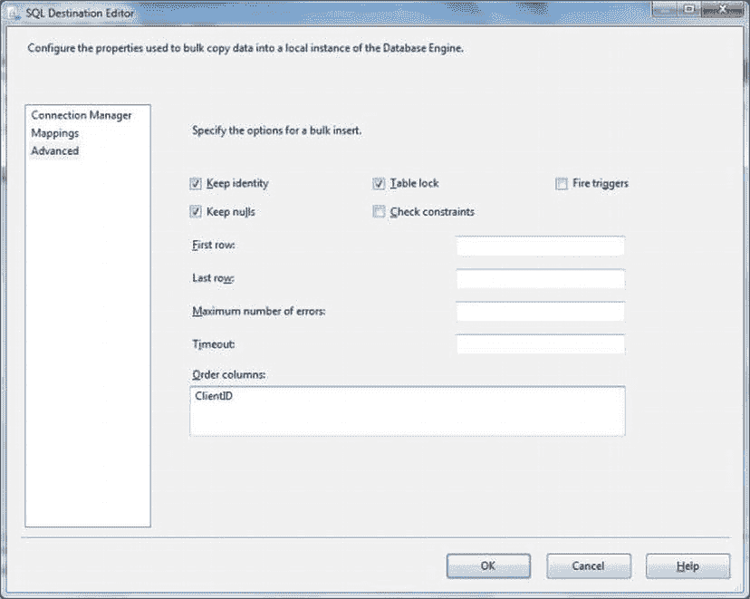
    图 5-7.  为 SSIS 大容量插入任务指定高级选项
11. 单击“确定”。

您现在可以运行该包，并将源数据插入到目标数据库中。

## 工作原理

到目前为止，在本书中，我们只在 SSIS 包中使用过 OLEDB 目标。然而，还有另一个目标选项，即 SQL Server 目标。您不必从另一个 SQL Server 加载数据才能使用 SQL Server 目标——我只是选择在本章中讨论它。


# SQL Server 目标与数据库表导入导出

SQL Server 目标可用于加载来自任何数据源的数据，并因其假定的优势和缺点而备受争议。简而言之——前提是您在目标 SQL Server 实例所在的服务器上运行 SSIS——您可以使用它来替代 OLEDB 目标。本质上，其核心选项与使用 `BULK INSERT` 时可用的选项相同，这些选项在配方 5-3 中有描述。

至此，您已经了解了 SQL Server 目标。但它为何会引发如此多的讨论呢？毕竟，SQL Server 目标所做的不过是像 `BULK INSERT` 任务一样，提供向 SQL Server 的高速数据插入。区别在于，通过使用 SQL Server 目标，您可以在加载过程中对列数据应用转换。主要问题似乎是：任何速度提升（其本身在某种程度上存在争议，但在大多数情况下由于用于连接到 SQL Server 数据库的共享内存而切实存在）都会因以下事实而大打折扣：

*   这是一个不可扩展的解决方案，因为您无法在不将 SQL Server 目标替换为 OLEDB 目标的情况下将包移动到另一台机器。
*   您必须在将要运行包的服务器上编辑该包。

自 SQL Server 2012 出现以来，关于 SQL Server 目标是否仍能提供速度优势的讨论在博客圈中层出不穷。我只能建议，如果您希望尝试减少加载时间，可以在您的环境中进行测试。无论如何，既然您已经了解了其优势和限制，就可以选择使用或不使用它。我怀疑这个决定取决于您环境的限制以及加载数据时潜在的速度提升。

## 5-10. 导入和导出数据库中的所有表

### 问题

您想将一个 SQL Server 数据库中的表导出并导入到另一个 SQL Server 实例。

### 解决方案

使用 T-SQL 和数据库元数据为一部分表创建 BCP 导入和导出脚本。然后您可以运行这些脚本（首先）导出然后导入数据。

1.  在源 SQL Server 上运行以下脚本，并将 `@InOut` 变量设置为 1，以获取导出源 SQL Server 数据库中数据的 BCP 命令列表（每个表一个）。该脚本位于示例中的 `C:\SQL2012DIRecipes\CH05\BCPAllTAblesOutAndIn.Sql`。

    ```sql
    DECLARE @InOut BIT = 0;
    DECLARE @BCPDatabaseName  VARCHAR(128)     = 'CarSales';
    DECLARE @BCPDirectoryName VARCHAR(128)     = 'C:\SQL2012DIRecipes\CH05\';
    DECLARE @BCPParameters    VARCHAR(100)     = '-T';
    DECLARE @BCPOutServer     VARCHAR(50)      = 'ADAM02';
    DECLARE @SQLTextBI        NVARCHAR(4000)   = '';
    DECLARE @SQLTextBCP       NVARCHAR(4000)   = '';
    DECLARE @SQLParametersBulkInsert NVARCHAR(4000)  =
                                               N'@BCPDatabaseNameIN VARCHAR(128)
                                               ,@BCPDirectoryNameIN   VARCHAR(128)';
    DECLARE @SQLParametersBCPOUT NVARCHAR(4000) =
                                               N'@BCPDatabaseNameIN VARCHAR(128)
                                               ,@BCPDirectoryNameIN VARCHAR(128)
                                               ,@BCPOutServerIN VARCHAR(128)
                                               ,@BCPParametersIN VARCHAR(128)';
    DECLARE @BCPSchemaName VARCHAR(128);
    DECLARE @BCPTableName VARCHAR(128);

    IF @InOut = 1
        BEGIN
    SET @SQLTextBCP = 'SELECT ''BCP '' + @BCPDatabaseNameIN + ''.'' + TABLE_SCHEMA + ''.'' + TABLE_NAME + '' OUT '' + @BCPDirectoryNameIN + TABLE_SCHEMA + ''_'' + TABLE_NAME + ''.bcp'' + '' -N '' + ''-S'' + @BCPOutServerIN + '' '' + @BCPParametersIN '
    SET @SQLTextBCP = @SQLTextBCP + ' FROM ' + @BCPDatabaseName + '.INFORMATION_SCHEMA.TABLES'
    SET @SQLTextBCP = @SQLTextBCP + ' WHERE TABLE_TYPE = ''BASE TABLE''';

    EXECUTE master.dbo.sp_executesql @SQLTextBCP
                                     ,@SQLParametersBCPOUT
                                     ,@BCPDatabaseNameIN = @BCPDatabaseName
                                     ,@BCPDirectoryNameIN = @BCPDirectoryName
                                     ,@BCPOutServerIN = @BCPOutServer
                                     ,@BCPParametersIN = @BCPParameters;
        END
    ELSE
        BEGIN
    SET @SQLTextBI = 'SELECT ''BULK INSERT '' + @BCPDatabaseNameIN + ''.'' + TABLE_SCHEMA + ''.'' + TABLE_NAME + '' FROM '''''' + @BCPDirectoryNameIN + TABLE_SCHEMA + ''_'' + TABLE_NAME + ''.bcp'''' WITH (DATAFILETYPE=''''widenative'''')'''
    SET @SQLTextBI = @SQLTextBI + ' FROM ' + @BCPDatabaseName + '.INFORMATION_SCHEMA.TABLES'
    SET @SQLTextBI = @SQLTextBI + ' WHERE TABLE_TYPE = ''BASE TABLE''';

    EXECUTE master.dbo.sp_executesql @SQLTextBI
                                     ,@SQLParametersBulkInsert
                                     ,@BCPDatabaseNameIN = @BCPDatabaseName
                                     ,@BCPDirectoryNameIN = @BCPDirectoryName;
    END
    ```

2.  在源服务器上执行脚本的输出，以创建 BCP 本机文件。
3.  将 BCP 文件复制到目标服务器。
4.  将 `@InOut` 变量设置为 0 运行脚本，以获取加载 BCP 文件的脚本。
5.  运行脚本的输出——即重新加载数据的 `BULK INSERT` 命令。

### 工作原理

从 SQL Server 传输数据有时可能涉及整个数据库或大部分数据。当然，在最理想的情况下，您只需使用备份和还原。幸运的是，SQL Server 允许在 64 位和 32 位环境之间进行备份和还原，因为 SQL Server 的磁盘上存储格式在 64 位和 32 位环境中是相同的。因此，在一个环境中运行的服务器实例上创建的备份可以在另一个环境中运行的服务器实例上还原。然而，我相信您已经发现，备份和还原在某些情况下根本不起作用——例如（有时）从较新版本的 SQL Server 到较旧版本。

在这些情况下，一种解决方案是将选定的表导出为 BCP 文件，然后使用 `BULK INSERT` 重新加载它们。我并不是说这是最优解决方案；只是当其他解决方案过于复杂或不可行时，这种方法对我来说一直有效。

此代码段使用数据库元数据选择所有表，并为所有表创建相应的 `BCP .. OUT` 和 `BULK INSERT` 脚本。您只需将此代码段中的 `@InOut` 参数设置为 1，即可获得一个脚本，然后运行该脚本即可为每个数据库表导出一个 BCP 文件。反之，将 `@InOut` 参数设置为 0 会输出一个在目标服务器上导入相同表的脚本。当然，在每种情况下，您必须将 `@BCPDirectoryName` 参数设置为您希望存储 BCP 文件的目录，就像您必须设置自己的服务器 (`@BCPOutServer`)、暂存目录 (`@BCPOutServer`) 和数据库 (`@BCPDatabaseName`) 一样。

该脚本不掩饰其简单高效——也就是说，它不会处理许多复杂级别，例如外键依赖关系、主键和标量插入等。然而，它将帮助您非常快速轻松地传输数据。

### 提示、技巧和陷阱

*   通过明智地使用从 `INFORMATION_SCHEMA` 表返回数据的 `WHERE` 子句，可以调整此代码段以选择（或排除）表。
*   您可以通过同时运行不同的 BCP 和 `BULK INSERT` 命令（当然，针对不同的表和文件）来并行化该过程。

## 5-11.


# 从不同版本的 SQL Server 加载数据

## 问题
你需要使用原生格式将数据从旧版本的 SQL Server 加载到 SQL Server 2005、2008 和 2012 中。

## 解决方案
使用 `BCP` 导出数据，然后以原生格式导入，以确保表能够快速无误地加载。

以下代码片段从示例文件中导入了一个从旧版本 SQL Server 导出的 `BCP` 文件（`C:\SQL2012DIRecipes\CH05\BCPNative.cmd`）：

```
BCP CarSales_Staging.dbo.Client_BCP IN C:\SQL2012DIRecipes\CH05\Clients.bcp –N –T –V 70 –SADAM02
```

## 工作原理
有时你可能需要从旧版本的 SQL Server 导出一系列表，然后重新导入到 SQL Server 2005 或 2008 中。为此，你必须使用适用于该旧版本服务器的 `BCP` 版本来导入这些表。使用 `BCP` 导入时，添加 `–v NN` 标志，其中 `NN` 是版本号。`BCP` 版本选项在表 5-6 中提供。

表 5-6. BCP 版本选项

| 标志 | 描述 |
| --- | --- |
| `-V 70` | SQL Server 7.0 版本 |
| `-V 80` | SQL Server 2000 |
| `-V 90` | SQL Server 2005 |
| `-V 100` | SQL Server 2008 |
| `-V 110` | SQL Server 2012 |

在 SQL Server 2012 中，`BCP` 实用工具仅支持与 SQL Server 7.0、SQL Server 2000、SQL Server 2005 和 SQL Server 2008 兼容的原生数据文件。SQL Server 2012 不支持 SQL Server 6.0 和 SQL Server 6.5 的原生数据文件。

## 提示、技巧和陷阱
- 确保使用与导出时所用数据类型相对应的标志。
- 目标表结构必须存在于目标数据库中。
- 请记住，通常最好先删除任何索引，然后再重新创建它们。
- 方法 5-4 中描述的 `BCP` 选项也可以使用。
- 如果你是从 SQL Server 6.0 或 6.5 导入数据，那么最好的选择是导出为文本格式（`−c` 或 `-w`）并创建一个格式文件。然后，你就可以像加载来自任何源系统的文本文件一样加载该文件。

#### 5-12. 复制整个数据库

## 问题
你希望尽可能简单地在 SQL Server 实例之间复制数据库中的所有数据。

## 解决方案
使用 `COPY_ONLY` 备份将所有数据库对象及其数据传输到新的数据库，且不干扰任何备份序列。

这个简单而有效的技术需要你执行以下操作。

1.  使用以下代码片段创建 `COPY_ONLY` 备份（这无法使用 SSMS GUI 完成），必须在查询窗口中使用 T-SQL 脚本完成：

    ```
    BACKUP DATABASE CarSales TO DISK=' C:\SQL2012DIRecipes\CH05\CopyOnlyDatabase.bak'
    WITH INIT, COPY_ONLY
    ```

2.  然后，要在另一个 SQL Server 上恢复数据库，请使用类似以下的 T-SQL：

    ```
    RESTORE DATABASE CopyOnlyDatabase
    FROM DISK = N' C:\SQL2012DIRecipes\CH05\CopyOnlyDatabase.bak'
    WITH REPLACE,
    MOVE 'CarSales' TO ' C:\SQL2012DIRecipes\CH05\CopiedDatabase.Mdf',
    MOVE 'CarSales_log' TO ' C:\SQL2012DIRecipes\CH05\CopiedDatabase.ldf'
    ```

这些脚本位于示例文件中的 `C:\SQL2012DIRecipes\CH05\CopyOnlyBackup.Sql`。

## 工作原理
如果你需要 SQL Server 数据库中的所有数据，那么你可以复制整个数据库并在目标服务器上恢复。不过，有一个技巧可以确保这个简单的操作不会对你的备份策略造成问题。你必须使用 `BACKUP` 命令的 `COPY_ONLY` 参数，以确保你的差异备份和日志备份中的 LSN（日志序列号）不会被一个用作数据传输技术而非恢复策略一部分的备份所更改。如果你需要对数据库执行部分传输，你必须在还原的源数据库副本中 `DROP` 不需要的表和其他任何对象。

## 提示、技巧和陷阱
- 使用 `COPY_ONLY` 进行的备份副本会保留现有的日志归档点，因此不会对常规日志备份的顺序产生任何影响。
- 你不能使用 Management Studio GUI 来恢复数据库，因为将无法在要还原的备份集列表中显示该备份文件。你必须使用脚本来执行恢复操作。

# 5-13. 在数据库间传输复杂的数据子集

## 问题
你希望在数据库之间传输一个复杂但明确定义的、来自多个表的数据子集。

## 解决方案
在数据库之间应用快照复制。

以下是设置快照复制的概述。

1.  在将作为复制订阅者的 SQL Server 实例上设置分发服务器：右键单击“复制”，然后选择“配置分发”（如果此实例已存在分发数据库，则需要选择“分发服务器属性”）。单击“下一步”跳过“配置分发向导”欢迎屏幕。将出现“分发服务器”对话框。
2.  由于在此示例中订阅者就是分发服务器，因此向导已正确推断出要使用的实例。单击“下一步”确认。将出现“快照文件夹”对话框。
3.  如果你不想使用标准的 SQL Server 路径，请为快照输入一个新的网络路径。单击“下一步”。将出现“分发数据库”对话框。
4.  更改你认为不可接受的任何路径，然后，如果你愿意，可以更改分发数据库的名称。接着单击“下一步”以显示“发布服务器”对话框。这将已选择当前实例作为发布服务器，因此请取消选中此实例名称。接下来，单击“添加”，然后选择正在发布其数据的实例。
5.  单击“下一步”以显示“分发服务器密码”对话框。输入分发服务器密码。请务必记下它！
6.  单击“下一步”两次，然后单击“完成”以配置发布服务器。希望你会看到最终的对话框，确认分发服务器已成功配置。
7.  你现在需要配置发布——实质上是源数据。在提供数据的 SQL Server 实例中，展开“复制”，右键单击“本地发布”，然后选择“新建发布”。单击“下一步”跳过欢迎屏幕。将出现“分发服务器”对话框。
8.  选择“使用以下服务器作为分发服务器”单选按钮。单击“添加”以选择分发服务器。确认你的选择。单击“下一步”。
9.  输入你先前设置（并记下）的管理密码。单击“下一步”。
10. 选择包含你想要复制的对象的数据库。“发布数据库”对话框列出了所有可用的数据库。单击“下一步”。
11. 从“发布类型”对话框中选择“快照发布”。单击“下一步”。
12. 选择要发布的表。
13. 单击“下一步”以显示“筛选表行”对话框。
14. 单击“下一步”以显示“快照代理”对话框。如果你希望定期执行复制，请选中“立即创建快照”复选框和“计划快照代理运行”复选框（同时配置你所需的计划）。
15. 单击“下一步”。选择复制运行所使用的 SQL Server 代理的安全设置。
16. 单击“下一步”以显示“向导操作”对话框。选择立即创建发布、编写创建脚本或两者都选！
17. 单击“下一步”以显示最终对话框。为发布输入一个名称。
18. 单击“完成”以完成该过程。如果你选择了立即创建发布，则会创建快照。最终的对话框会显示该过程的状态。
19. 你现在需要设置订阅者。展开“复制”，右键单击“本地订阅”，然后选择“新建订阅”。单击“下一步”跳过欢迎屏幕。然后，“发布”对话框允许你选择一个发布。


## 选择分发服务器和订阅选项

选择正在发布数据的 SQL Server 实例（如有必要可浏览查找）。点击“下一步”。
20. 选择“在分发服务器上运行所有代理”。点击“下一步”。
21. 选择数据库（如果尚不存在，可从此对话框创建）。点击“下一步”。
22. 选择 Distribution 将在其中运行的账户。点击“下一步”。
23. 选择同步计划。点击“下一步”。
24. 确保勾选“初始化”复选框以便初始化复制。点击“下一步”。
25. 选择立即创建订阅，或对创建过程进行脚本编写，或两者兼选。点击“下一步”。
26. 验证是否已选择所有需要的选项。点击“完成”。
27. 订阅即被创建，数据被加载到订阅者数据库中。你应该会看到最终的对话框，确认一切运行顺利。

### 工作原理

该方案是对快照复制的极简概述。你执行了以下操作：

1.  在源服务器上设置 SQL Server 分发服务器。
2.  定义发布者（源）数据库和源数据（发布内容）。
3.  运行初始进程以创建源数据的快照。
4.  设置目标（订阅者）数据库。
5.  将快照数据加载到目标中。

在 SQL 开发人员或 DBA 的数据集成工具包中，一种不可或缺的、用于将数据从一个 SQL Server 实例传输到另一个实例的方法是复制。由于这是一个涉及多方面的庞大主题，我不会详细介绍所有复制类型的所有细节，特别是可能出现的所有管理问题。我只能向你推荐 Sujoy Paul 所著的 *Pro SQL Server 2005 Replication* (Apress, 2006)，该书详细而清晰地涵盖了相关内容。然而，作为一种高效的数据表导入和更新方法（当然也包括数据表的子集），复制是一种高效的技术。如果快照复制有效，那么它可以是一种救命的技术。如果无效，那么在你试图使其工作时，它可能会消耗你数小时甚至数天的时间。不过，那是另一个故事了。

我只介绍了快照复制，因为它可以被认为是一种数据集成技术。关于事务复制和合并复制、对等复制以及管理复制的详细信息，我建议你查阅一些关于该主题的优秀现有资料。

就术语而言，将复制映射到数据集成并不困难。本质上，数据源是复制发布者，数据目标是复制订阅者。在这个例子中，分发服务器可以被视为订阅者的一部分，仅仅因为我假设这是一个更“本地”的实例。当然，你也可以将分发服务器设置在发布者、订阅者或一个单独的 SQL Server 实例上。

假设你想使用此技术，只需确保你意识到其潜在的缺点。具体来说，在复制过程中会持有锁，并且所有目标数据会被完全覆盖。

## 5-14. 以交互方式将数据加载到 SQL Server Azure 中

### 问题

你想以交互方式将数据直接加载到 SQL Azure 数据库中。

### 解决方案

使用 `SSMS` 并编写 `SELECT...INTO` 或 `INSERT INTO...SELECT` 查询。

你可以像向传统 SQL Server 表脚本写入数据一样，使用 `SSMS` 将数据脚本写入 Azure 表。你只需执行以下操作。

1.  连接到基于云的数据库，如 图 5-8 所示。

    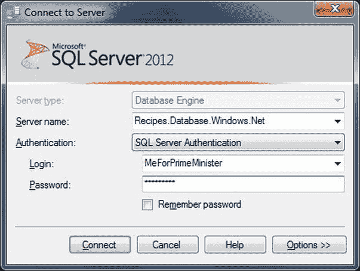

    图 5-8。  连接到 SQL Server Azure

2.  然后你可以在查询窗口中运行标准的 `INSERT INTO...VALUES` 语句来插入数据。

### 工作原理

由于我们生活在一个有趣的时代，我们面临着有趣的新挑战，而使用云托管数据库是相当长一段时间以来最激动人心的新事物之一。那么 SQL Server 如何管理这个新机遇呢？

答案是“相当轻松”——前提是使用 SQL Server 2008 R2 或更高版本。如果你使用的是 SQL Server 2008，则只能使用 `SSIS`。

描述如何设置 SQL Server Azure 数据库超出了本书的范围；但假设你拥有 Azure 数据库订阅，并且已定义所需的防火墙规则以允许你的工作站与 SQL Server Azure 通信，那么你几乎可以像在本地服务器上一样将数据加载到云托管数据库中。

由于你将在这些配方中频繁遇到它们，我倾向于解释 SQL Server Azure 数据库的连接字符串参数。这有助于你理解你遇到的各种代码片段和屏幕截图。SQL Azure 连接参数在 表 5-7 中提供。

表 5-7。 SQL Azure 连接参数

| 参数 (Parameter) | 元素 (Element) |
| :--- | :--- |
| 用户 (User) | MeForPrimeMinister |
| 服务器 (Server) | recipes.database.windows.net |
| 密码 (Password) | Gubbins |
| 数据库 (Database) | CarSales |

### 提示、技巧和注意事项

*   SQL Server Azure 仅支持 SQL Server 身份验证。
*   你必须使用 Azure 管理门户中提供的完全限定 DNS 名称。

## 5-15. 作为常规 ETL 过程的一部分将数据加载到 SQL Server Azure

### 问题

你想作为常规 ETL 过程的一部分将数据加载到 SQL Server Azure。

### 解决方案

使用 `SSIS` 将数据加载到 Azure。操作如下：

1.  创建一个新的 `SSIS` 包，为其适当命名，并向你的源数据库（本配方中的 `CarSales`）添加一个新的 `OLEDB` 连接管理器。将其命名为 `Source_OLEDB`。
2.  添加一个名为 `Azure_ADONET` 的新 `ADO.NET` 连接管理器。将其配置为连接到你的 SQL Server Azure 数据库，如 图 5-9 所示。

    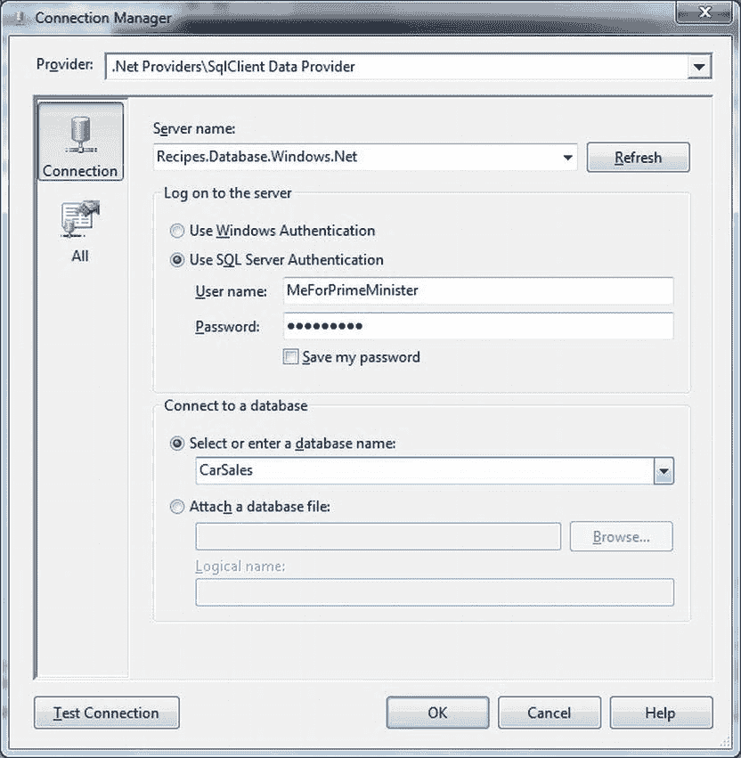

    图 5-9。  SSIS 和 .NET 连接到 SQL Server Azure

3.  向“控制流”窗格添加一个新的“数据流任务”。双击进行编辑。
4.  添加一个 `OLEDB` 数据流源，双击进行编辑，并按如下方式配置：
    | `OLEDB` 连接管理器： | `Source_OLEDB` |
    | :--- | :--- |
    | 数据访问模式： | SQL 命令 |
    | SQL 文本： | `SELECT ClientName, Country, Town, County, Address1, Address2, ClientType, ClientSize FROM dbo.Client` |
5.  添加一个 `ADO.NET` 目标。连接 `OLEDB` 源。
    ```
    连接管理器：Azure_ADONET
    使用表或视图："dbo"."Client"
    ```
6.  单击“映射”并映射源和目标之间的所有列。单击“确定”确认你的修改。

### 工作原理

此过程与用于向 SQL Server 加载数据的“标准” `SSIS` 包几乎相同。这是因为 `SSIS` 认为 SQL Server Azure 是一个（很大程度上）正常的数据源或目标。事实上，Azure 支持 `ADO.NET` 和 `OLEDB` 连接管理器。然而，唯一的轻微区别是，你不能选择数据库名称，而必须在数据库名称弹出列表中输入它。在现实场景中，你将不可避免地需要一个 `SSIS` 配置文件（或其他配置方法）来存储用于连接到 SQL Server Azure 数据库的密码。

### 提示、技巧和注意事项

*   如果你愿意，也可以使用 `OLEDB` 目标。这意味着为 Azure 数据库配置一个 `OLEDB` 连接管理器。它与 `ADO.NET` 连接管理器完全相同。


## 5-16\. 从命令行加载数据到 SQL Server Azure

**问题**
你希望从命令行快速、轻松地向 SQL Azure 加载数据。

**解决方案**
使用 BCP 将数据加载到 SQL Server Azure。

只要你的 BCP 版本是从 SQL Server 2008 R2 开始的，你就可以将数据加载到 SQL Server Azure。

1.  创建一个 BCP 导出文件，最好使用 SQL Server 原生或宽原生格式，这样就不需要格式文件。
2.  运行以下 BCP 命令：
    ```
    C:\Users\Adam>BCP Carsales.dbo.client IN C:\SQL2012DIRecipes\CH05\Azure.BCP –U MeForPrimeMinister@recipebook -PGubbins –Srecipes.database.windows.net -N -E
    ```

**工作原理**
如果你喜欢（或需要）用传统方式加载数据，可以使用 BCP。你必须使用 SQL Server 身份验证。关键是要在 BCP 连接字符串中的用户名后添加 `@ServerName`。当然，你可以使用自己的用户名/服务器/密码。因为我希望覆盖目标表的 `IDENTITY` 设置，所以我在这里使用了 `–E` 参数。

**提示、技巧和陷阱**
*   所有其他 BCP 元素与配方 5-4 中描述的一致。
*   你必须使用在 Azure 管理门户中给出的完全限定 DNS 名称作为服务器名称。

## 5-17\. 加载临时数据到 SQL Server Azure

**问题**
你需要一种快速且用户友好的方式将临时数据加载到 SQL Server Azure。

**解决方案**
使用可以连接到 SQL Server Azure 的导入/导出向导来加载数据。这很容易操作。

1.  启动导入/导出向导。定义你的源数据库（SQL Server 或其他）。单击“下一步”移动到“选择目标”页面。
2.  选择“.Net Framework Data Provider for SQL Server”。
3.  指定以下参数：
    | **参数** | **元素** |
    |---|---|
    | 数据源： | recipes.database.windows.net（你的 Azure 服务器） |
    | 用户 ID： | MeForPrimeMinister（你的 Azure 用户） |
    | 密码： | Gubbins（你的 Azure 密码） |
    | 初始目录： | CarSales（你的 Azure 数据库） |
    | 信任服务器证书： | True |
    | 加密： | True |
    对话框应类似于图 5-11。
    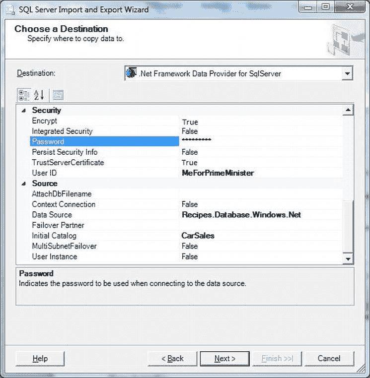
    图 5-11。 SQL Azure 和导入/导出向导
4.  像处理任何其他 SSIS 加载操作一样继续。

**工作原理**
将数据导入 SQL Server Azure 的另一个有效选项是使用导入/导出向导。由于这在配方 1-2 和 1-11 中已有充分描述，这里我仅指出使用 SQL Server Azure 作为目标时的区别。

但是，数据库和表必须已经存在于 SQL Azure 中。值得注意的是，在撰写本文时，SQL Server Azure 不支持链接服务器。

## 5-18\. 在数据库之间传输表

**问题**
你想通过网络连接在 SQL Server 实例之间复制多个表及其数据，并替换目标数据库中任何现有的对象。

**解决方案**
使用 SSIS 和“传输数据库对象任务”来复制选定的表、数据，以及可能的索引、主键和外键、扩展属性。以下步骤描述了具体操作方法。

1.  创建一个新的 SSIS 包。
2.  在“连接管理器”选项卡中右键单击，选择“添加连接”。
3.  选择 `SMOServer` 连接管理器类型。对话框应类似于图 5-12。
    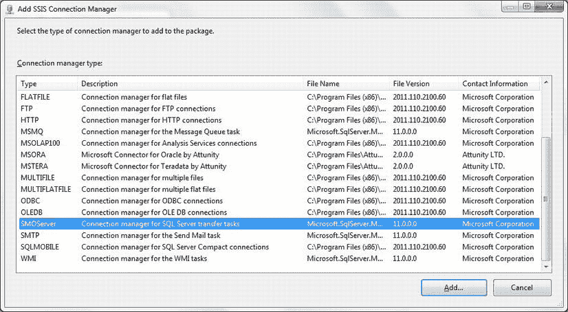
    图 5-12。 添加 `SMOServer` 连接管理器
4.  单击“添加”。输入或浏览到源服务器。对话框应类似于图 5-13。
    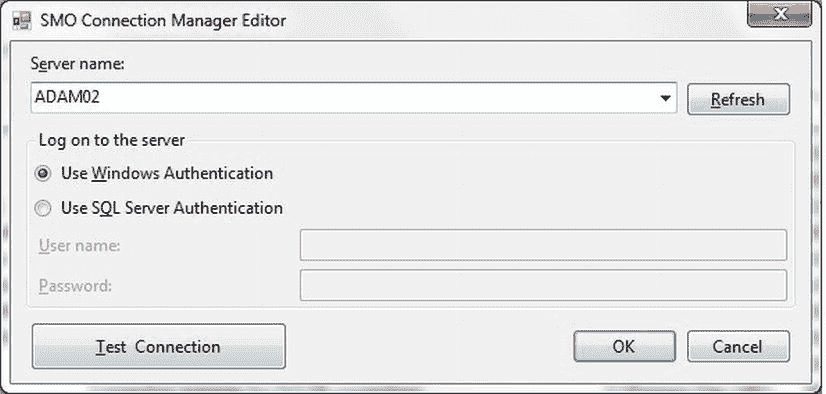
    图 5-13。 配置 `SMOServer` 连接管理器
5.  单击“测试连接”。
6.  单击“确定”确认你的修改。
7.  在“连接管理器”选项卡中右键单击连接管理器，然后单击“重命名”。将连接管理器重命名为 `CarSales_OLEDB`。
8.  对目标服务器（本示例中为 `Adam02\AdamRemote`）重复步骤 4-6。将连接管理器命名为 `CarSales_Staging_OLEDB`。
9.  在“控制流”窗格中添加一个“传输数据库对象任务”。
10. 双击编辑“传输数据库对象任务”。
11. 单击左侧的“对象”。
12. 选择 `CarSales_OLEDB` 作为源连接。
13. 选择 `CarSales_Staging_OLEDB` 作为目标连接。
14. 选择 `CarSales` 作为源数据库。
15. 选择 `CarSales_Staging` 作为目标数据库。
16. 设置以下属性：
    | `DropObjectsFirst`: | False |
    |---|---|
    | `IncludeExtendedProperties`: | True |
    | `CopySchema`: | True |
    | `CopyData`: | True |
    | `CopyAllObjects`: | False |
    | `CopyPrimaryKeys`: | False |
    | `CopyForeignKeys`: | False |
17. 展开 `ObjectsToCopy`。单击右侧的省略号按钮。
18. 选择要复制的表。对话框应类似于图 5-14。
    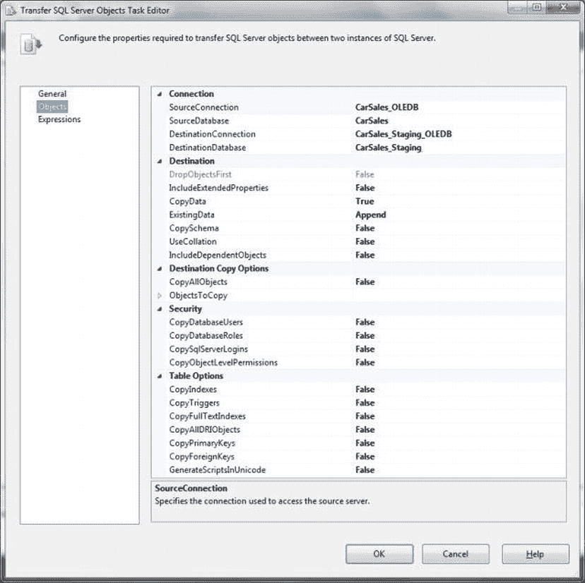
    图 5-14。 SQL Server 传输对象任务编辑器
19. 单击“确定”确认。你将返回到“传输 SQL Server 对象任务编辑器”，它应类似于图 5-15。
    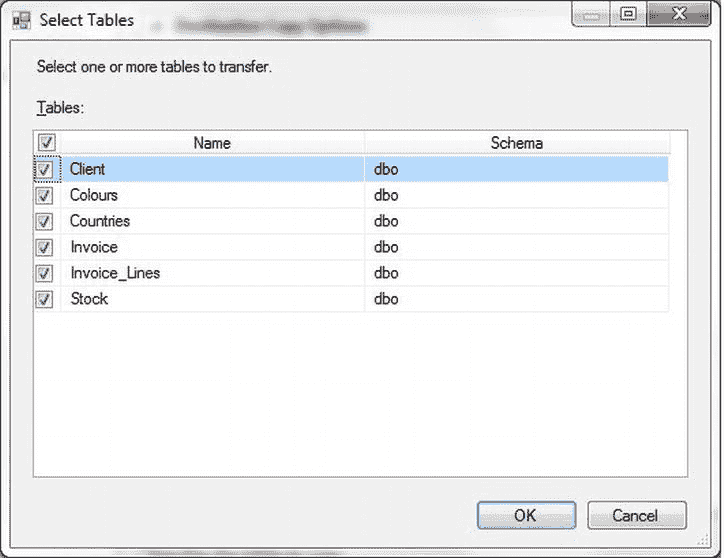
    图 5-15。 使用 SSIS 传输 SQL Server 对象任务选择要传输的表
20. 单击“确定”确认。

你现在可以运行该包。所有选定的表都将被传输。

**工作原理**
“传输 SQL Server 对象任务”本质上是一个用于 SQL Server 管理对象 (SMO) 的图形用户界面。正如你可能知道的，SMO 是一个对象集合，旨在使 SQL Server 的管理编程更易于访问。SMO 可以做的事情（在众多功能中）包括删除和创建表，以及在表之间传输数据。在这个配方中，我们使用“传输 SQL Server 对象任务”来执行此操作。正如你所见，它不仅允许你选择要复制的表，还可以通过复制其他元素（如索引和主/外键）来扩展此操作。


需要提醒您的是，传输 SQL Server 对象任务的方法相对简单，最适合迁移那些依赖关系很少或没有依赖关系的表和数据。然而，作为在 SQL Server 实例之间复制整个表的工具，其简洁性是无与伦比的。运行此任务的先决条件是源数据库和目标数据库使用相同的表结构。

使用传输 SQL Server 对象任务加载数据时，您还可以请求该任务在迁移数据之前生成任何所需的表。这只需将 `CopySchema` 选项设置为 True 即可。但是，请注意，如果表已存在且您将 `CopySchema` 设置为 True，那么在运行包时将会出错，因为表已经存在。如果您愿意，可以将 `DropObjectsFirst` 选项以及 `CopySchema` 选项设置为 True，以替换现有表的结构和数据。如果表已存在于目标数据库中且 `CopySchema` 设置为 False，您将有机会通过将 `ExistingData` 设置为 Replace 来追加（而不是替换）数据。

就数据迁移而言，传输 SQL Server 对象任务是一个“全有或全无”的解决方案。它不允许您对源数据进行子集化、使用源查询或仅选择部分列集。这些限制可以通过变通方法来克服，例如运行 `SELECT...INTO` 子句创建临时表作为数据源；但话又说回来，如果您打算这样做，那还不如使用其他解决方案来传输数据，依我之见。从可用选项可以看出，此任务能做的远不止传输数据，但对这些可能性进行完整分析已超出了本书的范围。

## 本章小结

本章介绍了多种将数据从 SQL Server 源传输到 SQL Server 目标的方法。其中一些方法可能看起来相似，或是方法的重复，或者干脆就显得晦涩难懂。为了给您一个更清晰的概览，表 5-8 展示了我对各种方法及其优缺点的看法。

表 5-8. 本章所用方法的优缺点

| 技术 | 优点 | 缺点 |
| --- | --- | --- |
| `OPENROWSET` | 易于使用。 | 速度慢（OLEDB）。 |
| `OPENDATASOURCE` | 易于使用。 | 速度慢（OLEDB）。 |
| 链接服务器 | 易于使用，安全。 | 速度慢（OLEDB）。 |
| `BULK INSERT` | 速度极快。 | 需要表元数据。 |
| BCP | 速度极快，但相当晦涩难懂。 | 需要在 SQL Server 外部运行——或者需要 `xp_cmdshell` 权限。需要表元数据。 |
| `OPENROWSET (BULK)` | 速度快。 | 仅限基于文件。需要格式文件。需要表元数据。 |
| SSIS (OLEDB) | 直观。 | 并非最快的方法。 |
| SSIS BULK INSERT TASK | 速度极快。 | 仅限基于文件，需要格式文件。 |
| 复制 | 速度快且自动。 | 调试和故障排除复杂。 |
| 脚本化输出数据 | 极其简单。 | 不适用于大量数据。 |
| 备份副本 | 极其简单。 | 要么整个数据库，要么全无。 |
| 复制和粘贴 | 简单得难以置信。 | 仅适用于极少量数据。不适用于生产环境。 |

当您需要将数据从一个 SQL Server 实例传输到另一个实例时，唯一真正的困难在于知道要从众多可用选项中选择哪一个。至少乍一看是这样。正如我本章试图展示的那样，每种可用技术都有其优缺点，其中一些技术比其他技术更适合特定的情况。

因此，如果您只是加载少量参考数据记录，那么复制和粘贴可能就足够了。如果您要在快速网络上移动几十万条记录，链接服务器可能是个好主意。如果您必须在服务器之间加载数百万条记录，那么最好考虑使用 BCP 和 `BULK INSERT`。

然而，我无权规定解决方案。我本章的目标是让您了解众多可用的技术及其显著特点。您可以根据您的特定需求和环境选择最合适的技术。

# 第 6 章


## 各种数据源

为了完成我们对源数据的巡览，我们需要关注一些不属于前五章更明确定义类别的少数数据存储库。我想这是另一种说法，即本章有点像是各种不同数据源的大杂烩，所以在我们继续时，请接受它们相当不连贯的性质。这并不意味着这些数据源不太可能被使用或没有潜在用途。我仅仅是在陈述它们有些更为“奇特”，因此也更罕见——至少在我的经验中是如此。

在本章中，我们将探讨以下内容：

*   从 Analysis Services 源加载数据
*   在 SQL Server 中存储图像和文档文件
*   从 Visual FoxPro 文件加载数据
*   从 dBase 文件加载数据
*   从 Web 服务返回数据
*   捕获 WMI 数据
*   使用 ODBC 连接连接到各种数据源

我知道本书并未涵盖许多数据源。也许有一天，您需要导入 Paradox 数据文件或访问目录服务中丰富的可用信息，例如。不幸的是，实在没有篇幅来涵盖所有可以加载到 SQL Server 中的可能数据源，因此我选择了我多年来必须处理的核心数据源组，而将其他数据源排除在本书之外。

本章使用的示例文件位于 `C:\SQL2012DIRecipes\CH06` 目录中——假设您已从本书的配套网站下载示例并按照 附录 B 中的说明进行了安装。这包括一个可以加载到 Analysis Services 中的示例 SSAS 多维数据集。

### 6-1. 从 SQL Server Analysis Services 导入数据

#### 问题

您希望定期将数据从 SQL Server Analysis Services (SSAS) 多维数据集导入到 SQL Server 关系表中。

#### 解决方案

使用 SQL Server Integration Services (SSIS) 和 Microsoft OLEDB 提供程序连接到 Analysis Services，并以表格格式导入数据。操作步骤如下：

1.  创建一个新的 Integration Services 包。在“控制流”窗格中添加一个“数据流任务”。双击以切换到“数据流”窗格——或者，如果您愿意，可以单击“数据流”选项卡。
2.  右键单击屏幕底部的“连接管理器”选项卡。选择“新建 OLEDB 连接”。单击“新建”。
3.  选择“本机 OLEDB\Microsoft OLEDB Provider for Analysis Services 11.0”。输入 Analysis Services 服务器名称——本例中为 localhost。选择“集成安全性”。然后，您可以从“初始目录”下拉列表中选择要连接的多维数据集。您应该看到类似 图 6-1 的内容。

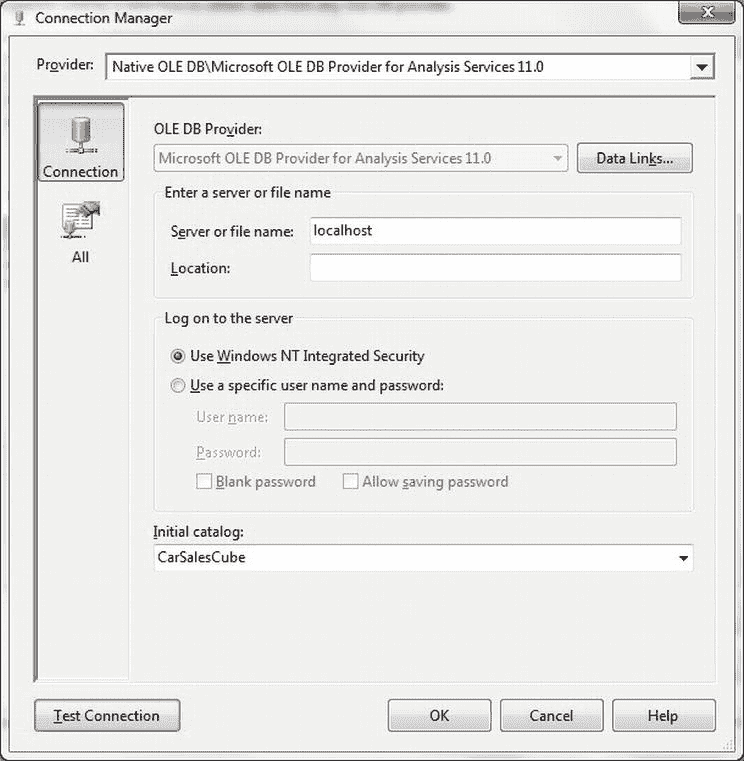

图 6-1. 连接到 OLAP 多维数据集的 OLEDB 连接

4.  测试连接。单击“确定”两次以完成创建。
5.  在“数据流”窗格中添加一个 OLEDB 源任务。选择您刚刚创建的 OLEDB 连接管理器。将“数据访问模式”选择为“SQL 命令”，并输入用于选择要导入数据的 MDX（多维表达式）代码。示例如下（示例文件中的 `C:\SQL2012DIRecipes\CH06\ProductsAndClients.Mdx`）：

    ```sql
    SELECT
     NON EMPTY([Dim Clients].[Client Name].[Client Name]) ON COLUMNS
     ,EXCEPT([Dim Products].[Make].[Make], [Dim Products].[Make].UNKNOWNMEMBER) ON ROWS
     FROM [Car Sales DW]
     WHERE [Measures].


## 使用 SSIS 从 SSAS 立方体导入数据

[成本价格] 对话框应类似于 图 6-2。
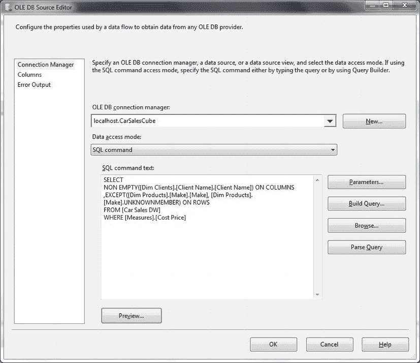
图 6-2. OLEDB 源中的 MDX 查询

6.  单击“预览”以查看连接和 MDX 选择是否有效。你可能会看到以下警告（参见 图 6-3），无需担心。
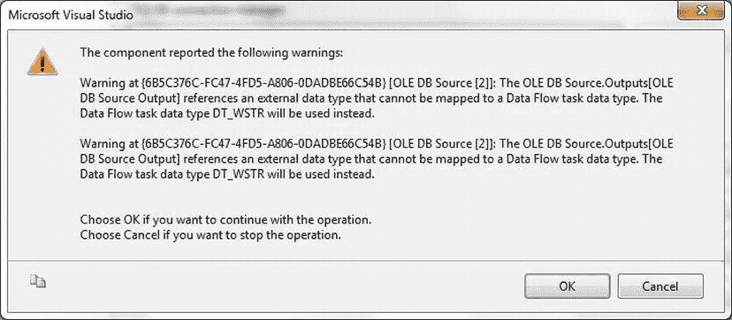
图 6-3. OLAP 警告

7.  单击“确定”，你应该会看到你的示例数据。
8.  单击“确定”以确认数据源创建。SSIS 再次发出警告并显示警告对话框。单击“确定”将其关闭。
9.  在“数据流”选项卡上添加一个“数据转换”任务，并将 OLEDB 源任务连接到它。现在你需要将所有数字数据从 `DT_WSTR`（Unicode 字符串）转换为你最终 SQL Server 表中所需的数据类型。因此，双击“数据转换”任务将其打开。选择你希望修改的输入列，然后将它们映射到所需的输出数据类型。这个简单的示例如 图 6-4 所示。
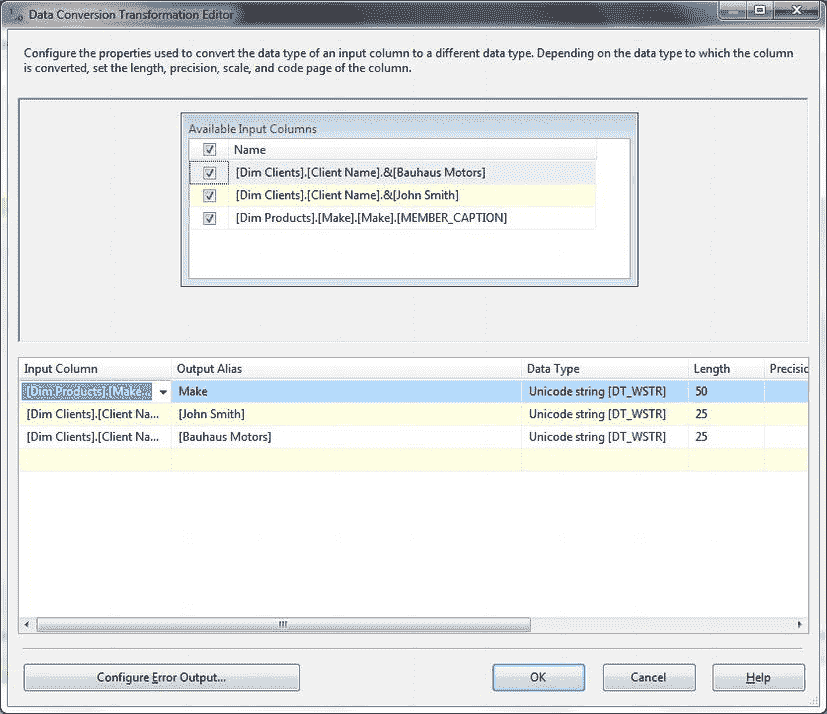
图 6-4. OLAP 源数据的转换

10. 单击“确定”以确认数据转换。
11. 向“数据流”选项卡添加一个 OLEDB 目标，将“数据转换”任务连接到它，然后双击 OLEDB 目标。选择或创建一个 OLEDB 连接管理器，然后单击“新建”以创建目标表。接受表规范，但将名称更改为你喜欢的名称。单击“确定”以确认表创建。
12. 单击“映射”。确保源和目标数据列已连接。单击“确定”关闭对话框。

你现在可以执行包并从 Analysis Services 导入数据。

### 工作原理

尽管听起来有悖直觉，但有时你可能需要将数据从 SQL Server Analysis Services 数据库导回 SQL Server 关系表。这可能是因为

*   你更愿意使用 OLAP 立方体中已经存在的聚合，而不是在 T-SQL 中重新编写不仅更复杂、而且返回结果可能更慢的并行查询。
*   OLAP 立方体包含你无权访问的源的数据——而从 Analysis Services 获取这些数据更快、更容易。
*   SSAS 立方体是企业的“唯一真实版本”，你必须使用它包含的数据。

繁重的工作由 Analysis Services 的 OLEDB 提供程序完成，基于你必须编写的 MDX。MDX 可以如你所愿地简单或复杂。但是，你可能更愿意在 SQL Server Management Studio 中编写和测试 MDX 查询，因为 OLEDB 源查询生成器不会让你构建 MDX。不过，它会解析查询。

除此之外，这是一个相当标准的 SSIS 数据流任务。你至少需要对 OLAP 数据源的连接权限。如果你尝试查看源数据列，或者实际上在数据源任务中执行几乎任何操作时，都会出现警告对话框。只需不予理会即可。有趣的是，SSAS 将所有内容都作为文本返回——因此你需要将所有数字数据转换为适当的数字数据类型。

你需要确保你使用的 MDX 返回二维表格数据，仅包含单列和行标题。毕竟，你是将多维数据导入“二维”SQL 数据库。你还可以使用 MDX 为列起别名，如配方 6-3 所示，这可能值得付出额外的努力。

### 提示、技巧和陷阱

*   如果你使用的是早期版本的 SQL Server 而不是 `Native OLEDB\Microsoft OLE DB Provider for Analysis Services 11.0`，则对于 SQL Server 2008 选择提供程序版本 `10.0`，对于 SQL Server 2005 选择版本 `9.0`。
*   如果在旧版本的 Analysis Services 中测试连接时出错，请在步骤 4 中单击“全部”，并将 `Format = Tabular` 添加到“扩展属性”中。
*   值得注意的是，OLEDB 源任务中显示为 `SQL Command Text` 的地方，实际上意味着“传递查询”。你可以发送任何源服务器期望且能够处理的方言编写的查询。这里*必须*是 MDX。

## 定期从 Analysis Services 立方体导入数据

### 问题

你想使用 T-SQL 命令定期从 Analysis Services 数据库导入数据，但又不想开发结构化的 ETL 过程。

### 解决方案

设置一个链接服务器以连接到 Analysis Services 数据库，并以表格格式导入数据。你可以按如下方式操作。

1.  按照配方 4-7 中的描述，配置 `MSOLAP` 提供程序以允许进程内连接。
2.  展开“服务器对象”，然后展开“链接服务器”，接着展开“提供程序”。右键单击 `MSOLAP`。
3.  选择“属性”，然后选择“允许进程内”，如 图 6-5 所示。
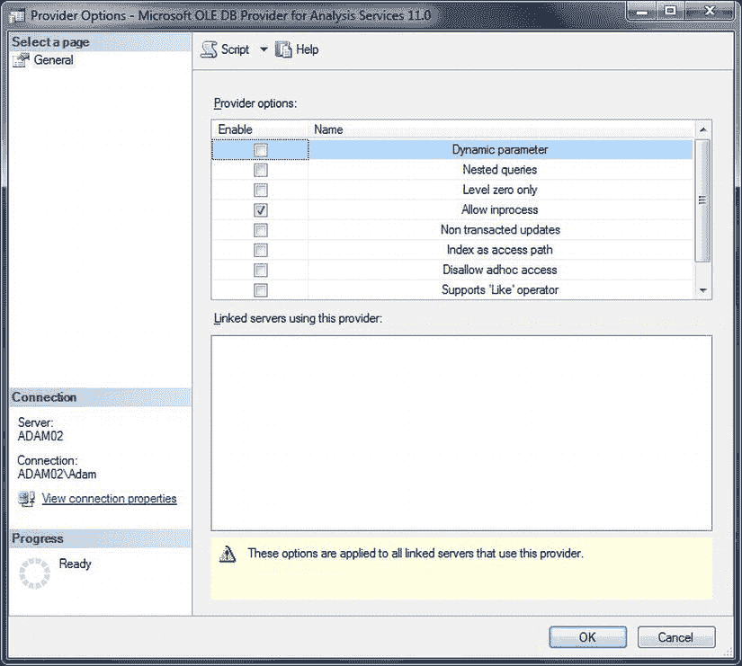
图 6-5. OLAP 链接服务器提供程序

4.  单击“确定”。
5.  从 SQL Server Management Studio，运行以下 T-SQL 代码段以创建链接服务器 (`C:\SQL2012DIRecipes\CH06\OLAPLinkedServer.Sql`)。你需要为你自己的 Analysis Services 服务器指定 `@datasrc` 参数：
    ```sql
    EXEC master.dbo.sp_addlinkedserver
     @server = N'CarSales',
     @srvproduct=N'MSOLAP',
     @provider=N'MSOLAP',
     @datasrc=N'ADAM02',
     @catalog=N'CarSales_OLAP';
    ```
6.  运行 `OPENQUERY` 查询以提取数据 (`C:\SQL2012DIRecipes\CH06\OLAPOpenQuery.Sql`)：
    ```sql
    SELECT * FROM OPENQUERY(CarSales,
     'SELECT
     NON EMPTY([Dim Clients].[Client Name].[Client Name]) ON COLUMNS
     ,EXCEPT([Dim Products].[Make].[Make], [Dim Products].[Make].UNKNOWNMEMBER) ON ROWS
     FROM [Car Sales DW]
     WHERE [Measures].[Cost Price]' );
    ```
    你应该会看到所选 SSAS 数据的表格表示形式。你可以将其用作 `INSERT INTO` 或 `SELECT . . . INTO` 语句的一部分，以将数据加载到 SQL Server 中。

### 工作原理

如果你希望按需访问 Analysis Services 数据库中的数据，而不必运行 SSIS 包，你也可以设置一个到 SSAS 的链接服务器连接。然后可以通过 T-SQL 使用 `OPENQUERY` 发送 MDX 编写的传递查询来查询此链接服务器。你必须使用 MDX，因为标准的四部分 T-SQL 表示法查询将不起作用。

你可以使用 T-SQL 重命名输出列并转换数据类型。诀窍是注意 MDX 查询返回的确切列名，并将其用双引号括起来，如配方 6-3 所示。

### 提示、技巧和陷阱

*   请注意，你赋予链接服务器的名称（本例中为 `OLAP`）将用于 `OPENQUERY` 命令中。定义链接服务器时，提供程序必须是 `MSOLAP`，数据源是你的 Analysis Services 服务器，目录是你希望查询的数据库。
*   如果使用 SQL Server 安全性（登录名和密码）登录到 SQL Server，SQL Server 会将 SQL Server 服务启动帐户的凭据发送给 OLAP 服务进行身份验证。如果使用 SQL Server 身份验证，则将 SQL Server 服务配置为在本地或域用户帐户下运行，而不是使用 SYSTEM 帐户。


### 6-3. 按需查询 OLAP 数据源

#### 问题
你希望查询 OLAP 数据源，以便将 SSAS 数据按需加载到 SQL Server 中。

#### 解决方案
使用 T-SQL 中的 `OPENROWSET` 命令向 Analysis Services 多维数据集发送传递查询，并将返回的数据插入 SQL Server。

1.  使用以下 DDL 创建目标表（`C:\SQL2012DIRecipes\CH06\tblSsalesAnalysis.Sql`）：
    ```sql
    CREATE TABLE dbo.SalesAnalysis
    (
     MakeOfCar NVARCHAR(150)
     ,BauhausMotors NVARCHAR(150)
     ,JohnSmith NVARCHAR(150)
    );
    GO
    ```
2.  使用如下所示的 T-SQL 查询 OLAP 多维数据集，其中使用 MDX 作为传递查询（`C:\SQL2012DIRecipes\CH06\PassthroughOLAP.Sql`）：
    ```sql
    INSERT INTO dbo.SalesAnalysis (MakeOfCar, BauhausMotors, JohnSmith)
        SELECT OLP."[Dim Products].[Make].[Make].[MEMBER_CAPTION]" AS MakeOfCar
    	,"[Dim Clients].[Client Name].&[Bauhaus Motors]" AS [Bauhaus Motors]
    	,"[Dim Clients].[Client Name].&[John Smith]" AS [John Smith]
        FROM OPENROWSET('MSOLAP','DATASOURCE = ADAM02; Initial Catalog =  CarSalesCube;',
    	'SELECT NONEMPTY([Dim Clients].[Client Name].Children) ON COLUMNS
    	,NONEMPTY([Dim Products].[Make].children) ON ROWS
    	FROM [Car Sales DW]
    	WHERE [Measures].[Cost Price]') AS OLP;
    ```

#### 工作原理
如果你的需求只是临时从 Analysis Services 多维数据集获取数据，且不想设置链接服务器的麻烦，那么你可以如上所述使用 `OPENROWSET` 命令查询 OLAP 数据源。再次强调，因为这是传递查询，所以必须使用 MDX。需要注意的是，在 T-SQL 内部使用 MDX 可能会产生令人意外的结果。例如，如果存在层次结构，则每个层次级别都会产生一个额外的列。你可以像上一个配方中描述的那样，重命名输出列并转换数据类型。你需要在提供程序连接字符串中为 `DATASOURCE` 指定你自己的 Analysis Services 服务器。

### 6-4. 将图像和文档加载到 SQL Server 表中

#### 问题
你希望使用 T-SQL 导入图像和文档，并将它们存储在 SQL Server 表中。

#### 解决方案
使用 T-SQL 中的 `OPENROWSET(BULK)`。它从文件系统中获取图像和文档文件，并将它们作为二进制对象存储在 SQL Server 表中。

将文件加载到 SQL Server 表中需要你执行以下步骤。

1.  创建以下表结构（`C:\SQL2012DIRecipes\CH06\tblDocuBlobs.Sql`）：
    ```sql
    CREATE TABLE CarSales_Staging.dbo.DocuBlobs(
     ID int IDENTITY(1,1) NOT NULL,
     ExternalFileName nvarchar(255) NULL,
     FileData varbinary(max) NULL,
     FileType char(10) NULL,
     ExternalFileDirectory nvarchar(255) NULL
     ) ;
    GO
    ```
2.  运行以下 T-SQL（`C:\SQL2012DIRecipes\CH06\InsertDocuBlobs.Sql`）：
    ```sql
    INSERT INTO CarSales_Staging.dbo.DocuBlobs
     (
     ExternalFileName,
     ExternalFileDirectory,
     FileData,
     FileType
     )
    SELECT
     'MyWordDocument.doc',
     'C:\SQL2012DIRecipes\CH06\',
     (SELECT * FROM OPENROWSET(BULK 'C:\SQL2012DIRecipes\CH06\MyWordDocument.doc', SINGLE_BLOB) AS MyDoc ),
     'Doc' ;
    ```

#### 工作原理
有时你可能希望将文档作为二进制大对象导入 SQL Server 并存储在数据库中。这也涵盖了你已创建 `FILESTREAM` 或 `FILETABLE` 列来在文件系统中存储 BLOB，同时保持 SQL Server 提供的事务控制的情况。为此，本配方中的 SQL 代码段将 BLOB 插入到 `VARBINARY(MAX)` 列中。

要使此配方生效，目标表必须具有以下列：
*   一个 `VARBINARY(MAX)` 列来存储文档
*   一个唯一的 ID 列（全文索引的先决条件）
*   一个文档类型列（对 BLOB 进行全文索引的必需条件）
*   存储二进制文件的列（本例中为 `FileData`）可以是 `FILESTREAM` 或 `FILETABLE` 列，因为这些列由 SQL Server 透明处理

那么，为什么需要将文档或图像存储在 SQL Server 中呢？一些想法包括：
*   存储文档的规范版本，可能防止用户干预（例如意外删除）
*   能够使用全文搜索在特定文件格式（Word、Excel、PowerPoint、HTML、PDF 等）中查找数据
*   能够维护文件的多个版本

#### 提示、技巧和注意事项
*   你只能插入 BLOB 本身——目录、文件名和文档类型不是必需的。我仅假设你正在 SQL Server 中存储文档。
*   当然，也有通过前端使用 ADO.NET 导入 BLOB 的方法。然而，这些方法超出了本书的范围。
*   如果你要将文件导入到 `FILESTREAM` 或 `FILETABLE` 列中，那么 `OPENROWSET (BULK)` 可以毫无问题地加载大于 2 千兆字节的文件——前提是你没有将它们传递给 T-SQL 中的 `VARBINARY(MAX)` 变量。

### 6-5. 将多个文件导入 SQL Server 表

#### 问题
你希望从文件系统导入多个文件到 SQL Server，并将它们存储在数据库中。

#### 解决方案
使用动态 SQL 处理文件列表，并将它们加载到 SQL Server 表中。以下展示了处理数十、数百或数千个文件的一种方法。

1.  创建一个源文档引用表，如下所示（`C:\SQL2012DIRecipes\CH06\tblDocumentList.Sql`）：
    ```sql
    CREATE TABLE CarSales_Staging.dbo.DocumentList
     (
     ID int IDENTITY(1,1) NOT NULL,
     ExternalFileName nvarchar(255) NULL,
     FileType char(10) NULL,
     ExternalFileDirectory nvarchar(255) NULL
     );
    GO
    ```
2.  将要加载的文件列表添加到你刚刚创建的表中。这必须包括文件名、扩展名和文件的完整路径。
3.  使用以下 T-SQL 获取此文档列表并将它们加载到 SQL Server 表中（`C:\SQL2012DIRecipes\CH06\DocumentLoad.Sql`）：
    ```sql
    DECLARE @DocName                      NVARCHAR(255)
    DECLARE @DocFullName                  NVARCHAR(255)
    DECLARE @DocPath                      NVARCHAR(255)
    DECLARE @DocType                      CHAR(10)

    DECLARE @SQL                          NVARCHAR(4000)
    DECLARE @SQLPARAMETERS                NVARCHAR(4000)

    DECLARE DOCLOAD_CUR CURSOR
    FOR
    SELECT  ExternalFileName, ExternalFileDirectory, FileType
    FROM CarSales_Staging.dbo.DocumentList

    OPEN DOCLOAD_CUR

    FETCH NEXT FROM DOCLOAD_CUR INTO @DocName, @DocPath, @DocType

    WHILE @@FETCH_STATUS =  0
    BEGIN
    SET @DocFullName =  @DocPath +  '\' +  @DocName

    SET @SQL =
    '
    INSERT INTO dbo.DocuBlobs
    (
    ExternalFileName,
    ExternalFileDirectory,
    FileData,
    FileType
    )
    SELECT '
    + '''' +  @DocName +  ''','
    + '''' +  @DocPath +  ''','
    + '(SELECT * FROM OPENROWSET(BULK ''' +  @DocFullName +  ''', SINGLE_BLOB) AS MyDoc ),'
    + '''' +  @DocType +  ''''

    EXEC (@SQL)
    FETCH NEXT FROM DOCLOAD_CUR INTO @DocName, @DocPath, @DocType

    END

    CLOSE DOCLOAD_CUR
    DEALLOCATE DOCLOAD_CUR
    ```

#### 工作原理
这个配方使用了一个包含文件名、目录和文件类型的表，你（费力地）收集了这些信息作为加载数百个文件所需的数据源。


一个游标遍历此表中的每条记录，并将文件名、文件类型和路径传递给变量，然后由 `OPENROWSET` 用来加载每个文件。因此，在此向所有 SQL 纯粹主义者致歉，因我竟敢使用游标，但以下代码能相当快速且非常轻松地将数百个文档导入 SQL Server！

该代码基于一个事实：`OPENROWSET` 无法将变量作为文件引用——因此整个代码片段必须编写为动态 SQL。似乎没有办法使用 `sp_executesql` 来运行 `OPENROWSET`，因为此命令不接受变量作为文档参数。因此，您必须使用临时动态 SQL——并请注意 SQL 字符串中所有带引号的元素。

我发现游标是处理数百个文档最简单的方法。是的，我知道，这通常被认为是糟糕的编程实践——但在这种特殊情况下，它恰恰是证明规则的例外。它的简洁性确实非常出色。而且我必须承认，我从未见过需要一次加载超过几百个文档的情况，无论如何这都不会花太长时间，所以游标无可否认的缓慢不太可能成为问题。

## 提示、技巧和陷阱

*   我没有在此代码片段中添加错误捕获代码。您可能需要捕获诸如文档缺失等错误。
*   除非您使用 `FILESTREAM` 或 `FILETABLE`，否则任何文档都不能超过 2 GB 大小。有关配置这些的更多信息，请查阅联机丛书 (Books On Line)。

## 6-6. 定期将文件导入 SQL Server

### 问题

您希望作为结构化 ETL 过程的一部分，定期将文档或图像文件导入 SQL Server。

### 解决方案

使用 SSIS 将文件从文件系统加载到 SQL Server 表中作为二进制对象。

1.  如果尚未创建，请创建前一个方法中步骤 1 所描述的表 (`CarSales_Staging.dbo.DocumentList`)。
2.  使用以下 T-SQL 创建一个名为 `pr_LoadBLOBsFromSSIS` 的存储过程 (`C:\SQL2012DIRecipes\CH06\pr_LoadBlobsFromSSIS.Sql`)：
    ```
    CREATE PROCEDURE CarSales_Staging.dbo.pr_LoadBLOBsFromSSIS
     (
     @DocName NVARCHAR(255),
     @DocPath NVARCHAR(255),
     @DocFullName NVARCHAR(255),
     @DocType CHAR(3)
     )
    
     AS
    
     DECLARE @SQL NVARCHAR(4000)
     DECLARE @SQLPARAMETERS VARCHAR(8000)
    
     SET @SQL =
     '
     INSERT INTO dbo.DocumentList
     (
     ExternalFileName,
     ExternalFileDirectory,
     FileData,
     FileType
     )
    
     SELECT '
     + '''' +  @DocName +  ''',' 
     + '''' +  @DocPath +  ''',' 
     + '(SELECT * FROM OPENROWSET(BULK ''' +  @DocFullName +  ''', SINGLE_BLOB) AS MyDoc ),'
     + '''' +  @DocType +  ''''
    
     EXEC (@SQL)
    ```
3.  创建一个新的 SSIS 包。
4.  向您的包中添加以下变量：
    | 变量 | 类型 |
    | --- | --- |
    | `DocName` | 字符串 |
    | `DocFullName` | 字符串 |
    | `DocPath` | 字符串 |
    | `DocType` | 字符串 |
5.  在控制流窗格中添加一个 Foreach 循环容器。将其命名为 **收集目录中的所有文档**。双击进行编辑。点击左侧的“集合”。
6.  选择 Foreach 文件枚举器作为 Foreach 循环编辑器的类型。浏览或输入包含您希望加载的文档的文件夹，以及文件筛选器（在此示例中为 `*.Docx`）。确保将文件类型选择为“完全限定”。您最终应得到一个类似 图 6-6 的对话框。

    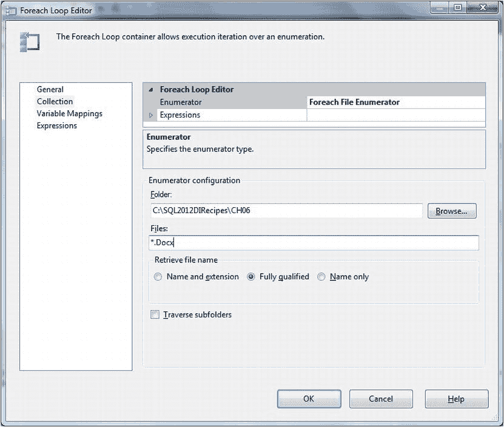
    图 6-6. 配置 Foreach 循环以加载多个文件

7.  点击左侧的“变量映射”，并选择 `User::DocFullName` 变量作为 SSIS 在将文件加载到 SQL Server 时用于保存文件名的变量。

    对话框应如 图 6-7 所示。
    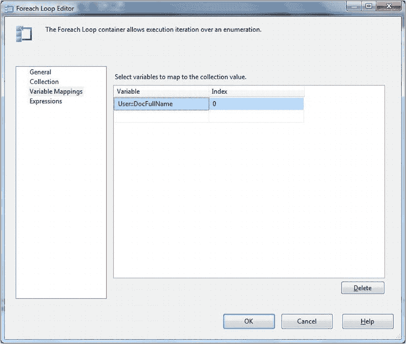
    图 6-7. 为多文件加载设置变量

8.  点击“确定”以确认 Foreach 循环容器的参数。
9.  在 Foreach 循环容器内添加一个脚本任务。将脚本任务命名为 **获取文件和路径元素**。双击进行编辑，然后点击左侧的“脚本”。在右侧窗格中，输入以下内容：
    | 变量类型 | 变量 |
    | --- | --- |
    | `ReadOnlyVariables` | `DocFullName` |
    | `ReadWriteVariables` | `DocName` |
    | `ReadWriteVariables` | `DocPath` |
    | `ReadWriteVariables` | `DocType` |
    您应该看到类似 图 6-8 的界面。
    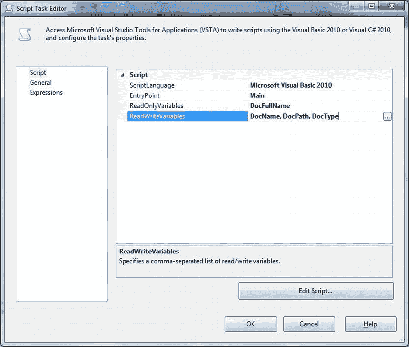
    图 6-8. 用于多文件加载的脚本任务

10. 选择 Microsoft Visual Basic 2010 作为脚本语言。点击“编辑脚本”。
11. 在 Imports 区域中添加以下行：
    ```
    Imports System.IO
    ```
12. 用以下代码替换 Main 方法 (`C:\SQL2012DIRecipes\CH06\DocuBlobs.vb`)：
    ```
    Public Sub Main()
            Dim sDocName As String
            sDocName = Dts.Variables("DocFullName").Value.ToString
            Dts.Variables("DocType").Value = Right(Path.GetExtension(sDocName), 3)
            Dts.Variables("DocPath").Value = Path.GetDirectoryName(sDocName)
            Dts.Variables("DocName").Value = Path.GetFileName(sDocName)
            Dts.TaskResult = ScriptResults.Success
    End Sub
    ```
13. 关闭脚本编辑器。点击“确定”关闭脚本任务。
14. 在 Foreach 循环容器内，在脚本任务下方添加一个执行 SQL 任务，并将脚本任务连接到 SQL 任务。
15. 双击 SQL 任务进行编辑。选择 ADO.NET 作为连接类型。创建或选择指向您已创建存储过程的数据库的 .NET 连接 (`CarSales_Staging`)，并选择 `dbo.DocumentList` 作为目标表。
16. 点击左侧的“参数映射”。添加四个参数，配置如下：
    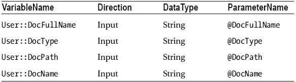
    这将显示如 图 6-9 所示的对话框。
    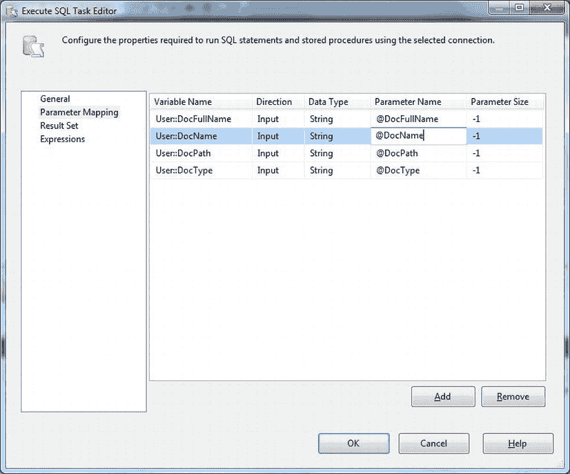
    图 6-9. 为 `pr_LoadBLOBsFromSSIS` 存储过程设置参数

17. 将 `IsQueryStoredProcedure` 设置为 True。
18. 向 SQLStatement 中添加以下内容：**pr_LoadBLOBsFromSSIS**。点击“确定”确认。最终生成的 SSIS 包应大致如 图 6-10 所示。
    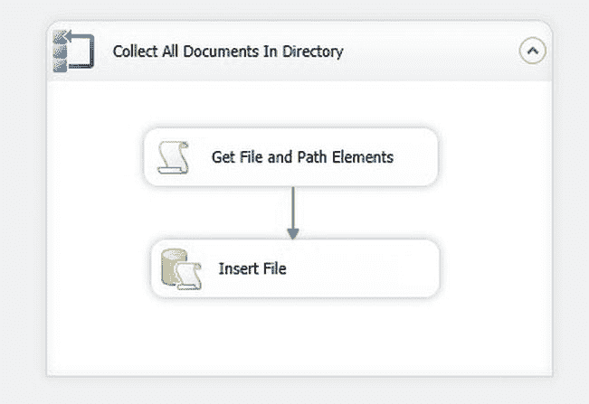
    图 6-10. 完成的 SSIS 包

您现在可以运行 SSIS 包，它将把所有指定类型的文件导入到 SQL Server 表中。

## 工作原理

使用 SSIS 作为结构化 ETL 过程的一部分来将文件加载到数据库中，可以带来几个有用的功能，包括：

*   遍历目录以查找文件
*   使用 .NET 字符串函数进行文件名操作（如果需要）

考虑到需要使用动态 SQL 以及所需的多个变量，我发现将 T-SQL 以存储过程的形式呈现给 SSIS，并从 SSIS 调用该存储过程传入所需变量（文档名称、类型、路径和待加载的文件）会更容易。这是对前一个方法中所用代码的扩展。


