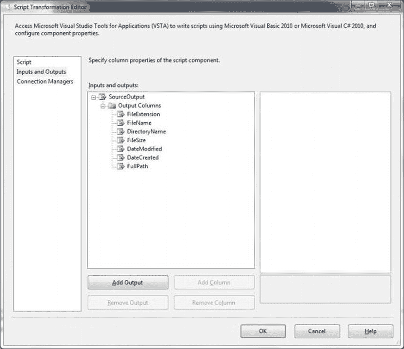
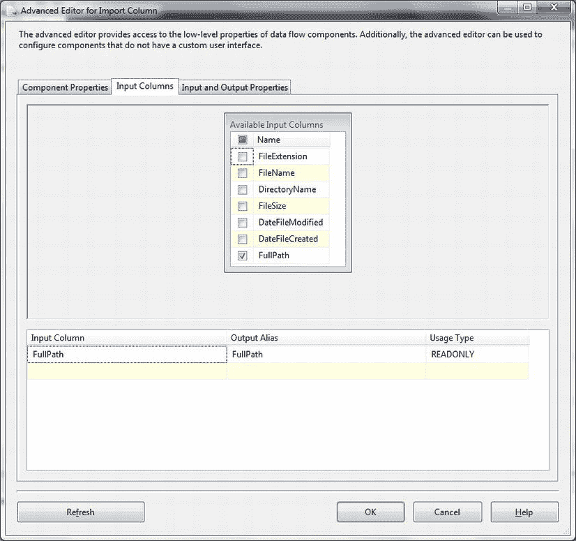
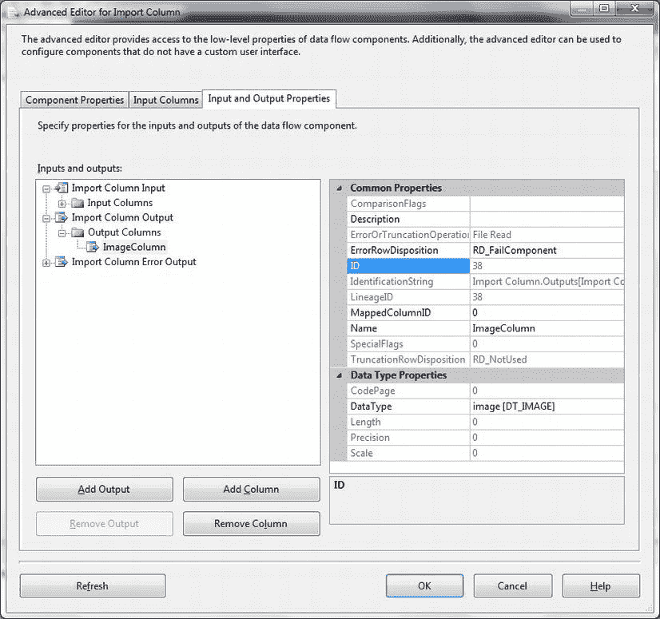
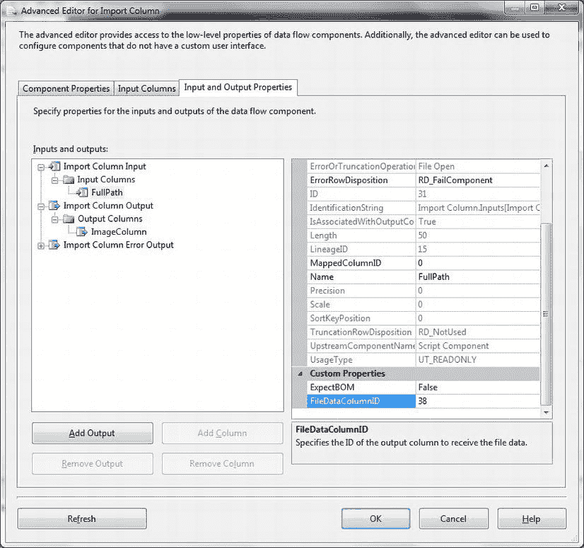
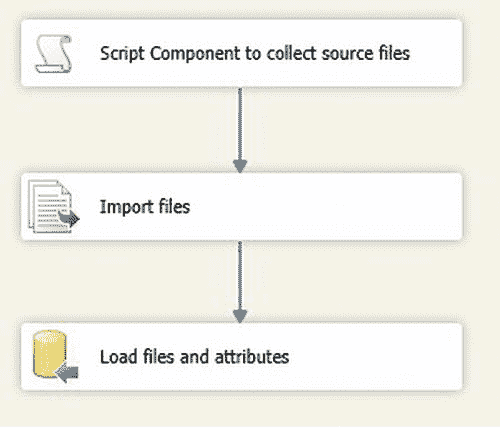

# 6-7. 将文件及其属性导入 SQL Server

## 问题
你想使用 SSIS 将文件及其属性导入并存储到 SQL Server 表中，作为高效文件管理的一个步骤。

## 解决方案
通过配置一个导入列任务来加载文件，然后添加一个脚本任务来添加所需的文件元数据，从而使用 SSIS 完成此操作。你可以按如下步骤进行。

1.  创建以下目标表 (`C:\SQL2012DIRecipes\CH06\tblCarPhotos.Sql`)：
    ```sql
    CREATE TABLE CarSales_Staging.dbo.CarPhotos
    (
        ID int IDENTITY(1,1) NOT NULL,
        FileName varchar(50) NULL,
        FileExtension varchar(10) NULL,
        DirectoryName varchar(150) NULL,
        FileSize bigint NULL,
        DateFileCreated datetime2(7) NULL,
        DateFileModified datetime2(7) NULL,
        ItemImage varbinary(max) NULL,
        UNIQUE NONCLUSTERED (ID ASC )
    );
    GO
    ```
2.  创建一个新的 SSIS 包，并添加一个新的数据流任务。单击“数据流”选项卡以编辑该数据流任务。
3.  为目标数据库 (`CarSales_Staging`) 添加一个新的 OLEDB 连接管理器，并将其命名为 `CarSales_Staging_OLEDB`。
4.  在数据流窗格中添加一个脚本组件。出现提示时，将其设置为“源”。将其命名为 `Script Component to collect source files`。
5.  双击脚本组件进行编辑。将脚本语言设置为 Microsoft Visual Basic 2010。
6.  单击左侧的“输入和输出”。在“输入输出列”列表视图中选择 Output 0，并将其重命名为 `SourceOutput`。
7.  在“输入输出列”列表视图中展开 `SourceOutput`，然后展开“输出列”。添加以下列：
    | 列名 | 列类型 |
    | --- | --- |
    | `FileExtension` | 字符串 - 10 |
    | `FileName` | 字符串 - 50 |
    | `DirectoryName` | 字符串 - 150 |
    | `FileSize` | 8 字节有符号整数 |
    | `DateModified` | 日期 |
    | `DateCreated` | 日期 |
    | `FullPath` | 字符串 - 150 |

    结果应类似于 图 6-11。

    
    图 6-11. 源列定义

8.  在 Imports 区域中添加以下行：
    ```vb
    Imports System.IO
    ```
9.  单击左侧的“脚本”，然后单击“编辑脚本”。用以下内容替换 `CreateNewOutputRows` 方法 (`C:\SQL2012DIRecipes\CH06\FileAttributes.vb`)：
    ```vb
    Public Overrides Sub CreateNewOutputRows()
        Dim DrInfo As New IO.DirectoryInfo("C:\SQL2012DIRecipes\CH06")
        Dim fInfo As IO.FileInfo() = DrInfo.GetFiles("*.jpg")

        For Each FI In fInfo
            SourceOutputBuffer.AddRow()
            SourceOutputBuffer.FullPath = FI.FullName
            SourceOutputBuffer.FileName = FI.Name
            SourceOutputBuffer.FileExtension = FI.Extension
            SourceOutputBuffer.DirectoryName = FI.DirectoryName
            SourceOutputBuffer.FileSize = FI.Length
            SourceOutputBuffer.DateCreated = File.GetCreationTime(FI.FullName)
            SourceOutputBuffer.DateModified = File.GetLastWriteTime(FI.FullName)
        Next
    End Sub
    ```
10. 关闭脚本窗口。单击“确定”。
11. 在数据流窗格中添加一个导入列任务，并将脚本任务连接到它。将其命名为 `Import Files`，然后双击进行编辑。
12. 选择“输入列”选项卡，然后选择 `FullPath`。这将向 SSIS 指示包含文件位置的列。对话框应类似于 图 6-12。
    
    图 6-12. 指定包含文件路径的列
13. 选择“导入和输出属性”选项卡。展开“输入列输出”节点，然后单击“添加列”。将新列重命名为 `ImageColumn`。
14. 选择 `ImageColumn`。记下该列的 ID（这是内部谱系 ID）。对话框应类似于 图 6-13。
    
    图 6-13. 文件的输出列
15. 展开“导入列输入”节点，然后展开“输入列”。单击“Full Path”。在 `FileDataColumnID` 中输入你刚刚记下的 ID。对话框应类似于 图 6-14。
    
    图 6-14. 设置 `FileDataColumnID`
16. 单击“确定”确认。
17. 在数据流窗格中添加一个 OLEDB 目标。将其命名为 `Load files and attributes`。将导入列任务连接到它。双击进行配置。选择你在步骤 3 中配置的 OLEDB 连接管理器 (`CarSales_Staging_OLEDB`)。将数据访问模式选择为“表或视图”，然后选择你创建的表（在此示例中为 `dbo.CarPhotos`）。
18. 映射列，如下所示：
    | 源列 | 目标列 |
    | --- | --- |
    | `FileName` | `FileName` |
    | `FileExtension` | `FileExtension` |
    | `DirectoryName` | `DirectoryName` |
    | `FileSize` | `FileSize` |
    | `FileCreated` | `DateFileCreated` |
    | `FileModified` | `DateFileModified` |
    | `ImageColumn` | `ItemImage` |
19. 单击“确定”确认。最终的包将如 图 6-15 所示。
    
    图 6-15. 用于导入带属性的多个文件的已完成 SSIS 包

你现在可以运行该包了。源目录中所有具有所选扩展名的文件都将被加载到 SQL Server 中。

## 工作原理
SSIS 还有一种“原生”方式将文件（作为文本或二进制文件）导入 SQL Server。这种方法避免了你必须使用存储过程并向其传递变量。它使用一个名为“导入列”任务的 SSIS 转换。此处使用的过程加载指定目录中的每个文件，并收集各种属性并将其写入同一张表。

然而，在我看来，用它来导入一两个文件太费功夫了，这种方法只有在处理数百甚至数千个文件时才能真正发挥作用。因此，我向你展示了一种使用导入列任务加载整个目录中二进制文件的方法。它展示了如何不仅将 SSIS 脚本任务用作数据源，还作为利用 `.Net IO` 类的一种方式。


## NET IO

`NET IO` 类用于获取每个源文件的所有相关文件属性，这些属性可以与二进制数据一起存储在 SQL Server 表中。值得注意的是，这种方法并非没有缺点，主要有以下几点：

*   它很慢——比前面描述的 T-SQL 方法慢几个数量级。
*   它需要大量的服务器资源——特别是内存——并可能导致基于内存的错误。
*   每个文件限制为最大 2 吉字节。这是因为它使用了 `DT_IMAGE` SSIS 数据类型，这是一个最大大小为 2ˆ31^(–1) (2,147,483,647) 字节的二进制值。

#### 提示、技巧与陷阱

*   如果你的数据库启用了 `FILESTREAM`，你也可以将 `ItemImage` 列定义为 `FILESTREAM` 列，因为 SSIS 可以像加载到 `VARBINARY(MAX)` 列一样轻松地将文件加载到 `FILESTREAM` 列中。在这种情况下，表的 DDL 将如下所示（假设你已创建了一个名为 `CarSalesFS` 的文件组）（`C:\SQL2012DIRecipes\CH06\CarPhotosFilestream.Sql`）：

```sql
CREATE TABLE dbo.CarPhotosFS
(
     ID int IDENTITY(1,1) NOT NULL,
     ItemID uniqueidentifier ROWGUIDCOL  NOT NULL,
     FileName varchar(50) NULL,
     FileExtension varchar(10) NULL,
     DirectoryName varchar(150) NULL,
     FileSize bigint NULL,
     DateFileCreated datetime2(7) NULL,
     DateFileModified datetime2(7) NULL,
     ItemImage varbinary(max) FILESTREAM  NULL,
 UNIQUE NONCLUSTERED
 (
 ItemID ASC
 )WITH (PAD_INDEX  = OFF, STATISTICS_NORECOMPUTE  = OFF, IGNORE_DUP_KEY = OFF, ALLOW_ROW_LOCKS  = ON, ALLOW_PAGE_LOCKS  = ON) ON PRIMARY
 ) ON PRIMARY FILESTREAM_ON CarSalesFS
```

*   当然，你可以将目录和文件过滤器设置为 SSIS 变量，从而使这个包更加用户友好。

## 6-8. 加载 Visual FoxPro 文件

### 问题
你需要将数据从 Visual FoxPro 文件加载到 SQL Server 中。

### 解决方案
使用 SSIS 和 Visual FoxPro 的 OLEDB 提供程序，作为数据流任务的一部分加载数据。具体步骤如下：

1.  首先，如果你还没有这样做，需要从 Microsoft 网站（目前在 `www.microsoft.com/en-us/download/details.aspx?id=14839`）下载 Visual FoxPro OLEDB 驱动程序。下载后，你需要安装它。然后你将能够使用 `VFPOLEDB.1` 提供程序连接到 FoxPro 数据库文件和数据库。
2.  创建一个新的 SSIS 包，并在控制流窗格上添加一个数据流任务。双击编辑该任务。
3.  在连接管理器选项卡中右键单击，添加一个新的 OLEDB 连接。确保选择 Microsoft OLEDB Provider for Visual FoxPro。输入（或复制粘贴）包含要导入的表的 FoxPro 文件的路径。你应该得到类似 图 6-16 的内容。
4.  确认连接管理器。向数据流窗格添加一个新的 OLEDB 源并编辑它。选择你刚刚创建的连接管理器。从可用数据表列表中选择所需的表——或者输入 SQL 以选择你需要的数据子集。
5.  确认，添加一个 OLEDB 目标，连接这两个任务，并将列映射到目标表（或根据需要创建它）。
6.  你现在可以运行该包并导入你的数据。

### 工作原理
是的，外面仍然有大量的 Visual FoxPro 应用程序——毕竟它是 Microsoft 的产品。事实上，一些商业数据提供商仍然使用它作为标准数据格式。

因此，假设你需要将数据从 Visual FoxPro 获取到 SQL Server 中，至少有我知道的四种方法，包括：

*   OLEDB 链接服务器
*   SSIS over OLEDB
*   SSIS using ODBC
*   Visual FoxPro 升级向导

让我们明确一点。我不会在这里详尽地回顾所有这些方法。对我来说，将数据从 Visual FoxPro 获取到 SQL Server 的最佳和最简单方法是使用 OLEDB 和 SSIS。所以这是我在这个配方中展示的唯一方法。我的推理是，一旦你安装了 Visual FoxPro 提供程序，整个过程就是一个相当标准的 SSIS 导入过程。

如果你愿意，可以使用 ODBC 和 .NET 提供程序（如配方 6-12 中所述），但这比 OLEDB 提供程序设置起来要慢得多且更麻烦。然而，如果你在使用 OLEDB 时遇到无法克服的困难，可能需要使用它。

#### 提示、技巧与陷阱

*   如果你希望使用升级向导，可以在 CodePlex 上找到 `http://vfpx.codeplex.com/releases/view/10224`。
*   有趣的是，安装 `VFPOLEDB.1` 提供程序不会注册它（至少不会允许 SQL Server 创建链接服务器）。网上有（不受支持的）解决方法，但如果你需要一个链接服务器，那么通过 OLEDB 的 ODBC 可能是最安全的解决方案——尽管也是最慢的。

## 6-9. 从 dBase 导入数据

### 问题
你需要将遗留数据从 dBase 文件加载到 SQL Server 中。

### 解决方案
使用 SSIS 和适当配置的 OLEDB 连接管理器，作为 SSIS 数据流的一部分加载 dBase 文件。

dBase 文件可以像这样加载：

1.  将任何超过八个字符的 dBase 数据文件重命名为旧的 DOS 8.3 格式。
2.  创建一个新的 SSIS 包。添加一个数据流任务。
3.  添加一个 OLEDB 连接管理器。将其配置为连接到目标数据库。
4.  对于 dBase 源文件，添加一个 OLEDB 连接管理器。将提供程序设置为 Microsoft Office 12.0 Access Database Engine OLEDB Provider。
5.  将数据库文件名设置为源文件（仅路径）。在此示例中，它是 `C:\SQL2012DIRecipes\CH06\`。
6.  在左侧单击“所有”。将“扩展属性”设置为 `dBase III`、`dBase IV` 或 `dBase 5.0`，具体取决于你使用的 dBase 文件版本。
7.  确认，点击两次“确定”。
8.  添加一个数据流任务。双击进行编辑。
9.  添加一个 OLEDB 源。双击进行编辑。选择与步骤 3 中定义的 OLEDB 连接管理器相对应的 OLEDB 连接管理器。
10. 将数据访问模式设置为“表或视图”。
11. 从表列表中选择 dBase 文件。点击“确定”确认。
12. 添加一个目标 OLEDB 任务。使用步骤 2 中定义的 OLEDB 连接管理器进行配置。将源任务连接到它。运行该包。

### 工作原理
可能是所有数据文件格式中最古老的 dBase，在许多组织中仍然可以找到。考虑到它已经存在了大约三十多年，这很了不起。所以，万一你需要加载 dBase 数据文件，我想向你展示如何操作。我觉得这个配方是不言自明的，因为它本质上是一个标准的数据加载过程——除了一点有趣之处：源数据库文件名是存储 dBase 文件的目录。

#### 提示、技巧与陷阱

*   要正常工作，此配方假定你已如配方 1-1 中所述安装了 ACE（Access Database Engine）驱动程序。如果你在 32 位环境中，那么你可以使用 Jet 提供程序代替 ACE 提供程序（如果你愿意的话）。在 64 位环境中，只有 ACE 提供程序有效，除非你以 32 位模式运行包。
*   确保按照古老的 8.3 格式命名文件，不要包含空格。

## 6-10. 从 Web 服务加载数据

### 问题
你希望作为 ETL 过程的一部分，访问 Web 服务提供程序提供的参考数据。


