# 解决方案

使用 SSIS Web 服务任务来获取 ETL 流程中所需的数据。以下步骤说明了如何查找货币转换数据并将其应用于 SSIS 管道中的数据。

## 创建 WSDL 文件

创建一个空白文件，用于后续下载 WSDL（Web 服务描述语言）。在本例中，该文件名为 `C:\SQL2012DIRecipes\CH06\CurrencyConversion.wsdl`。

## 创建数据库表

在 CarSales_Staging 数据库（`C:\SQL2012DIRecipes\CH06\tblStockInDollars.Sql`）中创建下表：

```sql
CREATE TABLE CarSales_Staging.dbo.StockInDollars
(
 ID bigint NULL,
 Make varchar(50) NULL,
 Marque nvarchar(50) NULL,
 Mileage numeric(32, 4) NULL,
 Cost_PriceGBP numeric(18, 2) NULL,
 Cost_PriceUSD numeric(18, 2) NULL,
 ExchangeRate float NULL
) ;
GO
```

## 创建 SSIS 包和连接

创建一个新的 SSIS 包。
向 SSIS 包中添加以下两个 OLEDB 连接管理器：
- `CarSales_OLEDB`，将其配置为连接到 `CarSales` 数据库。
- `CarSales_Staging_OLEDB`，将其配置为连接到 `CarSales_Staging` 数据库。
右键单击“控制流”窗格，向 SSIS 包添加以下变量：
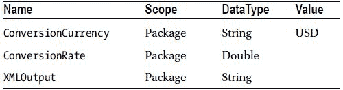
“变量”窗格应如 图 6-17 所示。
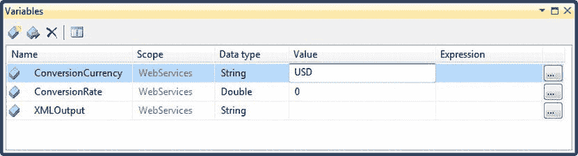
图 6-17. Web 服务任务的变量窗格

## 配置 HTTP 连接管理器

在“连接管理器”选项卡中右键单击。选择“新建连接”。您应该会看到如 图 6-18 所示的对话框。
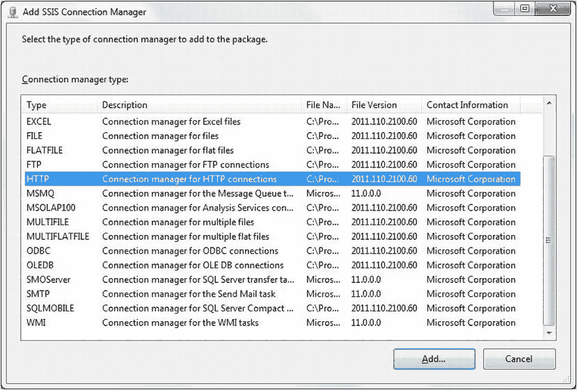
图 6-18. 添加 HTTP 连接管理器

选择 `HTTP`。单击 `添加`。
右键单击该连接管理器。选择 `重命名` 并将其命名为 `WebServicesConnection`。
双击 `WebServicesConnection` 连接管理器。通过在 `服务器 URL` 字段中输入所需的 URL，将 HTTP 连接管理器配置为连接到您将使用的 Web 服务。在本例中，URL 是 `http://www.webservicex.net/CurrencyConvertor.asmx?WSDL`，这是一个用于获取货币转换信息的免费 Web 服务。您应该会看到一个类似 图 6-19 的对话框。
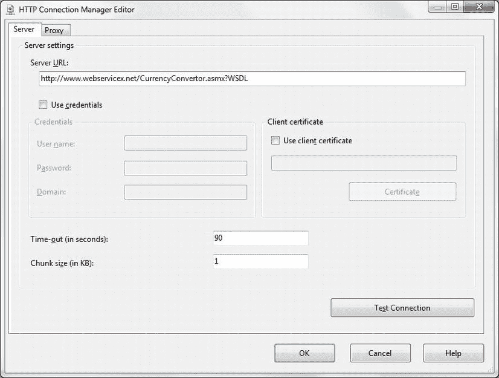
图 6-19. 为 Web 服务配置 HTTP 连接管理器

点击 `确定` 确认您的配置。

## 配置 Web 服务任务

在“控制流”窗格上添加一个 Web 服务任务。将其命名为 `查找美元兑英镑汇率`，然后双击进行编辑。
确保 HTTP 连接设置为您之前创建的 `WebServicesConnection`。
将 WSDL 文件连接到您在步骤 1 中创建的空白文件。在本例中，该文件为 `C:\SQL2012DIRecipes\CH06\CurrencyConversion.wsdl`。确保 `覆盖 WSDL 文件` 设置为 `True`。结果应与 图 6-20 所示接近。
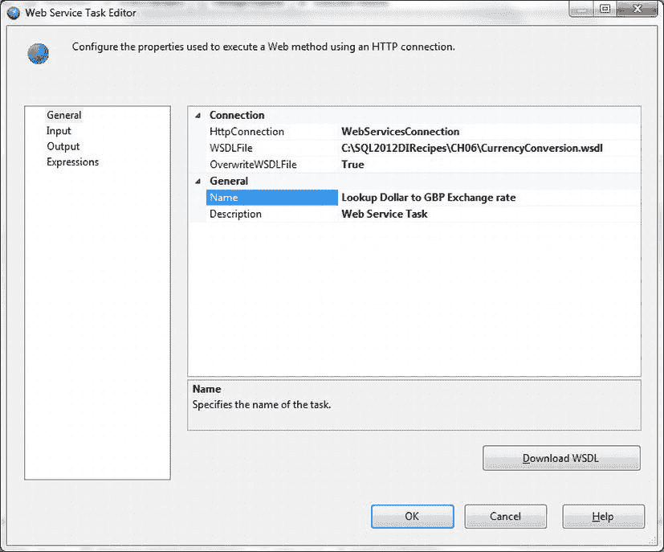
图 6-20. 配置 Web 服务任务的常规窗格

单击 `下载 WSDL` 以获取 WSDL 文件，该文件允许 Web 服务任务使用 Web 服务。
单击 `输入` 以查看输入窗格。选择您将使用的服务（本例中为 `CurrencyConvertor`）和您将应用的方法（本例中为 `ConversionRate`）。
选中 `ToCurrency` 元素的变量，并选择 `User::ConversionCurrency` 变量作为其值。对话框应如 图 6-21 所示。
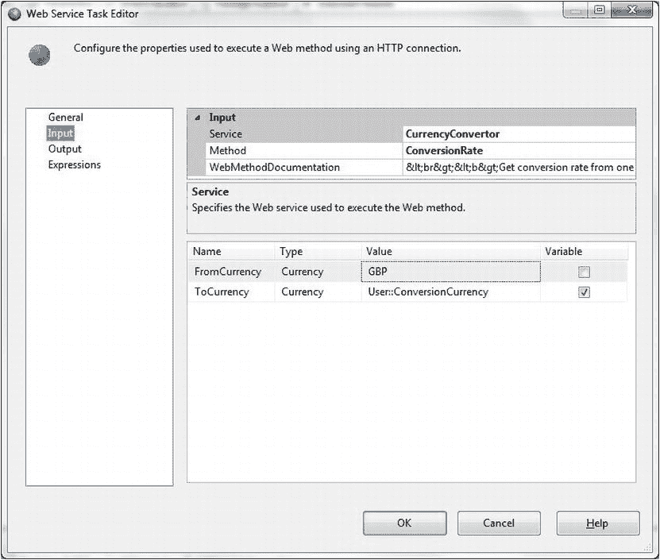
图 6-21. 配置 Web 服务任务的输入窗格

单击 `输出` 以查看输出窗格。选择 `变量` 作为 `输出类型` 并选择变量 `XMLOutput`。对话框应如 图 6-22 所示。
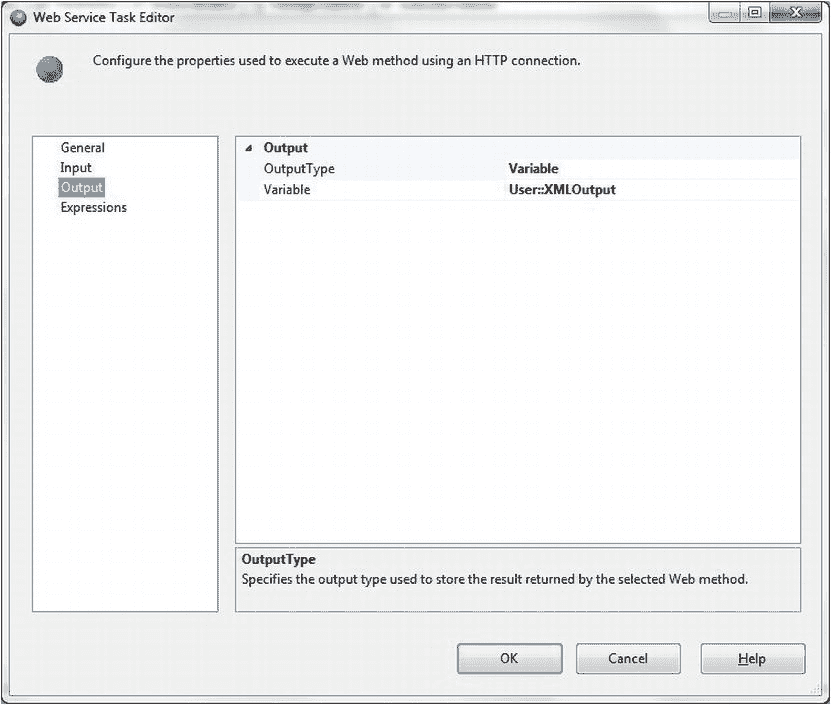
图 6-22. 配置 Web 服务任务的输出窗格

点击 `确定` 确认您的修改。返回到“控制流”窗格。

## 配置脚本任务

在“控制流”窗格中，添加一个脚本任务。将 Web 服务任务连接到它。将其命名为 `提取返回值`。双击进行编辑。将 `XMLOutput` 变量添加为只读变量，将 `ConversionRate` 变量添加为读写变量。对话框应如 图 6-23 所示。
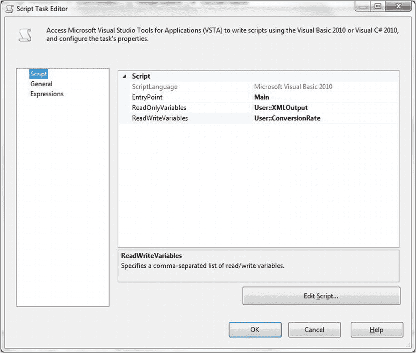
图 6-23. 配置了变量的脚本任务

单击 `编辑脚本`。
在 `Imports` 区域，添加以下内容：
```vbnet
Imports System.Xml        '作为非基本 SSIS 任务的一部分而添加
```
将 `Main` 方法替换为以下内容（`C:\SQL2012DIRecipes\CH06\WebServices.vb`）：
```vbnet
   Public Sub Main()
        Dim xDdoc As New Xml.XmlDocument
        xDdoc.LoadXml(Dts.Variables("XMLOutput").Value.ToString)
        Dts.Variables("ConversionRate").Value = _
            CDbl(xDdoc.SelectSingleNode("double[1]").InnerText)
        Dts.TaskResult = ScriptResults.Success
   End Sub
```
关闭脚本窗口。
单击 `确定` 关闭脚本任务编辑器。

## 配置数据流任务

向“数据流”窗格添加一个数据流任务，并将其命名为 `加载数据并转换价格`。将脚本任务连接到它。“控制流”窗格应如 图 6-24 所示。
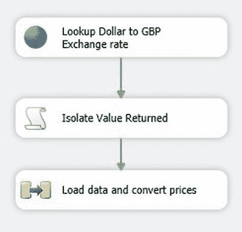
图 6-24. 使用 Web 服务的整体流程

双击以编辑数据流任务。
在“数据流”窗格中，添加一个 OLE DB 源任务。按如下方式配置：
- **连接管理器：** `CarSales_OLEDB`
- **数据访问模式：** `SQL 命令`
- **SQL 命令文本：** `SELECT ID, Make, Marque, Mileage FROM Stock`

添加一个派生列任务，并将 OLE DB 源任务连接到它。添加两个名为 `Cost_PriceUSD` 和 `ExchangeRate` 的新派生列。将 `Cost_PriceUSD` 的表达式设置为 `Cost_Price * @[User::ConversionRate]`，将 `ExchangeRate` 的表达式设置为 `@[User::ConversionRate]`。对话框应如 图 6-25 所示。
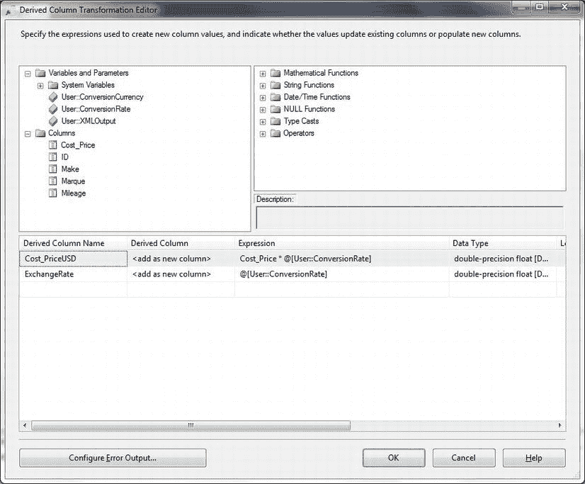
图 6-25. 使用变量计算派生列的派生列转换

单击 `确定` 确认您的修改并返回到“数据流”窗格。
添加一个 OLE DB 目标任务。将派生列任务连接到它，并按如下方式配置：
- **OLE DB 连接管理器：** `CarSales_Staging_OLEDB`
- **数据访问模式：** `表或视图 - 快速加载`
- **表或视图的名称：** `Dbo.StockInDollars`

单击 `映射`。确保源列已映射到目标列。
单击 `确定`。数据流应如 图 6-26 所示。
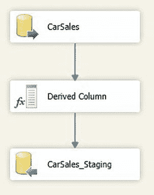
图 6-26.


