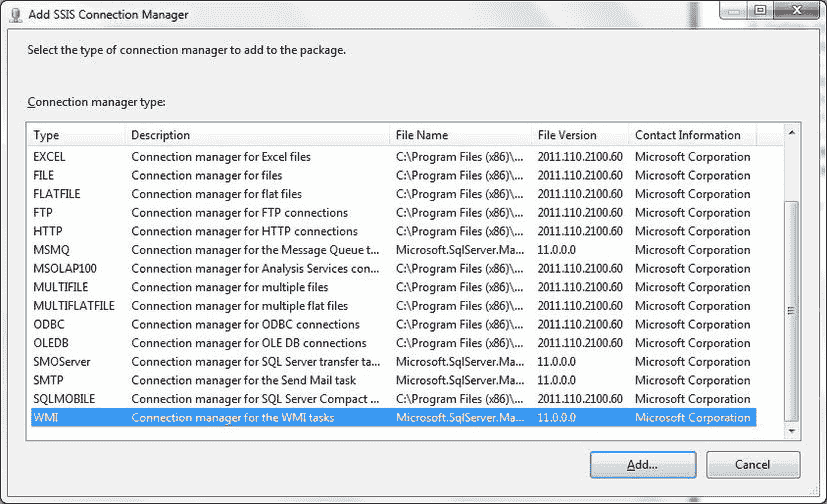
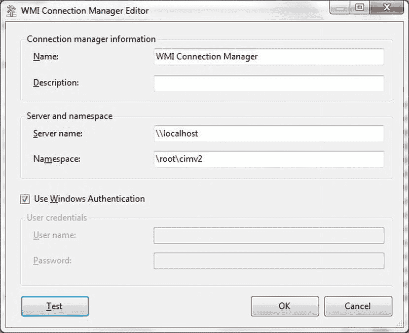
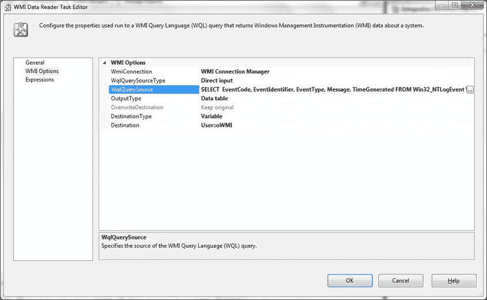
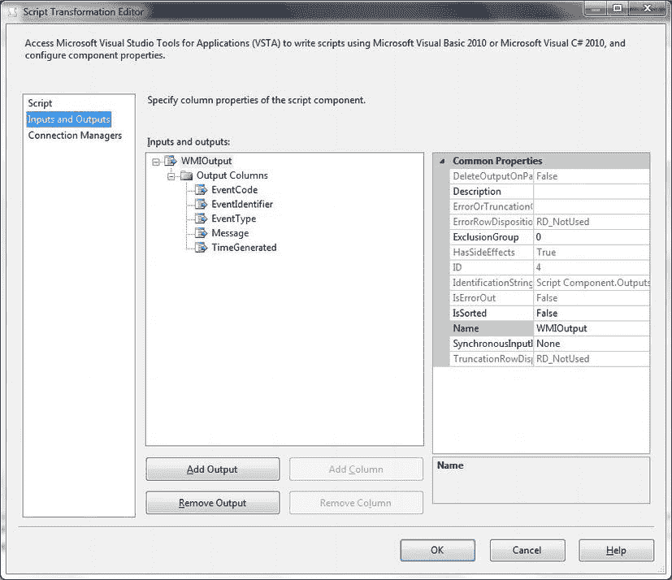

# 6-11. 导入 Windows 管理规范数据

## 问题

你想将 Windows 管理规范 (WMI) 数据导入 SQL Server。

## 解决方案

在标准数据流中使用 SSIS WMI 数据读取器任务作为数据源。以下说明如何操作。

1.  创建一个新的 SSIS 包（如果你希望隔离该包，可以在新的 SSIS 项目中创建）。右键单击“任务”窗格。选择“变量”并添加一个变量（我将其称为 `oWMI`），将其数据类型设置为“对象”。确保其作用域为包级别。
2.  右键单击“连接管理器”选项卡。选择“新建连接”，然后选择“WMI”，如 图 6-27 所示。
    
    图 6-27. 添加 WMI 连接管理器
3.  单击“添加”。输入连接管理器的名称，输入服务器名称（除非默认的 `localhost` 就是你希望查询的），并选中“使用 Windows 身份验证”（同样，除非你需要以特定用户身份登录）。此时应该会出现一个类似 图 6-28 的对话框。
    
    图 6-28. 配置 WMI 连接管理器
4.  单击“测试”以测试连接。单击“确定”确认。关闭对话框。
5.  在“控制流”窗格上添加一个 WMI 数据读取器任务。双击进行编辑。
6.  设置以下选项：

    | 选项                   | 值                             |
    | ---------------------- | ------------------------------ |
    | `WMIConnection`        | WMI 连接管理器                 |
    | `WQLQuerySourceType`   | 直接输入                       |
    | `OutputType`           | 数据表                         |
    | `OverwriteDestination` | 覆盖目标                       |
    | `Destinationtype`      | 变量                           |
    | `Destination`          | `oWMI`（或你选择的变量名）     |

7.  在 `WQLQuerySource` 中，输入以下代码（`C:\SQL2012DIRecipes\CH06\Wmi.wmi`）：

    ```sql
    SELECT      EventCode, EventIdentifier, EventType, Message, TimeGenerated
    FROM        Win32_NTLogEvent
    WHERE       Category = 2
    ```

    此时应该会出现一个类似 图 6-29 的对话框。
    
    图 6-29. 配置 WMI 数据读取器任务
8.  单击“确定”确认创建 WMI 任务。
9.  在“任务”窗格上添加一个数据流任务，并双击进行编辑。在“数据流”窗格中，向工作区添加一个脚本组件。当“选择脚本组件类型”对话框出现时，单击“源”。
10. 单击“确定”。双击脚本组件进行编辑。单击“输入和输出”。然后展开 `Output0`。
11. 单击“输出列”，然后单击“添加列”。
12. 为列命名（第一个将是 `EventCode`），并设置其数据类型（本例中为 8 字节无符号整数）。
13. 对 WQL 查询中存在的每个输出列重复步骤 17 和 18。
14. 此时应该会出现如 图 6-30 所示的对话框。
    
    图 6-30. 为 WMI 源调整脚本任务
15. 单击左侧的“脚本”，然后在“只读变量”中的 `WMIDestination` 处输入你之前使用的变量名——`Destination`。
16. 单击“编辑脚本”。
17. 将 `Imports System.Xml` 指令添加到 Imports 区域。
18. 用以下代码片段替换 `CreateNewOutputRows()` 方法（`C:\SQL2012DIRecipes\CH06\Wmi.vb`）：

    ```vbnet
    Public Overrides Sub CreateNewOutputRows()
        Dim WMIdataTable As System.Data.DataTable
        Dim WMIdataRow As System.Data.DataRow

        WMIdataTable = CType(Me.Variables.oWMI, Data.DataTable)

        For Each WMIdataRow In WMIdataTable.Rows
            Output0Buffer.AddRow()
            Output0Buffer.EventIdentifier = CULng(WMIdataRow.Item("EventIdentifier"))
            Output0Buffer.EventCode = CInt(WMIdataRow.Item("EventCode"))
            Output0Buffer.EventType = CInt(WMIdataRow.Item("EventType"))
            Output0Buffer.Message = WMIdataRow.Item("Message").ToString
            Output0Buffer.TimeGenerated = WMIdataRow.Item("TimeGenerated").ToString
        Next

        Output0Buffer.SetEndOfRowset()
    End Sub
    ```
19. 关闭脚本编辑器，然后单击“确定”关闭脚本任务。
20. 在“数据流”窗格中添加一个 OLE DB 目标，将脚本任务连接到它，然后双击进行编辑。
21. 选择或创建一个 OLE DB 连接管理器。选择“表或视图”作为数据访问模式。单击“新建”让 SSIS 定义一个新表。将表名从 `OLE DB Destination` 更改为更适合你项目的名称，然后单击“确定”。单击“映射”。确保源和目标映射正确。
22. 单击“确定”关闭 OLE DB 目标任务。

