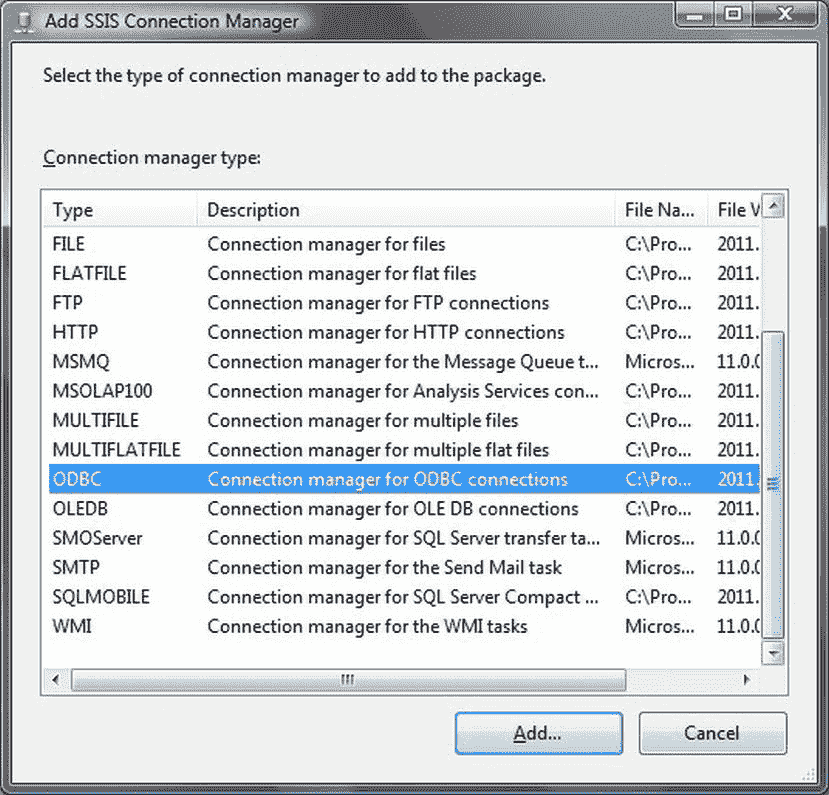
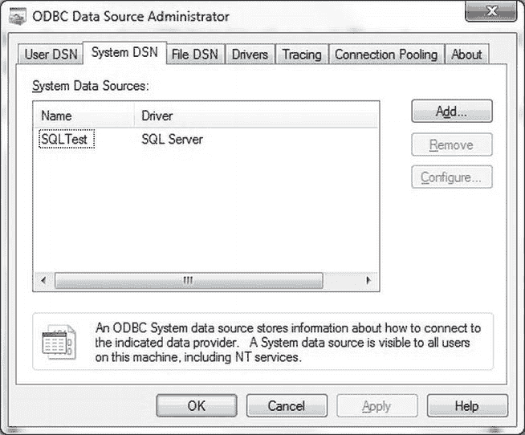
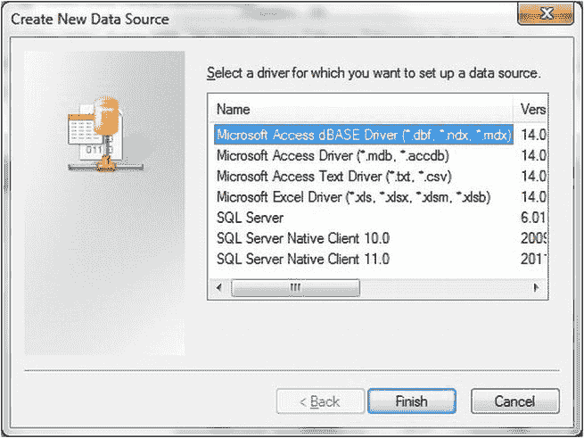
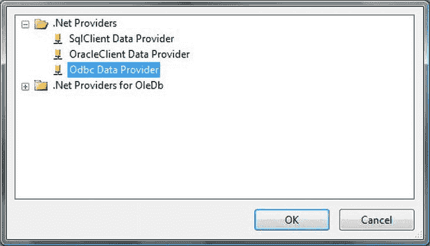
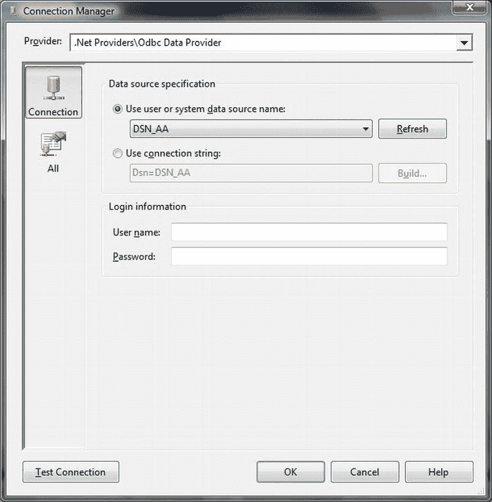

# 通过 ODBC 导入数据

## 问题

您需要导入数据，但没有可用的 OLEDB 提供程序来连接到数据源。

## 解决方案

假设已有可用的驱动程序，请创建并使用一个 ODBC 数据源。

由于 ODBC 并非一个可以完全线性处理的主题，我发现将其使用方式的某些特性看作一系列“迷你配方”会更容易理解，这些配方解释了如何为 SQL Server 配置和使用 ODBC 驱动程序。我总是假设在使用这些配方之前，您已经为您的特定数据源下载并安装了所需的驱动程序。

## SSIS 2012 中的 ODBC

SSIS 2012 让事情变得比之前的版本稍微简单一些，因为您可以直接使用 ODBC 连接管理器，而不必使用 ADO.NET 连接。以下解释了如何使用它。

1.  在一个新的或现有的 SSIS 包中，右键单击“解决方案资源管理器”中的“连接管理器”。选择“新建连接管理器”。
2.  从可用连接管理器列表中选择“ODBC”。该列表应类似于 图 6-31。
    
    图 6-31. 添加 ODBC 连接管理器
3.  单击“添加”。
4.  单击“新建”。然后您必须从可用的 DSN 中选择一个现有 DSN（如下一个迷你配方所述），或者选择“使用连接字符串”并输入用于无 DSN 连接的相应 ODBC 连接字符串。
5.  单击“确定”完成配置。

生成 ODBC 连接字符串的方法在本配方的最后一个迷你配方中描述。

## 配置 ODBC DSN

配置 ODBC DSN 的标准方法如下：

1.  单击“开始”菜单  “控制面板”  “管理工具”  “数据源 (ODBC)”。您可能需要授予 Windows 运行它的权限！
2.  选择“系统 DSN”。“ODBC 数据源管理器”对话框应类似于 图 6-32。
    
    图 6-32. ODBC 数据源管理器
3.  单击“添加”。从可用的（并且根据定义已安装在您的服务器上的）数据源中选择您想要连接的数据源。您应该会看到“创建新数据源”对话框，如 图 6-33 所示。
    
    图 6-33. 创建新的 ODBC 数据源
4.  选择驱动程序并单击“完成”。然后您应该会看到特定于您所选 ODBC 驱动程序的对话框，您现在必须对其进行配置。
5.  创建或打开一个 SSIS 包。
6.  添加一个新的连接管理器（如果您愿意，可以在包级别添加——如果您使用的是 SSIS 2012）。
7.  对于 SSIS 2012，选择“ODBC 连接管理器”并选择您创建的 DSN。（对于 SSIS 2005 和 2008，选择一个 ADO.NET 连接并使用 ODBC 数据提供程序。然后选择您创建的 DSN。）

然后，您可以在 SSIS 数据流过程中使用 ODBC 源，或在 `OPENROWSET` 中使用，或者在链接服务器连接中使用。我无法给出这些例子，因为我正努力保持尽可能通用。因此，您必须查阅特定 ODBC 驱动程序的文档，以获取如何使用这些连接方法的示例。

## 文件 DSN

您也可以使用 ODBC 管理工具创建文件 DSN。该技术与刚才描述的技术几乎完全相同，只是在选择 ODBC 驱动程序后，您必须单击“下一步”，输入 DSN 的文件名（并可能选择目标目录），然后单击“完成”。

文件 DSN 只是一个文本文件，可能类似于以下内容（`C:\SQL2012DIRecipes\CH06\File.dsn`）：

```
[ODBC]
DRIVER = SQL Server Native Client 10.0
UID = Adam
DATABASE = CarSales
WSID = ADAM02
APP = Microsoft® Windows® Operating System
Trusted_Connection = Yes
SERVER = ADAM02
```

文件 DSN 可被 SSIS 用于为 ODBC 连接管理器（在 SSIS 2012 中）或通过 ADO.NET 的 ODBC 连接管理器（在 SSIS 2005/2008 中）创建连接字符串，如下所示。

### SSIS 2012 中的文件 DSN

文件 DSN 也可用于配置 SSIS 2012 中 ODBC 连接的连接字符串。

1.  遵循上面“SSIS 2012 中的 ODBC”迷你配方中的步骤 1 至 3。
2.  单击“新建”。
3.  单击“使用连接字符串”。
4.  单击“生成”。
5.  浏览到您保存文件 DSN 的目录。
6.  单击“确定”。
7.  完成任何需要但未由 DSN 提供的参数。
8.  再单击两次“确定”。

连接字符串将被添加到对话框中。

### ODBC 与 SSIS 2005/2008

“较旧”版本的 SSIS 要求您将通过 ADO.NET 的 ODBC 用作系统和用户 DSN。

1.  在一个新的或现有的 SSIS 包中，右键单击“连接管理器”选项卡，然后选择“新建 ADO.NET 连接”。
2.  单击“新建”。
3.  单击提供程序的弹出列表。您应该看到类似 图 6-34 的内容。
    
    图 6-34. .NET 数据提供程序
4.  选择 ODBC 数据提供程序。
5.  单击“确定”。
6.  确保选中“使用用户或系统数据源名称”单选按钮。展开 DSN 列表时，从可用的 DSN 中选择一个现有 DSN。您应该看到一个类似 图 6-35 的对话框。
    
    图 6-35. 选择 DSN
7.  如果需要，输入用户名和密码。
8.  单击“确定”。

## 工作原理

每台 Windows PC 或服务器都包含大量的管理数据，可以查询其中包含的信息。WMI（Windows Management Instrumentation）本身就是一个庞大的主题，它可以帮助管理 Windows 计算机以及许多在 Windows 下运行的应用程序（首先是 IIS 和 SQL Server）。这里我想展示如何使用 WMI 收集数据并将其放入 SQL Server 表中进行分析。

此过程使用 SSIS，但您需要配置 SSIS WMI 任务，将输出数据发送到 ADO 记录集。然后，这成为在数据流任务中使用的数据源，通过脚本组件访问。

为了使 WMI 部分简单，我们查询了 Windows 事件日志以查找特定类别的事件和关联的消息。当然，使用 WMI 您可以做的远不止于此；但这个主题非常庞大——因此，一本关于 WMI 查询的好参考书，或者在网上浏览一番，应该能帮助您了解 WMI 如何为您提供帮助。

对于 WMI，源到目标映射有点繁琐。因此，您必须准备好记下您使用的源列，因为您必须将它们定义为脚本任务输出列，以及脚本代码中的 `outputbuffer`，就像在此脚本任务中完成的那样。

#### 提示、技巧与陷阱

*   您需要牢固掌握列类型，因为您必须将所有 `DataRow.Item` 转换为所需的输出类型。这可能涉及一些试错！当然，您可以选择简单的方法，将它们全部定义为大型 `VARCHAR` 类型——至少在开始时可以这样。
*   在您熟悉 WMI（和 WQL）之前，您可能会发现先创建一个简单的 WMI 任务（使用文本文件目标）更快，这允许您查看 WQL 查询的结果并调整它以获得您想要的内容（同时更好地了解所需的数据类型）。


