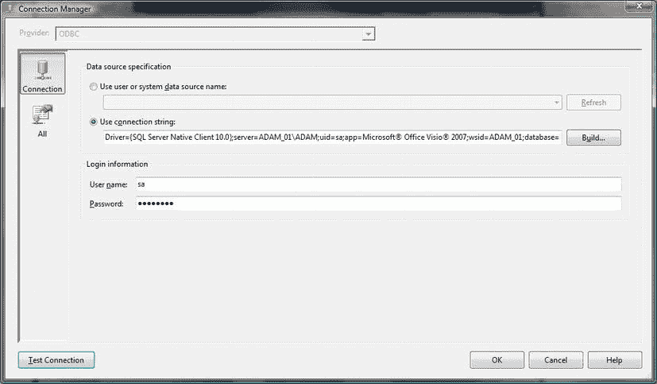

# “无 DSN”的 ODBC 连接

您可以使`SSIS`使用`ODBC`驱动程序，而无需现有的`DSN`。这适用于所有版本的`SSIS`。无论如何，它都会在磁盘上创建一个`.dsn`文件。

1.  使用前述关于文件`DSN`的指南，显示如图 6-36 所示的连接管理器对话框。

    
    图 6-36. `ODBC`连接管理器对话框

2.  确保选中`使用连接字符串`单选按钮。点击`构建`。
3.  点击`新建`。选择与您希望使用的数据源对应的`ODBC`驱动程序。
4.  点击`下一步`。
5.  保存`文件 DSN`。您可以决定文件名和目录——但`.dsn`扩展名会自动添加。
6.  点击`下一步`。
7.  点击`完成`。
8.  配置`ODBC`驱动程序。
9.  点击`确定`。

