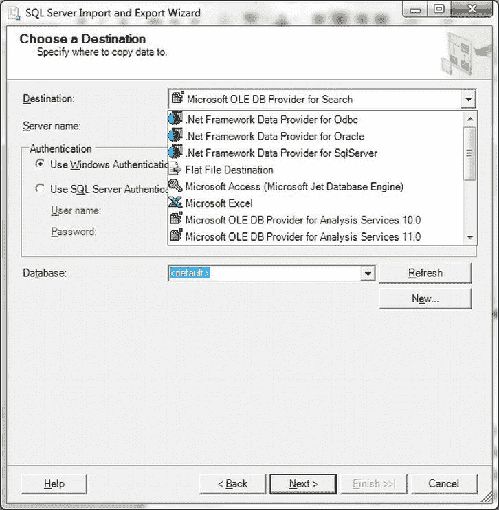
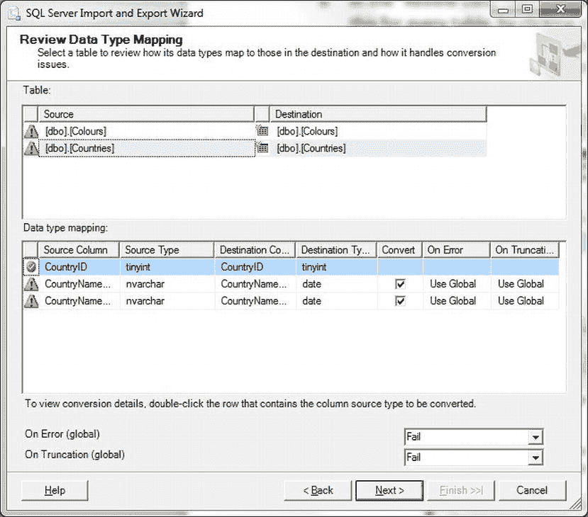
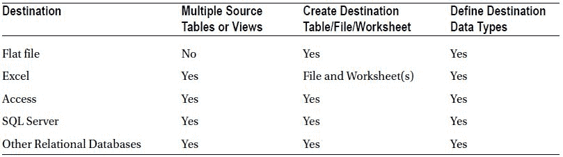
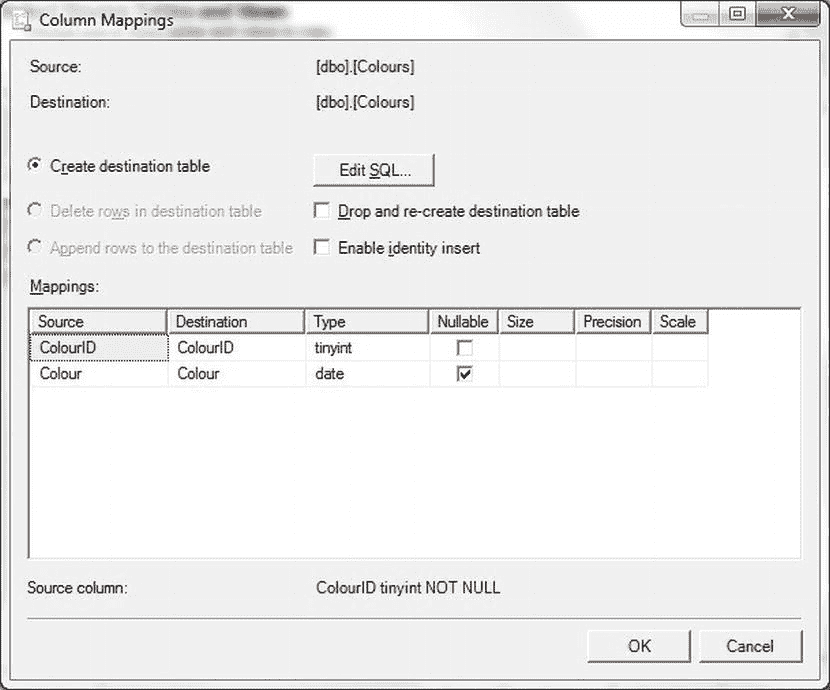
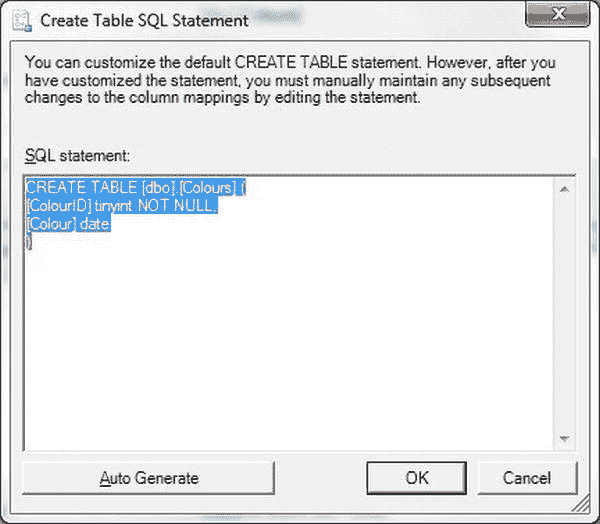

# 从 SQL Server 导出数据

将数据导入 SQL Server 可能是开发者或 DBA 面临的一项重大挑战。然而，数据需要向相反方向移动——从 SQL Server 导出到另一个程序或系统——的情况也时常发生。数据集成的这个方面同样有其技巧（你需要了解）和陷阱（你需要知道如何避免）。本章将探讨一些将数据从 SQL Server 发送到其他环境的主要方法。幸运的是，与导入数据相比，从 SQL Server 导出数据时你有两个主要优势：

*   你完全了解并能控制数据及其结构。
*   你可以使用你非常熟悉的核心语言（`T-SQL`）来处理数据在目标系统中的转换方式。

事实上，本章中用于导出数据的许多技术与你在前面章节中已经看到的技术相似。

因此，我们只需要一章来探讨导出数据的方式：

*   作为文本（分隔符和固定宽度）文件。
*   作为 `XML` 文件。
*   导出到 `Access` 和 `Excel`。
*   作为 SQL Server 原生 `BCP` 文件。
*   导出到其他 SQL Server 数据库。
*   导出到其他 SQL 数据库。

还有许多其他导出目的地我不会涉及，即使它们在其他章节中被讨论为可能的数据源。这是因为显然不可能描述每一种情况，而且我认为有些数据源要么属于“遗留”类别，要么属于“极其罕见”类别，它们不太可能被要求作为数据输出目的地。

如果你从本书的配套网站下载了示例文件，你会在 `C:\SQL2012DIRecipes\CH07` 中找到它们。

## 7-1. 以多种格式偶尔导出数据

### 问题

你希望不时地将 SQL Server 数据导出为众多可用格式中的一种——可能是为了满足一个意外的请求。

### 解决方案

使用导入/导出向导，并选择其众多目标格式之一来输出数据。

由于 SQL Server 导入/导出向导可以导出多种格式的数据，我将在这里向你展示如何将数据导出到另一个 SQL Server 数据库，并在本方法的末尾对其他可能的目标地给出说明。请按照以下步骤操作：

1.  在 `SSMS` 中，右键单击要从中导出数据的数据库（本例中为 `CarSales`），选择 **任务** → **导出数据**。如果显示欢迎窗格，请单击下一步。
2.  在“选择数据源”窗格中，检查源数据库（`CarSales`）和身份验证模式/凭据是否正确。单击下一步。
3.  在“选择目标”窗格中，选择所需的目标。在“目标”下拉列表中，你会看到所有已安装驱动程序的列表。如果你在这里看不到所需的目标，则需要停止该过程并安装所需的驱动程序。在本例中，选择 `SQL Server Native Client 11.0`。输入所需的身份验证信息，然后是目标数据库。对话框应类似于图 7-1。
    
    *图 7-1. SQL Server 导入/导出向导*
4.  单击下一步。
5.  在“指定表复制或查询”窗格中，选择是选择多个表或视图（通过单击“复制一个或多个表或视图中的数据”），还是导出由即席查询或存储过程生成的单个表（“编写查询以指定要传输的数据”）。在本例中，选择“复制一个或多个表或视图中的数据”，然后单击下一步。
6.  在“选择源表和视图”窗格中，选择所有要导出的表和视图，然后单击下一步。
7.  在“审查数据类型映射”窗格中，审查所有数据类型映射。你需要通过单击对话框上部的表名来检查每个表，然后在对话框下部检查（并可能更改）数据类型映射。幸运的是，向导会使用黄色三角形提醒你注意可能的异常情况，如图 7-2 所示。
    
    *图 7-2. SQL Server 导入/导出向导中的数据类型映射*
8.  一旦你对此感到满意，单击下一步。
9.  在“保存并运行包”窗格中，选择是否将导出过程保存为 `SSIS` 包——如果保存，保存在哪里。然后单击下一步。
10. 你现在有最后机会审查所有选项。假设一切似乎都正确无误，单击完成。

如果一切顺利，数据将被导出。

## 原理

那么，如果你在 64 位环境中工作，并且需要在只有 32 位驱动程序（`OLEDB` 或 `ODBC`）存在时实现一个 32 位链接服务器，你能做什么？这里描述的方法是一个可能的变通方案，尽管需要很多的初始工作。

你所做的是：

*   安装第二个 32 位 SQL Server 实例。
*   将源数据链接到这个 32 位 SQL Server 实例。
*   将这第二个实例链接到你的 64 位实例。

我同意，为了实现本应简单的事情需要付出很多努力；但在某些情况下，你可能会发现别无选择。

## 提示、技巧和陷阱

*   你也可以用这种方式在 64 位环境中链接到 32 位 `Excel`。
*   我假设你对两台服务器都拥有完全的管理员权限。如果情况并非如此，你必须相应地映射本地和远程登录。
*   视图并不是从源返回数据的唯一方式；你也可以使用 `OPENROWSET`。
*   对于 `ODBC` 源，你可能需要定义一个 `DSN` 并使用 `MSDASQL` 作为 `OLEDB` 提供程序。

 `注意` 如果你设置第二个 SQL Server 实例，你将必须遵守任何许可要求。请记住，SQL Server Express 可以处理最大 10 GB 的数据库，并且可以使用 1 GB 内存——因此它可以是解决此类问题的一种方案。

#### 总结

在本章中，你已经看到一些你可能较少遇到的数据源。然而，仅仅因为一种数据格式较旧——想想 `dBase` 或 `Visual FoxPro`——并不意味着有一天你不需要将其包含的信息加载到 SQL Server 中。

在稍微不同的层面上，从 SQL Server 将数据加载到 `SSAS` 并不意味着你不希望 Analysis Services 允许你将数据从多维数据集返回到关系表中；因此，我们也看到了如何做到这一点。如果你使用 Microsoft `RDBMS` 作为文件的存储库，你已经看到了如何将文件——单独地或批量地——加载到数据表中。当然，你也发现了如何使用 Web 服务作为数据源。

此外，还有无数具有 `ODBC` 驱动程序的数据源，你必须使用它们来访问其包含的数据。每一个都不同，但本章试图向你展示如何在 SQL Server 2012 中使用 `ODBC`，为你提供通往许多其他数据存储库的门户。

总而言之，本章带你游览了数据集成的远方海岸。所使用的技术可能较少被采用，但在面对涉及一个较不传统数据源的 `ETL` 挑战时，它们可能至关重要。

## 工作原理

要将数据快速、简单地导出为多种经典格式，很少有方法能比**导出向导**更简单。只需点击几下，您就可以将 SQL Server 表或视图导出到：
- 平面文件（固定宽度和分隔符）。
- Excel。
- Access。
- SQL Server。
- 其他关系型数据库。

实际上，您可以将 SQL Server 数据导出到任何已正确安装 OLEDB 或.NET 提供程序的数据目标。导出时，您可以选择：
- 多个表或视图。
- 单个即席 SQL 查询。
- 创建（并为新目标表或文件定义数据类型）。
- 将数据添加到现有目标。
- 替换现有目标中的数据。
- 将导出定义另存为 SSIS 包。

导出向导的具体功能很大程度上取决于导出格式。为了让您有个概念，表 7-1 简要概述了各种可能性。在所有情况下，只有在创建新目标对象（平面文件、Excel 工作表或关系数据库表）时，才能定义目标数据类型，而无法修改现有对象。

表 7-1. 导入/导出向导选项

导出向导的主要限制在于，它仅用于“原样”导出 SQL Server 数据库中的数据。也就是说，您无法执行以下操作：
- 数据转换
- 数据流逻辑
- 聚合
- 日志记录

导出向导也可以作为一个“SSIS 包生成器”，为您创建初始包，这非常有用。然后您可以在 SSIS 中随心所欲地进一步扩展它们，添加所需的任何过程控制逻辑和其他更复杂的数据流元素。此外，值得注意的是，包含聚合和数据转换的复杂数据源可以准备为视图、脚本或存储过程，用作数据源。

除了列出的数据目标，我将不再探讨其他目标，因为我的经验告诉我，这已经涵盖了相当一部分简单的数据导出需求。毕竟，这就是向导的设计目的！

本方法仅展示了导出向导提供的众多可能性中的一种路径——将数据从一个或多个表复制到源服务器上已配置了适当驱动程序的任何目标。虽然展示每一种组合是一项艰巨的任务（而且完全多余），但导出过程确实存在一些变体。成功导出的前提条件如下：
- 必须为希望导出数据的目标安装所有 OLEDB 和.NET 驱动程序。
- 您需要用户账户对所有希望导出数据的目标文件、文件夹和数据库拥有相关权限。

## 关于导出向导主题的一些变体

现在介绍本方法所阐述主题的一些变体。本章我能做的唯一基本假设是数据源将是 SQL Server。在导出向导的后续步骤中，您可以从许多其他选项中选择。这些包括：
- 目标的选择。
- 源数据的选择——包括对象选择和源数据的子集筛选。
- 导出过程中的数据转换和列映射。

虽然我不想试图涵盖所有可用选项，但接下来是您在使用此实用程序导出数据时可能会用到的一些核心元素。

### SQL 语句

如果您在第 4 步选择了“编写查询以指定要传输的数据”，您将在“提供源查询”窗格中获得键入或从文件插入 SQL 查询的选项。这里值得注意的是：
- 如果您使用存储过程导出数据，请在“SQL 语句”窗格中输入 `EXECUTE ProcName`。
- 如果您的数据源是存储过程或复杂查询，则无法从会话范围内的临时表返回数据。不过，在许多情况下，您可以使用公共表表达式（CTE）来规避此限制。
- 单击“浏览”按钮允许您选择源 SQL 脚本文件。
- 此路径仅允许导出单个数据集。

### 平面文件

如果您选择了平面文件目标，则必须在“选择目标”窗格中决定以下选项：
- 文件名和路径
- Unicode 或代码页
- 分隔符、固定宽度或右端不齐
- 文本限定符
- 是否希望第一行包含列名

在“配置平面文件目标”窗格中，您可以选择行和列分隔符——以及源表或视图。

### Excel

导出到 Excel 时，有几点值得注意：
- 导出向导可以为您创建 Excel 文件。它也可以使用现有的文件和工作表。
- 对于 Excel 2007 或更高版本，您必须使用 ACE 驱动程序，在 64 位系统中则使用 64 位 ACE 驱动程序。

### Access

将数据导出到 Access 时，有几个有趣的要点：
- 导出向导不会创建 Access 数据库——您必须先创建它。
- 对于 Access 2007 或更高版本，使用 ACE 驱动程序，在 64 位系统中则使用 64 位 ACE 驱动程序。

### 关系型数据库

对于所有关系型数据库导出（包括 SQL Server），您需要以下条件：
- 如果需要客户端软件，则 SQL Server 上已正确设置客户端软件（例如 Oracle）。
- SQL Server 上已正确安装所有必需的提供程序（OLEDB 或 ODBC）。
- 对目标服务器和数据库具有写入权限，如果要创建目标表，则还需要 DDL 权限。

### 列映射

当您选择源表和视图时，可以为每个表选择列映射。这使您可以通过以下方式微调输出：
- 指定哪一列是目标（针对现有目标表）。
- 更改列名和数据类型/大小（创建新表时）。
- 决定是否删除并重新创建目标表。
- 在目标表中追加或替换数据。
- 允许`IDENTITY`插入（针对 SQL Server 目标）。

所有这些操作都在“列映射”对话框中完成（参见图 7-3），该对话框在您单击“编辑映射”时出现。

图 7-3. 列映射

此外，如果您单击“编辑 SQL”按钮，导出向导将返回它将在目标服务器上使用的`CREATE TABLE`语句。您可以根据需要编辑此语句（参见图 7-4）。

图 7-4. SQL Server 导入/导出向导中的创建表 DDL

## 提示、技巧和陷阱

- 将使用导出向导完成的工作保存为 SSIS 包时，您可以选择像保存任何其他 SSIS 包一样保存该 SSIS 包——即保存到 SQL Server 或作为文件保存。
- 如果您导出多个表，实际的导出过程会将它们分组为每四个表一组。如果您的系统有额外的可用处理器且数据集很大，您可能会发现保存包并对其进行调整以并行运行超过四个导出会更高效。
- 还有几种其他方法可以运行数据导出向导。这些包括：
    - 在“开始”菜单上，选择“所有程序”，然后选择“Microsoft SQL Server 2012”，接着选择“导入和导出数据”。
    - 在 SQL Server 数据工具（SSDT——如果您使用的是旧版 SQL Server，则为 Business Intelligence Development Studio）中，右键单击“SSIS 包”文件夹，然后选择“SSIS 导入和导出向导”。

