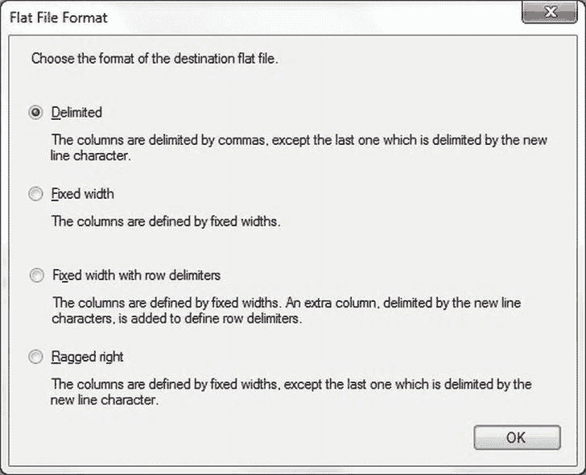
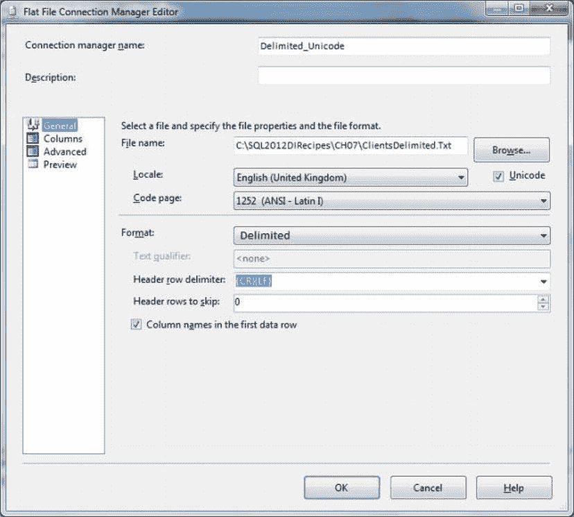

# 7-2\. 将数据导出为分隔文本文件

## 问题 (Problem)

你需要将数据导出为分隔文本文件，并且需要了解平面文件输出的各种细节。

## 解决方案 (Solution)

使用 SQL Server Integration Services (SSIS) 和平面文件目标 (Flat File destination) 将数据从表、视图或查询发送到文本文件。

以下步骤说明如何从 SQL Server 表导出分隔文本文件：

1.  创建一个新的 SSIS 包，并添加一个名为 `CarSales` 的 OLEDB 连接管理器，该管理器连接到你的源数据库（本例中为 `CarSales`）。
2.  添加一个数据流任务 (Data Flow task)。双击进行编辑。
3.  添加一个 OLEDB 源 (OLEDB source)，并按如下配置：
    *   连接管理器 (Connection Manager): `CarSales`
    *   数据访问模式 (Data Access Mode): `SQL Text`
    *   SQL 命令文本 (SQL Command Text):
        ```sql
        SELECT  ID, ClientName, Country, Town, County, Address1,
                Address2, ClientType, ClientSize
        FROM    dbo.Client
        ```
4.  确认你的修改。
5.  向数据流窗格 (Data Flow pane) 添加一个平面文件目标 (Flat File destination)，并将 OLEDB 源连接到它。双击进行编辑。点击“新建”(New) 创建一个新的平面文件连接管理器 (Flat File connection manager)。在“平面文件格式”(Flat File Format) 对话框中选择“分隔符”(Delimited)，然后点击“确定”(OK)，如图 7-5 所示。

    

    **图 7-5** 选择平面文件导出格式

6.  按如下配置平面文件连接管理器编辑器 (Flat File Connection Manager Editor)（假设你使用本书的示例——否则，请使用你自己的文件路径）：
    | 选项 | 值 |
    |---|---|
    | 名称 (Name) | `Delimited_Unicode` |
    | 文件名 (File Name) | `C:\SQL2012DIRecipes\CH07\ClientsDelimited.txt` |
    | Unicode | 已勾选 (Ticked) |
    | 列名位于首行数据中 (Column Names in First Data Row) | 已勾选 (Ticked) |
    | 文本限定符 (Text Qualifier) | `<none>` |
    | 要跳过的标题行数 (Header rows to skip) | `0` |
    | 标题行分隔符 (Header Row delimiter) | `<CR><LF>` |

    对话框应如图 7-6 所示。

    

    **图 7-6** 将平面文件连接管理器设置为导出到分隔平面文件

7.  点击“确定”(OK) 确认更改。
8.  点击“映射”(Mappings) 并确保所有输出列都映射到了源列。

操作到此就相当简单地完成了。你现在可以导出数据了。

## 工作原理 (How It Works)

根据我的经验，可能最常用的导出类型是文本文件。这很可能是因为大多数数据库或电子表格程序都能接受外部的分隔文本文件。显而易见，文本文件将具有表 7-2 所示的特征。

**表 7-2** 文本文件特征

| 选项 | 定义 |
|---|---|
| 字符类型 (Character type) | ASCII 或 Unicode。对于 ASCII 导出，可以定义代码页。 |
| 列分隔符 (Column separator) | 由用户选择。默认为逗号 (,)。 |
| 行分隔符 (Row Delimiter) | 由用户选择。默认为回车符 + 换行符 (CR/LF)。 |
| 文本限定符 (Text Qualifier) | 可选。可以为每个列定义。 |

你可以选择将数据添加到现有的文本文件，或者删除现有文件的内容。要替换文件内容，请在“平面文件目标编辑器”(Flat File Destination Editor) 中勾选“覆盖文件中的数据”(Overwrite data in the file)。值得注意的是，你可以在创建平面文件目标并将其连接到 OLEDB 源之前创建平面文件连接管理器，但这不会自动为你生成目标列结构。这意味着你必须手动创建所有列，这至少可以说是费力的。

因此，如果源数据发生根本性变化，你可能会发现删除现有的平面文件连接管理器并用一个新的替换它比尝试重新配置目标更容易。不幸的是，由于重新排序列的唯一方法是删除并重新插入它们，这一问题变得更加复杂。

在微调（而不是重新创建）平面文件目标时，你可以使用“新建”(New) 和“删除”(Delete) 按钮添加或删除列。在“高级”(Advanced) 窗格中调整列规格时，可以使用 `Ctrl` 键选择多个列，使用 `Shift` 键选择列集。

对于导出文本文件（分隔符或固定宽度），有一系列有用的选项。表 7-3 对这个特定主题的主要变体进行了简要说明。

**表 7-3** SSIS 文本目标选项

| 选项 | 对话框页面 | 说明 |
|---|---|---|
| 区域设置 (Locale) | 常规 (General) 页面 | 货币设置等。 |
| Unicode | 常规 (General) 页面 | 勾选此项将使用 Unicode 导出文件。 |
| 代码页 (Code Page) | 常规 (General) 页面 | 如果你的目标文件必须使用特定的代码页（因此是非 Unicode）。 |
| 标题行分隔符 (Header Row Delimiter) | 列 (Columns) 页面 | 指定标题行分隔符。这可以与数据行的分隔符不同。 |
| 要跳过的标题行数 (Header Rows to Skip) | 常规 (General) 页面 | 在此处输入一个数字将导致输出跳过前“n”条记录。 |
| 文本限定符 (Text Qualifier) | 常规 (General) 页面 | 字符——通常是双引号 (")——用于包裹包含额外列分隔符字符出现的文本字段。 |
| 列名位于首行数据中 (Column Names in the First Data Row) | 常规 (General) 页面 | 将列名作为输出文件的第一行添加。 |
| 行分隔符 (Row Delimiter) | 列 (Columns) 页面 | 指定默认行分隔符。 |
| 列分隔符 (Column Delimiter) | 列 (Columns) 页面 | 指定默认列分隔符。这可以在“高级”(Advanced) 页面中为每列单独指定。同样，如果你想使用弹出列表中没有的定界符，请使用“高级”(Advanced) 页面。 |
| 名称 (Name) | 高级 (Advanced) 页面 | 允许你重命名列。如果你选择将列名作为输出文件的第一行添加，这将使用的名称。 |
| 列分隔符 (Column Delimiter) | 高级 (Advanced) 页面 | 允许你为此列指定列分隔符，并覆盖默认值。如果所需字符不在列表中，你也可以输入一个字符（或多个字符）。 |
| 文本限定 (Text Qualified) | 高级 (Advanced) 页面 | 你可以指定此列是否被文本限定符包围。 |

## 提示、技巧和陷阱 (Hints, Tips, and Traps)

*   以 Unicode 格式导出文本文件会使其大小加倍——因为每个字符将占用两个字节而不是一个字节。对于非常大的文件，避免代码页麻烦的简单性可能会在磁盘空间和网络传输时间上付出相当大的代价。
*   你可能更愿意在 T-SQL `SELECT` 语句中为列创建别名，而不是在平面文件目标适配器的“高级”(Advanced) 页面中重命名它们。
*   当然，你可以选择一个表作为数据源，但这只有在使用所有源列时才是好的做法。如果你在 `SELECT` 语句中只选择所需的列，而不是选择表或视图源然后在数据流中取消选择不需要的列，SSIS 将更快地导出数据。
*   添加文本限定符也会将列标题用引号括起来，对于每个将“高级列属性”(advanced column property) `TextQualified` 设置为 True 的列。如果你觉得这很烦人或不可用，那么考虑如配方 7-4 所示，使用 `UNION` 子句作为 `SELECT` 语句的一部分来输出列标题。
*   你可以自由选择喜欢的文件名和扩展名，但遵守（相当）标准的约定（如逗号分隔值用 `.CSV`，制表符分隔值用 `.TXT`）会让接收你文件的人更容易处理。


