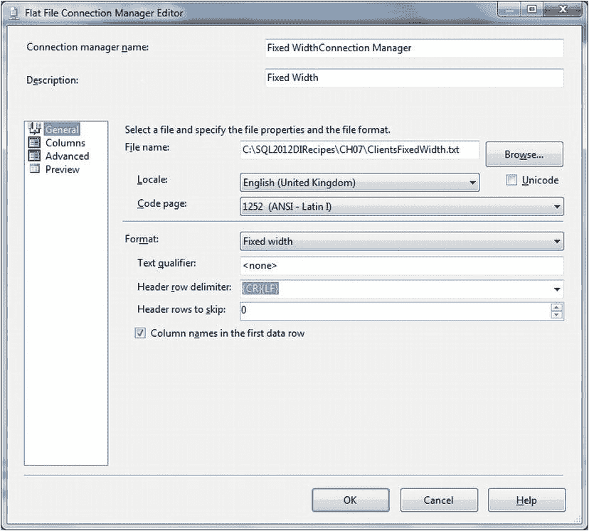

# 7-3. 将数据导出为固定宽度文本文件

## 问题

您希望将数据导出到文本文件，但数据的接收方要求使用固定宽度格式，而非通常的分隔符类型。

## 解决方案

使用 SSIS 和平面文件目标，但指定固定宽度文件格式。您可以按以下方式以这种格式导出数据。

1.  执行食谱 7-2 中的步骤 1 到 4，但指定平面文件格式为 `Fixed Width`。配置您创建的新平面文件连接管理器，使其看起来如 图 7-7 所示。

    

    图 7-7. 固定宽度平面文件输出

2.  检查“高级”页面，您会看到列宽已为您计算好：每个文本列的最大文本宽度，以及每个数值或日期/时间字段类型所需的最宽列。

## 工作原理

导出固定宽度文件的过程与食谱 7-2 中描述的过程大体相似。甚至可以说，它比分隔符文件的导出更简单。使其更简单的一点是，您无需担心列分隔符，因为列是根据行起始字符数来“分隔”的。另一点是，由于没有列分隔符，因此不需要转义任何字符。

## 提示、技巧和陷阱

*   右边缘不齐的导出会在每行末尾包含一个 CR/LF（回车/换行符）；固定宽度导出则不会。

