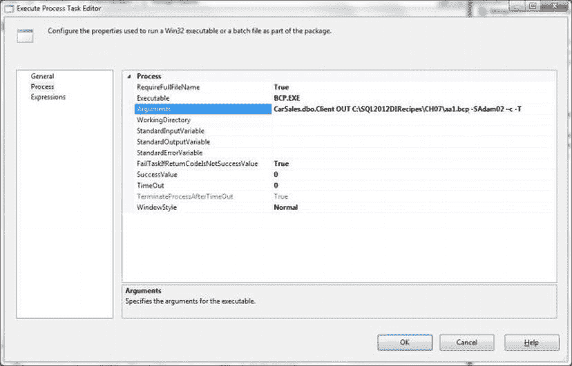
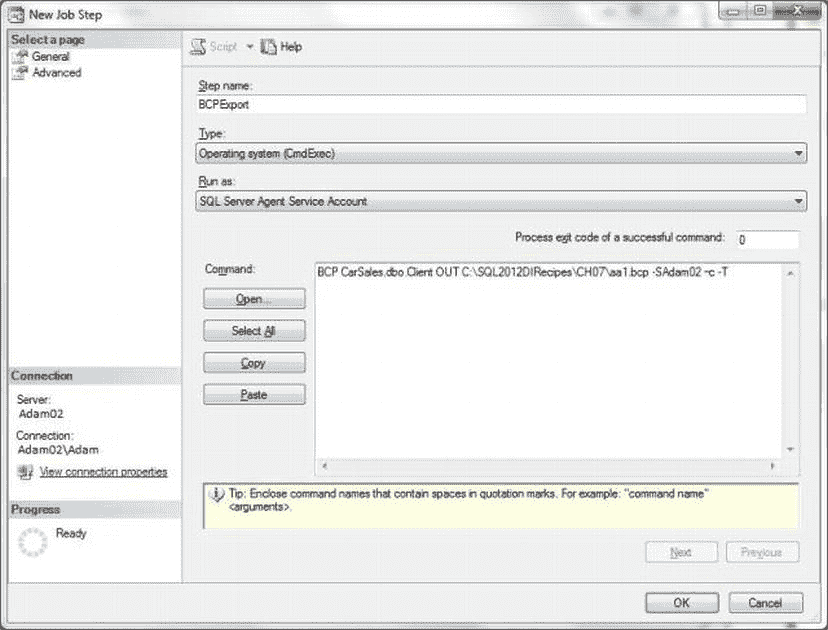

# 7-4. 从命令行导出文本文件

## 问题

您希望在不使用 SSIS、T-SQL 或导入/导出向导的情况下导出文本文件，可能作为脚本的一部分。

## 解决方案

使用 `BCP` 从命令窗口或命令（`.cmd`）文件将数据导出为文本文件。

要从表中将数据导出为文本文件，请在命令窗口中使用以下代码片段。（请注意，以下所有代码摘录均位于文件 `C:\SQL2012DIRecipes\CH07\BCPOut1.cmd` 中）：

```
bcp CarSales.dbo.Client OUT C:\SQL2012DIRecipes\CH07\aa1.txt -SAdam_01\Adam –c -T
```

类似地，使用 `SELECT` 语句：

```
bcp "SELECT ID,ClientName FROM CarSales.dbo.Client" QUERYOUT C:\SQL2012DIRecipes\CH07\aa1.txt -SAdam_01\Adam –c -T
```

此命令使用存储过程返回数据（假设我之前已创建了一个名为 `pr_OutputClients` 的过程，其中包含诸如 `SELECT ID,ClientName FROM CarSales.dbo.Client` 的查询）：

```
bcp "EXECUTE CarSales.dbo.pr_OutputClients" QUERYOUT C:\SQL2012DIRecipes\CH07\aa1.txt -SAdam_01\Adam –c -T
```

将列数据用引号括起来的最简单方法是在源 T-SQL 中包含它：

```
SELECT  ID, + '"' + ClientName + '"', Country
FROM    CarSales.dbo.Client;
```

`BCP` 没有包含列标题的选项。

如果需要列标题，则需要调整 SQL 以包含列标题，可能在您的 T-SQL 中使用类似下面这样的 `UNION` 子句（`C:\SQL2012DIRecipes\CH07\IncludeHeadersInTextFile.sql`）：

```
SELECT ID, ClientName, Country
FROM (
      SELECT 'ID' AS ID, 'ClientName' AS ClientName, 'Country' AS Country, 0 AS RowOrder
      UNION
      SELECT CAST(ID AS VARCHAR(11)), ClientName, Country, 1 AS RowOrder       
      FROM CarSales.dbo.Client
     ) A
ORDER BY RowOrder,ID;
```

如果目标数据库需要不同的字段分隔符（诚然，这种情况较少见），那么将这些分隔符作为源 SQL 的一部分生成可能更容易。

```
SELECT   CAST(ID AS VARCHAR(11)) + '/' + ClientName + ';' + Country
FROM     CarSales.dbo.Client;
```

 **注意** 在所有示例中，我都假定您将使用 `CarSales` 示例数据库以及本书示例的目录结构。如果情况并非如此，则必须将表名、字段名以及文件路径替换为您正在使用的那些。

## 工作原理

当提到 `BCP` 时，您可能会想到“导入”。嗯，这个老牌的批量复制程序在需要从 SQL Server 导出数据为文本文件时，也可以非常高效。不，命令行界面并不是最用户友好的——实际上，它一直被批评笨拙，但这个工具在许多情况下仍然可以帮到您。

由于 `BCP` 的大部分复杂性已在第 2 章和第 5 章中解释过，我将只关注您需要了解的使用此工具从 SQL Server 提取数据的知识。首先，在导出文本数据时，`BCP` 至少需要知道六件事。这些在表 7-4 中概述。但是，前三个元素必须按此表所示的顺序提供，其他元素可以按任意顺序添加。

表 7-4. BCP 必需参数

| 元素 | 注释 |
| --- | --- |
| 源数据 | 可以是表、存储过程调用、视图或查询。如果使用表、视图或存储过程，应应用三部分名称法以包含数据库名。 |
| 提取类型 | 对于表或视图使用 `OUT`，对于查询（select 语句或存储过程）使用 `QUERYOUT`。 |
| 文件路径 | 完整的路径和文件名，包括扩展名。如果路径包含空格，请记得用双引号括起来。 |
| 字符类型 | `-c` 表示 ASCII，`-w` 表示 Unicode。 |
| 服务器名称 | `-S` 表示服务器名。 |
| 连接类型 | 对于可信连接使用 `-T`，对于 SQL Server 连接，使用 `-U` 表示用户名，`–P` 表示密码。 |

使用 `BCP` 时，有几点需要考虑。首先，`BCP` 总是会覆盖目标文件的内容。此外，`BCP` 一次只能导出一个表或视图——尽管您可以使用查询来创建非规范化的导出表。同时，如果您怀疑分隔符可能出现在数据字段内的任何位置（例如地址中的逗号），则强烈建议您使用自定义分隔符。只需记住告知您发送数据的对象您使用了什么分隔符。最后，当使用查询或执行存储过程时，务必在 `BCP` 命令行中将其用引号括起来。

您可能需要转义（或删除）某些字符，以确保目标数据库可以加载您输出的文本文件。例如，如果您（或同事或客户）稍后将使用 MySQL 的 `LOAD DATA INFILE` 来批量加载您导出的文本文件，您应该使用反斜杠（`\`）来转义出现在字段值中的制表符、换行符或反斜杠。使用 T-SQL 的 `REPLACE` 函数最容易做到这一点——尽管这会稍微减慢导出过程。

`BCP` 有一些重要的选项需要您理解。


例如，默认情况下，`BCP` 使用制表符作为列分隔符，使用换行符作为行终止符。您可能需要使用其他字符作为分隔符，在这种情况下，一些常用的变体包括：

*   *逗号分隔符*: `-t,`
*   *管道分隔符*: `-t¦`
*   *制表符分隔符*: `-t\t`
*   *自定义分隔符*: `-t@@#@@`
*   *换行符*: `-r\n`
*   *回车/换行* (CR/LF): `-r\r`


> **注意：** 将文本文件导出为 Unicode 格式会使其大小翻倍，因为每个字符将占用两个字节而不是一个。为避免这种情况，对于大文件，如果要导出的数据允许，您可能更愿意指定一个代码页。例如，您可以使用代码页 `-C nnnn`（其中 `nnnn` 是代码页的四位数字引用）。

#### 提示、技巧与陷阱

*   要将数据导出为 `BCP` 文件，您必须记住不能使用 `BULK INSERT` 来输出数据，因此不得不借助于命令行 `BCP.exe`，这意味着需要了解其众多参数中的一部分。正如我们将看到的，您也可以使用 `xp_cmdshell` 来运行 `BCP`。
*   您需要对输出文件所用路径拥有读写权限。
*   如果使用 `UNION` 查询来包含列标题，则必须将任何非字符值 `CAST` 或 `CONVERT` 为适当长度的 `VARCHAR`。
*   在连接源字段时，请记住处理 `NULL` 值，否则如果任何字段包含 `NULL`，您将丢失整个输出记录。
*   如果需要在数据库之间传输二进制和/或 `CLOB`（**C**haracter **L**arge **OB**ject，字符大对象）值，那么最好使用配方 7-24 和 7-25 中描述的技术。
*   在特别复杂的输出选择中（可能涉及带引号的字段、列标题等），考虑将输出定义创建为视图或存储过程，然后使用 `BCP` 将其输出为文本文件。

## 7-5. 不使用命令行利用 BCP 导出数据

### 问题

您希望利用 `BCP` 的所有强大功能来导出数据，但又不想受限于从命令行使用它，因为您希望这是更广泛的脚本化过程的一部分。

### 解决方案

从 T-SQL、SSIS 或 SQL Server 代理中运行 `BCP`。

#### 从 SSIS 运行 BCP

在 SSIS 中，运行 `BCP` 与运行任何其他操作系统可执行文件类似——使用“执行进程任务”，您可以如 图 7-8 所示进行配置（以使用配方 7-4 中给出的代码）。



图 7-8。从 SSIS 运行 `BCP`

#### 从 SQL Server 代理运行 BCP

要从 SQL Server 代理运行 `BCP` 导出，请将作业步骤定义为：

*   **类型：** 操作系统 (CmdExec)
*   **命令：** 任何有效的 `BCP` 命令——例如：
    ```
    bcp CarSales.dbo.Client OUT C:\SQL2012DIRecipes\CH07\aa1.txt -SAdam_01\Adam –c -T
    ```

一个用于运行 `BCP` 命令的有效 SQL 代理任务应类似于 图 7-9 所示。



图 7-9。从 SQL Server 代理运行 `BCP`

### 工作原理

运行 `BCP` 导出本质上主要有五种方式，因此值得了解所有这些方式及其用途和可能的限制。它们在 表 7-5 中展示。

表 7-5. 运行 `BCP` 导出的方法

| 调用方法 | 说明 |
| --- | --- |
| 命令提示符 | 非常适合临时导出。 |
| T-SQL | 如果（这可能是一个很大的前提）您的服务器上授权了 `xp_cmdshell`，那么您可以从 SSMS 或存储过程运行 `BCP`。 |
| SSIS | 您可以使用“执行进程任务”来运行 `BCP` 导出。 |
| SQL 代理 | 非常适合计划任务。 |
| 批处理文件 | 运行顺序流程的可靠方法。可以使用 `xp_cmdshell` 从操作系统计划程序运行，或使用“执行进程任务”从 SSIS 运行。 |

本配方更详细地探讨了中间的三种方式，因为我们在前面的配方示例中使用了命令提示符，而批处理文件不过是一系列 `BCP` 命令的串联。从 T-SQL 进行 `BCP` 导出的优势在于，您可以使用动态 SQL 和游标（在此上下文中其开销通常是最小的）来导出多个表、视图或存储过程的输出。

#### 提示、技巧与陷阱

*   要从 T-SQL 运行 `BCP.exe`，您需要使用基于策略的管理、`sp_configure` 或方面/外围应用配置来启用 `xp_cmdshell`。请注意，它被认为是一个潜在的安全漏洞，应谨慎使用。
*   从 SSIS 运行 `BCP` 时，您需要用双引号将路径和任何查询括起来，就像在交互式使用 `BCP` 时一样。

## 7-6. 从 T-SQL 将数据导出为文本文件

### 问题

您希望简单轻松地将数据导出为文本文件，而无需开发 SSIS 包来从 T-SQL 导出数据的复杂性。

### 解决方案

使用 T-SQL 的 `OPENROWSET` 或 `OPENDATASOURCE` 函数。

您可以使用类似于这样的脚本来填充带分隔符的文本文件（`C:\SQL2012DIRecipes\CH07\ExportDelimitedTextWithOpenRowset.sql`）：

```sql
INSERT INTO OPENROWSET('Microsoft.Jet.OLEDB.4.0',
    'Text;Database = C:\SQL2012DIRecipes\CH07\;',
    'SELECT ID, ClientName FROM InsertFile.txt')
SELECT      ID, ClientName
FROM dbo.Client;
```

对于 `OPENDATASOURCE`，请使用以下内容（`C:\SQL2012DIRecipes\CH07\ExportDelimitedTextWithOpendatasource.sql`）：

```sql
INSERT INTO OPENDATASOURCE('Microsoft.Jet.OLEDB.4.0',
    'Data Source = C:\SQL2012DIRecipes\CH07\;Text; FMT = Delimited')...[InsertFile#Txt]
SELECT ID, ClientName  FROM dbo.Client;
```

### 工作原理

如果您更喜欢从 T-SQL 内部运行文本导出——并避免使用 `BCP` 和 `xp_cmdshell`——那么您可以使用 `OPENROWSET` 和 `OPENDATASOURCE`。这是从 T-SQL 导出文本文件的一种非常快捷简便的方法，无需过多麻烦。然而，存在一些限制。

*   目标文件必须在运行命令之前创建好。
*   此过程只会将数据追加到文件。
*   目标文件中必须存在列标题——即使您使用了 `HDR = YES` 扩展属性。
*   默认情况下，此过程会自动为每列数据添加双引号。
*   默认情况下，使用逗号作为分隔符。
*   必须启用即席分布式查询。某些数据库管理员可能认为这是一个安全弱点。

如您所见，使用 `OPENROWSET` 和 `OPENDATASOURCE` 导出数据并没有什么特别之处。它们的使用方式与您在第 2 章 中看到的导入数据的方式几乎相同。尽管如此，值得注意的是，是 `MS.Jet` OLEDB 驱动程序允许您这样做——而不是 `MSDASQL` 驱动程序。但是，如果您想要一种无需花费 SSIS 或 `BCP` 那样的时间和精力就能快速输出数据的方法，并且如果您能接受这些限制，这可能非常有用。

要添加列标题，您将需要一个包含逗号分隔的列标题集的目标文本文件。如果标题太多无法复制粘贴，请考虑使用 `INFORMATION_SCHEMA` 系统视图来收集列标题列表。文本文件中的列标题不必与源表中的列标题相对应。但是，如果您使用 `OPENROWSET`，文本文件中的列标题必须与 `OPENROWSET` 命令的 `SELECT` 子句中的列标题完全相同。如果您使用 `OPENDATASOURCE`，那么文本文件中的确切列标题不必与 `SELECT` 子句中的列标题一一对应——但它们的顺序和数量必须完全对应。


