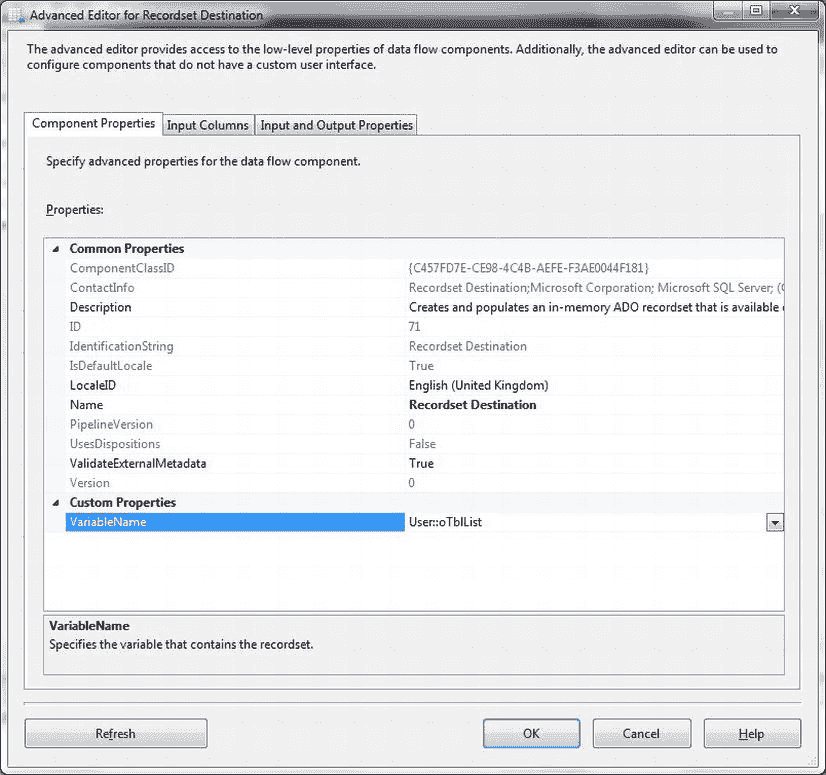
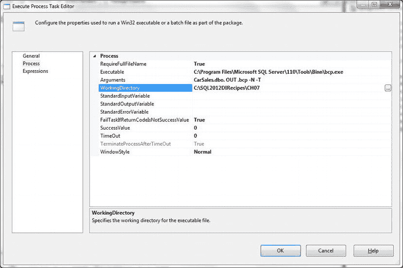
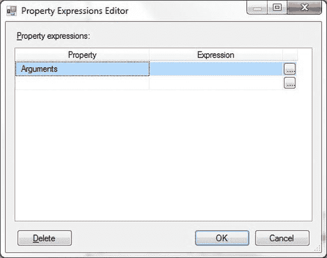
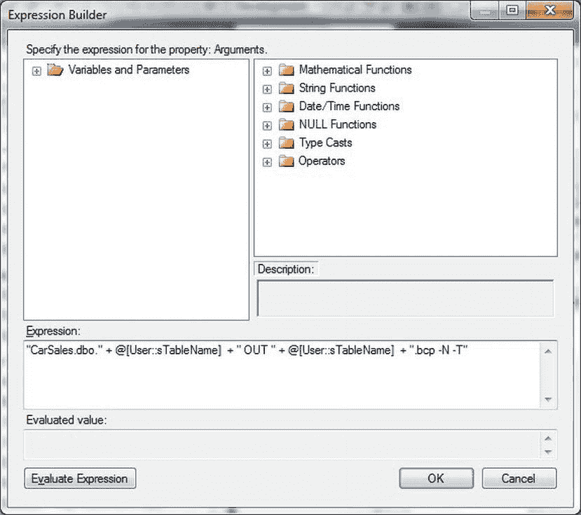

# 7-8. 从 T-SQL 定期导出文本文件

## 问题
您希望定期导出文本文件，但希望使用 T-SQL 而不是其他方式。

## 解决方案
为目标文本文件设置一个链接服务器，然后使用 T-SQL `INSERT` 将数据导出到该文件。

1.  首先为目录定义一个链接服务器。执行类似以下位于 `C:\SQL2012DIRecipes\CH07\TextFileLinkedServer.sql` 的 T-SQL：
    ```sql
    EXECUTE Master.dbo.sp_addlinkedserver
      'srv_Text',                        -- 链接服务器名称
      'ACE',                             -- 产品名称
      'Microsoft.ACE.OLEDB.12.0',        -- 提供程序名称
      'C:\SQL2012DIRecipes\CH02',        -- 数据源
      NULL,                              -- 位置
      'Text';                            -- 提供程序字符串
    GO
    ```

2.  在 SSMS 中通过展开“服务器对象” -> “链接服务器”，右键单击服务器名称并选择“属性”来设置访问数据目录的安全上下文。单击“安全性”并选择“不使用安全上下文进行”。

3.  使用类似以下的 T-SQL 将数据追加到文件：
    ```sql
    INSERT INTO srv_Text...InsertFile#txt (IDNo,ClientNameHere)
      SELECT       ID,ClientName FROM dbo.Client;
    ```

## 工作原理
对于更定期的文本导出——但其限制与使用 `OPENROWSET` 进行临时导出所述的限制基本相同——您可以设置一个指向文本文件的链接服务器。这是使用 `sp_addlinkedserver` 存储过程完成的。

## 提示、技巧和陷阱
*   如果您正在设置链接服务器，配置一个 `Schema.ini` 文件绝对值得。这些在配方 2-6 中有描述。
*   您不能在链接的文本文件中删除行。


所有为 `OPENROWSET` 指定的注意事项同样适用于链接服务器导出。目标文件必须在运行命令前创建好。此过程只会向文件追加数据。列标题必须存在于目标文件中。

### 7-9. 导出并压缩多个表

#### 问题

你需要从 SQL Server 导出多个表，并在输出过程中将它们压缩。

#### 解决方案

使用 SSIS 调用 BCP 将表导出为文件，然后使用脚本任务压缩输出文件。以下是导出和压缩表的一种方法。

1.  使用以下 DDL 创建一个表，用于存放数据库中需要处理的表名列表：
    ```
    CREATE TABLE CarSales_Staging.dbo.TableList
    (
     ID int IDENTITY(1,1) NOT NULL,
     TableName NVARCHAR(50) NULL
    ) ;
    GO
    ```
2.  将所有要导出的表名添加到此表中。
3.  创建一个新的 SSIS 包。右键单击“连接管理器”选项卡，选择“新建 OLE DB 连接”。如果已有到数据库的现有连接，则选择它；否则，单击“新建”并选择服务器、安全模式和数据库。单击“确定”两次以完成连接创建。
4.  添加以下三个新变量：
    | 变量 | 类型 | 注释 |
    | --- | --- | --- |
    | `oTblList` | Object | 用于保存表名的 ADO 记录集。 |
    | `sTableName` | String | 在脚本任务中用于单独处理每个表。 |
    | `FilePath` | String | 在脚本任务中用于指定 BCP 和 `.gz`（压缩）文件所在路径。 |
5.  你还应该将路径指定为 `FilePath` 变量的值——本例中为 `C:\SQL2012DIRecipes\CH07`。
6.  在“控制流”窗格上添加一个 OLE DB 数据源，双击进行编辑。
7.  在“数据流”窗格中，添加一个 OLE DB 数据源任务，双击进行编辑。选择刚刚创建的 OLE DB 连接管理器，并选择“SQL 命令”作为数据访问模式。输入以下 SQL 作为 SQL 命令文本：
    ```
    SELECT TableName FROM TableList
    ```
8.  在“任务”窗格上添加一个记录集目标，双击进行编辑。在 `VariableName` 弹出菜单中选择 `User::oTblList` 作为将被数据流过程填充的变量。你应该会看到一个类似于 图 7-10 的对话框。
    
    图 7-10. 为记录集目标设置对象变量
9.  单击“确定”，然后单击“控制流”选项卡。
10. 在“数据流”任务下的“控制流”区域添加一个 Foreach 循环容器。将前者连接到 Foreach 循环容器。
11. 在 Foreach 循环容器中添加一个“执行进程”任务。双击进行编辑。
12. 单击“进程”（左侧）并输入以下内容：
    | 进程 | 参数 | 注释 |
    | --- | --- | --- |
    | `Executable` | `C:\Program Files\Microsoft SQL Server\110\Tools\Binn\bcp.exe` | SQL Server BCP 可执行文件。对于 SQL Server 2012，这将是 `C:\Program Files\Microsoft SQL Server\110\Tools\Binn\bcp.exe`。对于 SQL Server 2005 是 90，SQL Server 2008 是 100。 |
    | `Arguments` | `CarSales.dbo. OUT .bcp -N -T` | 核心 BCP 命令（减去表和文件名）。 |
    | `WorkingDirectory` | `\\Server\Path` | BCP 文件将导出到的目录。 |
13. 你应该会看到类似 图 7-11 所示的内容。
    
    图 7-11. 从 SSIS 执行进程任务导出 BCP 文件
14. 单击“表达式”，然后单击以显示“属性表达式编辑器”。选择 `Arguments`，如 图 7-12 所示。
    
    图 7-12. 在 SSIS 中定义表达式
15. 单击以显示“表达式生成器”。输入以下表达式：
    ```
    "Book_TestData.dbo." + @[User::sTableName]  + " OUT " + @[User::sTableName] + ".bcp -N -T"
    ```
16. 你应该会看到一个类似于 图 7-13 的对话框。
    
    图 7-13. 构建运行 BCP 的表达式
17. 测试表达式（通过单击“计算表达式”）。然后单击“确定”三次以确认“执行进程”任务并返回到“数据流”窗格。
18. 在 Foreach 循环容器内、“执行进程”任务下方，向“数据流”窗格添加一个“脚本任务”。将后者链接到前者。
19. 双击“脚本任务”进行编辑，然后单击左侧的“脚本”。在右侧的“脚本”窗格中，输入 `sTableName` 作为只读变量。
20. 单击“设计脚本”。将 `Main` 方法替换为以下代码（`C:\SQL2012DIRecipes\CH07\CompressFiles.vb`）：
    ```
    Public Sub Main()

        Dim fileName As String
        Dim filePath As String
        Dim streamWriter As StreamWriter
        Dim fileData As String
        Dim WriteBuffer As Byte()
        Dim GZStream As GZipStream

        fileName = Dts.Variables("sTableName").Value.ToString
        filePath = Dts.Variables("FilePath").Value.ToString

        Dim fileStream As New FileStream(filePath & fileName, FileMode.Open, FileAccess.Read)

        WriteBuffer = New Byte(CInt(fileStream.Length)) {}

        fileStream.Read(WriteBuffer, 0, WriteBuffer.Length)

        Dim strDestinationFileName As String
        strDestinationFileName = filePath & fileName & ".gz"

        Dim fileStreamDestination As New FileStream(strDestinationFileName, FileMode.OpenOrCreate, FileAccess.Write)

        GZStream = New GZipStream(fileStreamDestination, CompressionMode.Compress, True)

        GZStream.Write(WriteBuffer, 0, WriteBuffer.Length)

        fileStream.Close()
        GZStream.Close()
        fileStreamDestination.Close()

        Dts.TaskResult = Dts.Results.Success

    End Sub
    ```
21. 保存并关闭脚本编辑器。单击“确定”关闭“脚本任务”。

你现在可以运行该过程，它将把 `TableList` 表中定义的所有表导出为 BCP 文件和压缩的（`.gz`）文件。

### 工作原理

BCP 导出是传输多个表的有效方法——前提是数据库的设计和约束允许以这种方式重新导入数据。这个方法展示了 SSIS 如何真正发挥作用，它不仅能从列表中选择要导出的表，还能压缩导出的文件。

要导出的表集保存在名为 `TableList` 的 SQL Server 表中。当然，这也可以是 Excel 电子表格或文本文件。该表使用“执行 SQL 任务”读取，该任务将表数据加载到 SSIS 对象变量中。然后，该变量由 SSIS Foreach 循环容器进行迭代，并使用 BCP 命令导出每个单独的表。这里需要注意的一点是，BCP 参数是作为 SSIS 表达式的一部分定义的。

每个表导出为 BCP 文件后，使用 SSIS 脚本任务调用 `GZipStream` 类来压缩文件。

> **注意** 这个方法有趣的一点是，它不需要任何第三方软件来压缩文件。相反，它使用了 .NET 的 `GZipStream` 类来压缩文件。


