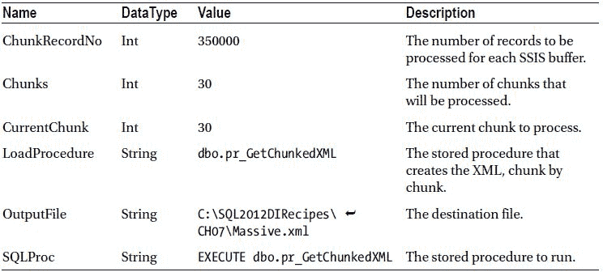
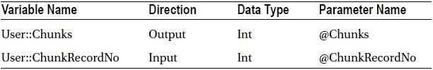
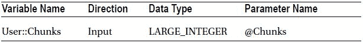

# 7-15. 定期导出 XML 数据

## 问题
你想要将数据作为 XML 导出，作为结构化 ETL 包的一部分。

## 解决方案
使用 SSIS 导出 XML 数据。我将解释一种方法。

1.  创建一个新的 SSIS 包并添加三个连接管理器，配置如下：
    | 名称 | 连接 | 注释 |
    | --- | --- | --- |
    | CarSales_OLEDB | OLEDB | 连接到源数据库（此处为 CarSales）。将属性 `RetainSameConnection` 设置为 `True`。 |
    | CarSales_ADONET | ADO.NET | 连接到源数据库（此处为 CarSales）。 |
    | XMLOut | 平面文件 | 文件必须是 Unicode 格式，并包含一个目标列（使用“高级”窗格添加）名为 `XMLOut`。此列必须是 Unicode 文本流。 |

2.  添加以下五个 SSIS 包作用域变量。它们在创建包时将变得显而易见：
    

3.  在源数据库中创建以下 SQL 存储过程。它将用于分块创建 XML (`C:\SQL2012DIRecipes\CH07\pr_GetChunkedXML.sql`)：
    ```sql
    CREATE PROCEDURE CarSales.dbo.pr_GetChunkedXML
    (
        @ChunkID INT
    )
    AS
    SELECT A.XmlOut
    FROM
    (
        SELECT
            S.ID,
            InvoiceID,
            StockID,
            SalePrice,
            DateUpdated
        FROM dbo.Invoice_Lines S
        INNER JOIN ##Tmp_ChunkDef Tmp -- 此表在第 6 步中定义
            ON S.ID = Tmp.ID
        WHERE Tmp.ChunkID = @ChunkID
        FOR XML PATH('Invoice_Lines'), TYPE
    ) A (XmlOut);
    ```

4.  添加一个初始的执行 SQL 任务。将其命名为 **获取分块迭代次数**。双击进行编辑并配置如下：
    | 连接类型: | ADO.NET |
    | --- | --- |
    | 连接: | CarSales_ADONET |
    | SQL 语句: | `SELECT @Chunks = CAST(COUNT(*) / @ChunkRecordNo AS INT) FROM dbo.Invoice_Lines.` |

5.  在“获取分块迭代次数”任务的“参数映射”窗格中定义以下参数：
    

6.  点击“确定”确认你对“获取分块迭代次数”任务的修改。
7.  添加一个执行 SQL 任务。将其命名为 **准备分块分割的临时表**。将“获取分块迭代次数”任务连接到它。双击进行编辑并配置如下：
    | 连接类型: | OLEDB.NET |
    | --- | --- |
    | 连接: | CarSales_OLEDB |
    | SQL 语句: | `IF OBJECT_ID('TempDB..##Tmp_ChunkDef') IS NOT NULL DROP TABLE TempDB..##Tmp_ChunkDef` |
    | `SELECT NTILE(?) OVER (ORDER BY AccountID) AS ChunkID, CAST(AccountID AS BIGINT) AS AccountID` |
    | `INTO ##Tmp_ChunkDef` |
    | `FROM dbo.Invoice_Lines` |

8.  在“准备分块分割的临时表”任务的“参数映射”窗格中定义以下参数：
    

9.  点击“确定”确认你对“准备分块分割的临时表”任务的修改。
10. 向控制流窗格添加一个数据流任务，将前一个任务（准备分块分割的临时表）连接到它，并将其命名为 **添加起始根元素**。双击进行编辑。
11. 向数据流窗格添加一个 OLEDB 源任务。


