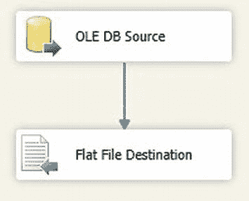
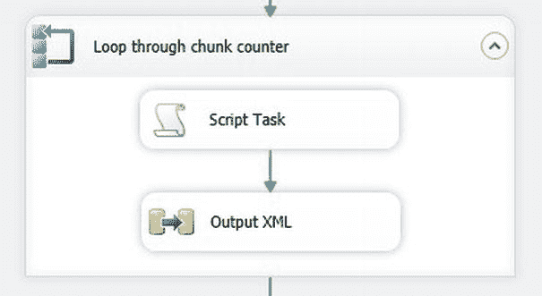
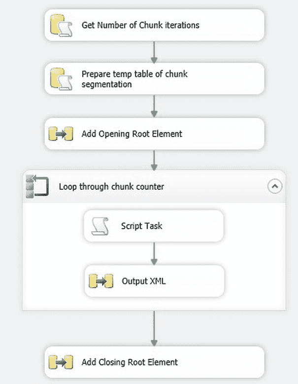

# 按如下方式进行配置

**12.** 在控制流窗格中添加一个平面文件目标任务。将 OLEDB 源任务连接到它，并双击进行编辑。将平面文件连接管理器设置为 `XMLOut`，并勾选“覆盖文件中的数据”。单击“映射”，确保源和目标之间映射了 `XMLOut` 这一单列。数据流窗格应如图 7-14 所示。



图 7-14. 用于为分块导出添加初始 XML 元素的数据流任务

**13.** 返回控制流选项卡，并添加一个 Foreach 循环容器。将其命名为 `遍历分块计数器`，并将前面的“添加起始根元素”数据流任务连接到它。按如下方式进行配置：

| InitExpression: | `@CurrentChunk` = `1` |
| :--- | :--- |
| EvalExpression: | `@CurrentChunk <= @Chunks` |
| AssignExpression: | `@CurrentChunk` = `@CurrentChunk` + `1` |

**14.** 在 Foreach 循环容器内，添加一个名为 `定义可执行变量` 的脚本任务。添加以下变量：
`ReadOnlyVariables`: User::CurrentChunk, User::LoadProcedure
`ReadWriteVariables`: User::SQLProc

**15.** 将 `ScriptLanguage` 设置为 `Microsoft Visual Basic 2010`，然后单击“编辑脚本”按钮以显示脚本编辑器。添加以下方法：

```vb
Public Sub Main()
    Dts.Variables("SQLProc").Value = "EXECUTE " & Dts.Variables("LoadProcedure").Value.ToString & " " & Dts.Variables("CurrentChunk").Value.ToString
    Dts.TaskResult = ScriptResults.Success
End Sub
```

**16.** 关闭脚本窗口，并单击“确定”以完成脚本任务的编辑。

**17.** 在 Foreach 循环容器内添加一个数据流任务。将脚本任务连接到它。将其命名为 `输出 XML` 并双击进行编辑。

**18.** 在数据流窗格中，添加一个 OLEDB 源并按如下方式配置：

| OLEDB Connection Manager: | CarSales_OLEDB |
| :--- | :--- |
| Data Access Mode: | 来自变量的 SQL 命令 |
| Variable Name: | User::SQLProc |

**19.** 单击“确定”完成 OLEDB 源的编辑。

**20.** 在控制流窗格中添加一个平面文件目标任务。将 OLEDB 源任务连接到它，并双击进行编辑。将平面文件连接管理器设置为 `XMLOut`。确保“覆盖文件中的数据”**未被**勾选。单击“映射”，确保源和目标之间映射了 `XMLOut` 这一单列。

**21.** 返回控制流窗格。Foreach 循环任务应如图 7-15 所示。



图 7-15. 循环遍历 XML 分块输出到文件

**22.** 在控制流窗格中，添加一个数据流任务。将 Foreach 循环容器连接到它，并将其命名为 `添加闭合根元素`。完全按照前面描述的“添加起始根元素”数据流任务来设置，不同之处在于 SQL 读取：

```sql
DECLARE @RootClose VARCHAR(50) = '</ROOT > '
SELECT @RootClose AS XmlOut
```

**23.** 确保脚本目标的“覆盖文件中的数据”未被勾选。

至此，包已创建完成。您可以测试大型 XML 导出。完成的包应如图 7-16 所示。



图 7-16. 用于导出大型 XML 数据集的完整 SSIS 包

