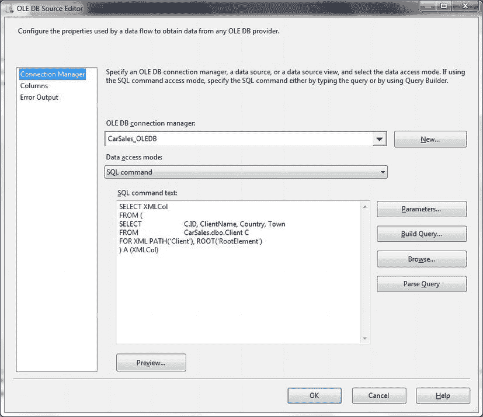
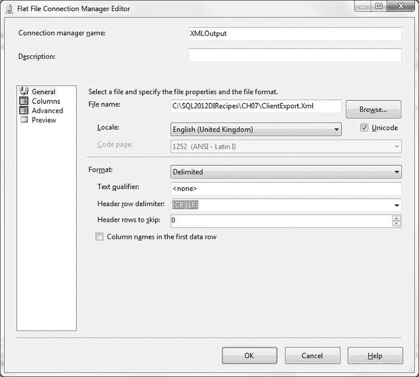

# 7-16. 常规导出小型 XML 数据集

## 问题

您需要定期导出小型 XML 数据集。

## 解决方案

使用 SSIS 导出 XML 数据。以下展示了一种处理小型数据集的特定方法。

1.  创建一个新的 SSIS 包并添加一个 OLEDB 连接管理器。连接到源数据库（本例中为 CarSales），并将其命名为 `CarSales_OLEDB`。
2.  添加一个数据流任务。双击进行编辑。
3.  添加一个 OLEDB 源并双击进行编辑。


配置如下：
-   OLEDB 连接管理器：`CarSales_OLEDB`
-   数据访问模式：`SQL 命令`
-   SQL 命令文本：
```sql
SELECT XMLCol
FROM (
    SELECT  ID, ClientName, Country, Town
    FROM    CarSales.dbo.Client
    FOR XML PATH('Client'), ROOT('RootElement')
) A (XMLCol)
```

4.  对话框应类似于 图 7-17 所示。

    

    图 7-17。在 SSIS OLEDB 源任务中定义 `FOR XML` 输出

5.  向数据流窗格添加一个平面文件目标。将 OLEDB 源组件连接到它。双击进行编辑。
6.  单击“新建”以添加一个新的平面文件连接管理器。为其命名并定义一个输出文件（本例中为 `C:\SQL2012DIRecipes\CH07\ClientExport.Xml`）。确保未选中“列名称位于第一个数据行中”，但选中了“Unicode”。对话框应类似于 图 7-18。

    

    图 7-18。作为平面文件的 XML 输出

7.  单击“确定”进行确认。
8.  在“平面文件目标编辑器”中，单击“映射”。确保只有 `XMLCol` 列，并且它在源和目标之间已映射。

就是这些！执行此包将导出一个 XML 文件。

### 工作原理

本方法所做的一切就是使用 `FOR XML PATH` 从数据源创建 XML 作为单条记录。然后将此记录作为文本文件写入磁盘。数据集**必须**足够小，以能放入 SSIS 缓冲区。

## 7-17. 使用 T-SQL 将数据导出到 Excel

### 问题

你想使用 T-SQL 将数据从 SQL Server 导出到 Excel 或 Access。

### 解决方案

使用 `OPENROWSET` 和 `OPENDATASOURCE`。方法如下（`C:\SQL2012DIRecipes\CH07\ExcelExport.sql`）：

```sql
INSERT INTO OPENROWSET('Microsoft.ACE.OLEDB.12.0','Excel 12.0; Database = C:\SQL2012DIRecipes\CH07\InsertFile.xlsx;', 'SELECT ID, ClientName FROM [Clients$]')
SELECT ID, ClientName FROM dbo.Client;
```

### 工作原理

如果你希望以最小的麻烦将数据集从 SQL Server 导出到 Excel，那么使用 `OPENROWSET` 或 `OPENDATASOURCE` 是一种干净简单的解决方案。你只需运行前面显示的 T-SQL 片段即可。

导出到 MS Office 套件——我主要指 Access 和 Excel，但偶尔也包括 Word——已成为所有开发和管理 SQL Server 数据库人员的基本要求。临时导出最好使用 `OPENROWSET` 和 `OPENDATASOURCE` 来处理。要使其工作，你必须设置一个 Excel 工作表，其中第一行包含列名（从 A1 单元格开始），并且列标题下方没有数据。此外，必须在服务器上启用即席查询——如前所述。一旦满足这些先决条件，剩下的就是一段相当简单的 T-SQL。

要使用 `OPENDATASOURCE`，请尝试以下方法：

```sql
INSERT INTO OPENDATASOURCE('Microsoft.ACE.OLEDB.12.0', 'Data Source = C:\SQL2012DIRecipes\CH07\InsertFile.xls; Extended Properties = Excel 12.0')...[Clients$]
SELECT ID, ClientName  FROM dbo.Client
```

除了将列标题放在 Excel 工作表的左上角外，你还可以将它们放在任何工作表的任何位置，并命名包含这些标题的范围。然后，你可以使用此名称代替工作表名称进行导出。一个例子可能是——假设你已将标题命名为 `DestinationRange`（`C:\SQL2012DIRecipes\CH07\ExcelRangeExport.sql`）：

```sql
INSERT INTO OPENROWSET(
    'Microsoft.ACE.OLEDB.12.0','Excel 12.0; Database = C:\SQL2012DIRecipes\CH07\InsertFile.xlsx;'
    , 'SELECT ID, ClientName FROM DestinationRange')
SELECT ID, ClientName FROM dbo.Client
```

### 提示、技巧和陷阱

-   有关如何查找和安装 OLEDB ACE 驱动程序的信息，请参阅方法 1-1。请记住在 64 位环境中使用 64 位版本。
-   `OPENROWSET` 直通查询的 `SELECT` 子句中使用的列名必须与电子表格中的列名匹配。
-   数据将附加到任何现有行之后。
-   你也可以使用 `Microsoft.Jet.OLEDB.4.0` 驱动程序，但我建议安装更新的 ACE 驱动程序，即使导出到较旧的 Excel 版本。这可以避免在意外使用较旧的（Jet）驱动程序不支持的 Excel 版本时出现意外情况。另一个优点是，你甚至不必指定正在使用哪个版本的 Excel（`8.0`、`12.0`），也不必说明你使用的是基于 Office XML 的文件格式还是较旧的二进制格式。
-   请记住在导出数据之前关闭目标文件。
-   请注意，Excel 对你可以导出的行数有限制。在 2003 版及之前是 65,536 行，之后是 1,048,576 行。

## 7-18. 使用 T-SQL 将数据导出到 Access

### 问题

你想使用 T-SQL 将数据从 SQL Server 导出到 Access。

### 解决方案

使用 `OPENROWSET` 和 `OPENDATASOURCE`。

要将 SQL Server 数据导出到 Access，请运行以下 T-SQL 片段（`C:\SQL2012DIRecipes\CH07\AccessExportOPENROWSET.sql`）：

```sql
INSERT INTO OPENROWSET('Microsoft.ACE.OLEDB.12.0','C:\SQL2012DIRecipes\CH07\TestAccess.mdb'; 'admin';'',ClientExport)
SELECT ID, ClientName FROM dbo.Client
```

### 工作原理

与 Access 的情况一样，`OPENROWSET` 和 `OPENDATASOURCE` 允许你作为 T-SQL 语句的一部分快速轻松地导出部分数据子集。你需要创建一个包含目标表（准备接收数据）的 Access 数据库。还必须在服务器上启用即席查询。此片段将行插入到 `TestAccess.mdb` 数据库中的 `ClientExport` 表中。数据将附加到目标表中的任何现有行之后。

要使用 `OPENDATASOURCE`，请尝试以下方法（`C:\SQL2012DIRecipes\CH07\AccessExportOpendatasource.sql`）：

```sql
INSERT INTO OPENDATASOURCE('Microsoft.ACE.OLEDB.12.0', 'Data Source = C:\SQL2012DIRecipes\CH07\TestAccess.mdb;')...ClientExport
SELECT ID, ClientName  FROM dbo.Client;
```

### 提示、技巧和陷阱

-   如果你的 Access 数据库受保护，你需要将 `OPENROWSET` 命令中的 `'admin';` 和 `'';` 替换为有效的用户名和密码。
-   你可以将表名替换为 `SELECT` 查询（用单引号括起来，就像 Excel 一样）来指定目标表中的列。同样，源和目标中的列名不必完全相同，但列顺序必须匹配。
-   有关如何使用受 Access 工作组（`.mdw`）文件保护的数据库，请参阅第 1 章。

## 7-19. 从 T-SQL 安全地将数据导出到 Excel

### 问题

你想安全地将数据导出到 Excel——即不在 T-SQL 代码中暴露安全信息。

### 解决方案

创建一个链接服务器指向 Excel 工作簿。

要使用指向 Excel 的链接服务器导出数据，请执行以下步骤。

1.  设置一个链接服务器。代码大致如下所示：

    ```sql
    EXECUTE sp_addlinkedserver
        EXCEL_SQL,                            -- 链接服务器名称
        'Jet 4.0',                            -- （纯装饰性的）产品名称
        'Microsoft.Jet.OLEDB.4.0',            -- 已安装的驱动程序
        'C:\SQL2012DIRecipes\CH07\InsertFile.xls',    -- 目标文件和路径
        NULL,                                 -- 位置——未使用
        'Excel 8.0';                          -- 提供程序字符串，指定 Excel 版本
    GO
    ```

2.


