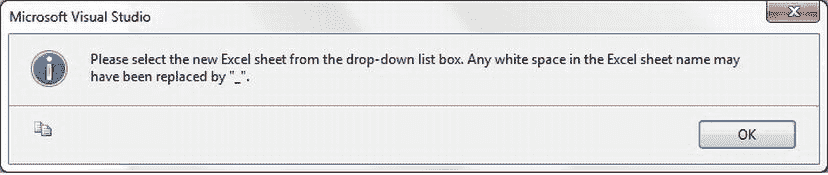
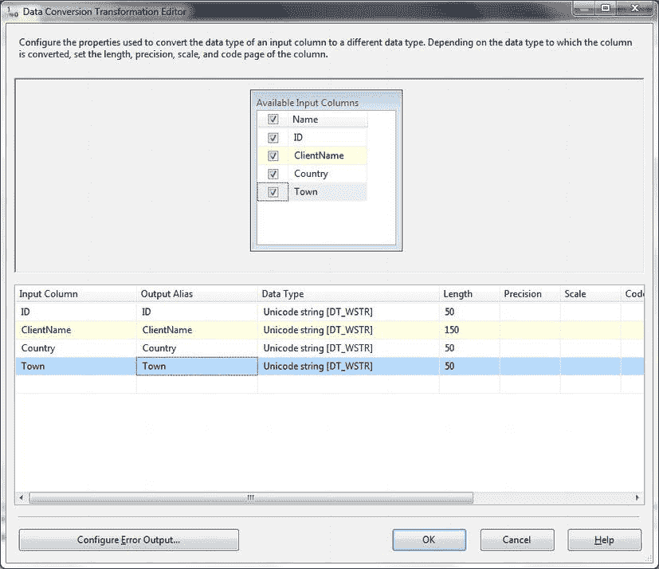

# 7-21. 使用 SSIS 将数据导出到 Excel

## 问题

你希望定期将数据导出到 Excel。

## 解决方案

使用 Excel 目标作为 SSIS 数据流任务的一部分。

要使用 SSIS 将数据导出到 Excel，请执行以下步骤。

1.  创建一个新的 SSIS 包并添加一个 OLEDB 连接管理器。将其命名为 `CarSales_OLEDB` 并配置它连接到你的源服务器。添加一个数据流任务并双击进行编辑。
2.  添加一个新的 OLEDB 源组件，并将其配置为你刚刚添加的 `CarSales_OLEDB` 连接管理器。选择一个源表或输入一个 SQL 查询来定义源列。
3.  添加一个新的 Excel 目标任务。将源任务连接到它。双击进行编辑。
4.  单击“浏览”以创建一个新的 Excel 文件（或选择一个现有的 Excel 文件）——或者甚至可以直接键入文件路径，无论新旧。选择要导出到的 Excel 版本，然后单击“确定”。
5.  如果你正在创建一个 Excel 文件——或者你想向现有文件添加一个新的工作表——请单击“新建”，然后单击“确定”以创建工作表。
6.  如果你创建了一个新工作表，请在出现以下消息时单击“确定”（参见图 7-19）。
    
    图 7-19. 新工作表警告
7.  从“Excel 工作表名称”下拉列表中，选择要用作 Excel 目标的工作表。
8.  单击“映射”，将所有源列映射到所有目标列。
9.  单击“确定”。

你的 SQL Server 数据将被导出到 Excel 工作簿中。

## 工作原理

作为可能最常用的导出流程之一，使用 SSIS 将数据输出到 Excel 简单得令人欣慰。你甚至不必先创建目标文件，只需确保使用 Excel 目标任务即可。你可能更希望——或者需要——使用 ACE 提供程序来成功导出数据。如果是这种情况，在创建目标 OLEDB 提供程序时（步骤 2），从弹出列表中选择“Microsoft Office 12.0 Access Database Engine OLEDB Provider”。然后，你将需要键入或粘贴 Access 数据库的完整路径作为服务器或文件名。

你会注意到，如果你的源数据包含任何非 Unicode（即 `VARCHAR`）列，那么目标任务会指出问题。有两种解决方法：

*   使用 SQL 语句选择源数据，并使用 `CAST` 或 `CONVERT` 将源数据类型更改为 `NVARCHAR`。
*   在源和目标之间添加一个数据转换任务，并将所有非 Unicode 列转换为 Unicode 字符串 [DT_WSTR]。将输出别名也设置为原始列名可能会更方便——类似于图 7-20 中的样子。
    
    图 7-20. SSIS 中用于 Excel 导出的数据转换

在映射列时，确保你映射的是**已转换**的列——名为 `Copy of ColumnName` 或 `DataConversion.ColumnName`。如果你在添加目标任务之前添加数据转换任务，那么映射会稍微复杂一些，因为源列和目标列都会出现在“创建表”对话框中——而你将必须删除重复的（非 Unicode）列。此外，这会使 SSIS 更难映射到正确的输出数据类型。

#### 提示、技巧与陷阱

*   与导出到 Office 应用程序一样，你是处于 32 位还是 64 位环境的问题可能会产生广泛的影响。这些与配方 1-1 中解释的相同。
*   如果你愿意，可以在创建新工作表时从 OLEDB 目标重命名 Excel 工作表。
*   Excel 数据类型映射的复杂性在配方 1-3 中有解释。

