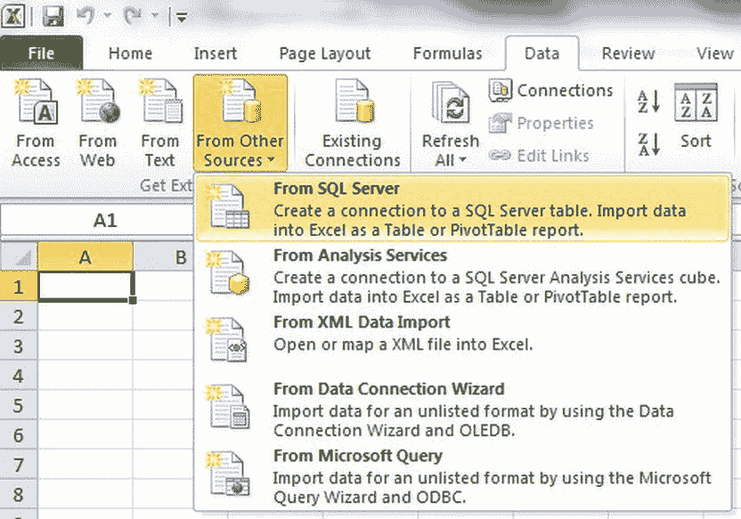
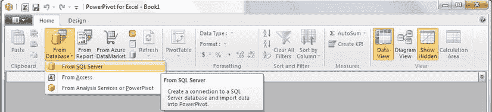
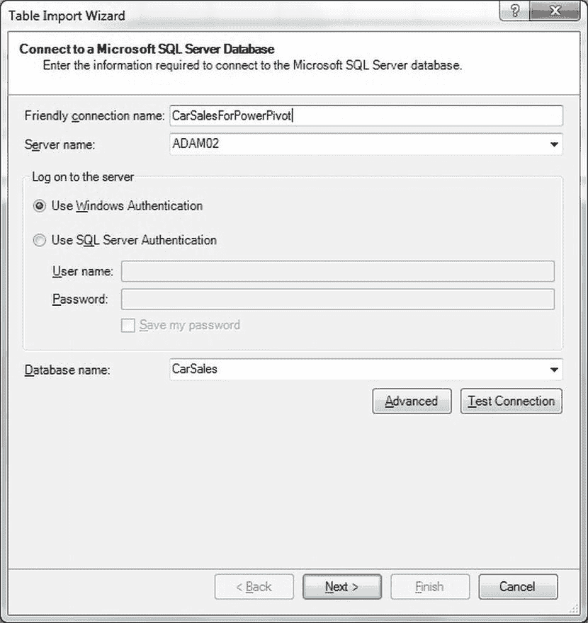
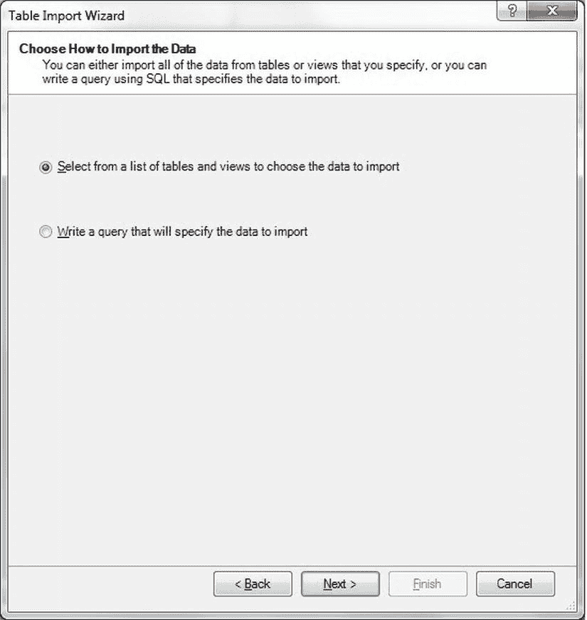
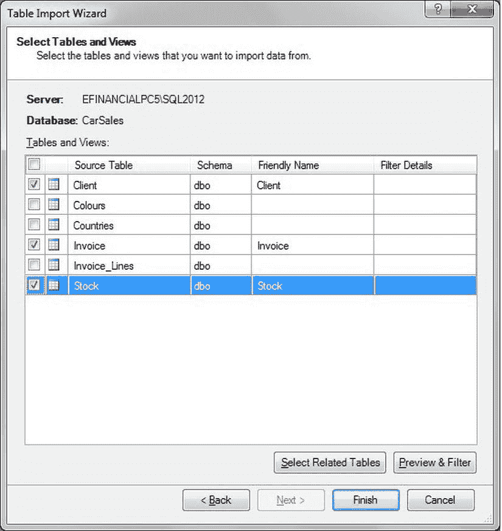
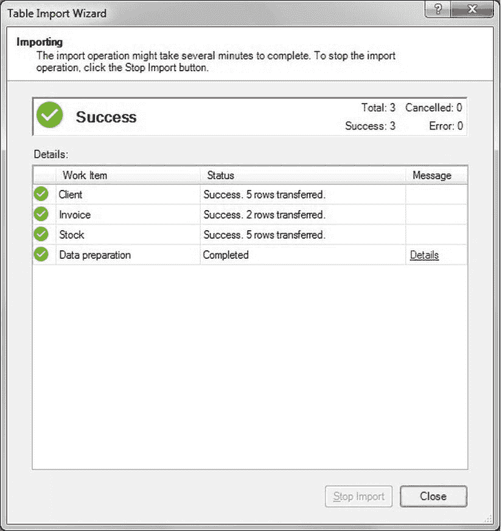

# 7-22. 从 Office 应用程序中拉取数据

## 问题
你想将 SQL Server 数据“拉取”到 Access、Excel 或 Word 中。

## 解决方案
使用 Access、Excel 和 Word 中的链接和/或导入选项。

由于从 MS Office 应用程序拉取数据有多种方法，我将把各种场景作为独立的小配方来处理。

### 将 Excel 链接到 SQL Server 数据库
将 Excel 链接到 SQL Server 数据库：

1.  单击“数据”以激活“数据”选项卡。选择“自其他来源” “来自 SQL Server”（参见 图 7-21）。

    

    图 7-21.  将 Excel 链接到 SQL Server 数据库

2.  输入服务器名称和凭据（如果未使用受信任连接）。单击“下一步”。
3.  选择你希望连接的数据库。选择一个表或视图。单击“下一步”。
4.  输入数据连接文件（以及路径，如果需要）。这将允许你重用该连接。如果需要，可以调整参数。单击“完成”。
5.  选择或确认数据的左上角目标单元格，然后单击“确定”。如果使用 SQL Server 连接，系统提示时请重新输入密码。

单击“数据”选项卡中的“刷新”按钮，会用 SQL Server 中的最新数据更新 Excel 工作簿。

### Access 链接或导入的表
将 Access 链接到 SQL Server 数据源：

1.  单击“外部数据”以激活“外部数据”选项卡。单击“ODBC 数据库”。
2.  从以下选项中选择一个：
    *   将源数据导入当前数据库的新表中。
    *   通过创建链接表链接到数据源。
3.  选择——或创建一个 DSN（在第 4 章的**配方 4-6** 和 **4-10** 中描述）。
4.  选择所有你想要链接到——或导入的表。如果未使用受信任连接，请勾选“保存密码”。单击“确定”。

源数据将被导入到 Access 中。

### 将 Word 链接到 SQL Server
要在 Word 的邮件合并中使用 SQL Server 数据：

1.  在 Word 中，激活“邮件”选项卡。单击“开始邮件合并”。选择邮件合并类型，例如“信函”。
2.  单击“选择收件人”，然后单击“使用现有列表”，接着选择“新建源”。
3.  在数据连接向导中，选择 **Microsoft SQL Server** 作为数据源，然后单击“下一步”。
4.  输入服务器和连接凭据（或确认将使用集成安全性）。单击“下一步”。
5.  选择源表，然后单击“完成”。

源数据现在可以在 Word 邮件合并中使用了。

### 使用 PowerPivot
从 PowerPivot 导入数据：

1.  激活 PowerPivot 选项卡。单击“PowerPivot 窗口”。PowerPivot 将打开。
2.  在“开始”选项卡中，单击“从数据库” “从 SQL Server”。如 图 7-22 所示。

    

    图 7-22.  从 PowerPivot “开始”选项卡选择 SQL Server 数据源

3.  定义所有连接选项（至少包括服务器名称、数据库、身份验证模式，以及任何你希望使用的其他可用选项），如 图 7-23 所示。

    

    图 7-23.  PowerPivot 数据导入的配置信息

4.  单击“下一步”。
5.  选择是选择一个表或一组表（或视图），还是编写特定的查询来输出数据，如 图 7-24 所示。

    

    图 7-24.  选择导入表列表或编写查询将数据导入 PowerPivot

6.  单击“下一步”。
7.  选择表或编写查询。针对 `CarSales` 数据库的示例如 图 7-25 所示。

    

    图 7-25.  从 CarSales 数据库中选择表

8.  单击“完成”。表导入向导的最终窗格将出现，如 图 7-26 所示。

    

    图 7-26.  从 CarSales 数据库中选择表

9.  数据传输到 PowerPivot 后，单击“关闭”以关闭对话框。

## 工作原理
尽管到目前为止本章一直在讨论从 SQL Server 推送数据，但有时你也会需要拉取数据。通常，我会说这是处理目标应用程序的人员的责任。


然而，在微软 Office 产品的情况下，我做了一个例外，并解释了一些方法，说明 Excel、Access 甚至 Word 如何将 SQL Server 数据提取到它们各自的工作表、数据库和文档中。我这样做的原因很简单：当数据库管理员（DBA）无法将 SQL Server 数据导入到他/她的 MySQL 服务器时，这是他们的问题。但当一位微软 Office 用户（甚至是高级用户）无法将 SQL Server 数据导入到他/她的应用程序时，这通常也成了 SQL Server 开发人员或 DBA 的问题。

为了避免在面对用户要求他们的数据立即可用时感到尴尬，以下是将 SQL Server 数据提取到微软 Office 应用程序中的经典方法。在这些方法中，我使用的是 Office 2010。这些技术与 Office 2007 或 Office 2013 中的技术几乎相同。对于更早版本的 Office，我只能建议你以此作为模板，因为原理是相同的；变化的只是界面。

请记住，Excel 允许你通过 `ODBC` 连接到 SQL Server。它将存储你对数据源建立的所有工作簿连接，你可以通过点击 `数据` 功能区中的 `连接` 按钮来重新使用它们。对于 `Analysis Services` 链接，请在 `来自其他源` 弹出菜单中选择 `来自 Analysis Services`。

Access 也允许你通过 `ODBC` 链接到 SQL Server 或导入数据。自 Access 2007 以来，链接到 SQL Server 表或导入表的过程几乎相同。

无疑，将微软 Word 链接到 SQL Server 数据库有很多理由。可能是因为你有一份需要来自 SQL Server 数据的报告，该数据必须包含并在数据更改时更新；也可能是因为你正在使用 Word 作为邮件合并（通常称为 mailings 或 mailmerge）的前端。在这里，我再次解释了如何使用 Word 2007 及更高版本，并让你自己调整过程以适应更早的版本。哦，如果你想知道这与 SQL Server 开发人员到底有什么关系，我只能建议你每次在最终用户想要使用企业数据进行邮件合并时，都要一瓶酒。你很快就会有一个很棒的酒窖！由于解释制作邮件合并的所有微妙之处超出了本书的范围，我建议你从此刻起，利用书籍和网络上一些优秀的资源来帮助你。

不可避免地，新加入的 `PowerPivot` 可以从 SQL Server 和 SQL Server Analysis Services 导入数据。这可以通过 `PowerPivot` 功能区完成。前提是 `PowerPivot` 已成功安装且 Excel 已打开。


**注意** 当前版本的 `PowerPivot` 可以在 `www.microsoft.com/en-gb/download/details.aspx?id = 29074` 找到。

### 提示、技巧和陷阱
*   `PowerPivot` 的一个聪明选项是，如果你在第 7 步点击 `选择相关表` 按钮，它会自动选择所有表（包括直接的上下游表，使用所有选定表的外键约束）。
*   `预览和筛选` 按钮允许你应用数据源筛选器和排序。
*   虽然微软 Word 邮件合并连接不允许你编写自定义查询，但你始终可以在 SQL Server 中创建一个视图来连接表、聚合、筛选和排序数据，为邮件合并过程做好准备。
*   点击 `编辑收件人列表` 按钮（在 `邮件` 功能区中）会显示 `邮件合并收件人` 对话框，该对话框将让你：
    *   筛选数据集。
    *   对源数据进行排序。
    *   查找重复项并选择要使用的记录。
    *   搜索源数据。

## 7-24. 使用 T-SQL 导出存储在 SQL Server 中的文件

### 问题
你希望作为脚本化 T-SQL 过程的一部分，将存储在 SQL Server 表中的二进制文件导出。

### 解决方案
使用 `BCP`，借助特定格式来处理导出文件，以导出二进制文件。以下步骤展示了如何完成。

1.  创建一个如下所示的格式文件 (`C:\SQL2012DIRecipes\CH07\BinaryExport.fmt`)：
    ```
    11.0
    1
    1       SQLBINARY           0       0       ""   1     CarPhoto             ""
    ```

2.  使用以下 T-SQL 从表中导出所有二进制文件 (`C:\SQL2012DIRecipes\CH07\BinaryExport.sql`)：
    ```
    DECLARE @SQLTEXT VARCHAR(8000);
    DECLARE @Make VARCHAR(50), @CarPhotoType VARCHAR(5);
    DECLARE @CarPhoto VARBINARY(MAX);
    DECLARE @ID INT;

    DECLARE BCPBinaryOUT_CUR CURSOR
    FOR
    SELECT  ID, Make, CarPhotoType, CarPhoto
    FROM    dbo.Stock
    WHERE   CarPhotoType IS NOT NULL;

    OPEN BCPBinaryOUT_CUR;
    FETCH NEXT FROM BCPBinaryOUT_CUR INTO @ID, @Make, @CarPhotoType, @CarPhoto

    WHILE @@FETCH_STATUS = 0
    BEGIN
        SET @SQLTEXT = 'BCP "SELECT CarPhoto FROM CarSales.dbo.Stock WHERE ID = ' + CAST(@ID AS VARCHAR(11)) + '" QUERYOUT C:\SQL2012DIRecipes\CH07\' + @Make + '.'+ @CarPhotoType + '-fC:\SQL2012DIRecipes\CH07\Binary.Fmt -SAdam02 -UAdam –PMe4B0ss';
        FETCH NEXT FROM BCPBinaryOUT_CUR INTO @ID, @Make, @CarPhotoType, @CarPhoto
        EXECUTE master.dbo.xp_cmdshell @SQLTEXT
    END;

    CLOSE BCPBinaryOUT_CUR;
    DEALLOCATE BCPBinaryOUT_CUR;
    ```

### 工作原理
如果你正在使用 SQL Server 存储 **L**arge **OB**jects（**大对象**，`LOB`），那么有时你将需要从一个表中导出部分、大部分或全部数据。

如果你正在使用 T-SQL 导出 `BLOB`（**B**inary **L**arge **OB**ject，**二进制大对象**），那么你将需要一个包含定义 `VARBINARY` 数据类型的单列的格式文件。然后，你在 `BCP` 导出（`BCP OUT`）中使用此格式文件。这里的 SQL 使用游标遍历表中的所有记录，并导出表中所有的 `BLOB`。

### 提示、技巧和陷阱
*   确保你使用动态 SQL 创建的文件名是唯一的，否则该过程会愉快地覆盖任何现有文件。使用唯一的 `ID` 或保证文件名唯一的字段组合是一种方法。如果所有方法都失败，请使用一个 SQL 变量，每导出一个文件就递增它。
*   配方 7-5 中提到的所有风险、DBA 可能的拒绝以及关于 `xp_cmdshell` 的警告，这里也同样适用。
*   不幸的是，似乎无法使用较新的 XML 格式文件来完成此操作。
*   此方法仅适用于“标准” `VARBINARY(MAX)` 字段，而不适用于超过 2 GB 大小的 `FILESTREAM` 或 `FILETABLE` 文件。
*   如果你使用的是 SQL Server 2008，格式文件必须以 `10.0` 开头；对于 SQL Server 2005，格式文件必须以 `9.0` 开头。

## 7-25. 定期导出存储在 SQL Server 中的文件

### 问题
你希望作为受控导出过程的一部分，将存储在 SQL Server 表中的二进制文件导出。

### 解决方案
在 `数据流` 中使用 `SSIS` `导出列` 任务将二进制文件输出到磁盘，如下列步骤所述。

1.  创建一个新的 `SSIS` 包并添加一个 `OLEDB` 连接管理器。将其命名为 `CarSales_OLEDB` 并连接到你的源数据库（在此示例中为 `CarSales`）。
2.  添加一个 `数据流` 任务，双击进行编辑，并添加一个 `OLEDB` 源组件。配置如下：

    | OLEDB 连接管理器: | `CarSales_OLEDB` |
    | 数据访问模式: | `SQL 命令` |
    | SQL 命令文本: | `SELECT CarPhoto, 'C:\SQL2012DIRecipes\CH07\' + Make + '.' + CarPhotoType AS FilePath` |
    | | `FROM dbo.Stock` |
    | | `WHERE CarPhotoType IS NOT NULL` |

3.  点击 `确定` 确认你的修改。
4.  向 `数据流` 面板添加一个 `导出列` 任务。将 `OLEDB` 源控制连接到它。双击 `导出列` 任务进行编辑。


