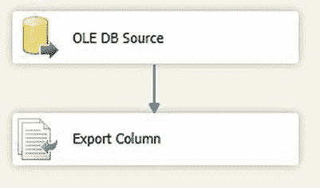
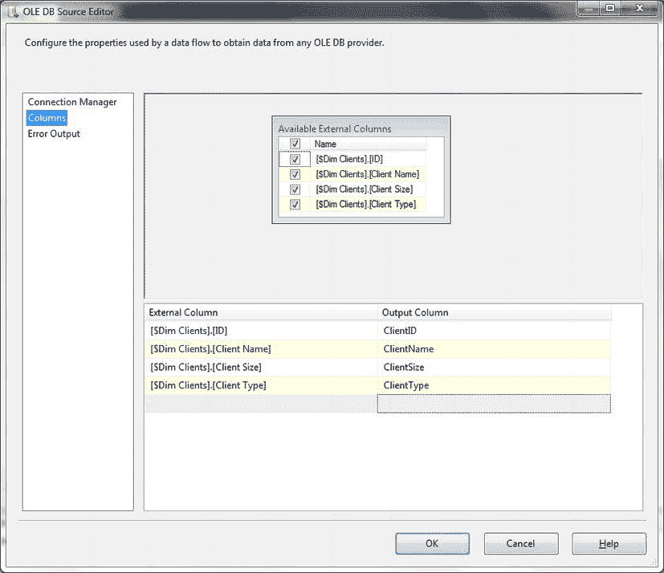
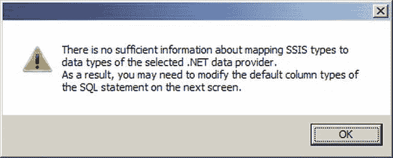

# SSIS 数据导出与 SSAS 数据访问

## 使用 SSIS 导出存储在 SQL Server 中的文件

配置如下：
| 提取列： | CarPhoto |     | 文件路径列： | FilePath |
| :--- | :--- | :--- | :--- | :--- |

5.  点击“确定”确认修改。数据流面板应如图 7-27 所示。
    
    *图 7-27. 使用 SSIS 导出存储在 SQL Server 中的文件*

现在可以执行 SSIS 任务。所有 BLOB 对象都将被提取到目标目录。

### 工作原理
幸运的是，使用 SSIS 导出任何大型对象（二进制或文本）都非常容易，因为 SSIS 开发团队已经提供了一个专门的 SSIS 数据流转换来实现此功能——即“导出列”任务。由于这是一个数据流，你甚至不需要使用 `Foreach Loop` 容器来确定要复制到磁盘的文件，只需为源表中的每条记录拼接一个唯一的文件名即可。必须确保创建的文件具有唯一的名称，否则该过程会毫无警告地覆盖任何现有文件。使用唯一 ID 或字段组合来保证文件名唯一是实现这一点的方法之一。

### 提示、技巧和陷阱
- 如果你愿意，可以将文件路径列组装为派生列，并使用 SSIS 变量和列数据来定义输出路径。
- 使用此技术时，文件大小不能超过 2 GB。
- 导出 BLOB（我也用这个来指代字符大型对象）时，SQL 语句可能如下所示：
    ```sql
    SELECT   CarDocumentation, CAST('C:\SQL2012DIRecipes\CH07\' + Make + '.txt'
              AS NVARCHAR(MAX)) AS FilePath
    FROM     dbo.Stock
    WHERE    CarDocumentation IS NOT NULL;
    ```

## 7-26. 偶尔使用 T-SQL 从 SSAS 导出数据

### 问题
你希望偶尔从 SSAS 多维数据集导出表格数据。

### 解决方案
使用 `OPENROWSET` 以表格格式导出数据。
执行此操作的代码如下（`C:\SQL2012DIRecipes\CH07\SSASExport.sql`）：
```sql
INSERT INTO OPENROWSET('Microsoft.ACE.OLEDB.12.0','Text;Database = C:\CookBook\;',
    'SELECT Client_Name, Sale_Price, Cost_Price FROM InsertMDXFile.txt')
SELECT CS.[[Dim Clients]].[Client Name]].[Client Name]].[MEMBER_CAPTION]]] AS Client_Name,
       CS.[[Measures]].[Sale Price]]] AS Sale_Price,
       CS.[[Measures]].[Cost Price]]] AS Cost_Price
FROM OPENROWSET(
    'MSOLAP',
    'DATASOURCE = localhost; Initial Catalog = CarSales_OLAP;',
    'SELECT {[Measures].[Sale Price], [Measures].[Cost Price]} ON COLUMNS,
           NONEMPTY(EXCEPT([Dim Clients].[Client Name].MEMBERS, [Dim Clients].[Client Name].[All])) ON ROWS
    FROM [Car Sales DW]'
) AS CS;
```

### 工作原理
在讨论从 SQL Server 导出数据时，很容易忘记 SQL Server 也包含 SQL Server Analysis Services (SSAS)，并且有时也需要从这里导出数据。虽然技术上并不困难，但你需要记住多维数据结构与关系型结构有根本不同，并且必须在一定程度上“扁平化”导出的数据。

`OPENROWSET` 允许你向 OLAP 数据源发送传递查询，就像可以向任何受支持的关系型数据源发送一样。查询 Analysis Services 时，这意味着需要确保已安装 MSOLAP 提供程序。假设已安装，你可以将 MDX 查询作为 `OPENROWSET` 命令的查询部分来编写，并返回一个数据集，然后可以将其导出为文本文件、Excel 工作表、Access 数据库或 BCP 文件。

本方法有趣之处在于，你不仅使用 `OPENROWSET` 从 SSAS 返回数据，还将此数据集作为文本文件输出到磁盘。

`OPENROWSET` 命令使用了别名，这没有问题。
难点在于 MDX 查询返回列标题的方式。按 SQL Server 返回的方式输入列标题会导致类似以下的错误消息：
```sql
Msg 207, Level 16, State 1, Line 3
Invalid column name 'Dim Clients'.
Msg 207, Level 16, State 1, Line 4
Invalid column name 'Measures'.
Msg 207, Level 16, State 1, Line 5
Invalid column name 'Measures'.
```
将整个列名用方括号括起来也无济于事。诀窍在于理解右方括号是一个转义字符。因此，你需要做的是：
- 为每个现有的右方括号添加一个额外的右方括号。
- 用方括号括住每个列的整个标题文本。
- 确保不要重复括住整个列标题的最后一个右方括号——这样你将得到一个可用且可操作的结果集。

导出 SSAS 数据的难点在于编写一个正确且高效的 MDX 查询以传递给 SSAS。我只能向你推荐许多关于 MDX 的优秀书籍和其他可用资源来帮助解决这个问题，因为讨论 MDX 超出了本书的范围。

### 提示、技巧和陷阱
- 与所有使用 `OPENROWSET` 的临时导出一样，目标文件必须存在，且列名必须出现在文件中。
- 然而，你需要记住 MDX 查询和 SQL 查询是非常不同的，并且不是每个返回数据的 MDX 查询都能以你期望的方式（如果能够的话）将数据返回给 T-SQL 查询。
- 要使用 BCP 导出 MDX 数据，我建议先使用 `OPENROWSET` 命令将 SSAS 数据插入数据库表，然后使用 BCP 导出此表。之后可以在数据库中删除该表。
- 要连贯地输出数据，你需要对 MDX 有不止是浅显的了解，因此如果 MDX 尚未成为你技能集的一部分，请准备好应对陡峭的学习曲线。

## 7-27. 定期使用 T-SQL 从 SSAS 导出数据

### 问题
你希望定期使用 T-SQL 从 SSAS 多维数据集导出表格数据。

### 解决方案
配置一个链接服务器以连接到 SSAS，然后通过链接服务器连接以表格格式导出数据。我将向你展示如何操作。

1.  创建一个名为 **SSASData** 的目标表，该表已设置为保存源数据，创建语句如下（`C:\SQL2012DIRecipes\CH07\tblSSASData.sql`）：
    ```sql
    CREATE TABLE dbo.SSASData(
        Client_Name NVARCHAR (250) NULL,
        Sale_Price INT NULL,
        Cost_Price INT NULL
    ) ;
    ```
2.  添加一个名为 **OLAPSERVER** 的链接服务器，使用以下代码片段（`C:\SQL2012DIRecipes\CH07\SSASExportLinkedServer.sql`）：
    ```sql
    EXEC master.dbo.sp_addlinkedserver @server = N'OLAPSERVER', @srvproduct = N'Analysis Services', @provider = N'MSOLAP', @datasrc = N'localhost'
    ```
3.  运行以下代码片段将 SSAS 数据提取到 SQL Server 表中（`C:\SQL2012DIRecipes\CH07\SSASToSQL.Sql`）：
    ```sql
    INSERT INTO SSASData (Client_Name, Sale_Price, Cost_Price)
    SELECT
        CS.[[Dim Clients]].[Client Name]].[Client Name]].[MEMBER_CAPTION]]] AS Client_Name,
        CS.[[Measures]].[Sale Price]]] AS Sale_Price,
        CS.[[Measures]].[Cost Price]]] AS Cost_Price
    FROM OPENQUERY(OLAPSERVER,
        'SELECT
            {[Measures].[Sale Price], [Measures].[Cost Price]} ON COLUMNS,
            NONEMPTY(EXCEPT([Dim Clients].[Client Name].MEMBERS, [Dim Clients].[Client Name]. [All])) ON ROWS
        FROM [Car Sales DW]
        WHERE [Dim Products].[ProductVehicleHierarchy].[Product Type].&[Van]'
        ) AS CS;
    ```

### 工作原理
如果你将定期执行 OLAP 到 SQL 的输出，那么设置一个链接服务器可能是更好的选择。


#### 提示、技巧与陷阱

*   链接服务器源可以向 `OPENROWSET` 查询或另一个链接服务器传递数据——无论是 SQL Server、Access、Excel、平面文件还是其他关系数据库。这些技术在本章其他地方有所描述。

### 7-28. 使用 SSIS 导出 SSAS 维度

#### 问题

您希望将 SSAS 维度的数据作为定期、受控导出流程的一部分导出。

#### 解决方案

使用 SSIS 连接到 SSAS 多维数据集并导出数据。我将解释如何操作。

1.  创建一个新的 SSIS 包。添加一个名为 `OLAP_Source` 的 OLEDB 连接管理器，配置如下：
    | OLEDB 提供程序： | Microsoft OLEDB Provider for Analysis Services 11.0 |
    | --- | --- |
    | 服务器或文件名： | localhost（如果 SSAS 实例在另一台机器上，请使用您的实例名） |
    | 初始目录： | CarSales_OLAP（在我的示例中使用——请使用您的 SSAS 数据库以处理您的数据）。 |

2.  添加一个新的平面文件目标。将其命名为 `SSASOutFlatFile` 并指定文件位置。勾选 Unicode 复选框和“列名在第一行中”。
3.  转到“高级”选项卡并添加四个新列。定义类型如下：
    | 名称 | 数据类型 | 输出列宽度 |
    | --- | --- | --- |
    | ID | 四字节有符号整数 |  |
    | ClientName | 字符串 [DT_STR] | 50 |
    | ClientSize | 四字节有符号整数 |  |
    | WholesaleRetail | 字符串 [DT_STR] | 20 |

4.  确认您的修改并点击“确定”。
5.  添加一个数据流任务。双击进行编辑。
6.  在“数据流”窗格中，添加一个 OLEDB 源。配置如下：
    | OLEDB 连接管理器： | OLAP_Source |
    | --- | --- |
    | 数据访问模式： | 表或视图 |
    | 表或视图的名称： | [Car Sales DW].[$Dim clients] |

7.  单击“列”并将所有输出列别名为更简单的名称，不带方括号或空格，如 图 7-28 所示。

    
    图 7-28.  重命名从 SSAS 输出的列

8.  确认您的修改并点击“确定”。
9.  添加一个平面文件目标。将“复制列”任务连接到它。它应默认使用 `SSASOutFlatFile` 连接管理器——如果不是，请选择它。单击“映射”并确保仅复制的列映射到目标列。
10. 确认您的修改并点击“确定”。

#### 工作原理

仿佛是为了证明其作为优秀全能数据传输工具的资质，SSIS 也能从 Analysis Services 导出数据。更重要的是，它可以导出到任何标准数据流目标。事实上，SSAS 与其他任何 OLEDB 或 ADO.NET 数据源非常相似，以至于几乎没有不寻常之处值得特别说明。

例外之处在于维度数据源与关系或平面文件源非常不同，并且可能需要仔细的 MDX 查询才能输出您想要的确切数据，且形式需为 SSIS 可以处理的格式。

作为 SSIS 处理 SSAS 的入门，从简单的维度提取开始可能最容易。毕竟，SSAS 中的维度与关系表非常相似。这里我们导出为平面文件——但您可以导出到任何 SSIS 目标。

#### 提示、技巧与陷阱

*   您应该使用服务器上安装的 Analysis Services 提供程序。版本将与安装的 SSAS 版本相对应。
*   如果您使用旧版本的 SSIS 并将数据导出到关系表，您必须小心指定目标列，尤其是数据类型，因为 SSAS 没有提供足够的信息让目标组件完美创建表——警告对话框会说明这一点（见 图 7-29）。
    
    图 7-29.  SSAS 2005/2008 中的数据类型警告

*   您可能总是需要先仔细考虑目标表，然后在创建 SSIS 包之前在目标服务器上创建它。在这个特定示例中，DDL 是：
    ```sql
    CREATE TABLE SSASExport
    (
     [ID] INT,
     [Client Name] NVARCHAR(50),
     [Client Size] INT,
     [Wholesale Retail] NVARCHAR(20)
    );
    GO
    ```

### 7-29. 在 SSIS 中导出 MDX 查询的结果

#### 问题

您希望使用复杂的 MDX 查询，定期将表格化的 SSAS 数据传输到 SQL Server 表中。

#### 解决方案

使用 SSIS 数据流任务导出数据。我将向您展示如何操作。

1.  创建一个名为 `CubeOutput` 的目标表，该表已预先设置为保存源数据，创建如下 (`C:\SQL2012DIRecipes\CH07\tblCubeOutput.sql`)：
    ```sql
    CREATE TABLE CarSales_Staging.dbo.CubeOutput
    (
     ClientName NVARCHAR(250),
     SalePrice NVARCHAR (250),
     CostPrice NVARCHAR (250)
    );
    GO
    ```

2.  创建一个新的 SSIS 包。添加一个名为 `OLAP_Source` 的 ADO.NET 连接管理器，配置如下：
    | ADO.NET 提供程序： | .NET Providers for OLEDB \Microsoft OLEDB Provider for Analysis Services 11.0 |
    | --- | --- |
    | 服务器或文件名： | localhost（如果 SSAS 实例在另一台机器上，请使用您的实例名） |
    | 初始目录： | CarSales_OLAP（在我的示例中使用——请使用您的 SSAS 数据库以处理您的数据）。 |

3.  单击对话框左侧的“全部”，向上滚动到“扩展属性”，并输入 `FORMAT = TABULAR`。
4.  添加一个名为 `OLEDB_Destination` 的 OLEDB 连接管理器，配置如下：
    | OLEDB 提供程序： | SQL Server Native Client 11.0 |
    | --- | --- |
    | 服务器或文件名： | ADAM02（替换为您的 SQL 实例） |
    | 初始目录： | CarSales（或您的数据库） |

5.  添加一个数据流任务。双击进行编辑。在“数据流”窗格中，添加一个 ADO.NET 源。配置如下：
    | ADO.NET 连接管理器： | OLAP_Source |
    | --- | --- |
    | 数据访问模式： | SQL 命令 |
    | SQL 命令文本： | `WITH MEMBER` |
    |  | `[Measures].[SalePrice] AS CSTR([Measures].[Sale Price])` |
    |  | `MEMBER [Measures].[CostPrice] AS CSTR([Measures].[Cost Price])` |
    |  | `SELECT` |
    |  | `{[Measures].[SalePrice], [Measures].[CostPrice]}` |
    |  | `ON COLUMNS,` |
    |  | `NONEMPTY(EXCEPT([Dim Clients].[Client Name].MEMBERS, [Dim Clients].[Client Name].[All]))` |
    |  | `ON ROWS` |
    |  | `FROM [Car Sales DW]` |

6.  确认您的修改并点击“确定”。单击“确定”忽略警告消息。
7.  添加一个 OLEDB 目标任务，并将源任务连接到它。


