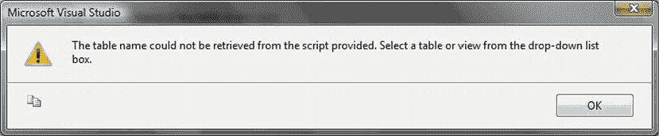

# 7-31. 使用 SSIS 将数据导出到其他关系型数据库

## 问题

你希望使用 SSIS 将数据导出到外部关系型数据库管理系统（RDBMS）。

## 解决方案

使用带有 OLEDB 目标组件的 SSIS 数据流，并配置一个针对第三方数据库的 OLEDB 连接管理器。

以下解释了如何将数据从 SQL Server 导出到 Oracle。

1.  创建一个新的 SSIS 包。添加一个新的 OLEDB 连接管理器，配置为连接到你的 SQL Server 源。将其命名为 `CarSales_OLEDB`。
2.  添加一个新的 OLEDB 连接管理器，将其命名为 `Oracle_OLEDB` 并按如下方式配置：

| 提供程序： | Oracle Provider for OLEDB |
| --- | --- |
| 服务器或文件名： | 你的 Oracle 实例 |
| 用户名： | 你的 Oracle 登录名 |
| 密码： | 你的 Oracle 密码 |

3.  添加一个 OLEDB 源组件。将其配置为使用 `CarSales_OLEDB` 连接管理器。选择一个源表或输入一个 SQL 查询。在此示例中，我将使用 `Clients` 表。
4.  添加一个 OLEDB 目标组件。将其配置为使用 `Oracle_OLEDB` 连接管理器。将 `AlwaysUseDefaultCodePage` 属性设置为 `True`。将数据访问模式设置为“表或视图”，然后单击“新建”创建一个新表——或选择一个现有表。

### 配置如下

| | |
| --- | --- |
| OLEDB 连接管理器： | `OLEDB_Destination` |
| 数据访问模式： | 表或视图 – 快速加载 |
| 表或视图的名称： | `CubeOutput` |

8.  将（名称特殊的）源列映射到目标列，然后单击“确定”。

### 工作原理

导出 MDX 查询的结果与之前“配方”中描述的过程几乎完全相同，因此我将不再在此重复解释原理。我承认将 MDX 直通查询称为 SQL 命令是反直觉的，但尽管如此它确实有效——这就是你向 SSAS 多维数据集传递 MDX 的方式。你需要记住，MDX 只能将数据导出为 Unicode 文本流，因此你随后必须在 SQL 中使用 `CAST` 或 `CONVERT` 将所有字段转换为其他数据类型，或者使用视图覆盖输出表并将字段类型转换为适当的数据类型。在我看来，建议（至少在第一次导出数据时）创建足够大的目标表列，以防止导出失败。

### 提示、技巧和陷阱

-   源组件中会保留一个警告三角形。这是因为驱动程序在处理 MDX 查询输出的度量值时遇到困难。尽管如此，它仍然会工作。
-   如果你不使用命名成员并将输出转换为字符串，在导出数据时会遇到困难（有时，但不总是）。
-   如果要导出到文本文件，请手动将列标题添加到目标文件，并取消选中“覆盖文件中的数据”。
-   如果所需数据转换的复杂性让你太过烦恼，那么你总可以在 OLEDB 源中使用 `OPENROWSET`（使用前面描述的代码）来针对 SQL Server 源。在实践中，这样做的缺点是权限的复杂性以及需要启用即席查询。


### 第 7 章：导出数据

如果您正在创建一个新表，您会看到 SSIS 尝试将 SQL Server 数据类型转换为对应的 Oracle 数据类型。在此示例中，我将目标表名称设置为 `SCOTT.SQLSERVEREXPORT.`。假设您正在创建一个表，请点击“确定”。将出现以下对话框（参见图 7-30）。



图 7-30. 当表元数据不可用时的 OLEDB 警告

5.  点击“确定”，然后从弹出的表和视图列表中选择目标表。
6.  点击“确定”以确认您的修改。

## 工作原理

这个方法表面上很简单。在现实世界中，要使其如此简单地工作，可能需要完成许多棘手的细节。但是，只要 Oracle 客户端软件和 Oracle OLEDB 驱动程序已正确安装——并且您有一个有效的 Oracle 账户可以使用——那么就没有理由不成功。您必须确保在将要运行 SSIS 包的服务器上正确安装和配置了 Oracle 客户端软件，以及 Microsoft Oracle OLEDB 驱动程序——或者最好是 Oracle OLEDB 驱动程序。此外，还需要一个具有足够权限将数据写入 Oracle 目标模式和表的 Oracle 账户，如果您正在通过 SSIS 创建新表，还需要表创建权限。

## 提示、技巧和陷阱

*   将 `AlwaysUseDefaultCodePage` 属性设置为 True 的原因是，否则您会收到一个恼人且——毫无意义的——代码页警告消息。此外，Oracle OLEDB 目标中会包含一个（无意义的）警告三角。
*   此示例极其简单。当然，您可以在最终导出到 Oracle 之前，对数据执行各种 SSIS 数据转换过程（包括调整数据类型）。

### 7-32. 从 SQL Server Azure 导出数据

#### 问题

您需要将数据从 SQL Server Azure 导出到文本文件或第三方数据库。

#### 解决方案

使用 SSIS、BCP 或导入/导出数据向导，并将 SQL Server Azure 指定为数据源。

我将用三个小方法来说明 SQL Server Azure 的导出，因为基于云的微软关系数据库管理系统本质上只是另一个 SQL Server 数据库。

##### 使用 SSIS

使用 SSIS 连接到 SQL Server Azure 数据源时，您可以使用 OLEDB 或 ADO.NET 数据源。只需记住使用 SQL Server 身份验证，并指定 SQL Server Azure 数据库的完全限定域名（如果使用 OLEDB 数据源，还需在用户名后附加 `@Database`）。

##### 使用 BCP

如果您使用的是随 SQL Server 2008 R2 或更高版本附带的 BCP 版本，那么以下命令将从 SQL Server Azure 导出数据：

```
C:\Users\Adam > BCP Carsales.dbo.client OUT C:\SQL2012DIRecipes\CH07\Azure.BCP -U MeForPrimeMinister@ETLCookbook -PGubbins –SETLCookbook.database.windows.net -N
```

##### 使用导入/导出数据向导

只需使用 .NET Framework Data Provider for SQL Server 作为数据源。按照第 5 章中的描述进行配置。

#### 工作原理

无论从哪个角度看，SQL Server Azure 都只是另一个 SQL Server 数据库。因此，只要您使用的是 SQL Server 2008 R2 及以上版本，您就可以使用所有习惯的工具从微软的基于云的 RDBMS 导出数据。需要记住的基本点是，您必须指定 SQL Server Azure 数据库的完全限定域名。如果使用 OLEDB 数据源，还必须在用户名后附加 `@Database`。

#### 提示、技巧和陷阱

*   使用 BCP 时，必须在用户名中添加 `@ServerName`。
*   使用 BCP 时，必须使用 SQL Server 身份验证。
*   必须使用完全限定的 DNS 名称（如在 Azure 管理门户中给出的那样）作为服务器名称。
*   不必对 BCP 使用 SQL 本机格式。您可以在其他方面将其视为标准的 BCP 命令。
*   可以使用 SQL Select 语句或存储过程来选择要返回的数据。

#### 总结

本章回顾了使用 SQL Server 导出数据的多种方法。为了回顾这些方法，表 7-10 总结了我对各种方法的看法。

表 7-10. 本章所用方法的优缺点

| 技术 | 优点 | 缺点 |
| :--- | :--- | :--- |
| SSIS | 直观、高效且功能强大。 | 学习曲线较陡。 |
| BCP | 极其高效。 | 笨拙且绝对不直观。 |
| `OPENROWSET` | 适用于临时导出。 | 需要目标文件或表已存在。 |
| `OPENDATASOURCE` | 适用于临时导出。 | 需要目标文件或表已存在。 |
| 链接服务器 | 一旦设置好并运行，易于使用。 | 配置可能很棘手，速度慢。 |
| 导入/导出向导 | 易于使用。 | 需要一点学习。 |
| 使用 SSIS 的 XML | 设置快速。 | 需要大量内存。 |
| 使用 BCP 的 XML | 速度快。 | 可能需要源数据“分块”。 |

显然，在导出数据时决定应用哪种技术将完全取决于您环境的要求。基于 T-SQL 的解决方案（`OPENROWSET` 和 `OPENQUERY`）易于部署，但在调试和记录日志方面存在局限。链接服务器可能以难以配置和速度慢而闻名，但一旦投入生产，往往非常可靠。对于计划和定期的导出过程，SSIS 是首选工具，尽管它可能需要投入开发（和部署）精力。BCP 可能会让你疑惑命令行为何被发明出来——除了作为一种折磨形式——直到使用它导出数据的惊人速度开始让你印象深刻。但如果您需要临时导出几个表，甚至几个表的部分数据，没有什么比导出向导更方便的了。

