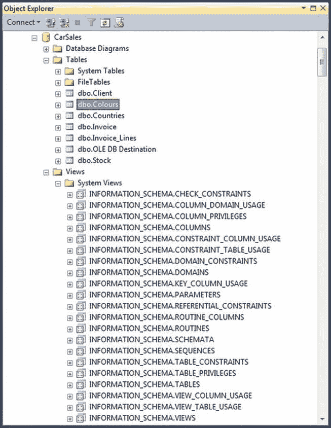
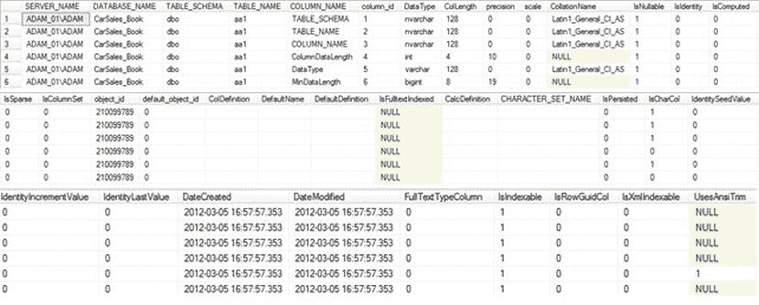

# 获取元数据的主要方式

我们将探讨获取元数据的以下几种主要方式：
*   通过链接服务器连接获取元数据。
*   在已用作本书源数据的主流关系数据库中，访问元数据存储库及其所需的技术。
*   使用 .NET 及其 `GetSchema` 方法，该方法可与数据库连接对象一起使用，以获取 SQL Server、OLEDB 和 ODBC 连接的架构数据。

本质上，本章旨在通过预先了解信息，使您做好准备。您可能在多年内都无需深究源系统元数据也能愉快地管理，或者只需在链接到源数据表时使用 SSIS 或 T-SQL 提供的元数据。然而，必定会有这样的时候：深入研究源数据以了解其定义是成功实施 ETL 流程的先决条件。以下示例旨在帮助您完成这个探索过程。

如果您已从本书的配套网站下载了配套文件，您可以在 `C:\SQL2012DIRecipes\CH08\` 目录中找到本章的示例。

#### 8-1. 列出链接服务器上可用的表

### 问题

您希望发现通过链接服务器连接可用的表。

### 解决方案

使用系统存储过程 `sp_tables_ex` 来列出可通过链接服务器查询的所有表。该存储过程简单有效。最简单的情况下，它只需要链接服务器名称，如下列代码片段（使用 Oracle 链接服务器）所示：
```
EXECUTE master.dbo.sp_tables_ex 'MyOracleDatabase'
```
运行此代码片段将返回 `MyOracleDatabase` 链接服务器上用户可见的所有表的列表。

### 工作原理

如果您已建立到外部数据库的链接服务器连接，那么从中获取元数据将非常容易，因为 SQL Server 提供了存储过程 `sp_tables_ex`，该过程返回可跨链接服务器查询的表的列表。唯一必需的参数是链接服务器名称。链接服务器可以是任何正确配置的链接服务器，无论是 Excel 电子表格、SQL Server 数据库，还是 SQL Server 允许定义为链接服务器的任何数据源。此外，如果您愿意，可以通过添加架构和表类型来限制此存储过程返回的数据。这里再次演示如何对 Oracle 链接服务器执行此操作——尽管这适用于所有链接服务器源（`C:\SQL2012DIRecipes\CH08\LinkedServerTables.sql`）：
```
EXECUTE master.dbo.sp_tables_ex @table_server = 'MyOracleDatabase',
                                @table_schema = 'HR',
                                @table_type = 'VIEW'
```

返回的数据如 表 8-1 所示。

**表 8-1.** sp_tables_ex 系统存储过程返回的元数据
| 列名 | 数据类型 | 描述 |
| --- | --- | --- |
| `TABLE_CAT` | `sysname` | 数据库名称。 |
| `TABLE_SCHEM` | `sysname` | 表架构。 |
| `TABLE_NAME` | `sysname` | 表名。 |
| `TABLE_TYPE` | `VARCHAR(32)` | 表类型——用户表、系统表或视图。 |
| `REMARKS` | `VARCHAR(254)` | SQL Server 将此列留空。 |

`sp_tables_ex` 存储过程使用的参数如 表 8-2 所示。这些参数允许您筛选存储过程返回的信息。

**表 8-2.** sp_tables_ex 参数
| 参数 | 说明 |
| --- | --- |
| `@table_server` | 链接服务器名称。 |
| `@table_catalog` | 数据库名称。 |
| `@table_schema` | 表架构名称。 |
| `@table_name` | 表名。 |
| `@table_type` | 三种真正有用的表类型是 `SYSTEM TABLE`、`TABLE` 和 `VIEW`。 |

 `Note`：如果链接服务器的 OLEDB 提供程序不支持 `IDBSchemaRowset` 接口的 `TABLES` 行集，`sp_tables_ex` 存储过程将返回空结果集。

#### 8-2. 列出使用链接服务器时可用的列

### 问题

您希望列出可通过链接服务器查询的所有列。

### 解决方案

使用系统存储过程 `sp_columns_ex` 来显示通过链接服务器连接可访问的表中的列。以下是说明此操作的代码片段：
```
EXECUTE master.dbo.sp_columns_ex @table_server = 'MyOracleDatabase'
```

### 工作原理

上一个配方中描述的方法可以扩展到返回有关链接服务器中列的数据，如本配方所示，使用 `sp_columns_ex` 存储过程。您可以通过为 Oracle 链接服务器添加可选的 `@table_name` 和 `@table_server` 参数来限制存储过程返回的数据，如下所示（`C:\SQL2012DIRecipes\CH08\LinkedServerColumns.sql`）：
```
EXEC sp_columns_ex @table_server = 'MyOracleDatabase',
                   @table_name = 'Car_Sales'
```

返回的数据如 表 8-3 所示。

**表 8-3.** 使用 sp_columns_ex 系统存储过程返回的元数据
| 列名 | 数据类型 | 描述 |
| --- | --- | --- |
| `TABLE_CAT` | `sysname` | 数据库名称。 |
| `TABLE_SCHEM` | `sysname` | 表架构。 |
| `TABLE_NAME` | `sysname` | 表名。 |
| `COLUMN_NAME` | `sysname` | 列名。 |
| `DATA_TYPE` | `smallint` | 列数据类型 ID。 |
| `TYPE_NAME` | `VARCHAR(13)` | 列数据类型的友好名称。 |
| `COLUMN_SIZE` | `int` | 列大小或长度。 |
| `BUFFER_LENGTH` | `int` | 数据传输大小。 |
| `DECIMAL_DIGITS` | `smallint` | 小数点右边的位数。 |
| `NUM_PREC_RADIX` | `smallint` | 数值基类型。 |
| `NULLABLE` | `smallint` | 如果为 1，则列可以包含 NULL。否则为 0。 |
| `REMARKS` | `VARCHAR(254)` | SQL Server 将此列留空。 |
| `COLUMN_DEF` | `VARCHAR(254)` | 任何默认值。 |
| `SQL_DATA_TYPE` | `smallint` | 本质上与 `DATA_TYPE` 相同。 |
| `SQL_DATETIME_SUB` | `smallint` | 日期时间和 SQL-92 间隔数据类型的子类型——否则为 `NULL`。 |
| `CHAR_OCTET_LENGTH` | `int` | 以字节为单位的数据最大长度。 |
| `ORDINAL_POSITION` | `int` | 列在表中的基于 1 的位置。 |
| `IS_NULLABLE` | `VARCHAR(254)` | ISO 可空性。如果为 1，则列可以包含 `NULL`。否则为 0。 |
| `SS_DATA_TYPE` | `TINYINT` | 扩展存储过程数据类型。 |

`sp_columns_ex` 存储过程使用的参数如 表 8-4 所示。这些参数允许您筛选存储过程返回的信息。

**表 8-4.** sp_columns_ex 系统存储过程的可能参数
| 参数 | 说明 |
| --- | --- |
| `@table_server` | 链接服务器名称。 |
| `@table_name` | 表名。 |
| `@table_schema` | 表架构。 |
| `@table_catalog` | 数据库名称。 |
| `@column_name` | 数据库列名。 |

### 提示、技巧和陷阱
*   本配方中的解决方案不适用于 Excel 或 Access 链接服务器。

#### 8-3. 发现平面文件元数据

### 问题

您需要获取要导入的平面文件的列定义。

### 解决方案

在 SSIS 中使用平面文件连接管理器来猜测数据类型。

### 工作原理

如果您幸运的话，您收到的文本（平面）文件的提供者也会描述它所包含的数据。如果那天运气不好，您只有几个选项可用。第一个是使用 SSIS。


## 8-4. 获取简单的 SQL Server 元数据

### 问题

你需要以一种简单便捷的方式查找关于 SQL Server 表和列的基本元数据。

### 解决方案

查询 `INFORMATION_SCHEMA` 视图，以获得描述源数据库的元数据的合理概览。下面描述了一种实现此目标的方法。

1.  展开“视图”  “系统视图”，找到你想要返回其元数据的数据库。你应该能看到如 图 8-1 所示的截图。



图 8-1. INFORMATION_SCHEMA 表

2.  右键单击包含你感兴趣的元数据的视图。选择“选择前 1000 行”。

你选择的元数据将作为 `SELECT` 查询的结果显示。然后，你可以调整查询以返回完全符合你需求的数据集。

### 工作原理

正如你可能知道的，获取基本元数据子集的另一种方法是明智地使用 `INFORMATION_SCHEMA` 视图，该视图自 SQL Server 2005 起出现。这些数据可以通过查询任何数据库的系统视图来找到。幸运的是，大多数视图都是不言自明的，省去了记忆系统存储过程名称的麻烦（你也可以使用这些存储过程来返回关于表、视图、列等的元数据）。你所要做的只是运行一个简单的 `SELECT` 查询。

我最常用的 `INFORMATION_SCHEMA` 视图在 表 8-5 中提供。

表 8-5. 常用的 INFORMATION_SCHEMA 视图

| `INFORMATION_SCHEMA` 视图 | 有用的列 | 注释 |
| --- | --- | --- |
| `COLUMNS` | `COLUMN_NAME` | 确切的列名。 |
| | `IS_NULLABLE` | 指示该列是否可包含 `NULL`。 |
| | `DATA_TYPE` | 列的数据类型。 |
| | `CHARACTER_MAXIMUM_LENGTH` | 列中的最大字符数。 |
| | `CHARACTER_OCTET_LENGTH` | 列的最大字节大小。 |
| | `NUMERIC_PRECISION` | 数值列的精度。 |
| | `NUMERIC_PRECISION_RADIX` | 数值的基本类型。 |
| | `NUMERIC_SCALE` | 数值列的小数位数。 |
| | `CHARACTER_SET_NAME` | 对于非 Unicode 列，所使用的字符集。 |
| | `DATETIME_PRECISION` | 日期时间精度。 |
| | `COLLATION` | 列的排序规则。 |
| `CONSTRAINTS` | `CONSTRAINT_NAME` | 约束的名称。 |
| | `CHECK_CLAUSE` | 确切的检查代码。 |
| `CONSTRAINT_COLUMN_USAGE` | `COLUMN_NAME` | 列出所有带有约束的列——以及约束的名称。 |
| | `CONSTRAINT_NAME` | 这允许你确保通过数据流传递的是有效数据，不会被目标表拒绝。 |
| `CONSTRAINT_TABLE_USAGE` | `COLUMN_NAME` | 列出所有带有约束的列——以及约束的名称。 |
| | `CONSTRAINT_NAME` | 列上任何约束的名称。 |
| `KEY_COLUMN_USAGE` | `CONSTRAINT_NAME` | 键约束的名称。 |
| | `TABLE_NAME` | 约束所应用的表。 |
| | `COLUMN_NAME` | 约束所应用的列。 |
| `SCHEMATA` | `SCHEMA_NAME` | 架构名称。 |
| `TABLES` | | 表及其架构。 |
| `REFERENTIAL_CONSTRAINTS` | `CONSTRAINT_NAME` | 数据库中所有外键约束的列表。 |
| | `UNIQUE_CONSTRAINT_NAME` | 数据库中所有唯一键约束的列表。 |
| | `SCHEMA_OWNER` | 架构所有者。 |
| `VIEWS` | | 视图及其架构。 |

#### 提示、技巧与陷阱

*   `INFORMATION_SCHEMA` 视图提供了更多信息，所以花点时间深入探索一下会很有乐趣。花时间学习其可用内容，可以在日后省去调试数据流错误的时间，从而获得真正的回报。
*   关于 `INFORMATION_SCHEMA` 数据是否有效、是否完全可信，存在一些讨论。我倾向于认为它是准确的，但过于简化，因此更喜欢基于目录视图中包含的信息进行分析。

## 8-5. 获取定制的 SQL Server 元数据

### 问题

你需要获取精确的 SQL Server 表元数据，以验证你的 ETL 数据类型映射。

### 解决方案

使用 SQL Server 的 `INFORMATION_SCHEMA` 视图来返回有关数据类型的选择性表元数据。

以下查询将使用 `INFORMATION_SCHEMA` 视图，从 SQL Server 数据库中返回用于数据集成目的的基本元数据 (`C:\SQL2012DIRecipes\CH08\EssentialSQLServerMetadata.sql`):

```sql
SELECT C.TABLE_CATALOG, C.TABLE_SCHEMA, C.TABLE_NAME, C.COLUMN_NAME, C.COLUMN_DEFAULT, C.IS_NULLABLE, C.DATA_TYPE, C.CHARACTER_MAXIMUM_LENGTH, C.CHARACTER_OCTET_LENGTH, C.NUMERIC_PRECISION, C.NUMERIC_SCALE, A.CONSTRAINT_TYPE, A.CHECK_CLAUSE
FROM       INFORMATION_SCHEMA.COLUMNS C
LEFT OUTER JOIN (
  SELECT     CCU.TABLE_CATALOG,
    CCU.TABLE_SCHEMA,
    CCU.TABLE_NAME,
    CCU.COLUMN_NAME,
    CT.CONSTRAINT_TYPE,
    CHK.CHECK_CLAUSE
  FROM
    INFORMATION_SCHEMA.CONSTRAINT_COLUMN_USAGE CCU
        INNER JOIN INFORMATION_SCHEMA.TABLE_CONSTRAINTS CT
        ON CCU.CONSTRAINT_NAME = CT.CONSTRAINT_NAME
        LEFT OUTER JOIN INFORMATION_SCHEMA.CHECK_CONSTRAINTS CHK
        ON CT.CONSTRAINT_NAME = CHK.CONSTRAINT_NAME
) A
ON A.COLUMN_NAME = C.COLUMN_NAME
AND A.TABLE_NAME = C.TABLE_NAME
AND A.TABLE_SCHEMA = C.TABLE_SCHEMA;
```

此脚本可能产生的输出示例如 图 8-2 所示。



图 8-2. INFORMATION_SCHEMA 视图的元数据输出

### 工作原理

此脚本连接一组表 (`COLUMNS`, `CONSTRAINT_COLUMN_USAGE`, 和 `TABLE_CONSTRAINTS`)，以返回关于可用表的选定元数据子集。如果你愿意，脚本的输出可以使用 `SELECT...INTO` 插入到表中。你可以修改返回的元素以满足你自己的需求。

#### 提示、技巧与陷阱

*   你可以添加 `WHERE` 子句来筛选你想要的表。
*   返回的结果可用于验证元数据的状态或变更。
*   查询 `INFORMATION_SCHEMA` 视图时，务必用 `INFORMATION_SCHEMA` 限定视图名称。例如：

```sql
SELECT TABLE_CATALOG, TABLE_SCHEMA, TABLE_NAME
FROM INFORMATION_SCHEMA.TABLES
WHERE TABLE_TYPE = 'BASE TABLE'
```

*   你可以连接 `INFORMATION_SCHEMA` 视图来推导你正在查找的信息。


你可以使用 `INFORMATION_SCHEMA` 视图，在一个 `SSIS` 包中将数据导出到 Excel（例如），以便与你为源数据生成的元数据进行对比——并生成一份电子表格，详细说明数据映射关系以及可能存在的问题。为此，你只需创建一个 `SSIS` 包，其数据源是使用前述代码作为 `SQL` 命令文本、通过 `OLEDB` 或 `ADO.NET` 连接到你的数据库的连接，然后将此连接链接到一个 Excel 目标即可。

#### 8-6. 分析 SQL Server 表元数据

### 问题

你需要获取 `SQL Server` 表的元数据以供分析。

### 解决方案

使用 `SQL Server` 系统视图来返回完整的表元数据。

运行以下脚本将为你提供指定数据库中所有 `SQL Server` 表的详尽信息。

```sql
DECLARE @SERVER_NAME NVARCHAR(128) = @@SERVERNAME
DECLARE @DATABASE_NAME NVARCHAR(128) = DB_NAME()
------------------------------------------
IF OBJECT_ID('tempdb..#MetaData_Tables') IS NOT NULL
    DROP TABLE tempdb..#MetaData_Tables;
-- 表数据
CREATE TABLE #MetaData_Tables (
    SCHEMA_NAME sysname NOT NULL,
    TABLE_NAME sysname NOT NULL,
    object_id INT NOT NULL,
    TableType NVARCHAR(60) NULL,
    DateCreated datetime NOT NULL,
    DateModified datetime NOT NULL,
    uses_ansi_nulls BIT NULL,
    text_in_row_limit INT NULL,
    large_value_types_out_of_row BIT NULL,
    IsCDCTracked BIT NULL,
    lock_escalation_desc NVARCHAR(60) NULL,
    LobDataSpace sysname NULL,
    FilestreamDataSpace sysname NULL,
    DataSpace VARCHAR(250) NULL,
    DataSpaceType VARCHAR(250) NULL,
    NbrColumns  smallint NULL,
    IsHeap BIT NULL,
    NoIndexes BIT NULL,
    NoRows BIGINT NULL,
    HasAfterTrigger  BIT NULL,
    HasDeleteTrigger BIT NULL,
    HasInsertTrigger BIT NULL,
    HasInsteadOfTrigger BIT NULL,
    HasUpdateTrigger BIT NULL,
    IsAnsiNullsOn BIT NULL,
    IsEncrypted BIT NULL,
    IsIndexed BIT NULL,
    IsIndexable BIT NULL,
    IsQuotedIdentOn BIT NULL,
    IsSystemTable BIT NULL,
    IsUserTable BIT NULL,
    DeleteTriggerCount SMALLINT NULL,
    FullTextBackgroundUpdateIndexOn BIT NULL,
    FulltextCatalogId SMALLINT NULL,
    FulltextChangeTrackingOn BIT NULL,
    FulltextKeyColumn SMALLINT NULL,
    HasActiveFulltextIndex BIT NULL,
    HasCheckCnst BIT NULL,
    HasClustIndex BIT NULL,
    HasDefaultCnst BIT NULL,
    HasForeignKey BIT NULL,
    HasForeignRef BIT NULL,
    HasIdentity BIT NULL,
    HasIndex BIT NULL,
    HasNonclustIndex BIT NULL,
    HasPrimaryKey BIT NULL,
    HasRowGuidCol BIT NULL,
    HasTextImage BIT NULL,
    HasTimestamp BIT NULL,
    HasUniqueCnst BIT NULL,
    HasVarDecimalStorageFormat BIT NULL,
    InsertTriggerCount SMALLINT NULL,
    TextInRowLimit SMALLINT NULL,
    UpdateTriggerCount SMALLINT NULL,
    HasColumnSet BIT NULL,
    DataCompression NVARCHAR(60)
)

INSERT INTO  #MetaData_Tables (
    SCHEMA_NAME,
    TABLE_NAME,
    object_id,
    TableType,
    DateCreated,
    DAteModified,
    uses_ansi_nulls,
    text_in_row_limit,
    large_value_types_out_of_row,
    IsCDCTracked,
    lock_escalation_desc,
    LobDataSpace,
    FilestreamDataSpace,
    DataSpace,
    DataSpaceType,
    NbrColumns,
    IsHeap,
    NoIndexes,
    NoRows,
    HasAfterTrigger,
    HasDeleteTrigger,
    HasInsertTrigger,
    HasInsteadOfTrigger,
    HasUpdateTrigger,
    IsAnsiNullsOn,
    IsEncrypted,
    IsIndexed,
    IsIndexable,
    IsQuotedIdentOn,
    IsSystemTable,
    IsUserTable,
    DeleteTriggerCount,
    FullTextBackgroundUpdateIndexOn,
    FulltextCatalogId,
    FulltextChangeTrackingOn,
    FulltextKeyColumn,
    HasActiveFulltextIndex,
    HasCheckCnst,
    HasClustIndex,
    HasDefaultCnst,
    HasForeignKey,
    HasForeignRef,
    HasIdentity,
    HasIndex,
    HasNonclustIndex,
    HasPrimaryKey,
    HasRowGuidCol,
    HasTextImage,
    HasTimestamp,
    HasUniqueCnst,
    HasVarDecimalStorageFormat,
    InsertTriggerCount,
    TextInRowLimit,
    UpdateTriggerCount,
    HasColumnSet
)

SELECT
    SCH.name AS SCHEMA_NAME,
    TBL.name AS TABLE_NAME,
    TBL.object_id,
    TBL.type_desc AS TableType,
    TBL.create_date AS DateCreated,
    TBL.modify_date AS DAteModified,
    TBL.uses_ansi_nulls,
    TBL.text_in_row_limit,
    TBL.large_value_types_out_of_row,
    TBL.is_tracked_by_cdc AS IsCDCTracked,
    TBL.lock_escalation_desc,
    DSP.name AS LobDataSpace,
    DSP1.name AS FilestreamDataSpace,
    CAST(NULL AS VARCHAR(250)) AS DataSpace,
    CAST(NULL AS VARCHAR(250)) AS DataSpaceType,
    CAST(NULL AS SMALLINT) AS NbrColumns,
    CAST(NULL AS BIT) AS IsHeap,
    CAST(NULL AS BIT) AS NoIndexes,
    CAST(NULL AS BIGINT) AS NoRows,
    OBJECTPROPERTY(TBL.object_id, 'HasAfterTrigger') AS HasAfterTrigger,
    OBJECTPROPERTY(TBL.object_id, 'HasDeleteTrigger') AS HasDeleteTrigger,
    OBJECTPROPERTY(TBL.object_id, 'HasInsertTrigger') AS HasInsertTrigger,
    OBJECTPROPERTY(TBL.object_id, 'HasInsteadOfTrigger') AS HasInsteadOfTrigger,
    OBJECTPROPERTY(TBL.object_id, 'HasUpdateTrigger') AS HasUpdateTrigger,
    OBJECTPROPERTY(TBL.object_id, 'IsAnsiNullsOn') AS IsAnsiNullsOn,
    OBJECTPROPERTY(TBL.object_id, 'IsEncrypted') AS IsEncrypted,
    OBJECTPROPERTY(TBL.object_id, 'IsIndexed') AS IsIndexed,
    OBJECTPROPERTY(TBL.object_id, 'IsIndexable') AS IsIndexable,
    OBJECTPROPERTY(TBL.object_id, 'IsQuotedIdentOn') AS IsQuotedIdentOn,
    OBJECTPROPERTY(TBL.object_id, 'IsSystemTable') AS IsSystemTable,
    OBJECTPROPERTY(TBL.object_id, 'IsUserTable') AS IsUserTable,
    OBJECTPROPERTY(TBL.object_id, 'DeleteTriggerCount') AS DeleteTriggerCount,
    OBJECTPROPERTY(TBL.object_id, 'FullTextBackgroundUpdateIndexOn') AS FullTextBackgroundUpdateIndexOn,
    OBJECTPROPERTY(TBL.object_id, 'FulltextCatalogId') AS FulltextCatalogId,
    OBJECTPROPERTY(TBL.object_id, 'FulltextChangeTrackingOn') AS FulltextChangeTrackingOn,
    OBJECTPROPERTY(TBL.object_id, 'FulltextKeyColumn') AS FulltextKeyColumn,
    OBJECTPROPERTY(TBL.object_id, 'HasActiveFulltextIndex') AS HasActiveFulltextIndex,
    OBJECTPROPERTY(TBL.object_id, 'HasCheckCnst') AS HasCheckCnst,
    OBJECTPROPERTY(TBL.object_id, 'HasClustIndex') AS HasClustIndex,
    OBJECTPROPERTY(TBL.object_id, 'HasDefaultCnst') AS HasDefaultCnst,
    OBJECTPROPERTY(TBL.object_id, 'HasForeignKey') AS HasForeignKey,
    OBJECTPROPERTY(TBL.object_id, 'HasForeignRef') AS HasForeignRef,
    OBJECTPROPERTY(TBL.object_id, 'HasIdentity') AS HasIdentity,
    OBJECTPROPERTY(TBL.object_id, 'HasIndex') AS HasIndex,
    OBJECTPROPERTY(TBL.object_id, 'HasNonclustIndex') AS HasNonclustIndex,
    OBJECTPROPERTY(TBL.object_id, 'HasPrimaryKey') AS HasPrimaryKey,
    OBJECTPROPERTY(TBL.object_id, 'HasRowGuidCol') AS HasRowGuidCol,
    OBJECTPROPERTY(TBL.object_id, 'HasTextImage') AS HasTextImage,
    OBJECTPROPERTY(TBL.object_id, 'HasTimestamp') AS HasTimestamp,
    OBJECTPROPERTY(TBL.object_id, 'HasUniqueCnst') AS HasUniqueCnst,
    OBJECTPROPERTY(TBL.object_id, 'HasVarDecimalStorageFormat') AS HasVarDecimalStorageFormat,
    OBJECTPROPERTY(TBL.object_id, 'InsertTriggerCount') AS InsertTriggerCount,
    OBJECTPROPERTY(TBL.object_id, 'TextInRowLimit') AS TextInRowLimit,
    OBJECTPROPERTY(TBL.object_id, 'UpdateTriggerCount') AS UpdateTriggerCount,
    OBJECTPROPERTY(TBL.object_id, 'HasColumnSet') AS HasColumnSet
FROM        sys.schemas AS SCH
            INNER JOIN sys.tables AS TBL
            ON SCH.schema_id = TBL.schema_id
            LEFT OUTER JOIN sys.data_spaces DSP1
            ON TBL.filestream_data_space_id = DSP1.data_space_id
            LEFT OUTER JOIN sys.data_spaces DSP
            ON TBL.lob_data_space_id = DSP.data_space_id
WHERE TBL.is_ms_shipped = 0

--------------------------------------------------------------------------------
-- 获取所有次要元素，稍后处理
--------------------------------------------------------------------------------

-- 文件组
IF OBJECT_ID('tempdb..#Tmp_FileGroupDetails') IS NOT NULL
    DROP TABLE tempdb..#Tmp_FileGroupDetails;

SELECT DISTINCT
    DSP.name AS DataSpace,
    DSP.type_desc AS DataSpaceType,
    TBL.name AS TABLE_NAME,
    TBL.object_id AS TableObjectID
INTO    #Tmp_FileGroupDetails
FROM    sys.data_spaces DSP
        INNER JOIN sys.indexes SIX
        ON DSP.data_space_id = SIX.data_space_id
        INNER JOIN sys.tables TBL
        ON SIX.object_id = TBL.object_id
```


