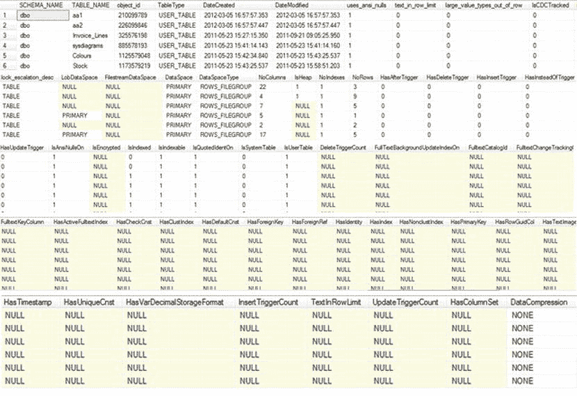
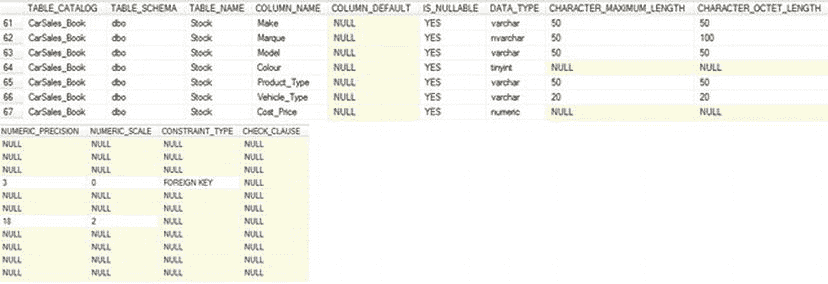

# SQL Server 元数据查询脚本

## 脚本内容

以下 SQL 脚本用于收集和更新`#MetaData_Tables`临时表中的各种表元数据信息。

```sql
object_id
--------------------------------------------------------------------------------
-- 处理所有次要元素
--------------------------------------------------------------------------------

-- FileGroup (文件组)
UPDATE    D
SET       D.DataSpace = Tmp.DataSpace
          ,D.DataSpaceType = Tmp.DataSpaceType
FROM      #MetaData_Tables D
          INNER JOIN #Tmp_FileGroupDetails Tmp
          ON D.object_id = Tmp.TableObjectID

-- Column Counts (列计数)
; WITH NoCols_CTE (SCHEMA_NAME, TABLE_NAME, object_id, NoCols) AS (
    SELECT   TOP (100) PERCENT
             SCH.name AS SCHEMA_NAME,
             TBL.name AS TABLE_NAME,
             COL.object_id,
             COUNT(COL.column_id) AS NoCols
    FROM     sys.columns COL
             INNER JOIN sys.tables TBL
             ON COL.object_id = TBL.object_id
             INNER JOIN sys.schemas SCH
             ON TBL.schema_id = SCH.schema_id
    GROUP BY COL.object_id, TBL.name, SCH.name
)
UPDATE D
SET    D.NbrColumns = CTE.NoCols
FROM   #MetaData_Tables D
       INNER JOIN NoCols_CTE CTE
       ON D.object_id = CTE.object_id

-- Heaps (堆)
UPDATE #MetaData_Tables
SET    IsHeap = 1
WHERE  object_id IN(
           SELECT DISTINCT TBL.object_id
           FROM      sys.tables TBL
                     INNER JOIN sys.schemas SCH
                     ON TBL.schema_id = SCH.schema_id
                     INNER JOIN sys.indexes SIX
                     ON TBL.object_id = SIX.object_id
           WHERE     SIX.type_desc = N'HEAP'
       )

-- Rows (行数)
; WITH RowCount_CTE (SCHEMA_NAME, TABLE_NAME, object_id, NoRows) AS (
    SELECT SCH.name AS SCHEMA_NAME,
           TBL.name AS TABLE_NAME,
           TBL.object_id,
           SSX.rows
    FROM   sys.tables TBL
           INNER JOIN sys.schemas SCH
           ON TBL.schema_id = SCH.schema_id
           INNER JOIN sys.sysindexes SSX
           ON TBL.object_id = SSX.id
)
UPDATE D
SET    D.NoRows = CTE.NoRows
FROM   #MetaData_Tables D
       INNER JOIN RowCount_CTE CTE
       ON D.object_id = CTE.object_id

-- Indexes (索引)
; WITH Indexes_CTE (SCHEMA_NAME, TABLE_NAME, object_id, NoIndexes) AS (
    SELECT SCH.name AS SCHEMA_NAME,
           TBL.name AS TABLE_NAME,
           TBL.object_id,
           COUNT(SIX.index_id) AS NoIndexes
    FROM      sys.tables TBL
              INNER JOIN sys.schemas SCH
              ON TBL.schema_id = SCH.schema_id
              INNER JOIN sys.indexes SIX
              ON TBL.object_id = SIX.object_id
    GROUP BY  SCH.name, TBL.name, TBL.object_id
)
UPDATE      D
SET         D.NoIndexes = CTE.NoIndexes
FROM        #MetaData_Tables D
            INNER JOIN Indexes_CTE CTE
            ON D.object_id = CTE.object_id

-- Compression (压缩)
; WITH Compression_CTE AS (
    SELECT SCH.name AS SCHEMA_NAME,
           TBL.name AS TABLE_NAME,
           PRT.data_compression_desc,
           TBL.object_id
    FROM       sys.partitions PRT
               INNER JOIN sys.tables TBL
               ON PRT.object_id = TBL.object_id
               INNER JOIN sys.schemas SCH
               ON TBL.schema_id = SCH.schema_id
    WHERE PRT.index_id = 0 OR PRT.index_id = 1
)
UPDATE       D
SET          D.DataCompression = CTE.data_compression_desc
FROM         #MetaData_Tables D
             INNER JOIN Compression_CTE CTE
             ON D.object_id = CTE.object_id

SELECT * FROM #MetaData_Tables; -- 是的，SELECT * 不好——但在这里它节省了空间！
```

## 输出示例
脚本的输出（为方便书籍阅读而分成几个部分）如图 8-3 所示。



**图 8-3.** 配方 8-6 中脚本返回的元数据

## 原理说明
了解 SQL Server 元数据主题非常重要，原因如下：
*   如果你在处理 SQL Server 源数据，容易认为这是简单部分，从而急于创建数据流，后来却因数据类型限制或约束导致未预见的意外问题而受挫。当然，这些问题总是你从未预料到的，因此需要花费数小时调试。
*   当处理 SQL Server 表时（无论是暂存表还是最终数据库表，可能不是你设计的），尽可能多地预先了解是有益的。将 SQL Server 目标元数据与源元数据一样进行隔离和分析，可以让你干净、高效地比较两者。

查询 SQL Server 数据库元数据的方法多种多样。事实上，你可能疑惑为什么需要了解这么多提取源数据的方法。答案是——你永远不知道什么时候会需要用到每一种，因此最好了解它们的存在。

对于源元数据的深入细节，没有什么能比得上系统视图。正如你可能已经发现的那样，正确使用它们需要深入理解其工作原理。由于这并非易事，我提出了两个脚本（本配方和下一个），可以相对深入地分析表（或视图）和列的 SQL Server 元数据。如果这些脚本提供的信息过多，你可以降低其复杂性并限制其提供的元数据。主要的是要有一个工具来启动你的分析。本配方中使用的脚本有望成为这样的起点，并返回如表 8-6 所示的表元数据。

**表 8-6.** 配方 8-6 中脚本返回的表元数据

| 字段名 | 描述 |
| --- | --- |
| `SCHEMA_NAME` | 表所属的架构。 |
| `TABLE_NAME` | 表名。 |
| `object_id` | 系统元数据使用的内部对象 ID。 |
| `TableType` | 表类型（表或视图）。 |
| `DateCreated` | 表创建的日期。 |
| `DateModified` | 表修改的日期。 |
| `uses_ansi_nulls` | 该表使用`ANSI NULLS`。 |
| `text_in_row_limit` | 行内存储的 LOB 的上限（以字节为单位）。 |
| `large_value_types_out_of_row` | 大值存储在行外。 |
| `IsCDCTracked` | 该表使用变更数据捕获跟踪变更。 |
| `lock_escalation_desc` | 表的锁升级阈值。 |
| `LobDataSpace` | 表的 LOB 列的 LOB 数据空间类型。 |
| `FilestreamDataSpace` | 表的`FILESTREAM`列的`FILESTREAM`数据空间类型。 |
| `DataSpace` | 表数据空间。 |
| `DataSpaceType` | 表数据空间类型。 |
| `NbrColumns` | 表中的列数。 |
| `IsHeap` | 该表是堆（没有聚集索引）。 |
| `NoIndexes` | 表上的索引数量。 |
| `NoRows` | 表中的行数。 |
| `HasAfterTrigger` | 该表有 After 触发器。 |
| `HasDeleteTrigger` | 该表有 Delete 触发器。 |
| `HasInsertTrigger` | 该表有 Insert 触发器。 |
| `HasInsteadOfTrigger` | 该表有 Instead Of 触发器。 |
| `HasUpdateTrigger` | 该表有 Update 触发器。 |
| `IsAnsiNullsOn` | `ANSI NULLS`对该表处于活动状态。 |
| `IsEncrypted` | 该表已加密。 |
| `IsIndexed` | 该表有索引。 |
| `IsIndexable` | 该表可以被索引。 |
| `IsQuotedIdentOn` | 该表使用引号标识符。 |
| `IsSystemTable` | 该表是系统表。 |
| `IsUserTable` | 该表是用户表。 |
| `DeleteTriggerCount` | 与表关联的删除触发器数量。 |
| `FullTextBackgroundUpdateIndexOn` | 该表的全文索引的后台索引更新处于活动状态。 |
| `FulltextCatalogId` | 任何全文目录的 ID。 |
| `FulltextChangeTrackingOn` | 全文索引的变更跟踪处于活动状态。 |
| `FulltextKeyColumn` | 全文索引的关键列。 |
| `HasActiveFulltextIndex` | 该表有活动的全文索引。 |
| `HasCheckCnst` | 该表有检查约束。 |
| `HasClustIndex` | 该表有聚集索引。 |
| `HasDefaultCnst` | 该表有默认约束。 |
| `HasForeignKey` | 该表包含外键。 |


#### 提示、技巧与陷阱
*   我意识到，在这个示例中使用 `SELECT *` 返回脚本的最终输出违反了所有已知的最佳实践，但这可以节省书籍的篇幅。你可以——也应该——只选择你需要的列。

#### 8-7. 分析 SQL Server 列元数据
### 问题
你需要获取 SQL Server 列元数据以进行分析。

### 解决方案
使用 SQL Server 系统目录视图返回完整的列元数据。

运行以下脚本将为你提供指定数据库中所有 SQL Server 列的详尽信息（`C:\SQL2012DIRecipes\CH08\SQLServerColumnMetadata.sql`）：
```sql
DECLARE @SERVER_NAME NVARCHAR(128) = @@SERVERNAME
DECLARE @DATABASE_NAME NVARCHAR(128) = DB_NAME()

------------------------------------------

IF OBJECT_ID('tempdb..#Metadata_ColumnTableType') IS NOT NULL
    DROP TABLE tempdb..#Metadata_ColumnTableType;

CREATE TABLE #Metadata_ColumnTableType
(
    SERVER_NAME VARCHAR(128) NULL,
    DATABASE_NAME VARCHAR(128) NULL,
    TABLE_SCHEMA VARCHAR(8) NULL,
    TABLE_NAME VARCHAR(8) NULL,
    COLUMN_NAME VARCHAR(8) NULL,
    column_id INT NULL,
    DataType VARCHAR(8) NULL,
    ColLength INT NULL,
    precision TINYINT NULL,
    scale TINYINT NULL,
    CollationName VARCHAR(8) NULL,
    IsNullable BIT NULL,
    IsIdentity BIT NULL,
    IsComputed BIT NULL,
    IsFileStream BIT NULL,
    IsSparse BIT NULL,
    IsColumnSet BIT NULL,
    object_id INT NULL,
    default_object_id INT NULL,
    ColDefinition VARCHAR(max) NULL,
    DefaultName VARCHAR(250) NULL,
    DefaultDefinition VARCHAR(max) NULL,
    IsFulltextIndexed BIT NULL,
    CalcDefinition VARCHAR(4000) NULL,
    CHARACTER_SET_NAME VARCHAR(250) NULL,
    IsPersisted BIT NULL,
    IsCharCol INT NULL,
    IdentitySeedValue INT NULL,
    IdentityIncrementValue INT NULL,
    IdentityLastValue BIGINT NULL,
    DateCreated datetime NULL,
    DateModified datetime NULL,
    FullTextTypeColumn INT NULL,
    IsIndexable INT NULL,
    IsRowGuidCol INT NULL,
    IsXmlIndexable INT NULL,
    UsesAnsiTrim INT NULL
)

INSERT INTO #Metadata_ColumnTableType
(
    SERVER_NAME,
    DATABASE_NAME,
    TABLE_SCHEMA,
    TABLE_NAME,
    COLUMN_NAME,
    column_id,
    DataType,
    ColLength,
    precision,
    scale,
    CollationName,
    IsNullable,
    IsIdentity,
    IsComputed,
    IsFileStream,
    IsSparse,
    IsColumnSet,
    object_id,
    default_object_id,
    ColDefinition,
    DefaultName,
    DefaultDefinition,
    IsFulltextIndexed,
    CalcDefinition,
    CHARACTER_SET_NAME,
    IsPersisted,
    IsCharCol,
    IdentitySeedValue,
    IdentityIncrementValue,
    IdentityLastValue,
    DateCreated,
    DateModified,
    FullTextTypeColumn,
    IsIndexable,
    IsRowGuidCol,
    IsXmlIndexable,
    UsesAnsiTrim
)

SELECT DISTINCT
    @SERVER_NAME,
    @DATABASE_NAME,
    SCH.name AS TABLE_SCHEMA,
    TBL.name AS TABLE_NAME,
    COL.name AS COLUMN_NAME,
    COL.column_id,
    TYP.name AS DataType,
    CASE WHEN TYP.name IN ('nchar','NVARCHAR') THEN (COL.max_length / 2)
    ELSE COL.max_length
    END AS ColLength,
    COL.precision,
    COL.scale,
    COL.collation_name AS CollationName,
    COL.is_nullable AS IsNullable,
    COL.is_identity AS IsIdentity,
    COL.is_computed AS IsComputed,
    COL.is_filestream AS IsFileStream,
    COL.is_sparse AS IsSparse,
    COL.is_column_set AS IsColumnSet,
    COL.object_id,
    COL.default_object_id,
    CAST('' AS VARCHAR(MAX)) AS ColDefinition,
    CAST('' AS VARCHAR(250)) AS DefaultName,
    CAST('' AS VARCHAR(MAX)) AS DefaultDefinition,
    CAST(NULL AS BIT) AS IsFulltextIndexed,
    CAST('' AS VARCHAR(4000)) AS CalcDefinition,
    CAST('' AS VARCHAR(250)) AS CHARACTER_SET_NAME,
    CAST(0 AS BIT) AS IsPersisted,
    CASE WHEN TYP.collation_name IS NOT NULL THEN 1
    ELSE 0
    END AS IsCharCol,
    CAST(0 AS INT) AS IdentitySeedValue,
    CAST(0 AS INT) AS IdentityIncrementValue,
    CAST(0 AS BIGINT) AS IdentityLastValue,
    OBJ.create_date AS DateCreated,
    OBJ.modify_date AS DateModified,
    COLUMNPROPERTY(TBL.object_id, COL.name, 'FullTextTypeColumn') AS FullTextTypeColumn,
    COLUMNPROPERTY(TBL.object_id, COL.name, 'IsIndexable') AS IsIndexable,
    COLUMNPROPERTY(TBL.object_id, COL.name, 'IsRowGuidCol') AS IsRowGuidCol,
    COLUMNPROPERTY(TBL.object_id, COL.name, 'IsXmlIndexable') AS IsXmlIndexable,
    COLUMNPROPERTY(TBL.object_id, COL.name, 'UsesAnsiTrim') AS UsesAnsiTrim
FROM sys.types AS TYP
    INNER JOIN sys.columns AS COL ON TYP.user_type_id = COL.user_type_id
    INNER JOIN sys.tables AS TBL
    INNER JOIN sys.schemas AS SCH ON TBL.schema_id = SCH.schema_id
    INNER JOIN sys.objects AS OBJ ON TBL.object_id = OBJ.object_id ON COL.object_id = TBL.object_id
WHERE TBL.type_desc = 'USER_TABLE'
    AND TBL.is_ms_shipped = 0
ORDER BY TABLE_SCHEMA, TABLE_NAME, COL.column_id

IF OBJECT_ID('tempdb..#Tmp_ColFileStream') IS NOT NULL
    DROP TABLE tempdb..#Tmp_ColFileStream;

SELECT SCH.name AS TABLE_SCHEMA,
    TTP.name AS TABLE_NAME,
    COL.name AS COLUMN_NAME,
    COL.is_filestream AS IsFileStream
INTO #Tmp_ColFileStream
FROM sys.columns COL
    INNER JOIN sys.table_types TTP ON COL.object_id = TTP.
```

| | `HasForeignRef` | 表包含外键引用。 |
|---|---|---|
| | `HasIdentity` | 表包含 `IDENTITY` 列。 |
| | `HasIndex` | 表具有索引。 |
| | `HasNonclustIndex` | 表具有聚集索引。 |
| | `HasPrimaryKey` | 表具有主键。 |
| | `HasRowGuidCol` | 表具有行 GUID 列。 |
| | `HasTextImage` | 具有 `TEXT`、`IMAGE`、`VARCHAR(MAX)` 或 `VARBINARY(MAX)` 列。 |
| | `HasTimestamp` | 表具有 `Timestamp` 列。 |
| | `HasUniqueCnst` | 表具有唯一约束。 |
| | `HasVarDecimalStorageFormat` | `VarDecimal` 压缩处于活动状态。 |
| | `InsertTriggerCount` | 与表关联的插入触发器数量。 |
| | `UpdateTriggerCount` | 与表关联的更新触发器数量。 |
| | `HasColumnSet` | 表包含列集。 |
| | `DataCompression` | 此表启用了数据压缩。 |

该脚本使用 `@SERVER_NAME` 和 `@DATABASE_NAME` 输入参数来定义要分析的服务器和数据库。它们默认为当前服务器和数据库，但你可以修改。然后，它创建一个会话范围的临时表来保存所有必需的元数据。在第一次遍历中，它使用“核心”目录视图（`sys.tables`、`sys.data_spaces` 和 `sys.schemas`）以及一系列 `OBJECTPROPERTY` 函数来获取相当完整的元数据集。之后，一系列子进程使用各种系统目录视图（`sys.columns`、`sys.sysindexes` 和 `sys.partitions`）来返回和计算其他较难获取的元数据元素。


type_table_object_id   INNER JOIN sys.schemas SCH   ON TTP.schema_id = SCH.schema_id

IF OBJECT_ID('tempdb..#Tmp_ColCalculated') IS NOT NULL DROP TABLE tempdb..#Tmp_ColCalculated;

SELECT
    SCH.name AS TABLE_SCHEMA,
    TTP.name AS TABLE_NAME,
    COL.name AS COLUMN_NAME,
    COL.is_persisted AS IsPersisted,
    COL.definition AS CalcDefinition
INTO #Tmp_ColCalculated
FROM sys.table_types TTP
    INNER JOIN sys.schemas AS SCH ON TTP.schema_id = SCH.schema_id
    INNER JOIN sys.computed_columns COL ON TTP.type_table_object_id = COL.object_id;

-- 列默认值
IF OBJECT_ID('tempdb..#Tmp_ColDefault') IS NOT NULL DROP TABLE tempdb..#Tmp_ColDefault;

SELECT
    SCH.name AS TABLE_SCHEMA,
    TTP.name AS TABLE_NAME,
    COL.name AS COLUMN_NAME,
    SDC.name AS DefaultName,
    SDC.definition AS DefaultDefinition
INTO #Tmp_ColDefault
FROM sys.default_constraints SDC
    INNER JOIN sys.columns COL ON SDC.parent_object_id = COL.object_id AND SDC.parent_column_id = COL.column_id
    INNER JOIN sys.table_types TTP ON COL.object_id = TTP.type_table_object_id
    INNER JOIN sys.schemas SCH ON SCH.schema_id = TTP.schema_id;

-- 标识列详细信息
IF OBJECT_ID('tempdb..#Tmp_IdentityDetails') IS NOT NULL DROP TABLE tempdb..#Tmp_IdentityDetails;

SELECT
    SCH.name AS TABLE_SCHEMA,
    TTP.name AS TABLE_NAME,
    ICL.name AS COLUMN_NAME,
    ICL.column_id,
    CAST(ICL.seed_value AS INT) AS seed_value,
    CAST(ICL.increment_value AS INT) AS increment_value,
    CAST(ICL.last_value AS BIGINT) AS last_value,
    ICL.object_id
INTO #Tmp_IdentityDetails
FROM sys.table_types TTP
    INNER JOIN sys.schemas SCH ON TTP.schema_id = SCH.schema_id
    INNER JOIN sys.identity_columns ICL ON TTP.type_table_object_id = ICL.object_id;

-- 使用 FILESTREAM 数据更新
UPDATE DM
SET DM.IsFileStream = FS.IsFileStream
FROM #Metadata_ColumnTableType DM
    INNER JOIN #Tmp_ColFileStream FS ON FS.TABLE_SCHEMA = DM.TABLE_SCHEMA
        AND FS.TABLE_NAME = DM.TABLE_NAME
        AND FS.COLUMN_NAME = DM.COLUMN_NAME;

-- 使用计算列数据更新
UPDATE DM
SET DM.CalcDefinition = CC.CalcDefinition,
    DM.IsPersisted = CC.IsPersisted
FROM #Metadata_ColumnTableType DM
    INNER JOIN #Tmp_ColCalculated CC ON DM.TABLE_SCHEMA = CC.TABLE_SCHEMA
        AND DM.TABLE_NAME = CC.TABLE_NAME
        AND DM.COLUMN_NAME = CC.COLUMN_NAME;

-- 使用默认值更新
UPDATE DM
SET DM.DefaultDefinition = CONVERT(VARCHAR(MAX), CD.DefaultDefinition),
    DM.DefaultName = CD.DefaultName
FROM #Metadata_ColumnTableType DM
    INNER JOIN #Tmp_ColDefault CD ON DM.TABLE_SCHEMA = CD.TABLE_SCHEMA
        AND DM.TABLE_NAME = CD.TABLE_NAME
        AND DM.COLUMN_NAME = CD.COLUMN_NAME;

-- 更新全文索引标识
UPDATE Tmp
SET Tmp.IsFulltextIndexed = 1
FROM #Metadata_ColumnTableType Tmp
    INNER JOIN sys.fulltext_index_columns FTI ON Tmp.object_id = FTI.object_id
        AND Tmp.Column_id = FTI.Column_id;

-- 更新标识列详细信息
UPDATE DM
SET DM.IdentitySeedValue = Tmp.seed_value,
    DM.IdentityIncrementValue = Tmp.increment_value,
    DM.IdentityLastValue = Tmp.last_value
FROM #Metadata_ColumnTableType DM
    INNER JOIN #Tmp_IdentityDetails TMP ON DM.object_id = Tmp.object_id
        AND DM.column_id = Tmp.column_id;

SELECT * from #Metadata_ColumnTableType;  -- 我又一次邪恶地使用了 SELECT *

```

输出结果如[图 8-4 所示。



图 8-4. 配方 8-7 中脚本返回的列元数据

## 工作原理

返回列元数据可以通过这个脚本相当简单地完成，我希望你觉得它足够详尽。返回的列元数据显示在表 8-7 中。

表 8-7. 列元数据

| 字段名 | 描述 |
| --- | --- |
| `SERVER_NAME` | 服务器名称。 |
| `DATABASE_NAME` | 数据库名称。 |
| `TABLE_SCHEMA` | 表所属的架构。 |
| `TABLE_NAME` | 表名。 |
| `COLUMN_NAME` | 列名。 |
| `column_id` | 系统元数据使用的内部列 ID。 |
| `DataType` | SQL Server 数据类型。 |
| `ColLength` | 列长度。 |
| `precision` | 列的数值精度（总位数）。 |
| `scale` | 列的数值刻度（小数点后的位数）。 |
| `CollationName` | SQL Server 排序规则。 |
| `IsNullable` | 该列可以包含 `NULL` 值。 |
| `IsIdentity` | 该列是 `IDENTITY` 列。 |
| `IsComputed` | 该列包含计算值。 |
| `IsFileStream` | 该列是 `FILESTREAM` 列。 |
| `IsSparse` | 该列包含稀疏数据。 |
| `IsColumnSet` | 该列是列集的一部分。 |
| `object_id` | 系统元数据使用的内部对象 ID。 |
| `default_object_id` | 任何独立默认值的 ID。 |
| `ColDefinition` | 列定义。 |
| `DefaultName` | 列默认值的名称（如果存在）。 |
| `DefaultDefinition` | 列默认值。 |
| `IsFulltextIndexed` | 该列使用全文索引进行索引。 |
| `CalcDefinition` | 计算列的列计算公式。 |
| `CHARACTER_SET_NAME` | 使用的字符集。 |
| `IsPersisted` | 列值已持久化存储在表中。 |
| `IsCharCol` | 该列是文本类型。 |
| `IdentitySeedValue` | `IDENTITY` 的起始值。 |
| `IdentityIncrementValue` | `IDENTITY` 的增量值。 |
| `IdentityLastValue` | 最后一个 `IDENTITY` 值。 |
| `DateCreated` | 列创建的日期。 |
| `DateModified` | 列修改的日期。 |
| `FullTextTypeColumn` | 该列是全文索引的一部分。 |
| `IsIndexable` | 该列可以被索引。 |
| `IsRowGuidCol` | 该列包含行 GUID。 |
| `IsXmlIndexable` | 该列可以支持 XML 索引。 |
| `UsesAnsiTrim` | 该列使用 ANSI TRIM。 |

与上一个配方中的脚本类似，该脚本接受 `@SERVER_NAME` 和 `@DATABASE_NAME` 输入参数来定义服务器和分析数据库。变量默认为当前服务器和数据库，但您可以修改。然后，它会创建一个会话范围的临时表来保存列级信息所需的所有元数据。首先遍历元数据，使用 `sys.tables`、`sys.types`、`sys.schemas` 和 `sys.objects`——以及许多 `COLUMNPROPERTY` 函数——来返回一组核心列元数据。然后，一系列后续进程返回 `FILESTREAM` 信息、计算列元数据、默认值和 `IDENTITY` 元数据，以及全文元数据。然后使用这些数据来更新临时表。

## 提示、技巧和陷阱

-   如果需要，可以使用 `SELECT...INTO` 替换脚本末尾的简单 `SELECT`，将此脚本返回的数据输出到磁盘。
-   您可能会发现此脚本返回的数据对于您的需求来说过于详细。如果不需要，请随意减少返回的信息量。
-   请记住，您可以使用 SSMS 查看基本元数据。嗯，是的——某种程度上。首先，最显而易见的一点是，让我们记住，如果您可以在 SSMS 中连接到 SQL Server 数据库（并且如果您有足够的权限），您可以展开一个表以查看列名、数据类型和长度。您还可以展开键、约束、触发器、索引和统计信息。

8-8.
```


