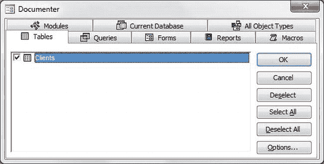
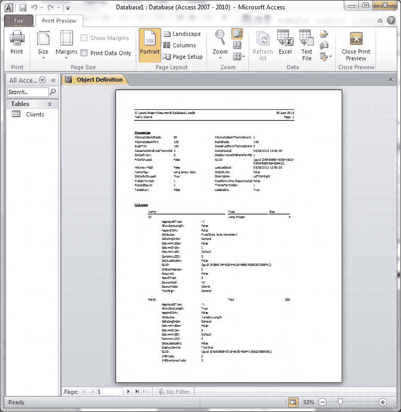
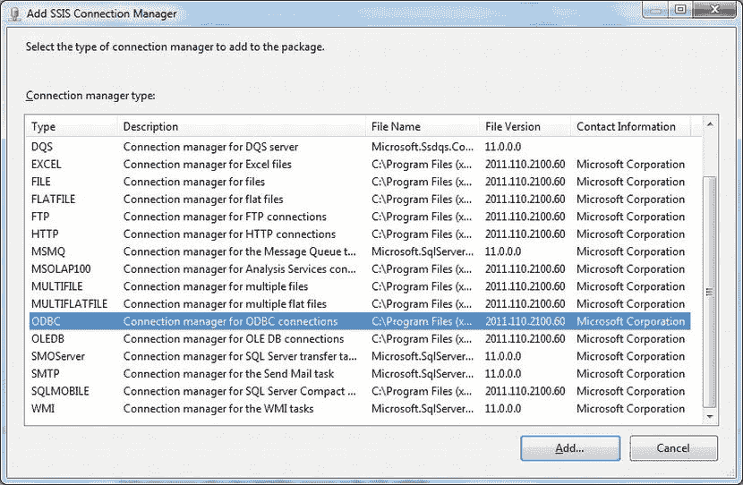
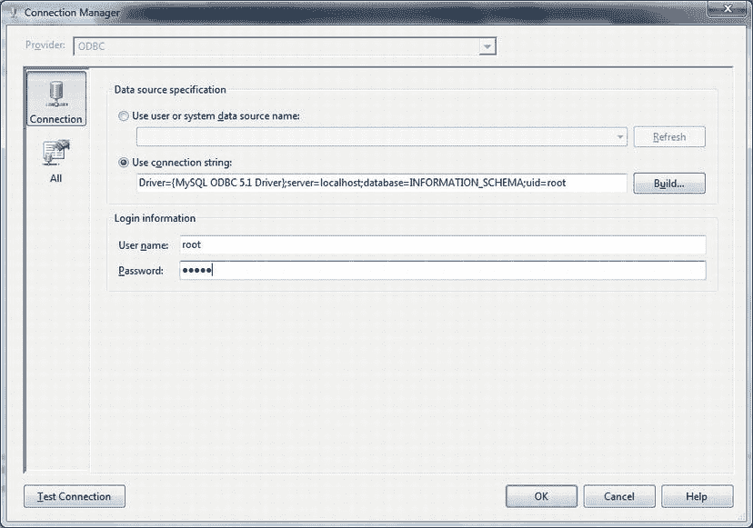
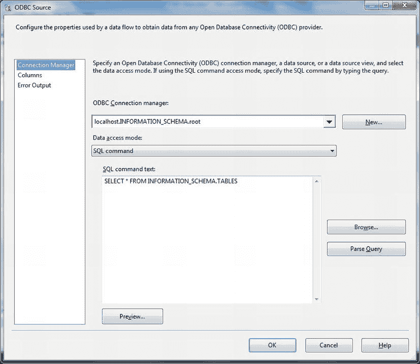
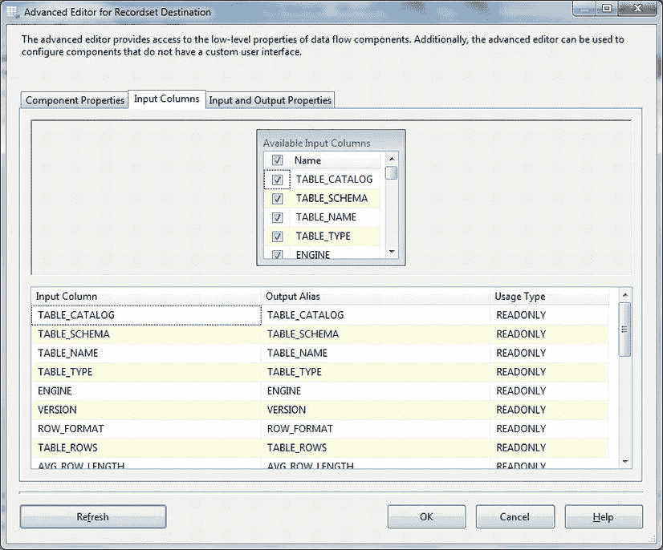
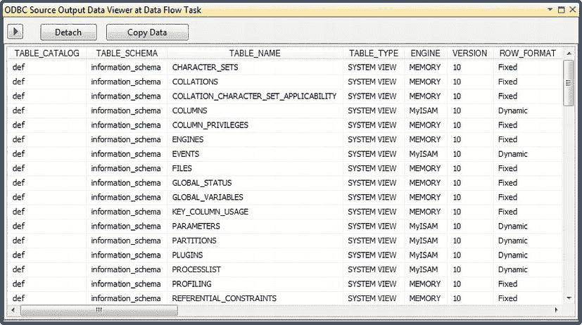
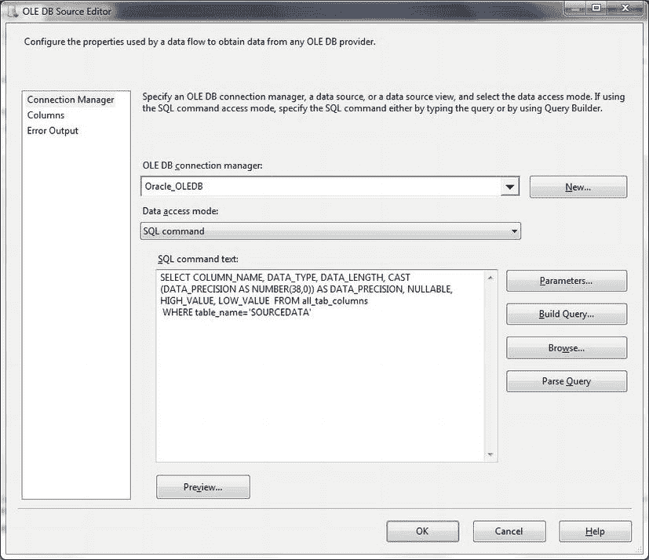
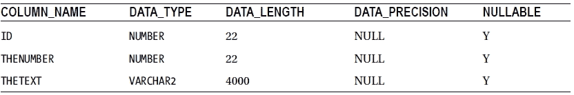

# 显示 Microsoft Access 元数据

## 问题

您想要分析一个 Access 数据库的元数据，以便从中提取数据。

## 解决方案

使用 Access 文档工具来生成一份丰富、详细且清晰的报告，描述 Access 数据库中部分或全部表的元数据。以下步骤说明了如何操作。

1.  在 Access 中，点击 `工具`  `分析`  `文档工具`。
2.  在文档工具对话框中，选择您希望分析的表和查询。最终对话框看起来类似于图 8-5。

    

    图 8-5。Access 文档工具对话框

3.  点击 `确定`。几秒钟后，您应该会得到文档工具的输出（参见图 8-6）。

    

    图 8-6。Access 文档工具输出

4.  如果您想保存一份电子副本，请点击 `文件`  `导出`，并选择富文本格式作为目标格式。

然后，您可以用（例如）Microsoft Word 打开生成的文件，并从容地查看元数据。

## 工作原理

尽管 Access 支持的数据类型范围比商业 SQL 数据库要有限得多，但它也拥有元数据。在数据加载过程之前或期间获取这些元数据有时会很有帮助。如果您愿意，可以编写复杂的 ADOX 代码来返回 Access 元数据，但 Access 可以非常轻松地完成这项工作，因此我更喜欢这种更简单的方法。这需要假定已安装 Microsoft Access，并且您希望查询的数据库对 Access 是可访问的（已链接或直接打开）。

## 提示、技巧和陷阱

*   在 `工具`  `选项` 菜单的“视图”选项卡中，确保“系统对象”已被勾选。表列在 `MySysObjects` 表中。

#### 8-9. 读取 MySQL 元数据

## 问题

您想要显示来自 MySQL 数据库的元数据，以更好地了解您必须导入的源数据。

## 解决方案

使用 MySQL 中的 `INFORMATION_SCHEMA` 视图来获取源元数据的详细描述。请按照以下过程操作：

1.  在一个新的或现有的 SSIS 项目中，创建一个新的 SSIS 包。
2.  在控制流窗格上添加一个数据流任务，并双击打开它。
3.  在连接管理器选项卡中右键单击。选择新建连接。
4.  从连接管理器列表中选择 `ODBC`。如图 8-7 所示。

    

    图 8-7。添加 `ODBC` 连接管理器

5.  点击添加。
6.  点击新建以创建一个新的数据连接。
7.  点击使用连接字符串。
8.  输入如下所示的连接字符串：

    ```
    DRIVER = {MySQL ODBC 5.1 Driver};SERVER = localhost;DATABASE = INFORMATION_SCHEMA;UID = root
    ```

9.  当然，您应该使用自己的服务器和用户 ID (`UID`)。然而，重要的是要指定 `INFORMATION_SCHEMA` 数据库。添加当前密码。对话框应如图 8-8 所示。

    

    图 8-8。选择现有的 DSN

10. 点击 `确定` 两次。
11. 在数据流窗格中右键单击。选择变量。添加一个名为 `MySQLMetadata` 的新变量。确保变量的数据类型为对象。
12. 在数据流窗格上添加一个 `ODBC` 源，并双击进行编辑。
13. 选择您在步骤 4 到 10 中创建的连接管理器。
14. 选择 SQL 命令作为数据访问模式。
15. 在 SQL 命令文本字段中输入或粘贴以下 SQL：

    ```
    SELECT TABLE_NAME FROM INFORMATION_SCHEMA.TABLES;
    ```

16. 对话框应如图 8-9 所示。点击 `确定` 确认创建数据源。

    

    图 8-9。用于返回 MySQL 元数据的 `ODBC` 源

17. 在控制流窗格上添加一个记录集目标。
18. 从 `ODBC` 源到记录集目标拖动一个连接线。
19. 双击编辑记录集目标。
20. 选择您在步骤 11 中创建的变量 (`MySQLMetadata`) 作为变量名称。
21. 点击输入列选项卡，选择您希望输出的列。
22. 点击刷新。对话框应如图 8-10 所示。

    

    图 8-10。选择 MySQL 元数据列

23. 点击 `确定`。
24. 右键单击连接源和目标的那条数据流路径。选择启用数据查看器。

现在，当您运行该包时，MySQL 元数据将出现在数据查看器网格中，如图 8-11 所示。



图 8-11。SSIS 中的 MySQL 元数据

## 工作原理

MySQL（从版本 5 开始）也有一个 `INFORMATION_SCHEMA` 可以供您查询。与之前看到的其他数据库唯一不同的是，在供应商未提供 `OLEDB` 提供程序的情况下（尽管您可能会发现第三方提供程序有效），您必须通过 `ODBC` 访问此元数据。此外，正如您所看到的，获取元数据的方式有点奇特。

以下代码片段将通过 `ODBC` 连接返回 MySQL 元数据：

```
SELECT   TABLE_NAME
FROM      OPENROWSET('MSDASQL', 'DSN=MySQLMetadata',
                    'SELECT TABLE_NAME FROM INFORMATION_SCHEMA.TABLES')
```

如果您经常使用 MySQL，那么添加一个链接服务器（如配方 4-9 所述）并使用 `OPENQUERY` 来获取 `INFORMATION_SCHEMA` 数据可能是值得的。以下代码片段是一个示例，并假定链接服务器名称为 `MYSQL`：

```
SELECT   TABLE_NAME
FROM      OPENQUERY(MYSQL,'select TABLE_NAME FROM INFORMATION_SCHEMA.TABLES')
```

如前所述，MySQL 的 `INFORMATION_SCHEMA` 数据仅适用于 MySQL 5 及以上版本的数据库。但是，如果您面对的是来自更早版本 MySQL 的数据，您可以使用以下 SQL 来查询元数据，以替代前面给出的 SQL：

```
SELECT *
FROM      OPENROWSET('MSDASQL', 'DSN=MySQLMetadata',
                    'SHOW TABLES')
```

无需深入探讨 MySQL 元数据可能性的所有深奥细节，表 8-8 显示了当您查询 MySQL 元数据时可能需要的几个基本表和字段。

表 8-8。 MySQL 元数据

| 表      | 列                          | 说明                                     |
| ------- | --------------------------- | ---------------------------------------- |
| TABLES  | `TABLE_SCHEMA`              | 包含该表的数据库。                       |
|         | `TABLE_NAME`                | 表的名称。                               |
| COLUMNS | `TABLE_CATALOG`             | 包含该表的数据库。                       |
|         | `TABLE_SCHEMA`              | 拥有该表的架构。                         |
|         | `TABLE_NAME`                | 表的名称。                               |
|         | `COLUMN_NAME`               | 列名。                                   |
|         | `DATA_TYPE`                 | 数据类型。                               |
|         | `IS_NULLABLE`               | 可空标志。                               |
|         | `COLUMN_DEFAULT`            | 默认值（如果存在）。                     |
|         | `CHARACTER_MAXIMUM_LENGTH`  | 最大字符长度。                           |
|         | `NUMERIC_PRECISION`         | 数字精度（仅限数字）。                   |
|         | `NUMERIC_SCALE`             | 数字范围（仅限数字）。                   |


#### 8-10. 从 SSIS 显示 Oracle 元数据

## 问题

你有一个需要导入 SQL Server 的数据库，并需要分析其 Oracle 元数据。

## 解决方案

使用 SSIS 查询包含在 Oracle 系统字典中的 Oracle 元数据。以下步骤说明了如何操作。

1.  创建一个新的 SSIS 包。
2.  将一个数据流任务添加到“控制流”窗格。
3.  单击“数据流”选项卡。
4.  将一个 OLE DB 源任务添加到“数据流”窗格。
5.  双击打开它。
6.  选择你已创建的 OLE DB 连接管理器。
7.  选择“SQL 命令”作为数据访问模式。
8.  将以下代码粘贴到“命令文本”框中 (`C:\SQL2012DIRecipes\CH08\OracleMetadata.sql`)：
    ```sql
    SELECT COLUMN_NAME, DATA_TYPE, DATA_LENGTH,
           CAST(DATA_PRECISION AS NUMBER(38,0)) AS DATA_PRECISION, NULLABLE,
           HIGH_VALUE, LOW_VALUE
      FROM all_tab_columns
     WHERE table_name='SOURCEDATA'
    ```
9.  你应该会看到一个类似于 图 8-12 的对话框。
    
    图 8-12. 使用 SSIS 返回 Oracle 元数据
10. 单击“预览”以显示元数据。
11. 单击“确定”关闭对话框。

## 工作原理

假设当你尝试使用 SSIS 和 Oracle 或 Microsoft OLE DB 提供程序导入一个 Oracle 表时，在尝试预览或加载数据时遇到了数据错误。然而你知道 OLE DB 提供程序是正常工作的，因为你可以看到表列表。你能做些什么来查看 Oracle 元数据呢？这里你是在查询 Oracle 数据目录以返回元数据。这是一个标准的直通查询，我在此假设源表名为 `SOURCEDATA`。

使用 SSIS 和 OLE DB 数据源可以让你向 Oracle 系统视图发送查询，然后返回关于 Oracle 源数据库的元数据。要存储返回的元数据，你只需要添加一个 OLE DB 目标组件，创建一个目标表，并运行 SSIS 包。

#### 8-11. 使用 T-SQL 查询 Oracle 元数据

## 问题

你有一个需要导入 SQL Server 的数据库，并需要分析其 Oracle 元数据。

## 解决方案

使用 T-SQL 查询 Oracle 数据字典。下面演示如何操作。

1.  在 Management Studio 查询窗口中执行以下代码片段，以输出关于 Oracle 数据库的元数据 (`C:\SQL2012DIRecipes\CH08\MoreOracleMetadata.sql`)：
    ```sql
    SELECT *
    FROM OPENROWSET('ORAOLEDB.Oracle','MyOracleDatabase';'TestOracle';'Me4B0ss',
    '
    SELECT
        COLUMN_NAME,
        DATA_TYPE,
        DATA_LENGTH,
        CAST(DATA_PRECISION AS NUMBER(38,0)) AS DATA_PRECISION,
        NULLABLE
    FROM all_tab_columns
    WHERE table_name=''SOURCEDATA''
    ')
    ```
    表 8-9 描述了上述查询的结果集。

    表 8-9. Oracle 元数据
    

## 工作原理

T-SQL 的 `OPENROWSET` 命令将一条 `SELECT` 查询传递给 Oracle 数据库（此例中为 `MyOracleDatabase`）。Oracle 处理该查询并返回所请求的关于源表 `SOURCEDATA` 的信息。登录名为 `TestOracle`，密码为 `Me4B0ss`。在此例中，我们使用的是 Oracle OLE DB 提供程序 (`ORAOLEDB.Oracle`)。

## 提示、技巧和陷阱

*   你需要分析所有源表的源元数据——包括那些作为 SQL `SELECT` 查询的一部分在联接中使用的表——以便尽可能全面地了解任何潜在问题。

#### 8-12. 理解 Oracle 数据字典

## 问题

你希望深入了解 Oracle 元数据。

## 解决方案

学会理解 Oracle 数据字典的基础知识。接下来的几个示例将带你从 SQL ETL 开发者的角度，快速概览 Oracle 数据字典的一些核心方面。

这种极其快速的概览需要采用“迷你配方”的方式，因此我将带你快速浏览 Oracle 数据字典的六个核心方面。所有以下代码片段都位于文件中 (`C:\SQL2012DIRecipes\CH08\.ExtendedOracleMetadata.sql`)。

### 核心列数据

要分析或调试数据类型，仔细查看 `ALL_TAB_COLUMNS` 字典表可能是非常宝贵的。SQL 是：

```sql
SELECT TABLE_NAME, COLUMN_NAME, DATA_TYPE, DATA_LENGTH, DATA_PRECISION, DATA_SCALE, NULLABLE, DATA_DEFAULT, CHARACTER_SET_NAME, CHAR_COL_DECL_LENGTH, CHAR_USED
  FROM   ALL_TAB_COLUMNS
```

请记住以下几点：

*   `DATA_PRECISION` 是长度——以十进制数字计（对于 `NUMBER` 类型）或以二进制数字计（对于 `FLOAT` 类型）。
*   `DATA_SCALE` 是数字中小数点右边的位数。
*   `CHAR_USED` 如果是 `C`，表示最大长度是以字符指定的；如果是 `B`，则表示以字节指定。


