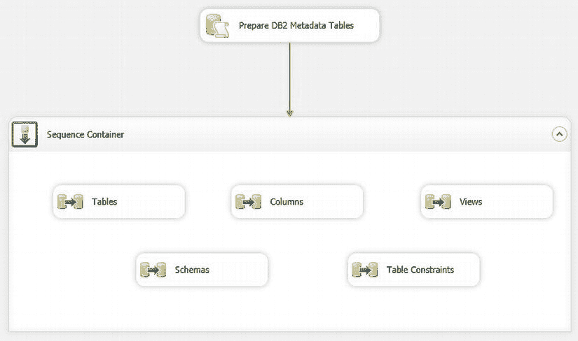
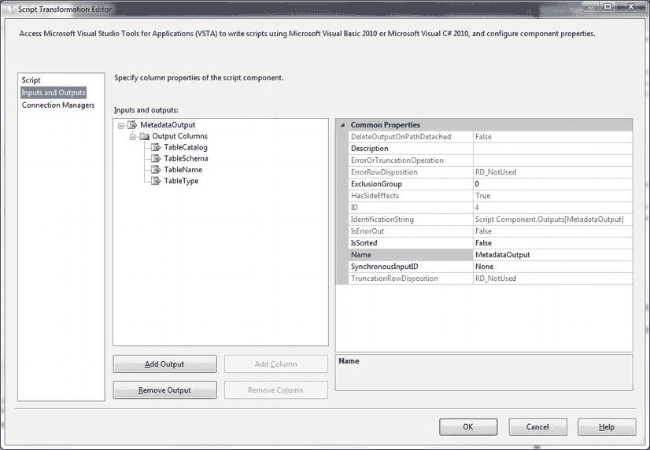
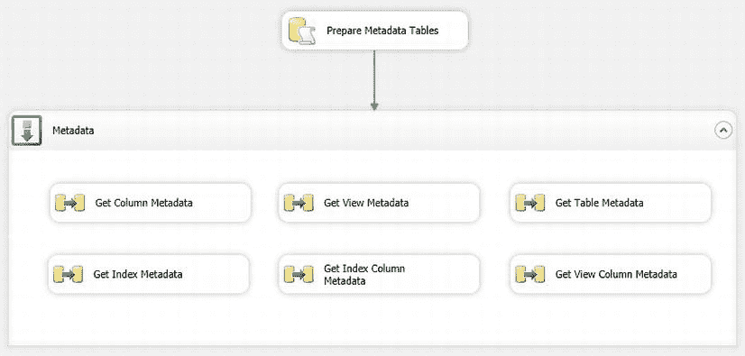

# 获取 DB2 元数据

## 定义命令

定义命令如下：

| 数据流任务 | SQL 代码 |
| :--- | :--- |
| **表** | `SELECT TABLE_CATALOG, TABLE_SCHEMA, TABLE_NAME, TABLE_TYPE FROM INFORMATION_SCHEMA.TABLES` |
| **视图** | `SELECT TABLE_CATALOG, TABLE_SCHEMA, TABLE_NAME, VIEW_DEFINITION, CHECK_OPTION, IS_UPDATABLE FROM INFORMATION_SCHEMA.VIEWS` |
| **列** | `SELECT TABLE_CATALOG, TABLE_SCHEMA, TABLE_NAME, COLUMN_NAME, ORDINAL_POSITION, COLUMN_DEFAULT, IS_NULLABLE, DATA_TYPE, CHARACTER_MAXIMUM_LENGTH, CHARACTER_OCTET_LENGTH, NUMERIC_PRECISION, NUMERIC_PRECISION_RADIX, NUMERIC_SCALE, DATETIME_PRECISION, INTERVAL_TYPE, INTERVAL_PRECISION, CHARACTER_SET_CATALOG, CHARACTER_SET_SCHEMA, CHARACTER_SET_NAME FROM INFORMATION_SCHEMA.COLUMNS` |
| **架构** | `SELECT CATALOG_NAME, SCHEMA_NAME, SCHEMA_OWNER, DEFAULT_CHARACTER_SET_CATALOG, DEFAULT_CHARACTER_SET_SCHEMA, DEFAULT_CHARACTER_SET_NAME, SQL_PATH FROM INFORMATION_SCHEMA.SCHEMATA` |
| **表约束** | `SELECT CONSTRAINT_CATALOG, CONSTRAINT_SCHEMA, CONSTRAINT_NAME, TABLE_CATALOG, TABLE_NAME, CONSTRAINT_TYPE, IS_DEFERRABLE, INITIALLY_DEFERRED FROM INFORMATION_SCHEMA.TABLE_CONSTRAINTS` |

最终的程序包应类似于 图 8-13。



图 8-13。 一个用于返回 DB2 元数据的 SSIS 包

## 运行程序包

运行该程序包。当您查询（并连接）这五个元数据表时，可以更清晰地了解 DB2 元数据。

## 工作原理

能够快速查看数据源背后的元数据可能具有启发性（并且经常可以帮助您调试数据流问题），但在某些情况下这还不够。您需要能够收集元数据并将其存储在本地系统上以供参考。

这在以下情况下非常有用：

*   需要更详细地分析元数据。
*   需要存储元数据，并针对未来的数据摄取进行验证，以发现变更和/或异常。

本方法展示了如何收集一组基础的 DB2 元数据。幸运的是，这个特定的数据库使用了 `INFORMATION_SCHEMA` 视图，因此我们可以使用它们来获取元数据。本质上，这不过是一个简单的数据传输——只是源数据不是数据，而是元数据。这使得 DB2 成为一个很好的示例，您可以将此技术用于任何实现了这些元数据视图的源数据库。您需要在目标 SQL Server 上安装并正常运行 DB2 OLEDB 提供程序。

 **注意** 由于每个数据库的 `INFORMATION_SCHEMA` 视图在视图数量和内容上可能各不相同，因此此模型不能完全相同地用于所有允许通过此方法发现元数据的 SQL 数据库。不过，它很容易针对其他数据库进行扩展和修改。

#### 8-14. 使用 .NET 获取 SQL Server 元数据

## 问题

您希望获取完整的元数据，但不使用 `INFORMATION_SCHEMA` 或系统视图。

## 解决方案

使用 .NET 的 `GetSchema` 类来查询各种数据源的元数据。

### 步骤

1.  需要以下目标表，可以使用此 DDL (`C:\SQL2012DIRecipes\CH08\DotNetMetadataTables.sql`) 来定义：

    ```sql
    CREATE TABLE dbo.ADOSQLServerMetadataViews
    (
        ID INT IDENTITY(1,1) NOT NULL,
        TableCatalog VARCHAR(50) NULL,
        TableName VARCHAR(50) NULL,
        TableSchema VARCHAR(50) NOT NULL,
        CheckOption VARCHAR(50) NULL,
        IsUpdatable VARCHAR(5) NULL
    );

    CREATE TABLE dbo.ADOSQLServerMetadataViewColumns
    (
        ID INT IDENTITY(1,1) NOT NULL,
        ViewCatalog VARCHAR(50) NULL,
        ViewName VARCHAR(50) NULL,
        ViewSchema VARCHAR(50) NOT NULL,
        TableCatalog VARCHAR(50) NULL,
        TableName VARCHAR(50) NULL,
        TableSchema VARCHAR(50) NOT NULL,
        ColumnName VARCHAR(50) NULL
    );

    CREATE TABLE dbo.ADOSQLServerMetadataTables
    (
        ID INT IDENTITY(1,1) NOT NULL,
        TableCatalog VARCHAR(50) NULL,
        TableName VARCHAR(50) NULL,
        TableSchema VARCHAR(50) NOT NULL,
        TableType VARCHAR(50) NULL
    );

    CREATE TABLE dbo.ADOSQLServerMetadataIndexes
    (
        ID INT IDENTITY(1,1) NOT NULL,
        ConstraintCatalog VARCHAR(50) NULL,
        ConstraintSchema VARCHAR(50) NULL,
        ConstraintName VARCHAR(50) NULL,
        TableCatalog VARCHAR(50) NULL,
        TableSchema VARCHAR(50) NULL,
        TableName VARCHAR(50) NULL
    );

    CREATE TABLE dbo.ADOSQLServerMetadataIndexColumns
    (
        ID INT IDENTITY(1,1) NOT NULL,
        ConstraintCatalog VARCHAR(50) NULL,
        ConstraintSchema VARCHAR(50) NULL,
        ConstraintName VARCHAR(50) NULL,
        TableCatalog VARCHAR(50) NULL,
        TableSchema VARCHAR(50) NULL,
        TableName VARCHAR(50) NULL,
        ColumnName VARCHAR(50) NULL,
        OrdinalPosition VARCHAR(50) NULL,
        KeyType VARCHAR(50) NULL,
        IndexName VARCHAR(50) NULL
    );

    CREATE TABLE dbo.ADOSQLServerMetadataColumns
    (
        ID INT IDENTITY(1,1) NOT NULL,
        TableCatalog VARCHAR(50) NULL,
        TableName VARCHAR(50) NULL,
        TableSchema VARCHAR(50) NOT NULL,
        ColumnName VARCHAR(50) NULL,
        OrdinalPosition INT NULL,
        ColumnDefault VARCHAR(50) NULL,
        IsNullable VARCHAR(5) NULL,
        DataType VARCHAR(50) NULL,
        CharacterMaximumLength VARCHAR(50) NULL,
        CharacterOctetLength VARCHAR(50) NULL,
        NumericPrecision VARCHAR(50) NULL,
        NumericPrecisionRadix VARCHAR(50) NULL,
        NumericScale VARCHAR(50) NULL,
        DateTimePresision VARCHAR(50) NULL,
        CharacterSetCatalog VARCHAR(50) NULL,
        CharacterSetSchema VARCHAR(50) NULL,
        CharacterSetName VARCHAR(50) NULL,
        CollationCatalog VARCHAR(50) NULL,
        IsFilestream VARCHAR(5) NULL,
        IsSparse VARCHAR(5) NULL,
        IsColumnSet VARCHAR(5) NULL
    );
    ```

2.  创建一个新的 SSIS 包，并配置一个指向源 SQL Server 数据库的 ADO.NET 连接管理器。
3.  添加一个数据流任务，并切换到数据流窗格。
4.  在数据流窗格上添加一个脚本组件。
5.  选择数据流类型为源，然后单击确定。
6.  双击脚本组件进行编辑。确保在左侧窗格中选择了输入和输出。将输出 0 重命名为 **MetadataOutput**。选择输出列。
7.  单击添加列以添加一个新列。在对话框右侧的属性窗格中，将列重命名为 **TableCatalog**。将其数据类型设置为字符串，长度为 0。
8.  添加以下列，并指定给定的数据类型和长度：

    | 列 | 数据类型和长度 |
    | :--- | :--- |
    | `TableCatalog` | String, 0 |
    | `TableSchema` | String, 0 |
    | `TableName` | String, 0 |
    | `TableType` | String, 0 |

    对话框应类似于 图 8-14。

    

    图 8-14。 用于元数据的脚本转换编辑器

9.  单击连接管理器并添加一个名为 **ADONETSource** 的连接管理器。选择您之前创建的 ADO.NET 连接管理器。
10. 单击脚本，将脚本语言设置为 Visual Basic 2010，然后单击设计脚本按钮。
11. 在左侧窗格中右键单击引用。选择添加引用。从可用的 .NET 组件中选择 `System.Data.SQLClient`。单击确定。
12. 添加以下代码 (`C:\SQL2012DIRecipes\CH08\GetschemaCode.`)

## 在 SSIS 中使用脚本组件获取元数据

```
Public Class ScriptMain
    Inherits UserComponent

    Dim ConnMgr As IDTSConnectionManager100
    Dim SQLConn As SqlConnection
    Dim SQLReader As SqlDataReader
    Dim DSTable As DataTable

    Public Overrides Sub AcquireConnections(ByVal Transaction As Object)
        ConnMgr = Me.Connections.ADONETSource
        SQLConn = CType(ConnMgr.AcquireConnection(Nothing), SqlConnection)
    End Sub

    Public Overrides Sub PreExecute()
        MyBase.PreExecute()
        DSTable = SQLConn.GetSchema("Tables")
    End Sub

    Public Overrides Sub PostExecute()
        MyBase.PostExecute()
    End Sub

    Public Overrides Sub CreateNewOutputRows()
        For Each Row In DSTable.Rows
            MetadataOutputBuffer.AddRow()
            MetadataOutputBuffer.TableCatalog = Row("TABLE_CATALOG").ToString
            MetadataOutputBuffer.TableSchema = Row("TABLE_SCHEMA").ToString
            MetadataOutputBuffer.TableName = Row("TABLE_NAME").ToString
            MetadataOutputBuffer.TableType = Row("TABLE_TYPE").ToString
        Next
    End Sub
End Class
```

13. 关闭脚本屏幕。
14. 单击“确定”关闭`Script Component`对话框。
15. 在数据流窗格中添加一个`OLE DB`目标组件。将`Script Component`链接到该`OLE DB`目标，并将其配置为使用`ADOSQLServerMetadataTables`表（该表作为先决条件的一部分已创建）。
16. 映射列。您会注意到目标表列与添加到`Script Component`输出缓冲区的列相对应。
17. 对其他表重复步骤 3 至 16。列定义见表 8-10。

表 8-10. 在 SSIS 中返回`GetSchema`元数据的列定义

| 表名 | 列名 | 数据类型与长度 |
| --- | --- | --- |
| `ADOSQLServerMetadataViews` | `TableCatalog` | 字符串, 50 |
| `ADOSQLServerMetadataViews` | `TableSchema` | 字符串, 50 |
| `ADOSQLServerMetadataViews` | `TableName` | 字符串, 50 |
| `ADOSQLServerMetadataViews` | `CheckOption` | 字符串, 50 |
| `ADOSQLServerMetadataViews` | `IsUpdatable` | 字符串, 5 |
| `ADOSQLServerMetadataColumns` | `TableCatalog` | 字符串, 50 |
| `ADOSQLServerMetadataColumns` | `TableSchema` | 字符串, 50 |
| `ADOSQLServerMetadataColumns` | `TableName` | 字符串, 50 |
| `ADOSQLServerMetadataColumns` | `ColumnName` | 字符串, 50 |
| `ADOSQLServerMetadataColumns` | `OrdinalPosition` | 四字节有符号整数 [DT_I4] |
| `ADOSQLServerMetadataColumns` | `ColumnDefault` | 字符串, 50 |
| `ADOSQLServerMetadataColumns` | `IsNullable` | 字符串, 5 |
| `ADOSQLServerMetadataColumns` | `DataType` | 字符串, 50 |
| `ADOSQLServerMetadataColumns` | `CharacterMaximumLength` | 四字节有符号整数 [DT_I4] |
| `ADOSQLServerMetadataColumns` | `CharacterOctetLength` | 四字节有符号整数 [DT_I4] |
| `ADOSQLServerMetadataColumns` | `NumericPrecision` | 四字节有符号整数 [DT_I4] |
| `ADOSQLServerMetadataColumns` | `NumericPrecisionRadix` | 四字节有符号整数 [DT_I4] |
| `ADOSQLServerMetadataColumns` | `NumericScale` | 四字节有符号整数 [DT_I4] |
| `ADOSQLServerMetadataColumns` | `DateTimePrecision` | 字符串, 50 |
| `ADOSQLServerMetadataColumns` | `CharacterSetCatalog` | 字符串, 50 |
| `ADOSQLServerMetadataColumns` | `CharacterSetSchema` | 字符串, 50 |
| `ADOSQLServerMetadataColumns` | `CharacterSetName` | 字符串, 50 |
| `ADOSQLServerMetadataColumns` | `CollationCatalog` | 字符串, 50 |
| `ADOSQLServerMetadataColumns` | `IsFilestream` | 字符串, 5 |
| `ADOSQLServerMetadataColumns` | `IsSparse` | 字符串, 5 |
| `ADOSQLServerMetadataColumns` | `IsColumnSet` | 字符串, 5 |
| `ADOSQLServerMetadataViewColumns` | `ViewCatalog` | 字符串, 50 |
| `ADOSQLServerMetadataViewColumns` | `ViewSchema` | 字符串, 50 |
| `ADOSQLServerMetadataViewColumns` | `ViewName` | 字符串, 50 |
| `ADOSQLServerMetadataViewColumns` | `TableCatalog` | 字符串, 50 |
| `ADOSQLServerMetadataViewColumns` | `TableSchema` | 字符串, 50 |
| `ADOSQLServerMetadataViewColumns` | `TableName` | 字符串, 50 |
| `ADOSQLServerMetadataViewColumns` | `ColumnName` | 字符串, 50 |
| `ADOSQLServerMetadataIndexes` | `ConstraintCatalog` | 字符串, 50 |
| `ADOSQLServerMetadataIndexes` | `ConstraintSchema` | 字符串, 50 |
| `ADOSQLServerMetadataIndexes` | `ConstraintName` | 字符串, 50 |
| `ADOSQLServerMetadataIndexes` | `TableCatalog` | 字符串, 50 |
| `ADOSQLServerMetadataIndexes` | `TableSchema` | 字符串, 50 |
| `ADOSQLServerMetadataIndexes` | `TableName` | 字符串, 50 |
| `ADOSQLServerMetadataIndexColumns` | `ConstraintCatalog` | 字符串, 50 |
| `ADOSQLServerMetadataIndexColumns` | `ConstraintSchema` | 字符串, 50 |
| `ADOSQLServerMetadataIndexColumns` | `ConstraintName` | 字符串, 50 |
| `ADOSQLServerMetadataIndexColumns` | `TableCatalog` | 字符串, 50 |
| `ADOSQLServerMetadataIndexColumns` | `TableSchema` | 字符串, 50 |
| `ADOSQLServerMetadataIndexColumns` | `TableName` | 字符串, 50 |
| `ADOSQLServerMetadataIndexColumns` | `ColumnName` | 字符串, 50 |
| `ADOSQLServerMetadataIndexColumns` | `OrdinalPosition` | 四字节有符号整数 [DT_I4] |
| `ADOSQLServerMetadataIndexColumns` | `KeyType` | 字符串, 50 |
| `ADOSQLServerMetadataIndexColumns` | `IndexName` | 字符串, 50 |

您需要为每个源设置适当的脚本。其定义如下（均位于文件`C:\SQL2012DIRecipes\CH08\GetSchemaCodeProcessing.`中）。

## 使用脚本组件获取元数据

脚本组件使用 `GetSchema` 方法从 `SQLConn` 对象获取元数据，并将结果填充到 `MetadataOutputBuffer` 变量中。

### 视图 (Views)

```vb
DSTable = SQLConn.GetSchema("Views")
MetadataOutputBuffer.TableCatalog = Row("TABLE_CATALOG").ToString
MetadataOutputBuffer.TableSchema = Row("TABLE_SCHEMA").ToString
MetadataOutputBuffer.TableName = Row("TABLE_NAME").ToString
MetadataOutputBuffer.IsUpdatable = Row("IS_UPDATABLE").ToString
MetadataOutputBuffer.CheckOption = Row("CHECK_OPTION").ToString
```

### 表列 (Table Columns)

```vb
DSTable = SQLConn.GetSchema("Columns")
MetadataOutputBuffer.TableCatalog = Row("TABLE_CATALOG").ToString
MetadataOutputBuffer.TableSchema = Row("TABLE_SCHEMA").ToString
MetadataOutputBuffer.TableName = Row("TABLE_NAME").ToString
MetadataOutputBuffer.ColumnName = Row("COLUMN_NAME").ToString
MetadataOutputBuffer.OrdinalPosition = Row("ORDINAL_POSITION").ToString
MetadataOutputBuffer.ColumnDefault = Row("COLUMN_DEFAULT").ToString
MetadataOutputBuffer.IsNullable = Row("IS_NULLABLE").ToString
MetadataOutputBuffer.DataType = Row("DATA_TYPE").ToString
MetadataOutputBuffer.CharacterMaximumLength = Row("CHARACTER_MAXIMUM_LENGTH").ToString
MetadataOutputBuffer.CharacterOctetLength = Row("CHARACTER_OCTET_LENGTH").ToString
MetadataOutputBuffer.NumericPrecision = Row("NUMERIC_PRECISION").ToString
MetadataOutputBuffer.NumericPrecisionRadix = Row("NUMERIC_PRECISION_RADIX").ToString
MetadataOutputBuffer.NumericScale = Row("NUMERIC_SCALE").ToString
MetadataOutputBuffer.DateTimePresision = Row("DATETIME_PRECISION").ToString
MetadataOutputBuffer.CharacterSetCatalog = Row("CHARACTER_SET_CATALOG").ToString
MetadataOutputBuffer.CharacterSetSchema = Row("CHARACTER_SET_SCHEMA").ToString
MetadataOutputBuffer.CharacterSetName = Row("CHARACTER_SET_NAME").ToString
MetadataOutputBuffer.CollationCatalog = Row("COLLATION_CATALOG").ToString
MetadataOutputBuffer.IsFilestream = Row("IS_FILESTREAM").ToString
MetadataOutputBuffer.IsSparse = Row("IS_SPARSE").ToString
MetadataOutputBuffer.IsColumnSet = Row("IS_COLUMN_SET").ToString
```

### 视图列 (View Columns)

```vb
DSTable = SQLConn.GetSchema("ViewColumns")
MetadataOutputBuffer.ViewCatalog = Row("VIEW_CATALOG").ToString
MetadataOutputBuffer.ViewSchema = Row("VIEW_SCHEMA").ToString
MetadataOutputBuffer.ViewName = Row("VIEW_NAME").ToString
MetadataOutputBuffer.TableCatalog = Row("TABLE_CATALOG").ToString
MetadataOutputBuffer.TableSchema = Row("TABLE_SCHEMA").ToString
MetadataOutputBuffer.TableName = Row("TABLE_NAME").ToString
MetadataOutputBuffer.ColumnName = Row("COLUMN_NAME").ToString
```

### 索引 (Indexes)

```vb
DSTable = SQLConn.GetSchema("Indexes")
MetadataOutputBuffer.TableCatalog = Row("TABLE_CATALOG").ToString
MetadataOutputBuffer.TableSchema = Row("TABLE_SCHEMA").ToString
MetadataOutputBuffer.TableName = Row("TABLE_NAME").ToString
MetadataOutputBuffer.ConstraintCatalog = Row("CONSTRAINT_CATALOG").ToString
MetadataOutputBuffer.ConstraintSchema = Row("CONSTRAINT_SCHEMA").ToString
MetadataOutputBuffer.ConstraintName = Row("CONSTRAINT_NAME").ToString
```

### 索引列 (Index Columns)

```vb
DSTable = SQLConn.GetSchema("IndexColumns")
MetadataOutputBuffer.TableCatalog = Row("TABLE_CATALOG").ToString
MetadataOutputBuffer.TableSchema = Row("TABLE_SCHEMA").ToString
MetadataOutputBuffer.TableName = Row("TABLE_NAME").ToString
MetadataOutputBuffer.ConstraintCatalog = Row("CONSTRAINT_CATALOG").ToString
MetadataOutputBuffer.ConstraintSchema = Row("CONSTRAINT_SCHEMA").ToString
MetadataOutputBuffer.ConstraintName = Row("CONSTRAINT_NAME").ToString
MetadataOutputBuffer.ColumnName = Row("COLUMN_NAME").ToString
MetadataOutputBuffer.OrdinalPosition = Row("ORDINAL_POSITION").ToString
MetadataOutputBuffer.KeyType = Row("KEYTYPE").ToString
MetadataOutputBuffer.IndexName = Row("INDEX_NAME").ToString
```

最终的包看起来可能类似于图 8-15。



图 8-15：用于返回 SQL Server 元数据的 SSIS 包

运行该包，选定的元数据将被加载到 SQL Server 表中。

## 工作原理

另一种获取元数据的方法是使用 .NET 的 `GetSchema` 类。这种技术比本章到目前为止看到的技术实现起来更复杂，但它比使用 `INFORMATION_SCHEMA` 视图更具可扩展性和强大功能。本示例中的配方返回以下元数据：

- 表
- 视图
- 表列
- 视图列
- 索引
- 索引列

每种对象类型的元数据都存储在其特定的输出表中。然后可以连接和查询这些表（有点像 SQL Server 中的 `INFORMATION_SCHEMA` 视图）以获取源元数据的概览。

这个包看起来比实际更复杂，因为它只是使用脚本从每个元数据模式获取源数据，这需要为每个模式创建多个输出列。对于六个元数据源中的每一个，您都需要创建一个脚本组件数据源，该源将使用 `GetSchema` 函数查询特定的元数据集。每个脚本任务都将具有一组必需的输出列，这些列映射到 `GetSchema` 函数的输出。添加到数据流的列随后将被发送到 OLE DB 目标任务，并进入数据库。

为了使 SSIS 包更易于重用，您可能希望将表名和/或连接字符串设置为变量。您还可以专门定义希望存储在 SQL Server 中的列。重要的是，在编写执行数据映射的代码之前，确保已定义所有需要的输出列，以将元数据源列映射到这些列。请注意，用于将数据表映射到输出缓冲区的列索引号是源数据的索引号，而不是您在 SSIS 包中创建的缓冲区列的索引号。

在数据流中添加数据查看器也会有很大帮助。为此，右键单击脚本组件数据源和 OLE DB 目标之间的连接，然后选择“数据查看器”。现在，当您运行包时，查看器将显示数据处理过程。

#### 提示、技巧与陷阱

- 脚本组件可以定义源元数据。具体来说，您可以：
    - 指定希望使用的连接类型。
    - 指定希望存储的模式集合。
    - 添加所需的任何限制。

#### 总结

本章包含许多使用 SQL Server 分析源数据的方法。为了给您更清晰的概述，表 8-11 描述了我们在本章中研究的各种方法及其优缺点。

表 8-11：本章所用技术的优缺点

| 技术 | 优点 | 缺点 |
| --- | --- | --- |
| `sp_columns_ex` / `sp_tables_ex` | 使用简单。 | 仅适用于链接服务器。<br>元数据有些有限。 |
| 系统字典 | 极其完整。 | 查询复杂。<br>需要经验和实践。<br>可能需要临时查询权限。 |
| `INFORMATION_SCHEMA` 视图 | 访问简单。<br>易于查询。 | 元数据有限。<br>并非所有数据库都可用。<br>在数据库之间可能有所不同。 |
| `GetSchema` | 配置后易于使用。 | 需要编码。<br>最初很复杂。 |


