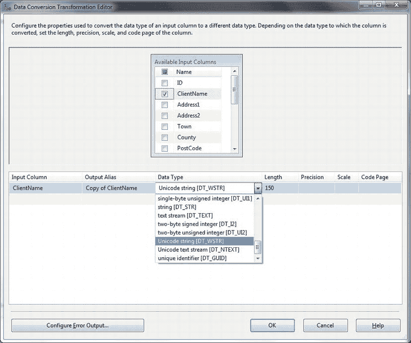

# 第九章
## 数据转换

众所周知，ETL 中的“T”代表“转换”。是的，你或许能连接到一个数据源，也能够将数据导入 SQL Server 目标数据库。然而，数据从源流动到目标的过程中，通常需要进行大量更改。因此，本章将探讨 ETL 开发者面临的一些主要数据转换挑战。

不可避免的是，要预见 ETL 流程中数据可能或必须经历的每一个数据转换需求和每一个曲折变化，是不可能的。所以，同样不可避免的是，本章无法预见每一个数据转换需求，也无法提供每一个可能需要的解决方案。尽管如此，本章仍试图概述解决标准数据转换问题的经典方案。这些方案将包括：

*   *数据去重*——或者说移除重复项的技巧。
*   *数据非规范化*——或将数据列*逆透视*（也称为*转置*）为行。
*   *透视*数据。
*   *数据子集化*——从定长和变长数据到多列的转换。
*   *串联*数据。
*   *合并*数据。
*   *字符级数据转换*——应用所需的 UPPER（大写）、lower（小写）或 TitleCase（首字母大写）。
*   探讨*SCD（缓慢变化维度）的主要类型*。
*   以及为你的 ETL 武器库增添的其他一些工具。

其中包含了一些可能显得过于基础的要素。但我认为最好详尽无遗（尽管简要），并借此机会对赋予 SSIS 产品强大功能和多功能性的基本 SSIS 转换集进行快速概述。我还将坚持本书的理念，在适当的时候描述并行的 T-SQL 解决方案，因为我坚信要为工作选择合适的工具，而不是把所有东西都硬塞进 SSIS。

同样，除了涉及 SQL Server 2012 中的数据质量服务外，我避开了数据清理的内容。数据清理是一个极其复杂的主题，通常超出了简单的数据转换范畴，并且往往需要密集的手动劳动或第三方产品——因此，它确实是一个独立的主题，超出了本书的范围。

本章使用的示例可在本书的配套网站上找到，下载后位于 `C:\SQL2012DIRecipes\CH09` 目录中。另请注意，我不会反复解释如何在 SSIS 中使用 OLEDB 连接管理器指向源数据，因为这在第 1-7 章的许多教程中已有详细说明。请参考本书第一部分的教程——特别是第 4 章（用于 SQL Server 目标）和第 7 章（用于 SQL Server 源），以复习有关 SSIS 数据源和数据目标任务连接的完整细节。

## 9-1. 转换数据类型
### 问题
作为 ETL 流程的一部分，你需要在数据类型之间进行转换，以确保源数据类型不会导致流程失败。

### 解决方案
使用 SSIS 数据转换任务在数据流中更改数据类型，并确保目标数据类型能够接受源数据。步骤如下：

1.  创建或打开一个 SSIS 包，并添加一个数据流任务。切换到数据流窗格。
2.  添加一个 OLEDB 连接管理器，并配置其连接到 CarSales 数据库。
3.  添加一个 OLEDB 源任务，并配置为使用步骤 2 中定义的 OLEDB 连接管理器和 Clients 表。
4.  向你的 SSIS 包中添加一个数据转换任务。
5.  将数据源任务连接到它。
6.  选择你希望修改的列。
7.  对于每个需要更改数据类型的列，在对话框下部的网格中选择新的数据类型，必要时设置其长度。它应该如图 9-1 所示。
8.  添加一个 OLEDB 目标任务，并将数据转换任务连接到它。
9.  配置目标任务以连接到所需的数据库和表，并映射列。



**图 9-1.** SSIS 数据转换任务

### 工作原理
在 SSIS 中，你可以在数据流任务内部使用数据转换任务来更改数据类型。你将转换为 SSIS 的内部数据类型之一。这些数据类型在附录 A 中有描述。一旦数据转换任务作为数据流的一部分实现（通常是通过将其连接到数据源），你就可以选择要更改数据的列，然后选择目标数据类型。SSIS 将为每个修改的数据类型创建第二个列，因此请确保在目标任务中映射相应的列。

冒着阐述过于明显的风险，你也可以在 T-SQL 中使用两个主要函数进行数据转换：

*   `CAST`
*   `CONVERT`

这两个函数的微妙之处和局限性（以及`CONVERT`使用的日期和时间样式）自多年前 SQL Server 首次发布以来已被详尽讨论，因此我建议你使用自己最熟悉的那个函数。

你只能将一种数据类型转换为另一种支持转换的数据类型，在大多数情况下，这意味着目标数据类型比源数据类型更“长”（例如，一个`VARCHAR(500)`无法放入`VARCHAR(10)`）；或者目标数据类型比源数据类型“更大”（例如，一个`BIGINT`无法放入`TINYINT`）；或者目标类型限制更少（除非文本可以被读取为日期，否则无法将其转换为`DATE`数据类型）。

由于转换错误通常只在运行时出现，因此在开发包时，通过预见数据类型转换错误，可以避免痛苦的调试过程。

## 9-2. 从数据中移除重复项
### 问题
你已将数据加载到 SQL Server 表中——可能是一个暂存表——并且希望移除任何重复的记录。

### 解决方案
使用 `ROW_NUMBER()` 窗口函数和 CTE（公用表表达式）来对记录去重。以下展示了如何实现（`C:\SQL2012DIRecipes\CH09\DedupeSmallRecordsets.sql`）：

```sql
WITH Dedupe_CTE (RowNo, ClientName, Country, Town, County, Address1, Address2, ClientType, ClientSize) AS (
 SELECT ROW_NUMBER() OVER (PARTITION BY ClientNameORDER BY ClientNameDESC) AS RowNo,
 ClientName, Country, Town, County, Address1, Address2, ClientType, ClientSize
 FROM dbo.
```


