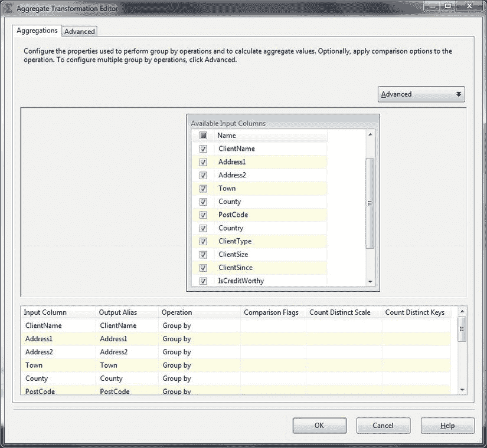
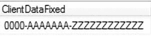
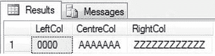
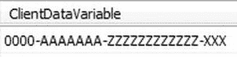
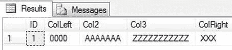

# 数据去重技术

## 引言

`DELETE FROM Dedupe_CTE WHERE RowNo > 1;`

### 工作原理

当所有加载的数据都完美无缺时，你几乎不会遇到问题。不幸的是，现实世界并非总是如此简单，必须完成的基本——通常是首要——任务之一就是从数据集中移除重复项。重复项不仅会导致下游用户遇到问题（并且这些问题的原因可能难以追溯到源头），还可能导致 ETL 过程直接失败。如果你使用 T-SQL `MERGE` 命令，这一点会变得非常明显，例如它会在遇到重复键数据时出错。

对于中小型数据集（很难精确定义这意味着什么，因为它取决于表的宽度和行的大小，以及记录数和系统资源），使用 SQL Server 2005 引入的 `ROW_NUMBER()` 窗口函数是一种可靠且简单的方法来去重数据。需要提供给 `ROW_NUMBER()` 窗口函数的基本信息是用于分区的字段列表——这将定义你认为是重复的元素。虽然并不困难，但移除重复项（也称为去重）必须小心进行。过度热情（即粗心的数据分析）可能导致数据从源中被完全移除，而精度不足（通常也是分析不佳的表现）则可能导致重复项残留。次要关注点是流程效率。根据你正在去重的数据集的大小，你可能需要尝试不同的技术以获得最快且准确的结果。

## 9-3. 对大型记录集进行去重

### 问题

你想使用 T-SQL 从一个大表中删除重复记录。

### 解决方案

使用临时表和 `ROW_NUMBER()` 来删除重复记录。

对于较大的表，以下技术可能比在配方 9-2 中用于从数据表删除重复项的方法（`C:\SQL2012DIRecipes\CH09\DedupeLargeRecordsets.sql`）执行时间更短：

```sql
IF OBJECT_ID('TempDB..#Tmp_Client_DUPS') IS NOT NULL DROP TABLE TempDB..#Tmp_Client_DUPS;
IF OBJECT_ID('TempDB..#Tmp_Client_DUPData') IS NOT NULL DROP TABLE TempDB..#Tmp_Client_DUPData;

-- 获取重复项
SELECT      ClientName,Country,Town,County,Address1,Address2,ClientType,ClientSize
INTO        #Tmp_Client_DUPS
FROM        CarSales_Staging.dbo.ClientWithDuplicates
GROUP BY    ClientName,Country,Town,County,Address1,Address2,ClientType,ClientSize
HAVING      COUNT(*) > 1;

-- 获取要删除的完整数据
SELECT TD.ClientName,TD.Country,TD.Town,TD.County,TD.Address1,TD.Address2,
    TD.ClientType,TD.ClientSize,
    ROW_NUMBER() OVER (
        PARTITION BY TD.ClientName,TD.Country,TD.Town,TD.County,
            TD.Address1,TD.Address2,TD.ClientType,TD.ClientSize
        ORDER BY TD.ClientName,TD.Country,TD.Town,TD.County,TD.Address1,TD.Address2,
            TD.ClientType,TD.ClientSize DESC
    ) AS RowNo
INTO        #Tmp_Client_DUPData
FROM        dbo.Client TD
            INNER JOIN #Tmp_Client_DUPS DUP
            ON TD.ClientName = DUP.ClientName
            AND TD.Country = DUP.Country
            AND TD.Town = DUP.Town
            AND TD.County = DUP.County
            AND TD.Address1 = DUP.Address1
            AND TD.Address2 = DUP.Address2
            AND TD.ClientType = DUP.ClientType
            AND TD.ClientSize = DUP.ClientSize;

-- 删除
DELETE       C
FROM        dbo.Client C
INNER JOIN  #Tmp_Client_DUPData TMP
            ON C.ClientName = TMP.ClientName
            AND C.Country = TMP.Country
            AND C.Town = TMP.Town
            AND C.County = TMP.County
            AND C.Address1 = TMP.Address1
            AND C.Address2 = TMP.Address2
            AND C.ClientType = TMP.ClientType
            AND C.ClientSize = TMP.ClientSize;

-- 重新插入单条记录
INSERT INTO dbo.Client ( ClientName ,Country ,Town ,County ,Address1 ,Address2 ,ClientType ,ClientSize )
SELECT ClientName ,Country ,Town ,County ,Address1 ,Address2 ,ClientType ,ClientSize
FROM       #Tmp_Client_DUPData
WHERE RowNo = 1;
```

### 工作原理

对于较大的记录集，或者当使用列的子集来确定记录是否重复时，基于临时表的方法通常更快，即使它编写起来更长。根据经验，我通常乐于在最多 1,000,000 条记录内使用配方 9-2 中的 `ROW_NUMBER()` 方法。超过这个数量，我倾向于测试该方法与其他解决方案，看看哪个表现最佳。

首先，解决方案脚本将所有重复记录加载到名为 `#Tmp_Client_DUPS` 的临时表中。然后，它将重复记录的完整数据整理到 `#Tmp_Client_DUPData` 临时表中。最后，从源表中删除所有是重复项的记录，并将每个重复项的一个示例从 `#Tmp_Client_DUPData` 重新加载回源表。

这种方法确实使用 `ROW_NUMBER()` 来隔离要保留的每个记录的一个示例，但 `ROW_NUMBER` 的使用仅应用于数据的一个子集——那些是重复项的记录。在某些情况下，只有几个组成部分列相同，记录就被视为重复。这个过程很容易适应这种情况，因为你可以在 `#Tmp_Client_DUPS` 表中定义子集，并使用这些列连接到源数据，将完整记录集传输到 `#Tmp_Client_DUPData` 表。由于此过程实际上会在核心表中删除数据然后重新插入重复项，我强烈建议你将其作为事务的一部分。如果你这样做，那么在过程失败的情况下，源表将恢复到其原始状态。

这种方法经常被忽视的一个优点是，它可以让你轻松计算那些是重复项（或三重项等）的记录并记录计数器。你还可以添加检查和平衡，并将临时表输出到磁盘，如果你想在处理过程中保留重复数据的副本。

这个配方的去重过程可能需要相当长的时间来运行，因此你可能希望在进入完全操作的去重例程之前先测试是否存在重复项。测试重复项可以像下面这样简单（`C:\SQL2012DIRecipes\CH09\TestForDuplicates.sql`）：

```sql
DECLARE @DupCount INT = 0;

SELECT @DupCount  = SUM(TotalDups) AS Dups
FROM (
      SELECT COUNT(*) AS TotalDups
      FROM dbo.Client
      GROUP BY ClientName, Country, Town, County, Address1, Address2, ClientType, ClientSize
      HAVING COUNT(*) > 1
 ) A;

IF @DupCount > 0
BEGIN
      -- 此处放置来自配方 9-3 的主代码
END;
```

## 9-4. 在 ETL 数据流中去重数据

### 问题

你希望在数据流经 SSIS 加载包时对其去重。

### 解决方案

使用 SSIS 聚合转换在数据流中删除重复项。以下步骤描述了一种方法。

1.  创建一个新的 SSIS 包，并添加两个 OLEDB 连接管理器，分别命名为 `CarSales_OLEDB` 和 `CarSales_Staging_OLEDB`。将它们分别配置为指向 CarSales 和 CarSales_Staging SQL Server 数据库。
2.  添加一个数据流任务。双击进行编辑。添加一个 OLEDB 源任务，并配置为使用 `CarSales_Staging_OLEDB` 连接管理器，使用 `dbo.Client` 表作为其源数据。
3.  添加一个聚合转换，并将数据源连接到它。双击进行编辑。
4.  为你希望按其分组的所有列（在此上下文中意味着为这些列去重）勾选列名。确保所有输入列的“操作”列都设置为 **Group By**。对话框应类似于 图 9-2。




## 9-5. 使用 T-SQL 对列数据进行子集提取

### 问题

你需要将一列的内容分解为更小的、离散的部分。

### 解决方案

应用 SQL 的字符串处理函数，将数据切割成固定长度的子集。

图 9-3 展示了一个 25 个字符长度的字符串示例。



图 9-3. 一个待拆分的 25 字符固定长度字符串

以下是用于将 图 9-3 中的字符串分解为各个组成部分的 T-SQL 代码 (`C:\SQL2012DIRecipes\CH09\SubsetColumnData.sql`)：

```sql
SELECT LEFT(ClientDataFixed,4)              AS LeftCol
      ,SUBSTRING(ClientDataFixed,6,7)      AS CentreCol
      ,RIGHT(ClientDataFixed,12)           AS RightCol
FROM    dbo.ClientSubset;
```

结果如 图 9-4 所示。



图 9-4. 拆分后的字符串

### 工作原理

一个常见的需求，特别是当你的数据来源于旧系统时，是将一列的内容分解为更小的、离散的部分。想想社会保险号码，其中数据的不同部分具有不同的含义。T-SQL 和 SSIS 都可以同样轻松且快速地执行此任务——唯一的区别可能在于如何处理可变长度子字符串的问题。正如你将在配方 9-6 中看到的，SSIS 会给你一个惊喜。

在 T-SQL 中，有三个核心的字符串处理函数可以帮助你分离固定长度字符串中的元素。由于它们几乎无需解释，简述如下：

*   `LEFT`
*   `SUBSTRING`
*   `RIGHT`

当字符串（以及相应的子集）长度可变时，将它们分解为多个子字符串只会稍微困难一些。

这需要明智地使用以下字符串处理函数：

*   `LEN`：返回字符串中的字符数
*   `CHARINDEX`：给出一个或多个字符在字符串中的位置
*   `REPLACE`：替换字符串中的一个或多个字符
*   `REVERSE`：反转一个字符串

我假设总会有一个特定的字符可用于隔离子字符串，并且这个特定字符不会出现在子集内部。幸运的是，对于这类列，情况很少不是如此。不过，每个子字符串的分隔符可能不同。

假设你有 图 9-5 中给出的源数据。



图 9-5. 一个将在 T-SQL 中被拆分的可变长度字符串

以下是用于将其分解为各个组成部分的 T-SQL 代码 (`C:\SQL2012DIRecipes\CH09\VariableLengthSubsetting.sql`)：

```sql
SELECT ID
      ,CASE -- 第一列或整列，任意数量的列
          WHEN LEN(ClientDataVariable) - LEN(REPLACE(ClientDataVariable, '-', '')) <> 0
          THEN LEFT(ClientDataVariable, CHARINDEX('-',ClientDataVariable) - 1)
          WHEN LEN(ClientDataVariable) - LEN(REPLACE(ClientDataVariable, '-', '')) = 0
          THEN ClientDataVariable
       END AS ColLeft

      ,CASE -- 三列或四列，第二列
          WHEN LEN(ClientDataVariable) - LEN(REPLACE(ClientDataVariable, '-', '')) = 3
          THEN LEFT(SUBSTRING(ClientDataVariable, CHARINDEX('-',ClientDataVariable) + 1,
                    LEN(ClientDataVariable) - CHARINDEX('-',ClientDataVariable) - CHARINDEX('-',REVERSE(ClientDataVariable))),
                    CHARINDEX('-',SUBSTRING(ClientDataVariable, CHARINDEX('-',ClientDataVariable) + 1,
                    LEN(ClientDataVariable) - CHARINDEX('-',ClientDataVariable) - CHARINDEX('-',REVERSE(ClientDataVariable)))) -1)
          WHEN LEN(ClientDataVariable) - LEN(REPLACE(ClientDataVariable, '-', '')) = 2
          THEN SUBSTRING(ClientDataVariable, CHARINDEX('-',ClientDataVariable) + 1,
                    CHARINDEX('-',ClientDataVariable, CHARINDEX('-',ClientDataVariable) + 1) - CHARINDEX('-',ClientDataVariable) - 1)
       END AS Col2

      ,CASE -- 四列，第三列
          WHEN LEN(ClientDataVariable) - LEN(REPLACE(ClientDataVariable, '-', '')) = 3
          THEN RIGHT(SUBSTRING(ClientDataVariable, CHARINDEX('-',ClientDataVariable) + 1,
                    LEN(ClientDataVariable) - CHARINDEX('-',ClientDataVariable) - CHARINDEX('-',REVERSE(ClientDataVariable))),
                    CHARINDEX('-',SUBSTRING(REVERSE(ClientDataVariable), CHARINDEX('-',ClientDataVariable) + 1,
                    LEN(ClientDataVariable) - CHARINDEX('-',ClientDataVariable) - CHARINDEX('-',REVERSE(ClientDataVariable)))) -1)
       END AS Col3

      ,CASE  -- 最后一列，任意数量的列
          WHEN (LEN(ClientDataVariable) - LEN(REPLACE(ClientDataVariable, '-' , ''))) <> 0
          THEN REVERSE(LEFT(REVERSE(ClientDataVariable), CHARINDEX('-',REVERSE(ClientDataVariable)) - 1))
       END AS ColRight

FROM    dbo.ClientSubset
```

图 9-6 显示了结果。



图 9-6. 拆分后的可变长度字符串

### 提示、技巧和陷阱

*   此 T-SQL 片段是针对特定列数硬编码的。要扩展列数，可以复制第三列或第四列的 `CASE` 语句，并进行调整以使模型能够处理更多的列。
*   执行此操作的方法可能和关于啤酒或葡萄酒的意见一样多。因此，请不要将此视为唯一可行的方法。请进行实验，直到找到适合你需求的解决方案。定义一个 SQLCLR 函数可能是另一个解决方案，甚至可以是 T-SQL 函数。然而，你需要记住，任何会导致数据从基于集合的处理切换到逐行处理的东西，都会严重削弱此过程的效率。


