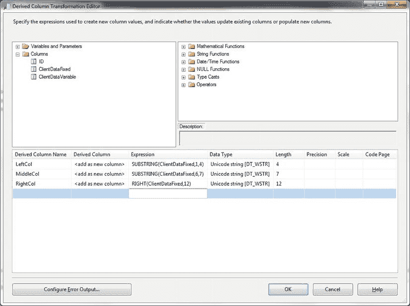
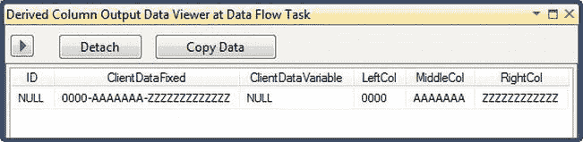

# 9-6. 使用 SSIS 生成定长列数据子集

## 问题

您希望作为 SSIS 数据流的一部分，将一个定长列的内容拆分到多个列中。

## 解决方案

使用“衍生列”转换在受控且规则的数据流中对数据进行子集化。以下步骤解释了如何执行此操作。

1.  创建或打开一个包含数据流组件和有效数据源的 SSIS 包。
2.  在“数据流”窗格中，从工具箱中添加一个“衍生列数据流转换”，并连接到数据源（或在复杂包中连接到数据流）。
3.  双击进行编辑。
4.  在对话框的下半部分添加以下三个元素：

    | 衍生列名称 | 表达式 |
    | :--- | :--- |
    | LeftCol | `SUBSTRING(ClientDataFixed,1,4)` |
    | MiddleCol | `SUBSTRING(ClientDataFixed,6,7)` |
    | RightCol | `RIGHT(ClientDataFixed,12)` |

    对话框应类似于图 9-7。

    

    图 9-7。使用“衍生列”转换拆分字符串

5.  单击“确定”确认修改。然后您可以添加数据流目标或其他转换。

此过程可以编写为动态 SQL 以处理可变数量的列，但此处不会展示。如果您需要此功能，请自行扩展。

对列进行子集化的代码可以作为 T-SQL `UPDATE` 语句的一部分运行，以将数据分配到表中的不同列。

## 工作原理

“衍生列”转换根据源数据子集的长度将列拆分为多个元素。每个新的子集成为一个独立的新列。此处，`SUBSTRING` 函数允许您定义要从字符串中提取的字符数（由第二个参数给出）。第一个参数指明从字符串内的哪个位置开始提取。

如果添加数据查看器，它将显示类似于图 9-8 的内容（取决于您选择查看的列）。

图 9-8。使用数据查看器查看拆分后的字符串

#### 提示、技巧与陷阱

*   为避免在数据流中使用列名时出现拼写错误，您始终可以展开左上角的“列”，并将列名拖到“表达式”字段中。
*   请记得为新的衍生列赋予一个有意义的名称。

