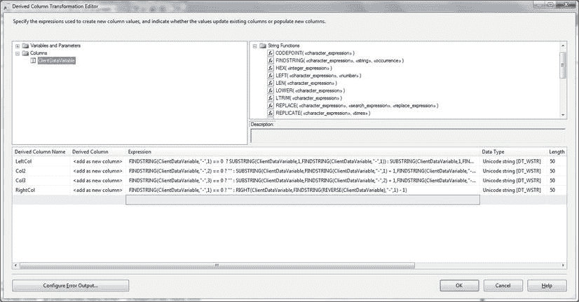
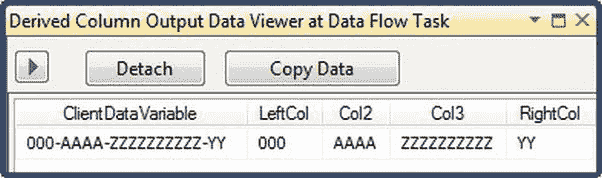

# 9-7. 生成变长列数据子集

## 问题

您希望作为 SSIS 数据流的一部分，将一个变长列的内容拆分到多个列中。

## 解决方案

使用“衍生列”转换的 `FINDSTRING` 函数将数据切割成较小的定义块。

变长字符串的处理过程与配方 9-6 中用于定长字符串的过程几乎完全相同。本配方的解决方案是遵循配方 9-6，并修改步骤 3，在对话框的下半部分添加以下四个元素 (`C:\SQL2012DIRecipes\CH09\SSISSubset.txt`)：

| 衍生列名称 | 表达式 |
| :--- | :--- |
| LeftCol | `FINDSTRING(ClientDataVariable,"-",1) == 0  ? SUBSTRING(Client,1,FINDSTRING(ClientDataVariable,"-",1)) : SUBSTRING(ClientDataVariable,1,FINDSTRING(ClientDataVariable,"-",1) - 1)` |
| Col2 | `FINDSTRING(ClientDataVariable,"-",2) == 0 ? "" : SUBSTRING(ClientDataVariable,FINDSTRING(ClientDataVariable,"-",1) + 1,FINDSTRING(ClientDataVariable,"-",2) - FINDSTRING(ClientDataVariable,"-",1) - 1)` |
| Col3 | `FINDSTRING(ClientDataVariable,"-",3) == 0 ? "" : SUBSTRING(ClientDataVariable,FINDSTRING(ClientDataVariable,"-",2) + 1,FINDSTRING(ClientDataVariable,"-",3) - FINDSTRING(ClientDataVariable,"-",2) - 1)` |
| RightCol | `FINDSTRING(ClientDataVariable,"-",1) == 0 ? "" : RIGHT(ClientDataVariable,FINDSTRING(REVERSE(ClientDataVariable),"-",1) - 1)` |

对话框应类似于图 9-9。

图 9-9。用于拆分字符串的“衍生列”转换

## 工作原理

对于变长字符串，SSIS 有一个令人愉快的惊喜。与 T-SQL 不同，您可以告诉它查找字符的第 n 次出现——从而跳过分隔符第一次（或前几次）出现。这是通过 `FINDSTRING` 函数完成的，该函数允许您指定要查找的分隔符的出现次序。

`SUBSTRING` 函数看似重复的原因是 SSIS 要求我们处理 `NULL`。一种方法是使用三元运算符（如果...那么...否则），然后为第一个要返回的列添加整个字符串，如果分隔符不存在，则为其他列添加零长度字符串。如果不这样做，并且任何记录中存在没有子集数据的字段，任务将失败。

由于这是 SSIS，使此过程动态化（即可变数量的子元素检测）相当困难（尽管并非不可能）。因此，这里不会探讨这种可能性。无论如何，SSIS 基于标准化的、重复出现的数据结构，这是预料之中的事。

如果您在“衍生列”转换后的数据流中添加数据查看器，您可以看到您努力的结果。它应该类似于图 9-10。

图 9-10。使用 SSIS 对变长列进行子集化

