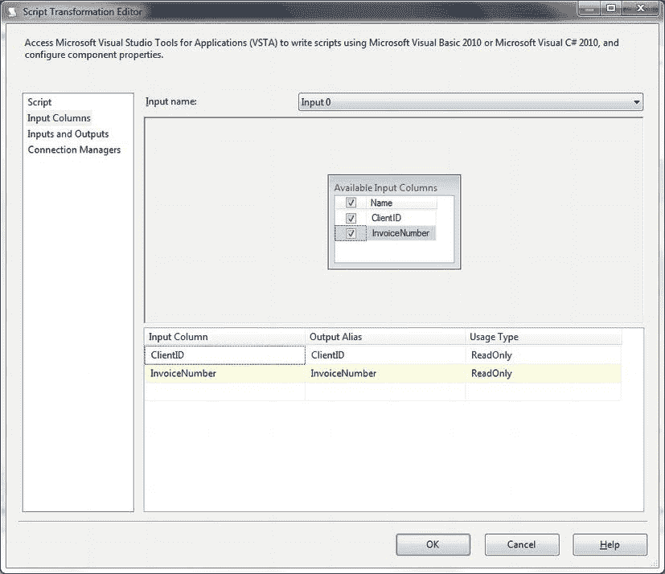
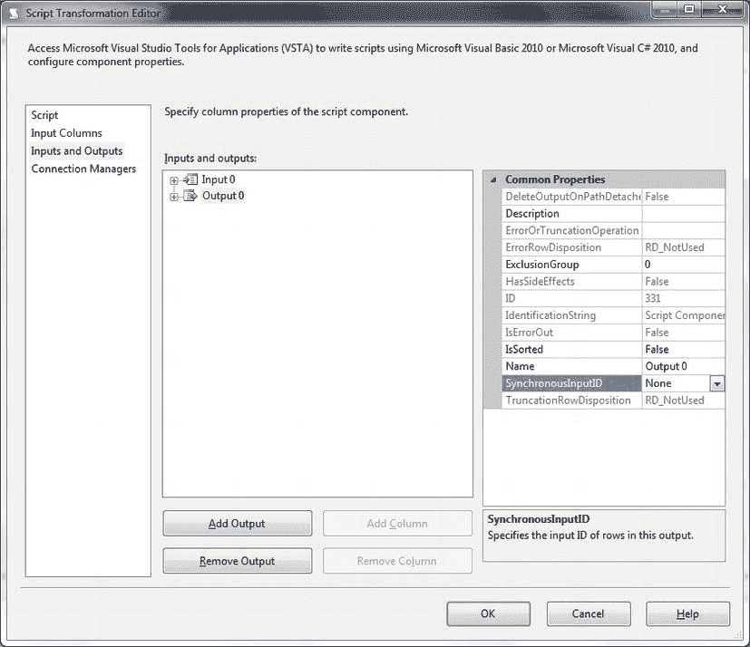
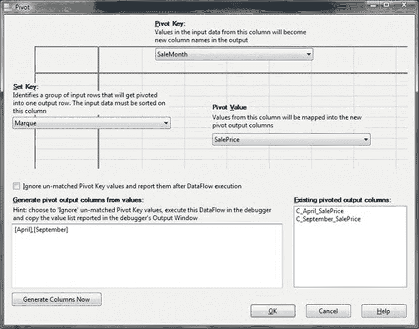

# 9-9. 使用 SSIS 连接数据

## 问题

您希望作为 SSIS ETL 过程的一部分，在数据流期间连接数据。

## 解决方案

使用自定义 SSIS 脚本任务来应用 .NET 进行连接。以下步骤介绍如何完成。

1.  创建一个新的 SSIS 包。

## 9-9. 连接列

### 问题
您需要将两列或多列数据合并为一列，或者根据分组将多行数据合并为单行中的字符串。

### 解决方案
使用 SSIS 脚本任务来连接值。下面是一个连接组内字符串的示例。

1.  添加两个新的 OLEDB 连接管理器——一个名为 ``CarSales_OLEDB``，连接到 CarSales 数据库；另一个名为 ``CarSales_Staging_OLEDB``，连接到 CarSales_Staging 数据库。如果您愿意，可以重用来自配方 9-4 的连接管理器——或者（更好的是）将它们定义为包级连接管理器。
2.  添加一个新的数据流任务。双击进行编辑。
3.  添加一个数据源并按如下方式配置：
    *   **OLEDB 连接管理器**：``CarSales_OLEDB``
    *   **数据访问模式**：SQL 命令
    *   **SQL 文本**：
        ```sql
        SELECT    ClientID, InvoiceNumber
        FROM      dbo.Invoice
        ORDER BY  ClientID, InvoiceNumber;
        ```
4.  预览数据以确保一切正常，如果正常，点击“确定”。
5.  添加一个脚本组件任务，将类型定义为“转换”，并将数据源任务连接到它。双击进行编辑。
6.  在左侧点击“输入列”，选择 ``ClientID`` 和 ``InvoiceNumber`` 列。对话框应如图 9-11 所示。
    
    **图 9-11** 定义脚本转换的输入列
7.  选择 Output 0。
8.  在左侧点击“输入和输出”，然后点击“输出列”并添加两个新列——``ListOutput`` 和 ``GroupOutput``。将两者都设置为 ``DT_STR`` 并具有合适的长度。
9.  选择 Output 0 并将 ``SynchronousInputID`` 设置为 **无**。此窗格应如图 9-12 所示。
    
    **图 9-12** 配置脚本任务输出为异步
10. 点击“脚本”，选择 Microsoft Visual Basic 2010 作为脚本语言，然后点击“编辑脚本”。
11. 在脚本窗口中，向 Imports 区域添加以下指令：
    ```vbnet
    Imports System.Text
    ```
12. 将 ScriptMain 代码替换为以下脚本（`C:\SQL2012DIRecipes\CH09\SSISConcatenation.vb`）：
    ```vbnet
    Public Class ScriptMain
        Inherits UserComponent

        Dim InitValue As String = ""
        Dim ControlValue As String = ""
        Dim CurrentElement As String = ""
        Dim ConcatValue As New StringBuilder
        Dim ConcatCharacter As String = ","

        Public Overrides Sub PreExecute()
            MyBase.PreExecute()
        End Sub

        Public Overrides Sub PostExecute()
            MyBase.PostExecute()
        End Sub

        Public Overrides Sub Input0_ProcessInput(ByVal Buffer As Input0Buffer)

            While Buffer.NextRow()
                Input0_ProcessInputRow(Buffer)
            End While

            If Buffer.EndOfRowset Then

                Output0Buffer.AddRow()
                Output0Buffer.GroupOutput = ControlValue
                Output0Buffer.ListOutput = ConcatValue.Remove(ConcatValue.Length - 1, 1).ToString
                Output0Buffer.SetEndOfRowset()

            End If

        End Sub

        Public Overrides Sub Input0_ProcessInputRow(ByVal Row As Input0Buffer)

            ' If first record - initialise variables
            If InitValue = "" Then
                InitValue = Row.ClientID.ToString
                ControlValue = Row.ClientID.ToString
            End If

            CurrentElement = Row.InvoiceNumber.ToString
            ControlValue = Row.ClientID.ToString

            'Process all records
            If InitValue = ControlValue Then

                ConcatValue = ConcatValue.Append(CurrentElement).Append(ConcatCharacter)

            Else
                ' Write grouping element and concatenated string to new outputs
                Output0Buffer.AddRow()
                Output0Buffer.ListOutput = ConcatValue.Remove(ConcatValue.Length - 1, 1).ToString
                Output0Buffer.GroupOutput = InitValue

                InitValue = Row.ClientID.ToString
                ConcatValue = ConcatValue.Remove(0, ConcatValue.Length).Append(CurrentElement).Append(ConcatCharacter)

            End If
        End Sub

    End Class
    ```
13. 关闭脚本窗口，然后点击“确定”关闭“脚本任务编辑器”。
14. 添加一个 OLEDB 目标任务，将其配置为使用 ``CarSales_Staging_OLEDB`` 连接管理器。
15. 点击“新建”以创建目标表，您可以根据需要重命名。点击“确定”确认表创建。接下来，点击“映射”并将源列映射到目标列。点击“确定”完成目标任务。

您现在可以直接将脚本任务中的数据输出到数据流目标，或者继续使用进一步的转换来处理数据。

### 工作原理
您可能也需要在 SSIS 中连接字符串。这可以通过几种方式完成，但我会坚持解释一个自定义的 SSIS 脚本任务，它能快速轻松地实现所需的结果。

脚本本质上执行一个任务——它处理输入中的每条记录，并检查“分组”字段（这里是 ``ClientID``）是否与前一条记录相比发生了变化。如果该字段没有改变，那么包含要连接的值的字段（``InvoiceNumber``）就会被添加到 ``ConcatValue`` 变量中。如果它发生了变化，就会向输出缓冲区添加一条新记录，并将两个字段（包含连接字段的 ``ListOutput`` 和包含“分组”字段的 ``GroupOutput``）添加到输出缓冲区。

这里我使用了逗号作为分隔符——您可以选择源数据中使用的分隔符，并相应地修改代码。如果数据在脚本任务处理之前没有排序，您将必须添加一个排序任务并确保它至少按“分组”字段（本例中为 ``ClientID``）排序。

脚本使用了您可能熟悉的 ``ProcessInputRow`` 重写方法，因为它用于处理流经脚本任务的输入缓冲区中的所有记录。您可能对 ``ProcessInput`` 重写方法不太熟悉。这是异步函数所必需的，它检测正在处理的记录集的结束，然后完成任何所需的处理。

您可能更愿意使用 ``StringBuilder``（因此需要引用 ``System.Text``）而不是字符串进行连接。但请注意，``StringBuilder`` 可能更快、更高效。这是因为当它被更改时，它不会像字符串那样在内存中被销毁和重新创建。然而，它的效率将取决于连接的次数和结果的长度。所以请随意比较和测试这两种可能性。

 **注意** 这是一个异步转换，因此它不仅会在完成前阻塞数据流，还会给整个 SSIS 包增加相当大的内存压力。

## 9-10. 复制列

### 问题
您需要在数据中创建重复的列。

### 解决方案
在 T-SQL 中多次别名同一列，或使用 SSIS 派生列转换。

在 T-SQL 中，创建重复列可以使用以下代码片段完成：
```sql
SELECT ClientName, ClientName AS EsteemedVisitor
FROM CarSales.dbo.Client;
```

在 SSIS 中，您可以向数据流添加一个派生列转换，并将其连接到源任务（或数据流中的任何任务）。双击派生列转换，并在网格中的“派生列名称”字段中添加一个新列名。然后展开对话框左上角的“列”，并将适当的列名拖到“表达式”字段。然后您可以点击“确定”关闭对话框。


## 9-11. 将字符串转换为大写或小写

### 问题
你希望在数据流中，或在数据加载到 SQL Server 表之后，将字符串的全部或一部分转换为大写或小写。

### 解决方案
在 T-SQL 和 SSIS 中使用 `UPPER` 和 `LOWER` 函数来执行字符大小写转换。

### 工作原理
解决方案非常简单。你可以使用以下函数将字符串转换为大写或小写：
| | T-SQL | SSIS |
| --- | --- | --- |
| 大写转换 | `UPPER`(列或列别名) | `UPPER`(数据流中的列名) |
| 小写转换 | `LOWER`(列或列别名) | `LOWER`(数据流中的列名) |

在 SSIS 中，可以使用派生列转换来将文本转换为大写或小写。如果你采用配方 9-12 中的例子，可以对你选作表达式的列使用 SSIS 的 `UPPER` 或 `LOWER` 函数。

虽然这可能被视为迈向数据清洗永恒篝火的第一步（这是一个我很大程度上希望避免讨论的主题，因为它很容易成为另一本专著的主题，而我无意尝试去写），但为了澄清基本技术，绕道进入简单字符转换的领域仍然值得一试。以上就是 `UPPER` 和 `LOWER` 函数的处理方法。

## 9-12. 将字符串转换为标题大小写

### 问题
你希望将字符串的全部或一部分转换为标题大小写，即每个单词的首字母大写。

### 解决方案
在 SSIS 中，标题大小写可以作为脚本转换的一部分来生成。在 T-SQL 中，你最好使用 CLR 函数。接下来，我将解释如何使用这两种选项。在此配方中，我假设已经存在一个包含数据源和目标的 SSIS 包。

### 使用 SSIS 实现标题大小写
1.  向数据流面板添加一个脚本组件。选择操作类型为“转换”。双击进行编辑。
2.  在左侧窗格中单击“输入列”。选择要转换为“标题大小写”的列。在此示例中，它将是 `InvoiceNumber` 列。
3.  在左侧窗格中单击“输入和输出”。单击“输出列”，然后单击“添加列”以添加一个新列。将其命名为 `ProperOut`。确保数据类型与输入列的类型和长度对应。
4.  在左侧窗格中单击“脚本”。选择 `Microsoft Visual Basic 2010` 作为脚本语言，然后选择“编辑脚本”。
5.  添加以下脚本：
    ```
    Public Overrides Sub Input0_ProcessInputRow(ByVal Row As Input0Buffer)
        Dim cultureInfo As System.Globalization.CultureInfo = System.Threading.Thread.CurrentThread.CurrentCulture
        Dim textInfo As TextInfo = cultureInfo.TextInfo

        If Not Row.InvoiceNumber_IsNull Then
            Row.ProperOut = textInfo.ToTitleCase(Row.InvoiceNumber)
        End If
    End Sub
    ```
6.  通过选择“生成”->“生成（项目引用）”来编译脚本。关闭脚本窗口并单击“确定”以完成脚本任务的创建。

### 使用 T-SQL 实现标题大小写
由于此解决方案使用 CLR，关于如何创建 CLR 函数的具体细节，请参考配方 10-21。此函数（名为 `FncProperCase`）的代码位于 `C:\SQL2012DIRecipes\CH09\TitleCase.vb`：
```
using System;
using System.Data;
using System.Collections;
using System.Data.SqlTypes;
using System.Data.SqlClient;
using Microsoft.SqlServer.Server;
using System.Globalization;

public partial class UserDefinedFunctions {
    [Microsoft.SqlServer.Server.SqlFunction(IsDeterministic = true, IsPrecise = true)]
    public static SqlString FncProperCase(string inputData)
    {
        System.Globalization.CultureInfo cultureInfo = System.Threading.Thread.CurrentThread.CurrentCulture;
        TextInfo textInfo = cultureInfo.TextInfo;

        inputData = textInfo.ToTitleCase(inputData);
        return new SqlString(inputData);
    }
};
```

一旦你的 CLR 函数加载到 SQL Server 中，调用它的 T-SQL 语句是：
```
SELECT dbo.FncProperCase(LOWER(ClientName))
FROM dbo.Clients;
```

### 工作原理
在 SSIS 中实现标题大小写并不那么简单——但也并非真的困难，因为 .NET 框架的 `TextInfo` 类中包含了 `ToTitleCase` 函数。因此，调用这个函数可以解决许多问题。它并不完美，有一些恼人的转换它无法处理，但如果你能忍受这些缺点，它就非常有用。

在 T-SQL 函数中实现标题大小写可以使用“字符串遍历”代码，但这种方法在 ETL 场景中可能会慢得令人难以置信。编写这种代码也可能极其繁琐。因此，我建议将 .NET 的 `TextInfo` 调用包装在 SQL Server CLR 函数中。这样做可能会显著减慢你的数据处理速度。然而，由于解决方案的纯粹简单性和可靠性，它非常诱人，因此我尽管知道函数调用带来的逐行处理会造成不可避免的性能损失，还是向你展示了它。

### 提示、技巧和陷阱
*   另一个选项——仍然使用脚本组件——是正则表达式。如何在脚本组件中使用正则表达式在配方 10-20 中有解释。因此，你需要做的就是找到一段合适的 Regex 代码来应用良好的标题大小写转换。如果你在你喜欢的搜索引擎中键入 `regex proper case`，可以找到好几个可用的。
*   你必须首先将字段转换为 `LOWER`——除非你想让它保持 `UPPER` 大小写——因为这个 .NET 函数不会覆盖大写字符并将其转换为标题大小写。
*   你当然可以将此函数用作 T-SQL `UPDATE` 子句的一部分。

## 9-13. 在 T-SQL 中进行数据透视

### 问题
你希望对已加载到 SQL Server 数据库中的数据进行透视。

### 解决方案
在数据更新过程中使用 T-SQL 的 `PIVOT` 关键字。

### 工作原理
使用 T-SQL 透视数据在技术上并不困难，稍加练习就会变得出奇地容易。以下是使用来自 `CarSales` 数据库的 `CarSales.dbo.Stock` 表（`C:\SQL2012DIRecipes\CH09\PivotData.sql`）进行汽车销售按品牌/每月透视和聚合数据的 T-SQL：
```
SELECT Marque AS TotalMonthlySalesPerMarque,
       [January], [February], [March], [April], [May],
       [June], [July], [August], [September], [October], [November], [December]
FROM
            (
              SELECT
              S.Marque
              ,DATENAME(month, I.InvoiceDate) AS SaleMonth
              ,L.SalePrice
              FROM   dbo.Stock S
                      INNER JOIN dbo.Invoice_Lines L
                      ON S.ID = L.StockID
                      INNER JOIN dbo.Invoice I
                      ON L.InvoiceID = I.ID
              ) AS SRC
PIVOT
(
    SUM(SalePrice)
    FOR SaleMonth IN ([January], [February], [March], [April], [May], [June], [July], [August], [September], [October], [November], [December])
) AS PVT ;
```

有时，源数据，即使是完美规范化的源数据，就是不符合导入过程的要求。虽然这在创建报表系统时更为常见，但在更传统的数据导入需求中也可能发生。


因此，能够对源数据进行**枢轴转换**（即将数据从行**转置**为列）是很有帮助的。当然，这是一种数据**反规范化**操作，更糟糕的是，它会导致数据被聚合到无法恢复源数据的程度。然而，只要您意识到其局限性和风险，它在某些情况下就是一种有效且有用的技术。

在详细解释代码之前，可能值得先澄清一下基本概念和词汇。

| **数据类型** | **说明** |
| --- | --- |
| 透传数据 | 不受转置影响的数据，作为左侧列（一或多列）流经整个过程，既不被修改，也不会修改其他数据。 |
| 键或设置键 | 用作分组依据、显示为左侧列的数据。 |
| 透视列 | 其值将被转置为列标题的列中的数据。 |
| 透视数据 | 来自透视列的数据，将被转置并聚合到相应的透视列与行交叉点处。 |

在此示例中，内部 `SELECT` 语句返回将用于转置数据的三列：

*   一个键列，将成为左侧列（本例中为 `Marque`）。您可以根据需要使用任意多个此类列。
*   透视列（从 `InvoiceDate` 列派生的 `SaleMonth`）。
*   透视数据（或值列），即被聚合和转置的数据（`SalePrice`）。

然后，这个被别名为 `SRC` 的内联查询会被 `PIVOT`（透视）。这意味着要指定：

*   哪一列需要被聚合（`SalePrice`）以及应用哪种聚合函数——本例中是 `SUM`。
*   如何将要被转置的列外推为多个列。这意味着要指定列名。

最后，外部 `SELECT` 指定了将返回的透传列（来自内联查询）和转置后的列（来自 `PIVOT` 语句）。

不可避免的是，这是一种相当**僵化**的方法，因为透视列必须明确指定，语句才能工作。如果您真的愿意（这也是在 SQL Server 2005 之前的黑暗日子里所采用的方法），也可以使用多个 `CASE` 语句来转置列。我将把这种方法留给历史书。

大多数透视数据的示例都将转置列显示为日期（年份、年月等）。这绝不是强制性的，任何源数据列都可以被透视。

也可以使 SQL 动态化，从而允许处理可变的输入数据——在某种程度上。这种方法归结为将透视列的列表确定为一个变量，然后在执行数据透视的 T-SQL 代码中使用这个变量——该代码本身也被定义为 T-SQL 变量。

如果我们沿用前面的例子，动态 T-SQL 透视的代码如下（`C:\SQL2012DIRecipes\CH09\DynamicPivot.sql`）：

```sql
DECLARE @ColumnList VARCHAR(8000)
SELECT @ColumnList = LEFT(TR.ColList, LEN(TR.ColList)-1)
FROM
(
SELECT QUOTENAME(DATENAME(month, InvoiceDate)) + ',' AS [text()]
FROM   dbo.Invoice
GROUP BY DATENAME(month, InvoiceDate), MONTH(InvoiceDate)
ORDER BY MONTH(InvoiceDate)
FOR XML PATH('')
) TR (ColList);

DECLARE @TransposeSQL VARCHAR(MAX) = '
SELECT Marque AS TotalMonthlySalesPerMarque, '+ @ColumnList + '
FROM
(
SELECT
S.Marque
,DATENAME(month, I.InvoiceDate) AS SaleMonth
,L.SalePrice
FROM     dbo.Stock S INNER JOIN dbo.Invoice_Lines L ON S.ID = L.StockID INNER JOIN dbo.Invoice I ON L.InvoiceID = I.ID
) AS SRC
PIVOT ( SUM(SalePrice) FOR SaleMonth IN ('+ @ColumnList + ') ) AS PVT ;'
EXECUTE CarSales.dbo.sp_executesql @statement = @TransposeSQL;
```

提示、技巧与陷阱

*   尽管这种方法并非不优雅，但它也并非没有问题。具体来说，在输出数据时，您需要能够分析目标表的元数据，并在发现目标表的列与 `PIVOT` 语句中的转置列列表相比有缺失时，添加新列。虽然这并不困难，但有点繁琐，此处不演示具体做法。

## 9-14. 在 SSIS 中使用 SQL Server 2012 进行数据透视

### 问题
您需要作为 SSIS 数据流的一部分对数据进行透视。

### 解决方案
使用新的、简化的 SSIS 2012 透视任务，步骤如下。

1.  新建一个 SSIS 包，并添加一个名为 **CarSales_OLEDB** 的 OLEDB 连接管理器。
2.  添加一个 OLEDB 源组件，并按如下配置：
    | OLEDB 连接管理器: | CarSales_OLEDB |
    | --- | --- |
    | 数据访问模式: | SQL 命令 |
    | SQL 命令文本: | `SELECT S.Marque, DATENAME(month, I.InvoiceDate) AS SaleMonth, L.SalePrice FROM dbo.Stock S INNER JOIN dbo.Invoice_Lines L ON S.ID = L.StockID INNER JOIN dbo.Invoice I ON L.InvoiceID = I.ID ORDER BY S.Marque, MONTH(I.InvoiceDate);` |
3.  单击“确定”确认。
4.  添加一个“透视”任务，并将 OLEDB 源组件连接到该任务。双击进行编辑。
5.  单击“透视键”弹出列表。选择包含透视键（或者您更愿意称之为透视列）数据的列。这将成为取自源数据列的新列标题。本例中是 `SaleMonth`。
6.  单击“设置键”弹出列表，选择将被分组到透视表最左侧列中的数据所在的列。本例中是 `Marque`。
7.  单击“透视值”弹出列表，选择其数据将被为透视表的每一行进行聚合的列。
8.  在“根据值生成透视输出列”字段中单击，并将 `[value1],[value2],[value3]` 替换为透视键的新列标题列表。这些应与“设置键”列表中的唯一值相对应。
9.  单击“立即生成列”。确认列出列名的对话框。该对话框应类似于图 9-13。
    
    图 9-13. 在 SSIS 2012 中透视数据
10. 单击“确定”确认。

现在您可以运行该包，对源数据进行透视。

### 工作原理
如果您曾受困于 SSIS 透视任务中那些棘手的方面，那么您无疑会感到欣慰，因为 SQL Server 2012 通过一个大幅改进的用户界面，使得这个特定过程变得容易得多，该界面在很大程度上引导您完成透视过程。

必须理解的是以下四个概念：

*   `透传` 元素（不受透视操作影响的数据）。
*   键或 `设置键`（分组元素）。
*   `透视列`（从行元素转置为列标题）。
*   `透视数据`。

一旦您明确了这些，剩下的就是在如图 9-15 所示的对话框中选择相关的列。

另一种返回 `透视键` 值列表的方法是使用 SQL 生成连接后的字段名列表，采用 9-8 配方中描述的连接技术的一个变体。可能像这样：

```sql
SELECT LEFT(CA.CnCatLst, LEN(CA.CnCatLst)-1)
FROM
(
SELECT    '[' + DATENAME(month, I.InvoiceDate) + '],' AS [text()]
FROM      CarSales.dbo.Invoice I
GROUP BY  DATENAME(month, I.InvoiceDate)
FOR XML PATH('')
) CA (CnCatLst) ;
```

提示、技巧与陷阱

*   必须承认，这个新的 SSIS 任务可能并不完美。


然而，它确实使得在 SSIS 中进行数据透视变得容易得多。
*   如果你有很长的需要透视的列列表，你可以通过勾选“忽略不匹配的透视键值并在执行后报告它们”复选框来获取它们的名称。然后运行包并选择“视图/输出”。缺失的字段将作为信息列在输出窗口中。你可以从那里复制并粘贴到透视任务编辑器中。不过，你必须首先至少定义一个透视列。`PIVOT` 任务将只使用 `SUM` 函数，其他聚合（计数、平均值等）是不可能的。
*   你必须在源组件 SQL 中（如果使用 SQL 定义源数据）对键列进行 `SORT`，或者使用排序转换（如果无法通过其他方式确保数据已排序），以确保所有相同键的透视出现在同一行上。否则，结果将出乎意料。
*   如果存在多个直通列，则仅返回第一个值——没有连接。
*   重复记录将导致失败（“重复行”指在键列和透视列集合中具有相同值的行，仅此而已，不分析其他数据）。使用 `SELECT DISTINCT`（如果有重复）或 `GROUP BY/SUM`（用于预聚合）在源 SQL 中，或者在 `PIVOT` 转换之前添加一个聚合转换，如果你想避免一个显然莫名其妙（且极其烦人）的明显故障。
*   最后两点描述的限制在许多情况下可以通过扩展用于获取初始数据的 SQL `SELECT` 语句来克服。

## 9-15. 在 SSIS 中使用 SQL Server 2005 和 2008 进行数据透视

### 问题
你正在使用旧版 SSIS 作为 SSIS ETL 过程的一部分来透视数据。

### 解决方案
使用 SSIS 透视任务。以下步骤说明了如何执行此操作。
1.  由于使用 SQL Server 2012 的前三个步骤与先前版本所需的步骤相同，你需要执行配方 9-16 中的步骤 1 到 3。
2.  单击“输入列”选项卡并选择三个输入列：`Marque`、`SaleMonth` 和 `SalePrice`。
3.  单击“输入和输出属性”选项卡并展开 `Pivot Default Input/Input Columns`。按如下方式配置输入列的 `PivotUsage` 属性：
    | 列 | PivotUsage |
    | :--- | :--- |
    | Marque | 1 |
    | SaleMonth | 2 |
    | SalePrice | 3 |
4.  展开 `Pivot Default Output/ Output Columns`。单击“添加列”三次以添加以下三列：`Marque`、`March` 和 `May`。
5.  按如下方式配置输入列的属性：
    | 列 | SourceColumn | PivotKeyValue |
    | :--- | :--- | :--- |
    | Marque | SourceColumn (源列 `Marque` 的 LineageID.) | |
    | March | SourceColumn (源列 `SalePrice` 的 LineageID.) | PivotKeyValue (`March`) |
    | May | SourceColumn (源列 `SalePrice` 的 LineageID.) | PivotKeyValue (`May`) |
6.  点击“确定”确认。

### 工作原理
使用 SQL Server 2005 和 2008 透视数据需要一些手动干预，这要求你理解相关概念和数据。起初这可能看起来有些违反直希望望，但希望随着你配置 SSIS 透视任务，它会变得更加清晰。

正如我之前所建议的，这是一种相当严格的方法，因为必须为转换工作单独且完整地定义透视列（不能有任何遗漏）。然而，你可以在配置任务时预测未来的列。这些列在源数据可用之前将包含 `NULL`。

有四种潜在的列类型，其 `PivotUsage` 必须为每个输入列进行设置：
*   `0` = 直通（不受透视操作影响的数据）
*   `1` = 键或设置键（分组元素）
*   `2` = 透视列（从行元素转换为列标题）
*   `3` = 透视数据

对于每个列（无论其属于四种定义类型中的哪一种），你必须指定源列的 `LineageID` 并将其放入 `SourceColumn` 属性中。

仅对于透视列，将值的源 `LineageID` 添加为 `SourceColumn`，并将透视列中的元素添加为 `PivotKeyValue`。将列标题添加为 `Name`。

### 提示、技巧和陷阱
*   配方 9-14 中适用于在 SSIS 2012 中透视记录的所有注释同样适用于旧版 SQL Server。

## 9-16. 在 T-SQL 中合并多个相同的数据源

### 问题
你需要确保来自多个源的数据使用 T-SQL 流入唯一的目标。你的输入源在提供相同的数据列方面是相同的。

### 解决方案
使用 `UNION`、`UNION ALL` 和 `INTERSECT`。例如，以下代码片段将输出来自相同源表的所有记录 (`C:\SQL2012DIRecipes\CH09\ConsolidateDateSources.sql`)：
```sql
SELECT ClientName, County, Country FROM dbo.Client
UNION ALL
SELECT ClientName, County, Country FROM dbo.Client1;
```
如果你希望只输出唯一值，则使用：
```sql
SELECT ClientName, County, Country FROM dbo.Client
UNION
SELECT ClientName, County, Country FROM dbo.Client1;
```
要返回仅存在于两个查询中且值不同的记录，请使用：
```sql
SELECT ClientName, Country, Country FROM dbo.Client
INTERSECT
SELECT ClientName, County, Country FROM dbo.Client1;
```

### 工作原理
在很多情况下，你需要确保来自多个源的数据流入唯一的目标。这很可能涉及将来自多个结构相同的源的数据合并到单个目标中，该目标的结构也与源相同。

然而，这三种函数的工作方式存在一些细微差别：
*   `UNION ALL`：如果多个源中存在重复数据，则允许进入目标。
*   `UNION`：不允许重复数据进入目标。
*   `INTERSECT`：仅允许在所有源中都存在且相同的数据进入目标。

### 提示、技巧和陷阱
*   对于这些运算符的所有 T-SQL 查询，列的数量和顺序必须相同，数据类型必须兼容。
*   使用 T-SQL 时，你不仅限于来自同一数据库的数据源——你可以使用三部分名称并引用来自另一个数据库的数据源。可能更重要的是，你可以使用四部分名称通过链接服务器使用 `UNION`/`UNION ALL`/`INTERSECT` 和 `EXCEPT`——或者使用 `OPENDATASOURCE`。

## 9-17. 在 SSIS 中合并多个相同的数据源

### 问题
你需要确保作为 SSIS 数据流的一部分，来自多个源的数据流入唯一的目标。

### 解决方案
使用 Union All 转换——以及可选地 Merge 转换。以下步骤说明了如何操作。
1.  在 SSIS 包中，为每个源添加一个数据源控件——无论类型如何——并配置为输出相同的字段。
2.  向数据流平面添加一个 Union All 任务，并将所有数据源的输出路径连接到 Union All 任务。
3.  双击 Union All 任务，将来自所有数据源的源字段相互映射。单击“确定”确认更改，并继续数据流。

如果你想删除任何重复项，请执行以下步骤。
1.  在 SSIS 包中，为两个源各添加一个数据源控件——无论类型如何——并使用 SQL 查询配置为输出相同的字段。确保 SQL 查询按所有列对数据进行排序。
2.  右键单击每个源。选择“显示高级编辑器”，然后选择“输入和输出属性”，并单击“源输出”。将 `IsSorted` 属性设置为 `True`。然后展开源输出的输出列，并选择数据源控件的 SORT 语句中使用的排序列。将它们的 `SortKeyPosition` 设置为 1、2 等——与数据源控件的排序语句相对应。


## 9-18\. 使用 T-SQL 在单表内进行数据规范化

### 问题

你需要将一个表中来自多个列的源数据“逆透视”（unpivot）到同一个表内的规范化记录结构中。

### 解决方案

应用 T-SQL `UNPIVOT` 命令在数据表中创建所需的额外记录。以下是如何执行此操作的示例。

1.  创建一个非规范化的数据表，如下所示（`C:\SQL2012DIRecipes\CH09\tblClientList.sql`）：

    ```sql
    CREATE TABLE dbo.ClientList
    (
     ID INT NULL,
     PrimaryContact NVARCHAR(50) NULL,
     SecondaryContact NVARCHAR(80) NULL,
     ThirdContact NVARCHAR(50) NULL
    );
    GO
    ```

2.  应用以下 T-SQL 代码片段，将三个列——`PrimaryContact`、`SecondaryContact` 和 `ThirdContact`——旋转（逆透视）为一个列 `CliName`。它还将添加一个名为 `NameType` 的列，用于显示每条数据的来源列（`C:\SQL2012DIRecipes\CH09\Unpivot.sql`）。

    ```sql
    SELECT        ID, NameType, UPV.CliName
    FROM          CarSales_Staging.dbo.ClientList
    UNPIVOT       (CliName FOR NameType in (PrimaryContact, SecondaryContact,
                 ThirdContact)) as UPV;
    ```

### 工作原理

这种情况太常见了——很可能发生在从电子表格、Access 数据库或设计不佳的数据源导入数据时——你会发现源数据是非规范化的。因此，对于同一个属性，数据不是分布在多个记录中，而是分布在多个列中。虽然有时这样做完全有合理的理由，但在将此类数据集成到 SQL Server 时，许多情况下你必须对其进行规范化。这意味着将多个列旋转成一个数据列，并可选地添加一个列来指明数据来自哪个源列。

在 SQL Server 2005 之前，这需要通过 `CASE` 语句进行繁琐的苦工。幸运的是，T-SQL 多年前就引入了 `UNPIVOT` 子句，这使得规范化任务变得容易得多。同样的功能在 SSIS 中也可用，使用 `UNPIVOT` 任务，正如你将在配方 9-19 中看到的那样。

在 T-SQL 中将表值表达式的列旋转为列值，就像在 select 语句中添加一个 `UNPIVOT` 子句一样简单。本质上，你需要选择所有不会被旋转的列，然后在 `UNPIVOT` 语句中为新列添加别名——并可选地添加第二个列来包含源列的名称。

我对 `UNPIVOT` 子句唯一真正的批评是它有些死板。我见过（我相信你也见过）包含可变数量列的非规范化数据的 Excel 电子表格。幸运的是，一点动态 SQL 可以解决这个问题——前提是你能够为非规范化的列名指定一个共同的根或词干。

以下的 T-SQL 将逆透视所有名称包含单词 “contact” 的列——无论有多少列（`C:\SQL2012DIRecipes\CH09\DynamicUnpivot.sql`）：

```sql
DECLARE @ColList VARCHAR(8000) = '';
DECLARE @SQLCode VARCHAR(8000) = '';
DECLARE @ColFilter VARCHAR(1000) = 'contact';
DECLARE @KeyCol VARCHAR(1000) = 'ID';
DECLARE @TableName VARCHAR(1000) = 'ClientList';

SELECT   @ColList = @ColList + QUOTENAME(COLUMN_NAME) + ','
FROM     INFORMATION_SCHEMA.COLUMNS
WHERE    TABLE_NAME = @TableName
         AND COLUMN_NAME LIKE '%' + @ColFilter + '%';

IF LEN(@ColList) > 1
BEGIN
 SET @ColList = LEFT(@ColList, LEN(@ColList) -1 )
 SET @SQLCode = ' SELECT ' + @KeyCol + ', ContactType, UPV.' + @ColFilter + ' FROM ' + @TableName + ' UNPIVOT (' + @ColFilter + ' FOR ContactType in (' + @ColList + ')) as UPV ';

 EXECUTE CarSales_Staging.dbo.sp_executesql @statement =  @SQLCode;

 END
ELSE PRINT 'No Matching columns';
```

列过滤器（即指定要旋转的列而不包括任何其他列的列）通常是此操作中最困难的部分。在生产环境中，我建议计算源数据中的列数，计算任何非透视列的数量，并计算那些被透视的列。然后，通过一点非常基础的算术运算，很容易验证所有非规范化的列都已被逆透视。如果你不想输出数据来源的列，你所要做的就是不要在主 `SELECT` 语句中添加 `NameType` 字段。然而，你必须将其保留在 `PIVOT` 语句中。数据列和源列的列别名可以是任何你想要的名称（当然，在 SQL Server 对象命名限制范围内）。只需确保它们在 `UNPIVOT` 子句和 `SELECT` 语句之间保持一致。


#### 提示、技巧与陷阱
- 所有适用于`UNPIVOT`标准用法的注意事项（参见配方 9-10）同样适用于此处使用的动态 SQL。

## 9-19. 在单表中使用 SSIS 进行数据规范化
### 问题
你需要作为 SSIS 数据流的一部分，将来自多列的源数据“逆透视”为规范化的记录。

### 解决方案
使用 SSIS 的逆透视数据流转换在数据流中创建所需的额外记录。

为避免重复说明如何在 SSIS 中连接源数据库，此处假定你已有一个现有的 SSIS 包，并将从`CarSales_Staging.dbo.ClientList`表导入数据。在此前提下，接下来展示操作步骤。
1.  在数据流窗格中，从工具箱添加一个逆透视数据流转换，并连接到数据源（或在复杂包中连接到数据流）。
2.  双击进行编辑。
3.  为所有要逆透视的列勾选左侧的复选框。
4.  为所有不希望逆透视的列勾选右侧的复选框。
5.  在对话框下部，为将保存逆透视数据的新列输入目标列名。对每个将被逆透视的输入列都进行此操作。
6.  在对话框底部，输入“透视键值列名”。本例中为`NameType`。这将是第二个新列，其中将包含你在非规范化数据源中看到的源数据列的标题。对话框应类似于图 9-15。


图 9-15。 在 SSIS 中对数据进行逆透视

7.  单击“确定”确认修改。然后你可以添加数据流目标或进一步的数据转换操作。

### 工作原理
SSIS 逆透视任务的功能正如其名——对来自源表的数据进行逆透视。首先，你必须指定任何不参与透视的字段，这些字段被设置为直通字段。本例中只有一个，即 ID 字段。然后，你必须选择所有将被透视的列，并最好为它们指定相同的目标列名（此处是联系人字段）。最后，你需要向 SSIS 指示包含用作数据的值的列标题（本例中是`NameType`）。

#### 提示、技巧与陷阱
- 若要确认规范化操作已成功，可以在逆透视转换后添加一个数据网格查看器。它可能类似于图 9-16。


图 9-16。 在 SSIS 中使用数据查看器检查逆透视后的数据
- 如果不会在下游数据流或数据加载过程中使用目标列名，则它不是强制要求的。

## 9-20. 使用 T-SQL 将数据规范化到多个关系表中
### 问题
你有一个非规范化的单一数据源，需要将其规范化为一个关联的表集，作为数据转换的一部分。

### 解决方案
使用 T-SQL 来规范化数据。假设你有一个非规范化的数据源（单表），需要将其转换为三个表的关系层次结构：
- `Clients`：顶级表。
- `Invoice`：表层次中的第二级，其外键`ClientID`映射到客户端级别。
- `Invoice_Lines`：表层次中的第三级也是最后一级，其外键`InvoiceID`映射到`Invoice`级别。

你的数据将来自一个源表（`CarSales_Staging.dbo.DenormalisedSales`），顺便说一句，它非常适合进行规范化。你需要运行以下 T-SQL（位于`C:\SQL2012DIRecipes\CH09\NormaliseData.sql`）：
```sql
-- Add Clients
INSERT INTO         dbo.Client (ClientName, Country, Town)
SELECT DISTINCT     ClientName, Country, Town
FROM                CarSales_Staging.dbo.DenormalisedSales DNS
WHERE NOT EXISTS    (
                        SELECT   ID
                        FROM     dbo.Client
                        WHERE    ClientName = DNS.ClientName
                        AND      Country = DNS.Country
                        AND      Town = DNS.Town
                     );

-- Add Order Header
INSERT INTO         dbo.Invoice (InvoiceNumber, TotalDiscount, DeliveryCharge, ClientID)
SELECT DISTINCT     DS.InvoiceNumber, DS.TotalDiscount, DS.DeliveryCharge, CL.ID
FROM                dbo.DenormalisedSales DS
                    INNER JOIN dbo.Client CL
                    ON   CL.ClientName = DS.ClientName
                    AND  CL.Country = DS.Country
                    AND  CL.Town = DS.Town;

-- Add order detail
INSERT INTO         dbo.Invoice_Lines (SalePrice, StockID, InvoiceID)
SELECT DISTINCT     DS.SalePrice, DS.StockID, IV.ID
FROM                CarSales_Staging.dbo.DenormalisedSales DS
                    INNER JOIN dbo.Invoice IV
                    ON  IV.InvoiceNumber = DS.InvoiceNumber;
```

### 工作原理
经常会收到单一的非规范化源数据（无论是平面文件还是关系表），需要将其“分解”为多个表的关系结构——即进行规范化。此脚本的作用是解析表层次结构中的每一级。从最高（客户端）级别开始，将客户端数据提取到第一个表中。然后将发票数据分离到`Invoice`表中，最后推导出订单明细数据。需要记住的关键点是这是一种“自顶向下”的方法。这意味着你必须从关系层次中的最高表开始，一直处理到最低的表。每个“较低”的表都包含一个外键，其中存储了关系层次中“上方”表的主键。具体如何在你的数据上下文中工作可能会有很大差异，但这里提供了一个你可以采用并适应具体情况的整体方法。

在本配方中，我特意假设了最小的复杂度——特别是假设源数据中的自然 ID 需要映射到目标数据表中的代理 ID。如果不是这种情况，那么你可以直接在存在的地方使用代理 ID 作为主键和外键。在此示例中，如果保留`InvoiceNumber`而不是`InvoiceID`作为`Invoice`和`Invoice_Lines`表之间的主键/外键关系，那么就不需要在`OrderDetail`阶段查找`InvoiceID`。需要记住的一点是，你并不总是面对非规范化的源数据，而是可能需要先将数据非规范化，以便使用不同的关系结构重新规范化。还要记住，这种方法可以跨数据库（三部分引用）、跨链接服务器（四部分引用）以及使用`OPENROWSET`或`OPENDATASOURCE`工作。此示例展示了如何使用`WHERE NOT EXISTS`避免创建重复的客户端记录。如果你确定源数据中不可能存在重复项，则可以省略此语句，因为它会拖慢处理速度。也可以为规范化过程的所有子级别添加和修改此语句。

#### 提示、技巧与陷阱
- 对于大表，你不仅需要在目标表的外键列上建立有效的索引，还可能需要针对用于查找外键的列，精心选择非聚集覆盖索引。这里，`INCLUDE`语句必须包含外键（`InvoiceID`和`ClientID`）。
- 如果数据源是一个表，考虑到它将在多个查询中重复使用，为其建立索引几乎总是值得的。具体的索引结构将取决于数据以及每个规范化表之间的记录比例。


