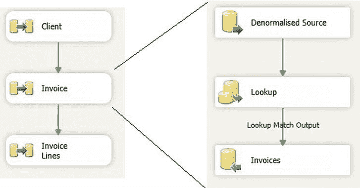
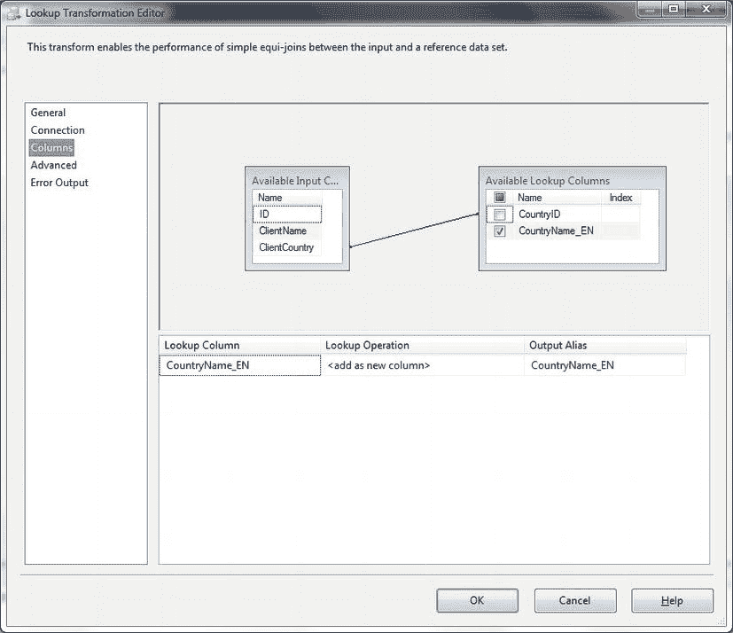
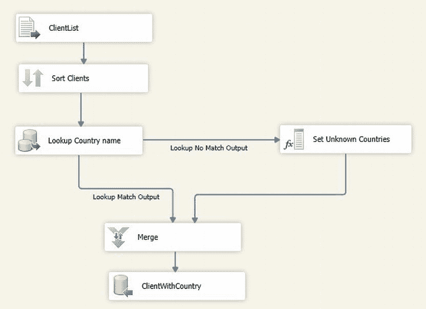

# 在数据识别最高级别元素上创建聚集索引的通用规则

然而，一个经验法则是：在标识数据最高级别（本例中是`Clients`）的元素上创建聚集索引，然后在隔离每个子级别（并映射到相关表）的元素上创建覆盖非聚集索引。本例中是`InvoiceNumber`和`InvoiceID`。

*   如果你将进行数据的插入和更新，那么更安全且更好的做法可能是：首先执行初始规范化到临时表，将这些表与目标表进行交叉引用以查找目标表中的 ID，最后执行任何更新或插入操作。为了加快速度，你可以使用临时表作为中间表，并在必要时为其创建索引。
*   你可以使用`MERGE`（但在`SQL Server 2005`中不可用）而不是`INSERT INTO`，这样你不仅可以插入新记录，还可以更新旧记录。在大多数情况下，这需要在`ON`子句中包含一个自然 ID（或不会被更新的列）。关于`MERGE`的更完整示例，请参见配方 9-24。

## 9-21. 使用 SSIS 将数据规范化到多个关系表中

### 问题

你有一个单一的、非规范化的数据源，需要使用`SSIS`作为数据流的一部分将其规范化。

### 解决方案

使用`SSIS Lookup`转换来规范化数据。以下步骤使用与配方 9-20 相同的源表和目标表来说明具体操作。

1.  创建一个新包，并添加两个`OLEDB`连接管理器（`CarSales_OLEDB`和`CarSales_Staging_OLEDB`），分别配置为访问`CarSales`和`CarSales_Staging`数据库。
2.  删除`CarSales`数据库中`Clients`、`Invoice`和`Invoice_Lines`表中的所有数据。
3.  添加一个数据流任务，将其命名为`Clients`，然后双击进行编辑。
4.  添加一个`OLEDB`源任务，并按如下配置：
    | 配置项 | 值 |
    | :--- | :--- |
    | Name | Denormalized Source |
    | OLEDB Connection Manager | CarSales_Staging_OLEDB |
    | Data Access Mode | SQL Command |
    | SQL Command Text | `SELECT ClientName, Country, Town FROM dbo.DenormalisedSales GROUP BY ClientName, Country, Town ORDER BY ClientName, Country, Town;` |
5.  单击“确定”确认修改。
6.  右键单击`OLEDB`源任务，选择“显示高级编辑器”。选择“输入和输出属性”选项卡。将`OLEDB Source Output`的`IsSorted`属性设置为`True`。展开`OLEDB Source Output/Output columns`。为构成唯一键的列（`ClientName`、`Country`、`Town`）将`SortKeyPosition`分别设置为`1`、`2`和`3`。单击“确定”确认更改。
7.  在数据流窗格上添加一个`Lookup`转换，并将`OLEDB`源任务连接到它。按如下配置：
    | 配置项 | 值 |
    | :--- | :--- |
    | **General** | |
    | Cache Mode | Full Cache |
    | Connection Type | OLEDB Connection |
    | Rows with no matching entries | Redirect to NoMatch output |
    | **Connection** | |
    | Connection Manager | CarSales_OLEDB |
    | Use the results of an SQL query | `SELECT ClientName, Country, Town, ID FROM dbo.Client ORDER BY ClientName, Country, Town;` |
    | Columns | Map the columns ClientName, Country, Town |
    | Available Lookup Columns | ID |
8.  单击“确定”确认更改。
9.  向数据流窗格添加一个`OLEDB`目标任务。使用`NoMatch`输出将`Lookup`任务连接到它。双击进行编辑，并按如下配置：
    | 配置项 | 值 |
    | :--- | :--- |
    | OLEDB Connection Manager | CarSales_OLEDB |
    | Data Access Mode | Table or view – Fast Load |
    | Name of Table or View | dbo.Client |
10. 单击“确定”确认更改。
11. 返回到控制流窗格，添加第二个数据流任务。将其命名为`Invoice`，然后双击进行编辑。
12. 重复步骤 3 至 6，但进行以下修改：
    | 任务与配置项 | 值 |
    | :--- | :--- |
    | **OLEDB source task (step 3)** | |
    | SQL Command Text | `SELECT InvoiceNumber, TotalDiscount, DeliveryCharge, ClientName, Country, Town FROM dbo.DenormalisedSales GROUP BY InvoiceNumber, TotalDiscount, DeliveryCharge, ClientName, Country, Town ORDER BY ClientName, Country, Town;` |
    | **Lookup task (step 6)** | |
    | Rows with no matching entries | Fail Component |
    | Connection | Use the results of an SQL query: `SELECT ClientName, Country, Town, ID FROM dbo.Client ORDER BY ClientName, Country, Town;` |
    | Columns | Map the columns `ClientName, Country, Town` |
    | Available Lookup Columns | ID – output alias `ClientID` |
    | **OLEDB destination task (step 8)** | |
    | Name of Table or View | `dbo.Invoice` |
13. 返回到控制流窗格，添加第三个数据流任务。将其命名为`Invoice_Lines`，然后双击进行编辑。
14. 重复步骤 3 至 6，但进行以下修改：
    | 任务与配置项 | 值 |
    | :--- | :--- |
    | **OLEDB source task (step 3)** | |
    | SQL Command Text | `SELECT InvoiceNumber, SalePrice, StockID FROM dbo.DenormalisedSales ORDER BY InvoiceNumber;` |
    | **Lookup task (step 6)** | |
    | Rows with no matching entries | Fail Component |
    | Connection | Use the results of an SQL query: `SELECT ID, InvoiceNumber FROM dbo.Invoice ORDER BY InvoiceNumber;` |
    | Columns | Map the columns `InvoiceNumber` |
    | Available Lookup Columns | ID – output alias `InvoiceID` |
    | **OLEDB destination task (step 8)** | |
    | Name of Table or View | `dbo.Invoice_Lines` |

最终的包应如图 9-17 所示。



图 9-17. 一个 SSIS 数据规范化包

### 工作原理

`SSIS`本质上可以执行与`T-SQL`相同的序列来规范化非规范化的数据源。这也意味着从最高级别的实体（本例中是客户）开始，逐级处理相关实体（此处通过`Invoice`到`Invoice_Lines`）。规范化总是意味着理解你将如何将源数据分解为关系结构，以及如何在表之间映射关系。使用`SSIS`时，在开始创建包之前，清楚地理解这一点极其重要，因为它决定了你将如何使用`Lookup`转换来查找每个表的外键。

在最高级别（`Client`表），我们通过使用`Lookup`转换读取现有客户端数据，并使用`Lookup`的`NoMatch`输出仅添加尚不存在的客户端，来检测现有客户端。如果你只是在添加新数据，那么这一步是不必要的。

如前面描述的`T-SQL`解决方案一样，此过程从关系层次结构中的最高级别表（`Clients`）开始，逐级向下处理`Invoices`到`Invoice_Lines`。首先，提取客户端数据。这是通过使用`GROUP BY`子句选择唯一的客户端数据来完成的（步骤 3）。任何***新***客户端都会被添加到目标表（`Clients`）中。通过使用`Lookup`转换来检测新记录，其中只有未在目标表中找到的记录才被允许进入目标表。第二个数据流任务隔离任何`Invoice`数据，并使用`Lookup`任务来推断`ClientID`。这将是关系模式中的外键。最后，对`Invoice_Lines`应用类似的过程，只是这里使用`Lookup`任务查找的是`InvoiceID`。

#### 提示、技巧与陷阱

*   在检测现有客户端和为发票查找客户端 ID 时，你不能重用客户端 ID 的查找缓存，因为一旦添加了新客户端，数据就会发生变化，这会使缓存过时。

## 9-22. 在 T-SQL 中通过引用查找表实现数据反规范化

### 问题

你希望在将已经加载到`SQL Server`中的表中的数据反规范化时，确保正确使用引用（或查找）表。


### 解决方案

谨慎使用基本的 `JOIN` 操作，确保在数据源中正确使用查找表。

这里以方案 9-21 为例。如果你查看第 3 步，并假定必须使用“国家”字段从 Countries 表中获取该国的 ID，那么可以使用以下 T-SQL 代码片段来替换仅查找客户信息的“简单”`SELECT` 语句 (`C:\SQL2012DIRecipes\CH09\LookupNormalisation.sql`)：

```sql
SELECT DISTINCT
    DNS.ClientName,
    DNS.Country,
    DNS.Town,
    C.ID AS CountryID
FROM
    CarSales_Staging.dbo.DenormalisedSales DNS
    INNER JOIN CarSales_Staging.dbo.Countries C
    ON DNS.Country = C.CountryCode
WHERE NOT EXISTS (
    SELECT ID
    FROM dbo.Client
    WHERE ClientName = DNS.ClientName
    AND Country = DNS.Country
    AND Town = DNS.Town
);
```

### 工作原理

使用这段 T-SQL 而非方案 9-21 中的原始代码，将导入相关的国家名称而非其 ID。考虑到数据架构不需要如此精细的规范化级别，这是一个相当“经典”的需求，以避免过度规范化以及过度使用查找表。

#### 提示、技巧与陷阱

*   如果你需要允许 `NULL` 值，请使用 `LEFT OUTER JOIN` 代替 `INNER JOIN`。
*   当然，你可以在单个 T-SQL 语句中执行多次查找。但请注意，过多的查找会减慢处理速度。

## 9-23. 在 SSIS 中通过引用查找表对数据进行反规范化

### 问题

你希望在使用 SSIS 的 ETL 过程中确保正确引用查找表，以避免数据过度规范化。

### 解决方案

在数据流中使用“查找”组件，并充分映射数据，以便使用查找数据替代源中的引用代码。以下是一个示例。

1.  创建一个新的 SSIS 包。
2.  添加两个新的 OLEDB 连接管理器。一个命名为 `CarSales_OLEDB`，配置为连接到 CarSales 数据库；另一个命名为 `CarSales_Staging_OLEDB`，配置为连接到 CarSales_Staging 数据库。
3.  添加一个新的平面文件连接管理器，配置为连接到 `C:\SQL2012DIRecipes\CH09\ClientList.Csv` 文件。将其命名为 `ClientList`。在“高级”选项卡中，为三列设置数据类型如下：
    | ID: | 四字节有符号整数 |
    | ClientName: | 字符串 [DT_STR] – 长度 50 |
    | ClientCountry: | 单字节无符号整数 |
4.  创建以下目标表（在 CarSales_Staging 数据库中）：
    ```sql
    CREATE TABLE dbo.ClientWithCountry
    (
        ID numeric(20, 0) NULL,
        ClientName VARCHAR(50) NULL,
        CountryName_EN NVARCHAR(50) NULL
    );
    GO
    ```
5.  添加一个“数据流任务”，并切换到“数据流”选项卡。
6.  添加一个“平面文件源”组件，将其重命名为 `ClientList`。双击进行编辑。
7.  配置它指向平面文件连接管理器 `ClientList`。单击“确定”关闭“平面文件源编辑器”。
8.  添加一个“排序”任务，并将“平面文件源”组件连接到它。将其命名为 `Sort Clients`。双击进行编辑。在“可用输入列”中，勾选 ID 以按 ID 排序。单击“确定”关闭“排序转换编辑器”。
9.  添加一个“查找”任务，并将 `Sort Clients` 任务连接到它。将其命名为 `Lookup Country Name`。双击进行编辑。
10. 在“常规”选项卡中，设置以下选项：
    | 缓存模式: | 完全缓存 |
    | 连接类型: | OLEDB 连接管理器 |
    | 指定如何处理没有匹配项的行: | 将行重定向到无匹配输出 |
11. 在“连接”选项卡中，设置以下选项：
    | OLEDB 连接管理器: | `CarSales_OLEDB` |
    | 使用 SQL 查询的结果: | `SELECT CountryID, CountryName_EN FROM Countries ORDER BY CountryID` |
12. 在“列”选项卡中，将 `ClientCountry` 从“可用输入列”拖拽链接到“可用查找列”中的 `CountryID`，如 图 9-18 所示。
    
    图 9-18. “查找转换编辑器”中的查找列
13. 单击“确定”确认修改。
14. 添加一个“派生列”任务，并将“查找”任务连接到它。出现提示时，选择“查找无匹配输出”。双击编辑“派生列”任务。
15. 在“派生列转换编辑器”对话框下半部分的网格中，添加一个名为 `CountryName_EN` 的派生列。将其表达式设置为 `N/A`（带双引号）。单击“确定”确认修改。
16. 在“数据流”选项卡中添加一个“合并”任务。将 `Lookup Country Name` 任务连接到它。出现提示时，确保“输入”是“合并输入 1”，并且“输出”是“查找匹配输出”。单击“确定”确认。
17. 将“派生列”转换连接到“合并”任务。
18. 添加一个“OLEDB 目标”任务。将其命名为 `Client With Country`。双击进行编辑并配置如下：
    | OLEDB 连接管理器: | CarSales_Staging |
    | 数据访问模式: | 表或视图 – 快速加载 |
    | 表或视图的名称: | dbo.ClientWithCountry |
19. 单击左侧的“映射”，确保每个源字段都映射到同名的目标字段。注意 `ClientCountry`（源国家 ID 字段）未被映射。
20. 单击“确定”完成修改。数据流应如 图 9-19 所示。
    
    图 9-19. 使用查找任务对数据进行反规范化时完成的数据流

你现在可以运行该包，导入并反规范化数据。

### 工作原理

此过程使用一个引用列（源文件中的 `ClientCountry`），并用它在引用表 (`CarSales.Dbo.Countries`) 中查找相应的国家。由于此方法会排除任何没有对应引用元素的源记录，因此也使用了“无匹配输出”，并将其与“匹配输出”合并，以确保所有记录都发送到目标。实际上，此过程用国家名称替代了国家的 ID。

#### 提示、技巧与陷阱

*   将 SQL Server 中的 `TINYINT` 数据类型映射到 SSIS 时，必须将 SSIS 数据类型设置为单字节无符号整数。

## 9-24. 使用 T-SQL 处理类型 1 缓慢变化维度

### 问题

你需要确保处理过程中的所有源数据都在目标表中更新，并添加任何新记录。

### 解决方案

使用 T-SQL `MERGE` 命令来同时添加新记录和更新现有记录。以下步骤描述了如何操作。

1.  假设你有一个包含所需所有值、业务键（来自源数据的客户 ID）以及将用于数据仓库的代理键的目标表。该表的 DDL 如下 (`C:\SQL2012DIRecipes\CH09\tblClient_SCD1.sql`)：
    ```sql
    CREATE TABLE CarSales_Staging.dbo.Client_SCD1
    (
        ClientID INT IDENTITY(1,1) NOT NULL,
        BusinessKey INT NOT NULL,
        ClientName VARCHAR(150) NULL,
        Country VARCHAR(50) NULL,
        Town VARCHAR(50) NULL,
        County VARCHAR(50) NULL,
        Address1 VARCHAR(50) NULL,
        Address2 VARCHAR(50) NULL,
        ClientType VARCHAR(20) NULL,
        ClientSize VARCHAR(10) NULL
    ) ;
    GO
    ```


