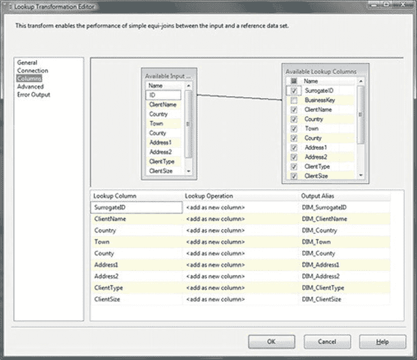
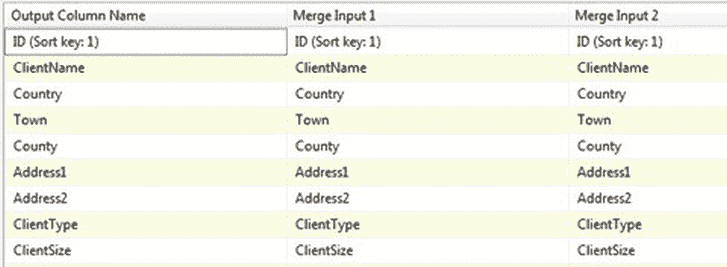
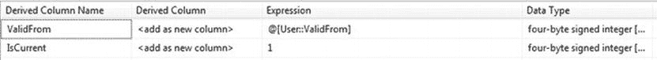
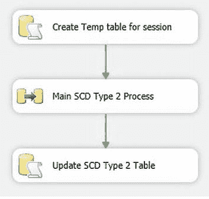
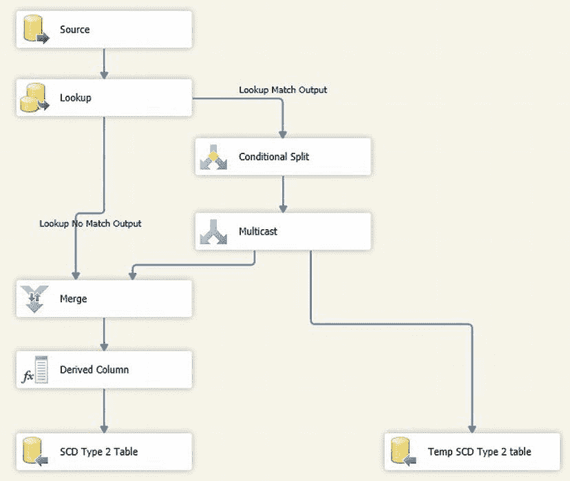

# 在 SSIS 中实现缓慢变化维度

## 操作步骤

14. 在“列”窗格中，将 `ID` 列（可用输入列）映射到 `BusinessKey` 列（可用查找列）。然后，从可用查找列中选择除 `ValidFrom`、`ValidTo` 和 `IsCurrent` 之外的所有其他列。通过为所有查找列添加 `DIM_` 前缀来为其设置别名。对话框应类似于图 9-20。
    
    图 9-20. SSIS 类型 2 SCD 的查找列
15. 单击“确定”进行确认。
16. 添加一个“条件性拆分”转换，并使用“查找匹配输出”将“查找”转换连接到它。双击进行编辑。创建一个名为 **DataDifference** 的输出，并设置如下条件：
    ```
    (ClientSize != DIM_ClientSize) || (ClientName != [ClientName])
    ```
17. 为**每个字段**输入比较条件后（此处仅显示一个），单击“确定”完成修改。
18. 添加一个“多播”转换，并使用 `DataDifference` 输出将“条件性拆分”转换连接到它。
19. 添加一个“合并”转换，并将“查找”转换连接到它。确保选择“查找无匹配输出”并将其映射到“合并输入 1”。然后将“多播”转换连接到“合并”转换。双击进行编辑。确保列已正确映射，如图 9-21 所示。
    
    图 9-21. SSIS 中的合并列映射
20. 添加一个“派生列”转换，将“合并”转换连接到它，并添加两个派生列，如图 9-22 所示。
    
    图 9-22. “派生列”转换
21. 单击“确定”确认。
22. 添加一个 `OLEDB` 目标，并将“派生列”转换连接到它。按如下方式配置：
    | OLEDB 连接管理器 | `CarSales_Staging_OLEDB` |
    | 数据访问模式 | 表或视图 – 快速加载 |
    | 表或视图的名称 | `dbo.Client_SCDSSIS2` |
23. 确保列已映射——包括将源数据 `ID` 列映射到 SCD 类型 2 表的业务键——之后，单击“确定”确认。
24. 添加一个 `OLEDB` 目标，并将“多播”转换连接到它。按如下方式配置：
    | OLEDB 连接管理器 | `CarSales_Staging_OLEDB` |
    | 数据访问模式 | 表名或视图名变量 |
    | 变量名称 | `User::TempTable` |
25. 单击“映射”并确保源数据中的 `ID` 列已映射到目标表的 `SurrogateID` 列。确认列映射无误后，单击“确定”。数据流已完成，如图 9-22 所示。
26. 返回到“控制流”选项卡，添加一个“执行 SQL 任务”。将其命名为 **Update SCD Type 2 table**。将之前的数据流任务连接到它，并按如下方式配置：
    | 连接 | `CarSales_Staging_OLEDB` |
    | SQL 语句 | `UPDATE SCDSSIS2 SET SCDSSIS2.IsCurrent = 0, SCDSSIS2.ValidTo = YEAR(DATEADD(d,-1,GETDATE())) * 100000 + MONTH(DATEADD(d,-1,GETDATE())) * 1000 + DAY(DATEADD(d,-1,GETDATE())) FROM dbo.Client_SCDSSIS2 SCDSSIS2 INNER JOIN Tmp_Client_SCDSSIS2 TMP ON SCDSSIS2.SurrogateID = TMP.SurrogateID WHERE SCDSSIS2.IsCurrent = 1` |

## 工作原理

不幸的是，在 SSIS 中高效处理缓慢变化维度并不直观，也没有想象中那么简单。

是的，自 SSIS 出现以来，就一直存在一个“缓慢变化维度”转换，但遗憾的是，它更像是一个学习工具，而非适合真实世界的组件。我甚至不建议在这里使用它。

因此，你剩下的是一个不太理想的解决方案：编写自己的 SSIS 包来处理缓慢变化维度。幸运的是，类型 1 SCD 不过是就地更新（或为新数据插入）。然而，当涉及到类型 2 SCD 时，这个包就相当复杂了，以下是其功能概述：

*   连接到当前维度表。
*   连接到源数据表或视图。
*   检测任何新的维度记录（通过映射两个数据集之间的业务键并检测无匹配的位置）并加载它们。
*   分析两个数据源中的所有现有记录，并比较属性字段。其中任何一项出现差异时，将发生两件事：
    *   为维度数据的最新版本添加一条新记录（适当标记为有效）。
    *   将之前有效的版本更新为有效性设置为 `false`，并设置其失效日期。

为了使其工作，对现有记录的更新将使用会话范围的临时表来标识要更新的记录。通过这种方式，一组用于后续更新的记录 ID 可以作为核心数据流过程的一部分存储，并且在该“核心”过程完成后，可以运行更新命令。最初，这个临时表将持久化在磁盘上。一旦所有调试完成，它将被会话范围的临时表 `##Tmp_Client_SCDSSIS2` 替代。这种方法的主要优点是避免了在数据流中使用 `OLEDB` 命令转换，该转换会为每条记录触发——却应用于整个维度表，给服务器带来大量不必要的工作。

这意味着整体的高级流程如图 9-23 所示。

图 9-23. SSIS SCD 类型 2 流程

“核心”流程——即图 9-23 中的数据流任务——如图 9-24 所示。

图 9-24. SSIS SCD 类型 2 流程详情

一旦一切工作正常，可以删除临时表——并使用会话范围的表代替它。然而，在开发阶段使用它是至关重要的。

因此，一旦包运行并调试完成，你可以执行以下操作：

1.  将 `TempTable` 的变量值更改为 `##Tmp_Client_SCDSSIS2`。
2.  修改任务“Update SCD Type 2 table”中的引用，以便使用的临时表是会话范围的临时表。代码需要调整为使用：
    ```
    INNER JOIN ##Tmp_Client_SCDSSIS2 TMP
    ```
3.  在 `CarSales` 数据库中删除 `dbo.Tmp_Client_SCDSSIS2` 表。

现在，你的 SSIS 包将使用会话范围的临时表来更新目标表记录，并避免在数据库中保留一个额外的表。

## 提示、技巧和陷阱

*   在“查找”转换中为维度列设置别名的原因有：(a) 它使跟踪包中具有相同名称的列的使用变得容易得多，(b) 它防止 SSIS 应用两部分或三部分的点表示法名称，这些名称可能很快变得难以操作。
*   对两个源数据集（源和查找）进行排序并告知 SSIS 它们已排序非常重要。否则，你会从“合并”转换中得到一些非常奇怪的结果。
*   务必实现 `NULL` 处理，否则“条件性拆分”将失败。
*   如果你处理的是大型维度，那么应将缓存文件放在尽可能快的磁盘阵列上——如果可能，甚至放在固态硬盘上。


