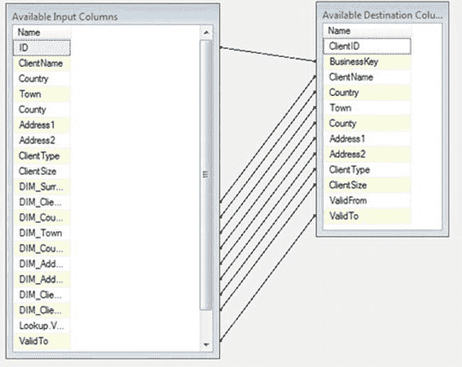

# 此处的任何速度提升都将对整个软件包产生显著影响。

## 9-27. 使用 T-SQL 处理第三类缓慢变化维度

### 问题
你需要使用 T-SQL 在目标表的一个非规范化单记录中跟踪一个或多个列的上一个版本。

### 解决方案
使用 T-SQL 中的 `MERGE` 命令来执行第三类缓慢变化维度操作。以下步骤说明了如何操作。

1.  使用以下 DDL 创建两张表 (`C:\SQL2012DIRecipes\CH09\tblClient_SCD3.sql`):
    ```sql
    CREATE TABLE CarSales_Staging.dbo.Client_SCD3
    (
     ClientID INT IDENTITY(1,1) NOT NULL,
     BusinessKey INT NOT NULL,
     ClientName VARCHAR(150) NULL,
     Country VARCHAR(50) NULL,
     Country_Prev1 VARCHAR(50) NULL,
     Country_Prev1_ValidTo INT NULL,
     Country_Prev2 VARCHAR(50) NULL,
     Country_Prev2_ValidTo INT NULL,
    ) ;
    GO
    ```

2.  运行以下代码片段 (`C:\SQL2012DIRecipes\CH09\SCD3.sql`):
    ```sql
    USE CarSales_Staging;
    GO

    DECLARE @Yesterday INT = CAST(CAST(YEAR(DATEADD(dd,-1,GETDATE())) AS CHAR(4)) + RIGHT('0' + CAST(MONTH(DATEADD(dd,-1,GETDATE())) AS VARCHAR(2)),2) + RIGHT('0' + CAST(DAY(DATEADD(dd,-1,GETDATE())) AS VARCHAR(2)),2) AS INT)

    MERGE    CarSales_Staging.dbo.Client_SCD3        AS DST
    USING    CarSales.dbo.Client                     AS SRC
    ON       (SRC.ID = DST.BusinessKey)

    WHEN NOT MATCHED THEN
        INSERT (BusinessKey, ClientName, Country)
        VALUES (SRC.ID, SRC.ClientName, SRC.Country)

    WHEN MATCHED
        AND    (DST.Country <> SRC.Country
                OR DST.ClientName <> SRC.ClientName)

    THEN UPDATE

    SET       DST.Country = SRC.Country
            , DST.ClientName = SRC.ClientName
            , DST.Country_Prev1 = DST.Country
            , DST.Country_Prev1_ValidTo = @Yesterday
            , DST.Country_Prev2 = DST.Country_Prev1
            , DST.Country_Prev2_ValidTo = DST.Country_Prev1_ValidTo
    ;
    ```

### 工作原理
需要明确的是，第三类缓慢变化维度将非规范化应用于表，使用多个列集来提供版本控制。我发现将其理解为**非规范化数据**有助于理解第三类缓慢变化维度。这使你能够专注于理解这种方法的局限性和缺点。换句话说，只有在别无选择时才使用它！第三类缓慢变化维度是单个表，对于每个你希望跟踪其演变过程的数值，都有一组重复的列，以及数据演变发生的日期。这很不优雅，会导致表变得极其宽，并且在某些时候会涉及丢失历史数据，因为你不可能为所有时间都保留先前的列版本——因为 SQL Server 最终会耗尽列数。

然而，为了完整起见，了解一下如何应用这项技术是值得的。我在此示例中只展示了如何跟踪一个属性列，并且只跟踪两个先前版本。但是，一旦确立了原则，将模型扩展以处理多个列和多个先前版本就非常容易了。

前面的 SQL 代码片段将根据业务键映射两个表，以及执行以下操作：
*   如果不存在对应业务键的记录，则插入一条新记录。
*   如果业务键已存在：
    *   将 `Country` 的先前值移动到“前-2”列，并添加移动发生的日期。
    *   将 `Country` 的值移动到“前-1”列，并添加移动发生的日期。
    *   将最新的国家添加到 `Country` 列。

再次强调——如在配方 9-25 和 9-26 中一样——我从一个数据库 (`CarSales`) 获取源数据，并更新另一个数据库 (`CarSales_Staging`) 中的数据。

源对象和目标对象可以在同一个数据库中，也可以在跨链接服务器的不同数据库中。

### 提示、技巧和陷阱
*   再次说明，`ValidTo` 日期被添加为 `INT` 数据类型，而不是 `DATE` 或 `DATETIME`，纯粹是考虑到未来加载到 Analysis Services 的需要，在那里数据类型的选择不仅可以让日期更易于操作，还可以提高处理时间。如果需要，可以随意使用任何日期数据类型。
*   此示例不需要 `IsCurrent` 标志，因为根据定义，`Town` 列就是当前版本。
*   你也可以作为此方法的一部分更新数据，正如我使用 `ClientName` 字段所示。

## 9-28. 使用 T-SQL 处理第四类缓慢变化维度

### 问题
作为 ETL 流程的一部分，你需要将当前数据存储在一个表中，将历史数据存储在第二个表中。

### 解决方案
使用 `MERGE` 命令在 T-SQL 中执行第四类缓慢变化维度数据流。以下步骤说明了如何操作。

1.  使用以下 DDL 创建两张表 (`C:\SQL2012DIRecipes\CH09\tblClient_SCD4andHistory.Sql`):
    ```sql
    CREATE TABLE CarSales_Staging.dbo.Client_SCD4_History
    (
     ClientID INT IDENTITY(1,1) NOT NULL,
     BusinessKey INT NOT NULL,
     ClientName VARCHAR(150) NULL,
     Country VARCHAR(50) NULL,
     Town VARCHAR(50) NULL,
     County VARCHAR(50) NULL,
     Address1 VARCHAR(50) NULL,
     Address2 VARCHAR(50) NULL,
     ClientType VARCHAR(20) NULL,
     ClientSize VARCHAR(10) NULL,
     ValidTo INT,
     HistoricalVersion INT
    ) ;
    GO

    CREATE TABLE CarSales_Staging.dbo.Client_SCD4
    (
     ClientID INT IDENTITY(1,1) NOT NULL,
     BusinessKey INT NOT NULL,
     ClientName VARCHAR(150) NULL,
     Country VARCHAR(50) NULL,
    ) ;
    GO
    ```

2.  运行以下代码 (`C:\SQL2012DIRecipes\CH09\SCD4.sql`):
    ```sql
    USE CarSales_Staging;
    GO

    -- 定义有效性中使用的日期 - 假设为完整的 24 小时周期
    DECLARE @Yesterday INT = CAST(CAST(YEAR(DATEADD(dd,-1,GETDATE())) AS CHAR(4)) + RIGHT('0' + CAST(MONTH(DATEADD(dd,-1,GETDATE())) AS VARCHAR(2)),2) + RIGHT('0' + CAST(DAY(DATEADD(dd,-1,GETDATE())) AS VARCHAR(2)),2) AS INT)
    DECLARE @Today INT = CAST(CAST(YEAR(GETDATE()) AS CHAR(4)) + RIGHT('0' + CAST(MONTH(GETDATE()) AS VARCHAR(2)),2) + RIGHT('0' + CAST(DAY(GETDATE()) AS VARCHAR(2)),2) AS INT);

    -- 如果存在，则删除临时表
    IF OBJECT_ID('Tempdb..#Tmp_Client') IS NOT NULL DROP TABLE #Tmp_Client;

    CREATE TABLE #Tmp_Client
    (
     BusinessKey INT NOT NULL,
     ClientName VARCHAR(150) NULL,
     Country VARCHAR(50) NULL,
     Town VARCHAR(50) NULL,
     County VARCHAR(50) NULL,
     Address1 VARCHAR(50) NULL,
     Address2 VARCHAR(50) NULL,
     ClientType VARCHAR(20) NULL,
     ClientSize VARCHAR(10) NULL,
    ) ;

    -- 外部插入，用于处理现有记录更改时的第四类记录，使用从 MERGE 输出到临时表的数据
    INSERT INTO #Tmp_Client (BusinessKey, ClientName, Country, Town, Address1, Address2, ClientType, ClientSize)
        SELECT BusinessKey, ClientName, Country, Town, Address1, Address2, ClientType, ClientSize
    FROM
        (
        -- Merge 语句
        MERGE    CarSales_Staging.dbo.Client_SCD4          AS DST
        USING    CarSales.dbo.Client                       AS SRC
        ON       (SRC.ID = DST.BusinessKey)

        WHEN NOT MATCHED THEN
            INSERT (BusinessKey, ClientName, Country, Town, Address1, Address2, ClientType, ClientSize)
            VALUES (SRC.ID, SRC.ClientName, SRC.Country, SRC.Town, SRC.Address1, SRC.Address2, SRC.ClientType, SRC.ClientSize)

        WHEN MATCHED
            AND     ISNULL(DST.ClientName,'') <> ISNULL(SRC.ClientName,'')
            OR ISNULL(DST.Country,'') <> ISNULL(SRC.Country,'')
            OR ISNULL(DST.Town,'') <> ISNULL(SRC.Town,'')
            OR ISNULL(DST.Address1,'') <> ISNULL(SRC.Address1,'')
            OR ISNULL(DST.Address2,'') <> ISNULL(SRC.Address2,'')
            OR ISNULL(DST.ClientType,'') <> ISNULL(SRC.ClientType,'')
            OR ISNULL(DST.ClientSize,'') <> ISNULL(SRC.ClientSize,'')

        THEN UPDATE
            SET     DST.ClientName = SRC.ClientName
                ,   DST.Country = SRC.Country
                ,   DST.Town = SRC.Town
                ,   DST.Address1 = SRC.Address1
                ,   DST.Address2 = SRC.Address2
                ,   DST.ClientType = SRC.ClientType
                ,   DST.ClientSize = SRC.ClientSize

        OUTPUT $ACTION, SRC.ID, SRC.ClientName, SRC.Country, SRC.Town, SRC.Address1, SRC.Address2, SRC.ClientType, SRC.ClientSize
        ) AS Changes (Action, BusinessKey, ClientName, Country, Town, Address1, Address2, ClientType, ClientSize)
    WHERE Action = 'UPDATE';
    ```


### SQL 代码片段

```sql
Address2,'')     OR ISNULL(DST.ClientType,'') <> ISNULL(SRC.ClientType,'')     OR ISNULL(DST.ClientSize,'') <> ISNULL(SRC.ClientSize,'')          THEN UPDATE          SET             DST.ClientName = SRC.ClientName            ,DST.Country = SRC.Country            ,DST.Town = SRC.Town            ,DST.Address1 = SRC.Address1            ,DST.Address2 = SRC.Address2            ,DST.ClientType = SRC.ClientType            ,DST.ClientSize = SRC.ClientSize               OUTPUT DELETED.BusinessKey, DELETED.ClientName, DELETED.Country, DELETED.Town, DELETED.Address1, DELETED.Address2, DELETED.ClientType, DELETED.ClientSize, $Action AS MergeAction     ) AS MRG     WHERE MRG.MergeAction = 'UPDATE'     ;
```

```sql
-- 更新历史表，设置截止日期和版本号
UPDATE      TP4
SET         TP4.ValidFrom = @Yesterday
FROM        CarSales_Staging.dbo.Client_SCD4_History TP4
INNER JOIN  #Tmp_Client TMP
            ON TP4.BusinessKey = TMP.BusinessKey
WHERE       TP4.ValidFrom IS NULL;
```

```sql
-- 将最新的历史记录添加到历史表中
INSERT INTO CarSales_Staging.dbo.Client_SCD4_History
(
 BusinessKey
 ,ClientName
 ,Country
 ,Town
 ,County
 ,Address1
 ,Address2
 ,ClientType
 ,ClientSize
 ,ValidFrom
 ,HistoricalVersion
)
SELECT
 BusinessKey
 ,ClientName
 ,Country
 ,Town
 ,County
 ,Address1
 ,Address2
 ,ClientType
 ,ClientSize
 ,@Today
 ,(SELECT ISNULL(MAX(HistoricalVersion),0) + 1 AS HistoricalVersion FROM dbo.Client_SCD4_History WHERE BusinessKey = Tmp.BusinessKey)
FROM    #Tmp_Client Tmp;
```

### 工作原理

我在此向您展示的此主题的最终变体，是类型 4 SCD。它基本上是一个类型 2 表，带有一个用于存储数据先前版本的单独历史表。类型 4 是一种多表拆分，其中最新数据存储在“活动”表中，而较旧数据存储在历史表中。

此方案需要：

*   一个包含所有必需值、一个业务键（源数据中的客户端 ID）和一个用于数据仓库的代理键的目标表。这与之前描述的 `Client_SCD1` 表在所有方面都相同。但在此，为了清晰起见，我将其复制并命名为 `Client_SCD4`。再次说明，所有目标表都位于 `CarSales_Staging` 数据库中，但也可以与源位于同一数据库，甚至位于另一台服务器上。
*   一个用于存储维度数据历史版本的目标表。此表与维度表相同，但包含两个附加字段：`ValidTo` 和 `HistoricalVersion`。前者存储数据不再为当前的日期，后者提供一个版本号，可帮助跟踪数据演变的频率。

SQL 代码段在业务键上映射源表和主目标表，同时从 `CarSales_Staging` 数据库获取源数据。它还执行以下操作。

*   如果不存在该业务键的记录，则插入一条新记录。
*   如果记录存在：
    *   将旧记录移至历史表。
    *   向主目标表添加一条新记录。

请注意使用 `DELETED` 表来获取表 `Client_SCD4` 中数据的先前值，而不是默认返回的当前值。此外，不必使用 `OUTPUT` 子句将 `MERGE` 命令的数据返回到会话范围的临时表，您可以在 `MERGE` 语句中将数据插入到表变量中。但是，对于较大的数据集，临时表（特别是如果为其创建了索引）使用起来效率可能更高，因此我更喜欢在 ETL 过程中使用它们，除非我非常确信输出记录最多只有几百条。

9-29。

### 使用 SSIS 处理类型 4 缓慢变化维度

#### 问题

作为 ETL 流程的一部分，您需要将当前数据存储在一个表中，并将历史数据作为 SSIS 数据流的一部分存储在第二个表中。

#### 解决方案

使用 SSIS 多播和条件拆分任务来处理类型 4 SCD。以下步骤概述了如何操作。

1.  在磁盘上创建一个临时表（用于测试和调试），该表最终将被会话范围的临时表替换——如配方 9-28 中所做。其 DDL 为（`C:\SQL2012DIRecipes\CH09\tblTmpSCD4.sql`）：

    ```sql
    CREATE TABLE CarSales_Staging.dbo.Tmp_SCD4
    (
     ID INT NOT NULL,
     ClientName VARCHAR(150) NULL,
     Country VARCHAR(50) NULL,
     Town VARCHAR(50) NULL,
     County VARCHAR(50) NULL,
     Address1 VARCHAR(50) NULL,
     Address2 VARCHAR(50) NULL,
     ClientType VARCHAR(20) NULL,
     ClientSize VARCHAR(10) NULL
    );
    GO
    ```

2.  创建一个类型 4 历史表，如配方 9-28 所述，以及 `Client_SCD4` 类型 1 表，也如配方 9-28 所述。
3.  执行前一个配方中的步骤 1 至 10，只是步骤 4 中临时表的代码将如下所示（`C:\SQL2012DIRecipes\CH09\tblTmpSessionSCD4.sql`）：

    ```sql
    CREATE TABLE ##Tmp_SCD4
    (
     ID INT NOT NULL,
     ClientName VARCHAR(150) NULL,
     Country VARCHAR(50) NULL,
     Town VARCHAR(50) NULL,
     County VARCHAR(50) NULL,
     Address1 VARCHAR(50) NULL,
     Address2 VARCHAR(50) NULL,
     ClientType VARCHAR(20) NULL,
     ClientSize VARCHAR(10) NULL
    );
    ```

4.  确保步骤 2 中临时表的变量名称为 `Tmp_SCD4`。
5.  添加一个 OLEDB 目标，并使用查找无匹配输出将其连接到查找转换。按如下方式配置：
    | OLEDB 连接管理器： | `CarSales_Staging_OLEDB` |
    | 数据访问模式： | 表或视图 – 快速加载 |
    | 表或视图名称： | `dbo.Client_SCD` |
6.  确保列映射正确后，单击“确定”确认。
7.  添加一个派生列转换，将多播转换连接到它，并添加一个派生列，如下所示：
    | 派生列名称： | `ValidFrom` |
    | 表达式： | `@[User::ValidTo]` |
8.  添加一个 OLEDB 目标，并将派生列转换连接到它。按如下方式配置：
    | OLEDB 连接管理器： | `CarSales_Staging_OLEDB` |
    | 数据访问模式： | 表或视图 – 快速加载 |
    | 表或视图名称： | `dbo.Client_SCD4_History` |
9.  确保使用维度表中的列进行了映射（这一点非常重要）后，单击“确定”确认。列映射应如图 9-25 所示（此示例中，源 `ID` 是业务键）。

    
    图 9-25. 维度列映射

10. 添加一个 OLEDB 目标，并将派生列转换连接到它。按如下方式配置：
    | OLEDB 连接管理器： | `CarSales_Staging_OLEDB` |
    | 数据访问模式： | 表或视图 – 快速加载 |
    | 表或视图名称： | `Tmp_SCD4` |
11. 确保使用数据源中的数据进行了映射（这同样极其重要）后，单击“确定”确认。
12. 返回到控制流窗格，添加一个执行 SQL 任务。将其命名为**更新维度表**。将先前的数据流任务连接到它，并按如下方式配置：
    | 连接： | `CarSales_Staging_OLEDB` |
    |  | `UPDATE DIM SET SCD2.ValidFrom = YEAR(DATEADD(d,-1,GETDATE())) * 100000 + MONTH(DATEADD(d,-1,GETDATE())) * 1000 + DAY(DATEADD(d,-1,GETDATE())) ,DIM.ClientName = TMP.ClientName ,DIM.Country = TMP.Country ,DIM.Town = TMP.Town ,DIM.County = TMP.County ,DIM.Address1 = TMP.Address1 ,DIM.` |


