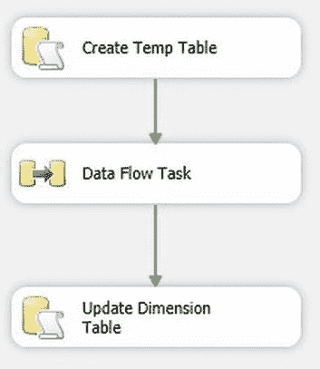
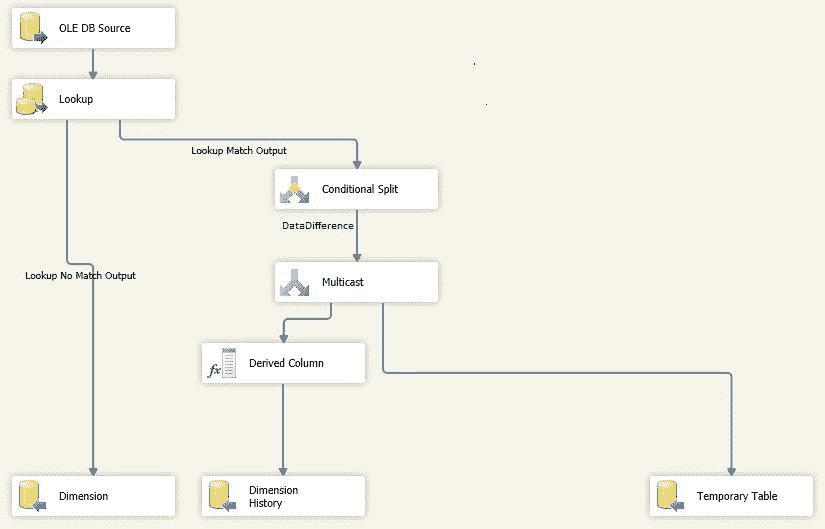
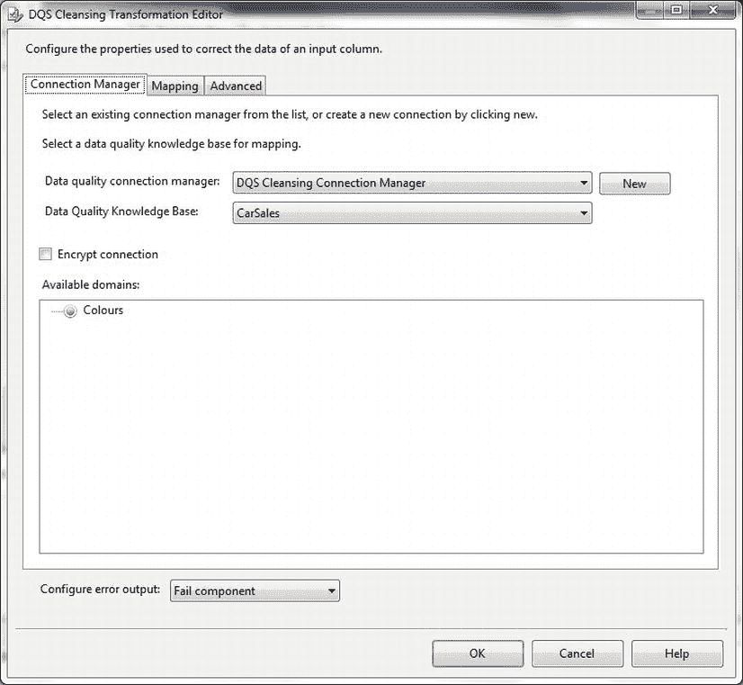
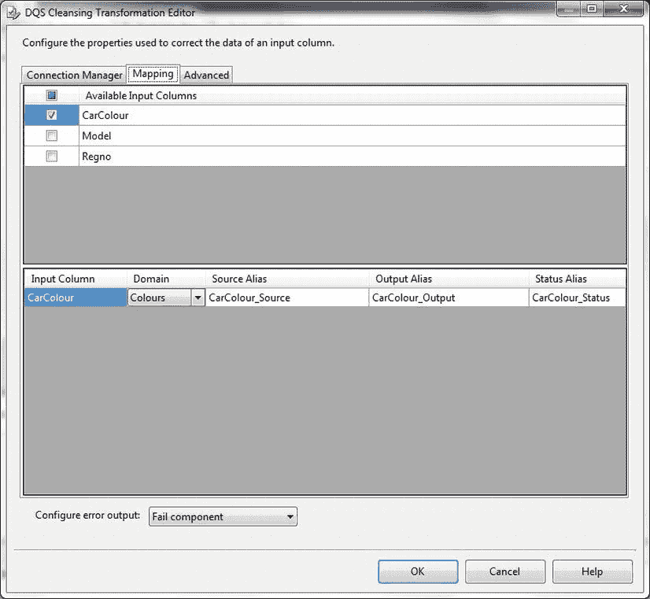
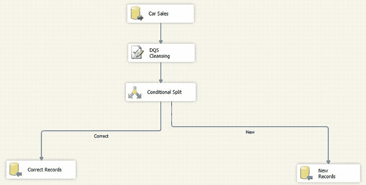

# SSIS 维护类型 4 缓慢变化维度及数据清洗

## 维护类型 4 SCD

`Address2` = `TMP.Address2`, `DIM.ClientType` = `TMP.ClientType`, `DIM.ClientSize` = `TMP.ClientSize` FROM `dbo.Client_SCD4` DIM INNER JOIN `Tmp_SCD4` TMP ON `DIM.ClientID` = `TMP.ID`

### 工作原理

由于类型 2 和 4 的 SCD 处理起来更困难，它们需要一些巧妙的 SSIS 编程才能既高效（尤其是处理大型维度时）又易于维护。如你所见，本配方和前一个配方中给出的方法试图平衡这两个相互冲突的需求。尽管如此，请不要假设这些是处理 SSIS 中 SCD 问题的唯一方法，请随意扩展和调整它们以满足你的特定需求。

使用 SSIS 维护类型 4 缓慢变化维度在很大程度上是维护类型 2 SCD 技术（在配方 9-26 中描述过）的延伸。因此我没有详细描述每一个步骤，而只是强调了差异。图 9-26 显示了最终的包的样子。


*图 9-26. SSIS 类型 4 SCD 的高级数据流*

而数据流任务看起来如图 9-27 所示。


*图 9-27. SSIS 类型 4 SCD 的数据流详情*

该包执行以下操作：

*   获取源数据，使用业务键映射到维度表，并将任何不匹配（新）的记录直接发送到维度表。
*   检测维度表中已存在且与源记录不同的任何记录。由于源数据和现有维度数据都在数据流中，已更改（历史）记录可以直接发送到维度历史表。
*   现有维度记录的新（更改）数据被发送到临时表。
*   最后，维度表用现有记录的新数据进行更新。

包运行后，如果你对其结果满意，可以执行以下操作：

*   将 `TempTable` 的变量值更改为 `##Tmp_SCD4`。
*   修改“更新 SCD 类型 4 表”任务中的引用，以便使用的临时表是会话范围的临时表。代码需要调整为使用：
    ```
    INNER JOIN ##Tmp_SCD4 TMP
    ```
*   在 `CarSales` 数据库中删除 `dbo.Tmp_SCD4` 表。

## 9-30. 作为 ETL 过程的一部分清洗数据

### 问题

你希望使用 SSIS 作为 ETL 过程的一部分来清洗数据。

### 解决方案

在 SSIS 2012 中使用 SQL Server Data Quality Services，步骤如下。

1.  确保 SQL Server 2012 实例上已安装并运行 Data Quality Services。
2.  创建一个新的 SSIS 包，并添加以下两个连接管理器（在项目或包级别）：

    | 名称 | 类型 | 数据源 | 注释 |
    |---|---|---|---|
    | `CarSales_Staging_OLEDB` | OLEDB | `CarSales_Staging` | 源数据的连接。 |
    | `CarSales_OLEDB` | OLEDB | `CarSales` | 目标数据库的连接。 |

3.  添加一个新的数据流任务并切换到数据流窗格。
4.  添加一个 OLEDB 源并按如下配置：
    *   名称：`Car Sales`
    *   连接管理器：`CarSales_Staging_OLEDB`
    *   数据访问模式：`表或视图`
    *   表或视图名称：`CarColoursForDQSInSSIS`
5.  添加一个 DQS 清洗任务，将其命名为 **DQS Cleansing**，并将刚刚创建的数据源连接到它。双击进行编辑。
6.  单击“新建”以创建数据质量连接管理器。从可用 DQS 服务器的弹出列表中选择 DQS 服务器名称，然后单击“确定”。
7.  选择包含你要使用域的 DQS 知识库。对话框应如图 9-28 所示。
    
    *图 9-28. 配置 DQS 连接管理器*
8.  单击“映射”选项卡切换到映射窗格。在对话框的上半部分选中 `Color` 复选框。这表示源列将被清洗。
9.  在对话框的下半部分，选择 `Colors` 作为用于源数据中 `Color` 列的 DQS 清洗域。对话框应类似于图 9-29。
    
    *图 9-29. 配置 DQS 清洗域*
10. 确认你对 DQS 清洗任务的修改。
11. 向数据流窗格添加一个条件拆分任务，并将 DQS 清洗任务连接到它。双击进行编辑。添加以下三个输出：
    *   输出名称：`New`
    *   条件：`[Record Status]==”New”`
    *   注释：为 DQS 无法验证或更正被清洗数据的记录创建输出。
    *   输出名称：`Correct`
    *   条件：`[Record Status]==”Correct” || [Record Status]==”Corrected”`
    *   注释：为 DQS 接受数据为有效的记录创建输出。
12. 单击“确定”以确认你的更改。
13. 向数据流窗格添加一个 OLEDB 目标。将此目标连接到条件拆分任务的“正确”输出，然后按如下配置。之后，将源列映射到目标列。你不需要映射 DQS 状态列。
    *   名称：`Correct Records`
    *   OLEDB 连接管理器：`CarSales_OLEDB`
    *   数据访问模式：`表或视图 – 快速加载`
    *   表或视图名称：`Dbo.stock`
14. 向数据流窗格添加一个 OLEDB 目标。将此目标连接到条件拆分任务的“新建”输出，然后按如下配置。之后，将源列映射到目标列。你不需要映射 DQS 状态列。
    *   名称：`New Records`
    *   OLEDB 连接管理器：`CarSales_Staging_OLEDB`
    *   数据访问模式：`表或视图 – 快速加载`
    *   表或视图名称：`Dbo.Stock_FailedCleansing. (使用 SSIS 创建一个“新建”表)`

最终的包应如图 9-30 所示。


*图 9-30. DQS 清洗包概述*

你现在可以运行该包。如果一切顺利，它将把验证通过的数据直接加载到目标表，并将需要进一步处理的数据发送到暂存表。

### 工作原理

正如我在本章引言中提到的，数据清洗有一个方面我会涉及到，那就是 SQL Server Data Quality Services。遗憾的是，我无法给出 SQL Server Data Quality Services 的完整介绍，因为那本身就需要一章的篇幅。但是，我可以解释如何使用它在 SSIS 过程中清洗流经的数据，即使用 SSIS DQS 清洗任务。

如果你还不熟悉 Data Quality Services，那么为了本配方的目的，你只需要知道它允许你将加载到 SQL Server 表中的数据与一组参考数据（包含在知识库中）进行比较。每个知识库可以包含多个域（可以将它们视为一种高级且设计巧妙的查找表）。然后，你可以使用域在数据流入目标表时进行验证，甚至纠正源数据。


当 DQS 分析源数据并与某个域进行比较时，它会将数据标记为 `New`（即知识库中未知）、`Correct`（源数据与知识库中的数据完全一致）或 `Corrected`（知识库包含映射，允许 DQS 用应使用的值替换源数据）。

值得注意的是，使用 DQS 清洗任务进行数据清洗可能比本示例中简单的例子复杂得多。每个使用知识库中的域进行清洗的列都会添加一个 `_Source` 列、一个 `_Output` 列以及一个 `_Status` 列。这使你能够为数据流添加细粒度的逻辑。这种细致之处带来的必然结果是，它可能在数据流中暗示极其复杂的决策逻辑。

必须至少创建一个 DQS 知识库并填充一个功能正常的域。在本例中，我创建了一个 `Colours` 域，用于清洗将被添加到示例数据库 `Stock` 表中的新车的颜色引用。

待验证的源数据——在本例中，我使用一个包含 `Stock` 数据的源表，该表位于 `CarSales_Staging` 数据库中，名为 `CarColoursForDQSInSSIS`。

第二个目标表 `Stock_FailedCleansing` 位于暂存数据库中。此表保存清洗失败以供手动更正的记录，很可能可用于更新 DQS 知识库。

#### 提示、技巧与陷阱

*   数据源可以是 SSIS 能够导入的任何源，不一定非得是数据库表。
*   此示例仅显示了使用一个域来清洗一个源列。如果需要，你可以选择使用 DQS 清洗任务一次清洗多个源列。
*   此示例假设“正确”和“已更正”的数据是相同的。你可能更愿意将它们分成两个数据路径（例如，添加计数器，或者使用 `Multicast` 任务将已更正的数据输出到单独的暂存表进行分析）。然后，这两个路径可以进行排序并合并到单个目标中。
*   如何处理新域数据是一个潜在的非常重大的问题。你是在 ETL 过程完成后将其排除在目标表之外并手动重新处理，还是允许数据加载到目标表中，标记任何异常，并就地更新这些数据（此处未展示）？决策将取决于每个特定过程的细微差别。

#### 总结

本章带你（相当快速地）概览了在你作为 ETL 开发人员的职业生涯中可能需要应用的众多可用数据转换技术中的一部分。希望你已经看到，ETL 开发人员面临的大多数“经典”问题（数据类型转换、透视和规范化数据、列的子集划分以及列的连接，仅举几例）都可以在 SSIS 管道中解决，或者在数据导入 SQL Server 的暂存表后解决。

我在本章中对缓慢变化维度给予了相当的重视，因为它们似乎正日益成为 ETL 领域的一部分。这可能是由于商业智能（BI）在企业中日益重要。无论如何，处理目标数据会随时间变化的数据加载，现在是许多 ETL 过程的基本组成部分，因此我希望确保处理此类数据集的核心技术得到解释。

我完全意识到，由于篇幅限制，有许多挑战我未能描述解决方案。我也意识到，对于本章描述的每一种技术，都有许多替代解决方案和变体。

尽管如此，我希望本章提供的配方将帮助你解决一些你可能遇到的更“经典”的 ETL 问题，并且你可以将这些信息作为一个起点，用于构建你自己坚实可靠的数据转换过程，同时使用 SSIS 和 T-SQL。

## 第 10 章


## 数据剖析

每个从事数据摄取和整合工作的人都想确切地了解他们正在使用的源数据由什么构成。虽然这并不意味着要了解每个表中的每一个数据片段，但它可以且应该意味着对数据列中存在什么（同样重要的是，不存在什么）有一个高层视图。这种知识通常是决定数据源有效性，甚至决定是否继续进行 ETL 过程的有价值的第一步。确实，自从 SSIS 2008 中引入数据剖析任务以来，数据剖析的重要性似乎已得到 Microsoft 的认可。因此，显而易见，值得深入探讨使用 SQL Server 进行数据剖析的艺术和科学。因此，本章的目标是帮助你理解什么是数据剖析，以及它在处理数据库时能为你提供什么帮助。实际上，我怀疑许多（如果不是大多数的话）SQL Server 开发人员和 DBA 在他们的工作中已经使用了某种数据剖析技术，即使他们当时没有使用“数据剖析”这个术语来描述他们在做的事情。

使用 SQL Server 进行数据剖析并不局限于 SSIS 数据剖析任务。在本章中，我将展示许多不同的数据剖析方法，在这些方法中，你使用 T-SQL 和 SSIS——甚至 CLR（公共语言运行时）——来“定制”你自己的剖析技术。这是为了向你展示数据剖析是一种多样化的艺术形式，并且它可以用许多不同的方式来帮助解决不同的问题。一如既往，我们将从最简单的技术开始，然后逐步进展到更复杂的技术。

由于这个领域使用的术语可能会引起混淆，让我们首先定义我们所说的数据剖析是什么意思。`数据剖析`是指运行一个过程以从数据集中返回度量指标。

第一种——也是主要的一种——你可以执行的数据剖析是`属性分析`。它包括查看单个列中的数据，并提取出以下方面的高层视图：

*   空值计数和空值比率。
*   域分析（列中每个元素的计数和比率）。
*   字段长度的最大值和最小值，通常还包括长度分布（主导长度和主导长度百分比）。
*   数值最大值和最小值。
*   值分布（域分析、中位数、唯一/不同值和异常值）。
*   模式概况（文本和数字的格式）以及模式合规百分比。
*   数据类型剖析。

我们在本章中结合 SSIS 数据剖析任务简要探讨的第二种数据剖析类型是`关系分析`——列和记录如何相互关联（如果有的话）。这包括：

*   孤儿记录——以及孤儿的数量和百分比。
*   无子记录——以及无子记录的数量和百分比。
*   键（连接）概况——基数（有多少映射到一个连接）。

有些数据剖析可以应用于任何数据类型；有些是类型特定的。我的意思是，你可能希望在文本或数字字段中寻找 `NULL`，而你只会在数字字段中寻找数值分布，在文本字段中寻找字段长度。

显然，第一个要问的问题是为什么要剖析数据？作为回应，我认为数据剖析可以——并且经常应该——在两种情况下使用：

*   在编写复杂的 ETL 过程之前分析源数据。
*   作为 ETL 过程的一部分。


