# 10-6. 在 SSIS 中快速进行数据剖析

## 问题

你需要尽可能快速地使用 SSIS 对数据进行剖析。

## 解决方案

使用 SSIS 数据剖析任务来运行快速剖析，从而以最少的时间定义要在表或视图中剖析的元素。你可以执行此任务来分析 `CarSales` 数据库的 `Client` 表，步骤如下：

1.  创建一个新的 SSIS 包。添加一个指向 `CarSales` 源数据库的 ADO.NET 连接管理器。将其命名为 `CarSales_ADONET`。
2.  在“控制流”窗格中添加一个“数据剖析”任务。双击进行编辑。在“常规”选项卡中，选择“文件连接”作为目标类型。
3.  选择“新建文件连接”作为目标，并配置“文件连接管理器编辑器”以创建一个新文件，例如命名为 `C:\SQL2012DIRecipes\CH10\SSISProfile.xml`。对话框应类似于 图 10-1。
    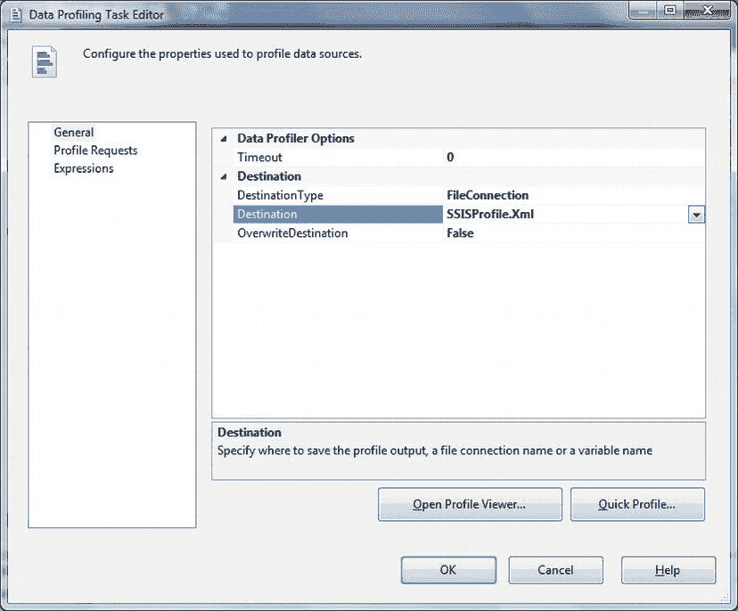
    图 10-1. 在 SSIS 数据剖析任务中配置输出目标
4.  单击“快速剖析”，并从 `ADO.NETConnection` 下拉列表中选择你在步骤 1 中创建的 `CarSales_ADONET` 连接。
5.  选择要分析的表——这里是 `dbo.Client`。
6.  勾选你希望分析的所有剖析类型。在此示例中，我选择了所有可能的剖析类型。此对话框应类似于 图 10-2。
    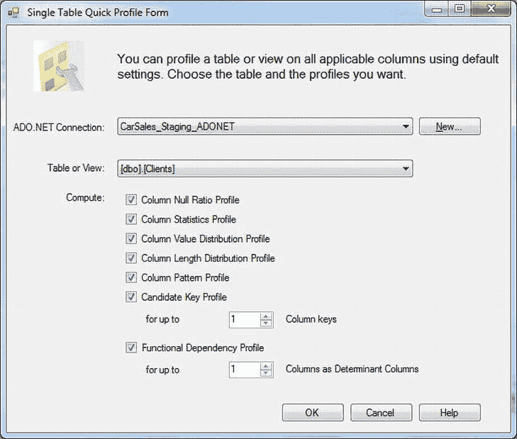
    图 10-2. 在 SSIS 数据剖析任务中选择要运行的剖析类型
7.  单击“确定”确认修改。你将看到所选的剖析请求，如 图 10-3 所示。
    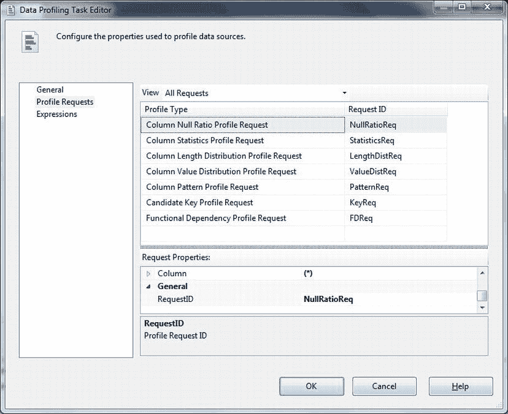
    图 10-3. SSIS 数据剖析任务编辑器中选定的剖析请求
8.  在“数据剖析任务编辑器”中单击“确定”以确认你的剖析选择。

现在，你可以运行包含剖析任务的 SSIS 包，从而对源数据进行剖析。这将生成你在步骤 3 中指定的 XML 输出文件 (`C:\SQL2012DIRecipes\CH10\SSISProfile.xml`)。

虽然可以直接在 Web 浏览器中读取此 XML 文件，但你可能会发现使用“数据剖析查看器”（如配方 10-9 所述）读取更容易。

## 工作原理

自 SQL Server 2008 以来，SSIS 就提供了一个用于剖析源数据的任务。这个任务与其他 SSIS 任务略有不同，因为（至少根据我的经验）它往往是在初步查看数据时“交互式”运行，而不是作为结构化 ETL 过程的一部分。话虽如此，如果需要，你也可以将其用作更全面过程的一部分。一旦任务对数据源运行完毕，你就可以检查输出（最简单的方法是使用配方 10-9 中描述的“数据剖析查看器”），并决定源数据是否符合你的预期。本配方展示了如何使用 SSIS 剖析任务的“快速剖析”选项获取一个剖析。创建快速剖析后，会生成一系列剖析请求。这些可以在“剖析请求”窗格中进行微调或删除。然后就可以运行剖析任务，并在“剖析查看器”中查看输出，如配方 10-9 所述。

在确保对数据源进行良好整体分析的同时，该任务确实存在以下限制：

*   数据源仅限于通过 ADO.NET 连接访问的 SQL Server 2000 及更高版本的表和视图。
*   运行该任务的帐户必须对 `TempDB` 数据库具有读/写权限，包括 `CREATE TABLE` 权限。
*   该任务只能生成 XML 输出文件。此外，此文件必须使用提供的“数据剖析查看器”查看，或者通过加载 XML 数据（使用自定义任务，如配方 10-10 所述）来查看。

此任务提供的分析广度和深度不容小觑，涵盖了 表 10-4 中描述的领域。如你所见，SSIS 数据剖析任务——即使采用“快速剖析”选项——也能为你提供一组非常完整的初始剖析数据。

表 10-4. SSIS 数据剖析任务选项

| 元素 | 描述 | 潜在用途 |
| :--- | :--- | :--- |
| 候选键 | 指示一列或一组列是否是选定源表的键，或者可能是键。 | 确定一列（或一组列）作为唯一键的潜力。 |
| 列长度分布 | 返回选定列中字符串值的所有不同长度以及表中每列长度的行百分比。 | 确定列中数据的长度范围。 |
| 列空值比率 | 返回选定列中的空值百分比。 | 确定列中 `NULL` 的百分比。 |
| 列模式 | 返回一组正则表达式，这些表达式覆盖字符串列中指定百分比的值。 | 确定列中的文本模式。这包括文本的外观和格式。 |
| 列统计信息 | 指示数字列的统计信息，如最小值、最大值、平均值和标准差，以及 `DATETIME` 列的最小值和最大值。 | 确定列中数据和日期的范围。 |
| 列值分布 | 指示选定列中的所有不同值以及表中每个值所代表的行百分比。 | 确定列中存在多少不同值，以定义值的分布。 |
| 函数依赖关系 | 指示一列（依赖列）中的值在多大程度上依赖于另一列或一组列（决定列）中的值。 | 确定值集是否在列之间对应。 |
| 值包含 | 指示两个列或两组列之间的值重叠。 | 确定一列（或一组列）作为外键的潜力。 |

## 提示、技巧和陷阱

*   你可以根据需要创建任意多个快速剖析，每个剖析来自一个单独的表或视图。
*   我假设我们希望分析 SQL Server 源表中的数据，并将结果存储到一个剖析数据表中。我将使用 `CarSales_Staging` 数据库来存储此表。
    > **注意**
    >
    > 在生产环境中，你可能会使用单独的数据库来存储剖析数据。这里我使用与源数据相同的数据库纯粹是为了使示例更简单。
*   此脚本预设你希望收集以下数据：
    *   两列的空值计数和空值比率。
    *   一列的数值最大值和最小值。
    *   一列的字段长度最大值和最小值。
    因此，T-SQL 收集此信息并将其记录到 `dbo.DataProfiling` 表中。一旦信息收集完毕，它就可以用于 ETL 过程中的决策，如配方 10-17 所述。
*   此 T-SQL 显然是硬编码的，用于高度特定的环境和特定的表。我为此代码的刚性辩护的理由是，你可能永远不想对每一列进行剖析，而在大多数情况下，你会希望查看特定的列——因此需要为特定问题编写代码。
*   为了加快过程，你可以尝试最小化存储过程中的单独查询数量。无论如何，计算任何你会重复使用的值（尤其是行数），并将它们保存在变量中，比每次重新计算要快。


## 10-7. 使用 SSIS 创建自定义数据配置文件

### 问题
您希望使用 SSIS 来分析数据，同时调整配置规范以满足您的精确要求。

### 解决方案
与其运行快速配置文件，不如使用**数据配置分析**任务来配置可用选项，以返回适合您需求的信息。我将再次使用 `CarSales.dbo.Stock` 表作为要分析的数据。

1.  创建一个新的 SSIS 包。向 CarSales 源数据库添加一个 ADO.NET 连接管理器。将其命名为 `CarSales_ADONET`。
2.  在“连接管理器”选项卡中右键单击，然后选择“新建文件连接”。选择使用类型 `创建文件` 并浏览到选定的文件夹（本示例中为 `C:\SQL2012DIRecipes\CH10\CustomProfile.Xml`）。单击“打开”以创建文件，然后单击“确定”以关闭“新建文件连接”对话框。
3.  向“控制流”窗格添加一个“数据配置分析”任务。双击进行编辑。在“常规”选项卡中，选择 `文件连接` 作为目标类型。
4.  选择您在第 3 步中创建的 `CustomProfile.xml` 连接。
5.  将 `覆盖目标` 设置为 `True`。
6.  单击左侧的 `配置文件请求` 以激活“请求”窗格。
7.  向下滚动到可用配置文件请求的底部（如果存在），单击空白记录，然后从弹出列表中选择一个配置文件请求。在此示例中，我建议从 `列长度分布配置文件请求` 开始。
8.  按 Tab 或 Enter 键确认请求创建。SSIS 将为此请求命名（可能是 `LengthDistReq`）。
9.  在窗格的下半部分——即“请求属性”部分——您现在将配置请求，从源数据库的连接开始。对于名为 `连接管理器` 的属性，选择您在第 1 步中创建的 `CarSales_ADONET` 连接管理器。
10. 选择 `dbo.Stock` 作为 `表或视图` 属性。
11. 选择 `Make` 作为 `列` 属性。
12. 单击“确定”。

您现在可以运行该包并分析生成的 XML 配置文件数据。

### 工作原理
如果您更喜欢直接创建和微调配置文件，则可以通过手动配置 SSIS 数据配置分析任务来实现，而不是使用“快速配置文件”方法。配置选项相当广泛——如表 10-6 所示。然而，通过一点练习，它们会变得相当容易使用。

定义一个配置文件将始终包含表 10-5 中的一个元素。这本质上是您要分析的数据库、表和列的核心定义。

**表 10-5. SSIS 数据配置分析任务中的必需元素**
| 元素 | 说明 |
| --- | --- |
| `连接管理器` | 一个现有或新创建的 ADO.NET 连接管理器。 |
| `表或视图` | 通过选定连接管理器可用的表或视图。 |
| `列` | 您希望分析的表中的单个列（或使用星号“*”选择的所有列）。 |
| `请求 ID` | 此配置文件元素的用户定义名称。尽管 SSIS 会为每个配置文件请求命名，但您可以使用自己的名称覆盖这些名称。 |

一旦指定了数据库、表和列，您必须指明希望运行哪种类型的配置文件。您还可以指定特定于配置文件类型的某些参数。这些配置中的每一个都构成一个单独的配置文件请求。特定于每种配置文件请求类型的各个选项在表 10-6 中进行了解释。

**表 10-6. SSIS 配置分析任务选项**
| 元素 | 描述 | 潜在用途 |
| --- | --- | --- |
| `候选键` | 指示列或列集是否为选定表的键或近似键。 | 确定列（或列集）作为唯一键的潜力。 |
| `列长度分布` | 指示选定列中字符串值的所有不同长度，以及表中每个长度所代表的行的百分比。 | 确定列长度的范围。 |
| `列空值比率` | 指示选定列中空值的百分比。 | 确定 `NULL` 的百分比。 |
| `列模式` | 返回一组正则表达式，这些表达式覆盖字符串列中指定百分比的值。 | 确定列中的文本模式。 |
| `列统计信息` | 指示数值列的统计信息，如最小值、最大值、平均值和标准差，以及 `DATETIME` 列的最小值和最大值。 | 确定值和日期的范围。 |
| `列值分布` | 指示选定列中的所有不同值，以及表中每个值所代表的行的百分比。 | 确定列中存在多少个不同的值。 |
| `函数依赖关系` | 指示一列（依赖列）中的值对另一列或列集（决定列）中的值的依赖程度。 | 确定列之间的值集是否准确。 |
| `值包含` | 指示两列或列集之间值的重叠情况。 | 确定列（或列集）作为外键的潜力。 |

每个配置文件请求一次只能分析一列。但是，您可以为同一配置文件类型创建多个配置文件请求，从而覆盖多个列。

### 提示、技巧和陷阱
*   要删除配置文件，请在“配置文件请求”窗格中单击它，然后按 Delete 键。您可以使用 Ctrl 和 Shift 键选择多个配置文件请求。
*   SSIS 将为每种配置文件类型自动生成一个 `请求 ID`。您可以使用 `请求 ID` 属性对其进行重命名。
*   各种 `强度阈值`（`候选键` 的 `键强度`，`值包含` 的 `包含强度阈值` 和 `超集列键阈值`，以及 `函数依赖关系` 的 `函数依赖关系强度阈值`）是数据集中唯一元素的百分比。如果相应的 `阈值设置` 设置为 `指定`，则仅当配置文件分析返回此百分比或更大的唯一记录时，您才会得到结果。否则，您将得到一个空的数据集。要返回无论唯一记录百分比如何的结果，请将 `阈值设置` 设置为 `无`。或者，您可以为唯一记录设置更低的阈值百分比。
*   `最大违规次数` 是列中重复元素的计数——这可能是问题的潜在根源。您可以根据需要调整此数字。
*   通过在分析潜在外键时将 `超集列键阈值` 设置为 `精确`，您可以过滤掉那些超集列由于非唯一值而不适合作为超集表键的组合。
*   您可以在 .NET 数据源中使用 `OPENDATASOURCE` 来绕过 SSIS 对可用数据源的限制。请注意，这将非常慢。

## 10-8. 在非 SQL Server 数据源上使用 SSIS 数据配置分析任务

### 问题
您希望使用 SSIS 数据配置分析任务来分析来自非 SQL Server 数据源的数据。

### 解决方案
使用链接服务器作为数据源，以克服 SSIS 仅限使用 ADO.NET 连接管理器的限制。以下步骤说明了如何操作。

1.  使用链接服务器连接到另一个数据源（例如，CSV 文件或 Oracle 数据库）。
2.  在 SSMS 中，创建一个使用链接服务器作为数据源的视图。
3.  将 SSIS 数据配置分析任务连接到该视图，该视图成为数据源（如配方 10-6 步骤 4 所述）。
4.  继续配方 10-6（用于快速配置文件）或 10-7（用于自定义配置文件）以创建 XML 配置文件输出。

### 工作原理
我意识到所有文档都指出，SSIS 数据配置分析任务仅与 ADO.
```


# 10-9. 读取配置文件数据

## 问题
您想要读取使用 SSIS 数据配置文件任务创建的 XML 配置文件数据。

## 解决方案
使用随 SSIS 一起安装的**数据配置文件查看器**，步骤如下。

1.  运行以下程序：`"C:\Program Files (x86)\Microsoft SQL Server\110\DTS\Binn\DataProfileViewer.exe"`
2.  在工具栏中点击**打开**。导航到并加载您在配置配置文件任务时设置为输出目标的配置文件 XML 文件。
3.  选择与您要分析的配置文件相对应的配置文件元素（参见 图 10-4）。数据配置文件查看器将在左侧的树形视图中显示所有配置文件请求。

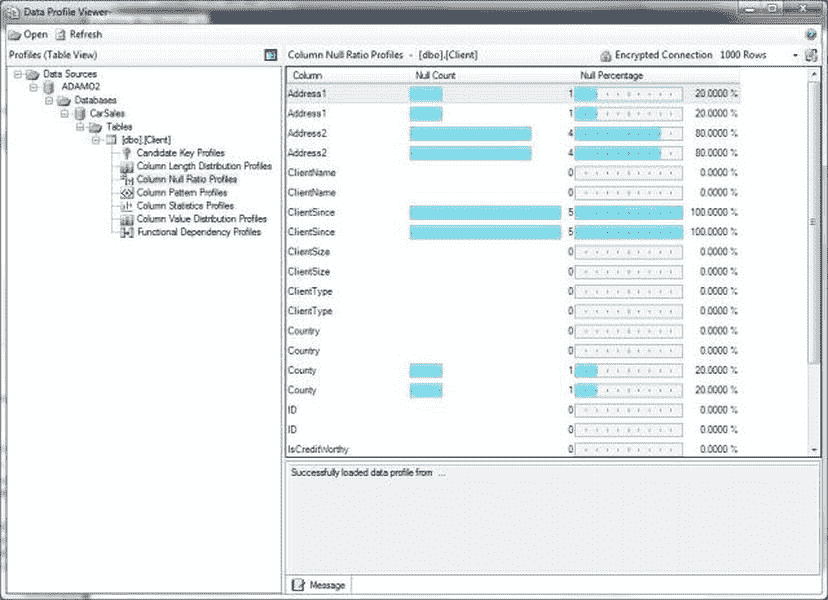

图 10-4. 配置文件查看器

## 工作原理
与其费力地浏览大量晦涩的 XML，您可能更愿意运行数据配置文件查看器来查看数据配置分析的结果。您需要展开树形结构，从**服务器**开始，通过**数据库**，导航到您希望分析其元素的表（或视图）。

## 提示、技巧和注意事项

*   您也可以通过编辑数据配置文件任务并点击**打开配置文件查看器**按钮，直接从 SSIS 包内部运行数据配置文件查看器。这将自动打开正确的 XML 文件——前提是您已经运行了数据配置文件任务。
*   另一种运行数据配置文件查看器的方法是点击**开始**  **所有程序**  **Microsoft SQL Server 2012**  **Integration Services**  **数据配置文件查看器**。

 **注意** 输出文件可能包含有关您的数据库及其所含数据的敏感信息。如果是这种情况，您应考虑将其存储在适当受保护的文件夹中。

# 10-10. 将 SSIS 配置文件数据存储在数据库中

## 问题
您希望将使用 SSIS 配置文件任务创建的配置文件数据存储在 SQL Server 数据库中。

## 解决方案
使用自定义 XML 任务读取 SSIS 配置文件任务生成的 XML 文件，并将配置文件数据分解（shred）到 SQL Server 表中。以下说明了一种对 CarSales 示例数据库进行数据分析并将结果存储在 CarSales_Staging 数据库中的方法。

1.  在 `CarSales_Staging` 数据库中创建以下表 (`C:\SQL2012DIRecipes\CH10\SSISProfileTables.Sql`)：

    ```sql
    USE CarSales_Staging;
    GO

    CREATE TABLE dbo.DataProfiling_ColumnValueDistribution
    (
     ProfileRequestID NVARCHAR(255) NULL,
     NumberOfDistinctValues INT NULL,
     ColumnValueDistributionProfile_Id BIGINT NOT NULL,
     DateAdded DATETIME NOT NULL DEFAULT GETDATE(),
     ID int IDENTITY(1,1) NOT NULL
    ) ;
    GO

    CREATE TABLE dbo.DataProfiling_ColumnStatistics
    (
     ProfileRequestID NVARCHAR(255) NULL,
     MinValue DECIMAL(28, 10) NULL,
     MaxValue DECIMAL(28, 10) NULL,
     Mean DECIMAL(28, 10) NULL,
     StdDev DECIMAL(28, 10) NULL,
     ID int IDENTITY(1,1) NOT NULL,
     DateAdded DATETIME NOT NULL DEFAULT GETDATE()
    ) ;
    GO

    CREATE TABLE dbo.DataProfiling_ColumnNulls
    (
     ProfileRequestID NVARCHAR(255) NULL,
     NullCount TINYINT NULL,
     ID int IDENTITY(1,1) NOT NULL,
     DateAdded DATETIME NOT NULL DEFAULT GETDATE()
    ) ;
    GO

    CREATE TABLE dbo.DataProfiling_ColumnLength
    (
     ProfileRequestID NVARCHAR(255) NULL,
     ColumnLengthDistributionProfile_ID BIGINT NULL,
     MinLength TINYINT NULL,
     MaxLength TINYINT NULL,
     ID int IDENTITY(1,1) NOT NULL,
     DateAdded DATETIME NOT NULL DEFAULT GETDATE()
    ) ;
    GO

    CREATE TABLE dbo.DataProfiling_ValueDistributionItem
    (
     Value NVARCHAR(255) NULL,
     Count INT NULL,
     ValueDistribution_Id BIGINT NOT NULL
    ) ;
    GO

    CREATE TABLE dbo.DataProfiling_LengthDistributionItem
    (
     Length tinyint NOT NULL,
     Count bigINT NULL,
     LengthDistribution_Id BIGINT NOT NULL
    ) ;
    GO

    CREATE TABLE dbo.DataProfiling_Join_ValueDistribution
    (
     ValueDistribution_Id BIGINT NOT NULL,
     ColumnValueDistributionProfile_Id BIGINT NOT NULL
    ) ;
    GO

    CREATE TABLE dbo.DataProfiling_Join_LengthDistribution
    (
     LengthDistribution_Id BIGINT NOT NULL,
     ColumnLengthDistributionProfile_Id BIGINT NOT NULL
    ) ;
    GO
    ```

2.  创建一个新的 SSIS 包。添加两个 ADO.NET 连接管理器，名为 `CarSales_ADONET` 的应指向 CarSales 数据库；名为 `CarSales_Staging_ADONET` 的应指向 CarSales_Staging 数据库。
3.  添加一个执行 SQL 任务。将其配置为使用用于配置文件数据的连接管理器。将其命名为 `Prepare Tables`，并将 SQL 语句设置为 (`C:\SQL2012DIRecipes\CH10\TruncateSSISProfileTables.Sql`)：

    ```sql
    TRUNCATE TABLE dbo.DataProfiling_ColumnLength;
    TRUNCATE TABLE dbo.DataProfiling_ColumnNulls;
    TRUNCATE TABLE dbo.DataProfiling_ColumnStatistics;
    TRUNCATE TABLE dbo.DataProfiling_ColumnValueDistribution;
    TRUNCATE TABLE dbo.DataProfiling_Join_LengthDistribution;
    TRUNCATE TABLE dbo.DataProfiling_Join_ValueDistribution;
    TRUNCATE TABLE dbo.DataProfiling_LengthDistributionItem;
    TRUNCATE TABLE dbo.DataProfiling_ValueDistributionItem;
    ```

4.  添加一个数据配置文件任务并双击进行编辑。定义一个名为 `C:\SQL2012DIRecipes\CH10\MyProfile.Xml` 的新文件目标——如配方 10-6，步骤 3 所述。
5.  创建四个配置文件请求，如下所示，全部使用 `CarSales_ADONET` 连接管理器：

    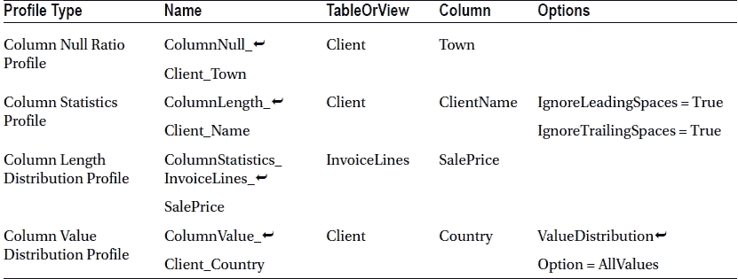

6.  运行该包以创建初始输出 XML 文件（例如，通过点击**调试**  **开始调试**）。
7.  添加一个数据流任务，将配置文件任务连接到它，然后双击以打开数据流窗格。
8.  添加一个 XML 源并按如下方式配置：

    | 数据访问模式： | XML 文件位置 |
    | --- | --- |
    | XML 位置： | 步骤 3 中创建的 `C:\SQL2012DIRecipes\CH10\MyProfile.Xml` 文件 |
    | XSD 位置： | 从 `MyProfile.Xml` 生成 XSD，命名为 `C:\SQL2012DIRecipes\CH10\MyProfile.Xsd`。 |

9.  点击**确定**确认您的修改。
10. 创建八个 OLEDB 目标任务，全部使用该连接管理器，并将它们配置为使用 XML 源到目标表的以下输出。（您应将目标表中与源列对应的所有可用列进行映射，如图所示。）

    | XML 数据源输出 | 目标表 |
    | --- | --- |
    | ColumnStatisticsProfile | dbo.DataProfiling_ColumnStatistics |
    | ColumnNullRatioProfile | dbo.


# 数据剖析与自定义包

`DataProfiling_ColumnNulls` | | `ColumnLengthDistributionProfile` | `dbo.DataProfiling_ColumnLength` | | `LengthDistribution` | `dbo.DataProfiling_Join_LengthDistribution` | | `LengthDistributionItem` | `dbo.DataProfiling_LengthDistributionItem` | | `ColumnValueDistributionProfile` | `dbo.DataProfiling_ColumnValueDistribution` | | `ValueDistribution` | `dbo.DataProfiling_Join_ValueDistribution` | | `ValueDistributionItem` | `dbo.DataProfiling_ValueDistributionItem`

11. 数据流窗格应类似于图 10-5。
    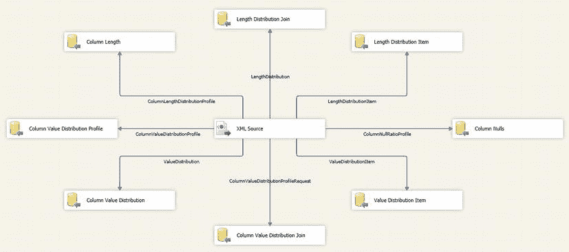
    图 10-5. 自定义配置文件输出的数据流

    现在您可以运行该包。一旦它运行了配置文件数据，这些数据将在目标表中可用于分析。

## 工作原理

剖析数据然后使用数据配置文件查看器进行分析，在您刚开始了解数据时非常有用，但当您希望将此信息存储以备将来使用时——无论是在数据加载过程完成后，还是作为业务流程的一部分，在允许加载继续之前测试配置文件结果——这种方法就可能显得有局限性。因此，您很可能希望存储配置文件数据，以便将其与可接受的阈值进行比较，并使用一些逻辑来控制数据流。这需要一种两步走的方法：

*   首先，定义剖析任务，并将结果输出到变量。
*   其次，将变量中的少量 XML 子集加载到 SQL Server 表中，以捕获关键数据。

此技术隐含以下先决条件：

*   一个数据源，您必须将其配置为连接到合适的数据源。
*   一个数据流任务，配置为使用您已定义的数据源。

如您所见，某些配置文件类型，如列空值比率配置文件和列统计信息配置文件，可以直接分解为单个输出表。其他配置文件类型，如列长度分布配置文件和列值分布配置文件，如果您只需要不同元素的计数，则只需要单个表；但如果您需要每个值的详细信息及其出现次数，则需要另外两个表（一个用于所有单项的表，以及一个用于将单项连接到聚合表的多对多表）。

由于详细展示如何获取每一条可能的配置文件信息过于繁琐，本方案概述了我在将业务规则分析应用于 SSIS 数据加载时发现有用的四种主要配置文件类型。我不会解释使用 XML 数据源的每一个细节，因为第 3 章中已介绍了许多方法。但是，您应该能够将本方案作为一个示例，在此基础上构建您自己的配置文件输出表。您正在分析的配置文件类型与输出表之间的关系在表 10-7 中给出。

表 10-7. 用于配置文件类型的表

| 配置文件类型 | 使用的表 |
| --- | --- |
| 列空值比率配置文件 | `Dbo.DataProfiling_ColumnNulls` |
| 列统计信息配置文件 | `Dbo.DataProfiling_ColumnStatistics` |
| 列长度分布配置文件 | `Dbo.DataProfiling_ColumnLengthDistribution` <= `Dbo.DataProfiling_Join_LengthDistribution` => `Dbo.DataProfiling_LengthDistributionItem` |
| 列值分布配置文件 | `Dbo.DataProfiling_ColumnValueDistribution` <= `Dbo.DataProfiling_Join_ValueDistribution` => `Dbo.DataProfiling_ValueDistributionItem` |

#### 提示、技巧与陷阱

*   数据剖析任务生成的 XML 文件有许多许多输出。如果您需要更好地理解该文件，我建议您在 Visual Studio 中打开 `MyProfile.Xsd` 文件（在步骤 8 中创建），甚至直接读取 XML 以查看数据的结构。
*   如果您不希望使用文件来存储 XML 数据，那么在包经过测试和调试后，您可以定义一个字符串变量（在包级别），并将其同时用作剖析任务的目标和 XML 数据源的源数据。但是，任何对包的进一步修改都需要在修改和调试期间将这些设置重置为基于文件的数据，然后可以重新应用该字符串变量。
*   当然，您可以扩展此包以处理其他配置文件类型，例如函数依赖关系或值包含。

# 10-11. 在 SSIS 中定制特定源数据配置文件

## 问题
您希望以一种针对您的源数据和剖析需求进行定制的方式来剖析您的数据。

## 解决方案
使用 SSIS 创建一个使用标准 SSIS 任务的自定义剖析包，超越 SSIS 数据剖析任务中提供的标准选项。

1.  创建一个 SSIS 包。将其命名为 `Profiling.Dtsx`。
2.  创建 `CarSales_Staging.dbo.DataProfiling` 表（其 DDL 在方案 10-5 中给出）以存储配置文件数据（当然，除非您已经创建了它）。
3.  为此任务创建一个 ADO.NET 连接，连接到目标 (`CarSales_Staging`) 数据库。我将其命名为 `CarSales_Staging_ADONET`。
4.  添加一个平面文件连接管理器并连接到数据源文件，本例中为 `C:\SQL2012DIRecipes\CH10\Stock.Txt`。将其命名为 `StockFile`。确保在“高级”窗格中将 Mileage 列的数据类型设置为四字节有符号整数 `[DT_I4]`。
5.  在您的包中添加以下变量：
    | 变量名 | 类型 | 值 |
    | --- | --- | --- |
    | `Mileage_MAX` | `Int32` | 0 |
    | `Mileage_MIN` | `Int32` | 0 |
    | `RowCount` | `Int32` | 0 |

6.  点击“数据流”选项卡后，单击“单击此处...”提示以添加数据流任务。
7.  添加一个平面文件源，并将其配置为使用 `StockFile` 连接管理器。
8.  从工具箱中将一个行计数任务添加到数据流窗格，并将平面文件源连接到它。
9.  双击，从可用变量的弹出列表中添加 `RowCount` 变量（图 10-6）。单击“确定”确认。
    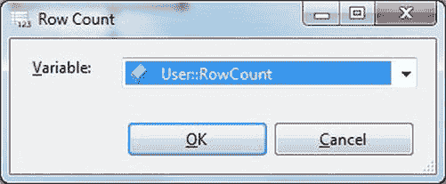
    图 10-6. 向 SSIS 数据流中添加变量

10. 在数据流窗格上添加一个聚合任务。将其命名为 `Attribute Analysis`，并将行计数任务连接到它。
11. 双击聚合任务进行编辑。
12. 在“聚合”选项卡的上部选择您希望分析的列——或者将列拖到窗格的下部。在本例中，我将使用 Mileage 列，一次用于最大值，一次用于最小值。
13. 从“操作”列的弹出菜单中选择您希望应用的分析类型。在本例中，我先使用“最大值”，然后使用“最小值”。
14. 相应地重命名输出别名。我分别建议使用 `Mileage_MAX` 和 `Mileage_MIN`。聚合转换对话框应类似于图 10-7。
    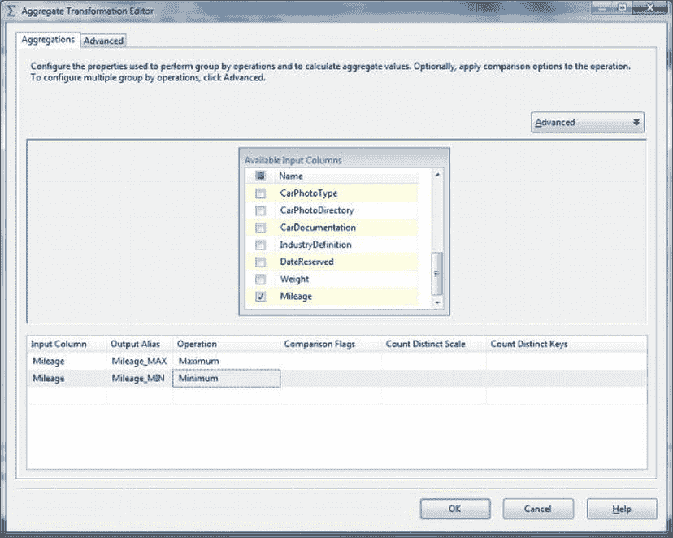
    图 10-7. SSIS 中的聚合转换对话框

15. 单击“确定”确认您的修改。返回到“数据流”选项卡。
16. 在数据流窗格上添加一个逆透视转换任务。将聚合任务连接到它。双击以编辑逆透视任务。
17. 在“逆透视转换编辑器”对话框中，选择包含您希望逆透视的配置文件信息的列。将两个目标列都设置为 `ProfileResult`。将透视键列名设置为 `ProfileName`。


您应该会看到如图 10-8 所示的对话框，或类似的对话框。
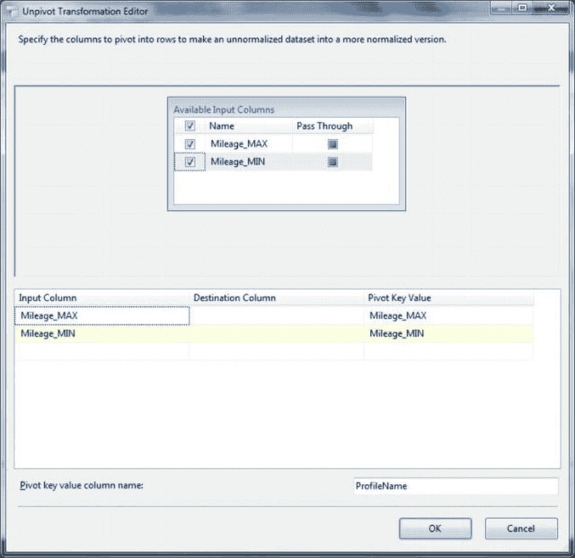
图 10-8. 在 SSIS 中逆透视自定义配置数据

18. 单击“确定”以确认您的更改。
19. 将一个 `派生列` 转换任务添加到 `数据流` 窗格中。将 `逆透视` 任务连接到它，并添加以下派生列：
    * `数据源列`：将表达式设置为 "Mileage"
    * `数据源对象`：将表达式设置为 "Invoice.Txt"

对话框应类似于图 10-9。
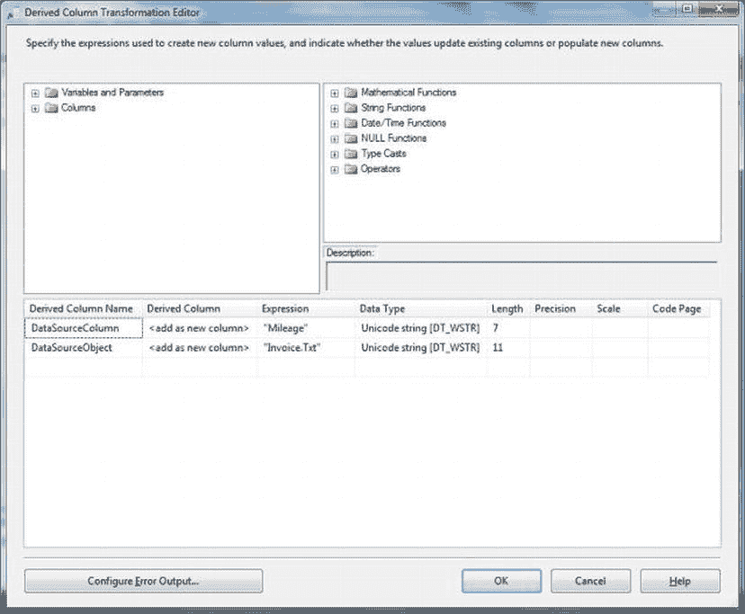
图 10-9. 添加派生列

20. 将一个 `OLEDB 目标` 任务添加到 `数据流` 窗格中。将 `派生列` 任务连接到它。
21. 双击 `OLEDB 目标` 任务并配置其连接到 SQL Server 数据库。连接到 `DataProfiling` 表。在 `映射` 窗格中，将可用的输入列映射到可用的输出列。映射应如图 10-10 所示。
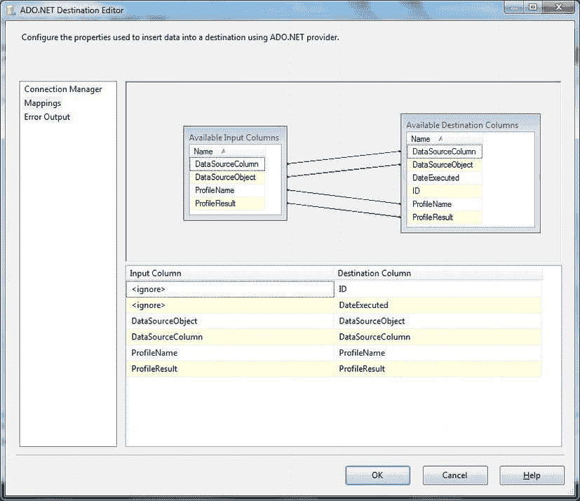
图 10-10. SSIS 自定义数据配置的列映射

22. 单击“确定”。您的 `数据流` 窗格应如图 10-11 所示。
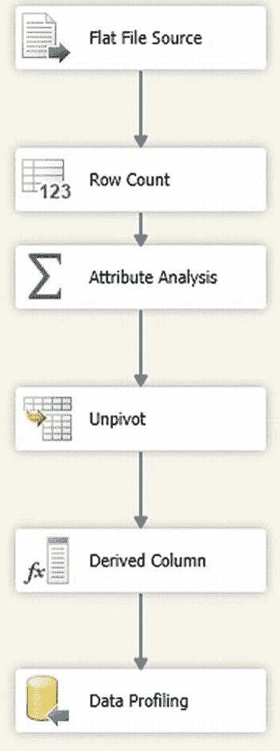
图 10-11. 自定义配置任务的数据流

23. 返回到 `控制流` 窗格并添加一个 `执行 SQL` 任务。将其命名为 `Add Rowcount`。将 `数据流` 任务连接到这个新任务。双击进行编辑。
24. 配置它使用您在第 3 步中创建的 `CarSales_Staging_ADONET` 连接管理器。
25. 单击左侧的 `参数`。映射以下参数：
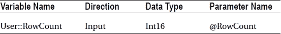
26. 输入以下 SQL 语句：
```sql
INSERT INTO dbo.DataProfiling (DataSourceObject, ProfileName, ProfileResult)
VALUES ('Invoice.Txt', 'RowCount', @Rowcount)
```
对话框应如图 10-12 所示。
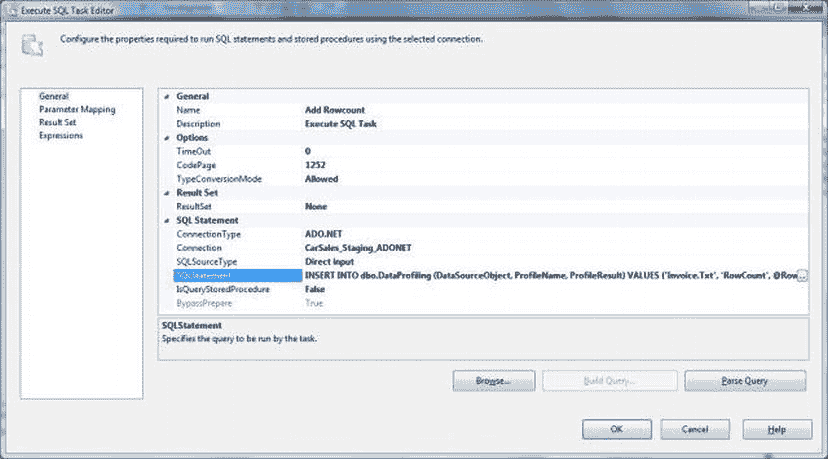
图 10-12. 运行 T-SQL INSERT 语句的执行 SQL 任务

27. 单击“确定”。最终的 `包` 应如图 10-13 所示。
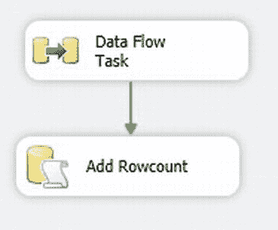
图 10-13. 从 SSIS 返回特定配置数据的最终数据流

现在当您运行该包时，源数据将被读取，聚合结果将被写入目标表。数据本身不会被导入。

## 工作原理

尽管 SSIS `配置` 任务很好，但很可能在很多情况下，您宁愿不嫌麻烦地用其他方式配置数据——这可能意味着使用一些标准的 `数据流` 组件。这种“自己动手”的 SSIS 配置方法有一些优点：

*   您可以 `在导入数据的同时` 运行它——因此一旦数据导入过程完成，您就不需要再花时间对导入的数据执行配置分析，无论是使用 T-SQL 还是 SSIS `数据配置` 任务。
*   您可以配置 `SSIS 能够连接的任何数据源`——而不仅仅是 ADO.NET SQL Server（2000 及以上版本）源。至少您可以不“作弊”地做到（如配方 10-8 所述）——以及随之而来的速度影响。

这个包的作用是收集一小部分配置计数器。有些——比如 `Mileage_MAX` 和 `Mileage_MIN`——像前面的配方一样作为列添加。其他的（这里是 `RowCount`）则传递给包变量，并在初始配置运行后添加一次。后一种技术是必要的，因为 `行数` 任务只允许在其数据流完成后使用其变量。

无论如何，您使用 T-SQL 可以执行的大多数基本数值配置也可以使用 SSIS 完成。正如我之前所说（但这一点很重要，所以值得重复），使用 SSIS 的优势在于，数据配置可以成为现有数据流的一部分，这通常比在初始数据加载后在暂存表上运行 T-SQL 查询更快。

然而，每个优点都有其缺点，对于 SSIS 和自定义数据配置，有几组问题。首先，SSIS 仅包含 T-SQL 中开箱即用的统计函数的一个子集：最大值、最小值、计数、不同计数和域分析。SSIS 不包含计算字段长度和域百分比的函数。

克服这些限制需要在初始处理后运行一些代码。这在配方 10-16 中有描述。此外，组合您可能需要的所有配置（属性配置和域分析）可能需要相对复杂的 SSIS 操作，并且输出结果有些繁琐，因为这涉及捕获处理的总行数以及捕获列的最大值和最小值。

## 提示、技巧和陷阱

*   确保所有变量都在包级别设定作用域。
*   如果您使用的是 SQL Server 2005 或 2008，您将不得不使用 `自定义属性` 对话框添加变量名，如图 10-14 所示。
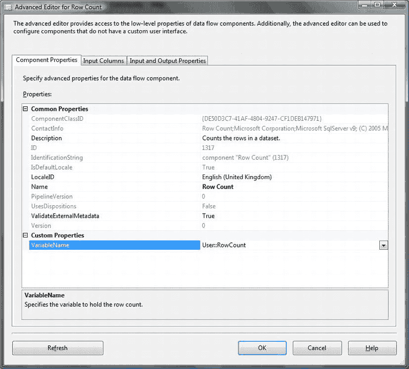
图 10-14. 在 SSIS 2005/2008 中添加计数器变量
*   当将变量设置为派生列的源表达式时，请记住，您可以在 `派生列转换编辑器` 对话框的左上窗格中展开 `变量` 树，并将变量拖动到 `表达式` 列。
*   SSIS 将只允许应用适当的分析——您不能为非数值数据选择平均值、最大值或最小值。因此，如果您使用的是 `平面文件` 源，请确保您已将数值数据类型指定为 `高级` 列属性的一部分，或使用 `数据转换` 任务来确保数值数据类型。
*   要对同一列应用多项分析，请将该列从选项卡的上部拖动到对话框的下部。
*   要从聚合分析中删除列，请在 `聚合转换编辑器` 的下部右键单击它并选择 `删除`。
*   如果源数据是平面文件，并且不包含列名，请务必在 `数据源编辑器` 的 `高级` 窗格中添加它们。
*   您可以根据需要向 SSIS 任务添加任意多个 `行计数` 任务。但是，每个任务都需要声明并分配一个单独的变量。

#### 10-12. SSIS 中的域分析

### 问题

您希望在对数据源进行属性分析的同时，为其提供自定义域分析。

### 解决方案

使用 SSIS 创建自定义配置包。

我假设您希望在进行属性分析（如配方 10-11 所示）的同时，进行域分析（即，查看列中包含的不同数据元素，并返回计数和占总数的百分比）。为了避免重复创建大量相同的包，我将使用在配方 10-11 中创建的包作为扩展开发的基础，以包含域分析。如果您尚未创建该包，可以从本书网站下载。


# 创建表

创建以下表 (`C:\SQL2012DIRecipes\CH10\tblDataProfilingDomainAnalysis.Sql`):

```sql
CREATE TABLE CarSales_Staging.dbo.DataProfilingDomainAnalysis
(
 ID INT IDENTITY(1,1) NOT NULL,
 DataSourceObject NVARCHAR(150) NULL,
 DataSourceColumn NVARCHAR(150) NULL,
 DataSourceColumnData NVARCHAR(150) NULL,
 DataSourceColumnResult NVARCHAR(150) NULL,
 DateExecuted DATETIME NOT NULL DEFAULT (getdate())
) ;
GO
```

2. 打开在配方 10-11 (`Profiling.Dtsx`) 中创建的 SSIS 包。转到数据流窗格。
3. 删除行计数任务和属性分析聚合任务之间的连接器。添加一个多播任务，并将行计数任务连接到它。然后将多播任务连接到属性分析聚合任务。
4. 在数据流窗格上添加一个聚合任务。将多播源连接到它。数据流窗格的第一部分应如 图 10-15 所示。

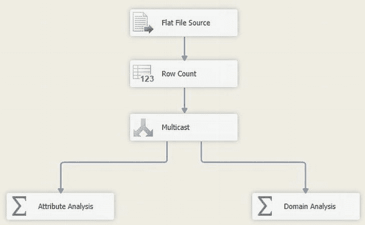

图 10-15. SSIS 中的自定义域分析

5. 双击你刚刚创建的聚合任务。将其命名为 `Domain Analysis`。将你希望用于域分析的列名向下拖动两次到对话框的下半部分。在此示例中，我使用 `Product_Type`。
6. 为一项操作选择 `Group By`，为另一项选择 `Count`。将 `Group By` 聚合的输出别名设置为 `Product_Types`，将 `Count` 聚合的输出别名设置为 `Product_Types_COUNT`。聚合转换对话框应如 图 10-16 所示。

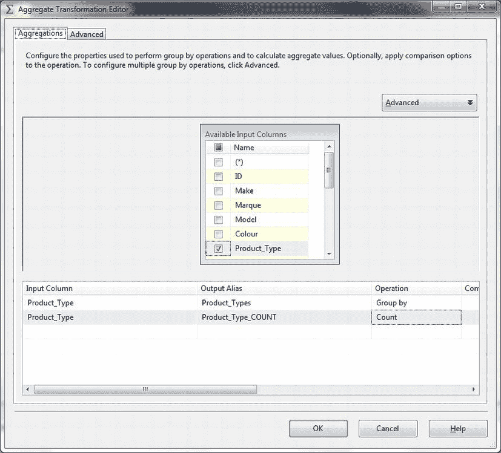

图 10-16. 使用聚合转换进行自定义域分析

7. 点击“确定”确认你的修改。
8. 在数据流窗格中添加一个新的派生列任务。添加以下列：
    * `DataSourceColumn`：将表达式设置为 `(DT_WSTR,260)"PRODUCT_TYPE"`。
    * `DataSourceObject`：将表达式设置为 `Stock.Txt`
    * `Product_Types`：将表达式设置为 `(DT_WSTR,260)Product_Types`
9. 在数据流窗格中添加一个 OLEDB 目标任务。将你刚刚创建的派生列任务连接到它。
10. 双击 OLEDB 目标任务，并将其配置为使用 `CarSales_Staging_ADONET` 连接管理器。映射到 `DataProfilingDomainAnalysis` 表。在“映射”窗格中，将可用的输入列映射到可用的输出列，如 图 10-17 所示。点击“确定”。

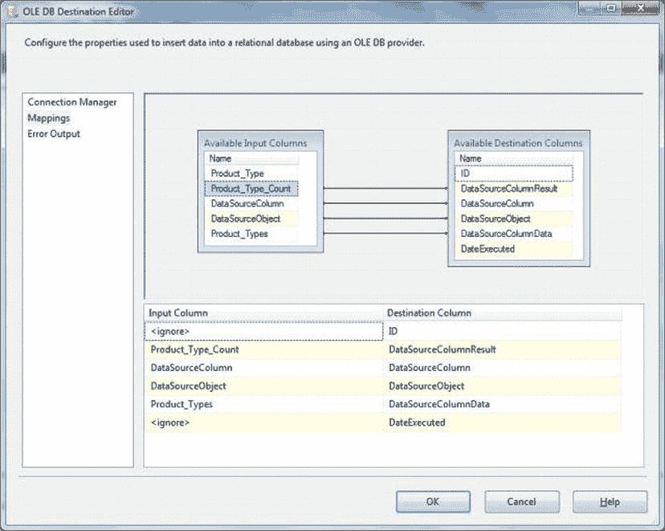

图 10-17. 为自定义分析在 OLEDB 数据目标中映射输出列

运行 SSIS 包时，你的目标表将包含所选列中每个不同元素的计数。

#### 提示、技巧与陷阱

* 在“真实世界”的数据分析场景中，你可能会发现有必要执行数据类型转换。为此，只需使用数据转换任务，该任务在配方 9-1 中有描述。

#### 10-13. 执行多重域分析

## 问题
你希望在同一个 SSIS 包中为数据源返回多重域分析。

## 解决方案
使用 SSIS 创建一个自定义分析包，并使用多播转换创建多个数据流路径，然后独立地分析这些路径。为避免重复，我将扩展在配方 10-11 中创建并在配方 10-12 中扩展的包。如果需要，你可以从本书网站下载此包。

1. 在 `Profiling.Dtsx` 包中，双击聚合任务 `Domain Analysis` 进行编辑。点击“高级”按钮。
2. 将聚合名称（当前为 `Aggregate Output 1`）重命名为 `ProductTypes`。
3. 添加一个新的聚合名称（在刚刚重命名的 `ProductTypes` 下方的空白单元格中）。将其命名为 `Marques`。
4. 将你希望用于域分析的列名（在此示例中为 `Marques`）向下拖动两次到对话框的下半部分。
5. 为一项操作选择 `Group By`，为另一项选择 `Count`。将 `Group By` 聚合的输出别名设置为 `Marques`，将 `Count` 聚合的输出别名设置为 `Marques_COUNT`。聚合转换对话框应如 图 10-18 所示。

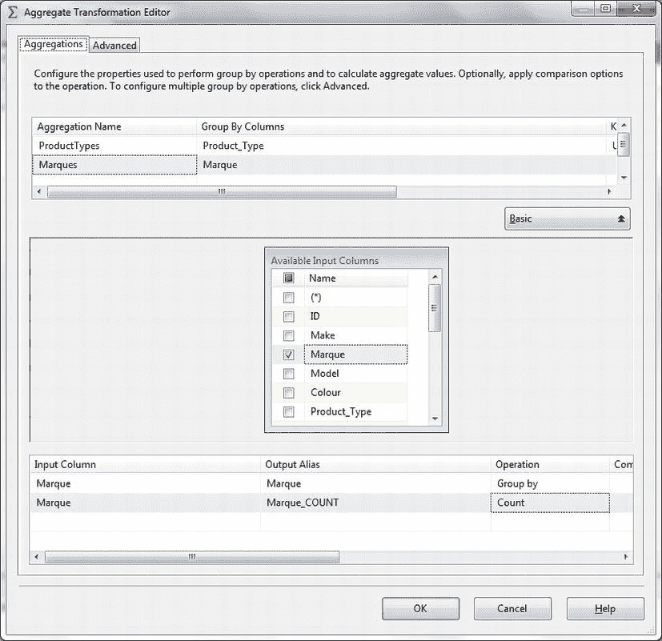

图 10-18. 使用聚合转换进行多重域分析

6. 点击“确定”确认。
7. 在数据流窗格中添加一个新的派生列任务。将其连接到聚合任务。添加以下列：
    * `DataSourceColumn`：将表达式设置为 `Marques`
    * `DataSourceObject`：将表达式设置为 `Stock.Txt`
    * `Product_Types`：将表达式设置为 `(DT_WSTR,260)Marques`
8. 在数据流窗格中添加一个 OLEDB 目标任务。将你刚刚创建的派生列任务连接到它。如果有多个建议的输出，请确保选择 `Marques` 输出。
9. 双击 OLEDB 目标任务，并将其配置为连接到 SQL Server 数据库。映射到 `DataProfilingDomainAnalysis` 表。在“映射”窗格中，将可用的输入列映射到可用的输出列，如之前所做（但使用 `Marques` 派生列而不是 `Product_Type`）。点击“确定”。

你的数据流应如 图 10-19 所示。

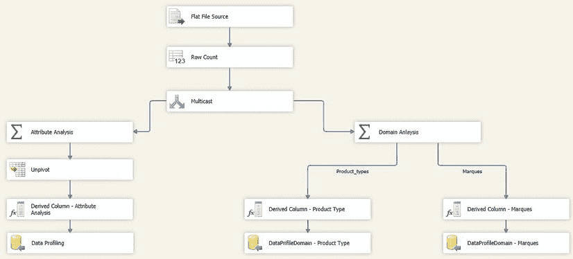

图 10-19. 多重域分析的数据流

## 工作原理
当你希望在同一个数据流中执行多重域分析时，会带来一层轻微的复杂性。本质上你需要做的是扩展聚合任务 `Domain Analysis`，使其提供多个输出——每个你希望返回分析数据的域对应一个输出。

#### 提示、技巧与陷阱
* 通过这种方式，你可以在数据流中添加任意多个域分析。所有分析都将与属性分析并行执行。
* 现在，在加载数据（或暂存数据）的同时分析数据变得极其简单。由于数据流中已经有一个多播任务，你只需使用它的另一个输出来加载和转换你的数据。
* 在本配方——以及配方 10-11 和 10-12 中——你可以在分析数据的同时加载数据。你需要做的只是添加一个 OLEDB 目标任务，将其配置为使用映射到输入数据列的目标表，并将多播转换连接到它。

#### 10-14. 数据流中的模式分析

## 问题
你希望作为数据流的一部分生成模式分析。

## 解决方案
使用 SSIS 脚本任务来分析数据流中的模式，以查看字段中的字母和数字是如何表示和格式化的，而不查看使用的确切文本或数字。以下步骤说明了如何操作。

1. 创建一个新的 SSIS 包。向控制流窗格添加一个数据流任务。
2. 添加一个名为 `CarSales_OLEDB` 的 OLEDB 连接管理器，将其配置为连接到 CarSales 源数据库。
3. 添加一个名为 `CarSales_Staging_OLEDB` 的 OLEDB 连接管理器，将其配置为连接到 CarSales_Staging 目标数据库。
4. 双击进行编辑（或点击“数据流”选项卡）。
5. 添加一个数据源任务。配置为连接到 `CarSales_OLEDB` 连接管理器。连接到 `Stock` 表。
6. 向 SSIS 任务的数据流窗格添加一个 SSIS 脚本转换任务。将其连接到数据源。
7. 双击脚本转换任务。选择你将要分析的列。


本例中我将使用 **Make** 工具。

8.  点击左侧列中的 `Inputs` 和 `Outputs`。展开 `Output 0` 并点击 `Add Column`。
9.  将该列重命名为合适的名称（此处我称之为 `Car`）。在 `Data Type Properties` 中，将其数据类型设置为 `String`。
10. 在左侧列中选择 `Script`。点击 `Design Script` 按钮进入脚本编辑器。
11. 在 `Imports` 区域添加以下一行：

```vbnet
Imports System.Text.RegularExpressions
```

12. 用以下代码替换 `Input0_ProcessInputRow` 方法：

```vbnet
Public Overrides Sub Input0_ProcessInputRow(ByVal Row As Input0Buffer)
    Dim CarRow As String
    Dim regexTxt As System.Text.RegularExpressions.Regex = ←
            New System.Text.RegularExpressions.Regex("[A-Z]", ←
                           RegexOptions.IgnoreCase)
    Dim regexNum As System.Text.RegularExpressions.Regex = ←
            New System.Text.RegularExpressions.Regex("[0-9]")
    CarRow = CStr(Row.Car)
    CarRow = regexTxt.Replace(CarRow, "X")
    CarRow = regexNum.Replace(CarRow, "N")
    Row.CarPattern = CarRow
End Sub
```

13. 关闭脚本编辑器。点击 `OK` 关闭脚本转换编辑器。
14. 在数据流窗格上添加一个 `Aggregate` 转换任务。将脚本任务连接到它。双击 `Aggregate` 转换任务进行编辑。
15. 选择你在步骤 7 中添加的列。确保操作选定为 `Group By`。
16. 点击 `OK` 关闭聚合任务。
17. 在数据流窗格上添加一个目标任务。将聚合任务连接到它。配置此任务，使用 `CarSales_Staging_OLEDB` 连接管理器输出配置模式数据。通过点击 OLEDB 目标编辑器中的 `New`，使用建议的列，创建一个名为 `CarPatternProfile` 的新表。

最终的 SSIS 数据流应类似于 图 10-20。

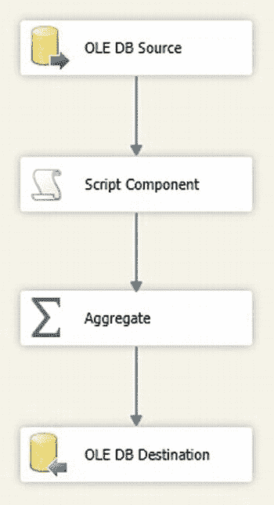

图 10-20. 用于模式分析的最终 SSIS 数据流

运行此任务应在步骤 17 中创建的表中产生一系列模式，每个模式对应源数据中一组不同的字符。你可以使用以下 T-SQL 查看这些模式：

```sql
SELECT * FROM CarSales_Staging.dbo.CarPatternProfile
```

### 工作原理

SSIS（或更准确地说是 .NET）在模式分析方面大显身手。使用正则表达式，可以在比使用 T-SQL 所需时间的零头内收集和分析模式。所需的 .NET 代码具有极简的优雅性，这也是建议将其作为执行此任务的唯一合理方式的另一个原因。

此脚本的作用是使用正则表达式检测输入列中的字母字符和数字，并分别用 "X" 和 "N" 替换它们。这是脚本任务的输出。然后，该输出被聚合，仅显示每种模式的一个示例。

在本例中，我假设任何模式分析都是作为 SSIS 包的唯一目标执行的，而不是作为更广泛的数据分析或数据流过程的一部分。如前所述，模式分析任务无法处理源数据中的 `NULL`，因此你必须在源头排除 `NULL`，或者使用条件拆分任务将 `NULL` 从用于模式分析的数据路径中隔离出来。此外，如果你是在数据加载过程中进行分析，而不是使用分析数据来验证或取消流程，那么向数据流添加一个 `Multicast` 任务，并将其一个输出用作脚本任务的源，可能是个好主意。

### 提示、技巧和陷阱

*   不要忘记引用 `System.Text.RegularExpressions`，因为这是让正则表达式正常工作的基础。
*   如果你希望同时对多个列执行模式分析，那么你需要在数据源之后立即向数据流添加一个 `Multicast` 任务，然后根据要分析的列数复制其他三个任务（`Script`、`Aggregate` 和 `Destination`）。在这种情况下，你可能还需要在每条数据路径中添加一个 `Derived Column` 任务，仅用于添加你正在分析的列的名称（假设你将所有分析结果添加到同一个目标表）。

#### 10-15. 使用 T-SQL 进行模式分析

### 问题

你希望使用基于 T-SQL 的解决方案执行模式分析，但要求性能可接受。

### 解决方案

创建一个 CLR 函数，使用正则表达式来提供模式分析，并发现字段中的字母和数字是如何表示和格式化的，而无需检查确切的文本或数字。

以下步骤说明了如何操作。

1.  创建以下代码，可以在文本编辑器中，或者最好在 Visual Studio 中创建。将其命名为 `C:\SQL2012DIRecipes\CH10\CLRRegex.cs`。

```csharp
using System;
using Microsoft.SqlServer.Server;
using System.Data.Sql;
using System.Data.SqlTypes;
using System.Text.RegularExpressions;

namespace Adama
{
 public class RegexProfiling
  {
   [SqlFunction(IsDeterministic = true, IsPrecise = true)]
   public static object PatternProfiler(string charInput)
    {
     string patternOutput = null;
     System.Text.RegularExpressions.Regex regexTxt = ←
          new System.Text.RegularExpressions.Regex("[A-Z]", RegexOptions.IgnoreCase);
     System.Text.RegularExpressions.Regex regexNum = ←
          new System.Text.RegularExpressions.Regex("[0-9]");

     patternOutput = charInput;
     patternOutput = regexTxt.Replace(patternOutput, "X");
     patternOutput = regexNum.Replace(patternOutput, "N");

     return patternOutput;
    }
  }
}
```

2.  从你的代码编译 DLL。在 Visual Studio 或 SSDT 中，这就像按 F5 一样简单。否则，你需要输入：

```bash
csc /target:library /out: C:\SQL2012DIRecipes\CH10\CLRRegex.dll ←
C:\SQL2012DIRecipes\CH10\CLRRegex.cs
```

当然，请记住使用你创建的 `.cs` 文件的路径，以及你想要使用的 DLL 的输出路径。

3.  现在将 DLL 作为程序集添加到 SQL Server。这假定你的服务器已启用 CLR。在 Management Studio 查询窗口中输入以下代码：

```sql
CREATE ASSEMBLY RegexPatternProfiling FROM 'C:\SQL2012DIRecipes\CH10\CLRRegex.dll'
```

4.  然后使用以下代码在 Management Studio 查询窗口中创建函数：

```sql
CREATE FUNCTION PatternProfiler
(
 @charInput NVARCHAR(4000)
)
RETURNS NVARCHAR(4000)
AS EXTERNAL NAME [RegexPatternProfiling].[Adama.RegexProfiling].[PatternProfiler];
```

5.  你现在可以像使用任何 T-SQL 函数一样使用 `PatternProfiler` 函数来返回列中的模式，使用以下 T-SQL：

```sql
SELECT Col1, PatternProfiler(Col1) AS Pattern_Profile
FROM DataSource
```

### 工作原理

如果你真的想坚持使用 T-SQL 进行所有数据分析，那么这是可以做到的，但必须承认，就模式分析而言，它进行得缓慢而费力。有效的模式分析需要正则表达式，而这些只有通过 CLR 才能为 T-SQL 所访问。这意味着要开发一个 CLR 函数，然后将包含该函数的 .NET 程序集加载到数据库中，这有点繁琐。然后分析可以调用基于 CLR 的函数。此 CLR 函数本质上与配方 10-20 中描述的代码相同。

 **注意** 在本章——甚至本书中——创建和使用基于 CLR 的函数这一主题内容过于庞大，无法详述。有关创建和管理 SQL Server 基于 CLR 的函数的完整描述，请参阅 Robin Dewson 所著的 *Pro SQL Server 2005 Assemblies*（Apress, 2006）。

在 T-SQL 中生成模式配置文件也是可行的。代码可以非常简单（如下列代码所示），但是，正如任何 T-SQL 程序员所知，当用于处理大型数据集时，其性能将极其糟糕，因为它既是基于函数的，同时又是一个“字符串遍历”函数。因此，为了内容的完整性，但同时必须强烈提醒注意性能问题，这里提供了一个简单的 T-SQL 函数，可用于分析模式。它还允许你选择模式字符作为输入参数的一部分。为简单起见，我将在使用该函数的数据库中创建它。

```sql
CREATE FUNCTION dbo.fn_PatternProfile (
 @STRING VARCHAR(4000)
 ,@NUMERICPATTERN CHAR(1)
 ,@TEXTPATTERN CHAR(1)
 )
RETURNS VARCHAR(4000)
AS
BEGIN
 DECLARE @STRINGPOS INT= 1;
 DECLARE @TESTCHAR CHAR(1)= '';
 DECLARE @PATTERNCHAR CHAR(1)= '';
 DECLARE @PATTERNOUT VARCHAR(4000)= '';

 WHILE @STRINGPOS <= LEN(@STRING)
 BEGIN
  SET @TESTCHAR = SUBSTRING(@STRING,@STRINGPOS,1)
  IF @TESTCHAR IN('A','B','C','D','E','F','G','H','I','J','K','L','M','N','O','P','Q','R','S','T','U','V','W','X','Y','Z')
   SET @PATTERNCHAR = @TEXTPATTERN
  ELSE IF UPPER(@TESTCHAR) IN('1','2','3','4','5','6','7','8','9')
   SET @PATTERNCHAR = @NUMERICPATTERN
  ELSE
   SET @PATTERNCHAR = @TESTCHAR
  SET @PATTERNOUT =   @PATTERNOUT + @PATTERNCHAR
  SET @STRINGPOS = @STRINGPOS + 1
 END;

 RETURN(@PATTERNOUT)
END;
```

然后你可以通过以下方式应用此函数：

```sql
SELECT dbo.fn_PatternProfile(CountryName_EN,'N','A'), CountryName_EN
FROM dbo.Countries
```

这段代码是一个“字符串遍历”函数，它只是遍历字段中的每个字符，并用为变量 `@TEXTPATTERN` 定义的字符替换字母字符，用为变量 `@NUMERICPATTERN` 定义的字符替换数字字符。扩展此函数以检测其他字符并用其他模式标记替换它们是极其容易的。

#### 10-16. 分析数据类型

**问题**

你想分析源数据中的数据类型，并指出应使用何种最小数据类型来容纳列中的数据。

**解决方案**

使用 SSIS 脚本任务返回有关源数据类型的分析信息。以下步骤描述了具体方法。

1.  创建一个新的 SSIS 包。添加一个与你所用数据源相对应的新连接管理器。对于除平面文件以外的所有数据类型，你可以接受 SSIS 建议的数据类型。对于平面文件连接管理器，单击“高级”窗格，并将字符串列的 `OutputColumn Width` 设置为一个相对较大的数值。将你有任何疑虑的列也设置为较大的字符串值——我建议 4000。确认对连接管理器的修改。在此示例中，我将使用一个连接到 `C:\SQL2012DIRecipes\CH10\Stock.Txt` 文件的平面文件连接管理器。
2.  添加一个数据流任务，并双击进行编辑。
3.  在数据流窗格中。添加一个源任务，其类型配置为使用你刚刚创建的配置管理器。
4.  添加一个脚本组件（在提示时定义为转换），并将源任务连接到它。双击进行编辑。
5.  单击“输入列”窗格，并确保选中了你希望分析的所有列。
6.  单击“脚本”窗格，并选择 Microsoft Visual Basic 2010 脚本语言。单击“编辑脚本”以打开脚本编辑器。
7.  将以下行添加到 Imports 区域：

```vb
Imports System.IO
Imports System.Text
```

8.  将 `ScriptMain` 类替换为以下内容：

```vb
Public Class ScriptMain
    Inherits UserComponent

    Dim ColDataType(3) As Integer                ' 设置为处理的列数（基于 0）
    Dim ColDataLength(3) As Integer              ' 设置为处理的列数（基于 0）
    Dim ColDecimalPrecision(3) As Integer        ' 设置为处理的列数（基于 0）
    Dim ColDecimalScale(3) As Integer            ' 设置为处理的列数（基于 0）
    Dim ProposedDataType(17) As String

    Public Overrides Sub PreExecute()

        ProposedDataType(0) = "unknown"
        ProposedDataType(1) = "bit"
        ProposedDataType(2) = "tinyint"
        ProposedDataType(3) = "smallint"
        ProposedDataType(4) = "int"
        ProposedDataType(5) = "BIGINT"
        ProposedDataType(6) = "smallmoney"
        ProposedDataType(7) = "money"
        ProposedDataType(8) = "decimal"
        ProposedDataType(9) = "single"
        ProposedDataType(10) = "double"
        ProposedDataType(11) = "time"
        ProposedDataType(12) = "date"
        ProposedDataType(13) = "smalldatetime"
        ProposedDataType(14) = "datetime"
        ProposedDataType(15) = "datetime2"
        ProposedDataType(16) = "char"
        ProposedDataType(17) = "varchar"

    End Sub

    Public Overrides Sub PostExecute()
        MyBase.PostExecute()

        Dim outFile As String = "C:\SQL2012DIRecipes\CH10\Output.txt"
        Dim sb As New StringBuilder
        For i = 0 To ColDataType.Length - 1

            sb.AppendLine("Col" & i & "," & ProposedDataType(ColDataType(i)) & "," & _
               ColDataLength(i) & ","& ColDecimalPrecision(i) & "," & ColDecimalScale(i))

        Next

        Using OutWrite As New StreamWriter(outFile)
            OutWrite.Write(sb.ToString)
        End Using

    End Sub

    Public Overrides Sub Input0_ProcessInputRow(ByVal Row As Input0Buffer)

        GetDataType(Row.ID, 0)
        GetDataType(Row.InvoiceNumber, 1)
        GetDataType(Row.DeliveryCharge, 2)
        GetDataType(Row.ClientID, 3)
        GetDataType(Row.TotalDiscount, 4)

    End Sub

    Public Function GetDataType(ByVal InputCol As String, ByVal ColIndex As Integer) As Integer

        Dim IsFound As Boolean = 0
        Dim SuggestedDataType As Integer

        Dim MaxMoney As Decimal = 922337203685477.62 ' 应该是 .5808
        Dim MinMoney As Decimal = -922337203685477.62 ' 应该是 .5807
        Dim MaxSmallMoney As Decimal = 214748.3647
        Dim MinSmallMoney As Decimal = -214748.3648
        Dim MinDateTime As Integer = 1753
        Dim MaxDateTime As Integer = 9999
        Dim MinSmallDateTime As Integer = 1900
        Dim MaxSmallDateTime As Integer = 2079
        Dim MinDateTime2 As Integer = 0

        Dim DecimalPrecision As Integer = 0
        Dim DecimalScale As Integer = 0
        Dim StringLength As Integer = 0

        ' 未检测小数点分隔符或日期/时间格式..

        If Boolean.TryParse(InputCol, 0) Then
            IsFound = True
            SuggestedDataType = 1
        End If

        If Not IsFound Then

            If IsNumeric(InputCol) Then  ' 对数值进行初始测试

                ' 首先是整数 - 直接映射：
                If Not IsFound Then
                    If Byte.


```vb
' 整数类型检测
' 0 - 256
If Byte.TryParse(InputCol, 0) Then
    IsFound = True
    SuggestedDataType = 2
End If

If Not IsFound Then
    ' - 32768 to 32767
    If Int16.TryParse(InputCol, 0) Then
        SuggestedDataType = 3
        IsFound = True
    End If
End If

If Not IsFound Then
    ' -2147483648 to 2147483647
    If Int32.TryParse(InputCol, 0) Then
        IsFound = True
        SuggestedDataType = 4
    End If
End If

If Not IsFound Then
    ' -9223372036854775808 to 9223372036854775807
    If Int64.TryParse(InputCol, 0) Then
        IsFound = True
        SuggestedDataType = 5
    End If
End If

' 如果不是整数，则尝试小数数据类型
' 首先是货币类型
If Not IsFound Then
    If Decimal.TryParse(InputCol, 0) Then
        If InputCol.Length - InputCol.IndexOf(".", 0) <= 5 Then
            If InputCol >= MinSmallMoney And InputCol <= MaxSmallMoney Then
                IsFound = True
                SuggestedDataType = 6
            End If

            If Not IsFound Then
                If InputCol >= MinMoney And InputCol <= MaxMoney Then
                    IsFound = True
                    SuggestedDataType = 7
                End If
            End If
        End If

        If InputCol.Length - InputCol.IndexOf(".", 0) > 5 Then
            If Not IsFound Then
                IsFound = True
                SuggestedDataType = 8
                DecimalPrecision = InputCol.Length - 1
                DecimalScale = InputCol.Length - InputCol.IndexOf(".", 0) - 1
            End If
        End If
    End If
End If

' 如果不是其他数值类型——那它一定是 Single 或 Double！
If Not IsFound Then
    If Single.TryParse(InputCol, 0) Then
        IsFound = True
        SuggestedDataType = 9
    End If
End If

If Not IsFound Then
    If Double.TryParse(InputCol, 0) Then
        IsFound = True
        SuggestedDataType = 10
    End If
End If

' 日期类型
If Not IsFound Then
    Dim DV As DateTime
    If DateTime.TryParse(InputCol, DV) Then
        If IsDate(InputCol) Then
            If Hour(InputCol) = 0 And Minute(InputCol) = 0 And Second(InputCol) = 0 Then
                ' 没有时间部分，所以是日期
                If Year(InputCol) = 1 And Month(InputCol) = 1 Then
                    ' 没有年/月部分——所以是时间
                    IsFound = True
                    SuggestedDataType = 11
                End If

                If Year(InputCol) >= MinDateTime2 And Year(InputCol) <= MaxDateTime Then
                    IsFound = True
                    SuggestedDataType = 12
                End If
            End If

            If Not IsFound Then
                If Year(InputCol) >= MinSmallDateTime And Year(InputCol) <= MaxSmallDateTime Then
                    IsFound = True
                    SuggestedDataType = 13
                End If
            End If

            If Not IsFound Then
                If Year(InputCol) >= MinDateTime And Year(InputCol) <= MaxDateTime Then
                    IsFound = True
                    SuggestedDataType = 14
                End If
            End If

            If Not IsFound Then
                If Year(InputCol) >= MinDateTime2 And Year(InputCol) <= MaxDateTime Then
                    IsFound = True
                    SuggestedDataType = 15
                End If
            End If
        End If
    End If
End If

' 然后是文本
If Not IsFound Then
    SuggestedDataType = 16
    StringLength = InputCol.Length
End If

' 应用最包容的数据类型
' 首先，如果到目前为止是日期，但后来变成了数字（反之亦然），则自动变为文本
If ((ColDataType(ColIndex) >= 1 And ColDataType(ColIndex) <= 10) And
    (SuggestedDataType >= 11 And SuggestedDataType <= 15)) Or
   ((ColDataType(ColIndex) >= 11 And ColDataType(ColIndex) <= 15) And
    (SuggestedDataType >= 1 And SuggestedDataType <= 10)) Then
    SuggestedDataType = 15
End If

' 记住选择的数据类型
If ColDataType(ColIndex) < SuggestedDataType Then
    ColDataType(ColIndex) = SuggestedDataType
End If

' 对于文本类型，设置列长度
If SuggestedDataType = 16 Then
    If InputCol.Length > ColDataLength(ColIndex) Then
        ColDataLength(ColIndex) = InputCol.Length
    End If
End If
```


```
Length                     End If                     End If
    ' 对于十进制类型，获取精度和小数位数
    If SuggestedDataType = 7 Then
        If DecimalPrecision > ColDecimalPrecision(ColIndex) Then
            ColDecimalPrecision(ColIndex) = DecimalPrecision
        End If
        If DecimalScale > ColDecimalScale(ColIndex) Then
            ColDecimalScale(ColIndex) = DecimalScale
        End If
    End If
    Return SuggestedDataType
End Function
End Class
```

9.  调整代码以使用数据源中的列名。将四个数组（`ColDataType`、`ColDataLength`、`ColDecimalPrecision`、`ColDecimalScale`）的作用域调整为对应列数。定义一个适合您环境的输出文件和目录。本例中为 `C:\SQL2012DIRecipes\CH10\Output.Txt`。
10. 关闭脚本编辑器。单击“确定”关闭“脚本转换编辑器”。最终包应如图 10-21 所示。
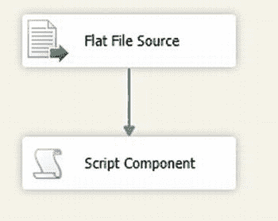
图 10-21. 分析数据类型

您现在可以运行 SSIS 包了。

工作原理
数据剖析不仅意味着查看数据源中包含的值。它能够，而且有时应该，涉及查看数据类型。然后，这可以与您拥有的有关源的任何元数据结合使用，以突出差异，并最终允许您更改目标数据表的数据类型。例如，如果您在某个列中有一系列介于 10 和 200 之间的整数，且其类型设置为 `BIGINT`，那么您可能需要考虑更改目标数据库中相关表的列类型，并向数据源的 DBA 提出建议。

让我们明确一点，我们这里做的是根据指定列中当前的数据，说明数据类型应该且可能是什么。我们不是在说根据 SSIS、OLEDB 提供程序、.NET 提供程序或源元数据，数据是什么。再次强调，我们正在运行源数据通过一个过程来分析它，并说明在理想情况下它应该是什么 SQL Server 数据类型。请记住，对于一个明显不适当的数据类型，可能存在很好的理由，因为负责源的 DBA 可能知道一些关于数据未来发展方向的、您所不知道的事情。反之亦然……

因此，这个 SSIS 脚本试图推断源文件中每个源列最合适的数据类型。它并不完美，但希望是在效率、可靠性和复杂性之间可接受的折衷方案。运行该包将创建一个文本文件（在本例中称为 `C:\SQL2012DIRecipes\CH10\Output.txt`），其中包含四列：
*   建议的数据类型
*   字符字段的最大长度
*   十进制数据类型的十进制精度
*   十进制数据类型的十进制小数位数

该脚本定义了五个数组：四个用于保存列的数据类型（`DataType`）、数据长度（`DataLength`）、十进制精度（`DecimalPrecision`）和小数位数（`Scale`），另一个用于保存它将要分配的数据类型。接下来，`ProposedDataType` 数组在脚本的预执行阶段初始化为 17 种可能的数据类型。脚本的后执行阶段定义为输出最终分析的文本文件。每个要分析的列都会针对源数据中的每一行传递给 `GetDataType` 函数。

然后是脚本的核心——`GetDataType` 函数。它接收每个列的源数据，并尝试推断其数据类型和长度。首先尝试各种整数类型，然后是其他数值类型，然后是日期类型，如果所有其他方法都失败，则使用字符类型。

数据类型按偏好顺序排列，因此具有更广泛定义的类型总是会保留，而不是较窄的数据类型，以确保数据可以成功加载。

提示、技巧和陷阱
*   列的初始长度是个人偏好问题。它越大，加载失败的机会就越小，但过程会越慢。
*   此脚本将评估数据源中的所有行。如果这太多，只需在数据源和脚本任务之间插入一个“行采样”任务，编辑它以设置相关的采样行数，然后（使用“采样选定的输出”）连接到脚本任务。
*   此脚本可以进一步扩展，以使用列名代替数字，并自动限定变量的作用域等——但我将此作为对读者的挑战！
*   数据类型在 附录 B 中有解释。

10-17. 通过分析元数据控制数据流
问题
您希望使用分析数据向 ETL 过程添加控制流逻辑。

解决方案
使用 SSIS 脚本任务分析数据并将源数据输出到 RAW 文件，如果分析测试允许过程继续，该文件将用于未来的处理。以下步骤说明了如何操作。

1.  创建一个新的 SSIS 包。向源数据添加一个名为 **Invoice_Source** 的连接管理器（本例中为 `C:\SQL2012DIRecipes\CH10\Invoice.Txt`）。
2.  在包级别，添加以下变量：
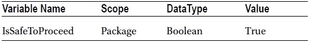
3.  添加一个数据流任务，将其命名为 **Profile Load**，然后双击进行编辑。
4.  添加一个平面文件源，将其配置为您在步骤 1 中创建的 `Invoice_Source` 连接管理器。
5.  添加一个脚本组件，将其设置为转换，并将平面文件源连接到它。双击进行编辑。添加 `IsSafeToProceed` 变量作为读写变量。单击“输入列”并选择要分析的列（本例中为 `InvoiceNumber`）。将 `ScriptLanguage` 设置为 `Microsoft Visual Basic 2010`，然后单击“编辑脚本”。
6.  用以下代码替换 `ScriptMain`：
```
Public Class ScriptMain
    Inherits UserComponent
    Dim NullCounter As Integer
    Dim RowCounter As Integer

    Public Overrides Sub PreExecute()
        MyBase.PreExecute()
    End Sub

    Public Overrides Sub PostExecute()
        If (NullCounter / RowCounter) >= 0.25 Then
            Me.Variables.IsSafeToProceed = False
        End If
    End Sub

    Public Overrides Sub Input0_ProcessInputRow(ByVal Row As Input0Buffer)
        If Row.InvoiceNumber_IsNull Then
            NullCounter = NullCounter + 1
        End If
        RowCounter = RowCounter + 1
    End Sub
End Class
```
7.  关闭脚本编辑器并单击“确定”确认您的修改。
8.  添加一个 Raw 文件目标。将其命名为 **Pause Output** 并将脚本任务连接到它。双击进行编辑。
9.  如下配置 Raw 文件目标：
    *   访问模式：                     文件名
    *   文件名：                          `C:\SQL2012DIRecipes\CH10\Invoice.Raw`
    *   写入选项：                      始终创建
10. 确保选择了所有列，然后单击“确定”确认您的修改。
11. 返回“控制流”选项卡，添加第二个数据流任务。将其命名为 **Final Load** 并将第一个数据流任务连接到它。双击连接器并在“优先级约束编辑器”中进行设置如下。对话框应如图 10-22 所示。
    *   评估操作：            表达式和约束
    *   值：                        成功
    *   表达式：                  `@IsSafeToProceed`
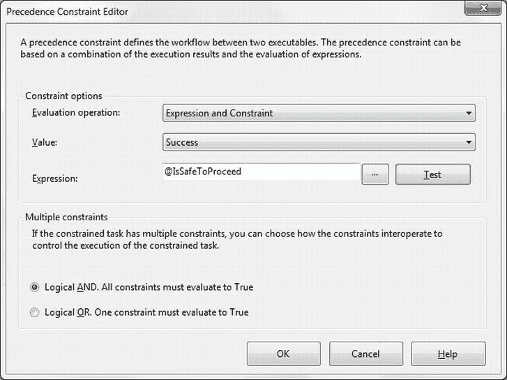
```


# 第 10 章

## SSIS 中的优先级约束编辑器

12. 确认你的更改。
13. 双击第二个数据流任务进行编辑。
14. 添加一个名为`Continue Load`的原始文件源，并将其配置为使用你在步骤 9 中定义的同一个文件（`C:\SQL2012DIRecipes\CH10\Invoice.Raw`）。
15. 添加一个名为`Final Load`的 OLEDB 目标，并将原始文件源连接到该目标。将其配置为将数据加载到`CarSales_Staging`数据库中，并从 OLEDB 目标创建一个表。最终的包应如图 10-23 所示。

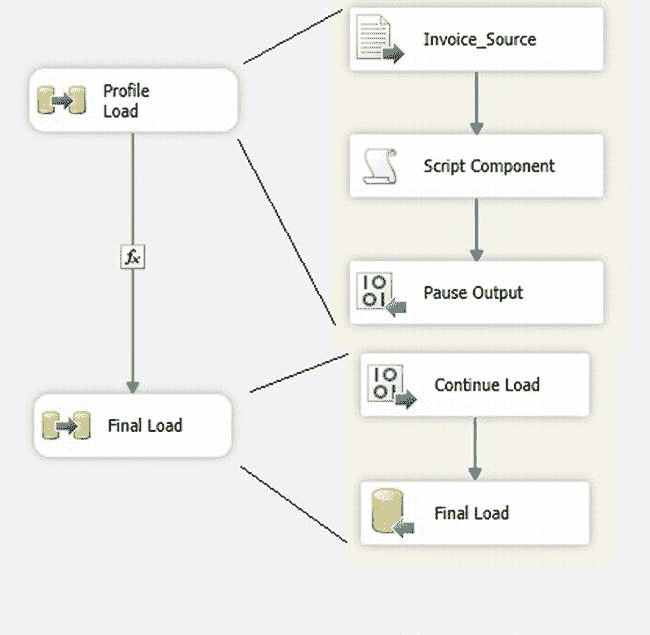

图 10-23. SSIS 中受控的数据流

## 工作原理

在加载数据时进行分析，可以让你捕获指定的度量标准，然后这些标准可用于在必要时停止处理。这不可避免地意味着在计数器完成并分析期间，数据流会暂停。因此，关键在于找到一种方法，在等待分析结果的同时高效地暂存数据。我推荐的解决方案是使用`RAW`文件目标临时保存数据，然后如果分析未发现异常，则继续最终加载到目标表中。这会在一定程度上减慢过程，但由于几乎总是 SSIS 包中最慢的部分是最终加载，因此如果遇到问题，可以避免一次浪费的加载和重新加载。将数据输出到原始文件速度极快——在几乎所有情况下，都应比加载到暂存表中更快。在最理想的情况下，你应该将`RAW`文件放在 SQL Server 本身，如果可能的话，放在快速的磁盘阵列上。

这里使用的代码是一个非常简单的例子来说明原理。在数据加载过程中，将测试一列中`NULL`的数量，如果超过 25%，则过程将停止。这在`PostExecute`方法中设置。如果`NULL`的数量低于此阈值，那么包将继续进入其最后阶段——将数据加载到目标表中。

当然，还有其他解决方案。例如，你可以在数据加载后对其进行分析。这可能是最简单的解决方案，因为你可以结合使用本章描述的任何 T-SQL 技术来生成数据概要文件，该文件应能提醒你数据加载的任何潜在问题。此外，任何存储过程或 SQL 代码都可以作为执行 SQL 任务在 SSIS 包末尾运行，并可以将警报输出到你的日志记录基础设施，如第 12 章所述。

或者，你可以选择在数据加载时对其进行分析。这里有两种可能性：

*   使用执行 SQL 任务中的 T-SQL 分析任何暂存的数据。
*   在数据源后插入一个多播任务，并使用本章前面展示的各种 SSIS 脚本中的一些来分析数据。使用单独的数据路径将避免在使用异步转换时减慢处理速度。

## 提示、技巧和注意事项

*   本示例的脚本极其简单，但它旨在让你了解如何在加载过程中分析数据，并利用分析结果来控制包流程。
*   你可以使用本章前面描述的任何 SSIS 技术来扩展分析功能。

#### 总结

本章展示了多种使用 SQL Server 分析源数据的方法。问题在于选择哪种方法以及何时使用。显然，答案将取决于你的具体情况和要求。如果你可以连接到尚未进入 SQL Server 的数据，你也可以对其进行分析。这本质上意味着需要一个 OLEDB 提供程序（必要时通过 ODBC）来对源使用 T-SQL 命令。然而，在实践中，这可能非常慢。

如果你使用 SSIS，那么在任何实际环境中，数据都必须位于 SQL Server 中，或者让 SSIS 数据分析任务读取源的变通方法可能会使其慢到令人无法忍受。

如果你的数据已经暂存到 SQL Server 中，那么你所能开拓的视野（至少在数据分析方面）会宽得多。你可以使用 SSIS 或 T-SQL 来分析数据，而对于快速的数据概要分析，SSIS 数据分析任务可以设置为几乎即时运行。你还可以将概要分析输出存储为 XML 或将其分解到 SQL Server 表中。

一旦你分析了数据，就可以使用结果来决定是否继续数据加载。这假设源数据要么是磁盘上的`RAW`文件，要么已加载到暂存表中。无论哪种情况，你的源数据都可以进入 ETL 过程的下一阶段。

作为一个示意性的概述，表 10-8 是我对各种方法及其优缺点的看法。

### 表 10-8. 本章所述技术的优缺点

| 技术 | 优点 | 缺点 |
| --- | --- | --- |
| T-SQL 分析 | 相对简单。 | 需要多个特定的代码片段。 |
| SSIS 分析任务 | 易于使用。 | 有限制。需要 XML 查看器或笨重的输出变通方法。 |
| 自定义 SSIS 分析 | 易于集成到现有的 SSIS 包中。 | 设置复杂。 |
| T-SQL 分析脚本 | 复制粘贴。 | 可能提供过多信息。 |
| SSIS 脚本任务分析 | 高度可适应和可扩展。 | 复杂。 |
| SSIS 模式分析 | 设置简单。 | |
| T-SQL 模式分析 | 设置简单。 | 非常慢。 |

# 第 11 章

## 增量数据管理

幸运的是，数据集成中有很大一部分是相对简单的情况，即将所有数据从源（无论它是什么）传输到目标（希望是 SQL Server）。目标在加载过程之前被清空，目标是将数据从 A 准确、完整地以尽可能短的时间传输到 B。然而，这个基本场景不可避免地无法随时满足每个人的需求。在开发 ETL 解决方案时，你可能经常被要求确保只有数据的变更部分才从源应用到目标。检测数据变更，并且只（重新）加载已更改数据的子集，将是本章的主题。为了给一个可能相当复杂的主题起一个简单的标题，我建议称之为*增量数据管理*。

### 前言：为什么要处理增量数据？

花时间设置增量数据处理可以带来丰厚回报的原因有几个：

*   **节省时间：** 如果源数据只包含很小比例的插入、更新或删除，那么只应用这些更改而不是重新加载大量数据，速度会快得多。
*   **降低网络负载：** 如果你能够在源处隔离已修改的数据，那么从源发送到目的地的数据量可以大大减少。
*   **减轻服务器压力：** 这意味着处理器利用率降低，磁盘活动减少。
*   **减少阻塞：** 虽然阻塞在报告或分析环境中（尤其是在夜间处理期间）希望不是主要问题，但在某些情况下它可能是个问题，因此最好将其保持在最低限度。

无论如何，你可能会发现更容易考虑这些论点——既包括支持管理增量数据的论点，也包括反对其的论点；它们在表 11-1 中提供。

### 表 11-1. 加载增量数据的优缺点简要概述

| | 优点 | 缺点 |
| --- | --- | --- |
| 完全加载 | 简单。 | 可能慢得多。 |


# ETL 项目中的增量数据加载考量

当面对一个 ETL 项目时，你必须始终问自己这个问题：“投入精力实现增量数据加载技术是否值得？” 与处理这类问题时常见的做法一样，通常不可能立即确定效率提升的阈值在哪里。因此，除非有另一个令人信服的理由让你选择“截断并加载”技术，而不是开发一个（可能相当复杂的）增量数据加载流程，否则请准备好进行一些基础测试来找到你的答案。

# 增量数据方法

简单来说，主要有两种检测数据变化的方式：
*   **在源头：** 一种标记已更改记录的方法，包括更改类型（插入、删除或更新）的指示。
*   **在 ETL 加载过程中：** 一种比较源记录和目标记录并隔离出有差异记录的方法。

这个简单的概述很快需要更深入的分析。

## 在源头检测变化

从 ETL 开发人员的角度来看，在源头标记数据变化可能最接近理想的解决方案。原因如下：
*   只有更改的记录需要在系统之间移动。
*   无需对两个数据集进行全面比较，因为源系统维护了其自身的变化历史。
*   增量信息甚至可以保存在单独的表中，避免了为隔离增量子集而对大型源表进行代价高昂的扫描。
*   这项工作通常由源系统 DBA 完成。

## 在 ETL 加载过程中检测变化

不幸的是，许多源系统注定对 ETL 开发人员来说是封闭的“黑盒”。这通常是因为源系统 DBA 不会容忍任何被认为会给其数据库增加系统开销的操作。DBA 的这种固执甚至可能延伸到低开销的解决方案，例如变更跟踪和变更数据捕获，这些是第 12 章的主题。无法调整源系统的另一个可能原因是，它是一个第三方开发的产品，任何修改在实践上或法律上都是不可能的。因此，如果你不被允许以任何方式接触源系统，你就必须在加载过程中比较数据集并推断变化。

然而，在加载过程中（或者，在某些情况下，在加载之前）执行数据比较仍然可以实现更快的数据加载，并减轻网络和服务器压力。因此，我们这里需要考虑的是如何比较数据。

简单地说，主要有两种记录比较方法：
*   比较源数据集和目标数据集中每个重要字段的列。这不一定需要是所有列，可以是一个反映目标数据使用需求的子集。
*   使用一个存储在源数据集和目标数据集中的指示字段。这可以是以下之一：
    *   一个添加日期和/或更新日期字段。
    *   一个哈希字段（校验和）。
    *   一个 `ROWVERSION` 字段（以前称为 `Timestamp` 字段，即使它与时间或日期无关）。实际上，任何其他在数据更改时递增的计数器字段都可以。

无论哪种情况，你都将寻找三种差异：
*   存在于源中但不存在于目标中的数据（插入）。
*   存在于目标中但缺失于源中的数据（删除）。
*   同时存在于源和目标中，但比较表明有变化的数据（更新）。

那么，让我们开始探讨如何将这些知识应用到实际的数据加载中。

我将从更常见的加载过程中数据比较的情况开始，然后看看在源系统中应用增量标记的方法。请记住，本章中的解决方案旨在解决不同的 ETL 挑战和情况。每个都有其优点和缺点。在现实世界中，你可能会发现自己需要混合搭配不同解决方案中的技术来应对 ETL 挑战。

按照本书的惯例，如果你想跟随示例操作，必须从本书的配套网站下载示例数据。这意味着需要创建示例数据库 `CarSales` 和 `CarSales_Staging`，它们几乎用于本章所有示例。在本章示例中，我将使用 `CarSales` 数据库作为数据源，使用 `CarSales_Staging` 数据库作为目标数据库。

你可以下载的示例数据总是包含一个键列，如果你为自己的数据修改示例，也应该有一个键列。正如你在 SQL Server 职业生涯中可能已经发现的那样，没有键列加载增量数据极其困难，甚至不可能。还要记住，SQL Server `ROWVERSION` 也是一个唯一的数字，每次修改字段时递增，与日期和时间无关。

在深入本章的解决方案之前，你需要事先被告知，其中一些解决方案比本书其他地方看到的要长。事实上，乍一看，它们可能看起来实现起来很复杂。我能给你的最好建议是：在将它们应用于你自己的 ETL 挑战之前，彻底阅读几遍。我特别建议你仔细查看给出的控制流和数据流图，以便更清楚地了解每种情况下的流程。此外，当你基于这些想法创建你自己的 ETL 解决方案时，请毫不犹豫地提前查看后续内容，并跳转到“工作原理”部分，以确保你理解了流程的来龙去脉。

最后，由于增量数据管理必须处理一组只有有限解决方案的挑战，本章中的一些解决方案确实有相似的阶段。为了避免一遍又一遍地重复相同的信息，我偶尔会要求你参考本章中其他解决方案的元素，以完成一个流程中的特定步骤。

# 11-1. 作为结构化 ETL 流程一部分加载增量数据

## 问题
在定期数据加载期间，你只想加载新数据，更新任何已更改的记录，并删除任何已删除的记录。

## 解决方案
使用 SSIS 并检测源数据的更改方式。然后相应地处理目标数据，以对目标表应用插入、更新和删除操作。我将解释如何完成此操作。

1.  在目标数据库 (`CarSales_Staging`) 中使用以下 DDL 创建三个表（当然，如果你已为其他解决方案创建了它们，请先删除它们）（`C:\SQL2012DIRecipes\CH11\DeltaInvoiceTables.Sql`）：
    ```sql
    CREATE TABLE dbo.Invoice_Lines
    (
     ID INT NOT NULL,
     InvoiceID INT NULL,
     StockID INT NULL,
     SalePrice NUMERIC(18, 2) NULL,
     VersionStamp VARBINARY(8) NULL -- this  field is to hold ROWVERSION data
    );   -- The destination table with no IDENTITY column or referential integrity
    GO

    CREATE TABLE dbo.Invoice_Lines_Updates
    (
     ID INT NOT NULL,
     InvoiceID INT NULL,
     StockID INT NULL,
     SalePrice NUMERIC(18, 2) NULL,
     VersionStamp VARBINARY(8) NULL -- this  field is to hold ROWVERSION data
    ) ;  --The "scratch" table for updated records
    GO

    CREATE TABLE dbo.Invoice_Lines_Deletes
    (
    ID INT NULL
    ) ;  -- The "scratch" table for you to deduce deleted records
    GO
    ```

2.  创建一个 SSIS 包（我将命名为 SSISDeltaLoad。


# 配置 SSIS 数据流进行增量数据检测

## 初始设置与数据流配置

创建并配置两个`OLEDB`连接管理器：一个用于源数据库（命名为`CarSales_OLEDB`），一个用于目标数据库（命名为`CarSales_Staging_OLEDB`）。

在控制流窗格中添加一个数据流任务，命名为`Inserts and Updates`。双击进入数据流窗格。

添加一个`OLEDB`源适配器。将其配置为使用`CarSales_OLEDB`连接管理器，并使用以下`SQL`片段从`Invoice_Lines`源表中选择所有需要的行：
```sql
SELECT    ID, InvoiceID, StockID, SalePrice
          ,VersionStamp AS VersionStamp_Source
FROM      dbo.Invoice_Lines WITH (NOLOCK)
```

在数据流窗格中添加一个多播转换，命名为`Split Data`。将`Inserts and Updates`数据源适配器连接到它。

添加一个查找转换，并将多播转换连接到它。命名为`Lookup RowVersions`。在查找转换的“常规”窗格中，按如下方式配置：

| 配置项 | 值 |
| :--- | :--- |
| `Cache Mode` | `No Cache` |
| `Connection Type` | `OLEDB Connection Manager` |
| `Specify how to handle rows with NoMatch entries` | `Send rows with no matching entries to the No Match output` |

单击左侧的`Connection`。将连接管理器设置为`CarSales_Staging_OLEDB`，因为你将使用此查找转换，把源数据与你正在查找的目标数据进行比较。

将查找设置为“使用`SQL`查询的结果”，并输入以下`SQL`：
```sql
SELECT     ID, VersionStamp
FROM       dbo.Invoice_Lines WITH (NOLOCK)
```

单击左侧的`Columns`。两个表，源（左侧）和目标（右侧）将出现。将右侧“可用查找列”（或目标）表中的`ID`列拖放到左侧“可用输入列”（源）表中的`ID`列上。这会将两个数据源的唯一`ID`相互映射。

选择右侧“可用查找列”（或目标）表中的`VersionStamp`列，并提供一个输出别名——建议为`VersionStamp_Destination`。这允许你为每条记录比较源和目标的`VersionStamp`。对话框应类似于图 11-1。

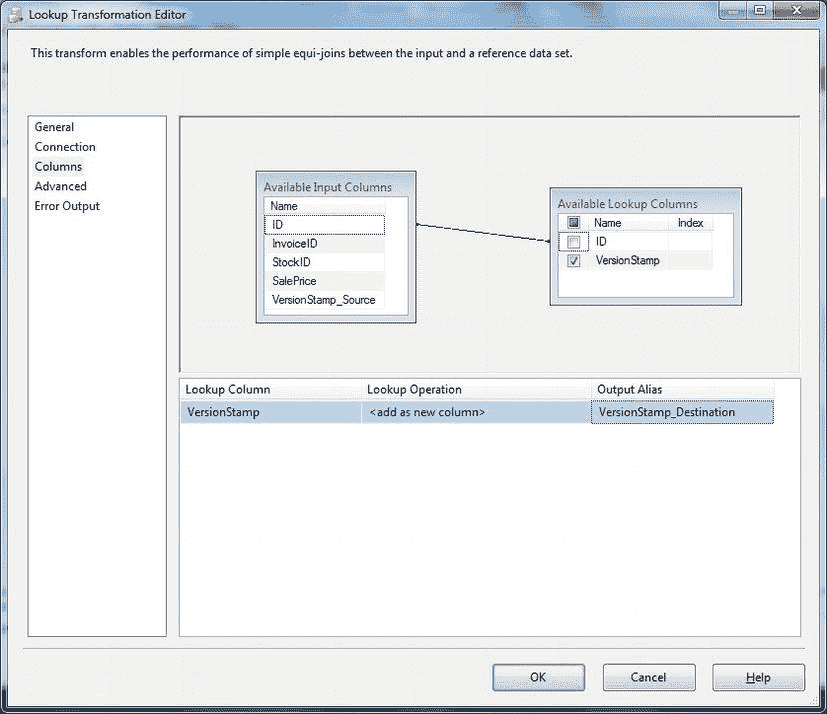

图 11-1.  用于返回目标`VersionStamp`的查找任务

单击`OK`确认修改。返回到数据流窗格。

在数据流窗格上添加一个`OLEDB`目标转换，并将查找转换连接到它。将出现“输入输出选择”对话框。选择`No Match`输出并单击`OK`。

双击`OLEDB`目标适配器进行配置。确保选中了`CarSales_Staging_OLEDB`连接管理器，并且目标表是`dbo.Invoice_Lines`。这将把任何新记录直接插入到目标表中。

单击左侧的`Mappings`。确保所有要导入的列都已正确映射。单击`OK`返回到数据流窗格。

至此，你已完成流程的插入部分。

## 处理更新与删除的检测

现在开始处理更新部分。在数据流窗格上添加一个条件性拆分转换。将查找转换连接到它，命名为`Detect Rowversion Difference`。这会将查找匹配输出发送到条件性拆分。

双击以编辑条件性拆分。添加一个名为`VersionStamp Differences`的输出条件，条件为：
```sql
[VersionStamp_Source] != (DT_I8) [VersionStamp_Destination]
```

对话框应类似于图 11-2。

注意，你必须将目标数据类型从`Varbinary`转换为`BigInt` (`DT_I8`)，而`SSIS`在从源读取`ROWVERSION`字段时会自动为你完成此操作。

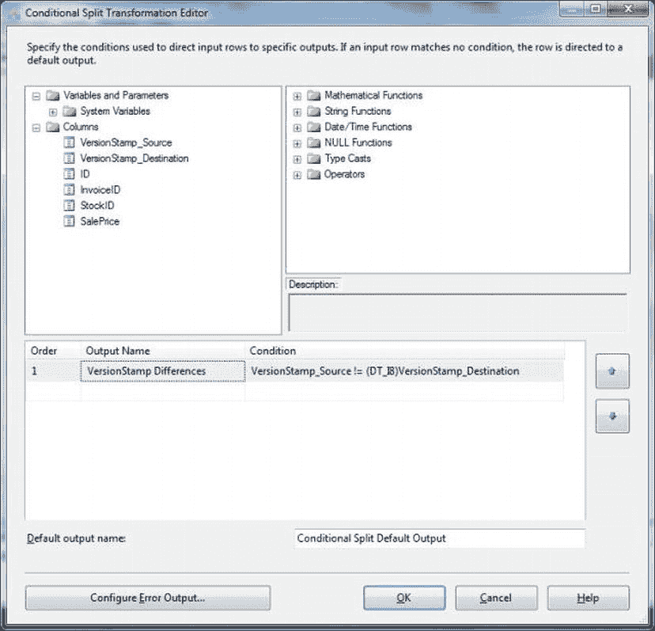

图 11-2.  设置条件性拆分

单击`OK`确认并关闭对话框。

向数据流添加一个`OLEDB`目标适配器，命名为`Scratch Table for Updates`。将条件性拆分转换连接到它。将出现“输入输出”对话框，你应在其中选择`VersionStamp Differences`输出（它实际上是目标适配器的源）。将`OLEDB`连接管理器设置为`CarSales_Staging_OLEDB`，数据访问模式设置为`表或视图–快速加载`，目标表设置为`Invoice_Lines_Updates`。单击`Mappings`。确保所有列都如图 11-3 中那样映射，然后单击`OK`确认修改。这完成了处理更新的初始阶段——将更新数据存储在临时表中。

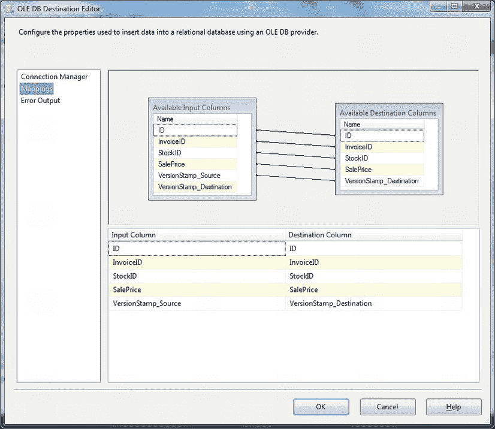

图 11-3.  为更新映射列

现在我们可以处理删除。向数据流添加一个`OLEDB`目标适配器，并将`Split Data`多播转换连接到它。命名为`Scratch Table for Deletes`，并将其配置为将行发送到`Invoice_Lines_Deletes`表，如下所示：

| 配置项 | 值 |
| :--- | :--- |
| `Connection Manager` | `OLEDB_Destination` |
| `Data Access Mode` | `Table or View – Fast Load` |
| `Name of the Table or the View` | `Invoice_Lines_Deletes` |

单击`Mappings`。确保两个`ID`列已映射。对话框应类似于图 11-4。

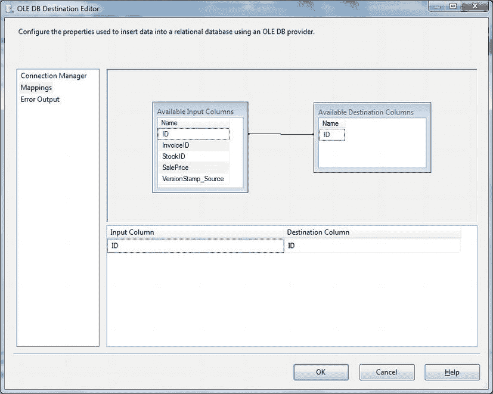

图 11-4.  为删除映射`ID`列

单击`OK`返回到数据流窗格。

单击“控制流”选项卡返回到控制流窗格。数据流窗格应大致如图 11-5 所示。

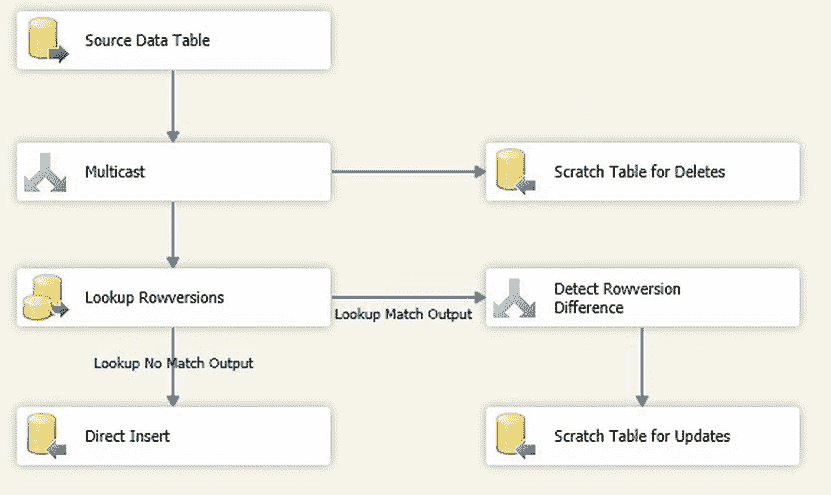

图 11-5.  SSIS 中用于增量数据检测的数据流窗格

## 执行最终数据操作

最后，我们可以应用更新和删除逻辑。单击“控制流”选项卡并添加一个执行`SQL`任务。将其连接到数据流任务。命名为`Update Data`。配置此执行`SQL`任务如下（使用`C:\SQL2012DIRecipes\CH11\11-1_Update.Sql`）：

| 配置项 | 值 |
| :--- | :--- |
| `Connection` | `OLEDB_Destination` |
| `SQL Statement` | `UPDATE DST` |
|  | `SET` |
|  | `DST.InvoiceID = UPD.InvoiceID` |
|  | `,DST.SalePrice = UPD.SalePrice` |
|  | `,DST.StockID = UPD.StockID` |
|  | `,DST.VersionStamp = UPD.VersionStamp` |
|  | `FROM    dbo.Invoice_Lines DST` |
|  | `INNER JOIN dbo.Invoice_Lines_Updates UPD` |
|  | `ON DST.ID = UPD.ID` |

单击`OK`完成此任务的编辑。

添加一个新的执行`SQL`任务。将`Update Data`执行`SQL`任务连接到它，并命名为`Delete Data`。配置这个新任务如下（使用`C:\SQL2012DIRecipes\CH11\11-1_Delete.Sql`）：

| 配置项 | 值 |
| :--- | :--- |
| `Connection` | `OLEDB_Destination` |
| `SQL Statement` | `DELETE` |
|  | `FROM dbo.Invoice_Lines` |
|  | `WHERE ID IN` |
|  | `(SELECT dbo.Invoice_Lines.ID` |
|  | `FROM   dbo.Invoice_Lines` |
|  | `LEFT OUTER JOIN dbo.Invoice_Lines_Deletes` |
|  | `ON dbo.Invoice_Lines.ID = dbo.Invoice_Lines_Deletes.ID` |
|  | `WHERE (dbo.Invoice_Lines_Deletes.ID IS NULL))` |

单击`OK`确认你的更改。

添加最后一个执行`SQL`任务。命名为`Truncate Scratch Tables`。将其连接到前一个执行`SQL`任务（`UpdateData`）。


## 配置执行 SQL 任务

按如下方式配置执行 SQL 任务：
*   **名称**：`Truncate Scratch tables`
*   **连接**：`OLEDB_Destination`
*   **SQL 语句**：
    ```sql
    TRUNCATE TABLE dbo.Invoice_Lines_Deletes
    TRUNCATE TABLE dbo.Invoice_Lines_Updates
    ```

29. 单击“确定”完成编辑。数据包已准备就绪。数据流窗格应类似于图 11-6。
    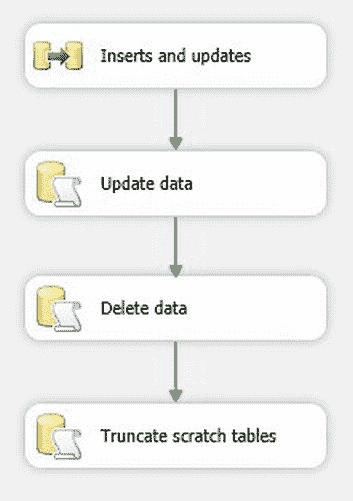
    图 11-6. 用于简单增量数据更新的数据流

## 工作原理

此方案针对一个相当常见的场景：你有一个位于源系统上的表，需要加载到暂存数据库中。你希望插入任何新记录、删除已被移除的记录并更新已更改的记录，而非截断整个表并重新加载。源表包含一个 `VersionStamp` 列，你希望用它来筛选用于更新的增量数据。它还包含一个主键（或唯一 ID），允许你唯一地标识记录。因此，你可以执行任何适当的插入和删除操作来处理新增和移除的数据，并识别出数据需要更新的记录。让我们再假设一下，不幸的是，你无法控制源数据或其驻留的服务器；你只拥有对源数据的读取权限。因此，整个源表——或者，替代方案是，一个包含自上次加载以来所有已修改记录的数据集——已经可用。

此技术的技巧在于，在删除或更新行时避免使用 SSIS 的 `OLEDB Command` 转换；它将对每一行触发，并可能对更新执行数十万次。一个解决方案是使用两个专门的表来保存删除和更新所需的所有数据，并使用 T-SQL 对这些表处理所有 `DELETE` 和 `UPDATE` 操作。这两个表可以作为数据包的一部分创建——并在之后删除——或者保留在暂存数据库中用于审核目的。

这个过程初看可能有点令人望而生畏。图 11-7 提供了一个示意图来阐明该过程。
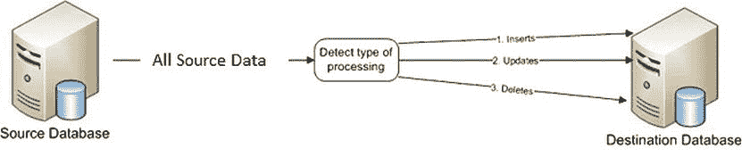
图 11-7. 基本的增量检测流程

当可以确保只有很小比例的数据发生了变化，并且在源表中拥有主键（或唯一 ID）以及一个指示已发生更改的列时，最适合使用此方法。当你无法获得在源数据库中创建和删除持久化临时表的权限时，此方法适用。

该方法能够工作的先决条件如下：

*   在目标数据库中拥有源表的副本，包含你希望 `INSERT` 的所有列，且 `VersionStamp` 列的数据类型更改为 `VARBINARY(8)`。这允许你存储记录上次加载时的 `VersionStamp` 值。此表包含应用所有插入、删除和更新操作后源数据集的最终副本。目标表中的任何 `IDENTITY` 列在目标表中必须是简单的 `INT/BIGINT` 数据类型（不带 `IDENTITY` 规范）。
*   在目标数据库中拥有源表的第二个临时副本，包含你希望加载到最终目标表中的所有列，且 `VersionStamp` 列的数据类型更改为 `VARBINARY(8)`。此副本将用于保存在源数据集中检测到的 `UPDATE` 操作，然后再将其应用到最终表。
*   一个单列临时表，用于保存将从最终目标表中 `DELETE` 的所有记录的唯一 ID。此列的数据类型必须与源数据表中的唯一 ID 的数据类型相匹配。

本方案的核心在于它如何处理插入和更新——也称为 `upserts`（更新插入）。

此方法已成为经典，它使用 `Lookup`（查找）转换来检测源数据集和目标数据集之间的差异。不存在于目标表中的记录直接作为数据流的一部分被添加。已修改的记录被添加到一个临时表中，然后使用该表通过 T-SQL `UPDATE` 命令来更新目标数据表。为了方案的完整性，我还包含了记录删除的处理。这可能意味着物理删除记录，或者应用所谓的“软删除”，即目标表中存在一个额外的布尔字段（例如称为 `IsDeleted`），当源数据中的记录被删除时，该字段被设置为 True。当然，有些场景可能根本不需要处理删除。

我必须实事求是地承认，这种方法有一个潜在的缺点。它会将所有数据通过网络从源服务器拉取到目标服务器。如果这对您来说是个问题，那么请考虑查阅方案 11-4、11-6 和 11-7 中提出的解决方案。

> **注意：** 使用 `Lookup` 转换时，请确保只选择你需要的列。无论你使用哪种缓存模式，返回最小的字段集合只会使过程更快。

## 提示、技巧和陷阱

*   允许你高效删除和更新记录的两个“临时”表（至少在本方案中）必须在此操作期间持久化到磁盘。它们可以与目标数据表位于同一数据库中，也可以位于你仅保存此类“临时”和暂存表的数据库中。你可能更倾向于在过程开始时创建它们并在结束时删除它们，而不是将它们保留在磁盘上并在开始时截断它们。这完全由你选择。
*   在步骤 9 中，如果你的唯一键由多个列组成，请记住映射所有这些列。
*   由于 `VersionStamp` 是二进制的，你可能需要将其转换为 `BIGINT` 以进行比较。这对于 SSIS 的 `Conditional Split`（条件拆分）任务是成立的，因为它无法比较二进制类型。然而，T-SQL 可以比较二进制类型。另外，我将增量标记列命名为 `VersionStamp`，以便明确即使它是一个 Timestamp（时间戳）字段——它也与时间无关！
*   缓存可以加速 `MERGE`（合并）转换的使用，如方案 13-16 所述。
*   除了持久化的“临时”表，你也可以使用会话范围内的临时表，如方案 11-4 所述。
*   要执行逻辑删除（并假设在 `Invoice_Lines` 目标表中存在一个 `IsDeleted` BIT 列），请将“删除数据”执行 SQL 任务中的 SQL 替换为以下内容（`C:\SQL2012DIRecipes\CH11\12-1_LogicalDelete.Sql`）：
    ```sql
    UPDATE  dbo.Invoice_Lines
    SET     IsDeleted = 1
    WHERE   ID IN (
                SELECT dbo.Invoice_Lines.ID
                FROM   dbo.Invoice_Lines
                LEFT OUTER JOIN dbo.Invoice_Lines_Deletes
                       ON dbo.Invoice_Lines.ID = dbo.Invoice_Lines_Deletes.ID
                WHERE dbo.Invoice_Lines_Deletes.ID IS NULL
              )
    ```
*   如果没有一个单一的（`VersionStamp` 或哈希）字段可以让你识别某一行数据是否已更改，你可能只有一个解决方案：将一行中的所有或大部分列与另一个表中的对应列进行比较。这不仅设置起来要繁琐得多，在大多数情况下也更慢。不过，如果它是重新加载整个表的唯一替代方案，那它可能是你唯一的解决方案。关于多字段比较的示例，你可以查看方案 11-2 中的 `MERGE...ON` 语句。
*   不幸的是，当使用 SQL Server 2005 的 SSIS 时，无法像本方案中那样检测新记录（因为没有 NoMatch 输出）。


如果您仍在使用 **SSIS 2005**，那么我建议将所有源 ID 并行数据加载到 `Invoice_Lines_Deletes` 目标表中。然后，使用 T-SQL `DELETE` 语句将此表与最终目标表进行比较，以删除源系统中不再存在的任何记录（或者，如果您想执行软删除，可以执行 `UPDATE`）。

## 11-2. 使用链接服务器加载数据变化

### 问题

您在链接服务器上有一个源数据库，该服务器连接到本地目标服务器，并且您希望管理增量数据变化，而不是执行完整数据加载。

### 解决方案

使用 T-SQL `MERGE` 函数来管理从链接服务器源到本地服务器目标的数据传输。这将自动处理新记录的插入、现有记录的更新，以及（可选）删除数据源中不再存在的记录。以下步骤说明了如何操作。

1.  确保源数据库和目标数据库中具有相同的源表和目标表结构（至少为此示例目的），例如 (`C:\SQL2012DIRecipes\CH11\tbl12-2_Invoice_Lines.Sql`)：

    ```sql
    CREATE TABLE CarSales_Staging.dbo.Invoice_Lines
    (
    ID INT NOT NULL,
    InvoiceID INT NULL,
    StockID INT NULL,
    SalePrice NUMERIC(18, 2) NULL
    ) ;
    GO
    ```

2.  确保您有一个正确配置的链接服务器，运行该过程的用户在目标服务器上拥有读取源数据的所有必要权限。在此示例中，链接服务器名为 `ADAMREMOTE`。设置指向 SQL Server 源数据库的链接服务器在配方 5-2 中有描述。

3.  假设您已具备所有先决条件，以下 T-SQL 代码将确保源表和目标表之间的基于增量的同步 (`C:\SQL2012DIRecipes\CH11\LinkedServerMerge.Sql`)。

    ```sql
    --合并例程

    -- 两个数据集
    MERGE       CarSales_Staging.dbo.Invoice_Lines AS DST
    USING       ADAMREMOTE.CarSales.dbo.Invoice_Lines AS SRC
    ON DST.ID = SRC.ID

    -- 删除
    WHEN NOT MATCHED BY SOURCE
    THEN DELETE

    -- 更新
    WHEN MATCHED AND
        (
        ISNULL(SRC.InvoiceID,0) <> ISNULL(DST.InvoiceID,0)
        OR ISNULL(SRC.StockID,0) <> ISNULL(DST.StockID,0)
        OR ISNULL(SRC.SalePrice,0) <> ISNULL(DST.SalePrice,0)
        )
    THEN UPDATE
    SET DST.InvoiceID = SRC.InvoiceID
        ,DST.StockID = SRC.StockID
        ,DST.SalePrice = SRC.SalePrice

    -- 插入
    WHEN NOT MATCHED THEN
    INSERT
                (
                 ID
                 ,InvoiceID
                 ,StockID
                 ,SalePrice
                )
    VALUES
                (
                 ID
                 ,InvoiceID
                 ,StockID
                 ,SalePrice
                )
    ;
    ```

### 工作原理

使用链接服务器作为数据源也可以处理插入、更新和删除操作。自 SQL Server 2008 引入 T-SQL `MERGE` 函数以来，这变得容易多了。需要注意的一点是，当目标服务器与源服务器有链接服务器连接时，您也可以使用 `MERGE`。

两个数据表被别名如下：

*   源 (`SRC`) 使用四部分表示法，包括链接服务器名称（本例中为 `ADAMREMOTE`）。
*   目标 (`DST`) 在本地服务器上。

唯一标识符字段用作两个表之间的联接。删除操作使用 `WHEN NOT MATCHED BY SOURCE` 子句定义。更新操作使用 `WHEN MATCHED AND` 子句定义——并比较用于检测增量的字段。插入操作使用 `WHEN NOT MATCHED` 子句定义。

您可能会发现一个有用的技术是在代码开头添加以下行：

```sql
DECLARE @OutputIDs TABLE  (AccountID BIGINT, ActionType VARCHAR(40))
```

并在结尾处（分号之前）添加以下行：

```sql
OUTPUT COALESCE(INSERTED.ID, DELETED.ID), $Action INTO @OutputIDs
```

这将把所有受操作影响的记录 ID 列表以及每个记录的操作类型存储到 `@OutputIDs` 表变量中。然后，您可以将此表用作日志记录和/或调试信息的来源。

 **注意** 仅当遵守几个基本条件时，使用 `MERGE` 才真正高效。首先，您需要在源表用于联接的列（`ON` 语句）上创建索引，并在目标表用于联接的列上创建聚集索引。如果您没有这些索引，您可能会发现 `MERGE` 比其他解决方案更慢。

### 提示、技巧和陷阱

*   这里我比较的是多个字段；当然，如果源和目标数据库中存在此类列类型，您可以使用 `VersionStamp`、哈希数据或包含更新数据标志的列来检测增量。
*   记住用分号结束 `MERGE` 例程。
*   如果目标表的 ID 列是 `IDENTITY` 列，您将需要使用 `SET IDENTITY_INSERT ON` 来封装执行插入的代码——并在完成后使用 `SET IDENTITY_INSERT OFF`。

## 11-3. 作为结构化 ETL 流程的一部分从小型源表加载数据变化

### 问题

您有一个小型的源数据集，并希望作为常规加载过程的一部分管理数据变化。

### 解决方案

在 SSIS 包中使用 T-SQL `MERGE` 函数。

1.  创建一个新的 SSIS 包，并添加两个 OLEDB 连接管理器：一个命名为 **CarSales_OLEDB**（连接到源 CarSales 数据库），另一个命名为 **CarSales_Staging_OLEDB**（连接到 CarSales_Staging 目标数据库）。

2.  在“控制流”窗格中添加一个“执行 SQL 任务”。将其命名为 **Create staging table**。配置如下 (`C:\SQL2012DIRecipes\CH11\11-3_CreateStagingTable.Sql`)：

    | 连接： | CarSales_Staging_OLEDB |
    | SQL 语句： | `IF OBJECT_ID('dbo.Invoice_Lines_STG') IS NOT NULL DROP TABLE dbo.Invoice_Lines_STG;` |
    | `GO` | |
    | `CREATE TABLE dbo.Invoice_Lines_STG` | |
    | `(` | |
    | `ID int NOT NULL,` | |
    | `InvoiceID INT NULL,` | |
    | `StockID INT NULL,` | |
    | `SalePrice NUMERIC(18, 2) NULL,` | |
    | `VersionStamp VARBINARY(8) NULL` | |
    | `);` | |
    | `GO` | |

3.  确认您的修改。
4.  执行该任务以创建 `Invoice_Lines_STG` 表。

5.  添加一个“数据流任务”。将其命名为 **Get source data**。双击进行编辑。
6.  添加一个 OLEDB 源。将其命名为 **CarSales**。配置如下：

    | OLEDB 连接管理器： | CarSales_OLEDB |
    | 数据访问模式： | SQL 命令 |
    | SQL 命令文本： | `SELECT ID, InvoiceID, StockID, SalePrice, VersionStamp` |
    | `FROM   dbo.Invoice_Lines` | |

7.  确认您的更改。

8.  添加一个 OLEDB 目标。将其命名为 **CarSales_Staging_OLEDB**。连接到 OLEDB 源并配置如下：

    | OLEDB 连接管理器： | CarSales_Staging_OLEDB |
    | 数据访问模式： | 表或视图 - 快速加载 |
    | 表或视图的名称： | dbo.Invoice_Lines_STG |

9.  映射列并确认您的更改。
10. 返回到“控制流”窗格。

11. 在“控制流”窗格中添加一个“执行 SQL 任务”。将其命名为 **MERGE Data**。配置如下 (`C:\SQL2012DIRecipes\CH11\11-3_MergeSSISMerge.Sql`)：

    | 连接： | CarSales_Staging_OLEDB |
    | SQL 语句： | `--合并例程` |
    | `-- 两个数据集` | |
    | `MERGE   dbo.Invoice_Lines AS DST` | |
    | `USING   dbo.Invoice_Lines_STG AS SRC` | |
    | `ON DST.ID = SRC.ID` | |


# 工作原理

如果 T-SQL 的 `MERGE` 命令的简洁性吸引到您，您也可以在 SSIS 中调用它。在这个简单的示例中，它从源系统提取所有源数据，并将其写入一个暂存表。这种简洁性无疑是一大吸引力。这种方法最适用于将所有源数据传输到目标服务器上的一个暂存表，并且您有足够的磁盘空间来存放一个重复的表。它要求源表和目标表的结构几乎完全相同（这对于增量数据管理来说几乎总是必要条件）。这里的 `MERGE` 功能与前一个方法中使用的几乎完全相同，只是因为源和目标在同一台服务器上，所以不需要使用四部分命名法。

我使用一个 `ROWVERSION` 列来检测增量变化。如果您的数据包含哈希数据或数据更新列，您也可以使用这些。如果目标表的 ID 列是一个 `IDENTITY` 列，您需要将 `IDENTITY_INSERT` 设置为 `ON` 和 `OFF`。

```
ID` |  |     | `-- 删除操作` |  |     | `WHEN NOT MATCHED BY SOURCE` |  |     | `THEN DELETE` |  |     | `-- 更新操作` |  |     | `WHEN MATCHED AND` |  |     | `(` |  |     | `ISNULL(SRC.VersionStamp,0) <> ISNULL(DST.VersionStamp,0)` |  |     |                                         `)` |  |     | `THEN UPDATE` |  |     | `SET            DST.InvoiceID` = `SRC.InvoiceID` |  |     | `,DST.StockID` = `SRC.StockID` |  |     | `,DST.SalePrice` = `SRC.SalePrice` |  |     | `,DST.VersionStamp` = `SRC.VersionStamp` |  |     | `-- 插入操作` |  |     | `WHEN NOT MATCHED THEN` |  |     | `INSERT` |  |     | `(` |  |     | `ID` |  |     | `,InvoiceID` |  |     | `,StockID` |  |     | `,SalePrice` |  |     | `,VersionStamp` |  |     | `)` |  |     | `VALUES` |  |     | `(` |  |     | `ID` |  |     | `,InvoiceID` |  |     | `,StockID` |  |     | `,SalePrice` |  |     | `,VersionStamp` |  |     | `)` |  |     | `;` |  |
```

12. 确认您的配置。
13. 向控制流窗格添加一个“执行 SQL 任务”。将其命名为 **删除暂存表**。按如下方式配置：
    - 连接：`CarSales_Staging_OLEDB`
    - SQL 语句：
```
IF OBJECT_ID('dbo.Invoice_Lines_STG') IS NOT NULL
DROP TABLE dbo.Invoice_Lines_STG
```
    这将在流程的其余部分运行完毕后，从目标数据库中移除暂存表。SSIS 包应如图 11-8 所示。

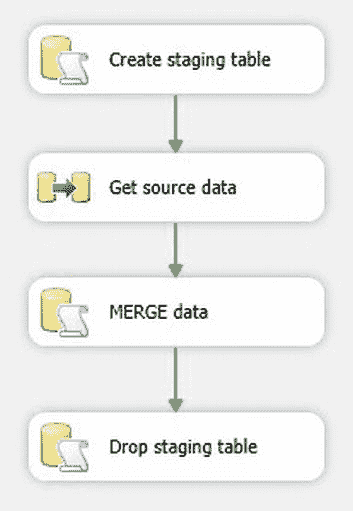

图 11-8. 基于 SSIS 的 MERGE 控制流

#### 提示、技巧与陷阱

-   您可以使用会话范围内的临时表代替磁盘上的表。这将需要您为表名和选择语句使用变量（并最初在目标数据库中使用持久化表），同时按照方法 11-4 所述，将目标连接管理器设置为保持相同的连接。
-   对于任何大小的暂存表，建议您在其主键或唯一键（或在 `USING...ON` 子句中使用的任何列）上为暂存表创建索引（聚集或非聚集）。为了使 `MERGE` 高效运行，您必须为 `MERGE` 语句的联接 (`ON`) 子句中使用的目标表列添加聚集索引。
-   暂存表可以位于目标服务器上的另一个（暂存）数据库中，并且在任何情况下，将其放在与最终目标表不同的磁盘阵列上都会带来好处。
-   使用 `MERGE` 而非本章第一个方法中概述的 SSIS 方法来更新大型数据集的速度之快，可能会让您惊喜不已。然而，不可避免的是，流程的速度取决于您所工作的环境。
-   与方法 11-1 一样，这种方法的缺点在于所有源数据都必须通过网络传输。因此，它可能不适合大型数据集。

# 11-4. 仅检测和加载增量数据

## 问题

您希望在将更改应用到目标表之前，在源端隔离出已更改的数据，并避免通过网络传输未修改的数据。

## 解决方案

将所有记录的哈希码从目标服务器发送回源服务器。使用它来检测更改，并仅将更改的记录返回到目标服务器。以下解释了如何执行此操作。

1.  创建四个 ETL 元数据表，用于临时保存增量数据信息。对于**源**数据库中的更新，使用以下 DDL：
```
CREATE TABLE CarSales.dbo.TMP_Updates (ID INT);
```
2.  对于**源**数据库中的插入操作，使用以下 DDL：
```
CREATE TABLE CarSales.dbo.TMP_Inserts (ID INT);
```
3.  对于**目标**数据库中的更新数据，使用以下 DDL（如果您已为其他方法创建了此表，请先将其删除）。代码位于 (`C:\SQL2012DIRecipes\CH11\tbl11-4_Invoice_Lines_Updates.Sql`)：
```
CREATE TABLE CarSales_Staging.dbo.Invoice_Lines_Updates
(
 ID INT  NOT NULL,
 InvoiceID INT  NULL,
 StockID INT  NULL,
 SalePrice NUMERIC(18, 2) NULL,
 DateUpdated DATETIME,
 LineItem SMALLINT,
 VersionStamp VARBINARY(8) NULL,
 HashData VARBINARY(256) NULL
) ;
GO
```
4.  对于**目标**数据库中的删除操作，使用以下 DDL：
```
CREATE TABLE CarSales_Staging.dbo.TMP_Deletes (ID INT);
GO
```
5.  作为本方法的示例目标表，创建以下表。代码位于 (`C:\SQL2012DIRecipes\CH11\tbl11-4_Invoice_Lines.Sql`)：
```
CREATE TABLE CarSales_Staging.dbo.Invoice_Lines
(
 ID INT  NOT NULL,
 InvoiceID INT  NULL,
 StockID INT  NULL,
 SalePrice NUMERIC(18, 2) NULL,
 DateUpdated DATETIME,
 LineItem SMALLINT,
 VersionStamp VARBINARY(8) NULL,
 HashData VARBINARY(256) NULL
) ;
GO
```
6.  添加三个包作用域变量。对数据库表的引用稍后将替换为对临时表的引用。目前按如下方式配置这些变量：
    - 名称：`DeleteTable`
    - 数据类型：`String`
    - 值：`Tmp_Deletes`
    - 名称：`UpdateTable`
    - 数据类型：`String`
    - 值：`Tmp_Updates`
    - 名称：`InsertTable`
    - 数据类型：`String`
    - 值：`Tmp_Inserts`
7.  创建一个新的 SSIS 包，并添加创建两个 OLEDB 连接管理器：一个为源服务器 (`CarSales`) 正确配置，一个为目标服务器 (`CarSales_Staging`) 正确配置，分别命名为 **CarSales_OLEDB** 和 **CarSales_Staging_OLEDB**。将源和目标连接管理器的 `RetainSameConnection` 属性都设置为 `True`。
8.  向控制流窗格添加一个新的“执行 SQL 任务”。将其命名为 **在源上创建临时表**。此任务创建会话范围内的临时表，这些表将保存来自源数据集的所有要插入和更新记录的 ID（在生产环境中，如果不是在开发中）。配置如下：
    - 名称：`Create Temp tables`
    - 连接：`CarSales_OLEDB`
    - SQL 语句：
```
CREATE TABLE ##TMP_INSERTS (ID INT);
CREATE TABLE ##TMP_UPDATES (ID INT);
```
9.  点击“确定”确认，返回数据流窗格。
10. 向控制流窗格添加一个新的“执行 SQL 任务”。将上一个“执行 SQL 任务”连接到它。将其命名为 **在目标上创建临时表**。此任务创建会话范围内的临时表，该表将保存源数据中的所有 ID（将用于隔离要删除的记录）。


## 配置流程

配置如下：
| 名称 | 创建临时表 |
| :--- | :--- |
| 连接 | CarSales_Staging_OLEDB |
| SQL 语句 | `CREATE TABLE ##TMP_DELETES (ID INT);` |

11. 确认并点击“确定”以返回到数据流页面。
12. 在控制流页面添加一个数据流任务。将其命名为 `Delta Detection`。将“在源上创建临时表”执行 SQL 任务连接到它。双击进入数据流页面。
13. 添加一个 OLE DB 源适配器。配置它使用 SQL 命令从源表 (`Invoice_Lines`) 中选择 ID 和用于增量检测的行，如下所示：

    | 名称 | 创建临时表 |
    | :--- | :--- |
    | 连接 | CarSales_OLEDB |
    | SQL 语句 | `SELECT ID, HashData AS HashData_Source` |
    | | `FROM dbo.Invoice_Lines WITH (NOLOCK)` |

14. 在数据流页面添加一个“多播”转换。将数据源适配器连接到它。
15. 添加一个“查找”转换，并将“多播”转换连接到它。将其命名为 `Detect Hash Deltas`。在查找转换的“常规”选项卡上，按如下配置：

    | 缓存模式 | 无缓存 |
    | :--- | :--- |
    | 连接类型 | OLE DB 连接管理器 |
    | 指定如何处理具有“无匹配项”的行 | 将没有匹配项的行发送到“无匹配输出” |

16. 点击左侧的“连接”。将连接管理器设置为 `CarSales_Staging_OLEDB`，因为您将使用此查找转换将源数据与您正在查找的目标数据进行比较。
17. 将查找设置为“使用 SQL 查询的结果”，并输入以下 SQL：

    ```sql
    SELECT ID, HashData
    FROM dbo.Invoice_Lines WITH (NOLOCK)
    ```

18. 点击左侧的“列”。两个表，源（左侧）和目标（右侧）将出现。将“可用查找列”（或目标）表（右侧）中的 `ID` 列拖动到“可用输入列”（源）表（左侧）中的 `ID` 列。这将两个数据源的唯一 ID 相互映射。
19. 选择右侧“可用查找列”（或目标）表中的 `HashData` 列，并提供一个输出别名——我建议使用 `HashData_Destination`。这允许您为每条记录比较源和目标的哈希值。
20. 点击“确定”确认您的修改。返回到数据流页面。
21. 在数据流页面添加一个 OLE DB 目标适配器，并将其 `ValidateExternalMetadata` 属性设置为 `False`。将查找转换连接到此目标，确保选择查找的“无匹配输出”。配置如下：

    | OLE DB 连接管理器 | CarSales_OLEDB |
    | :--- | :--- |
    | 数据访问模式 | 表名或视图名变量 |
    | 变量名 | InsertTable |

22. 点击“映射”并确保 `ID` 列已连接。点击“确定”确认您的修改。您将创建一个包含数据源中所有新 ID 的临时表，稍后将使用它仅传输这些记录（插入）到目标服务器。
23. 在数据流页面添加一个 OLE DB 目标适配器。将“多播”转换连接到它。将其命名为 `Records to Delete`，并将其 `ValidateExternalMetadata` 属性设置为 `False`。双击进行编辑。
24. 将连接管理器设置为 `CarSales_Staging_OLEDB`，数据访问模式设置为“表名或视图名变量”。选择 `DeleteTable` 作为表变量名。
25. 点击“映射”。确保 `ID` 列已连接。然后点击“确定”确认。这样，您就创建了一个临时表，其中包含源数据集中的所有 ID，可以与目标数据集中的当前 ID 进行比较，以推断出已删除的记录。
26. 现在，是时候进入流程的“更新”部分了。在数据流页面添加一个“条件性拆分”转换。将其命名为 `Detect Hash Deltas`。将查找转换连接到它。“查找匹配输出”应自动应用。这会将查找匹配输出发送到条件性拆分。
27. 双击编辑条件性拆分。添加一个名为 `HashData Differences` 的输出条件，其条件是：

    ```sql
    (DT_UI8) HashData_Source != (DT_UI8) HashData_Destination
    ```

28. 点击“确定”确认。关闭对话框。
29. 向数据流添加一个 OLE DB 目标适配器，并将条件性拆分转换连接到它。将出现“输入输出”对话框，您应在其中选择“HashData Differences”输出（这实际上是目标适配器的源）。设置如下：

    | OLE DB 连接管理器 | CarSales_OLEDB |
    | :--- | :--- |
    | 数据访问模式 | 表名或视图名变量 |
    | 变量名 | UpdateTable |

30. 点击“映射”并确保 `ID` 列已正确映射，然后点击“确定”确认您的修改。这将把所有具有不同哈希值的 ID 的子集发送到作用域为会话的临时表。数据流页面应如 图 11-9 所示。

    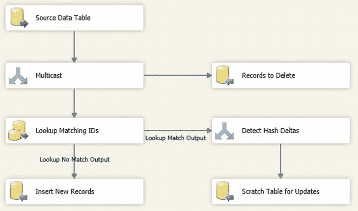

    图 11-9. 基于哈希的增量检测数据流

31. 点击“控制流”选项卡返回到控制流页面。
32. 现在我们可以进入流程的第二部分——使用已标识为插入、删除和更新的 ID 来执行数据修改，（对于插入和更新）仅获取所需的记录。让我们从删除开始。点击“控制流”选项卡并添加一个“执行 SQL 任务”。将其命名为 `Delete Data`。将其连接到 `Delta Detection` 数据流任务。配置执行 SQL 任务如下（`C:\SQL2012DIRecipes\CH11\11-4_DeleteData.Sql`）：

    | 连接 | CarSales_Staging_OLEDB |
    | :--- | :--- |
    | SQL 语句 | `DELETE FROM dbo.Invoice_Lines` |
    | | `WHERE ID IN (` |
    | | `SELECT DST.ID` |
    | | `FROM dbo.Invoice_Lines DST` |
    | | `LEFT OUTER JOIN ##TMP_Deletes TMP` |
    | | `ON TMP.ID = DST.ID` |
    | | `WHERE TMP.ID IS NULL` |
    | | `)` |

33. 现在处理插入。在控制流页面添加一个数据流任务。将上一个任务 (`DeleteData`) 连接到它。将任务命名为 `Insert Data`。将其 `DelayValidation` 属性设置为 `True`。
34. 添加一个新的包作用域变量 `InsertSQL`。这必须是一个包含与源数据关联的 `SELECT` 语句的字符串，并连接到 `TMP_Inserts` 临时表。在此示例中，将使用以下值；一旦全部工作正常，将进行调整以使用临时表（`C:\SQL2012DIRecipes\CH11\11-4_InsertSQL.Sql`）：

    ```sql
    SELECT SRC.ID, SRC.InvoiceID, SRC.StockID, SRC.SalePrice, SRC.HashData
    FROM dbo.Invoice_Lines SRC
    INNER JOIN TMP_Inserts TMP
    ON SRC.ID = TMP.ID
    ```

35. 编辑“Insert Data”数据流任务。
36. 向数据流页面添加一个 OLE DB 源。将其重命名为 `CarSales_OLEDB`，并按如下配置：

    | OLE DB 连接管理器 | CarSales_OLEDB |
    | :--- | :--- |
    | 数据访问模式 | 来自变量的 SQL 命令 |
    | 变量名 | InsertSQL |

37. 向数据流页面添加一个 OLE DB 目标连接器。将源连接到它。配置如下：

    | OLE DB 连接管理器 | CarSales_Staging_OLEDB |
    | :--- | :--- |
    | 数据访问模式 | 表或视图 - 快速加载 |
    | 表或视图的名称 | dbo.Invoice_Lines |

38. 点击“列”并确保所有必需的列都被选中，然后点击“确定”确认您的更改。这会第二次访问源服务器，并添加目标数据集中尚不存在的新记录。
39. 返回到控制流页面。
40. 最后，我们处理更新。


首先，添加两个包作用域的字符串变量，如下所示 (`C:\SQL2012DIRecipes\CH11\11-4_UpdateDataTable.Sql`):

| 名称： | `UpdateDataTable` |
| 值： | `Invoice_Lines_Updates` |
| 名称： | `UpdateSQL` |
| 值： | `SELECT     SRC.ID, SRC.InvoiceID,` |
| `SRC.StockID, SRC.SalePrice,` |
| `SRC.LineItem, SRC.DateUpdated` |
| `SRC.HashData` |
| `FROM       dbo.Invoice_Lines SRC` |
| `INNER JOIN TMP_Updates TMP` |
| `ON SRC.ID` = `TMP.ID` |

41.  `UpdateSQL` 变量仅从源服务器中选择需要更新的记录。`UpdateDataTable` 指的是包含所有需要更新记录的数据临时表。`UpdateCode` 在目标服务器上执行更新操作。将其命名为 **更新数据**。将之前的数据流任务（插入数据）连接到它。将其 `DelayValidation` 属性设置为 True。

42.  双击进行编辑。在数据流窗格中添加一个 OLEDB 源。将其重命名为 `CarSales_OLEDB`。将其 `ValidateExternalMetadata` 属性设置为 False。按如下配置：

| OLEDB 连接管理器： | `CarSales_OLEDB` |
| 数据访问模式： | 来自变量的 SQL 命令 |
| 变量名称： | `UpdateSQL` |

43.  在数据流窗格中添加一个 OLEDB 目标连接器。将源连接到它。按如下配置：

| OLEDB 连接管理器： | `CarSales_Staging_OLEDB` |
| 数据访问模式： | 来自变量的 SQL 命令 |
| 变量名称： | `UpdateDataTable` |

44.  单击“映射”并确保所有必需的列都已映射，然后单击“确定”以确认更改。这将再次访问源服务器，并将目标数据集中尚不存在的任何新记录添加到 `Invoice_Lines_Updates` 暂存表中，该表最终也将很快成为临时表。

45.  返回数据流窗格。添加一个执行 SQL 任务，并将其重命名为 **执行更新**。将“更新数据”数据流任务连接到它。将其 `DelayValidation` 属性设置为 True。

46.  编辑 **执行更新** 执行 SQL 任务并设置以下内容 (`C:\SQL2012DIRecipes\CH11\11-4_CarryOutUpdates.Sql`):

| 连接： | `CarSales_Staging_OLEDB` |
| SQL 语句： | `UPDATE        DST` |
| `SET           DST.InvoiceID` = `UPD.InvoiceID` |
| `,DST.SalePrice` = `UPD.SalePrice` |
| `,DST.LineItem` = `UPD.LineItem` |
| `,DST.UpdateDate` = `SRC.UpdateDate` |
| `,DST.StockID` = `UPD.StockID` |
| `,DST.HashData` = `UPD.HashData` |
| `FROM          dbo.Invoice_Lines DST` |
| `INNER JOIN   ##Invoice_Lines_Updates UPD` |
| `ON DST.ID` = `UPD.ID` |

控制流窗格应类似于 图 11-10。

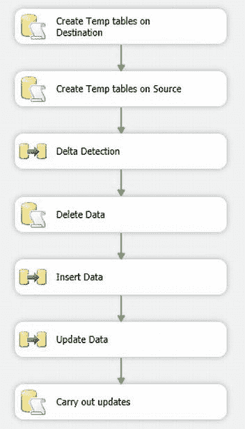

图 11-10.  检测并仅加载增量数据的过程流

至此，终于完成了。你拥有了一个 SSIS 包，它可以检测数据差异，并仅返回任何新记录或需要更新记录的完整数据。一旦该流程调试成功并正常运行，你就可以修改变量值以使用临时表，如下所示 (`C:\SQL2012DIRecipes\CH11\11-4_VariablesForTempTables.Sql`):

| `DeleteTable`: | `TempDB..##TMP_Deletes` |
| `UpdateTable`: | `TempDB..##TMP_Updates` |
| `InsertTable`: | `TempDB..##TMP_Inserts` |
| `UpdateDataTable`: | `TempDB..##Invoice_Lines_Updates` |
| `InsertSQL`: | `SELECT          SRC.ID, SRC.InvoiceID,` |
| `SRC.StockID, SRC.SalePrice,SRC.HashData` |
| `FROM            dbo.Invoice_Lines SRC` |
| `INNER JOIN   TempDB..##TMP_Inserts TMP` |
| `ON SRC.ID`= `TMP.ID` |
| `UpdateSQL`: | `SELECT          SRC.ID, SRC.InvoiceID, SRC.StockID,` |
| `SRC.SalePrice, SRC.HashData` |
| `FROM            dbo.Invoice_Lines SRC` |
| `INNER JOIN   TempDB..##TMP_Updates TMP` |
| `ON SRC.ID` = `TMP.ID` |

最后，你可以删除源数据库中的暂存表 `TMP_Updates` 和 `TMP_Inserts`，以及目标数据库中的 `TMP_Deletes` 和 `Invoice_Lines_Updates`。该流程现在将使用临时表而非持久化表。

工作原理

方案 11-1 和 11-3 的缺点是每次流程运行时都需要从源服务器传输整个数据集。对此方法的一个改进可能是检测任何不同的记录，并且只传输已更改的记录，这正是本方案所实现的。

那么，假设你在源服务器上的权限极其有限，这该如何实现呢？

解决方案是使用一个两阶段流程：

*   首先，仅将键列和增量标志列取回目标服务器。
*   然后，检测增量（插入、更新和删除），并仅从源服务器请求每种类型的相应记录。

在此示例中，我使用哈希码来检测增量——因此假定你的源数据在每次插入和更新时都生成了哈希码。这种方法同样适用于 `TIMESTAMP` 或 `ROWVERSION` 列或日期字段。

值得注意的是，这种方法仅在你拥有增量检测列时才有效；如果你需要在源和目标数据集中比较多个列，可能就不太有用，因为你几乎不可避免地最终会将大部分数据从源服务器取回两次。在我的测试中，对于宽表，使用这种方法可以显著提升速度；但对于非常窄的表，可能反而更慢。在一个包含 15 种混合数据类型的表中（其中一些是中等长度的 `VARCHAR` 字符串），数据差异为 2%，我获得了 10% 的处理时间缩减。在一个包含 150 列、其中数十列非常宽、数据差异同样为 2% 的表中，该流程运行速度提高了近四倍。当然，你的结果取决于你的源数据、网络和目标服务器配置。

图 11-11 或许能更清晰地以图示方式展示该流程。

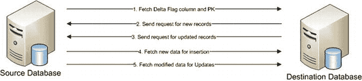

图 11-11.  检测源数据修改的过程流

在技术层面，此技术将使用会话范围的临时表来保存将被更新和删除的记录的增量 ID。为了在实践中实现这一点，你需要将临时表创建位置（源或目标）的连接属性 `RetainSameConnection` 设置为 True。这确保在 SSIS 包运行期间始终使用同一连接，因此，所使用的任何会话范围临时表对所有需要使用它们的步骤都是可用的。然后你必须确保创建的任何临时表都必须是会话范围的——即它们的名称以双井号 (`##`) 开头。

此方案的方法最适合在以下情况下使用：

*   当你导入具有可靠增量检测列的宽表时。
*   当修改的数据仅占总量的一小部分时。
*   当你不想将目标数据库中用于临时数据集的表持久化到磁盘时。

请注意，在创建包之前需要搭建一点“脚手架”，之后你需要将其移除。这个说法可能需要解释一下，所以如下。为了在 SSIS 中轻松使用会话范围的临时表，首先在源和开发环境中创建用于设置包的常规表会大有帮助——这几乎与方案 11-1 中的做法相同。在创建包时，你将使用 SSIS 变量来引用源和目标数据库中的暂存表。


当一切正常工作时，修改 `SSIS` 变量以指向会话范围内的临时表，并在各自的数据库中删除对应的表。我称这些表为“临时表”。

四个 `ETL` 元数据表的使用方式如表 11-2 所述。

表 11-2. 本配方中使用的 `ETL` 元数据表

| ETL 元数据表 | 描述 |
| --- | --- |
| 源数据库表，用于存放新记录的 ID。 | 一旦在目标数据库上检测到差异，其 `ID` 会被发送回源数据库，以便可以将对应的记录发送到目标数据库进行插入。 |
| 源数据库表，用于存放已更新记录的 ID。 | 一旦在目标数据库上检测到数据变更，其 `ID` 会被发送回源数据库，以便可以将对应的记录发送到目标数据库进行插入。 |
| 目标数据库表，用于存放修改后的数据。 | 目标数据库上已更新记录的 `ID`。 |
| 目标数据库表，用于存放已删除记录的 ID。 | 目标数据库上已删除记录的 `ID`。 |

在本配方中，配方 11-1 中使用的 `VERSIONSTAMP` 列被一个名为 `HashData` 的 `VARCHAR` 列所取代，该列保存用于差异检测的哈希计算结果。

#### 提示、技巧与陷阱

*   由于你使用的是会话范围的临时表，数据可能会溢出内存并进入 `TempDB`；因此，确保你的 `TempDB` 配置正确（针对处理器数量配置正确数量的文件等；详见联机丛书 (`BOL`)）是非常值得的。
*   至于*脚手架*（用于存放差异数据的永久表），你可以使用物化的数据库表进行测试，直到你满意一切工作正常，然后才在第一阶段测试结束时替换对临时表的变量引用。
*   有两个主要的调整需要记住：
    *   对于所有使用临时表的 `OLEDB` 源和目标连接器，`ValidateExternalMetadata` 必须设置为 `False`。
    *   对于所有使用临时表的 `Data Flow` 任务，`DelayValidation` 必须设置为 `True`。

# 11-5. 与其他 SQL 数据库执行差异数据更新

## 问题

你正在使用另一个 `SQL` 数据库作为数据源，并且希望只将修改过的或新记录传输到目标，同时传输已删除记录的 `ID`。

## 解决方案

使用一个差异检测列并像前面的配方那样使用临时表。以下步骤详述了针对 `Oracle` 数据源的一种简化方法。

1.  使用以下 `DDL` 创建一个 `Oracle` 全局临时表（`C:\SQL2012DIRecipes\CH11\tblOracleDelta.Sql`）：

    ```
    create global temporary table SCOTT.DELTA_DATA
    (
    "EMPNO" NUMBER(4,0)
    ) ;
    on commit preserve rows
    ```

2.  使用以下 `DDL` 创建一个目标 `SQL Server` 表（`C:\SQL2012DIRecipes\CH11\tblOracle_EMP.Sql`）：

    ```
    CREATE TABLE dbo.Oracle_EMP
    (
     EMPNO NUMERIC(4, 0) NULL,
     LASTUPDATED datetime NULL,
     ENAME VARCHAR(10) NULL,
     JOB VARCHAR(9) NULL,
     MGR NUMERIC(4, 0) NULL,
     HIREDATE datetime NULL,
     SAL NUMERIC(7, 2) NULL,
     COMM NUMERIC(7, 2) NULL,
     DEPTNO NUMERIC(2, 0) NULL
    ) ;
    ```

3.  创建一个新的 `SSIS` 包并添加两个 `OLEDB` 连接管理器：一个（命名为 `CarSales_Staging_OLEDB`）用于你的目标 `SQL Server` 数据库 (`CarSales_Staging`)，另一个（命名为 `Source_Oracle_OLEDB`）使用 `Oracle Provider for OLEDB` 连接到你的 `Oracle` 实例。将两者的 `RetainSameConnection` 属性设置为 `True`。
4.  添加一个 `Data Flow` 任务。将其命名为 `Isolate new IDs for Insert`。双击进行编辑。
5.  添加一个 `OLEDB` 数据源。将其命名为 `Oracle Source`。编辑并配置如下：
    *   `OLEDB` 连接管理器：`Source_Oracle_OLEDB`
    *   数据访问模式：`SQL Command`
    *   `SQL` 命令：`SELECT EMPNO FROM SCOTT.EMP`
6.  点击 `OK` 确认。
7.  添加一个 `Lookup` 转换，配置为从目标表 `Oracle_EMP` 中选择 `EMPNO`。在 `EMPNO` 列上进行连接。将不匹配的行重定向到 `NoMatch` 输出，然后点击 `OK`。
8.  添加一个 `OLEDB` 目标。将其命名为 `Oracle Delta` 并配置如下：
    *   `OLEDB` 连接管理器：`Source_Oracle_OLEDB`
    *   数据访问模式：`Table or View`
    *   表或视图名称：`Scott.DELTA_DATA`

你的 `Data Flow` 面板应如图 11-12 所示。

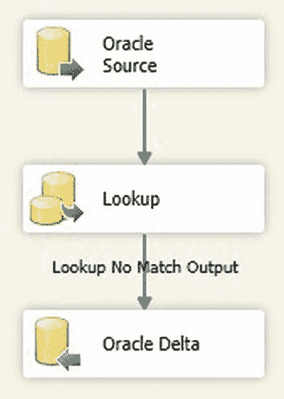

图 11-12. Oracle 差异数据处理

9.  返回到 `Control Flow` 面板并添加一个新的 `Data Flow` 任务。将其命名为 `Insert new records`。双击进行编辑。
10. 添加一个 `OLEDB` 源。将其命名为 `Delta Records` 并配置如下（`C:\SQL2012DIRecipes\CH11\11-5_DeltaRecords.Sql`）：
    *   `OLEDB` 连接管理器：`Source_Oracle_OLEDB`
    *   数据访问模式：`SQL Command`
    *   `SQL` 命令文本：`SELECT DISTINCT S.EMPNO, S.ENAME, S.JOB, S.MGR, S.HIREDATE, S.SAL, S.COMM, S.DEPTNO, S.LASTUPDATED FROM SCOTT.DELTA_DATA D, SCOTT.EMP S WHERE D.EMPNO = S.EMPNO`
11. 点击 `OK` 确认。
12. 添加一个 `OLEDB` 目标。将其命名为 `Delta Output`。将 `Delta Records` `OLEDB` 源连接到它。映射所有列并点击 `OK`。返回到 `Control Flow` 面板。
13. 添加一个 `Execute SQL` 任务并将其命名为 `Delete temp table`。将 `Insert new records` `Data Flow` 任务连接到它，并配置如下：
    *   连接：`Source_Oracle_OLEDB`
    *   `SQL` 语句：`DELETE FROM SCOTT.DELTA_DATA`
14. 点击 `OK` 确认。`Control Flow` 面板应如图 11-13 所示。

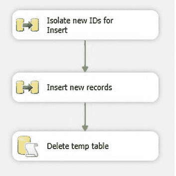

图 11-13. `Oracle` `SQL` 为基础的差异数据处理

## 工作原理

当前大多数商业和开源 `SQL` 数据库都以某种方式使用临时表。由于在此上下文中展示所有数据库如何使用是不切实际的，我简要概述了如何在 `Oracle` 中以这种方式使用，因为这是 `SQL Server` `DBA` 和开发人员经常会遇到的产品。如果你使用的是其他 `RDBMS`，我只能希望接下来描述的技术能作为一个有用的起点。请记住，如果其他方法都失败了，如果你能说服源系统 `DBA` 允许，你总是可以使用“普通”的持久化表。

由于这本质上与配方 11-4 描述的过程类似，我只给出了一个简要概述，并提醒你注意任何相关的差异。具体来说，我只看了数据插入部分，并让你基于此方法推断如何执行删除和更新。

当你希望从 `Oracle` 数据源获取差异数据，并且已说服 `Oracle` `DBA` 创建一个全局临时表并授予你用于提取数据的帐户访问该表的权限时，此技术最合适。此外，在服务器上安装和配置相关的 `Oracle` 客户端软件也是根本性的。

#### 提示、技巧与陷阱

*   同样，将 `Oracle` `OLEDB` 连接管理器的 `RetainSameConnection` 属性设置为 `True` 至关重要。
*   在 `Oracle` 源数据库中创建临时表时使用 `on commit preserve rows` 同样是根本性的——没有这个，该过程将无法工作。


#### 11-6. 在不写入源服务器的情况下处理数据变更

请注意，Oracle 临时表与 SQL Server 临时表不同——它在磁盘上物理存在。但是，只有在 SSIS 会话期间连接的用户才能使用他们插入到该表中的数据。这样做的缺点是，之后必须删除数据，否则数据将保留在表中，并在下次运行此过程时导致错误。

### 问题

你想从源数据库中仅传输已更改的记录，但你不被允许在源服务器上创建 ETL 元数据表。

### 解决方案

隔离出新增或已更改记录的 ID，并将其作为 `SELECT` 查询的一部分返回给源数据库。如果你的数据增量非常小，以下步骤说明了如何完成此操作。

1.  在目标数据库 (`CarSales_Staging`) 上创建一个表类型来保存 ID：
    ```sql
    CREATE TYPE DeltaIDs AS TABLE (ID INT);
    GO
    ```
2.  同样在目标数据库 (`CarSales_Staging`) 上，创建一个存储过程，用于返回与通过表值参数传入的 ID 集相对应的数据 (`C:\SQL2012DIRecipes\CH11\pr_SelectDeltaData.Sql`)：
    ```sql
    CREATE PROCEDURE CarSales_Staging.dbo.pr_SelectDeltaData
    (
    @DeltaSet DeltaIDs READONLY
    )
    AS
    SELECT
        S.ID
        ,S.InvoiceID
        ,S.StockID
        ,S.SalePrice
        ,CAST(S.HashData AS VARCHAR(50)) AS HashData
    FROM
        dbo.Invoice_Lines S
    INNER JOIN
        @DeltaSet D
    ON S.ID = D.ID;
    GO
    ```
3.  使用以下 DDL 创建 `Invoice_Lines` 目标表（如果存在旧版本，请记得先删除）。DDL 位于 `C:\SQL2012DIRecipes\CH11\tbl11-5_Invoice_Lines.Sql`：
    ```sql
    CREATE TABLE dbo.Invoice_Lines
    (
        ID INT NOT NULL,
        InvoiceID INT NULL,
        StockID INT NULL,
        SalePrice NUMERIC(18, 2) NULL,
        HashData VARCHAR(50) NULL
    );
    GO
    ```
4.  创建一个新的 SSIS 包，并添加两个 OLEDB 连接管理器，分别命名为 `CarSales_OLEDB` 和 `CarSales_Staging_OLEDB`，将其配置为分别连接到源服务器和目标服务器。然后添加一个 ADO.NET 连接管理器，命名为 `CarSales_ADONET`，将其配置为连接到源服务器。最后一个连接管理器将用于传回包含所需 ID 的表值参数 (TVP)，然后调用存储过程以返回增量数据。
5.  添加一个新的包作用域变量，命名为 `InsertDeltas`，其类型必须是 `object`。
6.  添加一个新的数据流任务，命名为 `Get Source delta information`。双击进行编辑。
7.  添加一个 OLEDB 源适配器，命名为 `Source delta`。将其配置为使用 `CarSales_OLEDB` 连接管理器。使用 SQL 命令从源表 (`Invoice_Lines`) 中选择 ID 和增量检测行，代码如下：
    ```sql
    SELECT ID, Hashdata
    FROM dbo.Invoice_Lines
    ```
8.  添加一个查找转换，如配方 11-1 的步骤 6 至 11 所述。但在这里，你使用 `Hashdata` 列，而不是“可用查找列”中的 `VersionStamp` 列。将查找转换中的目标列命名为 `HashData_Destination`。
9.  向数据流窗格添加一个记录集目标。将查找转换连接到它，并确保选择“无匹配输出”。双击进行编辑。选择 `InsertDeltas` 作为变量名（用于保存输出）。对话框应如 图 11-14 所示。
    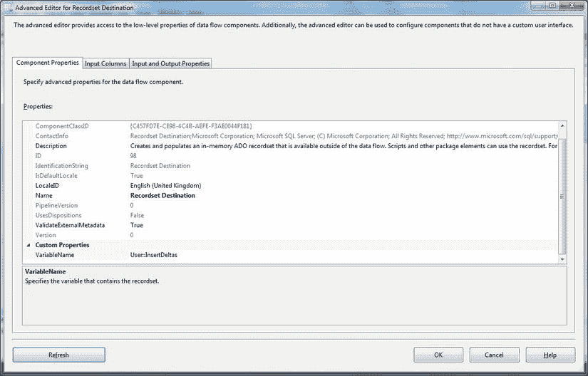
    图 11-14. 记录集目标配置。
10. 单击“输入列”并选择 `ID` 列。这将仅传递新的（不匹配的）ID 到记录集变量中。单击“确定”返回到控制流选项卡。
11. 添加一个新的数据流任务，并将其连接到前面的“获取源增量信息”数据流任务。将其命名为 `Inserts`。双击进行编辑。
12. 向数据流窗格添加一个脚本组件，命名为 `Source Data`。选择 `Source` 作为脚本组件类型。双击进行编辑。将只读变量设置为 `InsertDeltas`，脚本语言设置为 `Microsoft Visual Basic 2010`。
13. 单击“输入和输出”。展开 `Output 0` 并将其重命名为 `MainOutput`。然后添加五列，如下所示：
    | 列名 | 数据类型 |
    | :--- | :--- |
    | ID | 4 字节有符号整数 |
    | InvoiceID | 4 字节有符号整数 |
    | StockID | 4 字节有符号整数 |
    | SalePrice | Decimal， 小数位数 2 |
    | HashData | String， 长度 50 |
14. 单击左侧的“连接管理器”。单击“添加”。将新连接管理器命名为 `DataBaseConnection`。选择 ADO.NET 连接管理器 `CarSales_ADONET`。
15. 单击左侧的“脚本”，然后单击“编辑脚本”。
16. 在 Imports 区域添加以下内容：
    ```vbnet
    Imports System.Data.SqlClient
    ```
17. 将 `ScriptMain` 类替换为以下代码 (`C:\SQL2012DIRecipes\CH11\TVPDeltas.vb`)：
    ```vbnet
    Public Class ScriptMain
        Inherits UserComponent

        Dim connMgr As IDTSConnectionManager100
        Dim sqlConn As SqlConnection

        Public Overrides Sub AcquireConnections(ByVal Transaction As Object)
            connMgr = Me.Connections.DataBaseConnection
            sqlConn = CType(connMgr.AcquireConnection(Nothing), SqlConnection)
        End Sub

        Public Overrides Sub PostExecute()
            MyBase.PostExecute()
        End Sub

        Public Overrides Sub CreateNewOutputRows()
            Dim DA As New OleDb.OleDbDataAdapter
            Dim TBL As New DataTable
            Dim Row As DataRow = Nothing

            DA.Fill(TBL, Me.Variables.InsertDeltas)

            Dim cmd As New SqlClient.SqlCommand("dbo.pr_SelectDeltaData", sqlConn)
            cmd.CommandType = CommandType.StoredProcedure
            Dim DeltaPrm As SqlClient.SqlParameter = cmd.Parameters.Add("@DeltaSet", SqlDbType.Structured)
            DeltaPrm.Value = TBL
            Dim RDR As SqlClient.SqlDataReader = cmd.ExecuteReader()
            If RDR.HasRows = True Then
                Do While RDR.Read()
                    With MainOutputBuffer
                        .AddRow()
                        ' 映射数据
                        .ID = RDR.GetSqlInt32(0)
                        .InvoiceID = RDR.GetSqlInt32(1)
                        .StockID = RDR.GetSqlInt32(2)
                        .SalePrice = RDR.GetDecimal(3)
                        If Not RDR.GetSqlString(4).IsNull Then
                            .HashData = RDR.GetSqlString(4)
                        End If
                    End With
                Loop
            End If
        End Sub
    End Class
    ```
18. 单击“确定”进行确认。
19. 向数据流窗格添加一个 OLEDB 目标组件。命名为 `Inserts`。将脚本源组件连接到它。按照之前配方中的描述，将其配置为连接到目标表。单击“列”并确保所有需要的列都被选中。单击“确定”确认你的更改。这会进行第二次对源服务器的访问，并将任何尚未存在于目标中的新记录添加进去。最终的包将如 图 11-15 所示。
    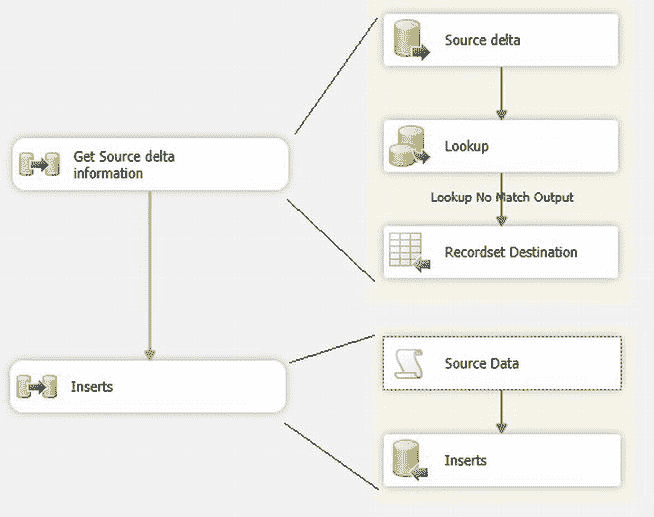
    图 11-15. 用于查询增量数据的完整包。

### 工作原理

有时候，无法在源数据库上使用会话范围的临时表。


在大多数情况下，这是因为负责源数据库的数据库管理员（DBA）不会授予 SSIS 所使用账户所需的权限，和/或因为这给源服务器带来的额外负载被认为是不可接受的。还有一个被证明有用的解决方案，即隔离新建或更改记录的 ID，并将其作为 `SELECT` 查询的一部分返回给源数据库。尽管如此，你必须说服源系统的 DBA 在源系统中添加一个用户定义表类型和一个或多个存储过程。

然而，需要谨慎提醒。此方法设计用于处理**极小**的增量。它绝对无法扩展到大型数据集，并可能在目标服务器上造成极端的**内存压力**。此外，此技术仅在 SQL Server 2008 及以上版本中有效，因为用户定义表类型自该版本起才可用。

由于本配方展示的两种技术是前两个配方中所述方法的扩展，因此我并未解释整个过程，而只解释了允许你选择插入增量数据的那部分。其余过程与之前描述的几乎相同，故此处不再重复。在这些示例中，我使用哈希来隔离增量；当然，你也可以选择使用 `ROWVERSION` 或日期字段。

本配方执行以下操作：
*   检测增量数据。然而，与之前的配方不同，需要 `INSERT` 或 `UPDATE` 的 ID 将使用记录集目标组件存储在 SSIS 对象变量中。
*   通过将 SSIS 记录集作为表值参数传递给源数据库中的存储过程，将其返回至源服务器。

从更技术的角度来看，过程如下：首先，使用 SSIS 对象变量来填充 ADO.NET 数据表。然后，将此 ADO.NET 数据表作为表值参数传递回存储过程，该过程使用 TVP 提取数据子集。最后，将数据子集传递到脚本源输出缓冲区。这种方法的精妙之处在于，ADO.NET 数据表可以直接作为表值参数传递给 SQL Server 存储过程，无需额外处理、循环或其他工作。

#### 提示、技巧与陷阱
*   记住为所有可为空的列添加空值处理。
*   必须在 Imports 区域引用 `System.Data.SqlClient`，因为将用它来调用源数据库上的存储过程。

### 11-7. 在源数据库访问权限受限的情况下检测数据更改

#### 问题
当源数据库除了读取源表的权限外，未授予其他任何权限时，你需要检测增量数据。

#### 解决方案
在目标端检测增量标识符，然后将其作为数据提取 `SELECT` 子句的一部分传递回去。以下解释如何使用此方法。

1.  创建一个新的 SSIS 包。添加两个 OLEDB 连接管理器，分别命名为 `CarSales_Staging_OLEDB`（连接到 CarSales_Staging 数据库）和 `CarSales_OLEDB`（连接到 CarSales 数据库）。为 `CarSales_Staging_OLEDB` 连接管理器将 `RetainSameConnection` 属性设置为 `True`。
2.  添加以下变量：
    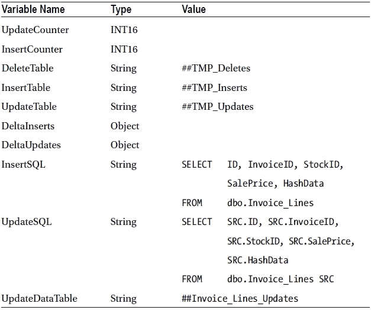
3.  添加一个执行 SQL 任务。将其命名为 `在目标端创建临时表`。将连接设置为 `CarSales_Staging_OLEDB`。将 SQL 语句设置为以下内容（`C:\SQL2012DIRecipes\CH11\CreateTempTablesOnDestination.Sql`）：
    ```
    IF OBJECT_ID('TempDB..##TMP_DELETES') IS NULL
    CREATE TABLE TempDB..##TMP_DELETES (ID INT);

    IF OBJECT_ID('TempDB..##Invoice_Lines_Updates') IS NULL
    CREATE TABLE ##Invoice_Lines_Updates
    (
        ID INT NOT NULL,
        InvoiceID INT NULL,
        StockID INT NULL,
        SalePrice NUMERIC(18, 2) NULL,
        VersionStamp VARBINARY(8) NULL,
        HashData VARCHAR(50) NULL
    );
    ```
4.  添加一个新的数据流任务，并将前一个任务（`在目标端创建临时表`）连接到它。将其配置为如 图 11-16 所示。有关如何执行此操作的详细信息，请参阅配方 11-1。
    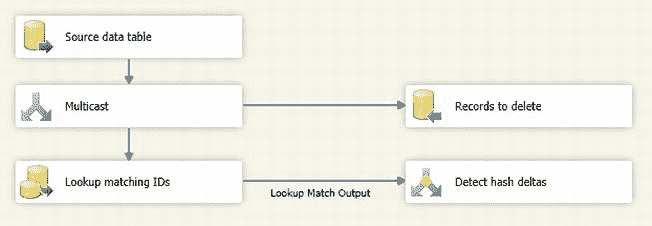
    图 11-16. 在目标数据库检测更改的数据流
5.  添加两个行计数转换。将一个连接到“查找匹配 ID”查找转换——使用 `NoMatch` 输出——并将其命名为 `插入计数`。配置它使用 `User::InsertCounter` 变量。将另一个连接到“检测哈希差异”条件性拆分转换，使用 `HashData Differences` 输出。配置它使用 `User::UpdateCounter` 变量。将其命名为 `更新计数`。
6.  向数据流添加一个记录集目标。连接行计数器 `更新计数`。双击进行编辑，并将变量名称设置为 `User::DeltaUpdates`。单击“输入列”选项卡并选择 `ID` 列。这将把 ID 导向 ADO 记录集。
7.  向数据流添加第二个记录集目标。连接行计数器 `插入计数`。双击进行编辑，并将变量名称设置为 `User::DeltaInserts`。单击“输入列”选项卡并选择 `ID` 列。这将把 ID 导向 ADO 记录集。增量检测数据流任务现在应如 图 11-17 所示。
    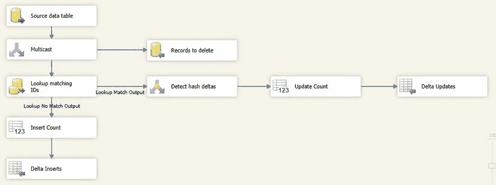
    图 11-17. 将更改返回至源数据库时的数据流
8.  数据流任务正在准备所有三个数据操作过程——插入、更新和删除——方法是隔离源数据中这三个操作所需的 ID。我们现在将看到它们是如何被使用的。
9.  添加一个执行 SQL 任务，将其命名为 `删除数据`，并将“增量检测”数据流任务连接到它。配置它使用 `CarSales_Staging_OLEDB` 配置管理器。将 `SQLStatement` 设置为以下内容：
    ```
    DELETE
    FROM     dbo.Invoice_Lines
    WHERE    ID IN (
                SELECT           DST.ID
                FROM             dbo.Invoice_Lines DST
                                 LEFT OUTER JOIN  ##TMP_Deletes TMP
                                 ON DST.ID = TMP.ID
                WHERE            TMP.ID IS NULL
               )
    ```
10. 将 `ByPassPrepare` 属性设置为 `True`。
11. 添加一个序列容器。将其命名为 `插入` 并将“删除数据”任务连接到它。在此容器内，添加一个脚本任务，将其命名为 `为插入设置 SELECT`。将只读变量设置为 `User::DeltaInserts`。将读写变量设置为 `User::InsertSQL`。
12. 单击“编辑脚本”按钮。
13. 添加以下 Imports 指令：
    ```
    Imports System.Data.OleDb
    Imports System.Text
    ```
14. 将 Main 方法替换为以下脚本（`C:\SQL2012DIRecipes\CH11\11-7_WhereClauseInserts.vb`）：
    ```
    Public Sub Main()
        Dim SB As New StringBuilder
        Dim DA As New OleDbDataAdapter
        Dim DT As New DataTable
        Dim RW As DataRow
        Dim sMsg As String = ""
        DA.Fill(DT, Dts.Variables("DeltaInserts").Value)
        For Each RW In DT.Rows
            SB.Append(RW(0).ToString & ",")
        Next
        Dts.Variables("InsertSQL").Value = Dts.Variables("InsertSQL").Value.ToString _
                                 & " WHERE ID IN (" & SB.ToString.TrimEnd(",") & ")"
        Dts.TaskResult = ScriptResults.Success
    End Sub
    ```
15. 关闭脚本并单击“确定”。
16. 添加一个数据流任务，将其命名为 `插入数据`，并将脚本任务连接到它。双击优先级约束并配置为如 图 11-18 所示。


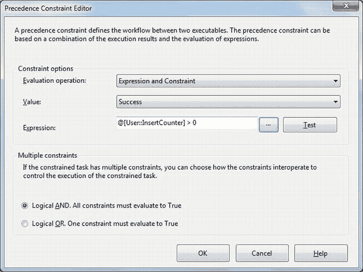

图 11-18. 优先级约束对话框

17. 编辑数据流任务。添加一个 OLEDB 源并按如下配置：

    | OLEDB 连接管理器: | CarSales_OLEDB |
    | 数据访问模式: | 来自变量的 SQL 命令 |
    | 变量名称: | InsertSQL |

18. 将 `ValidateExternalMetadata` 属性设置为 `False`。单击“列”并选择所有源列。
19. 添加一个 OLEDB 目标，配置其使用 `CarSales_Staging_OLEDB` 连接管理器，并将数据加载到 `dbo.Invoice_Lines` 表中。映射所有列。
20. 添加一个序列容器，命名为 `Updates`，并将 `Inserts` 序列容器连接到它。在此容器内，添加一个脚本任务，命名为 `Set SELECT for Updates`。将只读变量设置为 `User::DeltaUpdates`。将读写变量设置为 `User::UpdateSQL`。单击“编辑脚本”按钮。
21. 在 Imports 区域添加以下内容：

    ```vb
    Imports System.Data.OleDb
    Imports System.Text
    ```

22. 用以下代码替换 Main 过程 (`C:\SQL2012DIRecipes\CH11\11-7_WhereClauseDeletes.vb`)：

    ```vb
    Public Sub Main()
        Dim SB As New StringBuilder
        Dim DA As New OleDbDataAdapter
        Dim DT As New DataTable
        Dim RW As DataRow
        Dim sMsg As String = ""

        DA.Fill(DT, Dts.Variables("DeltaUpdates").Value)
        For Each RW In DT.Rows
            SB.Append(RW(0).ToString & ",")
        Next

        Dts.Variables("UpdateSQL").Value = Dts.Variables("UpdateSQL").Value.ToString &
                                           " WHERE ID IN (" & SB.ToString.TrimEnd(",") & ")"

        Dts.TaskResult = ScriptResults.Success
    End Sub
    ```

23. 关闭脚本并单击“确定”。
24. 添加一个数据流任务，命名为 `Insert Data`，并将脚本任务连接到它。双击优先级约束，并按照步骤 9 进行配置，但表达式设置为 `@UpdateCounter > 0`。
25. 编辑数据流任务。添加一个 OLEDB 源并按如下配置：

    | OLEDB 连接管理器: | CarSales_OLEDB |
    | 数据访问模式: | 来自变量的 SQL 命令 |
    | 变量名称: | UpdateSQL |

26. 将 `ValidateExternalMetadata` 属性设置为 `False`。单击“列”并选择所有源列。
27. 添加一个 OLEDB 目标。按如下配置：

    | 连接管理器: | CarSales_Staging_OLEDB |
    | 数据访问模式: | 来自变量的 SQL 命令 |
    | 变量名称: | UpdateDataTable |

28. 单击“列”并映射所有列。
29. 返回到数据流窗格并添加一个执行 SQL 任务。命名为 `Carry out updates` 并按如下配置：

    | 连接类型: | OLEDB |
    | 连接: | CarSales_Staging_OLEDB |
    | SQL 语句: | `UPDATE DST` |
    | `SET DST.InvoiceID = UPD.InvoiceID` |
    | `,DST.SalePrice = UPD.SalePrice` |
    | `,DST.StockID = UPD.StockID` |
    | `,DST.HashData = UPD.HashData` |
    | `FROM dbo.Invoice_Lines DST` |
    | `INNER JOIN ##Invoice_Lines_Updates UPD` |
    | `ON DST.ID = UPD.ID` |

30. 将 `ValidateExternalMetadata` 属性设置为 `False`。单击“确定”完成。完成的包应如图 11-19 所示。

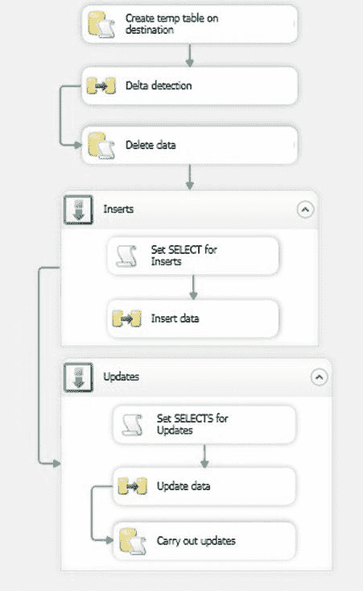

图 11-19. 在目标端隔离增量数据并向源端返回查询以获取增量数据的完整流程

## 工作原理

有时，除了对要提取数据的源表拥有读取权限外，源数据库不授予任何其他权限。这实际上排除了使用临时表的可能性，或者可能也排除了如前面方法所述将表值参数传递给存储过程。那么，除了将庞大的数据集提取到暂存表并在暂存数据库中执行增量比较之外，是否还有其他有效的替代方案呢？

幸运的是，有一种可行的替代方案，但我必须强调，它仅在处理相对较小的增量数据时才真正有用。这种技术包括检测增量标识符，然后将它们作为 `SELECT` 子句的一部分传回用于数据提取。

由于这很大程度上是方法 11-6 中描述的技术的延伸，我将在描述在该方法中已充分描述的技术时力求简洁，以便在此专注于将增量 ID 传回源数据库的不同方式。此方法将在目标服务器上使用临时表来保存需要删除的所有记录的 ID，以及需要更新的所有记录的全部数据。将使用哈希列来检测增量数据。然而，在这一点上，删除的增量 ID 将用于填充 `##Tmp_Deletes` 表，而插入和更新的 ID 将分别填充一个 ADO 记录集。然后，这些 ID 将作为 SQL `SELECT` 语句的 `WHERE` 子句发送回源服务器，以获取插入的记录（这些记录将直接加载到目标表中）以及更新的记录（这些记录将加载到临时表 `##Tmp_Updates` 中，用于作为基于集合的单一操作在目标表中执行更新）。

图 11-20 展示了流程概览。

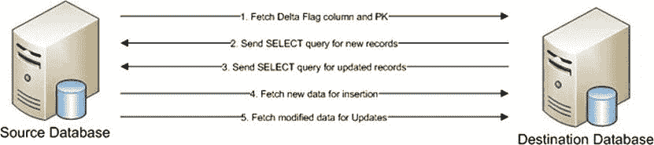

图 11-20. 在目标端检测增量数据并向源端返回选择性请求的流程

本方法描述的方法最适合在以下情况下使用：

*   当您对源数据表只有 `SELECT` 权限时。
*   当您预计增量数据集非常小时。
*   当源数据集很大时。

该方法的核心是，在插入和更新数据过程中，都使用一个 SSIS 对象变量来填充一个 ADO.NET 数据表。该数据表中的每一行都是一个必须从源数据加载的 ID，因此每个 ID 都会被添加到一个 `stringbuilder` 中，以连接成一个列表，该列表将成为发送到源数据表的 SQL 语句中 `WHERE` 子句的一部分。

## 提示、技巧和陷阱

*   由于本方法描述的包将使用临时表，因此您必须使用方法 11-5 中描述的“脚手架”方法。即，在创建 SSIS 包时，在目标数据库中为临时表 `##TMP_Deletes`、`##TMP_Inserts`、`##TMP_Updates` 和 `##Invoice_Lines_Updates` 创建普通表。然后，在 SQL 和变量中将对真实表的引用替换为对临时表的引用，并在目标数据库中删除这些表。
*   使用插入和更新流的计数器很重要，否则将无效的 SQL 发送回源数据库，导致流程失败。
*   需要重申的是，此方法不适合处理海量增量数据。然而，尽管 `stringbuilder` 很快且高效（至少与字符串变量相比），但在数据流中它仍然缓慢且开销大。

## 11-8. 当 MERGE 不适用时，使用 T-SQL 和链接服务器检测并加载增量数据

### 问题

您想在链接的源服务器上检测增量数据，并且希望仅在不使用 `MERGE` 的情况下将增量数据传输到目标。这可能是因为使用 `MERGE` 比基于表的解决方案更慢。

### 解决方案

在源端检测增量标识符，在目标端进行比较，然后仅请求增量数据以进行更新/插入操作。


操作方法如下——假设你有一个名为 `ADAMREMOTE` 的链接服务器，其中包含 `CarSales` 数据库和 `dbo.Invoice_Lines` 表。代码位于 (`C:\SQL2012DIRecipes\CH11\TableMergeReplacement.Sql`)。

```sql
IF OBJECT_ID('TempDB..#Upsert') IS NOT NULL DROP TABLE #Upsert
SELECT    ID, VersionStamp
INTO      #Upsert
FROM      ADAMREMOTE.CarSales.dbo.Invoice_Lines

-- 插入
; WITH Inserts_CTE AS (
    SELECT    ID
    FROM      #Upsert U
    WHERE     ID NOT IN (
                  SELECT ID FROM dbo.Invoice_Lines WITH (NOLOCK)
              )
)
INSERT INTO dbo.Invoice_Lines (
    ID
    ,InvoiceID
    ,SalePrice
    ,StockID
    ,VersionStamp
)
SELECT SRC_I.ID
    ,InvoiceID
    ,SalePrice
    ,StockID
    ,VersionStamp
FROM            ADAMREMOTE.CarSales.dbo.Invoice_Lines SRC_I WITH (NOLOCK)
INNER JOIN      Inserts_CTE CTE_I
                ON SRC_I.ID = CTE_I.ID

-- 更新
; WITH Updates_CTE AS (
    SELECT          S_U.ID
    FROM            dbo.Invoice_Lines S_U WITH (NOLOCK)
                    INNER JOIN   #Upsert U WITH (NOLOCK)
                    ON S_U.ID = U.ID
    WHERE           S_U.VersionStamp<> U.VersionStamp
)
UPDATE            DST_U
SET               DST_U.InvoiceID = SRC_U.InvoiceID
                 ,DST_U.SalePrice = SRC_U.SalePrice
                 ,DST_U.StockID = SRC_U.StockID
                 ,DST_U.VersionStamp = SRC_U.VersionStamp
FROM            dbo.Invoice_Lines DST_U
                INNER JOIN   ADAMREMOTE.CarSales.dbo.Invoice_Lines SRC_U
                ON SRC_U.ID = DST_U.ID
                INNER JOIN   Updates_CTE CTE_U
                ON DST_U.ID = CTE_U.ID

-- 删除
DELETE FROM     dbo.Invoice_Lines
WHERE           ID NOT IN (SELECT ID FROM #Upsert)
```

### 工作原理

不仅 SSIS 能从在实际执行所需的插入和更新操作之前先检测增量数据中受益——在某些情况下，如果你能通过链接服务器连接到源数据，那么你也可以使用 T-SQL 采用这种方法。你可以使用与前一个方法描述的类似过程来：

*   从源表收集主键和增量标志列。
*   将此与目标数据表进行比较。
*   返回源以收集新的和已修改的数据。

前面的代码片段应用此逻辑来检测并仅对增量数据进行更新插入/删除。这是一个从目标服务器运行的“拉取”过程。当然，这种方法会使用更多到源服务器的往返行程，但它确实让你有更大的控制权，并且比 `MERGE` 函数更少“黑盒”特性，也可能更容易理解。它的另一个优点是只需要在目标服务器上使用一个临时表。然而，我必须强调，任何潜在的速度提升都取决于基础设施（源服务器和目标服务器的配置，以及网络链接）以及——关键的是——源表和目标表上任何索引的性质。因此，在假设这种方法适合你之前，你应该测试这种方法并与简单的 `MERGE` 进行比较。当你的测试显示在两个系统之间选择性传输数据比简单的 `MERGE` 更快时，这个过程效果最佳。

它是这样工作的：首先，主键和增量检测标志列从源服务器传输到目标服务器上的临时表 `#Upsert` 中。然后，使用源表和目标表中的主键列，识别出任何新记录（通过使用普通的旧 `WHERE NOT IN` 或类似子句）。检测到的任何更新都从源服务器获取并在目标应用。增量检测标志列允许这样做。最后，任何删除——软删除或硬删除——都可以使用另一个 `WHERE NOT IN` 或类似子句来应用。请记住，如果索引能加快处理速度，你可以为临时表添加索引。

 `注意` 如果你没有使 `MERGE` 如此高效的索引，那么你可能会发现 `MERGE` 比替代解决方案更慢。不可避免地，这将取决于每种具体情况，因此你必须在你的特定环境中测试任何可能的解决方案。

### 11-9. 检测、记录和加载增量数据

#### 问题

你希望处理增量数据的更新插入，同时能够跟踪更改并按要求执行更新。

#### 解决方案

使用触发器和触发器元数据表来检测数据更改，并使用 SSIS 定期加载到目标数据库。

1.  在目标数据库 (`CarSales_Staging`) 中创建两个表——删除任何你之前已创建的旧版本——用于保存更新和删除操作的数据。对于本例，表结构如下 (`C:\SQL2012DIRecipes\CH11\TriggerTablesSource.Sql`)：

```sql
CREATE TABLE CarSales_Staging.dbo.Invoice_Lines_Updates
(
 ID int NOT NULL,
 InvoiceID INT NULL,
 StockID INT NULL,
 SalePrice NUMERIC(18, 2) NULL,
 CONSTRAINT PK_Invoice_Lines_Updates PRIMARY KEY CLUSTERED
 (
 ID ASC
 ) WITH (PAD_INDEX  = OFF, STATISTICS_NORECOMPUTE  = OFF, IGNORE_DUP_KEY = OFF, ALLOW_ROW_LOCKS  = ON, ALLOW_PAGE_LOCKS  = ON)
) ;
GO

CREATE TABLE CarSales_Staging.dbo.Invoice_Lines_Deletes
(
 ID INT NOT NULL,
 CONSTRAINT PK_Invoice_Lines_Deletes PRIMARY KEY CLUSTERED
 (
 ID ASC
 ) WITH (PAD_INDEX  = OFF, STATISTICS_NORECOMPUTE  = OFF, IGNORE_DUP_KEY = OFF, ALLOW_ROW_LOCKS  = ON, ALLOW_PAGE_LOCKS  = ON)
) ;
GO
```

2.  在源数据库中创建一个跟踪表。为了简单起见，我将假设源数据有一个单一的主键列，并且该列是 `INT` 数据类型 (`C:\SQL2012DIRecipes\CH11\TriggerTablesDestination.Sql`)。

```sql
CREATE TABLE CarSales.dbo.DeltaTracking
(
 DeltaID BIGINT IDENTITY(1,1) NOT NULL,
 ObjectName NVARCHAR (128) NULL,
 RecordID BIGINT NULL,
 DeltaOperation CHAR(1) NULL,
 DateAdded DATETIME NULL DEFAULT (getdate()),
 CONSTRAINT PK_DeltaTracking PRIMARY KEY CLUSTERED
 (
 DeltaID ASC
 ) WITH (PAD_INDEX  = OFF, STATISTICS_NORECOMPUTE  = OFF, IGNORE_DUP_KEY = OFF, ALLOW_ROW_LOCKS  = ON, ALLOW_PAGE_LOCKS  = ON)
) ;
GO
```

3.  同样为了简单起见，这里是一个（相当）通用的跟踪触发器，可以添加到任何具有单一 `INT` 数据类型主键列的表（在源数据库中） (`C:\SQL2012DIRecipes\CH11\tr_DeltaTracking.Sql`)：

```sql
CREATE TRIGGER CarSales.dbo.tr_DeltaTracking
ON dbo.Invoice_Lines FOR INSERT, UPDATE, DELETE
AS
    DECLARE @InsertedCount BIGINT
    DECLARE @DeletedCount BIGINT
    DECLARE @ObjectName   NVARCHAR(128)

    SELECT    @InsertedCount = COUNT(*) FROM INSERTED
    SELECT    @DeletedCount = COUNT(*) FROM DELETED

    SELECT    @ObjectName = OBJECT_NAME(parent_id)
    FROM      sys.triggers
    WHERE     parent_class_desc = 'OBJECT_OR_COLUMN'
          AND object_id = @PROCID

    -- 插入
    IF @InsertedCount >  0 AND @DeletedCount = 0
    BEGIN
        INSERT INTO dbo.DeltaTracking (RecordID, ObjectName, DeltaOperation)
        SELECT
            ID
            ,@ObjectName AS ObjectID
            ,'I' AS DeltaOperation
        FROM INSERTED
    END

    -- 删除
    IF @InsertedCount = 0 AND @DeletedCount > 0
    BEGIN
        INSERT INTO dbo.DeltaTracking (RecordID, ObjectName, DeltaOperation)
        SELECT
            ID
            ,@ObjectName AS ObjectID
            ,'D' AS DeltaOperation
        FROM DELETED
    END

    -- 更新
    IF @InsertedCount > 0 AND @DeletedCount > 0
    BEGIN
        INSERT INTO dbo.
```


DeltaTracking (记录 ID, 对象名, 增量操作) SELECT ID, @ObjectName AS ObjectID, 'U' AS DeltaOperation FROM INSERTED END GO

4.  首先同步源表和目标表之间的数据，之后再允许对源表进行任何数据修改。此步骤很简单，包括：(a) 防止对源数据表进行更新，(b) 将源数据加载到干净的目标表中，以及 (c) 再次允许对源数据进行 DML 操作。
5.  现在基础设施已经就位，你可以继续创建实际的 ETL 包本身。创建一个新的 SSIS 包，并将其命名为 `Prepare Scratch tables`。添加两个 OLEDB 连接管理器，分别命名为 `CarSales_Staging_OLEDB` 和 `CarSales_OLEDB`。
6.  向控制流窗格添加一个执行 SQL 任务。配置如下：

    | 连接类型:      | OLEDB                                     |
    | :------------- | :---------------------------------------- |
    | 连接:          | `CarSales_Staging_OLEDB`                  |
    | SQL 语句:      | `TRUNCATE TABLE dbo.Invoice_Lines_Deletes` |
    |                | `TRUNCATE TABLE dbo.Invoice_Lines_Updates` |

7.  向控制流窗格添加一个序列容器。将其命名为 `Upsert and Delete Deltas`。在此容器内，添加三个数据流任务，分别命名为 `Inserts`、`Deletes` 和 `Updates`。
8.  向控制流窗格添加一个执行 SQL 任务。将其命名为 `Delete Data`。配置如下：

    | 连接类型:      | OLEDB                                     |
    | :------------- | :---------------------------------------- |
    | 连接:          | `CarSales_Staging_OLEDB`                  |
    | SQL 语句:      | `DELETE DST`                              |
    |                | `FROM dbo.Invoice_Lines DST`              |
    |                | `INNER JOIN dbo.Invoice_Lines_Deletes DL` |
    |                | `ON DST.ID = DL.ID`                       |

9.  向控制流窗格添加一个执行 SQL 任务。将其命名为 `Update Data`。配置如下：

    | 连接类型:      | OLEDB                                       |
    | :------------- | :------------------------------------------ |
    | 连接:          | `CarSales_Staging_OLEDB`                    |
    | SQL 语句:      | `UPDATE DST`                                |
    |                | `SET DST.InvoiceID = UPD.InvoiceID`         |
    |                | `,DST.StockID = UPD.StockID`                |
    |                | `,DST.SalePrice = UPD.SalePrice`            |
    |                | `FROM dbo.Invoice_Lines DST`                |
    |                | `INNER JOIN dbo.Invoice_Lines_Updates UPD`  |
    |                | `ON DST.ID = UPD.ID`                        |

10. 向控制流窗格添加一个执行 SQL 任务。将其命名为 `Delete Tracking Records`。配置如下：

    | 连接类型:      | OLEDB                                                         |
    | :------------- | :------------------------------------------------------------ |
    | 连接:          | `CarSales_OLEDB`                                              |
    | SQL 语句:      | `DELETE FROM dbo.DeltaTracking`                               |
    |                | `WHERE ObjectID = OBJECT_ID('dbo.Invoice_Lines')`             |

    SSIS 包应如 图 11-21 所示。

    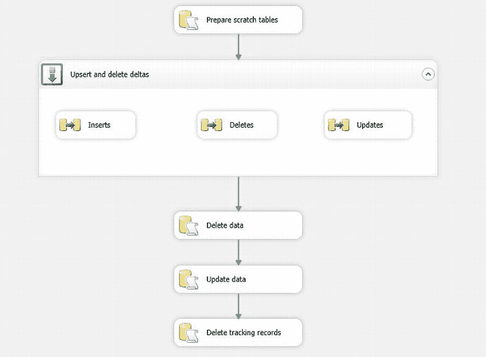

    图 11-21. 基于触发器的增量数据 Upsert 处理流程

11. 双击“Inserts”数据流任务，并向数据流窗格添加一个 OLEDB 源。配置如下：

    | OLEDB 连接管理器: | `Car_Sales_OLEDB`                                              |
    | :---------------- | :------------------------------------------------------------- |
    | 数据访问模式:     | SQL 命令                                                       |
    | SQL 命令文本:     | `SELECT SRC.ID`                                                |
    |                   | `,SRC.InvoiceID`                                               |
    |                   | `,SRC.StockID`                                                 |
    |                   | `,SRC.SalePrice`                                               |
    |                   | `FROM dbo.Invoice_Lines SRC`                                   |
    |                   | `INNER JOIN dbo.DeltaTracking TRK`                             |
    |                   | `ON SRC.ID = TRK.RecordID`                                     |
    |                   | `WHERE TRK.DeltaOperation = 'I'`                               |
    |                   | `AND ObjectID = OBJECT_ID('dbo.Invoice_Lines')`                |

12. 向数据流窗格添加一个 OLEDB 目标。将 OLEDB 源连接到它。配置如下：

    | OLEDB 连接管理器: | `CarSales_Staging_OLEDB`      |
    | :---------------- | :---------------------------- |
    | 数据访问模式:     | 表或视图 - 快速加载           |
    | 表或视图:         | `dbo.Invoice_Lines`           |

13. 单击“映射”，确保源和目标之间的所有列都已映射。
14. 双击“Deletes”数据流任务，并向数据流窗格添加一个 OLEDB 源。配置如下：

    | OLEDB 连接管理器: | `CarSales_OLEDB`                                              |
    | :---------------- | :------------------------------------------------------------ |
    | 数据访问模式:     | SQL 命令                                                      |
    | SQL 命令文本:     | `SELECT TRK.RecordID`                                         |
    |                   | `FROM dbo.DeltaTracking TRK`                                  |
    |                   | `WHERE TRK.DeltaOperation = 'D'`                              |
    |                   | `AND ObjectID = OBJECT_ID('dbo.Invoice_Lines')`               |

15. 向数据流窗格添加一个 OLEDB 目标。将 OLEDB 源连接到它。配置如下：

    | OLEDB 连接管理器: | `CarSales_Staging_OLEDB`             |
    | :---------------- | :----------------------------------- |
    | 数据访问模式:     | 表或视图 - 快速加载                  |
    | 表或视图:         | `dbo.Invoice_Lines_Deletes`          |

16. 单击“映射”，确保 `RecordID` 和 `ID` 列在源和目标之间已映射。
17. 双击“Updates”数据流任务，并向数据流窗格添加一个 OLEDB 源。配置如下：

    | OLEDB 连接管理器: | `CarSales_OLEDB`                                              |
    | :---------------- | :------------------------------------------------------------ |
    | 数据访问模式:     | SQL 命令                                                      |
    | SQL 命令文本:     | `SELECT SRC.ID`                                               |
    |                   | `,SRC.InvoiceID`                                              |
    |                   | `,SRC.StockID`                                                |
    |                   | `,SRC.SalePrice`                                              |
    |                   | `,SRC.DateUpdated`                                            |
    |                   | `FROM dbo.Invoice_Lines SRC`                                  |
    |                   | `INNER JOIN dbo.DeltaTracking TRK`                            |
    |                   | `ON SRC.ID = TRK.RecordID`                                    |
    |                   | `WHERE TRK.DeltaOperation = 'U'`                              |
    |                   | `AND ObjectID = OBJECT_ID('dbo.Invoice_Lines')`               |

18. 向数据流窗格添加一个 OLEDB 目标。将 OLEDB 源连接到它。配置如下：

    | OLEDB 连接管理器: | `Car_Sales_Staging_OLEDB`          |
    | :---------------- | :--------------------------------- |
    | 数据访问模式:     | 表或视图 - 快速加载                |
    | 表或视图:         | `dbo.Invoice_Lines_Updates`        |

19. 单击“映射”，确保源和目标之间的所有列都已映射。

现在你可以运行该包并加载任何增量数据。

## 工作原理

这种方法本质上分为两部分：

*   首先，使用触发器检测源表中的变化，然后记录这些变化。
*   其次，使用记录的变化来指示需要加载和修改的记录，从而执行定期数据加载。

跟踪增量数据的一种长期可靠的方法是使用触发器来标记插入、更新和删除。存储指示数据变化的数据标志有几种方法；然而，两种经典方法要么是在源表中使用额外的列，要么是创建并使用单独的“增量”表。我将解释增量表方法，这传统上意味着将受影响记录的唯一 ID 记录到一个表中（很可能在源数据服务器上），该表可以在源数据库中，也可以在另一个数据库中。然后，这些增量 ID 可用于隔离需要在目标数据中执行 upsert 和删除操作的数据集。

基于触发器的变更跟踪过程如 图 11-22 所示。

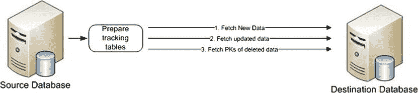

图 11-22. 一种基于触发器的变更跟踪过程

并非所有的数据库管理员都允许他们的源数据库被额外的表和触发器所拖累（这个词是从他们的角度来看的），因此这种解决方案在实践中并不总是适用。然而，当可以使用时，它有很多优点，也有一些缺点。

优点包括：

*   数据更改和更改类型的简单日志。
*   日志（增量表）结构简单且易于使用。

主要的不便和潜在问题包括：

*   保持数据同步的底层逻辑可能非常复杂。
*   存在性能影响，因为每次更改都会触发触发器。
*   如果存在现有触发器，则触发器排序和交互可能会出现问题。

**触发器方法注意事项与应用场景**
*   长事务（除非事务被正确处理）可能导致问题。
*   如果未对流程进行透彻分析，会发生数据不一致。
基于触发器的方法最适合在你能指望源数据 DBA 的同意与参与时使用。这也意味着获得它的接受可能会减慢源数据库上的 DML 操作，但数据快速便捷地传输到目标服务器足以作为补偿。你还需要确保没有不可预见的副作用，并且该流程已经过彻底测试。

在此示例中，我在目标数据库中使用了标准表来存放用于更新和删除的数据，仅仅是因为它更易于设置，并且可以持久化数据以供调查和测试目的。你可能更喜欢使用会话范围的临时表（如之前章节所述）。

一旦你使用触发器设置好增量跟踪流程，使用纯 T-SQL 在目标数据库中执行插入、更新和删除操作同样简单。你可以创建三个独立的触发器——分别用于更新、删除和插入操作——并且如果你愿意，可以硬编码表名和/或对象 ID。我发现通用触发器使增量跟踪的维护容易得多。

这种方法允许你为多个源数据表使用同一个跟踪表——假设它们都具有相同数据类型的单列主键。当情况并非如此简单时，你有几种选择：
*   为多列源表使用单独的表
*   为不同数据类型使用单独的表
*   扩宽你的表以容纳多个可能的主键列
*   为不同的主键数据类型添加多个列
*   使用一个`NVARCHAR`列来容纳所有可能的主键——并冒着读写时的速度损失
*   编写一个复杂的触发器来处理多个主键列
*   为每种主键类型和/或 PK 数据类型编写一个触发器

鉴于有多种可能性，我只能建议你尝试其中一些方法，以找到最适合你环境的那一种。

类似的方法也可用于许多其他 SQL 数据库，只要它们允许使用触发器。由于所有需求（以及不同数据库的语法）都不同，我只能鼓励你查阅相关产品文档，并将本节内容作为一个整体模型参考。

**提示、技巧与陷阱**
*   此过程假定源和目标数据将保持同步。如果两者失去同步，你需要在源数据表加载到干净的目标表期间阻止对其的更新，并在允许对源数据再次进行 DML 操作之前，从增量表中删除或截断与此表相关的所有记录。
*   当然，`Deletes`和`Updates`表可以位于另一个数据库中——或者甚至位于另一个（链接的）服务器上，如果这适合你的基础设施和操作要求。
*   你可以简单地将增量表中的所有数据加载到一个暂存表，然后进行插入/更新/删除。这可能会更慢，但它允许你保留所有操作的痕迹。
*   将整个 SSIS 包包装在一个事务中是一个非常好的主意，因为这将确保你不会：
    *   丢失增量记录。
    *   尝试重复插入。
    *   执行过时的更新。
*   如果你愿意，可以在此存储过程的开始创建临时表，并在最后删除它们。这样，任何失败都会使临时表保持完整，这有助于调试。当然，你必须记得在重新运行包之前手动删除它们。
*   本节的具体实现假定源数据库中有一个清晰的截止点，这允许在数据加载期间源数据不被修改的情况下将增量数据传输到目标。

如果源数据库持续活动，那么你需要使用跟踪表中的`DateAdded`字段来定义一个截止点，然后在增量加载成功完成后删除（而不是截断）早于该日期时间的重复操作。

**11-10. 检测行计数、元数据和列数据的差异**

**问题**
你希望在不使用 SSIS 或 T-SQL 的情况下检测行计数、元数据和列数据的差异。

**解决方案**
使用`TableDiff`实用程序。在命令窗口中运行，以在运行 ETL 增量数据加载之前检测源表是否发生了任何更改。

我将再次使用几个迷你示例来描述如何使用`TableDiff`，因为它的各种应用太不相同，无法整合到一个简单的示例中。

**元数据与行计数**
以下代码在命令窗口中运行，将返回两个表的行计数，并指示两个表的元数据是否相同。
```
"C:\Program Files\Microsoft SQL Server\110\COM\Tablediff.exe" -sourceuser Adam -sourcepassword Me4B0ss -sourceserver ADAM02 -sourcedatabase CarSales -sourceschema dbo -sourcetable Sales -destinationuser Adam -destinationpassword Me4B0ss -destinationserver ADAM02 -destinationdatabase CarSales_Staging -destinationschema dbo -destinationtable Sales -q
```
正是`-q`（快速）参数告诉`TableDiff`只比较记录数和元数据。如果两个表有不同的列，则`TableDiff`将返回：“具有不同的模式，无法比较。”

**行差异**
要获取两个表之间差异记录的详细信息（不带`-q`参数，并且最好将输出发送到 SQL Server 表而不是命令窗口），请添加以下参数：
```
-dt -et DataList
```
`DataList`是表的名称（在目标数据库中），该表将保存异常列表。

**列差异**
要查看列级别的所有数据差异，请添加`-c`参数。

生成的表具有表 11-3 中列出的列。

**表 11-3** DataDiff 输出
| 列名 | 可能值 | 注释 |
| :--- | :--- | :--- |
| ID | | 包含主键、GUID 或唯一 ID。 |
| Msdifftool-Errorcode | 0, 1, 或 2 | 0 表示数据不匹配。 |
| | | 1 表示记录在目标表中，但不在源表中。 |
| | | 2 表示记录在源表中，但不在目标表中。 |
| MSdifftool_Offendingcolumns | | 数据在两个表中不同的列名。 |

**创建 T-SQL 脚本以使目标表与源表相同**
要使表相同，请运行由`-f` `[filename]`参数创建的脚本。这通常是`TableDiff`变得有用的地方——当源和目标不同步，并且你希望“重置”它们以允许继续使用其中一种增量数据检测技术时。

生成的 SQL 是“逐行”的。为了获得更快（基于集合）的同步，你可以使用输出表中的数据和动态 SQL 来编写一个不那么冗长的脚本。

**工作原理**
讨论增量数据管理很难不提及`TableDiff.exe`。这是一个微软工具，最初设计用于复制场景中的表比较，但也可以用于：
*   非常快速地检测两个表的元数据是否相同。
*   获取两个表的行计数。
*   隔离只存在于其中一个表中而不在两者中的行。
*   隔离两个表中记录之间的所有数据更改。
*   创建一个 SQL 脚本来应用更改以使表相同。

`TableDiff.exe`是一个命令行工具，需要一组大量的参数。然而，一旦这些参数被设置为一个...


`TableDiff.exe`文件，处理起来就更容易，可以通过计划程序、SSIS 执行进程任务或 SQL Server 代理作业来运行。你需要在至少一张表中拥有主键、标识符列和行定位符或唯一键列，最好是两张表都有。顺便一提，`TableDiff`默认随 SQL Server 一同安装。

#### 提示、技巧与陷阱

*   如果使用了快速比较参数（`−q`），则不会创建输出表。
*   如果两张表完全相同，输出表将不会被覆盖。
*   输出表的结构会根据输入参数而变化——只有在存在列级别差异时，`MSdifftool_OffendingColumns`列才会出现。
*   `TableDiff.exe`还有其他参数，如果你需要，我建议你查阅 BOL（SQL Server 联机丛书）。

### 本章小结

本章介绍了许多使用 SQL Server 来检测源数据变化并将其应用到目标数据库的方法。表 11-4 总结了我对各种方法的看法，包括它们的优点和缺点。

表 11-4. 本章中增量数据管理技术的优缺点

| 技术 | 优点 | 缺点 |
| --- | --- | --- |
| 使用临时表进行更新和删除管理的全量数据传输。 | 比使用 OLEDB 任务快得多。 | 设置复杂。 |
| 链接服务器与 `MERGE` | 比传输所有数据后再使用 `MERGE` 更快。 | 需要链接服务器。 |
| 设置简单。 | | |
| 在源端检测增量数据——首先在 SSIS 中传输增量标志列。 | 比传输所有数据后再检测增量快得多。 | 设置复杂。 |
| | 源数据中需要增量标志列。 | |
| | 源端需要临时表。 | |
| 在源端检测增量数据并传回包含 ID 的 TVP。 | 比传输所有数据后再检测增量快得多。 | 设置复杂。 |
| | 源数据中需要增量标志列。 | |
| | 仅适用于极小的增量集。 | |
| 在源端检测增量数据并传回自定义 `SELECT` 语句。 | 比传输所有数据后再检测增量快得多。 | 设置复杂。 |
| | 源数据中需要增量标志列。 | |
| | 仅适用于极小的增量集。 | |
| 在源端检测增量数据——首先使用 T-SQL 传输增量标志列。 | 比传输所有数据后再检测增量快得多。 | 设置复杂。 |
| | 源数据中需要增量标志列。 | |
| | 源端需要临时表。 | |
| | 必须使用链接服务器。 | |
| 基于触发器的增量数据跟踪。 | 比全量数据传输快得多。 | 需要修改源数据库。 |
| | 必须管理跟踪表。 | |
| TableDiff | 仅在特定情况下适用。 | 需要学习该工具。 |

增量数据管理是一个极其复杂的挑战，几乎没有简单的解决方案。一些读者可能会觉得本章阐述的技术过于复杂而无法应用。另一些读者可能觉得它们太简单。还有一些读者可能正面临看似无法解决的问题。然而，只要有耐心和正确的分析，大多数增量数据问题都可以解决。关键在于找到正确的方法。所以，不要犹豫去测试各种解决方案，也不要害怕“混合搭配”本章中各种技巧。如果你的源表中没有“标志”列，试着去添加它们。如果无法添加，那么尝试使用哈希技术来识别已更改的行。不要害怕使用临时表或持久化表作为暂存技术。最重要的是——在定义合适的解决方案时要花足够的时间，并进行彻底的测试。

## 第 12 章 变更跟踪与变更数据捕获

本章重点介绍两种核心技术，它们允许你检测源数据的修改，并据此用相应的变化更新目标表。用最简单的定义来说，这些技术是：

*   **变更跟踪**：检测某一行是否已更改。允许进程从源表返回数据的最新版本。
*   **变更数据捕获**：检测某一行是否已更改。存储所有的中间变更以及记录的最终状态。

前者使用一个跟踪表和简单的版本控制，而后者读取 SQL Server 事务日志并提供复杂的版本跟踪。就其给源系统带来的开销而言，这两种技术都相对轻量，并且很大程度上是自管理的。两者都可以实现为基于 T-SQL 的解决方案或使用 SSIS。两者都无需对源表进行任何架构更改。两者都允许你决定何时应用目标表的更新，因此可以轻松地集成到常规的 ETL 流程中。根据我的经验，两者都非常健壮可靠。那么，如果这些是相似之处，它们的区别是什么——至少是在适合处理数据集成挑战的简单层面上？

*   **变更跟踪**是一个同步过程，它检测行是否发生了变化，但不检测具体修改了哪些数据。它在所有版本的 SQL Server 中都可用。
*   **变更数据捕获**是一个异步过程，它读取 SQL Server 事务日志来检测你正在跟踪的表的变更。它还可以让你查看表中数据所有变更的历史记录。它仅在 SQL Server 企业版中可用。

虽然这两种方法都非常高效，但初次接触时，它们的实现可能看起来有点复杂。花一点时间使用它们之后，我希望你会同意这只是第一印象。为了消除最初的顾虑，我建议你在开始实现解决方案之前，先通读一遍操作步骤，并仔细查看流程图，以清楚了解如何应用该技术。

本章的示例文件可在本书的配套网站上找到，安装后位于 `C:\SQL2012DIRecipes\CH11` 文件夹中。

### 12-1. 以低开销和无需自定义框架的方式检测源表变更

**问题**

你需要一个低开销的解决方案，能够检测源数据中的变更并将其应用到目标表，而不使用触发器、不改变源表 DDL 或任何复杂流程。

**解决方案**

在源表上启用变更跟踪，然后隔离变更并将其应用到目标表。以下步骤说明了如何操作。

1.  使用以下 T-SQL 代码段在源数据库（本例中为 CarSales）中启用变更跟踪（`C:\SQL2012DIRecipes\CH11\ActivateChangeTracking.Sql`）：
    ```sql
    USE CarSales;
    GO
    
    ALTER DATABASE CarSales SET ALLOW_SNAPSHOT_ISOLATION ON;
    ALTER DATABASE CarSales SET CHANGE_TRACKING = ON
    (CHANGE_RETENTION = 3 DAYS, AUTO_CLEANUP = ON);
    ```
2.  在目标数据库（本例中为 CarSales_Staging）中创建目标表。这是将在本方案中使用变更跟踪进行更新的表。以下是创建该表的 DDL（`C:\SQL2012DIRecipes\CH11\tblClient_CT.Sql`）：
    ```sql
    CREATE TABLE CarSales_Staging.dbo.


