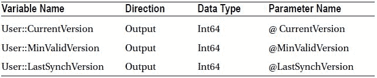
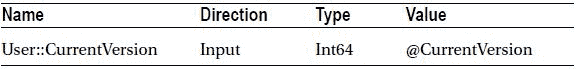
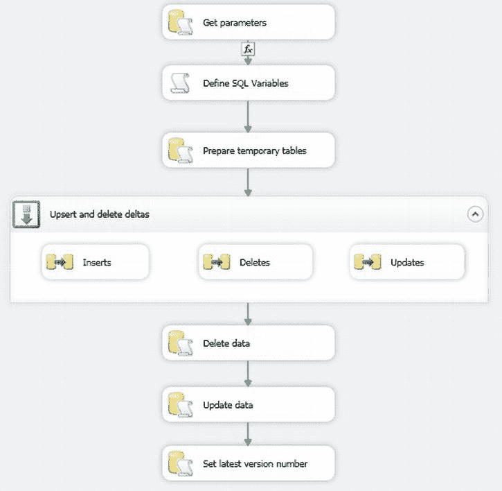

# 在 SSIS 中使用变更跟踪处理增量数据

添加一个执行 SQL 任务，配置如下：
- **名称**：`Get Parameters`
- **连接类型**：`Source_ADONET`
- **SQL 语句**：
    ```sql
    SELECT @CurrentVersion = CHANGE_TRACKING_CURRENT_VERSION();
    SELECT @MinValidVersion = CHANGE_TRACKING_MIN_VALID_VERSION(OBJECT_ID('dbo.Client'));
    SELECT @LastSynchVersion = CAST(value AS BIGINT)
    FROM sys.extended_properties
    WHERE major_id = OBJECT_ID('dbo.Client')
    AND name = N'LAST_SYNC_VERSION';
    ```

5.  映射以下参数：
    

6.  确认你的修改。

7.  添加一个脚本任务，命名为 **定义 SQL 变量**，并将任务 `Get Parameters` 连接到它。双击 precedence constraint 并设置为：
    - **求值运算**：`表达式和约束`
    - **值**：`成功`
    - **表达式**：`@LastSynchVersion >= @MinValidVersion`

8.  添加以下变量：
    - **只读**：`LastSynchVersion`
    - **读写**：`SQLDelete`, `SQLInsert`, `SQLUpdate`

9.  添加以下脚本，该脚本将设置 `SQL SELECT` 以仅返回增量数据（`C:\SQL2012DIRecipes\CH11\ChangeTrackingSSIS.vb`）：
    ```vb
    Public Sub Main()
          Dim SQLInsertText As String = "SELECT SRC.ID, ClientName, Country, Town, County, Address1, Address2, ClientType, ClientSize" _
               & " FROM dbo.Client SRC" _
               & " INNER JOIN CHANGETABLE(CHANGES Client, " _
               & Dts.Variables("LastSynchVersion").Value & ") AS CT" _
               & " ON SRC.ID = CT.ID" _
               & " WHERE CT.SYS_CHANGE_OPERATION = 'I'"
          Dts.Variables("SQLInsert").Value = SQLInsertText

          Dim SQLDeleteText As String = "SELECT ID FROM CHANGETABLE(CHANGES Client, " _
               & Dts.Variables("LastSynchVersion").Value & ") AS DEL" _
               & " WHERE SYS_CHANGE_OPERATION = 'D'"
          Dts.Variables("SQLDelete").Value = SQLDeleteText

          Dim SQLUpdateText As String = "SELECT SRC.ID, ClientName, Country, Town, County, Address1, Address2, ClientType, ClientSize " _
               & " FROM dbo.Client SRC" _
               & " INNER JOIN CHANGETABLE(CHANGES Client, " _
               & Dts.Variables("LastSynchVersion").Value & ") AS CT" _
               & " ON SRC.ID = CT.ID" _
               & " WHERE CT.SYS_CHANGE_OPERATION = 'U'"
          Dts.Variables("SQLUpdate").Value = SQLUpdateText

          Dts.TaskResult = ScriptResults.Success
    End Sub
    ```

10. 确认你的修改。

11. 添加一个执行 SQL 任务，命名为 **准备临时表**，将 定义 SQL 变量 任务连接到它，并配置如下（`C:\SQL2012DIRecipes\CH11\PrepareTemporaryTables.Sql`）：
    - **名称**：`Get Parameters`
    - **连接类型**：`OLEDB`
    - **连接**：`Source_OLEDB`
    - **SQL 语句**：
        ```sql
        CREATE TABLE ##Tmp_Deletes (ID INT);
        CREATE TABLE ##Tmp_Updates
        (
            ID INT NOT NULL,
            ClientName VARCHAR(150) NULL,
            Country VARCHAR(50) NULL,
            Town VARCHAR(50) NULL,
            County VARCHAR(50) NULL,
            Address1 VARCHAR(50) NULL,
            Address2 VARCHAR(50) NULL,
            ClientType VARCHAR(20) NULL,
            ClientSize VARCHAR(10) NULL
        );
        ```

12. 确认你的修改。

13. 添加一个 Sequence 容器，命名为 **更新插入和删除增量数据**，并将任务 “准备临时表” 连接到它。

14. 在 Sequence 容器内部，添加三个名为 **插入**、**更新** 和 **删除** 的数据流任务。将 `删除` 和 `更新` 的 `DelayValidation` 设置为 `True`。
    配置如下：
    - **插入**
        - **源 (OLEDB)**
            - `OLEDB 连接管理器`：`Source_OLEDB`
            - `数据访问模式`：`SQLCommandFromVariable`
            - `变量名`：`SQLInsert`
        - **目标 (OLEDB)**
            - `OLEDB 连接管理器`：`Destination_OLEDB`
            - `数据访问模式`：`表或视图 – 快速加载`
            - `表或视图名称`：`dbo.Clients`
            - `保留标识值`：`True`
    - **更新**
        - **源 (OLEDB)**
            - `OLEDB 连接管理器`：`Source_OLEDB`
            - `数据访问模式`：`SQLCommandFromVariable`
            - `变量名`：`SQLUpdate`
        - **目标 (OLEDB)**
            - `OLEDB 连接管理器`：`Destination_OLEDB`
            - `数据访问模式`：`来自变量的表或视图名称`
            - `变量名`：`UpdateTable`
            - `验证外部元数据 (属性)`：`False`
    - **删除**
        - **源 (OLEDB)**
            - `OLEDB 连接管理器`：`Source_OLEDB`
            - `数据访问模式`：`SQLCommandFromVariable`
            - `变量名`：`SQLDelete`
        - **目标 (OLEDB)**
            - `OLEDB 连接管理器`：`Destination_OLEDB`
            - `数据访问模式`：`来自变量的表或视图名称`
            - `变量名`：`DeleteTable`
            - `验证外部元数据 (属性)`：`False`

15. 确保所有三个目标的从源到目标的映射都是正确的，并确认你的修改。

16. 添加一个执行 SQL 任务，命名为 **删除数据**，并将 Sequence 容器 “更新插入和删除增量数据” 连接到它。配置如下：
    - **连接类型**：`OLEDB`
    - **连接**：`Destination_OLEDB`
    - **SQL 语句**：
        ```sql
        DELETE DST
        FROM dbo.Client DST
        INNER JOIN Tmp_Deletes DL
        ON DST.ID = DL.ID;
        ```

17. 确认你的修改。

18. 添加一个执行 SQL 任务，命名为 **更新数据**，并将执行 SQL 任务 “删除数据” 连接到它。配置如下（`C:\SQL2012DIRecipes\CH11\UpdateData.Sql`）：
    - **连接类型**：`OLEDB`
    - **连接**：`Destination_OLEDB`
    - **SQL 语句**：
        ```sql
        UPDATE DST
        SET
            DST.ClientName = SRC.ClientName,
            DST.Country = SRC.Country,
            DST.Town = SRC.Town,
            DST.County = SRC.County,
            DST.Address1 = SRC.Address1,
            DST.Address2 = SRC.Address2,
            DST.ClientType = SRC.ClientType,
            DST.ClientSize = SRC.ClientSize
        FROM dbo.Client DST
        INNER JOIN Tmp_Updates SRC
        ON DST.ID = SRC.ID;
        ```

19. 确认你的修改。

20. 添加一个执行 SQL 任务，命名为 **设置最新版本号**，并将执行 SQL 任务 “更新数据” 连接到它。

21. 配置执行 SQL 任务如下（`C:\SQL2012DIRecipes\CH11\UpdateExtendedPropertySSIS.Sql`）：
    - **连接类型**：`ADO.NET`
    - **连接**：`Source_ADONET`
    - **SQL 语句**：
        ```sql
        EXEC sys.sp_updateextendedproperty
            @level0type = N'SCHEMA',
            @level0name = dbo,
            @level1type = N'TABLE',
            @level1name = Client,
            @name = LAST_SYNC_VERSION,
            @value = @CurrentVersion;
        ```

22. 添加以下参数：
    

23. 点击 OK 确认你的更改。包应该如 图 12-1 所示。
    
    图 12-1. SSIS 中的变更跟踪流程

