# 工作原理

你也可以在 SSIS 包中使用变更跟踪信息，以确保只有增量数据更改才会应用到目标数据库。这前提是变更跟踪已为源表启用并配置。


不幸的是，你必须说服源系统的数据库管理员配置变更跟踪，这可能并不容易。我想提请注意的是，此方法使用了两种“脚手架”技术来帮助更轻松地创建数据包，但这些技术将在处理过程中（或处理之前）被修改：第一，我使用直接引用源表的变量来定义源数据——而无需使用变更跟踪。这些变量将在执行时被替换为仅选择增量数据所需的代码。第二，我首先在目标数据库中使用永久性“临时”表来处理增量删除和更新，最后（在一切测试完毕并准备部署后）切换为使用临时表。

要实现此方法，有几个先决条件。首先（或许不言而喻），必须在源系统上配置变更跟踪。其次，运行过程之前，源表和目标表必须已同步（此处我将使用配方 12-1 中描述的客户端表）。

一旦数据包经过测试并可运行（记得在每次测试之间截断 `Tmp_Deletes` 和 `Tmp_Updates` 表），你可以进行调整以使用会话范围内的临时表，步骤如下：

1.  首先，将 `TMP_Updates` 和 `TMP_Deletes` 变量的值分别更改为 `##TMP_Updates` 和 `##TMP_Deletes`。
2.  然后，将“删除数据”步骤中的 SQL 语句改为使用 `##Tmp_Deletes` 表而非 `Tmp_Deletes`。
3.  接着，将“更新数据”步骤中的 SQL 语句改为使用 `##Tmp_Updates` 表而非 `Tmp_Updates`。
4.  最后，删除目标数据库中的 `Tmp_Deletes` 和 `Tmp_Updates` 表。

## 12-4. 使用 SQL Server 事务日志检测源数据变更

### 问题

你想要检测源表的净变更，而不在源数据库中创建任何额外的对象，并定期将数据变更应用到目标表。

### 解决方案

使用 SQL Server 企业版的变更数据捕获（CDC）功能，通过读取 SQL Server 事务日志来跟踪变更，这种方式无需触发器且相对轻量级。在此示例中，我使用 `CarSales` 作为源数据库，`CarSales_Staging` 作为目标数据库。

1.  首先（如果尚未完成），必须在数据库级别启用 CDC。以下 T-SQL 片段将完成此操作（`C:\SQL2012DIRecipes\CH11\EnableCDC.Sql`）：

    ```
    USE CarSales;
    GO
    
    sys.sp_cdc_enable_db;
    ```

2.  创建一个表来跟踪每次使用 CDC 的 ETL 加载。你需要使用如下 DDL（`C:\SQL2012DIRecipes\CH11\tblCDCLSN.Sql`）：

    ```
    CREATE TABLE CarSales.dbo.CDCLSN
    (
     ID INT IDENTITY NOT NULL
     ,FinalLSN BINARY(10)
     ,TableName VARCHAR(128)
     ,DateAdded DATETIME DEFAULT GETDATE()
     ,NbInserts INT
     ,NbUpdates INT
     ,NbDeletes INT
    );
    GO
    ```

3.  为你将跟踪的表启用 CDC，使用类似以下的 T-SQL 片段（`C:\SQL2012DIRecipes\CH11\EnableCDC.Sql`）：

    ```
    USE CarSales;
    GO
    
    sys.sp_cdc_enable_table
    @source_schema = 'dbo',
    @source_name = 'Client',
    @role_name = 'CDCMainRole',
    @supports_net_changes = 1;
    GO
    ```

4.  定期运行以下代码以使目标表与源表同步（`C:\SQL2012DIRecipes\CH11\RunCDC.Sql`）：

    ```
    DECLARE @InitialLSN BINARY(10)
    DECLARE @FinalLSN BINARY(10)
    DECLARE @TmpLSN BINARY(10)
    DECLARE @NbInserts INT = 0
    DECLARE @NbUpdates INT = 0
    DECLARE @NbDeletes INT = 0

    -- 获取最高 LSN
    SELECT     @FinalLSN = sys.fn_cdc_get_max_lsn()
    SELECT     @TmpLSN = FinalLSN
    FROM       dbo.CDCLSN
    WHERE      TableName = 'dbo_Clients'
               AND ID = (SELECT MAX(ID) FROM dbo.CDCLSN WHERE TableName ='dbo_Clients')

    -- 获取将使用的最低 LSN 并测试是否有变更
    IF @FinalLSN = @TmpLSN
    RETURN

    SELECT @InitialLSN = ISNULL(@TmpLSN,sys.fn_cdc_get_min_lsn('dbo_Clients'))

    -- 删除操作 (1=删除)，仅需主键
    DELETE FROM   dbo.Clients_New
    WHERE         CustomerNumber IN (
                                     SELECT   CustomerNumber
                                     FROM     cdc.fn_cdc_get_net_changes_dbo_Clients(
                                                       @InitialLSN, @FinalLSN, 'all')
                                     WHERE  __$operation = 1
                                     )

    SET @NbDeletes = @@ROWCOUNT

    -- 更新操作 (4=更新后的值)，需要字段列表
    UPDATE       D
    SET          D.CustomerName = S.CustomerName
    FROM         dbo.Clients_New D
    INNER JOIN   (SELECT  CustomerID,CustomerName
                  FROM     cdc.fn_cdc_get_net_changes_dbo_Clients(@InitialLSN, @FinalLSN, 'all')
                  WHERE __$operation = 4) S
                  ON S.CustomerID = D.CustomerID

    SET @NbUpdates = @@ROWCOUNT

    -- 插入操作 (2=插入)，需要字段列表
    INSERT INTO   dbo.Clients_New (CustomerID,CustomerName)
    SELECT        CustomerID,CustomerName
    FROM          cdc.fn_cdc_get_net_changes_dbo_Clients ( @InitialLSN,
               @FinalLSN, 'all')
    WHERE         __$operation = 2

    SET @NbInserts = @@ROWCOUNT

    -- 所有操作完成后，将新的最高 LSN 添加到历史记录表以供下次运行使用
    INSERT INTO   dbo.CDCLSN (FinalLSN,TableName, NbInserts, NbUpdates, NbDeletes)
    VALUES        (@FinalLSN,'dbo_Clients', @NbInserts, @NbUpdates, @NbDeletes);
    ```

### 工作原理

SQL Server 2008 在 ETL 过程的增量数据管理领域引入了一个重要的新特性，即变更数据捕获。虽然这项技术不仅限于帮助在 SQL Server 数据库和实例之间加载数据的人，但它对数据集成从业者来说无疑是一大助力。

CDC（这是其常用的缩写）有许多用途和应用，并不仅限于 ETL 场景。实际上，它的使用可能相当复杂。因此，本配方不会是对 CDC 的详尽介绍，而是集中讨论 CDC 如何在 SQL Server 源和目标数据库之间执行插入、更新和删除操作。这些数据库可以是暂存数据库、数据仓库——实际上，它可以用于多种可能的场景。与本书一贯的重点一样，关注点在于 ETL 过程。

CDC 要求你指定“开始”和“结束”参数，以便告诉它要分析和处理哪一块变更。它可以让你指定时间范围，但在这里我更喜欢使用 SQL Server *日志序列号*（LSN），因为它们是事务日志中操作的“自然”指示器——CDC 正是从事务日志中获取其使用的所有信息。这需要一种方法来确定要处理的 LSN 范围的上限和下限。为此，我倾向于将使用的最后一个（上限）LSN 保存到跟踪表中，这使得上一次操作的上限成为当前操作的下限。额外的好处是，此表还存储了每次 ETL 加载期间执行的插入、更新和删除操作影响的记录数。

这里，不可避免地，我只展示了如何对一张表进行此操作。对于你希望使用 CDC 的每张表，你都必须复制此操作。哦，还要确保你使用的是 SQL Server 的企业版——如果你在生产环境中只部署标准版或商业智能版本，这是行不通的。


T-SQL 执行以下操作：

首先，我们需要获取最高的 LSN，这将用作所有增量修改的上限阈值。这有效地为将使用 CDC 处理的操作设定了“上限”。OLTP 操作可能在表中继续进行，但它们不会被拾取用于 ETL。

其次，我们需要获取最低的 LSN，这将用作所有增量修改的下限阈值——要么是我们记录操作的表中的最后一个最高 LSN，要么，如果这是首次运行该过程，则为最小 LSN（这是在为表设置 CDC 时检测到的）。

但是，如果上限和下限范围相同，我们绝不能执行该过程。这是因为 LSN 范围函数 (`cdc.fn_cdc_get_net_changes_<table>`) 的行为类似于 SQL 的 `BETWEEN` 子句，因此如果上限和下限 LSN 相同，则总会有一个操作被处理。因此，代码会对此进行测试，如果两个 LSN 相同则退出。

否则，如果至少有一个新操作，该过程将使用 `cdc.fn_cdc_get_net_changes_<table>` 函数插入/更新/删除任何新的或更改的数据（以任何顺序）。


**注意**：尽管变更数据捕获（如同变更跟踪）不会给源服务器增加很多额外开销，但具体开销是多少以及是否可接受，将取决于每种具体情况。对于事务量非常大的服务器，即使是 CDC 增加的轻微开销也可能显得过多。你需要在特定环境中进行测试。

## 提示、技巧和陷阱

*   变更数据捕获仅在 SQL Server 的企业版中可用。
*   在启用表的 CDC 时，`@supports_net_changes` 参数至关重要，因为我们只对 ETL 增量数据的最终“净”更改感兴趣，而不是数据加载之间的中间状态。
*   如果你需要禁用 CDC，必须先在表级别禁用它：
    ```
    sys.sp_cdc_disable_table
        @source_schema = 'dbo',
        @source_name = 'Clients' ,
        @capture_instance = 'dbo_Client' ;
    GO
    ```
*   你可以使用以下语句检查启用了 CDC 的表：
    `SELECT name, type, type_desc FROM sys.tables WHERE is_tracked_by_cdc = 1;`
*   然后，一旦所有表都禁用了 CDC，你可以使用以下语句在数据库级别禁用 CDC 本身：
    ```
    sys.sp_cdc_disable_db ;
    GO
    ```
*   如果你确实想查看所有更改，按类型查看 LSN 范围（假设你已经声明了变量 `@InitialLSN` 和 `@FinalLSN` 并为其赋值）：
    `SELECT * FROM cdc.fn_cdc_get_net_changes_dbo_Clients(@InitialLSN, @FinalLSN, 'all');`
*   如果你的流程需要，你可以“软删除”记录（通过将其标记为不再活动）而不是在目标表中删除它们。
*   如果你愿意，可以使用 `update_mask` 列来推断要更新的字段，并编写一些巧妙的动态 SQL。不过，我认为最好还是坚持使用本方案中定义的更全局的方法。
*   如果你想使用定义的时间范围，在此范围内必须检测到所有修改的数据，那么你需要 `sys.fn_cdc_map_time_to_lsn` 函数，以便 SQL Server CDC 找到对应于上限和下限时间阈值的 LSN。
*   以下代码段，如果添加到 T-SQL 代码的声明部分（并替换 `@InitialLSN` 和 `@FinalLSN` 的赋值），将获取过去六小时的 LSN 阈值。使用这种方法时应谨慎，因为你可能会遗漏某个范围，因此请在使用时间阈值返回 LSN 阈值时务必小心。
    ```
    DECLARE @LowerTimeThreshold DATETIME2 = DATEADD(hh,-6,GETDATE())
    DECLARE @UpperTimeThreshold DATETIME2 = GETDATE()

    SELECT @InitialLSN = sys.fn_cdc_map_time_to_lsn('smallest greater than',
    @LowerTimeThreshold)
    SELECT @FinalLSN = sys.fn_cdc_map_time_to_lsn('largest less than or
    equal', @UpperTimeThreshold)
    ```
*   当然，你可能更愿意为更改数据窗口设置定义好的时间段——但如何调整 T-SQL 来实现这一点，就交给你来完成了。
*   如果在表中存储 LSN 过于复杂，你可以总是只存储最后一个（最高的） LSN 作为源表的扩展属性，使用 `sp_AddExtendedProperty`。这类似于方案 12-1 中描述的在使用变更跟踪时存储版本号的方法。
*   定义变更数据捕获要求用户是 sysadmin 固定服务器角色的成员。

## 12-5. 在 SSIS 中应用变更数据捕获

### 问题

你正在运行一个结构化的 ETL 包，并希望它以完全与 SSIS 集成的方式使用变更数据捕获。

### 解决方案

使用 SSIS 2012 及其新的变更数据捕获任务。以下步骤展示了如何使用 `CarSales` 数据库中的 Client 表作为源，并使用 `CarSales_Staging` 数据库作为目标来完成此操作。

1.  使用以下代码在数据库和表级别实现 CDC（如果尚未完成）(`C:\SQL2012DIRecipes\CH11\EnableCDCSSIS.Sql`)：
    ```
    USE CarSales;
    GO

    sys.sp_cdc_enable_db;
    GO

    sys.sp_cdc_enable_table
    @source_schema = 'dbo',
    @source_name = 'Client' ,
    @role_name = 'CDCMainRole',
    @supports_net_changes = 1
    ```
2.  使用以下 DDL 创建一个表，用于存储目标表中要删除的记录的 ID (`C:\SQL2012DIRecipes\CH11\tblCDC_Client_Deletes.Sql`)：
    ```
    CREATE TABLE CarSales_Staging.dbo.CDC_Client_Deletes
    (
     ID INT NOT NULL
    ) ;
    GO
    ```
3.  使用以下 DDL 创建一个表，用于存储目标表中要更新的记录的数据 (`C:\SQL2012DIRecipes\CH11\tblCDC_Client_Updates.Sql`)：
    ```
    CREATE TABLE CarSales_Staging.dbo.CDC_Client_Updates
    (
     ID INT NOT NULL,
     ClientName NVARCHAR(150) NULL,
     Address1 VARCHAR(50) NULL,
     Address2 VARCHAR(50) NULL,
     Town VARCHAR(30) NULL,
     County VARCHAR(30) NULL,
     PostCode VARCHAR(10) NULL,
     Country CHAR(3) NULL,
     ClientType NCHAR(5) NULL,
     ClientSize VARCHAR(10) NULL,
     ClientSince SMALLDATETIME NULL,
     IsCreditWorthy BIT NULL,
     DealerGroup HIERARCHYID NULL,
     MapPosition GEOGRAPHY NULL
    ) ;
    GO
    ```
4.  使用以下 DDL 创建一个目标表：
    ```
    CREATE TABLE CarSales_Staging.dbo.Client_CDCSSIS
    (
     ID INT IDENTITY(1,1) NOT NULL,
     ClientName NVARCHAR(150) NULL,
     Address1 VARCHAR(50) NULL,
     Address2 VARCHAR(50) NULL,
     Town VARCHAR(50) NULL,
     County VARCHAR(50) NULL,
     PostCode VARCHAR(10) NULL,
     Country TINYINT NULL,
     ClientType VARCHAR(20) NULL,
     ClientSize VARCHAR(10) NULL,
     ClientSince SMALLDATETIME NULL,
     IsCreditWorthy BIT NULL,
     DealerGroup HIERARCHYID NULL,
     MapPosition GEOGRAPHY NULL,
     CONSTRAINT PK_Client PRIMARY KEY CLUSTERED
     (
     ID ASC
     ) WITH (PAD_INDEX = OFF, STATISTICS_NORECOMPUTE = OFF, IGNORE_DUP_KEY = OFF, ALLOW_ROW_LOCKS = ON, ALLOW_PAGE_LOCKS = ON)
    ) ;
    GO
    ```
    创建一个表来跟踪每次增量加载中使用的 LSN 范围也是必需的——如方案 12-4 所述——但正如你将看到的，CDC 控制任务可以为你创建此表，因此我将让它来完成这项工作。
5.  创建一个新的 SSIS 包。


5.  在项目级别添加以下三个连接管理器（通过右键单击解决方案资源管理器中的连接管理器文件夹并选择新建连接管理器）。它们在连接管理器文件夹中都将具有 `.ConnMgr` 扩展名，并在连接管理器选项卡中显示时不带此后缀：

    | 名称 | 类型 | 注释 |
    | --- | --- | --- |
    | `CarSales_OLEDB` | OLEDB | 到已启用 CDC 的源数据库的连接。 |
    | `CarSales_Staging_OLEDB` | OLEDB | 到目标（已同步）数据库的连接。 |
    | `CarSales_ADONET` | ADO.NET | 用于 LSN 跟踪的连接。此处将其放置在源数据库中。这 **必须** 是一个 ADO.NET 连接，否则 CDC 任务无法使用它。 |

6.  在包级别，添加一个名为 `CDCState` 的新 String 变量。
7.  在控制流窗格中添加一个名为 `CDC LSN Start` 的 CDC 控制任务。打开它并设置以下参数：

    | 名称 | 类型 | 注释 |
    | --- | --- | --- |
    | SQL Server CDC Database/ADO.NET Connection Manager | `CarSales_ADONET` | 这是先前定义的到已启用 CDC 的源数据库的连接。 |
    | CDC Control Operation | `Mark initial load start` | 这告知任务此为初始加载的开始。 |
    | Variable containing CDC State | `CDCState` | 用于存储 LSN 的变量。 |
    | Connection Manager where the database where the state is stored | `CarSales_ADONET` |  |

8.  为“用于存储状态的表”点击新建。确认默认的表 DDL（参见 图 12-2）。
    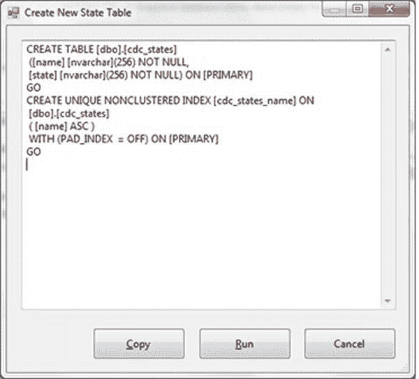
    图 12-2。 在 SSIS 2012 CDC 中定义状态存储表

    其代码为：
    ```sql
    CREATE TABLE dbo.cdc_states
    (
     name NVARCHAR(256) NOT NULL,
     state NVARCHAR(256) NOT NULL
    ) ;
    GO
    CREATE UNIQUE NONCLUSTERED INDEX cdc_states_name ON
     dbo.cdc_states
     ( name ASC )
     WITH (PAD_INDEX  = OFF) ;
    GO
    ```
9.  点击运行以创建表。
10. 将状态名称设置为 `CDCState`。对话框应如 图 12-3 所示。
    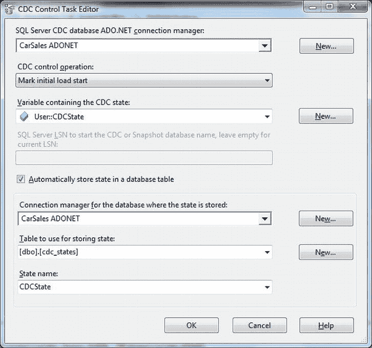
    图 12-3。 CDC 控制任务编辑器
11. 点击确定以确认更改。
12. 向控制流窗格添加一个数据流任务，将 CDC 控制任务连接到它，并切换到数据流窗格。
13. 添加一个 OLEDB 源任务，配置如下：
    | 名称 | `CarSales` |
    | OLEDB Connection Manager | `CarSales_OLEDB` |
    | Data Access Mode | `Table or View` |
    | Name of Table or View | `dbo.Client` |
14. 添加一个 OLEDB 目标任务，链接到源任务并配置如下：
    | 名称 | `CarSales_Staging` |
    | OLEDB Connection Manager | `CarSales_Staging_OLEDB` |
    | Data Access Mode | `Table or View – fast load` |
    | Name of Table or View | `dbo.Client_CDCSSIS` |
    | Keep Identity | `Checked` |
15. 将所有源列映射到目标列。数据流应如 图 12-4 所示。
    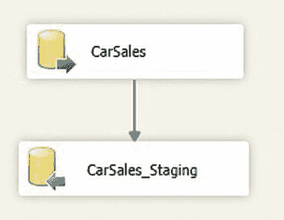
    图 12-4。 SSIS 2012 CDC 的处理流程
16. 返回控制流选项卡。添加一个 CDC 控制任务，命名为 `CDC LSN end`。将数据流任务连接到它，然后双击进行编辑。
17. 设置与之前（步骤 8）相同的参数，但确保 CDC 控制操作现在为 “`Mark initial load end`”。对话框应如 图 12-5 所示。
    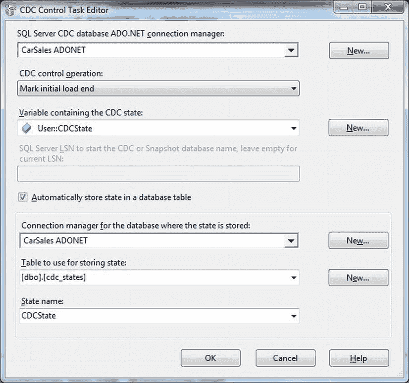
    图 12-5。 用于标记初始加载结束的 CDC 控制任务编辑器对话框
18. 运行包以启动变更数据捕获。整个包应如 图 12-6 所示。
    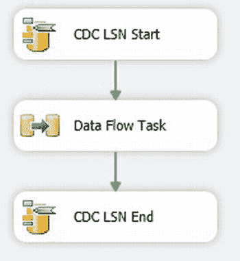
    图 12-6。 实例化 CDC 时的处理流程
19. 在同一 SSIS 项目中创建一个新的 SSIS 包（这将允许您使用初始加载中使用的相同连接管理器）。
20. 在包级别，添加一个名为 `CDCState` 的新 String 变量。
21. 向控制流窗格添加一个执行 SQL 任务。配置如下：
    | 名称 | `Prepare Staging Tables` |
    | Connection Type | `OLEDB` |
    | Connection | `CarSales_Staging_OLEDB` |
    | SQL Statement | `TRUNCATE TABLE dbo.CDC_Client_Updates` |
    | | `TRUNCATE TABLE dbo.CDC_Client_Deletes` |
22. 添加一个 CDC 控制任务，命名为 `Get starting LSN`，并将前一个任务（Prepare Staging Tables）连接到它。按照前一个配方中的描述进行完全相同的配置，但将 CDC 控制操作设置为 “`Get processing range`”。
23. 添加一个数据流任务。将 CDC 控制任务连接到它。切换到数据流窗格。
24. 添加一个 CDC 源任务。打开它并配置如下：
    | 名称 | `CDC Source` |
    | ADO.NET Connection Manager | `CarSales_ADONET` |
    | CDC-enabled Table | `dbo.Client` |
    | CDC Processing Mode | `Net` |
    | Variable containing CDC State | `CDCState` |
25. 对话框应如 图 12-7 所示。点击确定以确认修改。
    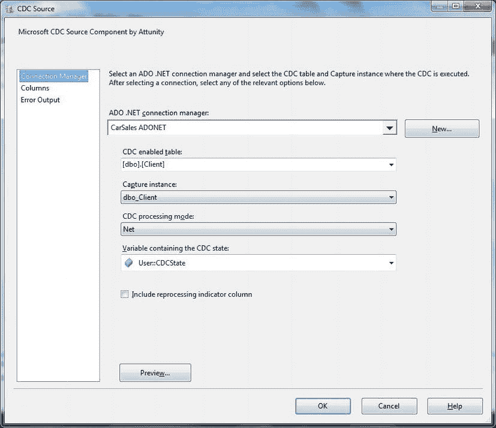
    图 12-7。 CDC 源对话框
26. 添加一个 CDC 拆分器任务（在 SSIS 工具箱中，位于 Other Transforms 中），并将 CDC 源任务连接到它。
27. 添加一个 OLEDB 目标任务，并将 CDC 拆分器连接到它。将其命名为 `Inserts`，并从 CDC 拆分器任务中选择 `InsertOutput` 作为要使用的输出。
28. 配置 OLEDB 目标任务如下：
    | 名称 | `Inserts` |
    | OLEDB Connection Manager | `CarSales_Staging_OLEDB` |
    | Data Access Mode | `Table or view – Fast Load` |
    | Name of Table or View | `dbo.Client_CDCSSIS` |
29. 映射所有数据列（***不是***那些由 CDC 使用并以 `__` 开头的列）并点击确定。
30. 添加一个 OLEDB 目标任务，并将 CDC 拆分器连接到它。将其命名为 `Deletes`，并从 CDC 拆分器任务中选择 `DeleteOutput` 作为要使用的输出。配置 OLEDB 目标任务如下：
    | 名称 | `Deletes` |
    | OLEDB Connection Manager | `CarSales_Staging_OLEDB` |
    | Data Access Mode | `Table or view – Fast Load` |
    | Name of Table or View | `dbo.CDC_Client_Deletes` |
31. 仅映射 `ID` 列并点击确定。
32. 添加一个 OLEDB 目标任务，并将 CDC 拆分器连接到它。选择 `UpdateOutput` 作为要使用的输出。将其命名为 `Updates`，并配置 OLEDB 目标任务如下：
    | 名称 | `Updates` |
    | OLEDB Connection Manager | `CarSales_Staging_OLEDB` |
    | Data Access Mode | `Table or view – Fast Load` |
    | Name of Table or View | `dbo.CDC_Client_Updates` |
33. 映射所有数据列（但不包括 CDC 特定的列——那些以双下划线开头的列）并点击确定。数据流应如 图 12-8 所示。
    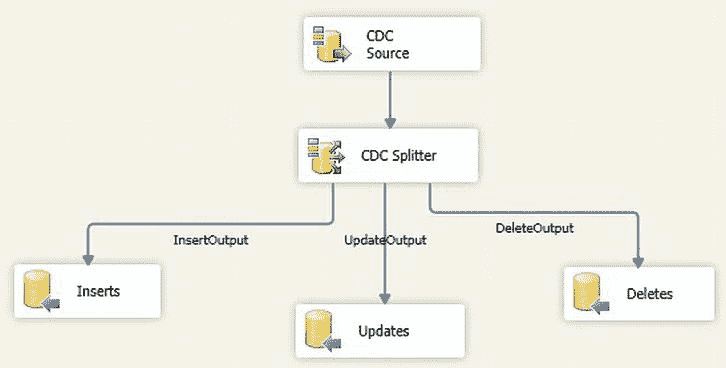
    图 12-8。 CDC upsert 过程
34. 返回控制流窗格。添加一个 CDC 控制任务，将其命名为 `Set end LSN`。


## 在 SSIS 中实现 CDC

将数据流任务连接到它，并像配置“获取起始 LSN” CDC 控制任务一样进行配置，只是要确保选择“标记已处理范围”作为 CDC 控制操作。

35. 添加一个执行 SQL 任务。将“设置结束 LSN” CDC 控制任务连接到它。按如下配置：

| 名称 | 更新语句 |
| --- | --- |
| 连接类型 | OLEDB |
| 连接管理器 | `CarSales_Staging_OLEDB` |
| SQL 语句 | `UPDATE D` |
| | `C:\SQL2012DIRecipes\CH11\SSISCDCUpdates.Sql` |
| | `SET` |
| | `D.ClientName = S.ClientName` |
| | `,D.Address1 = S.Address1` |
| | `,D.Address2 = S.Address2` |
| | `,D.Town = S.Town` |
| | `,D.County = S.County` |
| | `,D.PostCode = S.PostCode` |
| | `,D.Country = S.Country` |
| | `,D.ClientType = S.ClientType` |
| | `,D.ClientSize = S.ClientSize` |
| | `,D.ClientSince = S.ClientSince` |
| | `,D.IsCreditWorthy = S.IsCreditWorthy` |
| | `,D.DealerGroup = S.DealerGroup` |
| | `,D.MapPosition = S.MapPosition` |
| | `FROM CarSales.dbo.client D` |
| | `INNER JOIN dbo.CDC_Client_Updates S` |
| | `ON S.ID = D.ID` |

36. 添加一个执行 SQL 任务。将你命名为 `Updates` 的执行 SQL 任务连接到它。按如下配置：

| 名称 | 删除语句 |
| --- | --- |
| 连接类型 | OLEDB |
| 连接管理器 | `CarSales_Staging_OLEDB` |
| SQL 语句 | `DELETE D` |
| | `FROM CarSales.dbo.client D` |
| | `INNER JOIN dbo.CDC_Client_Deletes S` |
| | `ON S.ID = D.ID` |

现在你可以运行该包了（它看起来应如 图 12-9 所示）。对源数据所做的任何修改都将反映在目标表中。

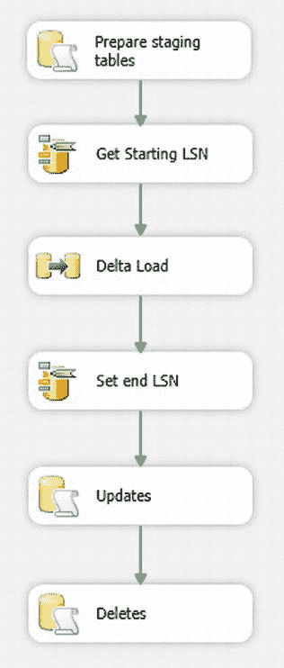
图 12-9。完整的 CDC 流程

### 工作原理

SQL Server 2012 的一个新特性是能够“直接”从 SSIS 使用变更数据捕获（无需将 SSIS 作为包装器来调用纯 T-SQL 技术）。此方法使用 Attunity 开发的三个 SSIS 任务，如 表 12-1 所示。

表 12-1。用于变更数据捕获的 SSIS 任务

| 元素 | 类型 | 描述 |
| --- | --- | --- |
| CDC 控制任务 | 任务 | 使用 LSN 处理要处理的数据范围。 |
| CDC 源 | 数据源 | 连接到启用了 CDC 的表。 |
| CDC 分流器 | 转换 | 根据数据修改的类型（插入、更新或删除）拆分数据输出。 |

重要的是要理解，基于 CDC 的流程需要一个初始的“同步”加载，将所有数据从源表复制到目标表，并存储所使用的结束 LSN，这样此后只会将增量数据从源传输到目标。这几乎总是最好作为一个单独的 SSIS 包来处理。执行初始加载后，你可以使用 SSIS 通过 CDC 保持源表和目标表的同步。

如你所见，SSIS 本质上是底层 CDC 过程的一个接口。由于该过程本身已在配方 12-4 中描述，我在此不再赘述，而是请你回看前几页。

CDC 状态表包含的数据类似于 图 12-10。

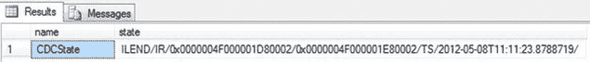
图 12-10。CDC 状态表

我不建议修改此表，而是建议你别动它。这个存储 CDC 状态的表可以放在任何可用的数据库中，不必与源或目标数据库相同。`CDC_Client_Updates` 和 `CDC_Client_Deletes` 表具体放在哪里完全由你决定。

我倾向于将它们放在一个临时表中，以免弄乱最终数据库——但这取决于你选择（或受限）的体系结构。

CDC 分流器任务本质上是一个配置非常巧妙且完全锁定的条件分流任务。你无法向其添加输出或列。但是，如果你愿意，可以在目标表中使用 CDC 特定的列（`__$start_lsn`、`__$operation` 和 `$__update_mask`）。在这种情况下，你可能还希望将 `InsertOutput` 发送到临时表以进行进一步处理。

### 提示、技巧和陷阱

*   如果需要，你可以向此包的开始添加一个执行 SQL 任务来截断目标表——以防你需要多次运行它。
*   我知道最佳实践规定我们使用 SQL 只 `SELECT` 将成为数据流一部分的列，但根据我的经验，CDC 几乎总是传输所有列——因此我选择了更简单的源数据选择解决方案，即获取整个表。
*   在生产环境中，你无疑需要在初始加载前删除索引，并在之后重新创建它们。
*   如果你在包级别创建连接管理器，那么它们可以在初始加载包和增量数据加载包中重复使用——假设两个包都在同一个项目中。

## 将变更数据捕获与 Oracle 源数据结合使用

### 问题

你希望以最小的影响检测 Oracle 源数据库上的数据变更，并仅将修改应用到 SQL Server 目标数据库。

### 解决方案

使用随 SQL Server 2012 企业版提供的 Oracle-CDC 工具，挖掘 Oracle 重做日志以获取被跟踪表中数据的更改，然后使用相关的数据修改更新 SQL Server 表。以下说明如何安装和使用它们。

1.  在你的 SQL Server 安装媒体上找到 `Tools\AttunityCDCOracle\x64\1033` 目录，并运行文件 `AttunityOracleCdcDesigner.msi` 和 `AttunityOracleCdcService.msi`。
2.  除非 Oracle 源已设置为在 `ARCHIVELOG` 模式下运行，否则请运行 SQL*Plus（以 SYSDBA 登录）并执行以下命令（`C:\SQL2012DIRecipes\CH11\OracleArchivelog.Sql`）：

    ```sql
    SHUTDOWN IMMEDIATE;
    STARTUP MOUNT;
    ALTER DATABASE ARCHIVELOG;
    ALTER DATABASE OPEN;
    ALTER DATABASE ADD SUPPLEMENTAL LOG DATA;
    ```

3.  单击 开始  所有程序  Attunity 的 Oracle 变更数据捕获  Oracle CDC 服务配置。这将运行 Attunity 的 Oracle 变更数据捕获服务配置 MMC 管理单元。
4.  单击 操作  准备 SQL Server。输入或选择一个 SQL Server 实例，并定义身份验证模式和任何必要的参数。对话框应如 图 12-11 所示。

    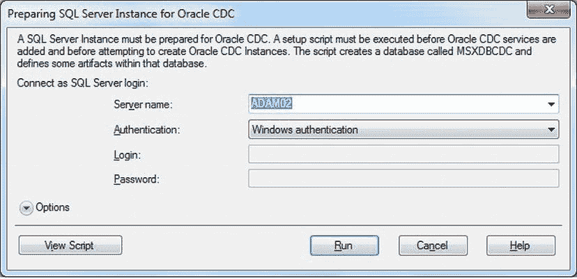
    图 12-11。Attunity 的 Oracle CDC 服务配置 MMC 管理单元的“准备 SQL Server”对话框

5.  单击 运行 并确认。将在所选服务器上创建 MSXDBCDC 数据库。
6.  单击 操作  新建服务 并定义一个新的 Oracle CDC 服务。我建议保留创建过程建议的服务名称，但你必须记住添加主密码并定义关联的 SQL Server 实例。对话框应如 图 12-12 所示。

    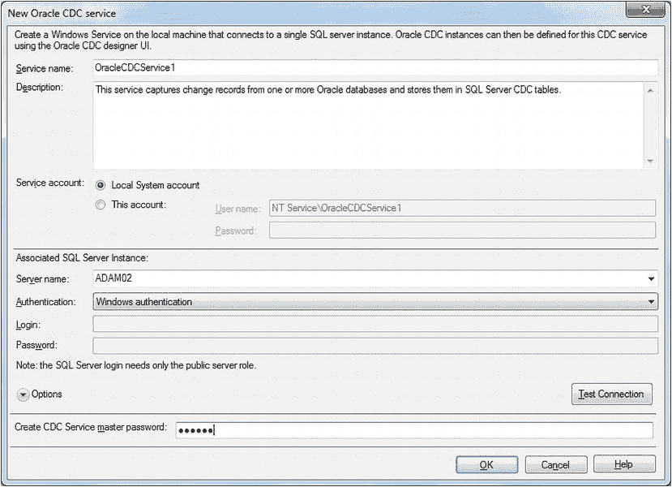
    图 12-12。创建新的 Oracle CDC 服务

7.  关闭 Attunity 的 Oracle 变更数据捕获服务配置 MMC 管理单元。
8.  你现在需要创建一个 CDC 实例。单击 开始 ！


### 配置 Oracle CDC 实例

9.  `连接到 SQL Server`对话框出现。输入或选择一个服务器名称，并选择一种身份验证模式及任何必需的参数（参见图 12-13）。
    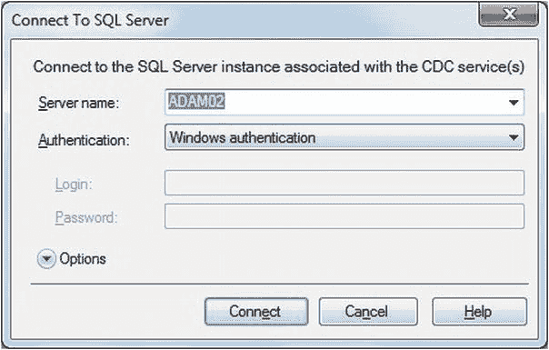
    图 12-13. Oracle CDC 设计器配置 MMC 管理单元中的 `连接到 SQL Server` 对话框

10. 点击 `连接`。您现在将运行 Oracle CDC 设计器配置 MMC 管理单元。

11. 在左窗格中点击服务，右键单击，然后选择 `新建 Oracle CDC 实例`。输入一个 Oracle CDC 实例名称，然后点击 `创建数据库`。默认情况下，数据库将与实例同名，但您可以更改数据库名称。对话框应如图 12-14 所示。
    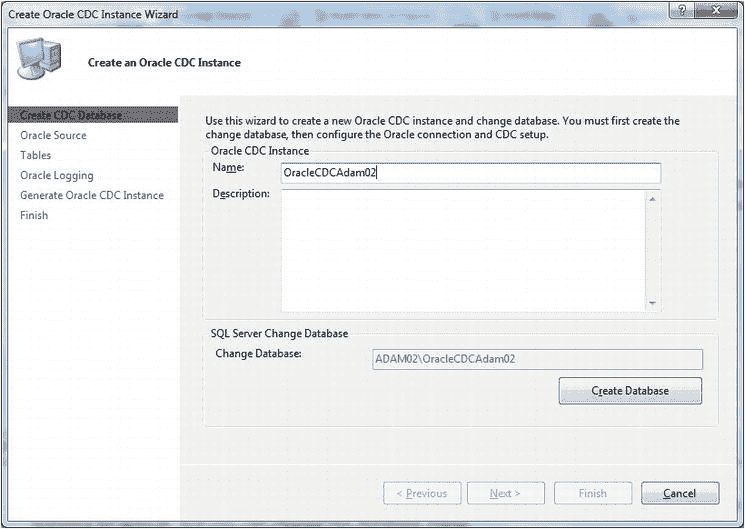
    图 12-14. 创建 Oracle CDC 实例向导的“创建 CDC 数据库”窗格

12. 点击 `下一步`，并在“Oracle 源”窗格中定义 Oracle 连接参数。幸运的是，该对话框友好且有帮助（可见于图 12-15）。
    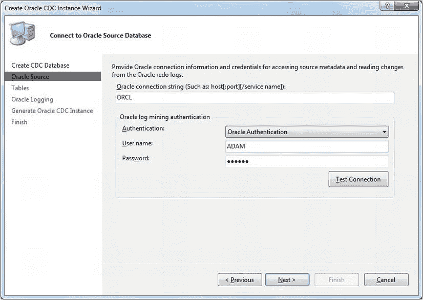
    图 12-15. 创建 Oracle CDC 实例向导的“Oracle 源”窗格

13. 点击 `下一步`。向导的“表”窗格出现。

14. 点击 `添加`。输入或选择一个数据库架构，然后点击 `搜索` 以显示可用的表。选择任何您希望用作数据源的表。对话框应类似于图 12-16。
    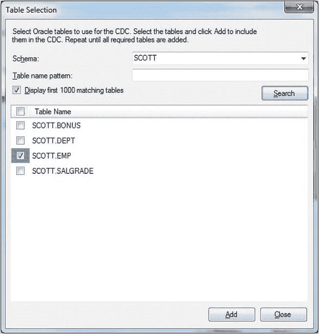
    图 12-16. 在 Oracle 中选择源表

15. 点击 `添加`，然后点击 `确定` 确认每个表。所有表添加完毕后，点击 `关闭`。您将返回到向导的“表”窗格，其中列出了所选的表。对话框应如图 12-17 所示。
    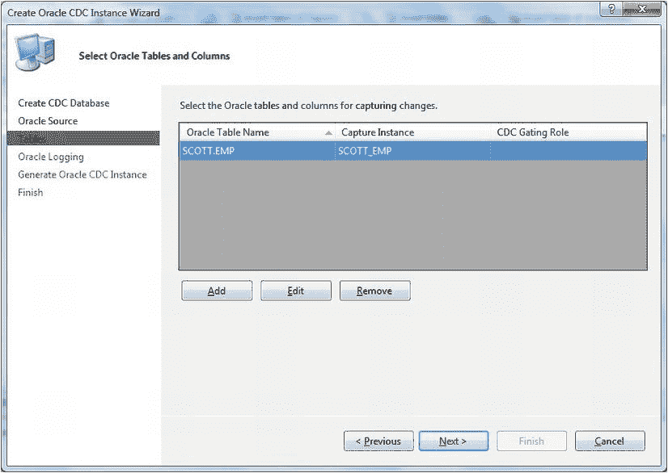
    图 12-17. 为 Oracle CDC 选择的表

16. 点击 `下一步`。`Oracle 日志记录` 对话框将出现，类似于图 12-18。
    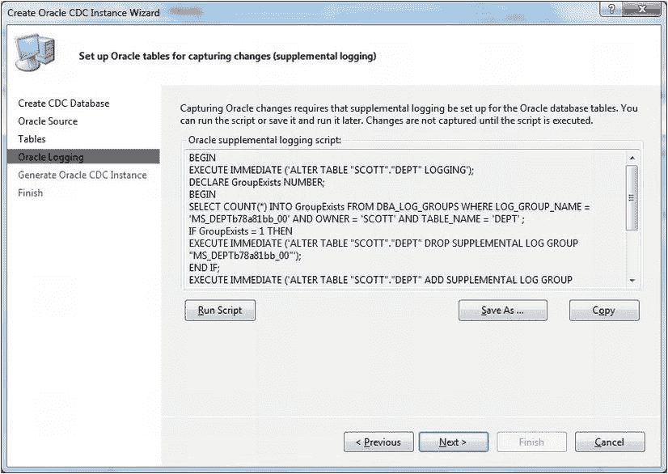
    图 12-18. “Oracle 日志记录”窗格

17. 点击 `运行脚本`。在对话框中确认（或修改）连接元素（参见图 12-19）。
    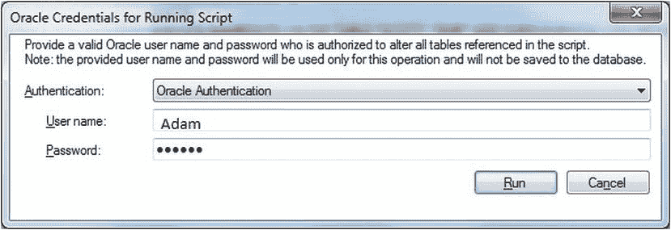
    图 12-19. 用于运行 CDC 脚本的 Oracle 凭据

18. 点击 `运行`。您应该会看到一个对话框，确认补充日志脚本已成功运行。点击 `确定` 确认此对话框，然后点击 `下一步`。

19. 点击 `运行` 以在 SQL Server 数据库中生成启用 CDC 的目标表。此过程运行后，对话框应如图 12-20 所示。
    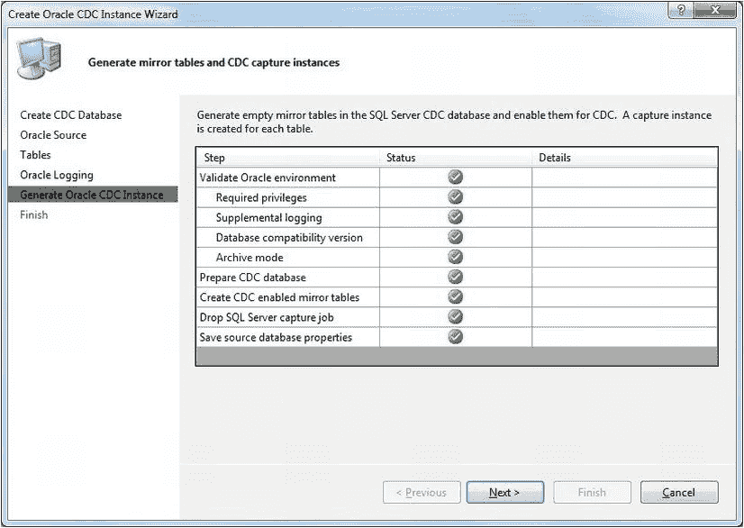
    图 12-20. “生成 Oracle CDC 实例”窗格——在 SQL Server 中成功生成“镜像”表后

20. 点击 `下一步`，然后在最终对话框中点击 `完成`（参见图 12-21）。
    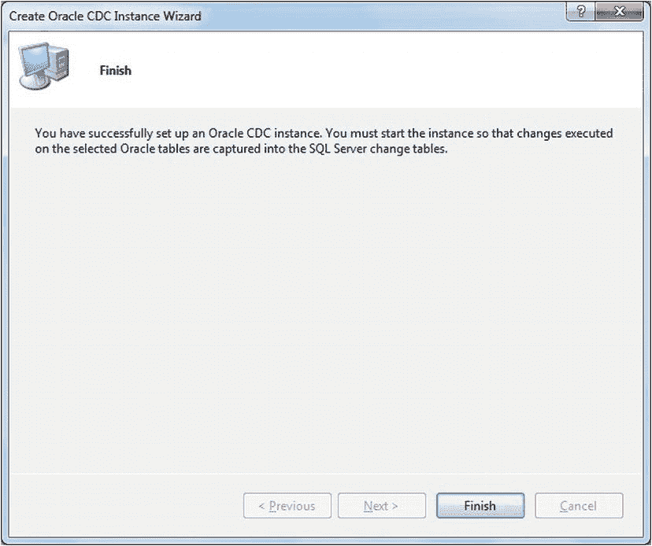
    图 12-21. 最终向导对话框，确认 Oracle CDC 已设置

21. 您现在需要同步源和目标数据库——就像之前处理变更数据捕获的配方一样。确保已防止对 Oracle 源表进行任何更改，然后将数据从源表复制到 SQL Server 中的“镜像”目标表（Attunity 的称呼）。您可以通过展开在 CDC 配置中创建的目标 SQL Server 数据库中的“表”来查看这些表（参见图 12-22）。
    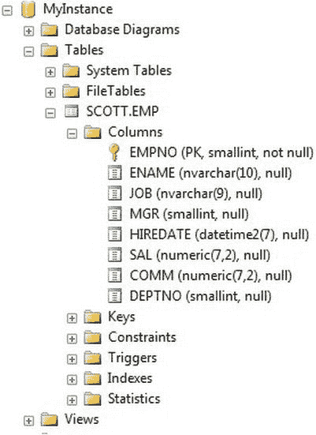
    图 12-22. SQL Server 中的镜像表

22. 您现在已准备好实例化变更数据控制。为此，在变更数据捕获 MMC 中右键单击实例名称，然后选择 `启动`。这如图 12-23 所示。
    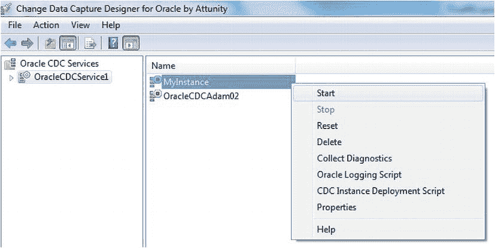
    图 12-23. 启动 Oracle 的 CDC

    这将同步 SQL Server 目标表中的数据与 Oracle 源表中的数据。之后，每次希望同步数据时，都可以运行步骤 22。

### 工作原理

本质上，用于 Oracle CDC 的 Attunity 工具是对 Microsoft 针对 SQL Server 方法的巧妙模仿。与纯 Microsoft CDC 技术一样，通过读取源数据库日志来检测更改，然后将这些更改写入目标数据库，其格式与 MS CDC 中使用的格式相同。

您可以通过在变更数据捕获设计器中单击实例来监控变更数据捕获过程处理的更改。它将向您显示有关事务数量和状态的有用数据（参见图 12-24）。
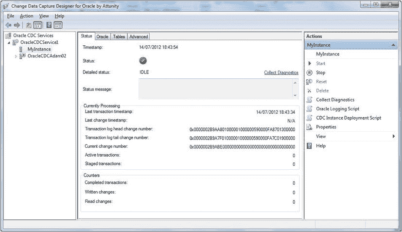
图 12-24. 监控 Oracle CDC

存储变更数据历史的表是一个名为`cdc. <Schema> _ <TableName> _CT`的系统表。它如图 12-25 所示。
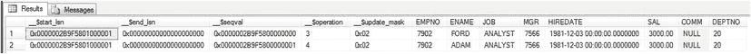
图 12-25. Oracle CDC 系统变更表

### 提示、技巧和陷阱

*   这些 Attunity 工具仅适用于 SQL Server 的企业版。
*   当您安装两个 Attunity `.msi`包时，您可能觉得好像什么都没发生。点击“开始” > “所有程序”以确保您能看到“Change Data Capture for Oracle by Attunity”，其中应包含“Oracle CDC designer configuration”（这也应在开始菜单中）和“Oracle CDC service configuration”。
*   当然，如果您在 32 位版本的 SQL Server 企业版上运行，也可以安装这些工具的 32 位版本。我只是推测这种情况不太可能发生。
*   在步骤 14，您可以输入全部或部分表名以限制搜索源表时返回的表列表。

#### 总结

在本章中，您了解了两种允许在源和目标数据库之间同步数据，同时仅对目标应用所需的插入、更新和删除的技术。第一种技术“变更跟踪”适用于所有版本的 SQL Server。它是一个同步过程，仅跟踪记录已更改的事实。


