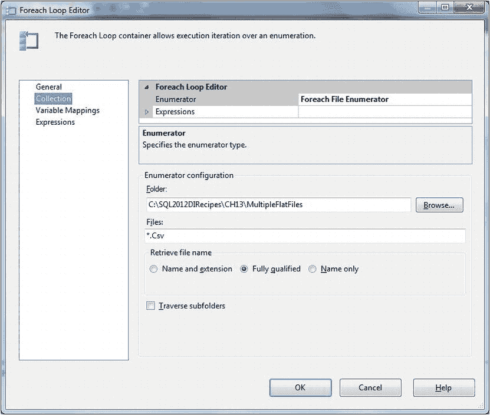
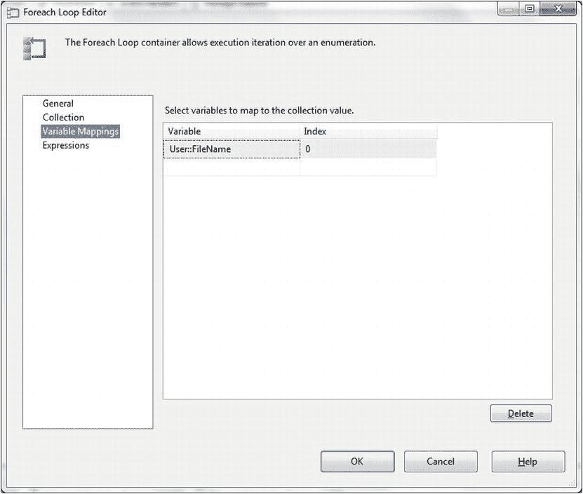
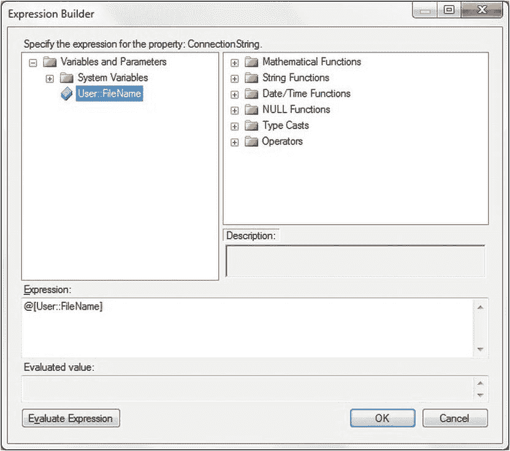
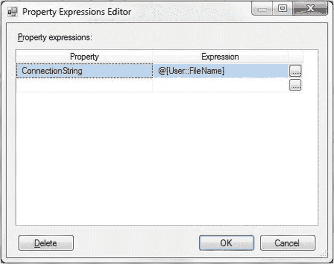
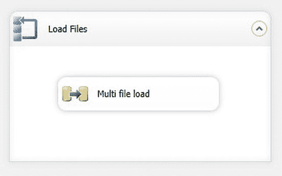

# 第 13 章

## 组织与优化数据加载

第二种技术是变更数据捕获，它读取 SQL Server 事务日志（甚至 Oracle 重做日志），能够跟踪最细粒度的顺序数据变更——尽管本书以 ETL 为重点，不需要如此详细的级别。然而，变更数据捕获仅在 SQL Server 的企业版中可用。你选择实现哪一种将取决于你的需求和 SQL Server 许可证。两者都稳健高效。我只能敦促你测试两者，从而为你的 ETL 武器库增添两个极其强大的工具。

一旦你成功将一组数据加载到 SQL Server 中，下一个挑战就是如何自动、更快、更顺畅、更轻松地加载它。除此之外，你还希望你的流程尽可能可靠地运行，尽量减少人工干预。这可能涉及多种技术，例如：

*   处理用于串行加载的多个相同源文件。
*   从一个或多个目录加载多个文件。
*   排序文件加载（例如，按文件大小加载）。
*   设置并行文件加载——并将文件分派到多个进程，尽可能实现负载均衡。
*   从单个 OLEDB 或 ADO.NET 数据源并行加载数据。
*   使用并行 `Bulk Insert` 减少加载时间。
*   创建高效的并行读写负载（也称为从多个并发源写入同一张表）。
*   处理批量加载。

这些技术中有许多方面可以互换，因此我鼓励你在决定最佳方法之前全面考虑它们，以使你的 ETL 挑战不那么成问题，而更成为一个令人满意的解决方案。然后，你可以混合搭配这些方法的相关部分，生成适合你需求的解决方案。

本章仅探讨这些纯粹的“结构性”技术。在现实世界中，你还必须处理索引，以及如何在 ETL 流程中使用索引以及何时使用；在加载数据时如何最好地处理约束和锁；当然，还有日志记录和恢复。这些元素将在下一章中单独讨论。

本章不会深入介绍如何配置源和目标连接管理器。也不会详尽描述如何设置数据流任务、数据源和目标。这些——以及 SSIS 数据加载的其他基础方面——已在前面的章节中有所涉及，特别是第 2 章关于平面文件源，以及第 4 章和第 5 章关于 SQL Server 和其他 RDBMS 源。如果你需要这些信息，请查阅相应的章节。

为了避免无谓的重复，除了方法 13-1 之外，我不详细说明“经典”多文件加载的所有复杂细节。因此，我建议你在尝试方法 13-2 到 13-6 之前先浏览一下这个方法，它们是加载多个源文件的一些不同扩展方式。

一如既往，本章使用的示例可在本书的配套网站上找到。下载后，它们位于 `C:\SQL2012DIRecipes\CH13` 目录中。

### 13-1. 加载多个文件

#### 问题

你有一个包含 CSV 格式平面文件的目录需要加载到 SQL Server 中。

#### 解决方案

使用 SSIS 和一个 Foreach 循环容器，步骤如下。

1.  打开 SSIS 并创建一个新包。我建议将其命名为 `MultipleFileLoad`，因为这正是它要做的事情。
2.  在包级别添加一个变量。将该变量命名为 `FileName`。类型为字符串。
3.  在“连接管理器”选项卡中右键单击，然后选择“新建平面文件连接”。
4.  命名连接管理器（我将它命名为 `Stock Files`）。
5.  单击“浏览...”按钮，导航到包含要加载文件的目录 (`C:\SQL2012DIRecipes\CH13\MultipleFlatFiles`)。选择其中一个文件（本例中为 `Stock01.Csv`）。确保输入所有相关的配置信息（在本例中，SSIS 会正确猜出所有信息）。单击左侧的“列”以确保列映射正确，然后单击“确定”。
6.  在项目级别添加一个连接到 CarSales 数据库的 OLEDB 连接管理器（如果你已经有一个则不需要添加）。
7.  在“控制流”窗格上添加一个 Foreach 循环容器。将其命名为 `Load Files`，然后双击进行编辑。
8.  在左侧选择“集合”，并将枚举器类型选为 Foreach 文件枚举器。
9.  单击“浏览...”按钮，导航到包含要加载文件的目录 (`C:\SQL2012DIRecipes\CH13\MultipleFlatFiles`)。
10. 在“文件”字段中，输入文件和/或扩展名筛选器以限制将要枚举的文件（本例中为 `*.Csv`）。单击“完全限定”单选按钮以返回完整路径和文件名。结果对话框应如图 13-1 所示。
    
    图 13-1。用于从同一目录加载多个文件的 Foreach 循环
11. 在左侧选择“变量映射”。选择 `FileName` 作为要使用的变量（参见图 13-2）。
    
    图 13-2。定义用于待加载文件的变量
12. 单击“确定”关闭对话框。
13. 在 Foreach 循环容器内添加一个数据流任务，并将其配置为从平面文件源加载到目标表（本例中为 `CarSales.dbo.Stock`）。这在方法 2-2 中有详细描述，但在此方法中你将使用 `Stock01.Csv` 文件作为源。
14. 单击你在步骤 4 中创建的名为 `Stock Files` 的平面文件连接管理器，并显示属性窗口（按 F4），如果尚未显示的话。
15. 在“表达式”属性中，单击省略号按钮以显示“表达式”对话框。
16. 在“属性”列中，选择“连接字符串”。
17. 单击“连接字符串”属性的省略号按钮以显示“表达式生成器”对话框。
18. 展开变量列表，并将 `User::FileName` 变量拖到“表达式”字段中。你的对话框应如图 13-3 所示。
    
    图 13-3。将文件名设置为多文件加载的表达式
19. 单击“确定”关闭对话框。你将返回到“属性表达式编辑器”对话框，它应如图 13-4 所示。
    
    图 13-4。将连接字符串设置为表达式
20. 单击“确定”关闭对话框。你现在已经告诉 SSIS 使用 `FileName` 变量中找到的文件名，而不是你在设置连接管理器时最初使用的硬编码文件名。你的任务应如图 13-5 所示。
    
    图 13-5。最终的多文件加载包
21. 运行该包。

假设所有设置都正确，那么源目录中的所有文件都应加载到目标表中。

