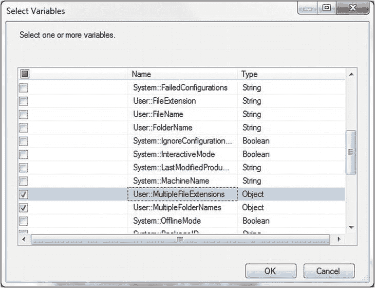
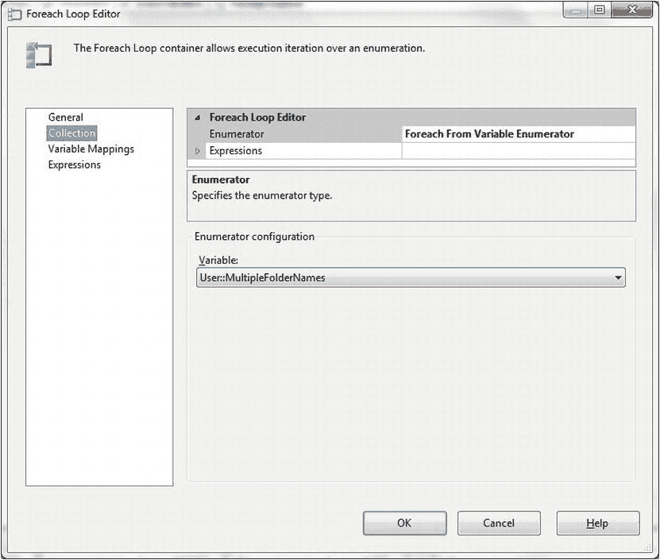
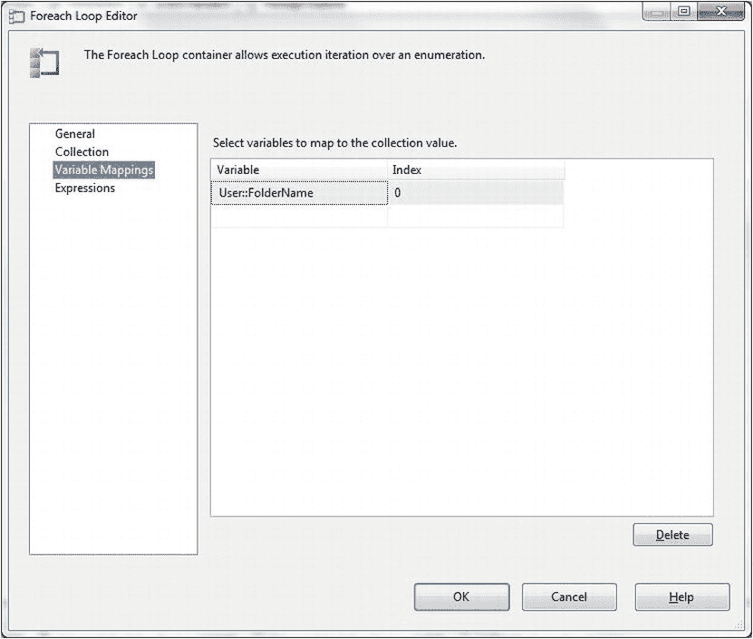
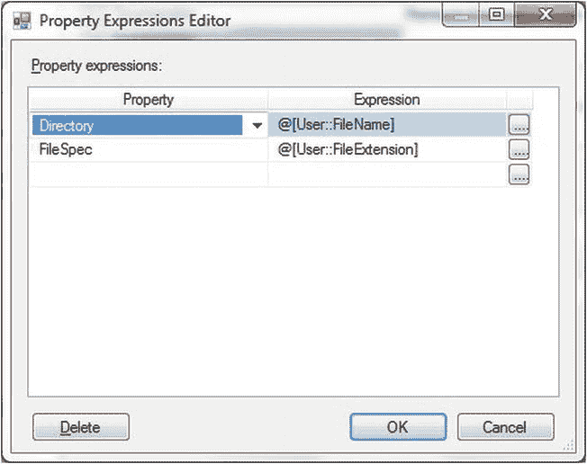
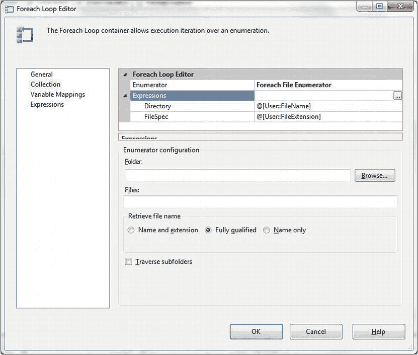
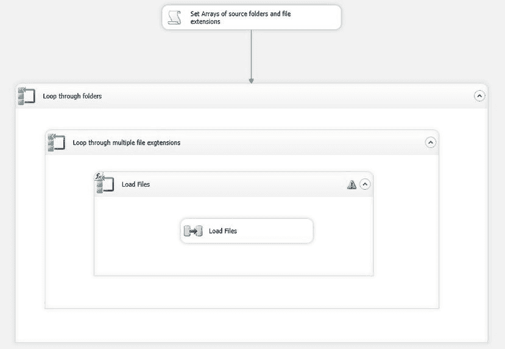

# 13-3. 使用复杂选择标准加载多个文件

## 问题

你有许多包含相同格式平面文件的目录需要加载到 SQL Server 中。更复杂的是，这些文件具有不同的扩展名。你希望能够轻松修改这些参数。

## 解决方案

使用 SSIS 和脚本数组来定义源文件夹和文件扩展名。然后遍历这些数组以指定要加载的文件。以下步骤涵盖了要遵循的过程。

1.  创建一个 SSIS 包，并将其命名为 `MultipleFilesFromVariousDirectories`。
2.  添加以下变量：

    | 变量名 | 类型 | 值 | 注释 |
    | --- | --- | --- | --- |
    | FileName | String | | 保存将要加载的文件的名称。 |
    | FileExtension | String | | 保存将要加载的文件的扩展名。 |
    | FolderName | String | | 保存将要加载的文件所在的文件夹/目录。 |
    | MultipleFileExtensions | Object | | 将用于过滤文件的各种扩展名的数组。 |
    | MultipleFolderNames | Object | | 将用于过滤文件的各种文件夹的数组。 |

3.  在控制流窗格上添加一个脚本任务，并双击进行编辑。将其命名为“设置源文件夹和文件扩展名的数组”，并将脚本语言设置为 Microsoft Visual Basic 2010。
4.


添加以下读/写变量：`MultipleFileExtensions`、`MultipleFolderNames`。

最简单的方法是点击读/写变量右侧的省略号按钮，并选择所需的变量。这将打开如下对话框（参见图 13-6）。



图 13-6. 为脚本任务选择读/写变量

5.  点击确定（OK）确认。
6.  点击编辑脚本（Edit Script）按钮。
7.  将`Main`方法替换为以下代码。此脚本的说明在本教程末尾（`C:\SQL2012DIRecipes\CH13\SSISComplexSelection.Vb`）：

    ```
    Public Sub Main()
        ' 声明并填充一个包含文件夹名称的数组
        Dim MultipleFolderNames As New System.Collections.ArrayList()
        MultipleFolderNames.Add("C:\SQL2012DIRecipes\CH13\MultipleFlatFiles")
        MultipleFolderNames.Add("C:\SQL2012DIRecipes\CH13\MoreMultipleFlatFiles")

        ' 声明并填充一个包含文件扩展名的数组
        Dim MultipleFileExtensions As New System.Collections.ArrayList()
        MultipleFileExtensions.Add("*.Csv")
        MultipleFileExtensions.Add("*.txt")

        ' 将数组传递给 SSIS 变量
        Dts.Variables("MultipleFileExtensions").Value = CObj(MultipleFileExtensions)
        Dts.Variables("MultipleFolderNames").Value = CObj(MultipleFolderNames)

        Dts.TaskResult = ScriptResults.Success
    End Sub
    ```

    当然，您需要输入与您的环境相对应的文件夹名称和文件筛选器及/或扩展名。
8.  关闭 SSIS 脚本窗口，然后点击确定（OK）关闭脚本任务编辑器（Script Task Editor）。
9.  在控制流（Control Flow）窗格上添加一个 Foreach 循环容器，将其命名为`Loop through all folders`，将“Set Arrays of source folders and File extensions”脚本任务连接到此容器，然后双击编辑该 Foreach 循环容器。
10. 点击左侧窗格中的集合（Collection）。将枚举器类型选择为 Foreach From Variable Enumerator（从变量枚举）。
11. 在对话框的下半部分（枚举器配置，Enumerator Configuration），选择`MultipleFolderNames`变量。对话框应如图 13-7 所示。

    

    图 13-7. 使用 Foreach 任务遍历对象变量
12. 点击左侧窗格中的变量映射（Variable Mappings），然后从列表中选择`FolderName` SSIS 变量。对话框应如图 13-8 所示。

    

    图 13-8. 使用变量来保存要使用的文件夹
13. 点击确定（OK）确认。
14. 在控制流（Control Flow）窗格上添加另一个 Foreach 循环容器，但这次放在您刚刚创建的 Foreach 循环容器（`Loop through all folders`）内部，将其命名为`Loop through multiple file extensions`。双击进行编辑。
15. 重复步骤 10-14，以定义 Foreach 循环容器如何遍历集合，但这次使用`MultipleFileExtensions`枚举器和`FileExtension`变量。
16. 在您刚刚创建的 Foreach 循环容器（`Loop through multiple file extensions`）内部添加一个 Foreach 循环容器，将其命名为`Load Files`，并像加载单个目录中的所有文件（如教程 12-1 所述）那样进行配置。双击编辑此容器。
17. 点击左侧窗格中的集合（Collection），然后点击表达式（Expressions）的省略号按钮。
    选择以下属性并按如下方式设置：
    *   目录（Directory）: `User::FolderName`
    *   文件规范（FileSpec）: `User::FileExtension`

    属性表达式编辑器（Property Expressions Editor）应大致如图 13-9 所示。

    

    图 13-9. 用于从 SSIS 变量获取文件夹和扩展名的属性表达式编辑器
18. 点击确定（OK）关闭对话框。Foreach 循环编辑器（Foreach Loop Editor）应如图 13-10 所示。

    

    图 13-10. 在 Foreach 任务中使用表达式
19. 点击确定（OK）关闭对话框。
20. 添加一个数据流任务（Data Flow task）（同样如教程 13-1 所述），并将其配置为从平面文件源（Flat File source）（`C:\SQL2012DIRecipes\CH13\MultipleFlatFiles\Stock01.Csv`）加载到`CarSales.dbo.Stock`目标表，如教程 13-1 的步骤 13 所述。SSIS 包的控制流（Control Flow）窗格应如图 13-11 所示。

    

    图 13-11. 从多个目录加载多个文件的完整包

您现在可以运行该包，加载`C:\SQL2012DIRecipes\CH13\MultipleFlatFiles`和`C:\SQL2012DIRecipes\CH13\MoreMultipleFlatFiles`目录中的所有`.Txt`和`.Csv`文件。

## 工作原理

SSIS“开箱即用”就可以加载目录中的所有文件。十有八九，这将解决您所有的文件加载需求。对于简单的多文件选择，您还可以使用多个平面文件连接管理器（Multiple Flat Files Connection manager），如教程 13-2 所述。然而，很可能还有其他情况，源文件位于`几个不同的目录`中（可能在不同的服务器上）；或者具有`不同的文件扩展名`（例如，文本文件，但来自不同的进程或命名人员，可能命名为`.CSV`或`.TXT`），或者需要某些特定类型的文件名而非其他，并且需要多个文件筛选器来确保仅包含您可以处理的文件。

幸运的是，在 SSIS 中只需稍作调整并付出最少的努力，就可以处理多个源文件。在本教程中，我建议使用数组作为硬编码项目列表（如目录名和文件扩展名）的存储库。这正是此方法有趣的地方。之后，只需将文件加载循环嵌套在另外两个循环内即可——一个用于循环遍历文件路径，另一个用于循环遍历文件筛选条件。虽然这看起来可能有些复杂，但它是扩展多文件加载技术以处理多种可能需求的简单方法。实际上，我建议将此处描述的方法作为大多数复杂文件选择过程的基础。

我创建并使用了多个 SSIS 变量，以允许 SSIS 遍历一组文件夹和文件扩展名。首先，您必须有两个字符串变量：一个用于保存目录（SSIS 称之为“文件夹”）名称，另一个用于保存文件扩展名。您还需要一个字符串变量来保存正在加载的实际文件的文件名。最后，您需要两个对象变量：一个用于保存目录名称列表，另一个用于包含文件扩展名列表。

关于脚本代码只有几点需要注意。首先，您使用的是标准的.NET 数组，并使用`.Add`来填充它们。其次，一旦创建了数组，您需要将它们传递给 SSIS 变量，以便可以在脚本任务外部使用它们。


虽然严格来说，并非必须将它们转换为对象，但我认为在代码中提醒自己——实际上正在发生什么——是更好的实践规范。

**注意** 您希望加载的这些文件有一个根本的共同点：它们***必须***具有相同的格式。如果源文件的结构不完全相同，那么您将需要为每种源文件格式分别设置一个源组件和目标组件对。

#### 提示、技巧与陷阱

*   不可避免地，从多个文件夹加载文件以及处理多种可能的文件扩展名，会存在多种方法。实际上，可能有多少编码员就有多少种解决方案。因此，请不断调整和测试，直到找到令您满意的解决方案。例如，纯粹主义者可能会反对在脚本组件中硬编码值。一个更灵活（但需要更多工作）的方法是使用一个制表符分隔的参考文件（数据库表或 XML 文件），其中包含文件夹和文件扩展名。然后将此参考文件或表加载到 SSIS 对象（记录集）中，这样单个 `Foreach Loop` 容器就可以遍历这些元素，同时将它们分配给文件夹和筛选变量。这种方法也消除了对嵌套循环的需求。总之，您可以选择并调整自己觉得最顺手的方法。
*   由于您已为路径和文件筛选器设置了变量，您会看到 `Load Files` 任务的一个警告。这无需担心。
*   请记住使用 UNC（通用命名约定）路径作为服务器和目录名称，以确保可移植性。
*   有一点可能会令人困惑：对于 `Foreach Loop` 容器，您可以通过两种方式访问 SSIS 表达式——而每种方式会给出一组不同的变量。要使用文件路径和文件筛选器的变量，您需要在 `Foreach Loop Editor` 对话框的 `Collection` 窗格中使用变量——而不是通过单击对话框左侧的 `Expressions` 所进入的 `Expressions` 窗格。
*   本配方的方法最终得到的结果与配方 12-2 中解释的 `MULTIFLATFILE` 连接管理器类似。然而，当前配方的方法具有无限的灵活性和可扩展性。

