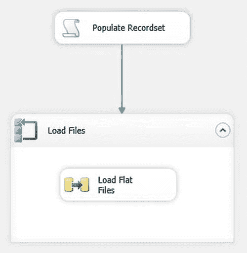

# 图 13-12 循环遍历 ADO.NET 对象

10. 在左侧选择“变量映射”（Variable Mappings）。选择 `User::FileName` 作为要使用的变量。
11. 点击“确定”（OK）。
12. 在 Foreach Loop 容器中添加一个数据流任务（Data Flow task），并像配置食谱 12-1 那样配置它（别忘了将平面文件连接管理器的连接字符串设置为表达式）。最终的程序包应如图 13-13 所示。

