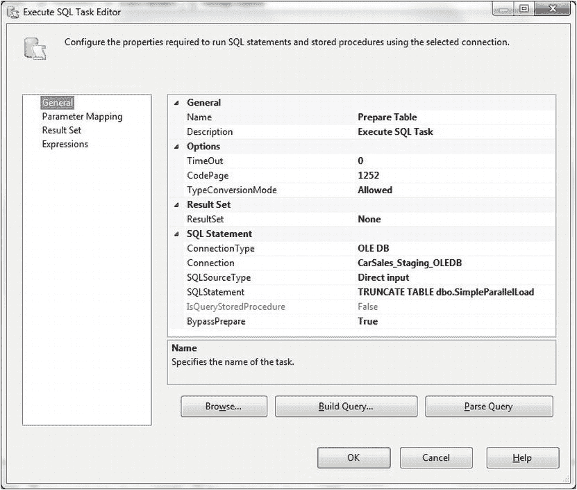
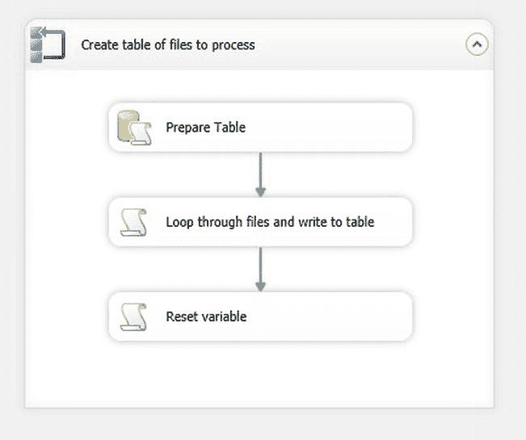

# 13-5. 并行加载多个平面文件

问题

你想从单个目录中结构相同的多个平面文件加载数据，希望比严格按顺序加载文件更快。

解决方案

按如下方式并行加载数据。

1.  在 SQL Server 中创建一个表来保存文件名，使用以下 DDL（`C:\SQL2012DIRecipes\CH13\tblSimpleParallelLoad.Sql`）：
    ```
    CREATE TABLE CarSales_Staging.dbo.SimpleParallelLoad
    (
     ID INT IDENTITY(1,1) NOT NULL,
     FileName VARCHAR (250) NULL,
     ProcessNumber  AS (ID%(4))
    ) ;
    GO
    ```
2.  在 SQL Server 中创建一个表来保存加载后的数据，使用以下 DDL（`C:\SQL2012DIRecipes\CH13\tblParallelStock.Sql`）：
    ```
    CREATE TABLE CarSales_Staging.dbo.ParallelStock
    (
     ID bigint IDENTITY(1,1) NOT NULL,
     Make VARCHAR (50) NULL,
     Marque NVARCHAR(50) NULL,
     Model VARCHAR (50) NULL,
     Colour TINYINT NULL,
     Product_Type VARCHAR (50) NULL,
     Vehicle_Type VARCHAR (20) NULL,
     Cost_Price NUMERIC(18, 2) NULL
    )
    ```
3.


## 主要步骤

将源文件列表输入到你在步骤 1 中创建的表（`SimpleParallelLoad`）中。当前示例中的 DDL 位于（`C:\SQL2012DIRecipes\CH13\PrepSimpleParallelLoad.Sql`）：
```sql
USE CarSales_Staging
GO
SET IDENTITY_INSERT dbo.SimpleParallelLoad ON
GO
INSERT dbo.SimpleParallelLoad (ID, FileName)
VALUES (1, N'C:\SQL2012DIRecipes\CH13\MultipleFlatFiles\Stock01.Csv')
GO
INSERT dbo.SimpleParallelLoad (ID, FileName)
VALUES (2, N'C:\SQL2012DIRecipes\CH13\MultipleFlatFiles\Stock02.Csv')
GO
INSERT dbo.SimpleParallelLoad (ID, FileName)
VALUES (3, N'C:\SQL2012DIRecipes\CH13\MultipleFlatFiles\Stock03.Csv')
GO
INSERT dbo.SimpleParallelLoad (ID, FileName)
VALUES (4, N'C:\SQL2012DIRecipes\CH13\MultipleFlatFiles\Stock04.Csv')
GO
SET IDENTITY_INSERT dbo.SimpleParallelLoad OFF
GO
```

4.  创建一个新的 SSIS 包，并将其命名为`SimpleParallelProcessing`。添加两个连接管理器——一个 OLEDB，一个 ADO.NET——它们将连接到用于加载数据和元数据的数据库（本例中为`CarSales_Staging`）。我将它们分别命名为`CarSales_Staging_OLEDB`和`CarSales_Staging_ADONET`。

5.  在任务级别添加以下变量及其初始值：

    | 变量名称 | 类型 | 值 | 注释 |
    | --- | --- | --- | --- |
    | `CreateList` | Boolean | String | 指示是否要删除并重新创建列表的标志。 |
    | `FileFilter` | String | *.CSV | 允许指定要使用的文件扩展名。 |
    | `FileSource` | String | `C:\SQL2012DIRecipes\CH13` | 允许指定要使用的文件目录。 |

    当然，如果你不完全遵循此示例，应使用你自己的文件筛选器和源目录。

6.  在“数据流”窗格上添加一个“序列容器”，并将其命名为`Create table of files to process`。

7.  在“序列容器”中添加一个“执行 SQL 任务”，并将其命名为`Prepare Table`。双击进行编辑。设置以下元素：
    *   **连接类型：** `OLEDB`
    *   **连接：** `CarSales_Staging_OLEDB`
    *   **SQL 语句：** `TRUNCATE TABLE dbo.SimpleParallelLoad`

    “执行 SQL 任务编辑器”对话框应如图 13-14 所示。

    

    图 13-14.  用于截断表的执行 SQL 任务

8.  点击“确定”进行确认。

9.  在刚创建的“执行 SQL 任务”下方的“序列容器”中添加一个“脚本组件”。将其命名为`Loop Through Files and Write to table`，并将“执行 SQL 任务”`Prepare Table`连接到它。

10. 双击进行编辑，将“脚本语言”设置为`Microsoft Visual Basic 2010`，并添加以下只读变量：
    *   `User::FileFilter`
    *   `User::FileSource`

11. 点击“编辑脚本”。

12. 将`Main`方法替换为以下内容（位于`C:\SQL2012DIRecipes\CH13\SimpleParallelLoad.Vb`）：
    ```vbnet
    Public Sub Main()
            Dim sqlConn As SqlConnection
            Dim sqlCommand As SqlCommand

            sqlConn = DirectCast(Dts.Connections("CarSales_Staging_ADONET"). _
                                 AcquireConnection(Dts.Transaction), SqlConnection)

            Dim FileSource As String = Dts.Variables("FileSource").Value.ToString
            Dim FileFilter As String = Dts.Variables("FileFilter").Value.ToString
            Dim dirInfo As New System.IO.DirectoryInfo(FileSource)
            Dim fileSystemInfo As System.IO.FileSystemInfo
            Dim FileName As String

            Dim sqlText As String

            For Each fileSystemInfo In dirInfo.GetFileSystemInfos(FileFilter)

                FileName = fileSystemInfo.Name
                sqlText = "INSERT INTO dbo.SimpleParallelLoad (FileName) VALUES('" & FileName & "')"
                sqlCommand = New SqlCommand(sqlText, sqlConn)
                sqlCommand.CommandType = CommandType.Text
                sqlCommand.ExecuteNonQuery()

            Next

            Dts.TaskResult = ScriptResults.Success

        End Sub
    ```

13. 关闭 SSIS 脚本任务窗口，然后单击“确定”以确认对“脚本组件”的修改。

14. 在刚创建的“脚本任务”下方的“序列容器”中添加一个“脚本组件”。将其命名为`Reset variable`，并将“`Loop Through Files and Write to table`”脚本组件连接到它。双击编辑这第二个“脚本组件”，并添加`CreateList`读/写变量。

15. 单击“编辑脚本”并将`Main`方法替换为以下内容：
    ```vbnet
    Public Sub Main()
           Dts.Variables("CreateList").Value = False
           Dts.TaskResult = ScriptResults.Success
    End Sub
    ```

16. 关闭 SSIS 脚本任务窗口，然后单击“确定”以确认你的修改。现在包的第一部分已完成，它将按需（重新）创建要处理的文件列表。SSIS 包应如图 13-15 所示。

    

    图 13-15.  并行加载包的初始部分

17. 现在开始实际的并行处理。在包级别添加以下变量：

    | 变量名称 | 类型 | 值 | 注释 |
    | --- | --- | --- | --- |
    | `Batch_0` | Object |  | 四个批次中的第一个。 |
    | `Batch_1` | Object |  | 四个批次中的第二个。 |
    | `Batch_2` | Object |  | 四个批次中的第三个。 |
    | `Batch_3` | Object |  | 四个批次中的第四个。 |
    | `FileName_Batch_0` | String |  | 批次一将加载的文件名。 |
    | `FileName_Batch_1` | String |  | 批次二将加载的文件名。 |
    | `FileName_Batch_2` | String |  | 批次三将加载的文件名。 |
    | `FileName_Batch_3` | String |  | 批次四将加载的文件名。 |

18. 在“序列容器”下方添加一个“执行 SQL 任务”，将后者连接到新任务，并将其重命名为`Prepare destination table`。双击进行编辑。设置以下元素：
    *   **连接类型：** `OLEDB`
    *   **连接：** `CarSales_Staging_OLEDB`
    *   **SQL 语句：** `TRUNCATE TABLE dbo.ParallelStock`

19. 单击“确定”进行确认。

20. 添加一个新的“平面文件连接管理器”，将其命名为`Process0`，并将其配置为连接到任一源文件。在此连接管理器的属性中，将其`ConnectionString`的表达式设置为`@[User::FileName_Batch_0]`（如配方 13-1，步骤 14 至 20 所述）。

21. 在“准备目标表”任务下方添加一个“执行 SQL 任务”，将后者连接到新任务，并将其重命名为`Get Batch 0`。双击进行编辑。设置以下元素：
    *   **连接类型：** `ADO.NET`
    *   **连接：** `CarSales_Staging_ADONET`
    *   **SQL 语句：**
        ```sql
        SELECT   FileName
        FROM     dbo.SimpleParallelLoad
        WITH (NOLOCK)
        WHERE    ProcessNumber = 0
        ```

22. 单击“确定”进行确认。

23. 在“准备目标表”任务下方添加一个“Foreach 循环容器”，将后者连接到新任务，并将其重命名为`Load all files in Batch 0`。双击进行编辑。设置以下元素：
    *   **枚举器：** `Foreach ADO Enumerator`
    *   **ADO 对象源变量：** `Batch_0`
    *   **变量：** `FileName_Batch_0`

24. 单击“确定”进行确认。


